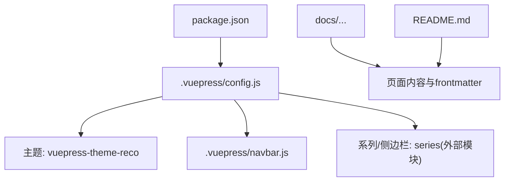
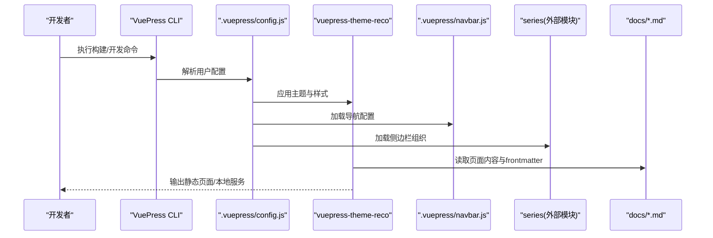
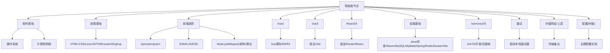
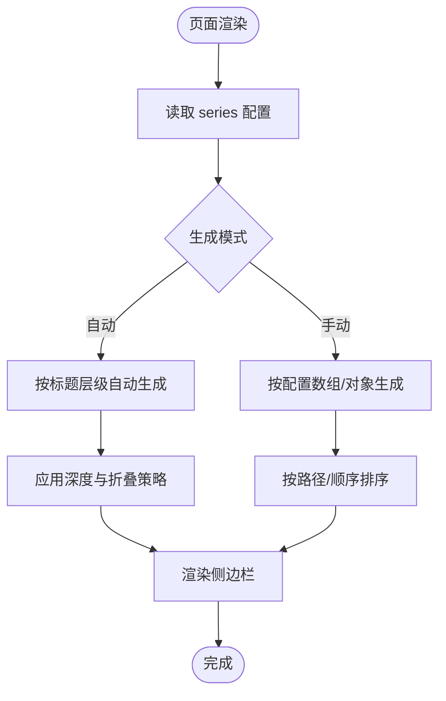
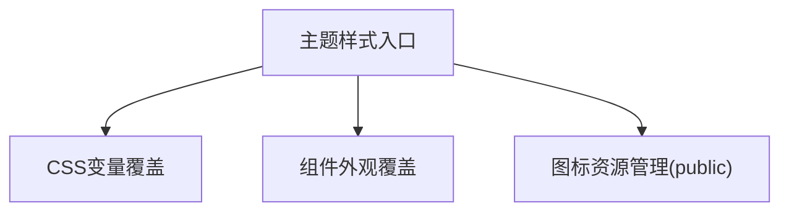
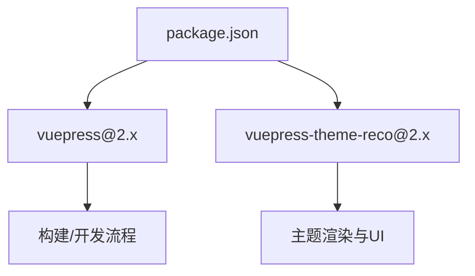

# VuePress配置

<cite>
**本文引用的文件**
- [.vuepress/config.js](file://.vuepress/config.js)
- [.vuepress/navbar.js](file://.vuepress/navbar.js)
- [package.json](file://package.json)
- [docs/frontend-base/javascript/grammar.md](file://docs/frontend-base/javascript/grammar.md)
- [README.md](file://README.md)
</cite>

## 目录
1. [简介](#简介)
2. [项目结构](#项目结构)
3. [核心组件](#核心组件)
4. [架构总览](#架构总览)
5. [详细组件分析](#详细组件分析)
6. [依赖分析](#依赖分析)
7. [性能考虑](#性能考虑)
8. [故障排查指南](#故障排查指南)
9. [结论](#结论)
10. [附录](#附录)

## 简介
本文件面向VuePress配置系统，围绕站点核心配置、导航栏、侧边栏组织、主题样式定制与SEO优化等方面，提供可操作的说明与最佳实践。本文基于仓库中的实际配置文件与文档示例，帮助读者快速理解并高效调整博客站点。

## 项目结构
本项目采用VuePress 2与主题vuepress-theme-reco的组合，配置集中在.vuepress目录，文档内容位于docs目录。关键入口与模块如下：
- 配置入口：.vuepress/config.js
- 导航栏配置：.vuepress/navbar.js
- 依赖与脚本：package.json
- 文档示例：docs/frontend-base/javascript/grammar.md
- 首页frontmatter示例：README.md

图表来源
- [.vuepress/config.js:1-18](file://.vuepress/config.js#L1-L18)
- [.vuepress/navbar.js:1-142](file://.vuepress/navbar.js#L1-L142)
- [package.json:1-17](file://package.json#L1-L17)
- [README.md:1-12](file://README.md#L1-L12)

章节来源
- [.vuepress/config.js:1-18](file://.vuepress/config.js#L1-L18)
- [.vuepress/navbar.js:1-142](file://.vuepress/navbar.js#L1-L142)
- [package.json:1-17](file://package.json#L1-L17)
- [README.md:1-12](file://README.md#L1-L12)

## 核心组件
本节聚焦.config.js中的核心配置项及其作用，帮助你理解站点的基础属性、主题与导航集成。

- 站点基础信息
  - title：站点标题
  - description：站点描述
  - logo：站点图标（相对路径）
  - base：部署路径前缀
- 主题与样式
  - theme：使用vuepress-theme-reco主题
  - style：内置样式包
  - colorMode：默认浅色模式
  - catalogTitle：目录标题
- 导航与侧边栏
  - navbar：从navbar.js导入的导航配置
  - series：从series模块导入的侧边栏组织

章节来源
- [.vuepress/config.js:5-17](file://.vuepress/config.js#L5-L17)

## 架构总览
VuePress在构建阶段读取配置，加载主题与导航/侧边栏模块，最终渲染页面。下图展示了从配置到页面的关键交互：

图表来源
- [.vuepress/config.js:1-18](file://.vuepress/config.js#L1-L18)
- [.vuepress/navbar.js:1-142](file://.vuepress/navbar.js#L1-L142)
- [package.json:8-12](file://package.json#L8-L12)

## 详细组件分析

### 导航栏配置 navbar.js
navbar.js定义了顶部导航的层级结构，支持多级菜单、外链与响应式行为。其结构要点：
- 顶层项：text为显示文本，children为子菜单数组
- 子菜单项：text为显示文本，link为内部路由；也可配置外链
- 特殊项：如“配置”指向主题官方文档，便于迁移与学习

图表来源
- [.vuepress/navbar.js:1-142](file://.vuepress/navbar.js#L1-L142)

章节来源
- [.vuepress/navbar.js:1-142](file://.vuepress/navbar.js#L1-L142)

### 侧边栏组织 series 系统
series作为外部模块被引入，用于统一管理侧边栏的组织方式。结合VuePress默认主题的侧边栏解析机制，series可实现：
- 自动目录生成：依据页面标题层级自动生成侧边栏
- 手动分类：通过配置数组或对象精确控制分组与排序
- 层级控制：通过深度与路径映射控制折叠与展开

图表来源
- [.vuepress/config.js:13-13](file://.vuepress/config.js#L13-L13)

章节来源
- [.vuepress/config.js:13-13](file://.vuepress/config.js#L13-L13)

### 主题样式定制
主题通过style与colorMode进行基础样式与模式控制，同时可通过以下方式扩展：
- CSS变量：在主题提供的样式入口中覆盖变量，实现颜色、字体、间距等统一调整
- 组件覆盖：在主题允许的范围内，通过客户端增强或样式注入替换默认组件外观
- 图标资源：将图标放置于public目录并通过导航/主题配置引用

图表来源
- [.vuepress/config.js:10-16](file://.vuepress/config.js#L10-L16)

章节来源
- [.vuepress/config.js:10-16](file://.vuepress/config.js#L10-L16)

### SEO与首页配置
- 站点元信息：title、description、base在配置中统一设定，有助于搜索引擎识别与路径正确性
- 首页frontmatter：通过home、modules、bannerBrand等字段控制首页展示与交互

章节来源
- [.vuepress/config.js:6-9](file://.vuepress/config.js#L6-L9)
- [README.md:1-12](file://README.md#L1-L12)

## 依赖分析
- VuePress版本：2.0.0-beta.60
- 主题：vuepress-theme-reco 2.0.0-beta.53
- 开发与构建脚本：dev/start/build

图表来源
- [package.json:8-16](file://package.json#L8-L16)

章节来源
- [package.json:1-17](file://package.json#L1-L17)

## 性能考虑
- 资源路径：base前缀确保多级部署时资源路径正确，避免404
- 图标与媒体：将常用图标置于public目录，减少打包体积与请求次数
- 导航层级：合理控制navbar层级深度，避免过多嵌套影响首屏渲染
- 侧边栏深度：series中按需设置深度，避免生成过深的目录树导致滚动卡顿

## 故障排查指南
- 导航无法显示或样式异常
  - 检查navbar.js语法与路径是否正确
  - 确认主题版本与配置兼容
- 侧边栏未生效
  - 确认series模块已正确导出并被config.js引用
  - 检查页面frontmatter中sidebar相关配置是否冲突
- 部署后资源404
  - 核对base路径与实际部署路径一致
  - 确保public中的静态资源路径正确
- 首页展示异常
  - 检查README.md的frontmatter字段是否完整且格式正确

## 结论
通过将导航、侧边栏与主题样式解耦至独立模块，并在config.js中集中管理，本项目实现了清晰的配置边界与良好的可维护性。建议在后续迭代中持续完善series的层级与自动目录策略，结合SEO与性能优化，进一步提升用户体验与可发现性。

## 附录
- 实际配置示例与修改指导
  - 修改站点标题与描述：在config.js中调整title与description字段
  - 添加新导航项：在navbar.js的对应分类下新增children项
  - 调整侧边栏深度：在series配置中设置合适的深度与路径映射
  - 部署路径修正：根据实际域名/子路径调整base字段
  - 首页内容定制：在README.md中调整home、modules、bannerBrand等字段

章节来源
- [.vuepress/config.js:6-16](file://.vuepress/config.js#L6-L16)
- [.vuepress/navbar.js:1-142](file://.vuepress/navbar.js#L1-L142)
- [README.md:1-12](file://README.md#L1-L12)