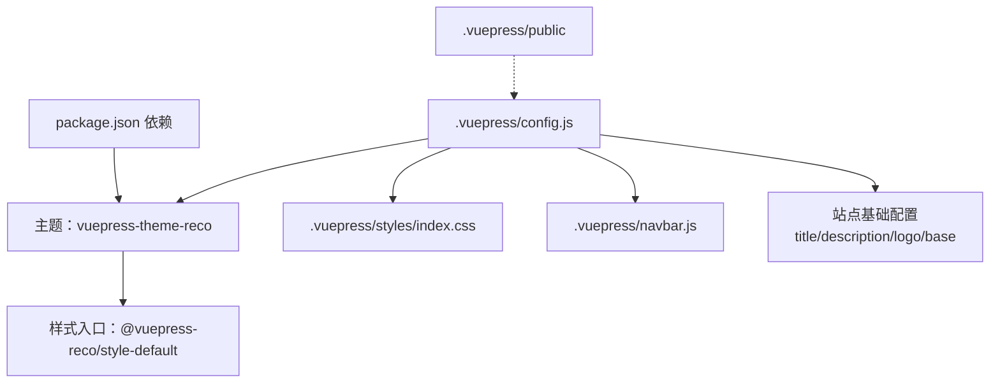
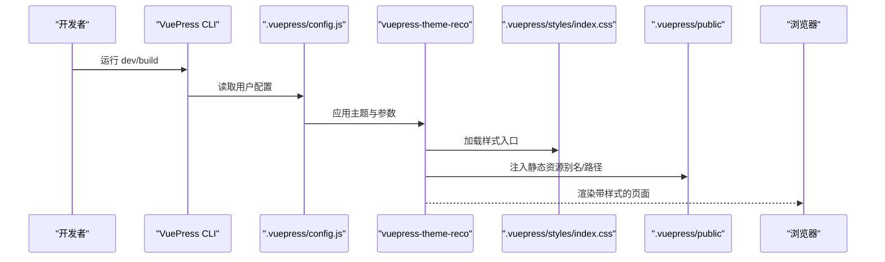
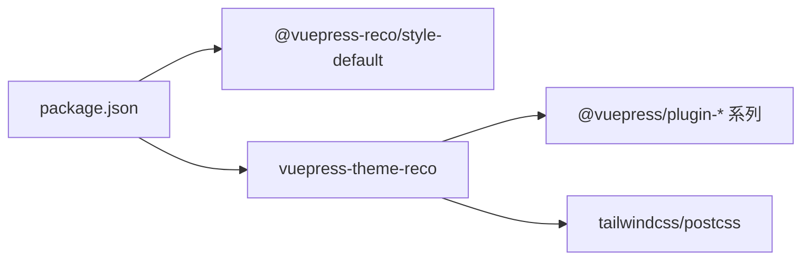

# 主题样式定制

<cite>
**本文引用的文件**
- [.vuepress/config.js](file://.vuepress/config.js)
- [.vuepress/styles/index.css](file://.vuepress/styles/index.css)
- [.vuepress/navbar.js](file://.vuepress/navbar.js)
- [package.json](file://package.json)
- [README.md](file://README.md)
</cite>

## 目录
1. [简介](#简介)
2. [项目结构](#项目结构)
3. [核心组件](#核心组件)
4. [架构总览](#架构总览)
5. [详细组件分析](#详细组件分析)
6. [依赖分析](#依赖分析)
7. [性能考虑](#性能考虑)
8. [故障排查指南](#故障排查指南)
9. [结论](#结论)
10. [附录](#附录)

## 简介
本文件面向VuePress主题样式定制，聚焦于基于 vuepress-theme-reco 的样式体系与定制实践。内容涵盖：
- CSS 变量与主题色系、字体、间距等全局样式的使用与覆盖方式
- 通过 .vuepress/styles 目录添加自定义样式与覆盖默认主题样式
- .vuepress/public 静态资源（图标、图片、字体）的管理与使用
- 响应式设计与主题切换的实现指导
- 样式调试技巧与性能优化建议

## 项目结构
该仓库采用标准 VuePress 结构，主题通过配置文件启用 reco 主题，并在 .vuepress/styles 中放置自定义样式，在 .vuepress/public 中放置静态资源。

图表来源
- [.vuepress/config.js:1-18](file://.vuepress/config.js#L1-L18)
- [package.json:1-17](file://package.json#L1-L17)

章节来源
- [.vuepress/config.js:1-18](file://.vuepress/config.js#L1-L18)
- [.vuepress/styles/index.css:1-105](file://.vuepress/styles/index.css#L1-L105)
- [.vuepress/navbar.js:1-142](file://.vuepress/navbar.js#L1-L142)
- [package.json:1-17](file://package.json#L1-L17)

## 核心组件
- 主题配置与入口
  - 使用 defineUserConfig 并通过 recoTheme 启用主题，设置 style、colorMode、导航栏、目录标题等参数。
- 自定义样式入口
  - 在 .vuepress/styles/index.css 中集中定义字体、排版、目录缩进、响应式容器等样式，并可覆盖默认主题样式。
- 导航栏配置
  - .vuepress/navbar.js 提供多级菜单与外部链接，影响页面头部导航与面包屑风格。
- 依赖与构建
  - package.json 指定 vuepress 与 vuepress-theme-reco 版本，确保主题样式与插件生态一致。

章节来源
- [.vuepress/config.js:1-18](file://.vuepress/config.js#L1-L18)
- [.vuepress/styles/index.css:1-105](file://.vuepress/styles/index.css#L1-L105)
- [.vuepress/navbar.js:1-142](file://.vuepress/navbar.js#L1-L142)
- [package.json:1-17](file://package.json#L1-L17)

## 架构总览
下图展示从配置到样式生效的关键路径：配置文件加载主题与样式入口，构建时合并自定义样式，最终渲染到页面。

图表来源
- [.vuepress/config.js:1-18](file://.vuepress/config.js#L1-L18)
- [.vuepress/styles/index.css:1-105](file://.vuepress/styles/index.css#L1-L105)

## 详细组件分析

### 主题与样式入口
- 主题参数
  - style: 指向 @vuepress-reco/style-default，作为默认样式基座
  - colorMode: light 固定浅色模式
  - navbar、series、catalogTitle：导航、侧边系列、目录标题
- 样式入口 index.css
  - 字体声明与回退链：包含本地字体与系统字体回退
  - 响应式容器高度：针对横竖屏适配
  - 代码块字体族：统一等宽字体族
  - 目录层级缩进与激活态样式
  - 段落、列表、标题间距与行高
  - 注释区保留了可选的背景与文字颜色覆盖示例

章节来源
- [.vuepress/config.js:1-18](file://.vuepress/config.js#L1-L18)
- [.vuepress/styles/index.css:1-105](file://.vuepress/styles/index.css#L1-L105)

### 导航栏与页面结构
- 导航栏
  - 多层级分类与外部链接，影响页面头部导航与面包屑风格
- 首页模块
  - README.md 使用 home/modules/bannerBrand 等字段控制首页模块与背景图路径

章节来源
- [.vuepress/navbar.js:1-142](file://.vuepress/navbar.js#L1-L142)
- [README.md:1-12](file://README.md#L1-L12)

### 静态资源管理（public）
- 资源位置
  - .vuepress/public 用于存放图标、图片、字体等静态资源
- 资源引用
  - 配置中 logo 使用 /logo.png；首页 bannerBrand.bgImage 使用 /bg.svg
  - 文档内图片可直接使用相对路径或以 / 开头的绝对路径（基于 base）

章节来源
- [.vuepress/config.js:6-9](file://.vuepress/config.js#L6-L9)
- [README.md:6-11](file://README.md#L6-L11)

### 响应式设计与主题切换
- 响应式
  - 在 index.css 中使用媒体查询对 banner 容器高度进行适配
- 主题切换
  - 当前配置固定 colorMode 为 light；如需支持深浅切换，可在配置中调整或扩展主题参数

章节来源
- [.vuepress/config.js:10-16](file://.vuepress/config.js#L10-L16)
- [.vuepress/styles/index.css:21-25](file://.vuepress/styles/index.css#L21-L25)

### 样式覆盖策略
- 入口优先
  - 将自定义样式置于 .vuepress/styles/index.css，构建时会合并到主题样式之后，从而实现覆盖
- 选择器权重
  - 对目录、导航、段落等元素使用具体类名与层级选择器，避免通配符污染
- 变量与主题
  - 如需覆盖主题变量，可在入口中引入变量声明或在自定义样式中重写对应属性

章节来源
- [.vuepress/styles/index.css:38-65](file://.vuepress/styles/index.css#L38-L65)
- [.vuepress/styles/index.css:66-104](file://.vuepress/styles/index.css#L66-L104)

## 依赖分析
- 主题与插件
  - vuepress-theme-reco 引入大量官方插件（如 back-to-top、medium-zoom、nprogress、search 等），这些插件自带样式，可通过自定义样式覆盖
- 构建工具
  - 使用 tailwindcss、postcss 等工具链，确保样式按顺序处理与合并

图表来源
- [package.json:13-16](file://package.json#L13-L16)
- [package.json:1-17](file://package.json#L1-L17)

章节来源
- [package.json:1-17](file://package.json#L1-L17)

## 性能考虑
- 减少全局重排
  - 避免在 index.css 中使用过多通配符与深层嵌套，降低选择器复杂度
- 字体加载
  - 本地字体与系统字体回退结合，减少网络请求；必要时为字体设置合适的 font-display
- 媒体查询
  - 合理拆分断点，避免在小设备上重复计算
- 资源体积
  - 控制自定义样式的体量，仅覆盖必要部分；将大段样式拆分为多个文件并在需要时按需引入

## 故障排查指南
- 样式未生效
  - 检查 .vuepress/styles/index.css 是否存在且路径正确
  - 确认选择器优先级是否足够覆盖主题默认样式
- 图片/字体 404
  - 确保资源位于 .vuepress/public 下，并使用正确的相对或绝对路径
  - 注意 base 配置导致的路径前缀
- 导航异常
  - 检查 .vuepress/navbar.js 的链接与层级是否正确
- 构建失败
  - 确认依赖版本与主题兼容性，避免版本冲突

章节来源
- [.vuepress/styles/index.css:1-105](file://.vuepress/styles/index.css#L1-L105)
- [.vuepress/config.js:6-9](file://.vuepress/config.js#L6-L9)
- [.vuepress/navbar.js:1-142](file://.vuepress/navbar.js#L1-L142)

## 结论
通过 .vuepress/styles 与 .vuepress/public 的配合，可以高效地完成主题样式定制与静态资源管理。遵循“入口优先、选择器权重、变量覆盖”的策略，可稳定实现主题色系、字体、间距与响应式布局的个性化需求。同时，合理利用现有插件样式与构建工具链，有助于在保证体验的同时提升性能与可维护性。

## 附录
- 快速清单
  - 在 .vuepress/styles/index.css 中新增或覆盖样式
  - 将图标、图片、字体放入 .vuepress/public，并在配置或页面中正确引用
  - 使用媒体查询适配移动端与桌面端
  - 如需深浅主题切换，调整 colorMode 或扩展主题参数