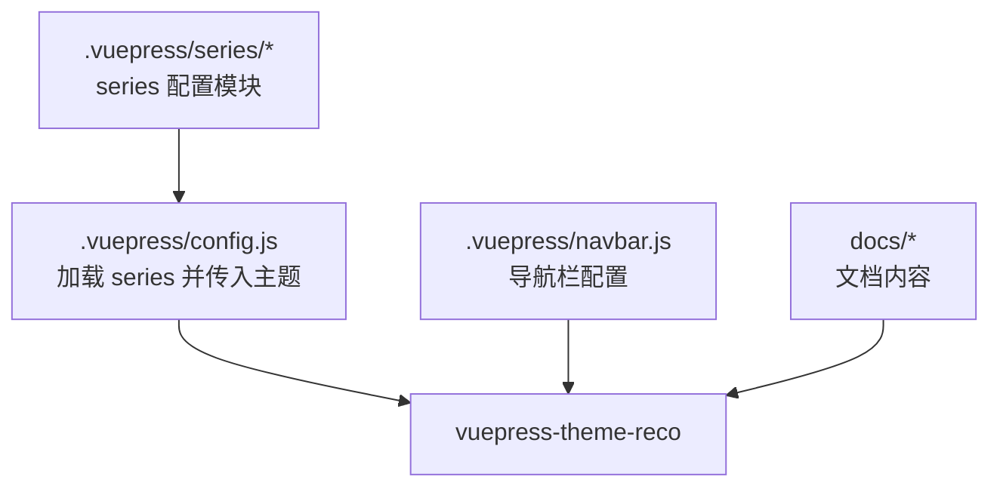
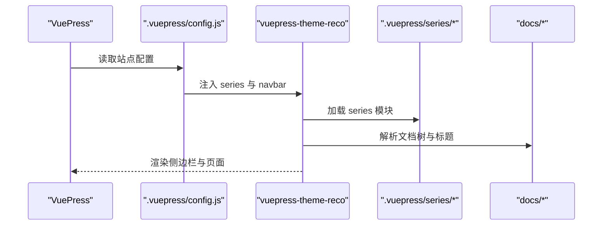
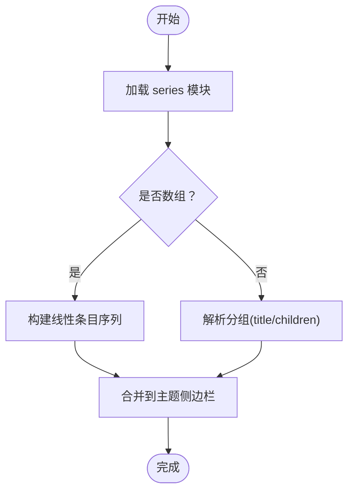
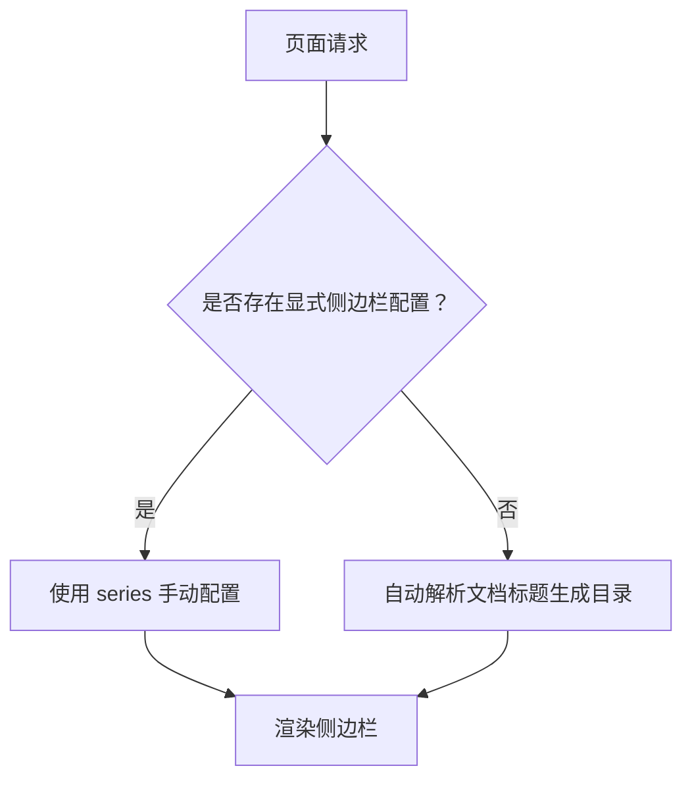
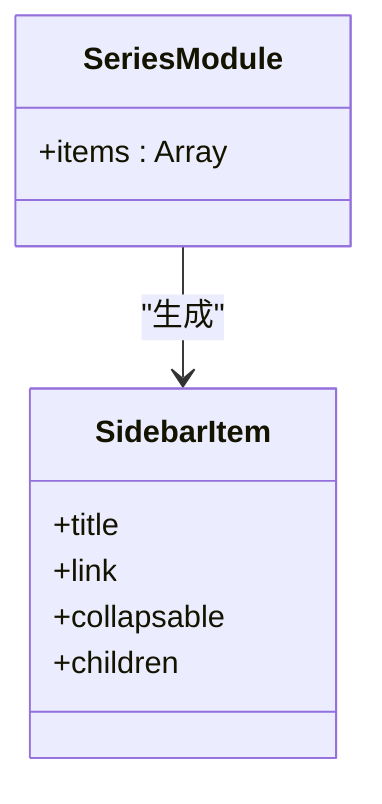
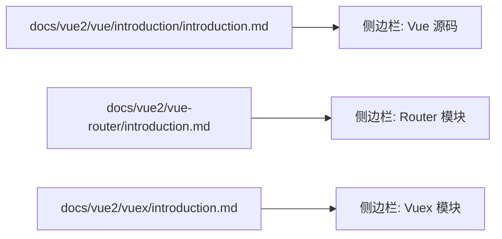
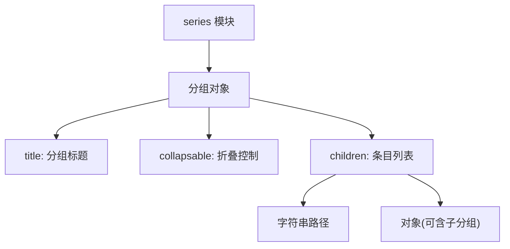
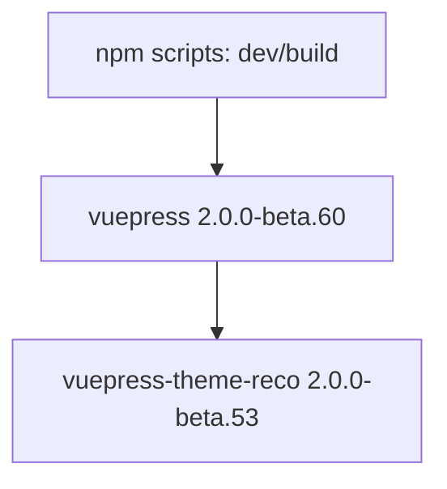

# 侧边栏配置

<cite>
**本文引用的文件**
- [.vuepress/config.js](file://.vuepress/config.js)
- [.vuepress/navbar.js](file://.vuepress/navbar.js)
- [package.json](file://package.json)
- [.vuepress/series/vue2/vuex.js](file://.vuepress/series/vue2/vuex.js)
- [docs/frontend-advanced/webpack/config.md](file://docs/frontend-advanced/webpack/config.md)
- [docs/vue2/vue/introduction/introduction.md](file://docs/vue2/vue/introduction/introduction.md)
- [docs/vue2/vue-router/introduction.md](file://docs/vue2/vue-router/introduction.md)
- [docs/vue2/vuex/introduction.md](file://docs/vue2/vuex/introduction.md)
</cite>

## 目录
1. [简介](#简介)
2. [项目结构](#项目结构)
3. [核心组件](#核心组件)
4. [架构总览](#架构总览)
5. [详细组件分析](#详细组件分析)
6. [依赖分析](#依赖分析)
7. [性能考虑](#性能考虑)
8. [故障排查指南](#故障排查指南)
9. [结论](#结论)
10. [附录](#附录)

## 简介
本技术文档围绕 VuePress 主题 reco 的侧边栏配置体系展开，重点解释 series 配置的组织结构与分类方法，涵盖自动目录生成与手动分类的实现路径；同时说明侧边栏层级控制、折叠行为、激活状态管理，以及如何结合文档结构自动生成目录、手动添加特殊链接与分组；最后给出样式定制与交互行为的配置建议，并提供多类内容的侧边栏配置示例与最佳实践。

## 项目结构
本仓库采用标准 VuePress 结构，主题为 vuepress-theme-reco，侧边栏数据通过 series 模块注入主题。关键文件与职责如下：
- .vuepress/config.js：站点配置入口，引入 series 并传入主题
- .vuepress/navbar.js：导航栏配置，与侧边栏共同构成页面顶部与左侧导航体系
- .vuepress/series：系列化侧边栏配置目录，按主题模块划分（如 vue2）
- docs：实际文档内容，侧边栏条目与文档路径一一对应
- package.json：运行脚本与依赖声明

图表来源
- [.vuepress/config.js:1-18](file://.vuepress/config.js#L1-L18)
- [.vuepress/navbar.js:1-142](file://.vuepress/navbar.js#L1-L142)

章节来源
- [.vuepress/config.js:1-18](file://.vuepress/config.js#L1-L18)
- [.vuepress/navbar.js:1-142](file://.vuepress/navbar.js#L1-L142)
- [package.json:1-17](file://package.json#L1-L17)

## 核心组件
- series 配置模块：以模块为单位组织侧边栏条目，支持数组式顺序与分组式层级
- 自动目录生成：基于文档标题与层级，自动生成侧边栏条目
- 手动分类：通过 series 模块显式定义分组、折叠与排序
- 激活状态管理：根据当前路由与文档标题，自动高亮匹配的侧边栏条目
- 折叠行为：通过 collapsable 控制分组是否默认展开
- 层级控制：通过分组嵌套与 children 字段控制层级深度

章节来源
- [.vuepress/config.js:1-18](file://.vuepress/config.js#L1-L18)
- [.vuepress/series/vue2/vuex.js:1-2](file://.vuepress/series/vue2/vuex.js#L1-L2)

## 架构总览
主题 reco 在启动时读取 .vuepress/config.js 中的 series 配置，并将其与文档树进行映射，形成最终的侧边栏结构。导航栏 navbar 与侧边栏共同提供用户在内容间的快速跳转。

图表来源
- [.vuepress/config.js:1-18](file://.vuepress/config.js#L1-L18)
- [.vuepress/navbar.js:1-142](file://.vuepress/navbar.js#L1-L142)

## 详细组件分析

### series 组织结构与分类方法
series 采用“模块化”组织方式，按主题模块划分（如 vue2），每个模块导出一个数组或对象，描述该模块的侧边栏条目顺序与分组。

- 数组式顺序：适用于线性学习路径，如 Vue2 的 Vuex 子模块
- 分组式层级：适用于复杂主题，通过 title 与 children 定义分组与子项

图表来源
- [.vuepress/series/vue2/vuex.js:1-2](file://.vuepress/series/vue2/vuex.js#L1-L2)

章节来源
- [.vuepress/series/vue2/vuex.js:1-2](file://.vuepress/series/vue2/vuex.js#L1-L2)

### 自动目录生成与手动分类
自动目录生成依赖主题对文档标题的解析；手动分类则通过 series 显式定义顺序与分组。两者可以组合使用：
- 自动：当某页面未设置显式侧边栏时，主题根据页面标题与层级自动生成
- 手动：通过 series 指定精确的顺序、分组与折叠

图表来源
- [.vuepress/config.js:1-18](file://.vuepress/config.js#L1-L18)

章节来源
- [.vuepress/config.js:1-18](file://.vuepress/config.js#L1-L18)

### 侧边栏层级控制、折叠行为与激活状态
- 层级控制：通过 children 嵌套实现分组层级；children 可为字符串路径或对象（含 title/children）
- 折叠行为：collapsable 控制分组默认展开/折叠
- 激活状态：主题根据当前路由与侧边栏条目路径进行匹配，自动高亮当前页对应的条目

图表来源
- [.vuepress/series/vue2/vuex.js:1-2](file://.vuepress/series/vue2/vuex.js#L1-L2)

章节来源
- [.vuepress/series/vue2/vuex.js:1-2](file://.vuepress/series/vue2/vuex.js#L1-L2)

### 文档结构与侧边栏映射
侧边栏条目与文档路径保持一致，确保用户点击后能正确跳转到目标页面。例如：
- docs/vue2/vue/introduction/introduction.md 对应侧边栏中的 Vue 源码介绍
- docs/vue2/vue-router/introduction.md 对应 Router 模块
- docs/vue2/vuex/introduction.md 对应 Vuex 模块

图表来源
- [docs/vue2/vue/introduction/introduction.md](file://docs/vue2/vue/introduction/introduction.md)
- [docs/vue2/vue-router/introduction.md](file://docs/vue2/vue-router/introduction.md)
- [docs/vue2/vuex/introduction.md](file://docs/vue2/vuex/introduction.md)

章节来源
- [docs/vue2/vue/introduction/introduction.md](file://docs/vue2/vue/introduction/introduction.md)
- [docs/vue2/vue-router/introduction.md](file://docs/vue2/vue-router/introduction.md)
- [docs/vue2/vuex/introduction.md](file://docs/vue2/vuex/introduction.md)

### 手动添加特殊链接与分组
在 series 中可通过对象形式添加分组与特殊链接，例如：
- title：分组标题
- collapsable：是否可折叠
- children：分组内条目列表（字符串路径或对象）

图表来源
- [.vuepress/series/vue2/vuex.js:1-2](file://.vuepress/series/vue2/vuex.js#L1-L2)

章节来源
- [.vuepress/series/vue2/vuex.js:1-2](file://.vuepress/series/vue2/vuex.js#L1-L2)

### 样式定制与交互行为
- 样式定制：通过主题提供的样式变量与类名进行覆盖（具体变量与类名请参考主题文档）
- 交互行为：折叠、高亮、滚动定位等由主题统一处理；如需调整可查阅主题配置项

章节来源
- [.vuepress/config.js:1-18](file://.vuepress/config.js#L1-L18)

### 不同内容类型的侧边栏配置示例与最佳实践
- Vue2/Vue3/React 等框架类：建议按“语法 → 路由 → 状态管理/构建工具”的顺序组织，便于学习路径闭环
- 工具链类（Webpack/构建工具）：建议按“入门 → 核心概念 → 进阶 → 实战案例”的顺序组织
- 数据库/中间件类：建议按“基础 → 进阶 → 实战 → 排错”的顺序组织
- 最佳实践：
  - 使用 series 明确模块边界与学习路径
  - 合理使用 collapsable 控制初始展开范围
  - 保持路径与文档结构一致，避免断链
  - 对长文档使用自动目录生成，短文档使用手动分组

章节来源
- [.vuepress/navbar.js:1-142](file://.vuepress/navbar.js#L1-L142)

## 依赖分析
- VuePress 版本：2.0.0-beta.60
- 主题：vuepress-theme-reco 2.0.0-beta.53
- 运行脚本：dev/build

图表来源
- [package.json:1-17](file://package.json#L1-L17)

章节来源
- [package.json:1-17](file://package.json#L1-L17)

## 性能考虑
- 侧边栏生成与文档解析在同一构建阶段完成，无需额外运行时开销
- 合理拆分 series 模块，避免单个模块过大导致渲染压力
- 使用自动目录生成时，注意标题层级与数量，避免过深或过多的子节点影响首屏渲染

## 故障排查指南
- 侧边栏不显示：检查 series 是否正确导出数组或对象，且路径与文档一致
- 折叠无效：确认 collapsable 字段是否正确设置
- 激活状态异常：检查当前页面路径与侧边栏条目路径是否完全匹配
- 导航栏与侧边栏不一致：核对 navbar 与 series 的模块划分是否一致

## 结论
通过 series 的模块化组织与自动/手动混合策略，可以高效地构建清晰、可维护的侧边栏体系。配合合理的层级控制、折叠与激活机制，能够显著提升用户的阅读与学习体验。

## 附录
- 示例文档路径参考：
  - [docs/frontend-advanced/webpack/config.md](file://docs/frontend-advanced/webpack/config.md)
  - [docs/vue2/vue/introduction/introduction.md](file://docs/vue2/vue/introduction/introduction.md)
  - [docs/vue2/vue-router/introduction.md](file://docs/vue2/vue-router/introduction.md)
  - [docs/vue2/vuex/introduction.md](file://docs/vue2/vuex/introduction.md)