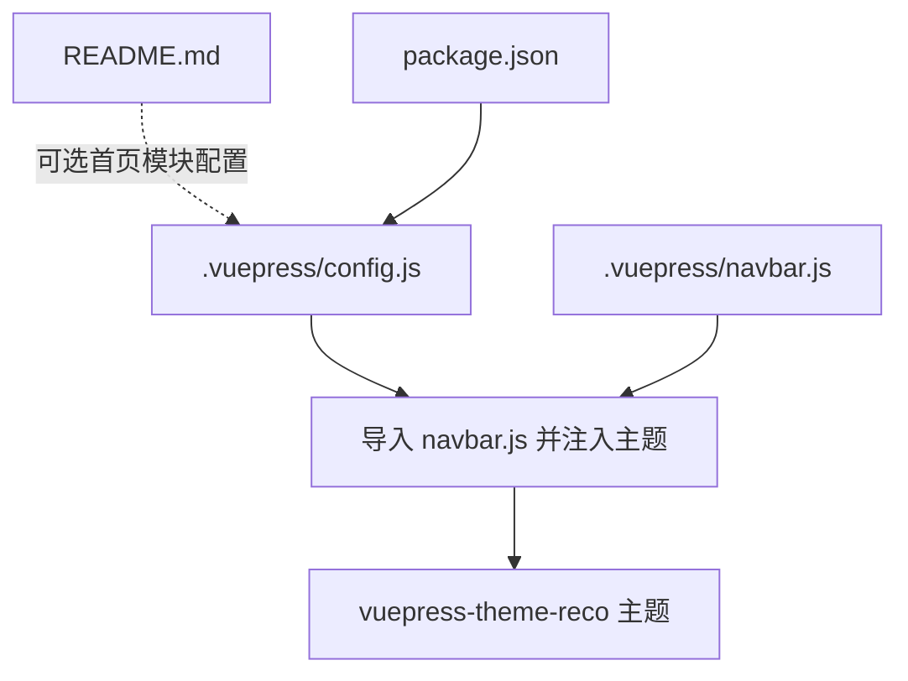
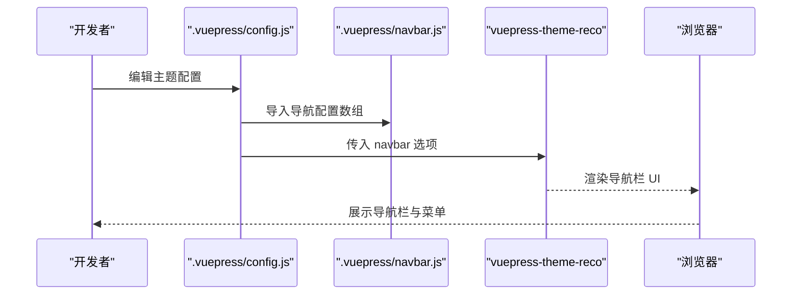
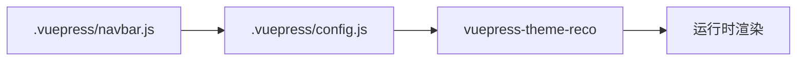

# 导航栏配置

<cite>
**本文引用的文件**
- [.vuepress/navbar.js](file://.vuepress/navbar.js)
- [.vuepress/config.js](file://.vuepress/config.js)
- [README.md](file://README.md)
- [package.json](file://package.json)
- [.vuepress/series/vue2/vue.js](file://.vuepress/series/vue2/vue.js)
</cite>

## 目录
1. [简介](#简介)
2. [项目结构](#项目结构)
3. [核心组件](#核心组件)
4. [架构总览](#架构总览)
5. [详细组件分析](#详细组件分析)
6. [依赖关系分析](#依赖关系分析)
7. [性能考量](#性能考量)
8. [故障排查指南](#故障排查指南)
9. [结论](#结论)
10. [附录](#附录)

## 简介
本技术文档围绕 VuePress 导航栏配置系统展开，重点解析 .vuepress/navbar.js 的结构与配置方法，涵盖：
- 单级菜单与多级菜单的创建方式
- 导航项属性（文本、链接、外链标识、图标等）的配置要点
- 响应式导航与移动端适配行为
- 导航栏自定义样式的指导（颜色、布局、交互效果）
- 实际配置示例与常见布局模式的实现思路

文档内容基于仓库中的现有配置进行分析与总结，帮助读者快速理解并扩展导航栏功能。

## 项目结构
本项目的导航栏配置位于 .vuepress/navbar.js，并通过 .vuepress/config.js 注入到主题中。整体结构如下：

图表来源
- [.vuepress/config.js:1-18](file://.vuepress/config.js#L1-L18)
- [.vuepress/navbar.js:1-142](file://.vuepress/navbar.js#L1-L142)

章节来源
- [.vuepress/config.js:1-18](file://.vuepress/config.js#L1-L18)
- [.vuepress/navbar.js:1-142](file://.vuepress/navbar.js#L1-L142)
- [README.md:1-12](file://README.md#L1-L12)
- [package.json:1-17](file://package.json#L1-L17)

## 核心组件
- 导航栏配置数组：由多个导航项对象组成，每个对象可包含 text、link、children 等字段，用于描述菜单层级与跳转目标。
- 主题注入：通过主题选项 navbar 将导航栏配置传入主题，实现导航渲染。
- 外链支持：导航项可直接使用外部链接，形成外链导航。
- 图标占位：当前配置中 icon 字段为空，可按需扩展图标资源。

章节来源
- [.vuepress/navbar.js:1-142](file://.vuepress/navbar.js#L1-L142)
- [.vuepress/config.js:10-16](file://.vuepress/config.js#L10-L16)

## 架构总览
导航栏在运行时的装配与渲染流程如下：

图表来源
- [.vuepress/config.js:1-18](file://.vuepress/config.js#L1-L18)
- [.vuepress/navbar.js:1-142](file://.vuepress/navbar.js#L1-L142)

## 详细组件分析

### 导航项结构与属性
- text：显示在导航栏上的文本标签。
- link：内部页面路径或外部链接地址；若为外部链接，建议以协议开头（例如 https://）。
- children：数组形式的子菜单项集合，支持多级嵌套（当前配置中已体现二级菜单）。
- icon：图标字段当前为空，可按主题支持情况扩展图标资源。

示例参考路径
- [导航项示例（多级菜单）:1-106](file://.vuepress/navbar.js#L1-L106)
- [导航项示例（外链）:113-141](file://.vuepress/navbar.js#L113-L141)

章节来源
- [.vuepress/navbar.js:1-142](file://.vuepress/navbar.js#L1-L142)

### 单级菜单与多级菜单
- 单级菜单：直接设置 text 与 link，无需 children。
- 多级菜单：设置 text 与 children，children 中的每一项为子菜单项，支持无限层级嵌套（当前实现以二级为主）。

示例参考路径
- [单级菜单示例:137-141](file://.vuepress/navbar.js#L137-L141)
- [多级菜单示例:1-106](file://.vuepress/navbar.js#L1-L106)

章节来源
- [.vuepress/navbar.js:1-142](file://.vuepress/navbar.js#L1-L142)

### 外链与内部链接
- 内部链接：以站点相对路径或绝对路径形式指定，如 /docs/xxx。
- 外链：以完整 URL 指定，如 https://example.com。

示例参考路径
- [外链示例:113-141](file://.vuepress/navbar.js#L113-L141)

章节来源
- [.vuepress/navbar.js:113-141](file://.vuepress/navbar.js#L113-L141)

### 响应式导航与移动端适配
- 主题层面：vuepress-theme-reco 提供响应式导航栏的默认行为，通常在窄屏设备上会折叠为汉堡菜单。
- 自定义样式：可通过主题提供的样式变量或自定义 CSS 进行微调（见“自定义样式”章节）。
- 菜单项数量与宽度：过多的菜单项可能导致移动端显示拥挤，建议合理拆分或合并菜单。

章节来源
- [.vuepress/config.js:10-16](file://.vuepress/config.js#L10-L16)

### 导航栏自定义样式
- 颜色与主题：通过主题选项 colorMode 控制明暗模式，结合主题内置样式变量进行统一风格控制。
- 布局与间距：根据需要调整导航项的间距、字体大小、背景色等，建议在主题允许范围内进行覆盖。
- 交互效果：hover、active 状态的视觉反馈可通过主题样式或自定义 CSS 实现。

示例参考路径
- [主题选项配置:10-16](file://.vuepress/config.js#L10-L16)

章节来源
- [.vuepress/config.js:10-16](file://.vuepress/config.js#L10-L16)

### 实际配置示例与常见布局模式
- 分类聚合型布局：将相似主题归类到同一父级菜单下，便于用户快速定位。
- 外链工具型布局：在导航栏中加入外部工具或参考链接，提升信息可达性。
- 配置引导型布局：提供指向主题官方文档的链接，帮助用户了解高级配置。

示例参考路径
- [分类聚合示例:1-106](file://.vuepress/navbar.js#L1-L106)
- [外链工具示例:113-141](file://.vuepress/navbar.js#L113-L141)

章节来源
- [.vuepress/navbar.js:1-142](file://.vuepress/navbar.js#L1-L142)

## 依赖关系分析
导航栏配置与主题的关系如下：

图表来源
- [.vuepress/navbar.js:1-142](file://.vuepress/navbar.js#L1-L142)
- [.vuepress/config.js:1-18](file://.vuepress/config.js#L1-L18)

章节来源
- [.vuepress/navbar.js:1-142](file://.vuepress/navbar.js#L1-L142)
- [.vuepress/config.js:1-18](file://.vuepress/config.js#L1-L18)

## 性能考量
- 菜单项数量：过多的导航项可能影响首屏渲染与交互性能，建议按需精简或分组。
- 外链加载：外链导航不会增加本地构建负担，但需注意外链可用性与加载速度。
- 主题样式：避免过度覆盖样式导致的重排与重绘，保持简洁一致的设计风格。

## 故障排查指南
- 导航不显示
  - 检查是否正确导入并传入 navbar 选项。
  - 确认导航项的 text、link 是否有效。
- 外链无法打开
  - 确认 link 为合法 URL，且协议正确。
- 移动端显示异常
  - 减少菜单项数量或合并同类目。
  - 检查主题的响应式配置与自定义样式覆盖。

章节来源
- [.vuepress/config.js:1-18](file://.vuepress/config.js#L1-L18)
- [.vuepress/navbar.js:1-142](file://.vuepress/navbar.js#L1-L142)

## 结论
本项目采用 vuepress-theme-reco 主题并通过 navbar 选项注入导航配置，实现了清晰的分类导航与外链工具集成。通过合理的菜单分组与外链组织，既能满足知识体系的展示需求，也能提升用户的浏览效率。建议在后续迭代中关注移动端体验与样式一致性，并根据业务增长持续优化导航结构。

## 附录
- 主题版本与依赖
  - VuePress 版本：参见 package.json 中的依赖声明。
  - 主题版本：vuepress-theme-reco 2.0.0-beta.53。

章节来源
- [package.json:1-17](file://package.json#L1-L17)