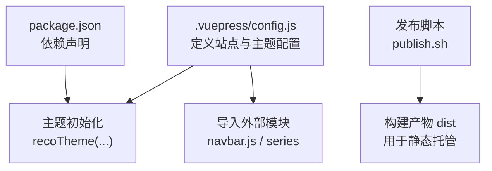
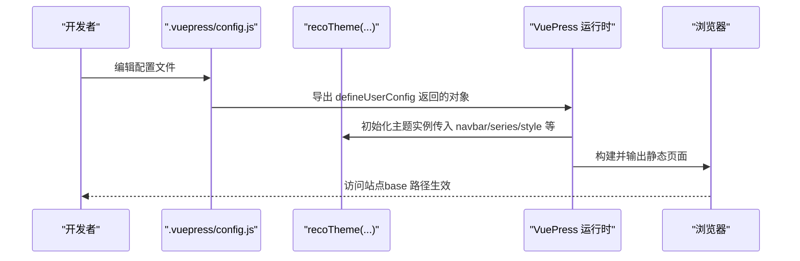
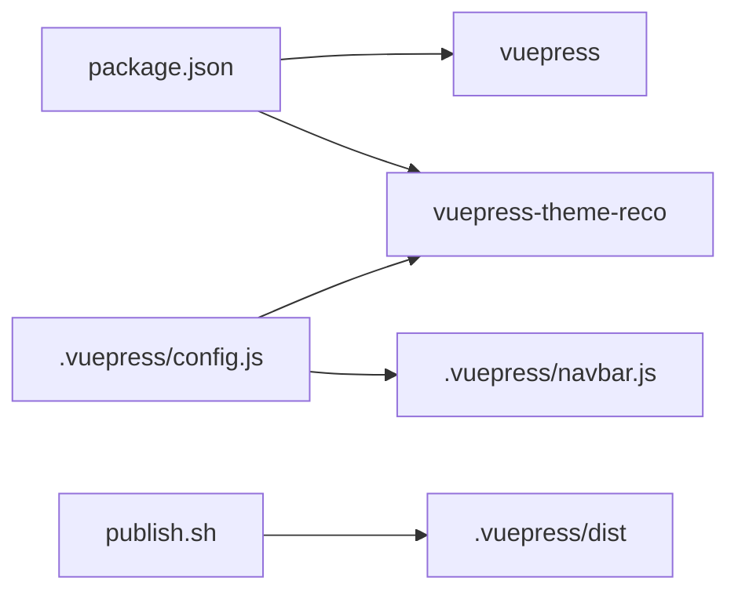

# 核心配置

<cite>
**本文引用的文件**
- [.vuepress/config.js](file://.vuepress/config.js)
- [.vuepress/navbar.js](file://.vuepress/navbar.js)
- [package.json](file://package.json)
- [publish.sh](file://publish.sh)
- [README.md](file://README.md)
</cite>

## 目录
1. [简介](#简介)
2. [项目结构](#项目结构)
3. [核心组件](#核心组件)
4. [架构总览](#架构总览)
5. [详细组件分析](#详细组件分析)
6. [依赖分析](#依赖分析)
7. [性能考虑](#性能考虑)
8. [故障排查指南](#故障排查指南)
9. [结论](#结论)
10. [附录](#附录)

## 简介
本文件面向VuePress核心配置，聚焦于 .vuepress/config.js 的配置项与主题初始化，系统性解释以下内容：
- 站点基本信息（title、description、logo）的作用与取值建议
- 基础路径配置（base）与部署路径的关系
- 主题选择与初始化（reco主题）的关键参数
- defineUserConfig 函数的使用方法与最佳实践
- 配置项之间的依赖关系与优先级规则
- 常见问题与排障建议
- 完整配置示例与参数说明（以路径引用代替代码片段）

## 项目结构
本项目采用标准的 VuePress 2.x 结构，核心配置位于 .vuepress/config.js，导航栏配置位于 .vuepress/navbar.js，主题依赖通过 package.json 管理。

图表来源
- [.vuepress/config.js:1-17](file://.vuepress/config.js#L1-L17)
- [package.json:13-16](file://package.json#L13-L16)
- [publish.sh:1-20](file://publish.sh#L1-L20)

章节来源
- [.vuepress/config.js:1-17](file://.vuepress/config.js#L1-L17)
- [package.json:1-17](file://package.json#L1-L17)
- [publish.sh:1-20](file://publish.sh#L1-L20)

## 核心组件
本节聚焦 .vuepress/config.js 中的核心配置项及其职责：
- 站点元信息：title、description、logo
- 基础路径：base
- 主题初始化：recoTheme(...)
- 导航与侧边栏：navbar、series（通过导入外部模块注入）

章节来源
- [.vuepress/config.js:5-17](file://.vuepress/config.js#L5-L17)
- [.vuepress/navbar.js:1-142](file://.vuepress/navbar.js#L1-L142)

## 架构总览
下面的序列图展示了从配置到主题渲染的关键调用链路，体现 defineUserConfig 与主题初始化的关系。

图表来源
- [.vuepress/config.js:1-17](file://.vuepress/config.js#L1-L17)

## 详细组件分析

### 站点基本信息（title、description、logo）
- title：站点标题，用于页面标题与 SEO 标题前缀
- description：站点描述，用于 meta description
- logo：站点图标路径，通常为相对路径，需确保在 public 目录或可访问的静态资源路径下

最佳实践
- logo 建议使用与主题风格一致的矢量或高分辨率图片
- title 与 description 应简洁明确，避免过长

章节来源
- [.vuepress/config.js:6-8](file://.vuepress/config.js#L6-L8)

### 基础路径配置（base）
- base：部署的基础路径，影响所有内部链接与静态资源路径
- 在 GitHub Pages 等平台部署时，base 必须与仓库子路径一致，否则会导致资源 404

部署建议
- 若部署在子路径（如 /my-blog/），base 应设为相同前缀
- 发布脚本中构建产物 dist 会被推送到指定分支，最终由托管平台按 base 提供服务

章节来源
- [.vuepress/config.js](file://.vuepress/config.js#L9)
- [publish.sh](file://publish.sh#L14)

### 主题选择与初始化（reco 主题）
- 主题导入：通过 import 引入 reco 主题
- 主题初始化：调用 recoTheme(...) 并传入主题参数
- 关键参数说明（来自配置文件实际传参）：
  - style：样式包标识，用于主题样式层
  - colorMode：颜色模式（如 light），控制主题明暗模式
  - series：侧边栏结构数据（通过外部模块注入）
  - navbar：导航栏数据（通过外部模块注入）
  - catalogTitle：目录标题文案（用于文章目录展示）

依赖关系
- navbar 与 series 通过外部模块导入，分别负责导航与侧边栏结构
- catalogTitle 仅影响目录标题文案，不影响导航与侧边栏结构

章节来源
- [.vuepress/config.js:1-17](file://.vuepress/config.js#L1-L17)
- [.vuepress/navbar.js:1-142](file://.vuepress/navbar.js#L1-L142)

### defineUserConfig 函数的使用方法
- 作用：封装并导出 VuePress 用户配置对象，供运行时读取
- 使用要点：
  - 通过 import { defineUserConfig } from 'vuepress' 导入
  - 返回的对象包含站点元信息、基础路径、主题等
  - 与主题初始化（如 recoTheme(...)）配合使用

最佳实践
- 将可复用的 navbar/series 等结构拆分为独立模块，便于维护
- 对于多环境（开发/生产）差异，可在外部脚本或环境变量中控制部分配置

章节来源
- [.vuepress/config.js:1-5](file://.vuepress/config.js#L1-L5)

### 导入与配置 reco 主题
- 导入：import recoTheme from 'vuepress-theme-reco'
- 初始化：在 theme 字段中调用 recoTheme(...) 并传入所需参数
- 参数注入：navbar 与 series 通过外部模块导入并在主题初始化时传入

注意事项
- 确保主题依赖已安装（package.json 中声明）
- navbar/series 的结构需与主题期望一致，避免渲染异常

章节来源
- [.vuepress/config.js:1-17](file://.vuepress/config.js#L1-L17)
- [package.json:13-16](file://package.json#L13-L16)

### 配置项之间的依赖关系与优先级
- 配置对象的字段之间无直接依赖，但存在逻辑依赖：
  - base 与部署路径强相关，若不匹配会导致资源 404
  - navbar/series 与主题渲染强相关，缺失会导致导航或侧边栏为空
  - catalogTitle 仅影响目录标题文案
- 优先级规则（基于配置对象的字段顺序与主题初始化）：
  - defineUserConfig 返回的对象字段即为最终生效配置
  - 主题初始化参数（如 navbar/series）优先于主题默认值
  - 若 navbar/series 未传入，主题可能使用默认结构或空结构

章节来源
- [.vuepress/config.js:5-17](file://.vuepress/config.js#L5-L17)
- [.vuepress/navbar.js:1-142](file://.vuepress/navbar.js#L1-L142)

### 配置修改的最佳实践
- 基础路径（base）：先确定部署路径，再设置 base，避免重复构建与资源 404
- 导航与侧边栏：将 navbar/series 拆分为独立模块，便于维护与复用
- 主题参数：保持参数与主题版本兼容，避免因参数变更导致初始化失败
- 资源路径：logo 等静态资源需放置在可访问路径，避免构建后资源丢失

章节来源
- [.vuepress/config.js:5-17](file://.vuepress/config.js#L5-L17)
- [publish.sh:1-20](file://publish.sh#L1-L20)

### 常见错误与处理方法
- 资源 404：检查 base 是否与部署路径一致；确认静态资源路径是否正确
- 导航/侧边栏为空：检查 navbar/series 是否正确导入且结构符合主题要求
- 主题初始化失败：确认主题依赖已安装，参数名称与主题版本兼容
- 构建产物未更新：检查发布脚本是否正确推送 dist 到目标分支

章节来源
- [.vuepress/config.js:5-17](file://.vuepress/config.js#L5-L17)
- [publish.sh:1-20](file://publish.sh#L1-L20)

## 依赖分析
- 运行时依赖
  - vuepress：VuePress 核心框架
  - vuepress-theme-reco：reco 主题
- 开发与脚本
  - package.json 中定义了 dev/build 脚本，用于本地开发与构建
  - publish.sh 负责构建并推送 dist 到远程分支

图表来源
- [package.json:13-16](file://package.json#L13-L16)
- [.vuepress/config.js:1-17](file://.vuepress/config.js#L1-L17)
- [.vuepress/navbar.js:1-142](file://.vuepress/navbar.js#L1-L142)
- [publish.sh:1-20](file://publish.sh#L1-L20)

章节来源
- [package.json:1-17](file://package.json#L1-L17)
- [.vuepress/config.js:1-17](file://.vuepress/config.js#L1-L17)
- [.vuepress/navbar.js:1-142](file://.vuepress/navbar.js#L1-L142)
- [publish.sh:1-20](file://publish.sh#L1-L20)

## 性能考虑
- 静态资源优化：合理放置 logo 等资源，避免过大体积影响首屏加载
- 构建缓存：在 CI/CD 中启用构建缓存，减少重复安装依赖的时间
- 路由与目录：保持 navbar/series 结构清晰，避免过深嵌套导致渲染开销增大

## 故障排查指南
- 构建失败
  - 检查 package.json 中依赖版本是否与主题兼容
  - 确认 Node 版本满足 VuePress 2.x 要求
- 部署后 404
  - 确认 base 与部署路径一致
  - 检查 publish.sh 推送的目标分支与远程仓库配置
- 导航/侧边栏异常
  - 检查 navbar/series 模块是否正确导出数组结构
  - 确认主题初始化时传入的参数与主题期望一致

章节来源
- [package.json:13-16](file://package.json#L13-L16)
- [.vuepress/config.js:5-17](file://.vuepress/config.js#L5-L17)
- [publish.sh:1-20](file://publish.sh#L1-L20)

## 结论
本文件围绕 .vuepress/config.js 的核心配置项与主题初始化进行了系统化解读，明确了站点元信息、基础路径、主题参数与外部模块导入之间的关系。遵循本文的最佳实践与排障建议，可有效提升配置的稳定性与可维护性，并降低部署与运行时的常见问题。

## 附录
- 完整配置示例与参数说明（以路径引用代替代码片段）
  - 站点元信息与基础路径：参见 [.vuepress/config.js:6-9](file://.vuepress/config.js#L6-L9)
  - 主题初始化与参数：参见 [.vuepress/config.js:10-16](file://.vuepress/config.js#L10-L16)
  - 导航栏结构：参见 [.vuepress/navbar.js:1-142](file://.vuepress/navbar.js#L1-L142)
  - 依赖声明与脚本：参见 [package.json:8-16](file://package.json#L8-L16)
  - 发布脚本与部署流程：参见 [publish.sh:1-20](file://publish.sh#L1-L20)
  - 首页布局与模块配置（可选）：参见 [README.md:1-12](file://README.md#L1-L12)