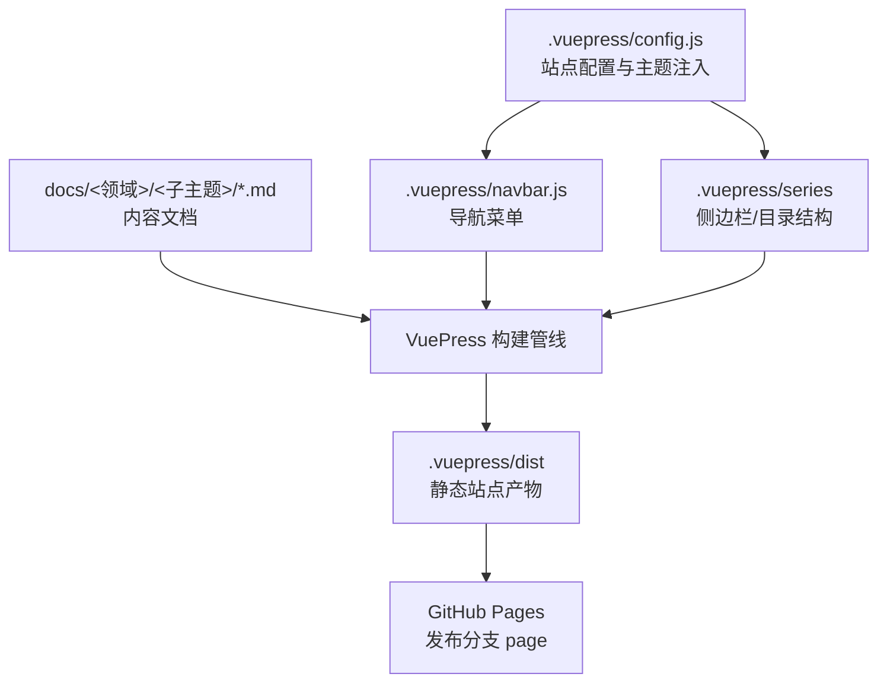
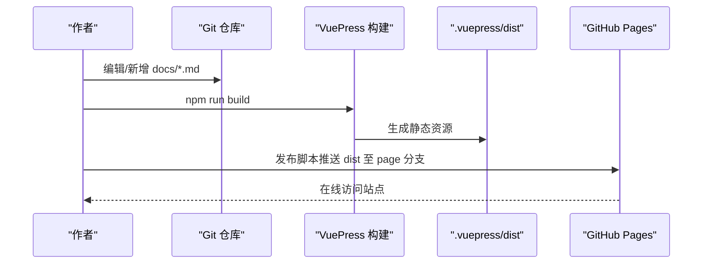
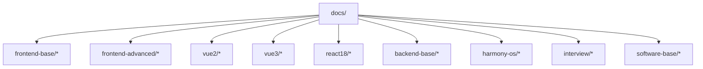
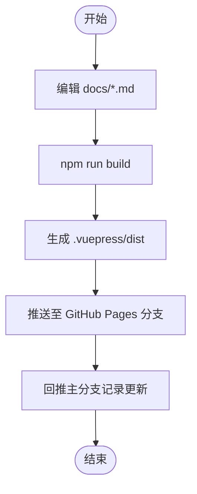
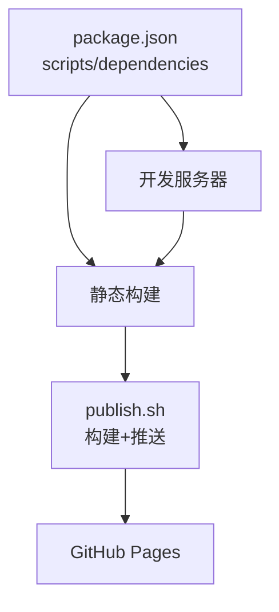

# 内容管理

<cite>
**本文引用的文件**
- [README.md](file://README.md)
- [package.json](file://package.json)
- [.vuepress/config.js](file://.vuepress/config.js)
- [.vuepress/navbar.js](file://.vuepress/navbar.js)
- [publish.sh](file://publish.sh)
- [docs/frontend-base/javascript/array.md](file://docs/frontend-base/javascript/array.md)
- [docs/backend-base/java/oop.md](file://docs/backend-base/java/oop.md)
- [docs/interview/vue/vue.md](file://docs/interview/vue/vue.md)
- [docs/frontend-advanced/algorithm/Algorithm.md](file://docs/frontend-advanced/algorithm/Algorithm.md)
- [docs/backend-base/mysql/base.md](file://docs/backend-base/mysql/base.md)
- [docs/interview/javascript/data_type.md](file://docs/interview/javascript/data_type.md)
- [docs/frontend-base/typescript/grammar.md](file://docs/frontend-base/typescript/grammar.md)
- [docs/vue2/vue/readme.md](file://docs/vue2/vue/readme.md)
</cite>

## 目录
1. [简介](#简介)
2. [项目结构](#项目结构)
3. [核心组件](#核心组件)
4. [架构总览](#架构总览)
5. [详细组件分析](#详细组件分析)
6. [依赖分析](#依赖分析)
7. [性能考虑](#性能考虑)
8. [故障排查指南](#故障排查指南)
9. [结论](#结论)
10. [附录](#附录)

## 简介
本文件面向内容管理者与创作者，系统化阐述该技术博客内容管理方案：涵盖 docs 目录的结构设计与分类原则、Markdown 编写规范与最佳实践、版本管理与发布流程、内容索引与搜索实现原理、内容创作工作流与质量控制标准，并提供可直接参考的示例与模板使用指引。目标是帮助团队高效组织与沉淀前端基础、前端进阶、后端开发、Vue 框架、面试准备等技术领域的知识资产。

## 项目结构
该博客采用 VuePress 2 + 主题进行构建，内容集中在 docs 目录，导航栏与侧边栏由主题配置与导航文件共同驱动，构建产物部署至 GitHub Pages。

图表来源
- [.vuepress/config.js:1-18](file://.vuepress/config.js#L1-L18)
- [.vuepress/navbar.js:1-142](file://.vuepress/navbar.js#L1-L142)
- [publish.sh:1-20](file://publish.sh#L1-L20)

章节来源
- [.vuepress/config.js:1-18](file://.vuepress/config.js#L1-L18)
- [.vuepress/navbar.js:1-142](file://.vuepress/navbar.js#L1-L142)
- [package.json:1-17](file://package.json#L1-L17)
- [publish.sh:1-20](file://publish.sh#L1-L20)

## 核心组件
- 站点配置与主题注入：通过配置文件启用主题、设置基础路径、目录标题等。
- 导航与侧边栏：导航栏定义技术领域入口，侧边栏由主题 series 驱动，形成层级化索引。
- 内容组织：docs 下按技术领域划分目录，每个子主题下按知识点细分子目录或文件。
- 构建与发布：本地开发/构建脚本与自动化发布脚本，将 dist 推送到 GitHub Pages 分支。

章节来源
- [.vuepress/config.js:1-18](file://.vuepress/config.js#L1-L18)
- [.vuepress/navbar.js:1-142](file://.vuepress/navbar.js#L1-L142)
- [package.json:1-17](file://package.json#L1-L17)
- [publish.sh:1-20](file://publish.sh#L1-L20)

## 架构总览
内容从 Markdown 文档出发，经 VuePress 解析与主题渲染，生成静态站点，最终发布到 GitHub Pages。导航与索引由配置与主题共同提供。

图表来源
- [package.json:8-12](file://package.json#L8-L12)
- [publish.sh:1-20](file://publish.sh#L1-L20)

章节来源
- [package.json:1-17](file://package.json#L1-L17)
- [publish.sh:1-20](file://publish.sh#L1-L20)

## 详细组件分析

### docs 目录结构与分类原则
- 前端基础：HTML、CSS、Less、JavaScript、TypeScript、Browser、RegExp 等。
- 前端进阶：npm/yarn/pnpm、ESM/CJS、JS 深入、JS 手写实现、ES6、Node.js、Webpack5、前端项目架构、算法。
- Vue2/Vue3：Vue 源码、Router 源码、Vuex/Pinia 语法、Vite。
- React18：React 语法、Router6 语法、Redux 语法。
- 后端基础：Java、并发编程、Maven、MySQL、MyBatis、Spring、Redis、Docker、Kubernetes。
- HarmonyOS：ArkTS、开发、程序包基础。
- 面试：CSS、JavaScript、TypeScript、ES6、HTTP、Vue、React、Git、Linux、Node、Webpack、设计模式、小程序。
- 软件基础：操作系统、计算机网络。
- 价值网站与工具：外部链接与辅助工具。

图表来源
- [.vuepress/navbar.js:1-142](file://.vuepress/navbar.js#L1-L142)

章节来源
- [.vuepress/navbar.js:1-142](file://.vuepress/navbar.js#L1-L142)

### Markdown 文档编写规范与最佳实践
- 标题层级：建议使用 # 作为主标题，## 作为章节标题，避免跨级跳跃；正文使用三级标题组织子节。
- 代码块：使用三反引号包裹，标注语言类型以便高亮；长代码建议拆分、配以简洁注释。
- 图片处理：相对路径引用，遵循“文档同级 images 或 assets 目录”；图片命名语义化，配合 alt 文案。
- 链接规范：站内链接使用相对路径或主题约定的路由；外链使用绝对 URL；避免死链。
- 表格与列表：复杂表格建议居中/对齐，避免过宽；嵌套列表层级不超过三层。
- 术语与类型：TypeScript/JS 类型、Java 类型等，使用代码样式包裹，保持一致性。
- 示例与模板：可参考现有文档的结构与风格，如前端基础数组方法、Java 面向对象、面试 Vue 概念、算法概览等。

章节来源
- [docs/frontend-base/javascript/array.md:1-550](file://docs/frontend-base/javascript/array.md#L1-L550)
- [docs/backend-base/java/oop.md:1-223](file://docs/backend-base/java/oop.md#L1-L223)
- [docs/interview/vue/vue.md:1-119](file://docs/interview/vue/vue.md#L1-L119)
- [docs/frontend-advanced/algorithm/Algorithm.md:1-60](file://docs/frontend-advanced/algorithm/Algorithm.md#L1-L60)
- [docs/backend-base/mysql/base.md:1-30](file://docs/backend-base/mysql/base.md#L1-L30)
- [docs/interview/javascript/data_type.md:1-200](file://docs/interview/javascript/data_type.md#L1-L200)
- [docs/frontend-base/typescript/grammar.md:1-200](file://docs/frontend-base/typescript/grammar.md#L1-L200)

### 版本管理策略与更新流程
- 本地开发：使用脚本启动开发服务器，实时预览变更。
- 构建产物：构建后生成静态站点，位于 .vuepress/dist。
- 自动发布：发布脚本自动提交并推送到 GitHub Pages 分支，随后回推主分支以记录更新。
- 流程要点：先构建，再推送；确保链接与图片路径正确；避免破坏性改动影响导航与索引。

图表来源
- [publish.sh:1-20](file://publish.sh#L1-L20)
- [package.json:8-12](file://package.json#L8-L12)

章节来源
- [publish.sh:1-20](file://publish.sh#L1-L20)
- [package.json:1-17](file://package.json#L1-L17)

### 内容索引与搜索实现原理
- 导航索引：导航栏定义一级入口，点击进入对应领域；二级入口由主题侧边栏(series)与目录(title)联动，形成层级索引。
- 目录标题：站点配置中设置目录标题，便于统一呈现。
- 搜索能力：VuePress 主题内置搜索，结合 Markdown frontmatter 与标题层级，自动构建可检索索引。

图表来源
- [.vuepress/config.js:10-16](file://.vuepress/config.js#L10-L16)
- [.vuepress/navbar.js:1-142](file://.vuepress/navbar.js#L1-L142)

章节来源
- [.vuepress/config.js:1-18](file://.vuepress/config.js#L1-L18)
- [.vuepress/navbar.js:1-142](file://.vuepress/navbar.js#L1-L142)

### 内容创作工作流程与质量控制
- 规划阶段：依据导航与领域划分，确定主题与子主题，制定大纲。
- 写作阶段：遵循标题层级、代码块、图片与链接规范；参考现有文档风格。
- 审阅阶段：检查链接有效性、图片路径、术语一致性、语言表达与逻辑结构。
- 发布阶段：本地预览无误后，执行构建与发布脚本，核验在线站点。
- 维护阶段：定期回顾与更新，修复死链与过时内容。

章节来源
- [.vuepress/navbar.js:1-142](file://.vuepress/navbar.js#L1-L142)
- [publish.sh:1-20](file://publish.sh#L1-L20)

### 实际内容示例与模板使用
- 前端基础数组方法：可作为“知识点梳理 + 方法清单 + 示例”的模板参考。
- Java 面向对象：可作为“概念讲解 + 代码片段 + 表格总结”的模板参考。
- 面试 Vue：可作为“历史背景 + 核心特性 + 对比分析 + 示例图示”的模板参考。
- 算法概览：可作为“定义 + 特性 + 应用场景 + 结构示例”的模板参考。
- MySQL 基础：可作为“规范 + 命令 + 注意事项”的模板参考。
- TypeScript 语法：可作为“类型体系 + 语法示例 + 类型收缩”的模板参考。

章节来源
- [docs/frontend-base/javascript/array.md:1-550](file://docs/frontend-base/javascript/array.md#L1-L550)
- [docs/backend-base/java/oop.md:1-223](file://docs/backend-base/java/oop.md#L1-L223)
- [docs/interview/vue/vue.md:1-119](file://docs/interview/vue/vue.md#L1-L119)
- [docs/frontend-advanced/algorithm/Algorithm.md:1-60](file://docs/frontend-advanced/algorithm/Algorithm.md#L1-L60)
- [docs/backend-base/mysql/base.md:1-30](file://docs/backend-base/mysql/base.md#L1-L30)
- [docs/frontend-base/typescript/grammar.md:1-200](file://docs/frontend-base/typescript/grammar.md#L1-L200)
- [docs/vue2/vue/readme.md:1-2](file://docs/vue2/vue/readme.md#L1-L2)

## 依赖分析
- 构建工具：VuePress 2 与主题依赖。
- 脚本命令：dev/start/build 用于开发与构建。
- 发布脚本：自动构建并推送静态站点至 GitHub Pages。

图表来源
- [package.json:1-17](file://package.json#L1-L17)
- [publish.sh:1-20](file://publish.sh#L1-L20)

章节来源
- [package.json:1-17](file://package.json#L1-L17)
- [publish.sh:1-20](file://publish.sh#L1-L20)

## 性能考虑
- 构建体积：减少不必要的图片与大段代码，合理拆分示例。
- 链接与资源：使用相对路径，避免重复下载与跨域问题。
- 主题与插件：按需启用，避免冗余插件影响构建时间。
- 预览与缓存：利用本地开发服务器快速验证，上线前进行全站链接检查。

## 故障排查指南
- 构建失败：检查 package.json 中脚本与依赖版本；确认 .vuepress 配置正确。
- 导航缺失：核对 .vuepress/navbar.js 中的链接与路径；确保 docs 下文件存在。
- 图片/链接失效：使用相对路径；在本地预览后再发布。
- 发布失败：检查发布脚本中的远程仓库地址与分支；确认推送权限。

章节来源
- [package.json:1-17](file://package.json#L1-L17)
- [.vuepress/navbar.js:1-142](file://.vuepress/navbar.js#L1-L142)
- [publish.sh:1-20](file://publish.sh#L1-L20)

## 结论
通过明确的目录结构、统一的 Markdown 规范、规范化的版本与发布流程，以及由主题驱动的导航与索引，本博客实现了高质量、可维护、易扩展的内容管理体系。建议持续完善模板与审阅流程，保障内容质量与用户体验。

## 附录
- 站点基础信息与入口：首页 frontmatter 定义了首页模块与横幅信息。
- 导航与目录：导航栏覆盖前端、后端、框架、面试等全部领域；目录标题在配置中统一设置。

章节来源
- [README.md:1-12](file://README.md#L1-L12)
- [.vuepress/config.js:1-18](file://.vuepress/config.js#L1-L18)