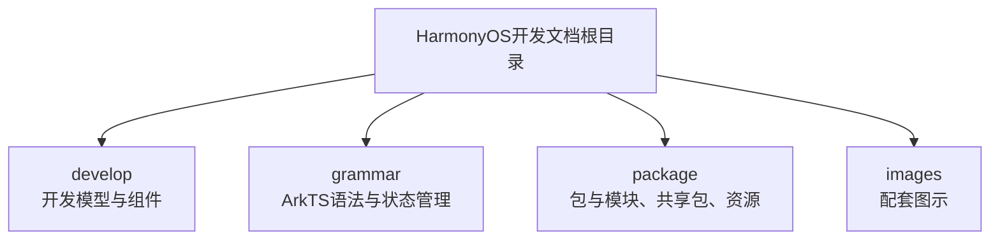
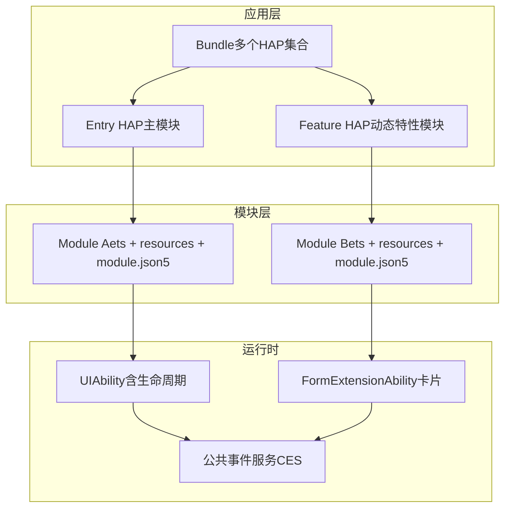
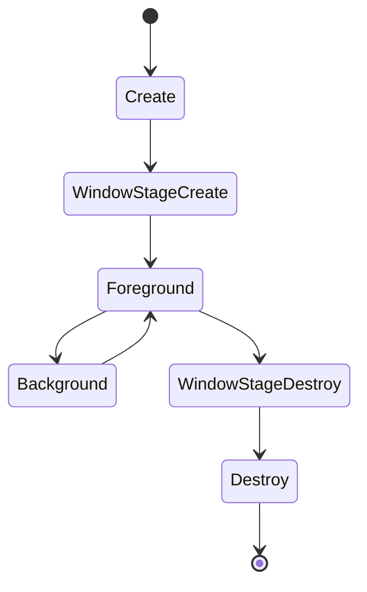
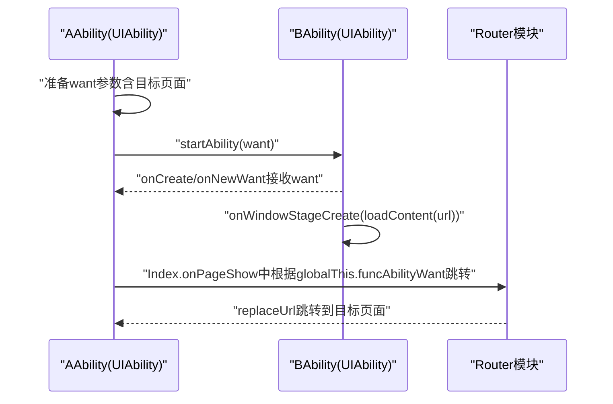
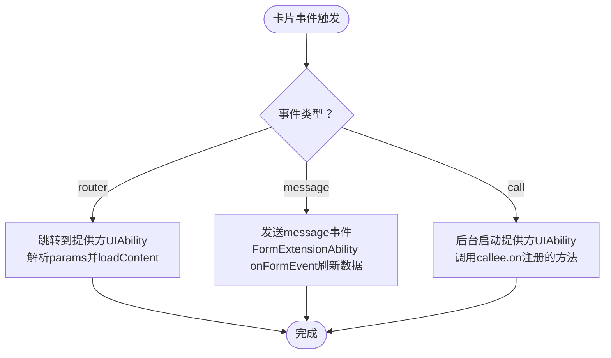
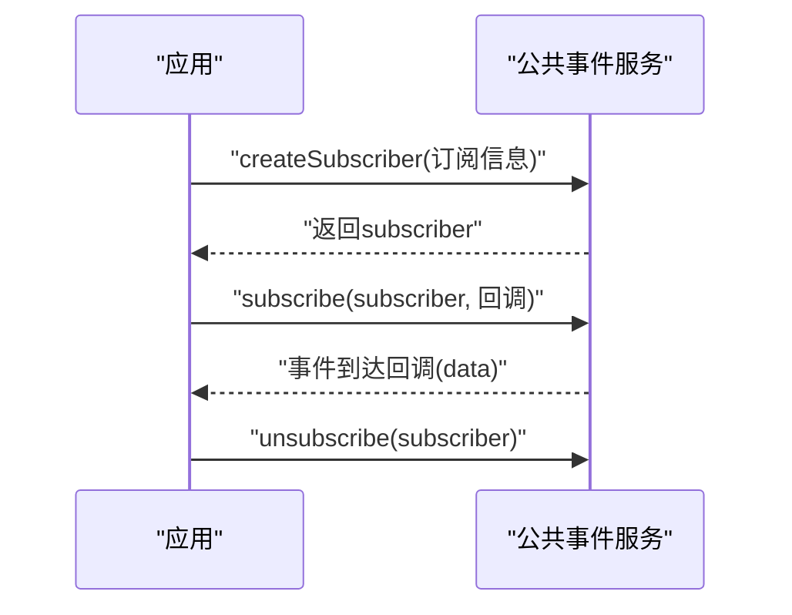
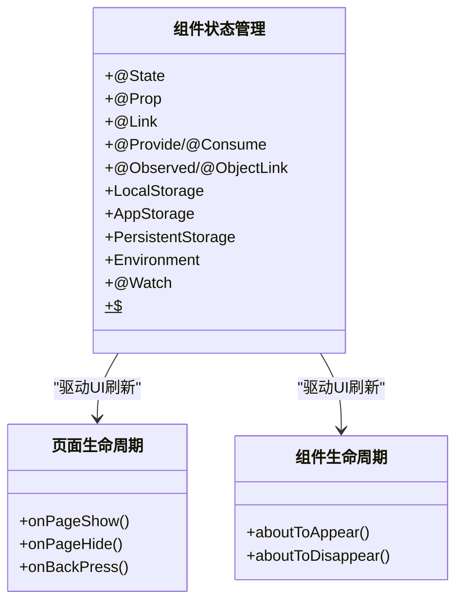
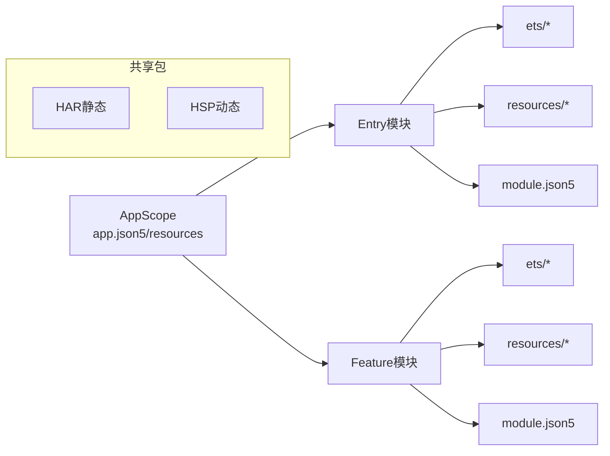

# HarmonyOS开发

<cite>
**本文引用的文件**
- [开发.md](file://docs/harmony-os/develop/develop.md)
- [语法.md](file://docs/harmony-os/grammar/grammar.md)
- [包基础.md](file://docs/harmony-os/package/package.md)
- [README.md](file://README.md)
</cite>

## 目录
1. [简介](#简介)
2. [项目结构](#项目结构)
3. [核心组件](#核心组件)
4. [架构总览](#架构总览)
5. [详细组件分析](#详细组件分析)
6. [依赖分析](#依赖分析)
7. [性能考量](#性能考量)
8. [故障排查指南](#故障排查指南)
9. [结论](#结论)
10. [附录](#附录)

## 简介
本文件面向希望系统掌握HarmonyOS应用开发的工程师与技术爱好者，围绕Stage模型应用的开发流程、ArkTS语言特性、包与模块管理、资源与共享包、进程与公共事件、UIAbility与服务卡片等关键主题，提供从入门到进阶的完整知识体系与实践指引。文档以仓库中HarmonyOS相关资料为依据，辅以可视化图示帮助理解。

## 项目结构
本仓库为文档型项目，HarmonyOS开发相关内容集中在docs/harmony-os目录下，包含开发模型、ArkTS语法、包与模块管理、资源与共享包等主题文档。整体结构清晰，便于按主题检索与学习。

章节来源
- [README.md:1-12](file://README.md#L1-L12)

## 核心组件
- UIAbility：承载UI界面与用户交互的系统调度基本单元，具备生命周期回调与启动模式（singleton、standard、specified）。
- 服务卡片（FormExtensionAbility）：提供卡片生命周期、事件与数据交互能力，支持router/message/call三类事件。
- 进程模型与公共事件（CES）：应用内跨进程通信与系统事件订阅。
- ArkTS语言与状态管理：装饰器、组件生命周期、状态变量、@Builder/@Styles/@Extend、LocalStorage/AppStorage/PersistentStorage等。

章节来源
- [开发.md:7-56](file://docs/harmony-os/develop/develop.md#L7-L56)
- [开发.md:343-426](file://docs/harmony-os/develop/develop.md#L343-L426)
- [开发.md:703-790](file://docs/harmony-os/develop/develop.md#L703-L790)
- [语法.md:16-45](file://docs/harmony-os/grammar/grammar.md#L16-L45)
- [语法.md:184-350](file://docs/harmony-os/grammar/grammar.md#L184-L350)

## 架构总览
HarmonyOS应用以Stage模型组织，应用由一个或多个Module构成，编译后形成HAP（Entry/Feature），最终打包为App Pack（.app）。UIAbility作为UI承载组件，配合WindowStage与生命周期协同工作；服务卡片通过FormExtensionAbility提供轻量化交互；公共事件服务（CES）支撑跨进程通信。

图表来源
- [开发.md:18-21](file://docs/harmony-os/develop/develop.md#L18-L21)
- [开发.md:22-237](file://docs/harmony-os/develop/develop.md#L22-L237)
- [包基础.md:18-48](file://docs/harmony-os/package/package.md#L18-L48)

## 详细组件分析

### UIAbility组件与生命周期
- 生命周期阶段：Create → WindowStageCreate → Foreground/Background → WindowStageDestroy → Destroy。
- 启动模式：singleton（默认单实例）、standard（每次创建新实例）、specified（指定实例，按Key复用或新建）。
- 基本用法：在onWindowStageCreate中通过loadContent指定启动页面；通过context获取上下文信息；使用EventHub或globalThis进行UI与UIAbility的数据同步。

图表来源
- [开发.md:15-56](file://docs/harmony-os/develop/develop.md#L15-L56)

章节来源
- [开发.md:15-56](file://docs/harmony-os/develop/develop.md#L15-L56)
- [开发.md:83-114](file://docs/harmony-os/develop/develop.md#L83-L114)
- [开发.md:115-180](file://docs/harmony-os/develop/develop.md#L115-L180)

### UIAbility组件间交互与页面跳转
- 启动同一应用内的UIAbility：startAbility；带结果：startAbilityForResult。
- 启动其他应用的UIAbility：显式Want（指定bundleName/abilityName）与隐式Want（entities/actions）。
- 指定启动页面：通过want.parameters传递路由参数；在onWindowStageCreate或onNewWant中解析并loadContent。

图表来源
- [开发.md:187-340](file://docs/harmony-os/develop/develop.md#L187-L340)

章节来源
- [开发.md:187-340](file://docs/harmony-os/develop/develop.md#L187-L340)

### 服务卡片（FormExtensionAbility）
- 卡片配置：在module.json5 extensionAbilities中声明FormExtensionAbility，并通过metadata关联form_config。
- 生命周期：onAddForm、onCastToNormalForm、onUpdateForm、onChangeFormVisibility、onFormEvent、onRemoveForm、onConfigurationUpdate、onAcquireFormState。
- 事件交互：postCardAction支持router/message/call三类事件，实现卡片与提供方应用的交互。

图表来源
- [开发.md:343-426](file://docs/harmony-os/develop/develop.md#L343-L426)
- [开发.md:428-699](file://docs/harmony-os/develop/develop.md#L428-L699)

章节来源
- [开发.md:343-426](file://docs/harmony-os/develop/develop.md#L343-L426)
- [开发.md:428-699](file://docs/harmony-os/develop/develop.md#L428-L699)

### 进程模型与公共事件（CES）
- 进程模型：同一包名下UIAbility在同一进程，WebView独立渲染进程。
- 公共事件：系统公共事件、自定义公共事件；无序/有序/粘性事件；动态订阅与退订；发布事件。

图表来源
- [开发.md:703-790](file://docs/harmony-os/develop/develop.md#L703-L790)

章节来源
- [开发.md:703-790](file://docs/harmony-os/develop/develop.md#L703-L790)

### ArkTS语言与状态管理
- 语法组成：装饰器、UI描述、自定义组件、系统组件、属性/事件方法。
- 生命周期：页面（@Entry）与组件（@Component）生命周期接口与流程。
- 状态管理：@State、@Prop、@Link、@Provide/@Consume、@Observed/@ObjectLink、LocalStorage、AppStorage、PersistentStorage、Environment、@Watch、内置双向绑定$$。

图表来源
- [语法.md:16-45](file://docs/harmony-os/grammar/grammar.md#L16-L45)
- [语法.md:184-350](file://docs/harmony-os/grammar/grammar.md#L184-L350)

章节来源
- [语法.md:16-45](file://docs/harmony-os/grammar/grammar.md#L16-L45)
- [语法.md:184-350](file://docs/harmony-os/grammar/grammar.md#L184-L350)
- [语法.md:406-470](file://docs/harmony-os/grammar/grammar.md#L406-L470)
- [语法.md:470-511](file://docs/harmony-os/grammar/grammar.md#L470-L511)
- [语法.md:512-545](file://docs/harmony-os/grammar/grammar.md#L512-L545)

### 包与模块管理、共享包与资源
- Stage模型包结构：AppScope（app.json5/resources）、entry/feature模块（module.json5/ets/resources）。
- HAP类型：Entry（主模块）、Feature（动态特性模块）；最终打包为App Pack（.app）。
- 共享包：HAR（静态共享包）、HSP（动态共享包），支持导出组件/接口/资源、编译、发布与引用。
- 资源：resources/base、限定词目录、rawfile；通过$r与$rawfile访问；资源冲突优先级规则。

图表来源
- [包基础.md:18-48](file://docs/harmony-os/package/package.md#L18-L48)
- [包基础.md:49-210](file://docs/harmony-os/package/package.md#L49-L210)
- [包基础.md:323-376](file://docs/harmony-os/package/package.md#L323-L376)

章节来源
- [包基础.md:18-48](file://docs/harmony-os/package/package.md#L18-L48)
- [包基础.md:49-210](file://docs/harmony-os/package/package.md#L49-L210)
- [包基础.md:323-376](file://docs/harmony-os/package/package.md#L323-L376)

## 依赖分析
- 组件耦合：UIAbility与WindowStage紧密耦合，生命周期贯穿应用状态切换；卡片通过FormExtensionAbility与UIAbility交互，依赖公共事件与路由。
- 状态依赖：@State/@Link/@Prop/@Provide/@Consume等装饰器形成状态依赖链，影响UI最小化更新与刷新。
- 包依赖：HAP依赖module.json5配置；HAR/HSP通过oh-package.json5管理依赖与导出声明；资源依赖优先级规则避免冲突。

章节来源
- [开发.md:15-56](file://docs/harmony-os/develop/develop.md#L15-L56)
- [语法.md:184-350](file://docs/harmony-os/grammar/grammar.md#L184-L350)
- [包基础.md:49-210](file://docs/harmony-os/package/package.md#L49-L210)

## 性能考量
- 生命周期与资源管理：在onBackground释放非必要资源，在onForeground按需申请资源，避免阻塞UI线程。
- 状态更新最小化：利用@State与@Watch的严格相等判断，减少不必要的UI重绘。
- PersistentStorage写入：避免大量数据持久化，避免同步写入阻塞UI线程。
- 卡片更新策略：合理使用onUpdateForm与message事件，避免频繁刷新造成卡顿。
- 进程隔离：充分利用进程模型，避免跨进程通信带来的性能损耗。

章节来源
- [开发.md:351-426](file://docs/harmony-os/develop/develop.md#L351-L426)
- [语法.md:406-470](file://docs/harmony-os/grammar/grammar.md#L406-L470)

## 故障排查指南
- 白屏问题：检查UIAbility onWindowStageCreate中loadContent是否正确设置页面路径。
- 页面跳转异常：核对want参数中entities/actions与目标UIAbility skills配置是否匹配；确认onNewWant中是否正确解析并触发页面跳转。
- 卡片事件无效：确认postCardAction参数（action/bundleName/moduleName/abilityName/params）是否正确；检查FormExtensionAbility生命周期回调与路由/消息/调用逻辑。
- 公共事件未收到：确认订阅者创建与订阅回调是否成功；检查事件code/权限与粘性事件权限配置。
- 资源冲突：依据资源优先级规则调整资源命名或限定词目录，避免重名覆盖导致显示异常。

章节来源
- [开发.md:83-114](file://docs/harmony-os/develop/develop.md#L83-L114)
- [开发.md:269-340](file://docs/harmony-os/develop/develop.md#L269-L340)
- [开发.md:428-699](file://docs/harmony-os/develop/develop.md#L428-L699)
- [开发.md:703-790](file://docs/harmony-os/develop/develop.md#L703-L790)
- [包基础.md:128-134](file://docs/harmony-os/package/package.md#L128-L134)

## 结论
通过系统梳理Stage模型、ArkTS语言与状态管理、包与模块管理、服务卡片与公共事件等主题，开发者可以建立起完整的HarmonyOS应用开发知识框架。建议在实践中遵循生命周期与状态管理的最佳实践，合理使用共享包与资源管理策略，持续优化性能与用户体验。

## 附录
- 实际示例与最佳实践建议
  - UIAbility页面跳转：在onWindowStageCreate解析want.parameters并loadContent；在Index页面onPageShow中根据globalThis.funcAbilityWant进行路由替换。
  - 卡片交互：使用postCardAction(router/message/call)触发事件，FormExtensionAbility中onFormEvent/onUpdateForm处理数据刷新与状态转换。
  - 状态管理：优先使用@State驱动UI，@Link实现父子双向绑定，@Provide/@Consume处理跨层级数据，LocalStorage/AppStorage/PersistentStorage按需选择。
  - 共享包：HAR适合静态复用组件/接口/资源；HSP适合动态共享与运行时统一代码实例；遵循导出声明与依赖配置规范。

章节来源
- [开发.md:269-340](file://docs/harmony-os/develop/develop.md#L269-L340)
- [开发.md:428-699](file://docs/harmony-os/develop/develop.md#L428-L699)
- [语法.md:184-350](file://docs/harmony-os/grammar/grammar.md#L184-L350)
- [包基础.md:49-210](file://docs/harmony-os/package/package.md#L49-L210)