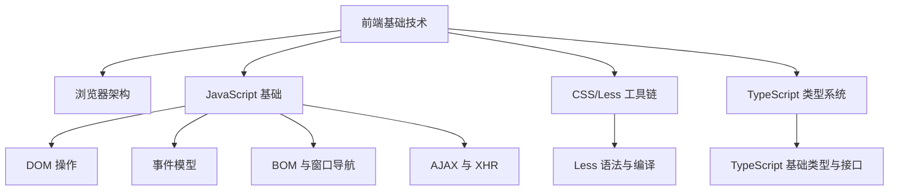
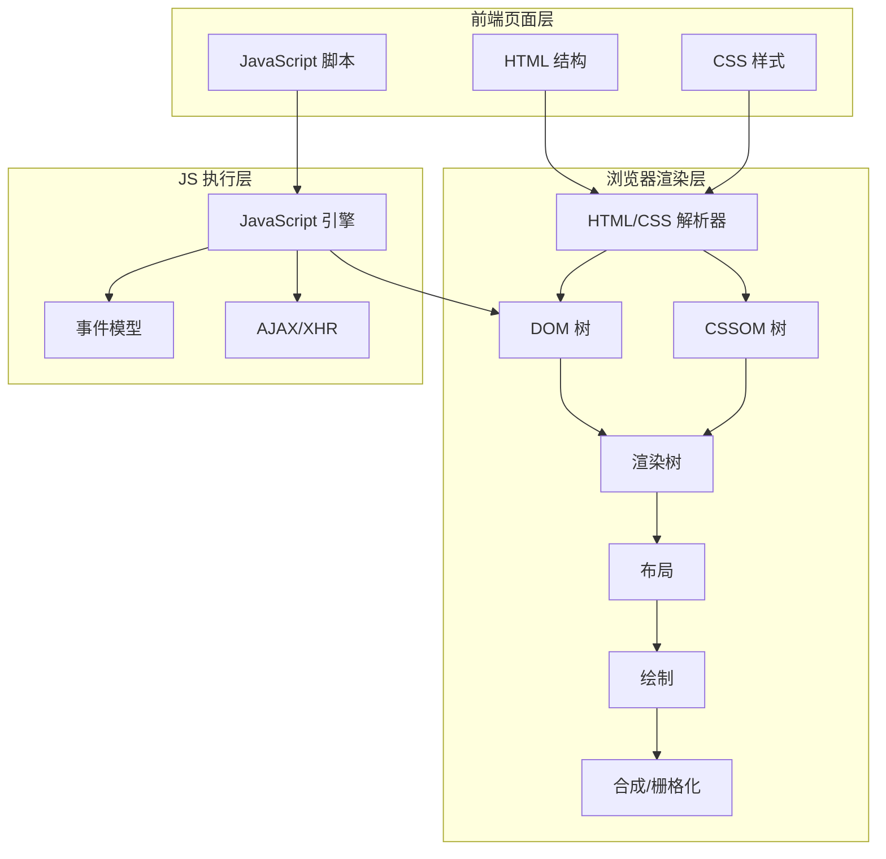
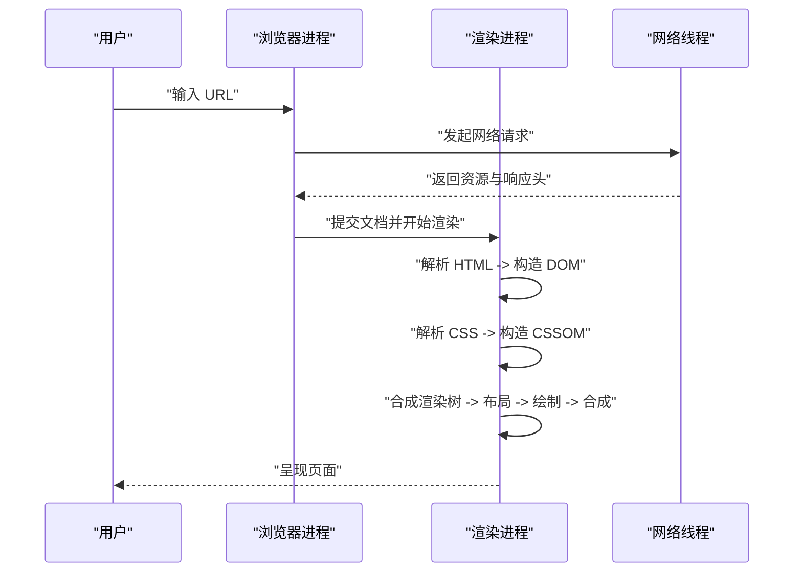
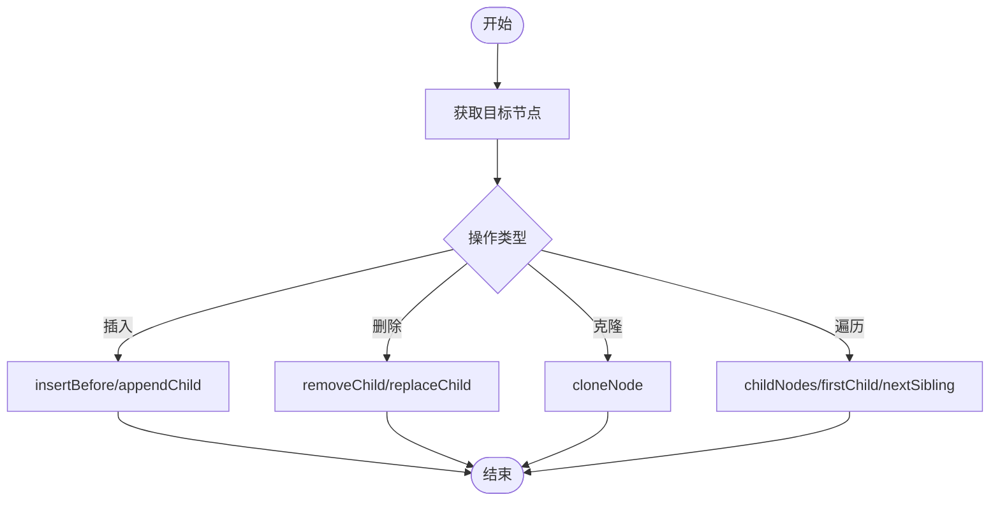
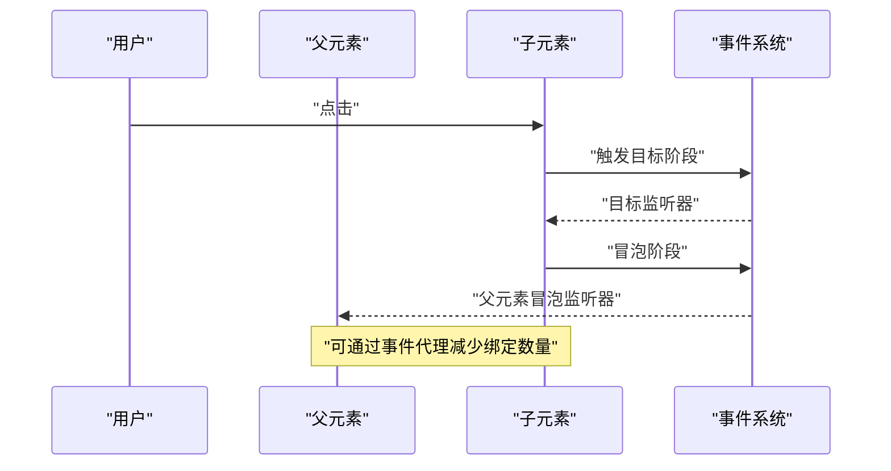
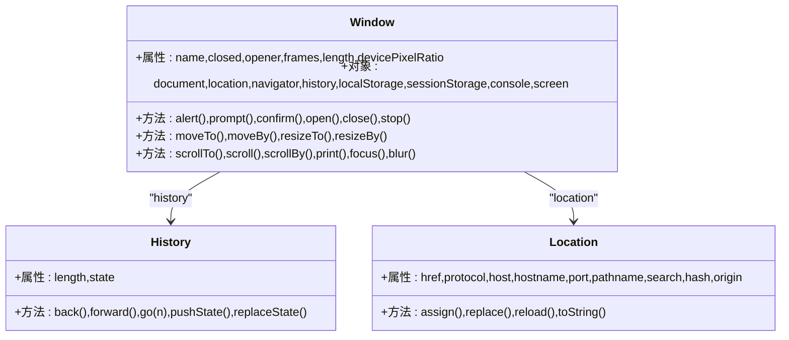
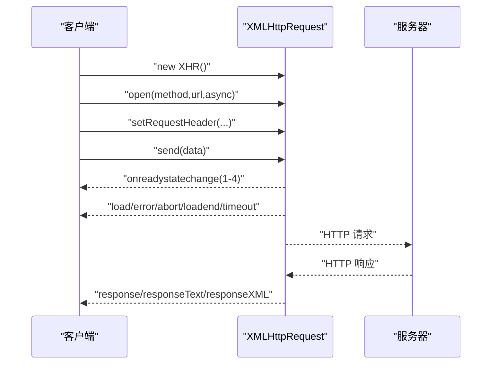
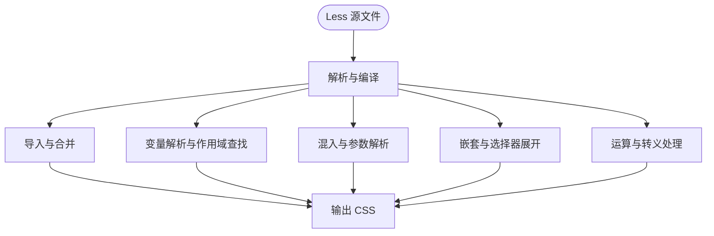
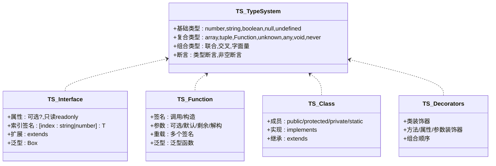
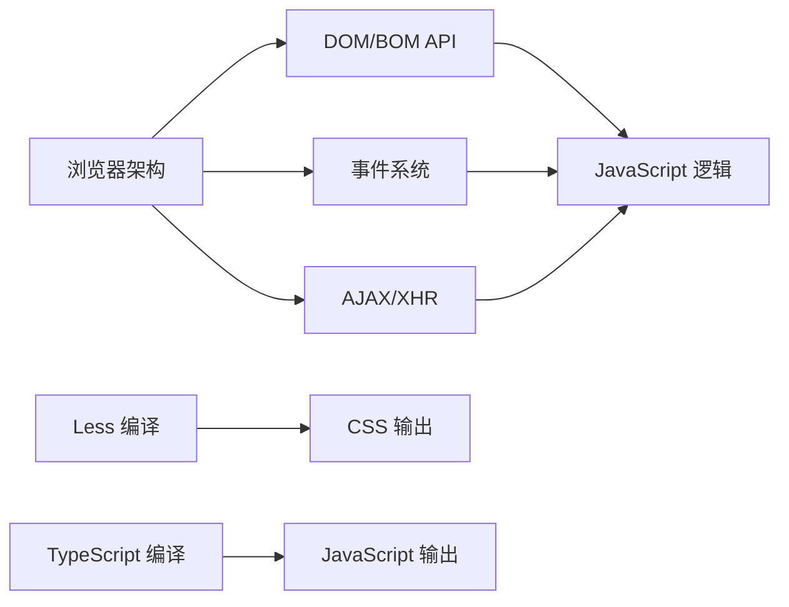

# 前端基础技术

<cite>
**本文引用的文件**
- [浏览器架构.md](file://docs/frontend-base/browser/architecture.md)
- [DOM.md](file://docs/frontend-base/javascript/dom.md)
- [事件.md](file://docs/frontend-base/javascript/event.md)
- [BOM.md](file://docs/frontend-base/javascript/bom.md)
- [AJAX.md](file://docs/frontend-base/javascript/ajax.md)
- [Less 介绍.md](file://docs/frontend-base/less/introduction.md)
- [TypeScript 语法.md](file://docs/frontend-base/typescript/grammar.md)
</cite>

## 目录
1. [引言](#引言)
2. [项目结构](#项目结构)
3. [核心组件](#核心组件)
4. [架构总览](#架构总览)
5. [详细组件分析](#详细组件分析)
6. [依赖分析](#依赖分析)
7. [性能考虑](#性能考虑)
8. [故障排查指南](#故障排查指南)
9. [结论](#结论)
10. [附录](#附录)

## 引言
本文件面向前端初学者，系统梳理前端基础技术体系：HTML、CSS、JavaScript、浏览器架构、TypeScript、Less 以及正则表达式。通过对仓库中现有文档的整合与提炼，帮助读者建立从页面结构、交互逻辑、渲染机制到工程化工具与类型约束的完整知识地图。文档强调技术之间的关联性与学习路径，提供可追溯的参考路径与实践建议，便于逐步深入。

## 项目结构
本项目在 docs/frontend-base 目录下组织了前端基础相关文档，涵盖浏览器架构、JavaScript（DOM/BOM/事件/AJAX）、Less 与 TypeScript 等主题。下图给出与本文相关的文件组织概览：

图表来源
- [浏览器架构.md](file://docs/frontend-base/browser/architecture.md)
- [DOM.md](file://docs/frontend-base/javascript/dom.md)
- [事件.md](file://docs/frontend-base/javascript/event.md)
- [BOM.md](file://docs/frontend-base/javascript/bom.md)
- [AJAX.md](file://docs/frontend-base/javascript/ajax.md)
- [Less 介绍.md](file://docs/frontend-base/less/introduction.md)
- [TypeScript 语法.md](file://docs/frontend-base/typescript/grammar.md)

章节来源
- [浏览器架构.md](file://docs/frontend-base/browser/architecture.md)
- [DOM.md](file://docs/frontend-base/javascript/dom.md)
- [事件.md](file://docs/frontend-base/javascript/event.md)
- [BOM.md](file://docs/frontend-base/javascript/bom.md)
- [AJAX.md](file://docs/frontend-base/javascript/ajax.md)
- [Less 介绍.md](file://docs/frontend-base/less/introduction.md)
- [TypeScript 语法.md](file://docs/frontend-base/typescript/grammar.md)

## 核心组件
- 浏览器架构与渲染管线：理解页面从输入 URL 到最终绘制的全过程，掌握脚本加载策略（defer/async）、回流与重绘的成因与优化手段。
- JavaScript 基础生态：DOM 操作、事件模型（捕获/冒泡/委托）、BOM 与窗口导航、AJAX 与 XHR。
- CSS/Less 工具链：Less 变量、混入、嵌套、运算、函数、作用域与导入等语法，以及浏览器与命令行编译方式。
- TypeScript 类型系统：基础类型、联合/交叉类型、接口、泛型、装饰器等，强调静态类型在开发期的错误预防能力。
- 正则表达式：作为前端常见工具，用于字符串处理、URL 解析、输入校验等场景。

章节来源
- [浏览器架构.md](file://docs/frontend-base/browser/architecture.md)
- [DOM.md](file://docs/frontend-base/javascript/dom.md)
- [事件.md](file://docs/frontend-base/javascript/event.md)
- [BOM.md](file://docs/frontend-base/javascript/bom.md)
- [AJAX.md](file://docs/frontend-base/javascript/ajax.md)
- [Less 介绍.md](file://docs/frontend-base/less/introduction.md)
- [TypeScript 语法.md](file://docs/frontend-base/typescript/grammar.md)

## 架构总览
下图展示了从前端页面到浏览器渲染、再到 JavaScript 交互与数据请求的整体架构。该图映射至仓库中的浏览器架构与 JavaScript 文档，帮助理解各模块职责与交互关系。

图表来源
- [浏览器架构.md](file://docs/frontend-base/browser/architecture.md)
- [DOM.md](file://docs/frontend-base/javascript/dom.md)
- [事件.md](file://docs/frontend-base/javascript/event.md)
- [AJAX.md](file://docs/frontend-base/javascript/ajax.md)

## 详细组件分析

### 浏览器架构与渲染管线
- 渲染进程与多进程架构：浏览器进程、渲染进程、GPU 进程、插件进程的职责划分与优缺点。
- 输入 URL 到渲染完成的关键阶段：数据获取、提交确认、构造 DOM、样式计算、创建渲染树、布局、绘制、合成。
- 脚本加载策略：defer 与 async 的差异、动态脚本注入、完整性校验（integrity）。
- 回流与重绘：成因、影响范围与优化策略（transform、will-change、避免频繁读取引发回流的属性等）。

图表来源
- [浏览器架构.md](file://docs/frontend-base/browser/architecture.md)

章节来源
- [浏览器架构.md](file://docs/frontend-base/browser/architecture.md)

### DOM 操作与节点模型
- Node 接口与节点类型：nodeType、nodeName、nodeValue、textContent、baseURI 等。
- 节点关系：父子兄弟关系、ownerDocument、contains、compareDocumentPosition、isEqualNode/isSameNode 等。
- 节点操作：appendChild、insertBefore、removeChild、replaceChild、cloneNode、normalize 等。
- NodeList 与 HTMLCollection：动态集合、遍历与转换。

图表来源
- [DOM.md](file://docs/frontend-base/javascript/dom.md)

章节来源
- [DOM.md](file://docs/frontend-base/javascript/dom.md)

### 事件模型与交互
- 事件流：捕获阶段、目标阶段、冒泡阶段；addEventListener 的 useCapture 与配置对象（once/passive）。
- 事件监听：HTML/属性、DOM0、DOM2（addEventListener/removeEventListener/dispatchEvent）。
- 常见事件类型：鼠标事件（click/dblclick/mouseover/mouseenter/mouseout/mouseleave）、键盘事件（keydown/keypress/keyup）、触摸事件（Touch/TouchEvent）、拖拽事件（drag/drop）。
- 事件代理与性能：利用事件冒泡进行委托，减少监听器数量。

图表来源
- [事件.md](file://docs/frontend-base/javascript/event.md)

章节来源
- [事件.md](file://docs/frontend-base/javascript/event.md)

### BOM 与窗口导航
- window 对象：顶层对象、name/closed/opener、frames/length/frameElement、top/parent/self/window。
- 位置与尺寸：screenX/screenY、inner/outerWidth/Height、scrollX/scrollY/pageXOffset/pageYOffset。
- 组件与全局对象：locationbar/menubar/scrollbars/toolbar/statusbar/personalbar、document/location/navigator/history/localStorage/sessionStorage/console/screen。
- 方法：alert/prompt/confirm、open/close/stop、moveTo/moveBy/resizeTo/resizeBy、scrollTo/scroll()/scrollBy()、print/focus/blur、getSelection/getComputedStyle/matchMedia、requestAnimationFrame/requestIdleCallback。
- History 对象：back/forward/go、pushState/replaceState、popstate。
- Location 对象：href/protocol/host/hostname/port/pathname/search/hash/origin、assign/replace/reload/toString、URL 编解码（encodeURI/encodeURIComponent/decodeURI/decodeURIComponent）。

图表来源
- [BOM.md](file://docs/frontend-base/javascript/bom.md)

章节来源
- [BOM.md](file://docs/frontend-base/javascript/bom.md)

### AJAX 与 XHR
- 生命周期：readyState（0-4）、onreadystatechange、load/error/abort/loadend/timeout。
- 请求与响应：open(method,url,async,user,password)、send(data)、setRequestHeader()、overrideMimeType()。
- 响应数据：response/responseType/responseText/responseXML/responseURL、状态码与状态文本。
- 超时与凭证：timeout/ontimeout、withCredentials。
- 上传进度：upload.progress 事件。
- 优雅降级：unload/beforeunload 场景下的 Navigator.sendBeacon()。

图表来源
- [AJAX.md](file://docs/frontend-base/javascript/ajax.md)

章节来源
- [AJAX.md](file://docs/frontend-base/javascript/ajax.md)

### Less 语法与编译
- 变量与属性：@变量、属性作为变量（$prop）、变量嵌套。
- 混入：类/ID 混入、带括号混入（阻止输出）、选择器与 !important、参数与默认值、@arguments。
- 嵌套与冒泡：普通嵌套、父选择器（&）、@规则嵌套与冒泡。
- 运算与转义：算术运算、单位换算、转义（Escaping）。
- 函数与映射：从 3.5 起的映射使用。
- 作用域与导入：作用域查找、文件扩展名与导入选项（reference/inline/less/css/once/multiple/optional）。
- 编译方式：Less.js 浏览器端与命令行（lessc）安装与使用、监视模式、运行时修改变量。

图表来源
- [Less 介绍.md](file://docs/frontend-base/less/introduction.md)

章节来源
- [Less 介绍.md](file://docs/frontend-base/less/introduction.md)

### TypeScript 语法与类型系统
- 基础类型：null/undefined、number（含二/八/十/十六进制）、boolean/string、array/元组、Function/unknown/any/void/never、字面量类型。
- 联合与交叉：联合类型与类型收缩、交叉类型与属性合并冲突处理。
- 类型断言与非空断言：as 断言、! 非空断言。
- 接口：属性修饰符（可选/只读）、索引签名、接口扩展与合并、泛型接口。
- 函数：函数签名（调用/构造）、参数（可选/默认/剩余/解构）、函数重载、泛型函数、约束。
- 类：属性与成员修饰符（public/protected/private/static）、接口实现、继承与初始化顺序。
- 装饰器：类/方法/属性/参数装饰器与组合顺序。

图表来源
- [TypeScript 语法.md](file://docs/frontend-base/typescript/grammar.md)

章节来源
- [TypeScript 语法.md](file://docs/frontend-base/typescript/grammar.md)

## 依赖分析
- 浏览器架构与渲染管线是前端页面的基础，决定了脚本加载与 DOM/CSSOM 的构建时机。
- JavaScript 的 DOM/BOM/事件/AJAX 能力依赖于浏览器提供的 API，受渲染管线与脚本加载策略影响。
- Less 与 TypeScript 分别服务于样式与类型约束，前者在构建阶段输出 CSS，后者在编译阶段产出 JavaScript，二者均服务于前端工程化。

图表来源
- [浏览器架构.md](file://docs/frontend-base/browser/architecture.md)
- [DOM.md](file://docs/frontend-base/javascript/dom.md)
- [事件.md](file://docs/frontend-base/javascript/event.md)
- [AJAX.md](file://docs/frontend-base/javascript/ajax.md)
- [Less 介绍.md](file://docs/frontend-base/less/introduction.md)
- [TypeScript 语法.md](file://docs/frontend-base/typescript/grammar.md)

章节来源
- [浏览器架构.md](file://docs/frontend-base/browser/architecture.md)
- [DOM.md](file://docs/frontend-base/javascript/dom.md)
- [事件.md](file://docs/frontend-base/javascript/event.md)
- [AJAX.md](file://docs/frontend-base/javascript/ajax.md)
- [Less 介绍.md](file://docs/frontend-base/less/introduction.md)
- [TypeScript 语法.md](file://docs/frontend-base/typescript/grammar.md)

## 性能考虑
- 渲染性能：避免频繁读取引发回流/重绘的属性；使用 transform/will-change；减少 table 布局与多层内联样式；合理使用定位（absolute/fixed）以降低重绘成本。
- 脚本加载：defer/async 的选择与顺序；动态脚本注入避免阻塞；CDN 与 integrity 校验。
- 事件优化：事件委托；passive 监听；避免在高频事件中进行昂贵操作。
- AJAX 优化：合理设置超时；必要时使用 Navigator.sendBeacon() 上报；上传进度反馈。
- 构建优化：Less 变量与混入减少重复；TypeScript 启用严格模式与合理的类型约束，减少运行时错误与分支判断。

## 故障排查指南
- 页面空白或脚本不执行：检查脚本加载策略（defer/async/动态注入）与 integrity 校验；确认脚本路径与协议一致性。
- 事件不触发或冒泡异常：确认监听器绑定时机（需在 send() 前设置）、useCapture 与 once/passive 配置；检查事件代理目标与事件冒泡链。
- AJAX 请求失败：检查状态码与状态文本；确认 withCredentials 与 CORS 头；关注超时与 loadend 事件。
- 样式不生效：确认 Less 编译产物与导入顺序；检查作用域与 !important 的优先级；验证浏览器兼容性。
- 类型错误：核对 TypeScript 基础类型与断言；检查联合/交叉类型的收缩；确认接口与泛型约束。

章节来源
- [浏览器架构.md](file://docs/frontend-base/browser/architecture.md)
- [事件.md](file://docs/frontend-base/javascript/event.md)
- [AJAX.md](file://docs/frontend-base/javascript/ajax.md)
- [Less 介绍.md](file://docs/frontend-base/less/introduction.md)
- [TypeScript 语法.md](file://docs/frontend-base/typescript/grammar.md)

## 结论
前端基础技术围绕“页面结构（HTML）—样式（CSS/Less）—交互（JavaScript）—类型约束（TypeScript）—浏览器渲染（架构）”展开。理解浏览器渲染管线与脚本加载策略有助于写出高性能的前端代码；掌握 DOM/BOM/事件/AJAX 能力可实现丰富的用户交互；借助 Less 与 TypeScript，前端工程化与可维护性得到显著提升。建议以“浏览器架构 → DOM/BOM/事件 → AJAX → Less → TypeScript”的顺序循序渐进学习，并结合实践案例加深理解。

## 附录
- 学习路径建议
  - 第一阶段：HTML 与 CSS 基础、浏览器架构与渲染管线。
  - 第二阶段：DOM/BOM/事件模型、AJAX 与 XHR。
  - 第三阶段：Less 语法与编译、构建与调试。
  - 第四阶段：TypeScript 基础类型与接口、泛型与装饰器。
  - 第五阶段：综合实战（页面搭建、交互完善、样式与类型约束、性能优化）。
- 实践案例（参考路径）
  - 浏览器脚本加载与 defer/async 的对比实验
  - 事件代理与高频事件处理（如滚动/拖拽）
  - AJAX 请求与上传进度反馈
  - Less 变量与混入在主题切换中的应用
  - TypeScript 接口与泛型在数据模型中的使用