# 前端技术内容

<cite>
**本文档引用的文件**
- [README.md](file://README.md)
- [package.json](file://package.json)
- [.vuepress/config.js](file://.vuepress/config.js)
- [.vuepress/navbar.js](file://.vuepress/navbar.js)
- [docs/frontend-advanced/es6/grammar.md](file://docs/frontend-advanced/es6/grammar.md)
- [docs/frontend-advanced/node/path.md](file://docs/frontend-advanced/node/path.md)
- [docs/frontend-advanced/webpack/config.md](file://docs/frontend-advanced/webpack/config.md)
- [docs/frontend-advanced/algorithm/Algorithm.md](file://docs/frontend-advanced/algorithm/Algorithm.md)
- [docs/frontend-advanced/js-implement/implement.md](file://docs/frontend-advanced/js-implement/implement.md)
- [docs/frontend-base/typescript/grammar.md](file://docs/frontend-base/typescript/grammar.md)
- [docs/harmony-os/grammar/grammar.md](file://docs/harmony-os/grammar/grammar.md)
- [docs/harmony-os/package/package.md](file://docs/harmony-os/package/package.md)
</cite>

## 目录
1. [简介](#简介)
2. [项目结构](#项目结构)
3. [核心组件](#核心组件)
4. [架构总览](#架构总览)
5. [详细组件分析](#详细组件分析)
6. [依赖分析](#依赖分析)
7. [性能考量](#性能考量)
8. [故障排查指南](#故障排查指南)
9. [结论](#结论)
10. [附录](#附录)

## 简介
本文件面向前端技术内容管理，围绕“前端基础技术”与“前端进阶技术”两大板块，系统梳理文档组织方式、编写规范与质量控制标准。同时，结合仓库现有文档，给出 HarmonyOS 相关内容的组织结构说明，并提供创作模板与最佳实践指导，帮助读者高效产出高质量前端技术文档。

## 项目结构
本项目基于 VuePress 主题进行内容组织，导航栏将前端知识体系划分为“前端基础”“前端进阶”“harmonyOS”等主题，配合侧边栏与目录实现知识的层级化呈现。整体结构清晰、主题明确，适合长期维护与扩展。

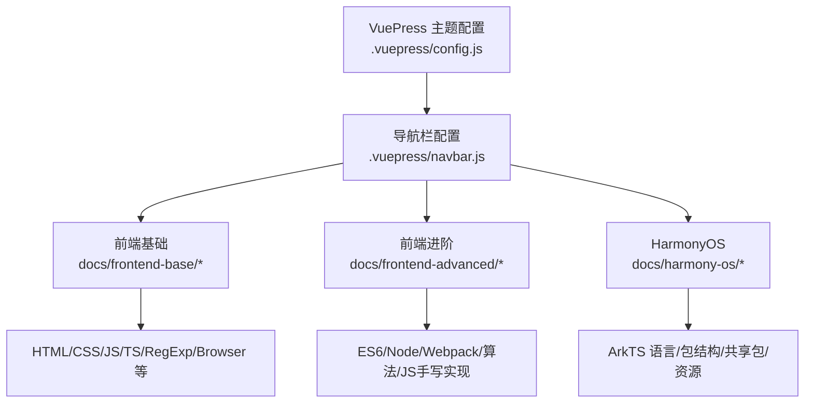

图表来源
- [.vuepress/config.js:1-18](file://.vuepress/config.js#L1-L18)
- [.vuepress/navbar.js:1-142](file://.vuepress/navbar.js#L1-L142)

章节来源
- [.vuepress/config.js:1-18](file://.vuepress/config.js#L1-L18)
- [.vuepress/navbar.js:1-142](file://.vuepress/navbar.js#L1-L142)
- [README.md:1-12](file://README.md#L1-L12)
- [package.json:1-17](file://package.json#L1-L17)

## 核心组件
- 文档主题与站点配置：通过 VuePress 主题与配置文件统一站点风格、目录与导航。
- 导航与侧边栏：通过 navbar.js 定义前端基础、前端进阶、HarmonyOS 等主题入口，便于用户快速定位。
- 前端基础：覆盖 HTML、CSS、JavaScript、TypeScript、RegExp、Browser 等基础知识点。
- 前端进阶：覆盖 ES6+、Node.js、Webpack、算法与 JS 手写实现等进阶内容。
- HarmonyOS：覆盖 ArkTS 语言、程序包结构、共享包与资源访问等。

章节来源
- [.vuepress/config.js:1-18](file://.vuepress/config.js#L1-L18)
- [.vuepress/navbar.js:10-87](file://.vuepress/navbar.js#L10-L87)

## 架构总览
前端技术内容的组织采用“主题分层 + 知识点细分”的架构，主题层通过导航与侧边栏呈现，知识点层通过 Markdown 文档承载。前端进阶模块与基础模块相互补充，HarmonyOS 作为独立主题与前端主线并行。

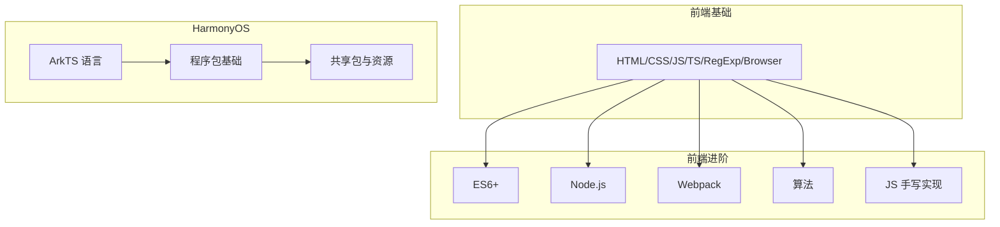

图表来源
- [.vuepress/navbar.js:10-87](file://.vuepress/navbar.js#L10-L87)

## 详细组件分析

### 前端基础：TypeScript 语法要点
- 基本类型与字面量类型、联合/交叉类型、类型断言与非空断言。
- 接口与类型别名、索引签名、可选/只读属性、接口扩展与合并。
- 泛型接口与函数、函数签名与重载、类的成员修饰与继承。
- 装饰器组合与类装饰器等高级特性。

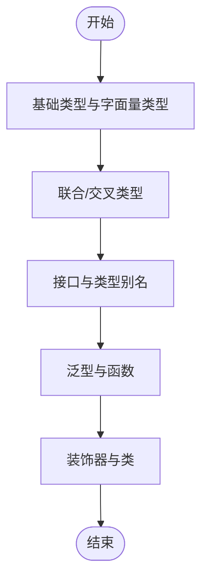

图表来源
- [docs/frontend-base/typescript/grammar.md:1-800](file://docs/frontend-base/typescript/grammar.md#L1-L800)

章节来源
- [docs/frontend-base/typescript/grammar.md:1-800](file://docs/frontend-base/typescript/grammar.md#L1-L800)

### 前端进阶：ES6+ 语法要点
- let/const 块级作用域、暂时性死区、不允许重复声明。
- 全局对象 globalThis、数值扩展（二进制/八进制、Number.*）、Math 扩展。
- Math 对象扩展（trunc/sign/cbrt/clz32/imul/fround/hypot 等）。
- 安全整数范围与 EPSILON 误差处理、安全整数判断。

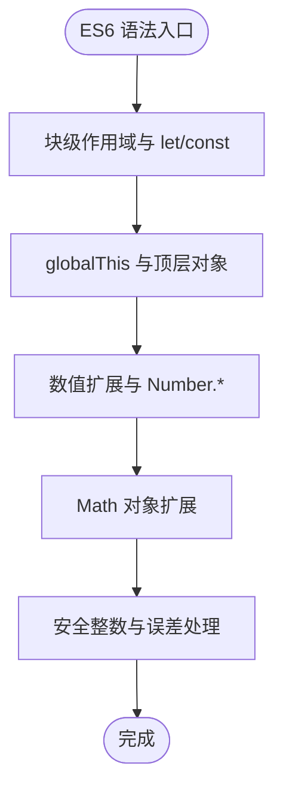

图表来源
- [docs/frontend-advanced/es6/grammar.md:1-800](file://docs/frontend-advanced/es6/grammar.md#L1-L800)

章节来源
- [docs/frontend-advanced/es6/grammar.md:1-800](file://docs/frontend-advanced/es6/grammar.md#L1-L800)

### 前端进阶：Node.js path 模块
- 路径拆解：basename、dirname、extname。
- 路径解析：relative、resolve、join。
- 形式转换：format、parse、normalize。
- 平台差异：win32/posix 一致性处理。

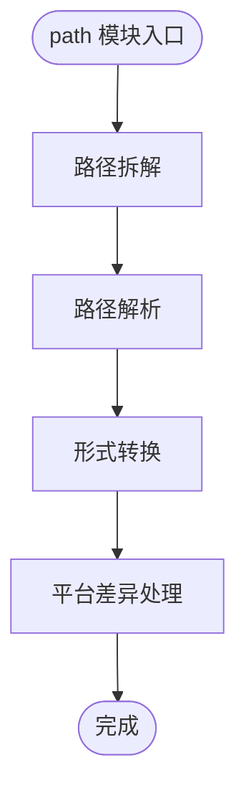

图表来源
- [docs/frontend-advanced/node/path.md:1-202](file://docs/frontend-advanced/node/path.md#L1-L202)

章节来源
- [docs/frontend-advanced/node/path.md:1-202](file://docs/frontend-advanced/node/path.md#L1-L202)

### 前端进阶：Webpack 配置与优化
- 入口配置：字符串/数组/对象/函数形式，filename、dependOn、layer 等。
- 模式与资源处理：css/less/scss、图片/字体、json/csv。
- 解析规则：alias、extensions、mainFields、mainFiles、modules。
- 输出管理：filename/chunkFilename、publicPath、clean、hash 等。
- 代码分割：入口分离、动态导入、prefetch/preload、SplitChunks。
- 优化：tree-shaking、sideEffects、ProvidePlugin、imports-loader、terser、runtimeChunk 等。
- 性能：版本、loader、resolve、DLL、worker 池、增量编译、内存编译、devtool 选择。

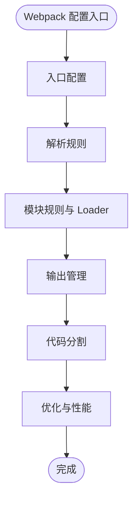

图表来源
- [docs/frontend-advanced/webpack/config.md:1-800](file://docs/frontend-advanced/webpack/config.md#L1-L800)

章节来源
- [docs/frontend-advanced/webpack/config.md:1-800](file://docs/frontend-advanced/webpack/config.md#L1-L800)

### 前端进阶：算法与数据结构
- 算法定义与五大特性：有穷性、确切性、输入、输出、可行性。
- 数据结构与算法的关系：数组、链表、栈/队列、树、图等。
- 前端应用：虚拟 DOM/AST、字符串相似度（最小编辑距离）、前缀树等。

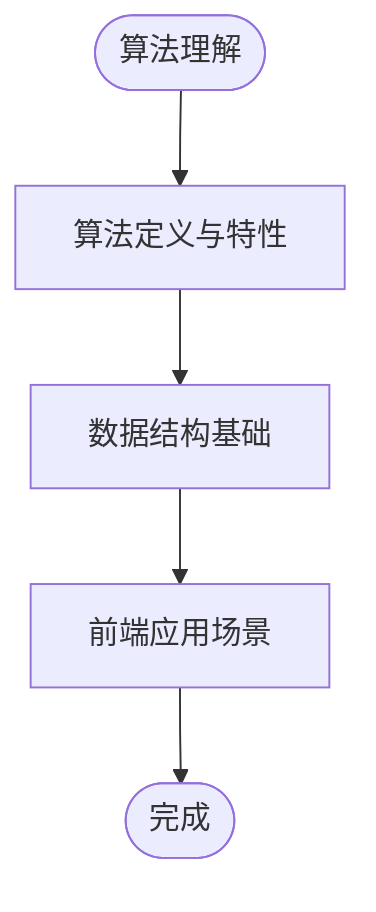

图表来源
- [docs/frontend-advanced/algorithm/Algorithm.md:1-60](file://docs/frontend-advanced/algorithm/Algorithm.md#L1-L60)

章节来源
- [docs/frontend-advanced/algorithm/Algorithm.md:1-60](file://docs/frontend-advanced/algorithm/Algorithm.md#L1-L60)

### 前端进阶：JS 手写实现
- 数组：扁平化、去重、类数组转数组。
- 数组方法：filter/map/forEach/reduce。
- 函数：apply/call/bind。
- 防抖与节流：标志版、时间版、精确版。
- 函数柯里化、new 操作、instanceof、原型继承。
- 深拷贝（含 Symbol）、Promise 及 all/race 并行限制。

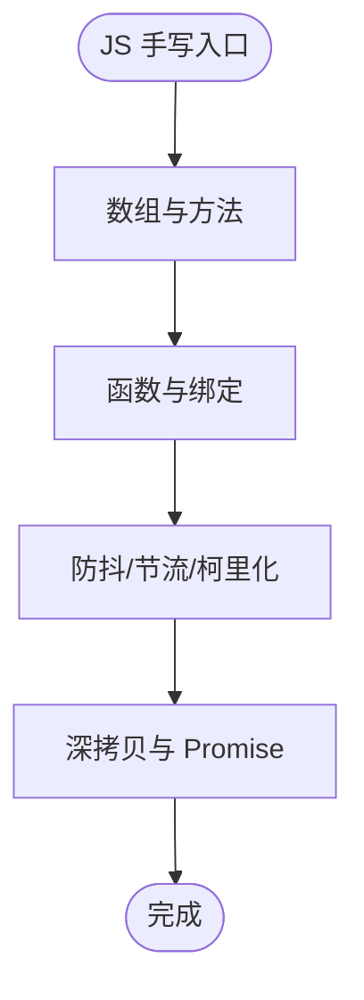

图表来源
- [docs/frontend-advanced/js-implement/implement.md:1-800](file://docs/frontend-advanced/js-implement/implement.md#L1-L800)

章节来源
- [docs/frontend-advanced/js-implement/implement.md:1-800](file://docs/frontend-advanced/js-implement/implement.md#L1-L800)

### HarmonyOS：ArkTS 语言与状态管理
- 语法组成：装饰器、UI 描述、自定义组件、系统组件、属性/事件方法。
- 生命周期：页面与组件生命周期接口及流程。
- UI 复用：@Builder 的组件内/全局定义、参数传递规则。
- 样式复用与扩展：@Styles/@Extend 与多态样式 stateStyles。
- 状态管理：@State、@Prop、@Link、@Provide/@Consume、@Observed/@ObjectLink、LocalStorage/AppStorage/PersistentStorage、Environment、@Watch、内置组件双向绑定 $$。

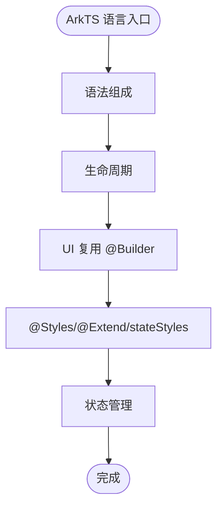

图表来源
- [docs/harmony-os/grammar/grammar.md:1-545](file://docs/harmony-os/grammar/grammar.md#L1-L545)

章节来源
- [docs/harmony-os/grammar/grammar.md:1-545](file://docs/harmony-os/grammar/grammar.md#L1-L545)

### HarmonyOS：程序包基础与共享包
- Stage 模型应用包结构：AppScope、entry/feature HAP、bundleName 与 App Pack。
- 多 HAP 构建视图：IDE 开发态与编译打包后视图。
- 共享包：HAR（静态共享包）与 HSP（动态共享包）的创建、导出、编译、发布与引用。
- 资源访问：resources 目录、资源组、应用资源与系统资源的访问方式。

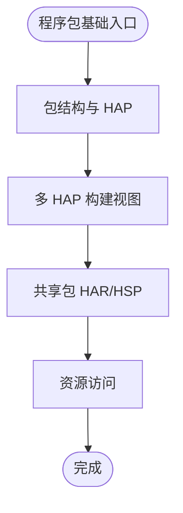

图表来源
- [docs/harmony-os/package/package.md:1-376](file://docs/harmony-os/package/package.md#L1-L376)

章节来源
- [docs/harmony-os/package/package.md:1-376](file://docs/harmony-os/package/package.md#L1-L376)

## 依赖分析
- 主题与配置：VuePress 主题与配置文件统一站点风格与目录。
- 导航与主题：navbar.js 将前端基础、前端进阶、HarmonyOS 等主题纳入导航，形成清晰的知识地图。
- 模块耦合：前端进阶模块与基础模块相互支撑，HarmonyOS 作为独立主题与前端主线并行，降低耦合度，提升可维护性。

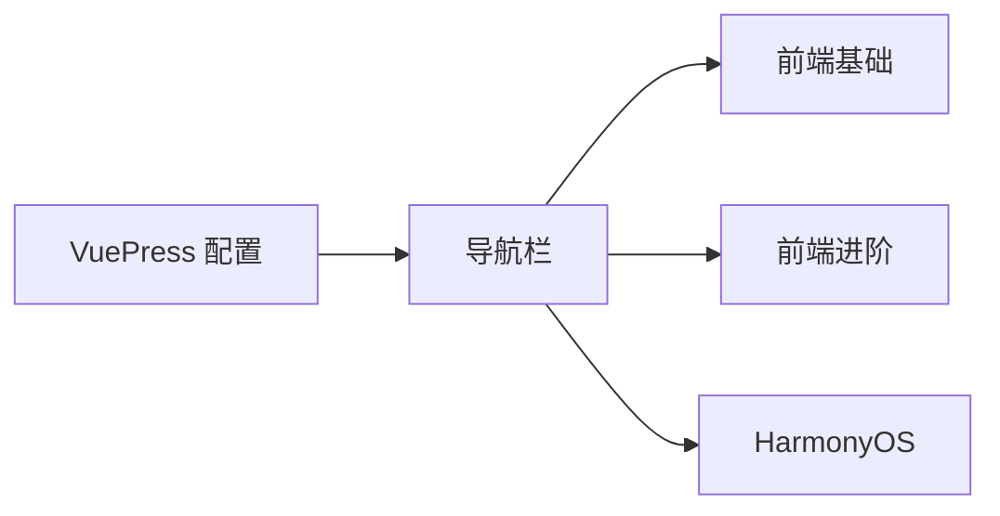

图表来源
- [.vuepress/config.js:1-18](file://.vuepress/config.js#L1-L18)
- [.vuepress/navbar.js:1-142](file://.vuepress/navbar.js#L1-L142)

章节来源
- [.vuepress/config.js:1-18](file://.vuepress/config.js#L1-L18)
- [.vuepress/navbar.js:1-142](file://.vuepress/navbar.js#L1-L142)

## 性能考量
- 构建性能：优先使用最新 Node/webpack；合理配置 loader 与解析；减少 resolve 条目；避免不必要的 symlink；使用 DLL 与 worker 池；控制 chunk 数量与体积。
- 开发体验：watch 模式与内存编译；合理 devtool；避免生产环境工具在开发阶段使用；关闭 pathinfo。
- 生产优化：按需生成 sourceMap；tree-shaking 与 sideEffects；ProvidePlugin 与 imports-loader；terser 压缩与 runtimeChunk。

章节来源
- [docs/frontend-advanced/webpack/config.md:638-800](file://docs/frontend-advanced/webpack/config.md#L638-L800)

## 故障排查指南
- 路径解析问题：确认 path 模块的 basename/dirname/extname/format/parse/normalize/relative/resolve/join 的使用是否正确，注意平台差异与扩展名解析。
- Webpack 构建错误：检查入口配置、解析规则、模块规则与输出配置；关注 clean、hash、publicPath、runtimeChunk 等选项；排查 sideEffects 与 tree-shaking。
- HarmonyOS 资源冲突：遵循资源优先级覆盖规则；HAR/HSP 资源命名冲突按依赖顺序覆盖。
- TS 类型错误：核对基本类型、联合/交叉类型、接口与泛型使用；关注类型断言与非空断言的使用场景。

章节来源
- [docs/frontend-advanced/node/path.md:1-202](file://docs/frontend-advanced/node/path.md#L1-L202)
- [docs/frontend-advanced/webpack/config.md:1-800](file://docs/frontend-advanced/webpack/config.md#L1-L800)
- [docs/harmony-os/package/package.md:129-134](file://docs/harmony-os/package/package.md#L129-L134)
- [docs/frontend-base/typescript/grammar.md:1-800](file://docs/frontend-base/typescript/grammar.md#L1-L800)

## 结论
本仓库以 VuePress 为主题，围绕前端基础与进阶知识体系构建了清晰的文档结构，并补充了 HarmonyOS 相关内容。通过统一的导航与侧边栏，用户可快速定位所需知识；通过模块化的文档组织，便于长期维护与扩展。建议在后续建设中持续完善创作模板与质量控制标准，确保内容的一致性与可读性。

## 附录

### 文档组织与编写规范
- 文档分类原则
  - 基础知识：以“HTML/CSS/JS/TS/RegExp/Browser”为主，强调概念与语法。
  - 进阶知识：以“ES6+/Node/Webpack/算法/JS手写实现”为主，强调实践与优化。
  - HarmonyOS：以“ArkTS/包结构/共享包/资源”为主，强调平台特性与工程实践。
- 标题层级规范
  - 一级标题：章节总览（如“# ES6”）
  - 二级标题：子主题（如“## let/const 块级作用域”）
  - 三级标题：细粒度知识点（如“### 临时性死区”）
- 代码示例格式要求
  - 使用 Markdown 代码块标注语言类型（如 ```js），避免直接粘贴代码内容。
  - 示例路径引用：通过“[文件名:行号范围](file://相对路径)”进行引用，便于溯源与校验。
  - 示例说明：在代码块前后提供简洁说明，解释用途与注意事项。
- 最佳实践指导
  - 术语统一：如“模块/包/库/组件”等术语保持一致。
  - 图表辅助：复杂流程与关系使用 Mermaid 图表，增强可读性。
  - 参考来源：所有示例与结论均提供“章节来源”与“图表来源”。

### 创作模板
- 模板结构
  - 章节标题：# 章节名称
  - 章节说明：简述本章目标与适用人群
  - 知识点拆分：二级标题分段讲解
  - 代码示例：使用 ```js 代码块，配合说明
  - 关系图/流程图：使用 Mermaid
  - 章节来源：列出参考文件与行号范围
- 示例引用路径
  - 代码示例路径：[文件名:起止行:15-30](file://docs/.../xxx.md#L15-L30)
  - 图表来源：[文件名:起止行:1-50](file://docs/.../xxx.md#L1-L50)

章节来源
- [docs/frontend-advanced/es6/grammar.md:1-800](file://docs/frontend-advanced/es6/grammar.md#L1-L800)
- [docs/frontend-advanced/webpack/config.md:1-800](file://docs/frontend-advanced/webpack/config.md#L1-L800)
- [docs/frontend-advanced/js-implement/implement.md:1-800](file://docs/frontend-advanced/js-implement/implement.md#L1-L800)
- [docs/frontend-base/typescript/grammar.md:1-800](file://docs/frontend-base/typescript/grammar.md#L1-L800)
- [docs/harmony-os/grammar/grammar.md:1-545](file://docs/harmony-os/grammar/grammar.md#L1-L545)
- [docs/harmony-os/package/package.md:1-376](file://docs/harmony-os/package/package.md#L1-L376)