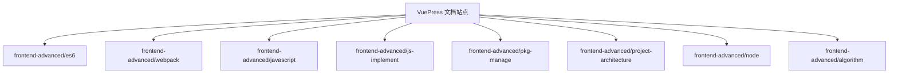
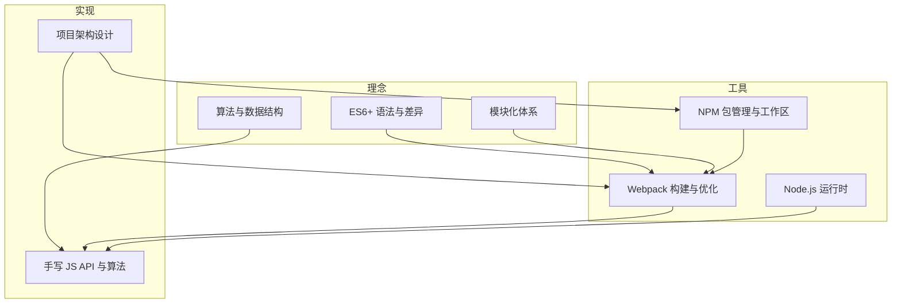
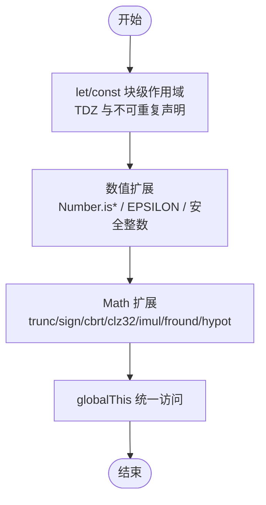
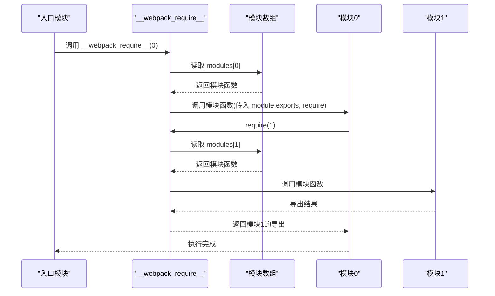
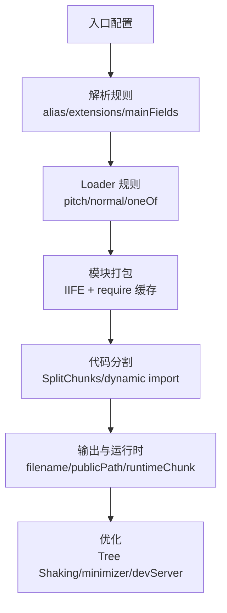
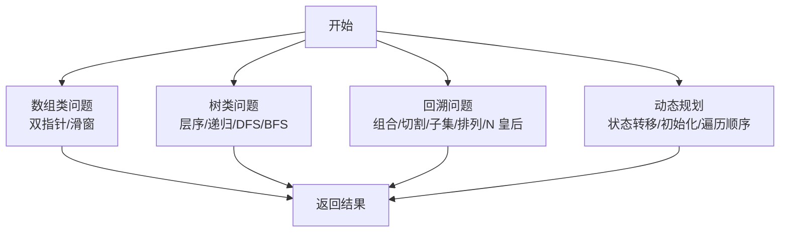
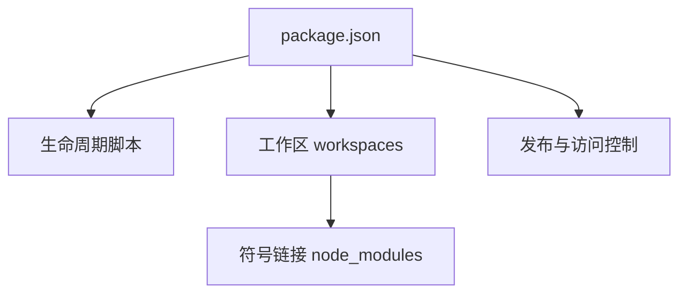
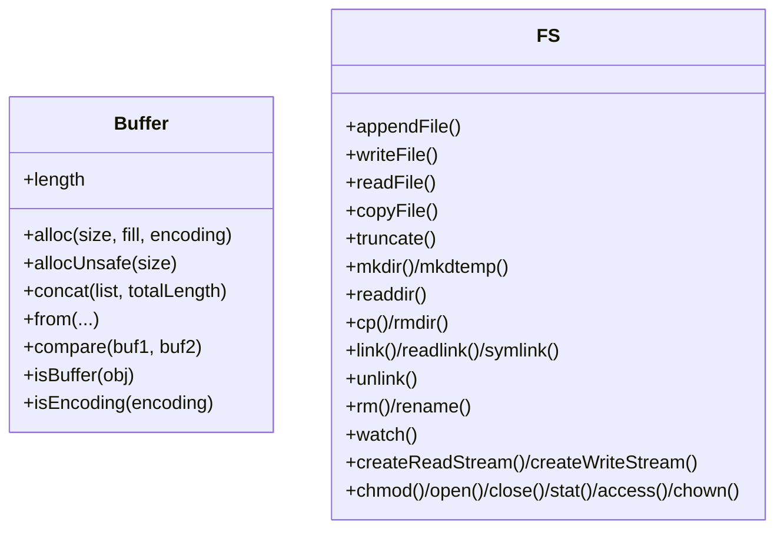
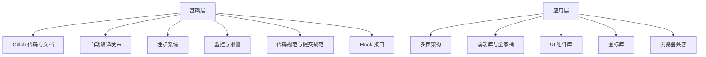
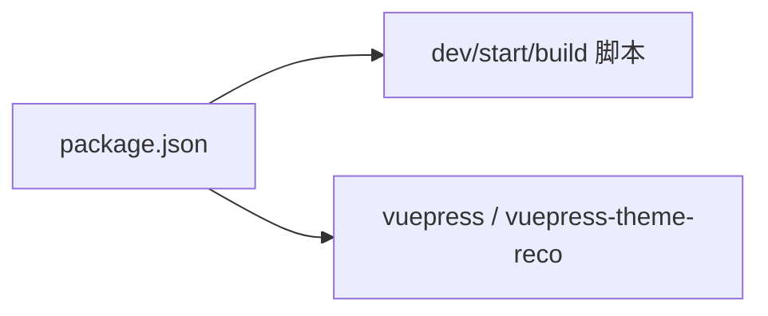

# 前端进阶技术

<cite>
**本文引用的文件**
- [package.json](file://package.json)
- [README.md](file://README.md)
- [docs/frontend-advanced/es6/grammar.md](file://docs/frontend-advanced/es6/grammar.md)
- [docs/frontend-advanced/webpack/config.md](file://docs/frontend-advanced/webpack/config.md)
- [docs/frontend-advanced/javascript/module.md](file://docs/frontend-advanced/javascript/module.md)
- [docs/frontend-advanced/js-implement/implement.md](file://docs/frontend-advanced/js-implement/implement.md)
- [docs/frontend-advanced/pkg-manage/instruction.md](file://docs/frontend-advanced/pkg-manage/instruction.md)
- [docs/frontend-advanced/project-architecture/introduction.md](file://docs/frontend-advanced/project-architecture/introduction.md)
- [docs/frontend-advanced/node/buffer.md](file://docs/frontend-advanced/node/buffer.md)
- [docs/frontend-advanced/node/fs.md](file://docs/frontend-advanced/node/fs.md)
- [docs/frontend-advanced/algorithm/Algorithm.md](file://docs/frontend-advanced/algorithm/Algorithm.md)
- [docs/frontend-advanced/algorithm/array.md](file://docs/frontend-advanced/algorithm/array.md)
- [docs/frontend-advanced/algorithm/tree-example.md](file://docs/frontend-advanced/algorithm/tree-example.md)
- [docs/frontend-advanced/algorithm/back-trace.md](file://docs/frontend-advanced/algorithm/back-trace.md)
- [docs/frontend-advanced/algorithm/dynamic-programming.md](file://docs/frontend-advanced/algorithm/dynamic-programming.md)
</cite>

## 目录
1. [简介](#简介)
2. [项目结构](#项目结构)
3. [核心组件](#核心组件)
4. [架构总览](#架构总览)
5. [详细组件分析](#详细组件分析)
6. [依赖分析](#依赖分析)
7. [性能考量](#性能考量)
8. [故障排查指南](#故障排查指南)
9. [结论](#结论)
10. [附录](#附录)

## 简介
本文件面向前端进阶开发者，系统梳理 ES6+ 语法、Node.js 服务端能力、Webpack 构建体系、算法与数据结构、JavaScript 高级特性与原理解释、包管理工具使用、项目架构设计等主题。文档以“知识—实践—集成—优化”的主线展开，既提供概念拆解与原理讲解，也给出可迁移的实践案例与最佳实践，帮助读者在真实项目中落地高级技术。

## 项目结构
该项目为 VuePress 文档站点，围绕“前端进阶技术”主题组织内容，采用按主题分目录的结构：
- docs/frontend-advanced：进阶主题文档
  - es6：ES6+ 语法要点与差异
  - webpack：构建配置与优化
  - javascript：模块化与手写实现
  - js-implement：手写 JS API 与算法
  - pkg-manage：包管理工具与工作区
  - project-architecture：项目架构设计
  - node：Node.js 常用 API
  - algorithm：算法与数据结构
- docs/interview、docs/react18、docs/vue2 等：补充面试、框架与生态内容
- package.json：脚本与依赖

图表来源
- [package.json:1-17](file://package.json#L1-L17)
- [README.md:1-12](file://README.md#L1-L12)

章节来源
- [package.json:1-17](file://package.json#L1-L17)
- [README.md:1-12](file://README.md#L1-L12)

## 核心组件
- ES6+ 语法与运行时差异：变量作用域、块级作用域、数值扩展、Math 扩展、全局对象等
- 模块化体系：CommonJS、AMD/CMD、ES Module 与打包器实现
- 构建工具：Webpack 入口、解析、Loader、SplitChunks、Tree Shaking、优化策略
- 手写实现：数组扁平化、去重、数组方法、函数 API、Promise、调度器等
- 包管理：NPM 生态、工作区、生命周期、发布与访问控制
- Node.js：Buffer、文件系统 API、流与权限
- 算法与数据结构：数组、树、回溯、动态规划等实战案例
- 项目架构：Gitlab、CI/CD、埋点与监控、代码规范与提交规范、多页/单页选型

章节来源
- [docs/frontend-advanced/es6/grammar.md:1-800](file://docs/frontend-advanced/es6/grammar.md#L1-L800)
- [docs/frontend-advanced/javascript/module.md:1-337](file://docs/frontend-advanced/javascript/module.md#L1-L337)
- [docs/frontend-advanced/webpack/config.md:1-800](file://docs/frontend-advanced/webpack/config.md#L1-L800)
- [docs/frontend-advanced/js-implement/implement.md:1-800](file://docs/frontend-advanced/js-implement/implement.md#L1-L800)
- [docs/frontend-advanced/pkg-manage/instruction.md:1-800](file://docs/frontend-advanced/pkg-manage/instruction.md#L1-L800)
- [docs/frontend-advanced/node/buffer.md:1-359](file://docs/frontend-advanced/node/buffer.md#L1-L359)
- [docs/frontend-advanced/node/fs.md:1-448](file://docs/frontend-advanced/node/fs.md#L1-L448)
- [docs/frontend-advanced/algorithm/Algorithm.md:1-60](file://docs/frontend-advanced/algorithm/Algorithm.md#L1-L60)
- [docs/frontend-advanced/algorithm/array.md:1-161](file://docs/frontend-advanced/algorithm/array.md#L1-L161)
- [docs/frontend-advanced/algorithm/tree-example.md:1-532](file://docs/frontend-advanced/algorithm/tree-example.md#L1-L532)
- [docs/frontend-advanced/algorithm/back-trace.md:1-433](file://docs/frontend-advanced/algorithm/back-trace.md#L1-L433)
- [docs/frontend-advanced/algorithm/dynamic-programming.md:1-210](file://docs/frontend-advanced/algorithm/dynamic-programming.md#L1-L210)

## 架构总览
前端进阶技术的知识体系与工程实践可抽象为“理念—工具—实现—优化”的闭环：
- 理念：以 ES6+ 语法与模块化思想为基石，以算法与数据结构为方法论
- 工具：Webpack 构建与 Tree Shaking、NPM 包管理与工作区、Node.js 运行时
- 实现：手写 JS API 与算法，沉淀可迁移的工程能力
- 优化：性能、可维护性、可观测性与可扩展性

## 详细组件分析

### ES6+ 语法与运行时差异
- 变量与作用域：let/const 的块级作用域、TDZ、不可重复声明、不挂载到顶层对象
- 数值与 Math 扩展：二进制/八进制、Number.isFinite/NaN/Integer、EPSILON、安全整数、Math.trunc/sign/cbrt/clz32/imul/fround/hypot、对数方法
- 全局对象：globalThis 的统一访问
- 性能与兼容：数值精度、安全整数范围、误差容忍

图表来源
- [docs/frontend-advanced/es6/grammar.md:1-800](file://docs/frontend-advanced/es6/grammar.md#L1-L800)

章节来源
- [docs/frontend-advanced/es6/grammar.md:1-800](file://docs/frontend-advanced/es6/grammar.md#L1-L800)

### 模块化体系与打包器实现
- CommonJS：exports/require 的同步加载与打包器实现（IIFE + require 缓存）
- AMD/CMD：异步加载与按需加载
- ES Module：语言层模块化、编译期依赖分析、Tree Shaking
- 打包器兼容：多环境判断与导出适配

图表来源
- [docs/frontend-advanced/javascript/module.md:1-337](file://docs/frontend-advanced/javascript/module.md#L1-L337)

章节来源
- [docs/frontend-advanced/javascript/module.md:1-337](file://docs/frontend-advanced/javascript/module.md#L1-L337)

### Webpack 构建与优化
- 入口与模式：多入口、函数入口、mode 与 DefinePlugin
- 解析与资源：resolve.alias/extensions/mainFields/modules、资源类型与 generator/parser
- Loader 与规则：pitch/normal 阶段、exclude/include、oneOf、sideEffects
- 输出与运行时：filename/chunkFilename、publicPath、runtimeChunk、libraryTarget
- 代码分割：入口分离、动态导入、SplitChunks 与 prefetch/preload
- 优化：Tree Shaking、usedExports、sideEffects、minimizer、缓存与并发
- 开发体验：devServer、热更新、代理、静态资源目录

图表来源
- [docs/frontend-advanced/webpack/config.md:1-800](file://docs/frontend-advanced/webpack/config.md#L1-L800)

章节来源
- [docs/frontend-advanced/webpack/config.md:1-800](file://docs/frontend-advanced/webpack/config.md#L1-L800)

### 手写 JS API 与算法
- 数组与字符串：扁平化、去重、类数组转数组、Array.prototype 方法
- 函数 API：call/apply/bind、new、instanceof、深拷贝
- 并发与调度：Promise、Promise.all/race、并行限制调度器
- 高频算法：防抖/节流、函数柯里化
- 数据结构与算法：数组类（移除元素、有序数组平方、最小子数组、螺旋矩阵）、树类（右视图、层平均值、最大深度、最小深度、对称树、最近公共祖先等）、回溯（组合、切割 IP、子集、全排列、N 皇后）、动态规划（爬楼梯、不同路径、整数拆分、分割等和子集、最后一块石头、一和零、零钱兑换）

图表来源
- [docs/frontend-advanced/js-implement/implement.md:1-800](file://docs/frontend-advanced/js-implement/implement.md#L1-L800)
- [docs/frontend-advanced/algorithm/array.md:1-161](file://docs/frontend-advanced/algorithm/array.md#L1-L161)
- [docs/frontend-advanced/algorithm/tree-example.md:1-532](file://docs/frontend-advanced/algorithm/tree-example.md#L1-L532)
- [docs/frontend-advanced/algorithm/back-trace.md:1-433](file://docs/frontend-advanced/algorithm/back-trace.md#L1-L433)
- [docs/frontend-advanced/algorithm/dynamic-programming.md:1-210](file://docs/frontend-advanced/algorithm/dynamic-programming.md#L1-L210)

章节来源
- [docs/frontend-advanced/js-implement/implement.md:1-800](file://docs/frontend-advanced/js-implement/implement.md#L1-L800)
- [docs/frontend-advanced/algorithm/array.md:1-161](file://docs/frontend-advanced/algorithm/array.md#L1-L161)
- [docs/frontend-advanced/algorithm/tree-example.md:1-532](file://docs/frontend-advanced/algorithm/tree-example.md#L1-L532)
- [docs/frontend-advanced/algorithm/back-trace.md:1-433](file://docs/frontend-advanced/algorithm/back-trace.md#L1-L433)
- [docs/frontend-advanced/algorithm/dynamic-programming.md:1-210](file://docs/frontend-advanced/algorithm/dynamic-programming.md#L1-L210)

### 包管理工具与工作区
- NPM 包结构：name/version/exports/main/browser/bin/engine/private 等
- 生命周期：install/publish/start/stop/test/version 等
- 工作区：workspaces 自动符号链接、跨包安装与命令
- 发布与访问：access、dist-tags、engine-strict、registry

图表来源
- [docs/frontend-advanced/pkg-manage/instruction.md:1-800](file://docs/frontend-advanced/pkg-manage/instruction.md#L1-L800)

章节来源
- [docs/frontend-advanced/pkg-manage/instruction.md:1-800](file://docs/frontend-advanced/pkg-manage/instruction.md#L1-L800)

### Node.js 运行时
- Buffer：构造、比较、复制、填充、字符串转换、迭代与属性
- 文件系统：文件/目录/链接操作、流、权限与状态、监听与重命名

图表来源
- [docs/frontend-advanced/node/buffer.md:1-359](file://docs/frontend-advanced/node/buffer.md#L1-L359)
- [docs/frontend-advanced/node/fs.md:1-448](file://docs/frontend-advanced/node/fs.md#L1-L448)

章节来源
- [docs/frontend-advanced/node/buffer.md:1-359](file://docs/frontend-advanced/node/buffer.md#L1-L359)
- [docs/frontend-advanced/node/fs.md:1-448](file://docs/frontend-advanced/node/fs.md#L1-L448)

### 项目架构设计
- 基础层：自建 Gitlab、自动编译发布、埋点系统、监控与报警、代码规范与提交规范、Mock
- 应用层：多页/单页选型、前端库与 UI 组件库、图标库、浏览器兼容

图表来源
- [docs/frontend-advanced/project-architecture/introduction.md:1-112](file://docs/frontend-advanced/project-architecture/introduction.md#L1-L112)

章节来源
- [docs/frontend-advanced/project-architecture/introduction.md:1-112](file://docs/frontend-advanced/project-architecture/introduction.md#L1-L112)

## 依赖分析
- VuePress 与主题：文档站点依赖与脚本
- 依赖关系：站点运行依赖 vuepress 与主题，构建与开发脚本由 package.json 统一管理

图表来源
- [package.json:1-17](file://package.json#L1-L17)

章节来源
- [package.json:1-17](file://package.json#L1-L17)

## 性能考量
- 构建性能：解析优化、Loader 作用范围、DLL/缓存、worker 池、增量编译、内存编译、合理 devtool、避免生产工具用于开发、关闭路径信息
- Tree Shaking：ES6 静态导入、usedExports、sideEffects、Mode: production
- 代码分割：入口分离、动态导入、SplitChunks 参数与优先级
- 运行时性能：Buffer 池、字符串与编码、文件流读写、权限与 stat

## 故障排查指南
- 模块化问题：CommonJS 与 ES Module 的差异、运行时 vs 编译时分析、__esModule 标记
- 构建问题：resolve.alias 与 extensions 冲突、loader 顺序与覆盖、oneOf 命中优先级、sideEffects 误伤
- 性能问题：Chunk 数量过多、未使用模块未剔除、minimizer 未启用、sourceMap 未关闭
- Node.js 问题：Buffer 内容泄漏、文件权限与编码、流读写截断、watch 误触发

章节来源
- [docs/frontend-advanced/javascript/module.md:1-337](file://docs/frontend-advanced/javascript/module.md#L1-L337)
- [docs/frontend-advanced/webpack/config.md:1-800](file://docs/frontend-advanced/webpack/config.md#L1-L800)
- [docs/frontend-advanced/node/buffer.md:1-359](file://docs/frontend-advanced/node/buffer.md#L1-L359)
- [docs/frontend-advanced/node/fs.md:1-448](file://docs/frontend-advanced/node/fs.md#L1-L448)

## 结论
本文件将 ES6+、模块化、构建工具、算法与数据结构、包管理、Node.js、项目架构等主题串联为一套可迁移的前端进阶知识体系。通过“概念—实现—集成—优化”的路径，读者可在实际项目中高效落地高级技术，提升系统的可维护性、性能与可扩展性。

## 附录
- 算法与数据结构总览：算法是解题方案的描述，具备有限性、确切性、输入、输出、可行性；前端常见应用包括虚拟 DOM、AST、联想与相似度检测等。

章节来源
- [docs/frontend-advanced/algorithm/Algorithm.md:1-60](file://docs/frontend-advanced/algorithm/Algorithm.md#L1-L60)