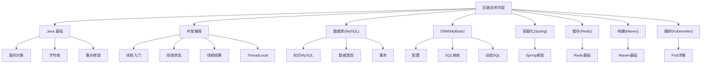
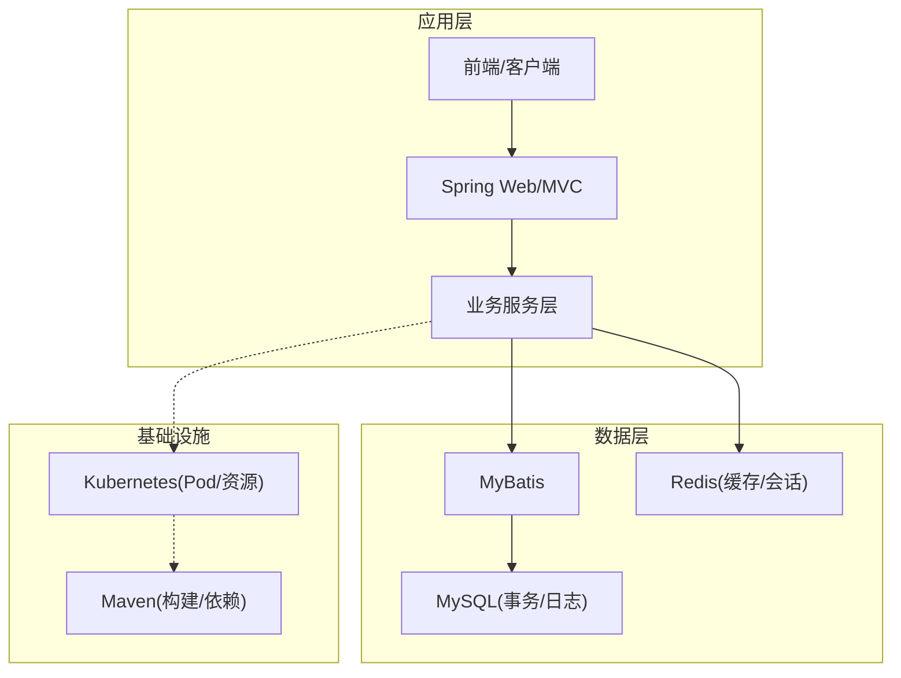
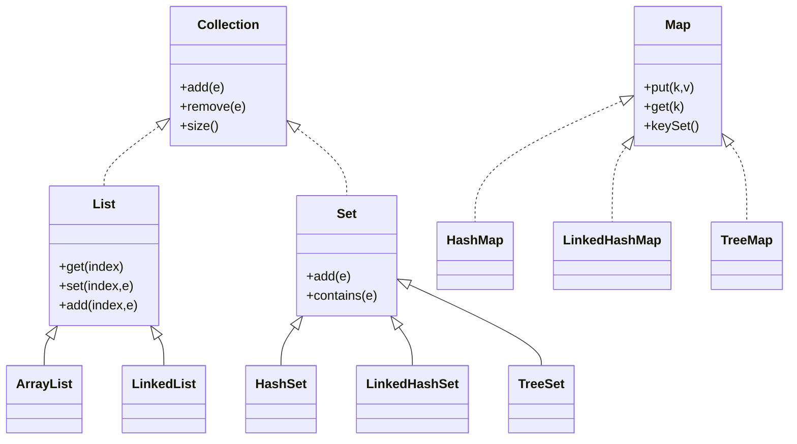
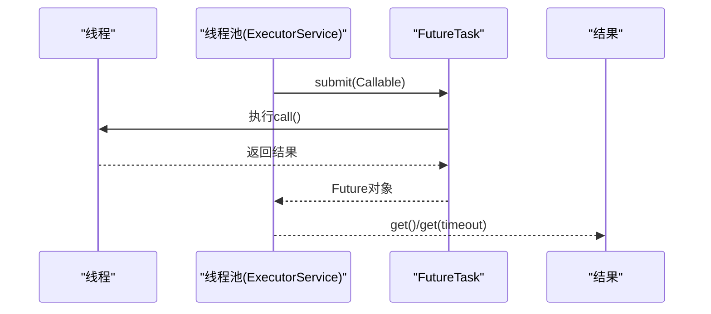
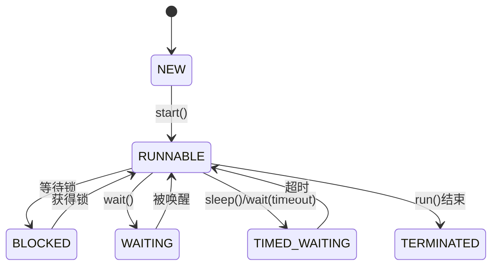
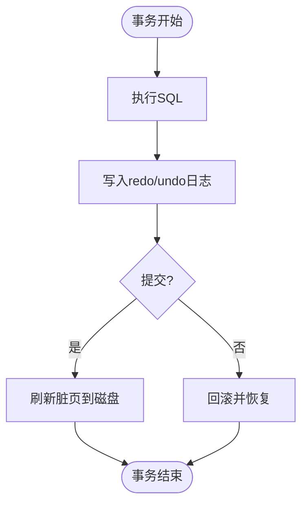
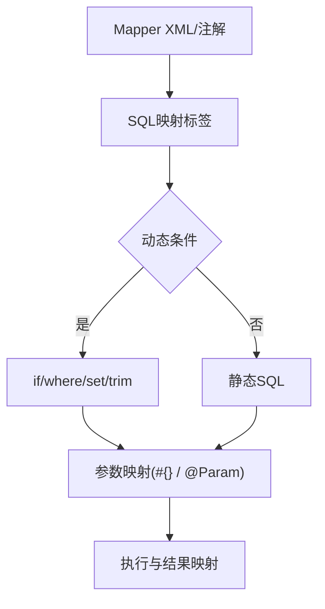
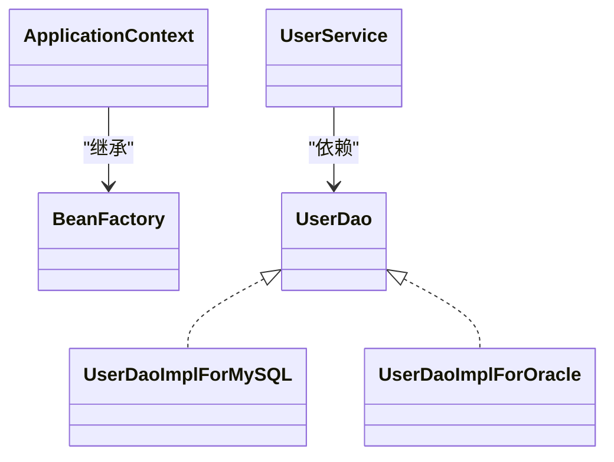
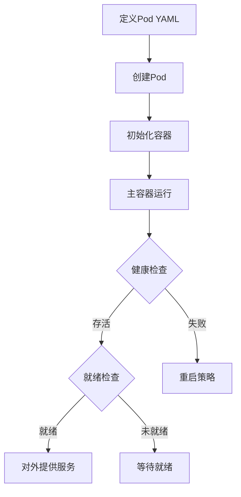
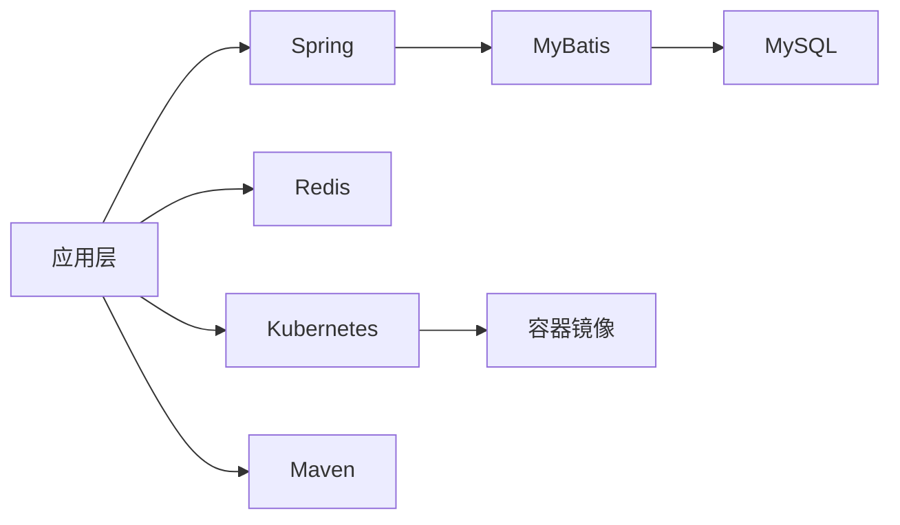

# 后端技术内容

<cite>
**本文引用的文件**
- [README.md](file://README.md)
- [java 面向对象](file://docs/backend-base/java/oop.md)
- [Java 字符串](file://docs/backend-base/java/string.md)
- [Java 集合框架](file://docs/backend-base/java/collection.md)
- [多线程入门](file://docs/backend-base/thread/base.md)
- [获取线程执行结果](file://docs/backend-base/thread/result.md)
- [线程状态](file://docs/backend-base/thread/status.md)
- [ThreadLocal](file://docs/backend-base/thread/thread-local.md)
- [MySQL 初识](file://docs/backend-base/mysql/base.md)
- [MySQL 数据类型](file://docs/backend-base/mysql/data-type.md)
- [MySQL 事务](file://docs/backend-base/mysql/transaction.md)
- [MyBatis 配置](file://docs/backend-base/mybatis/config.md)
- [MyBatis SQL映射](file://docs/backend-base/mybatis/mapper.md)
- [MyBatis 动态SQL](file://docs/backend-base/mybatis/dynamic-sql.md)
- [Spring 框架](file://docs/backend-base/spring/spring.md)
- [Redis 基础](file://docs/backend-base/redis-base.md)
- [Maven 基础](file://docs/backend-base/maven-base.md)
- [K8s Pod详解](file://docs/backend-base/k8s/pod.md)
</cite>

## 目录
1. [引言](#引言)
2. [项目结构](#项目结构)
3. [核心组件](#核心组件)
4. [架构总览](#架构总览)
5. [详细组件分析](#详细组件分析)
6. [依赖分析](#依赖分析)
7. [性能考量](#性能考量)
8. [故障排查指南](#故障排查指南)
9. [结论](#结论)
10. [附录](#附录)

## 引言
本技术文档围绕后端核心技术体系进行系统化梳理，覆盖 Java 语言基础、并发编程、MySQL 数据库、MyBatis 框架、Spring 框架、Redis 缓存、Maven 构建工具与 Kubernetes 容器编排。文档旨在：
- 明确各技术领域的知识组织方式与编写规范；
- 提炼架构设计理念与实践案例；
- 提供可落地的技术实现示例与性能优化建议；
- 给出技术选型建议与最佳实践总结。

## 项目结构
该项目采用文档化组织方式，将后端技术内容按主题划分为若干专题模块，便于读者按需查阅与深入学习。整体结构如下：

图表来源
- [README.md](file://README.md)
- [Java 面向对象](file://docs/backend-base/java/oop.md)
- [Java 字符串](file://docs/backend-base/java/string.md)
- [Java 集合框架](file://docs/backend-base/java/collection.md)
- [多线程入门](file://docs/backend-base/thread/base.md)
- [线程状态](file://docs/backend-base/thread/status.md)
- [获取线程执行结果](file://docs/backend-base/thread/result.md)
- [ThreadLocal](file://docs/backend-base/thread/thread-local.md)
- [MySQL 初识](file://docs/backend-base/mysql/base.md)
- [MySQL 数据类型](file://docs/backend-base/mysql/data-type.md)
- [MySQL 事务](file://docs/backend-base/mysql/transaction.md)
- [MyBatis 配置](file://docs/backend-base/mybatis/config.md)
- [MyBatis SQL映射](file://docs/backend-base/mybatis/mapper.md)
- [MyBatis 动态SQL](file://docs/backend-base/mybatis/dynamic-sql.md)
- [Spring 框架](file://docs/backend-base/spring/spring.md)
- [Redis 基础](file://docs/backend-base/redis-base.md)
- [Maven 基础](file://docs/backend-base/maven-base.md)
- [K8s Pod详解](file://docs/backend-base/k8s/pod.md)

章节来源
- [README.md](file://README.md)

## 核心组件
本节从技术栈维度对核心组件进行概览，明确各组件职责与边界，为后续深入分析奠定基础。

- Java 语言基础
  - 面向对象：类、抽象、封装、继承、接口、多态等核心概念与实践要点。
  - 字符串与集合：字符串不可变性、StringBuilder/Buffer、集合框架体系与典型实现。
- 并发编程
  - 线程创建与生命周期、状态转换、线程安全与同步机制。
  - 结果获取与线程上下文隔离(ThreadLocal)。
- 数据库与ORM
  - MySQL：数据类型、事务特性与隔离级别、WAL与日志机制。
  - MyBatis：配置、SQL映射、动态SQL与主键生成策略。
- 容器化与服务治理
  - Spring：IoC/DI、AOP、模块化与Web生态。
  - Redis：KV、Hash、List、Set、ZSet等命令与典型场景。
  - Kubernetes：Pod结构、生命周期、资源配额与健康探针。
- 工程化
  - Maven：生命周期、插件、聚合与继承、多环境配置与资源过滤。

章节来源
- [Java 面向对象](file://docs/backend-base/java/oop.md)
- [Java 字符串](file://docs/backend-base/java/string.md)
- [Java 集合框架](file://docs/backend-base/java/collection.md)
- [多线程入门](file://docs/backend-base/thread/base.md)
- [线程状态](file://docs/backend-base/thread/status.md)
- [获取线程执行结果](file://docs/backend-base/thread/result.md)
- [ThreadLocal](file://docs/backend-base/thread/thread-local.md)
- [MySQL 初识](file://docs/backend-base/mysql/base.md)
- [MySQL 数据类型](file://docs/backend-base/mysql/data-type.md)
- [MySQL 事务](file://docs/backend-base/mysql/transaction.md)
- [MyBatis 配置](file://docs/backend-base/mybatis/config.md)
- [MyBatis SQL映射](file://docs/backend-base/mybatis/mapper.md)
- [MyBatis 动态SQL](file://docs/backend-base/mybatis/dynamic-sql.md)
- [Spring 框架](file://docs/backend-base/spring/spring.md)
- [Redis 基础](file://docs/backend-base/redis-base.md)
- [Maven 基础](file://docs/backend-base/maven-base.md)
- [K8s Pod详解](file://docs/backend-base/k8s/pod.md)

## 架构总览
后端技术体系以“语言基础—并发—数据—持久化—容器—运维—工程化”为主线，形成从应用层到基础设施的完整闭环。下图展示典型后端应用的分层与交互关系：

图表来源
- [Spring 框架](file://docs/backend-base/spring/spring.md)
- [MyBatis 配置](file://docs/backend-base/mybatis/config.md)
- [MySQL 事务](file://docs/backend-base/mysql/transaction.md)
- [Redis 基础](file://docs/backend-base/redis-base.md)
- [K8s Pod详解](file://docs/backend-base/k8s/pod.md)
- [Maven 基础](file://docs/backend-base/maven-base.md)

## 详细组件分析

### Java 语言基础
- 面向对象
  - 类与对象、抽象类与接口、继承与方法重写、访问控制与this/super。
  - 设计原则：OCP、DIP与IoC，为Spring依赖注入奠定基础。
- 字符串与缓冲
  - 不可变性与驻留字符串；StringBuilder/Buffer的性能优势与适用场景。
- 集合框架
  - 单列(List/Set)与双列(Map)；ArrayList/LinkedList/HashSet/LinkedHashSet/TreeSet/HashMap/LinkedHashMap/TreeMap等实现特性与选择建议。

图表来源
- [Java 集合框架](file://docs/backend-base/java/collection.md)

章节来源
- [Java 面向对象](file://docs/backend-base/java/oop.md)
- [Java 字符串](file://docs/backend-base/java/string.md)
- [Java 集合框架](file://docs/backend-base/java/collection.md)

### 并发编程
- 线程创建与生命周期
  - 继承Thread、实现Runnable、实现Callable与FutureTask；线程池与ExecutorService。
- 线程状态与转换
  - NEW、RUNNABLE、BLOCKED、WAITING、TIMED_WAITING、TERMINATED；中断机制。
- 线程安全与结果获取
  - synchronized、锁对象选择；Future/FutureTask获取异步结果。
- 线程上下文隔离
  - ThreadLocal的set/get/remove与典型使用场景。

图表来源
- [获取线程执行结果](file://docs/backend-base/thread/result.md)

图表来源
- [线程状态](file://docs/backend-base/thread/status.md)

章节来源
- [多线程入门](file://docs/backend-base/thread/base.md)
- [获取线程执行结果](file://docs/backend-base/thread/result.md)
- [线程状态](file://docs/backend-base/thread/status.md)
- [ThreadLocal](file://docs/backend-base/thread/thread-local.md)

### MySQL 数据库
- 数据类型
  - 整数、浮点、定点、字符串、Blob/Text、日期时间类型及修饰符。
- 事务与隔离
  - ACID特性、并发问题(脏读/不可重复读/幻读)、WAL与日志(undo/redo/binlog)。
- 连接与性能
  - 连接池与驱动交互、缓冲池(Buffer Pool)、随机IO与顺序写优化。

图表来源
- [MySQL 事务](file://docs/backend-base/mysql/transaction.md)

章节来源
- [MySQL 初识](file://docs/backend-base/mysql/base.md)
- [MySQL 数据类型](file://docs/backend-base/mysql/data-type.md)
- [MySQL 事务](file://docs/backend-base/mysql/transaction.md)

### MyBatis 框架
- 配置与环境
  - properties、settings、typeAliases、environments(transactionManager、dataSource)、mappers。
- SQL映射与动态SQL
  - select/insert/update/delete标签、resultType/resultMap、参数映射、动态条件与集合遍历。
- 主键生成
  - useGeneratedKeys、@Options与@SelectKey、selectKey标签。

图表来源
- [MyBatis SQL映射](file://docs/backend-base/mybatis/mapper.md)
- [MyBatis 动态SQL](file://docs/backend-base/mybatis/dynamic-sql.md)
- [MyBatis 配置](file://docs/backend-base/mybatis/config.md)

章节来源
- [MyBatis 配置](file://docs/backend-base/mybatis/config.md)
- [MyBatis SQL映射](file://docs/backend-base/mybatis/mapper.md)
- [MyBatis 动态SQL](file://docs/backend-base/mybatis/dynamic-sql.md)

### Spring 框架
- IoC与依赖注入
  - 控制反转思想、Bean管理、XML配置与装配、ApplicationContext与BeanFactory。
- 模块与特性
  - Core、Context、AOP、DAO/ORM、Web MVC/WebFlux、事务管理与声明式事务。
- 实践案例
  - 通过Spring解耦DAO实现，面向接口编程，符合OCP与DIP。

图表来源
- [Spring 框架](file://docs/backend-base/spring/spring.md)

章节来源
- [Spring 框架](file://docs/backend-base/spring/spring.md)

### Redis 缓存
- 数据结构与命令
  - 字符串、Hash、List、Set、ZSet通用命令；键空间管理与过期策略。
- 典型场景
  - 会话缓存、计数器、排行榜、消息队列等。

章节来源
- [Redis 基础](file://docs/backend-base/redis-base.md)

### Maven 构建工具
- 生命周期与插件
  - clean/default/site生命周期阶段；插件目标与参数；资源过滤与多环境配置。
- 聚合与继承
  - 多模块聚合、父子继承、dependencyManagement与版本对齐。
- 按需构建
  - -pl/-am/-amd参数控制构建范围与依赖构建。

章节来源
- [Maven 基础](file://docs/backend-base/maven-base.md)

### Kubernetes 容器编排
- Pod详解
  - 结构与Pause容器、资源配额、生命周期、钩子函数、健康探针(liveness/readiness)。
- YAML配置
  - metadata/spec/status字段、容器配置、存储卷、重启策略、节点选择与网络。

图表来源
- [K8s Pod详解](file://docs/backend-base/k8s/pod.md)

章节来源
- [K8s Pod详解](file://docs/backend-base/k8s/pod.md)

## 依赖分析
- 组件耦合
  - 应用层通过Spring服务层调用MyBatis访问MySQL；缓存层通过Redis提升热点数据访问性能；Kubernetes编排容器化部署；Maven统一管理依赖与构建。
- 外部依赖
  - Spring依赖MyBatis与数据库驱动；MyBatis依赖JDBC与连接池；Kubernetes依赖容器镜像与网络插件；Maven依赖仓库与插件生态。

图表来源
- [Spring 框架](file://docs/backend-base/spring/spring.md)
- [MyBatis 配置](file://docs/backend-base/mybatis/config.md)
- [MySQL 事务](file://docs/backend-base/mysql/transaction.md)
- [Redis 基础](file://docs/backend-base/redis-base.md)
- [K8s Pod详解](file://docs/backend-base/k8s/pod.md)
- [Maven 基础](file://docs/backend-base/maven-base.md)

## 性能考量
- 数据库层面
  - 合理选择数据类型与索引；利用缓冲池减少磁盘IO；WAL顺序写优于随机写；事务粒度与隔离级别平衡一致性与吞吐。
- ORM层面
  - 使用resultMap避免N+1查询；合理分页与索引覆盖；动态SQL按需拼接，避免全表扫描。
- 并发与线程
  - 线程池大小与队列策略；FutureTask获取结果避免阻塞；ThreadLocal避免共享状态竞争。
- 缓存策略
  - 缓存穿透、击穿、雪崩的防护；热点数据预热与过期策略；缓存与DB一致性。
- 容器与构建
  - Pod资源限制与请求平衡；镜像瘦身与分层优化；Maven并行构建与多环境隔离。

## 故障排查指南
- 线程问题
  - 线程阻塞与死锁定位；状态转换异常；中断机制与优雅停机。
- 数据库问题
  - 事务回滚与一致性；日志分析(binlog/redo/undo)；连接池耗尽与慢查询。
- ORM问题
  - SQL映射错误、参数类型不匹配、动态SQL拼接异常。
- 缓存问题
  - 缓存不命中、数据不一致、过期策略不当。
- 容器问题
  - Pod状态异常、资源配额不足、健康探针失败、网络与存储卷问题。
- 构建问题
  - 依赖冲突、插件目标参数错误、多环境配置未生效。

章节来源
- [线程状态](file://docs/backend-base/thread/status.md)
- [MySQL 事务](file://docs/backend-base/mysql/transaction.md)
- [MyBatis 动态SQL](file://docs/backend-base/mybatis/dynamic-sql.md)
- [K8s Pod详解](file://docs/backend-base/k8s/pod.md)
- [Maven 基础](file://docs/backend-base/maven-base.md)

## 结论
本技术文档系统梳理了后端核心技术的知识脉络与实践要点，强调以“解耦合、可扩展、可观测、可运维”为核心设计思想。通过Spring的IoC/AOP、MyBatis的SQL映射与动态SQL、MySQL的事务与日志机制、Redis的高性能缓存、Kubernetes的容器编排与Maven的工程化管理，形成从应用到基础设施的完整技术闭环。建议在实际项目中结合业务场景，遵循最佳实践，持续优化性能与稳定性。

## 附录
- 编写规范
  - 使用简洁标题与清晰层级；术语统一；示例以路径引用代替代码片段；图表标注来源文件。
- 深度要求
  - 基础：掌握概念与常用API；进阶：理解原理与性能影响；专家：具备架构设计与故障定位能力。
- 技术选型建议
  - 语言：Java 17+；框架：Spring 6 + MyBatis；数据库：MySQL 8+；缓存：Redis；容器：Kubernetes；构建：Maven；编排：Helm/ArgoCD。