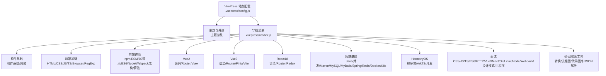
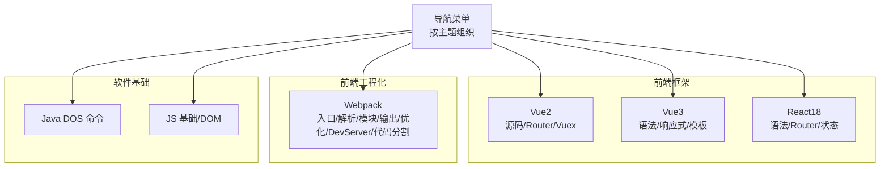
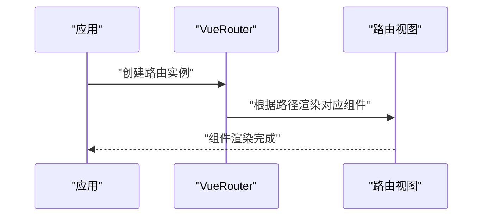
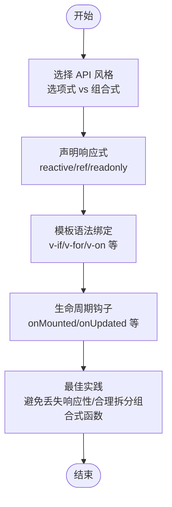
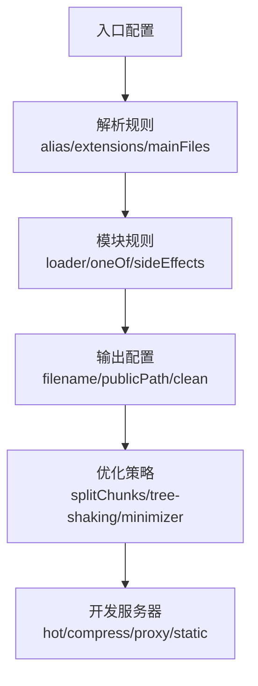
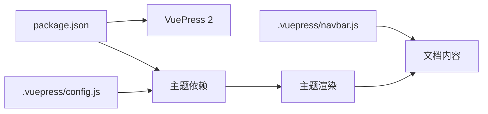

# 框架应用内容

<cite>
**本文引用的文件**
- [README.md](file://README.md)
- [package.json](file://package.json)
- [.vuepress/config.js](file://.vuepress/config.js)
- [.vuepress/navbar.js](file://.vuepress/navbar.js)
- [docs/vue2/vue/introduction/introduction.md](file://docs/vue2/vue/introduction/introduction.md)
- [docs/vue2/vue-router/introduction.md](file://docs/vue2/vue-router/introduction.md)
- [docs/vue2/vuex/introduction.md](file://docs/vue2/vuex/introduction.md)
- [docs/vue3/vue/grammar.md](file://docs/vue3/vue/grammar.md)
- [docs/React18/react/grammar.md](file://docs/React18/react/grammar.md)
- [docs/React18/react/router.md](file://docs/React18/react/router.md)
- [docs/frontend-base/javascript/grammar.md](file://docs/frontend-base/javascript/grammar.md)
- [docs/frontend-base/javascript/dom.md](file://docs/frontend-base/javascript/dom.md)
- [docs/frontend-advanced/webpack/config.md](file://docs/frontend-advanced/webpack/config.md)
- [docs/backend-base/java/DOS.md](file://docs/backend-base/java/DOS.md)
</cite>

## 目录
1. [简介](#简介)
2. [项目结构](#项目结构)
3. [核心组件](#核心组件)
4. [架构总览](#架构总览)
5. [详细组件分析](#详细组件分析)
6. [依赖分析](#依赖分析)
7. [性能考量](#性能考量)
8. [故障排查指南](#故障排查指南)
9. [结论](#结论)
10. [附录](#附录)

## 简介
本文件面向“框架应用内容”的知识体系整理，聚焦于 Vue.js、React、软件基础等主题，系统梳理 Vue2 源码分析、Vue2 Router、Vue2 Vuex、Vue3 新特性、React18 新特性、前端工程化与工具链（Webpack）等核心内容。文档以 VuePress 主题为载体，形成可浏览、可检索的知识库，便于学习者按主题路径深入掌握各框架与工具的要点、实践与优化策略。

## 项目结构
该仓库采用 VuePress 2 + 主题进行内容组织，导航栏按“软件基础、前端基础、前端进阶、Vue2/Vue3、React18、后端基础、HarmonyOS、面试、价值网站、工具”等维度划分，形成清晰的知识谱系。VuePress 配置文件定义站点标题、描述、主题与系列/导航菜单，确保内容可发现性与一致性。



图表来源
- [.vuepress/config.js:1-18](file://.vuepress/config.js#L1-L18)
- [.vuepress/navbar.js:1-142](file://.vuepress/navbar.js#L1-L142)

章节来源
- [.vuepress/config.js:1-18](file://.vuepress/config.js#L1-L18)
- [.vuepress/navbar.js:1-142](file://.vuepress/navbar.js#L1-L142)
- [package.json:1-17](file://package.json#L1-L17)
- [README.md:1-12](file://README.md#L1-L12)

## 核心组件
- Vue2 源码与生态
  - Vue2 核心思想与版本演进、虚拟 DOM 与 SSR 能力
  - Vue-Router 路由注册、组件映射与基础使用
  - Vuex 集中式状态管理初始化与辅助 API 设计
- Vue3 新特性
  - 选项式 API 与组合式 API、setup 与 script setup
  - 响应式 API（reactive/ref/readonly/shallow* 等）
  - 模板语法与指令（v-if/v-show/v-for/v-on 等）
- React18 新特性
  - JSX 语法与事件处理、条件/列表渲染
  - Hooks（useState/useReducer 等）、状态迁移与 reducer
  - React Router6 数据流路由（loader/action）、懒加载与错误边界
- 前端工程化与工具链
  - Webpack 入口/解析/模块/输出/优化/DevServer/代码分割
- 软件基础
  - Java 常用 DOS 命令、前端 JS 基础与 DOM 操作

章节来源
- [docs/vue2/vue/introduction/introduction.md:1-28](file://docs/vue2/vue/introduction/introduction.md#L1-L28)
- [docs/vue2/vue-router/introduction.md:1-68](file://docs/vue2/vue-router/introduction.md#L1-L68)
- [docs/vue2/vuex/introduction.md:1-38](file://docs/vue2/vuex/introduction.md#L1-L38)
- [docs/vue3/vue/grammar.md:1-800](file://docs/vue3/vue/grammar.md#L1-L800)
- [docs/React18/react/grammar.md:1-800](file://docs/React18/react/grammar.md#L1-L800)
- [docs/React18/react/router.md:1-540](file://docs/React18/react/router.md#L1-L540)
- [docs/frontend-advanced/webpack/config.md:1-800](file://docs/frontend-advanced/webpack/config.md#L1-L800)
- [docs/frontend-base/javascript/grammar.md:1-493](file://docs/frontend-base/javascript/grammar.md#L1-L493)
- [docs/frontend-base/javascript/dom.md:1-800](file://docs/frontend-base/javascript/dom.md#L1-L800)
- [docs/backend-base/java/DOS.md:1-75](file://docs/backend-base/java/DOS.md#L1-L75)

## 架构总览
本知识库以 VuePress 为主题渲染为核心，导航菜单串联各主题内容，形成“主题 -> 子主题 -> 文档”的层级结构。Vue2/Vue3/React18 三大前端框架分别覆盖“源码/生态”“语法/特性”“路由/状态”等维度；前端工程化围绕 Webpack 的入口、解析、模块、输出、优化、DevServer、代码分割等进行系统讲解；软件基础补充后端与系统命令等知识。



图表来源
- [.vuepress/navbar.js:42-65](file://.vuepress/navbar.js#L42-L65)
- [docs/vue3/vue/grammar.md:1-800](file://docs/vue3/vue/grammar.md#L1-L800)
- [docs/React18/react/router.md:1-540](file://docs/React18/react/router.md#L1-L540)
- [docs/frontend-advanced/webpack/config.md:1-800](file://docs/frontend-advanced/webpack/config.md#L1-L800)
- [docs/backend-base/java/DOS.md:1-75](file://docs/backend-base/java/DOS.md#L1-L75)
- [docs/frontend-base/javascript/grammar.md:1-493](file://docs/frontend-base/javascript/grammar.md#L1-L493)

## 详细组件分析

### Vue2 源码与生态
- 核心思想与版本演进
  - 数据驱动与组件化两大核心思想
  - 从 1.x 到 2.x 的渲染层重构与 API 友好性
  - 虚拟 DOM、JSX、TypeScript、SSR、Weex 等能力
- Vue-Router
  - 三种路由模式（hash/history/abstract）
  - 基础组件（router-link/router-view）
  - 基本使用流程：install -> 定义路由 -> 创建实例 -> 挂载根实例
- Vuex
  - 初始化流程：State/Mutations/Actions/Getters/Modules
  - 辅助 API：createNamespacedHelpers/mapState/mapMutations/mapActions
  - Store 实例 API：commit/dispatch/subscribe/subscribeAction/registerModule/unregisterModule



图表来源
- [docs/vue2/vue-router/introduction.md:27-65](file://docs/vue2/vue-router/introduction.md#L27-L65)

章节来源
- [docs/vue2/vue/introduction/introduction.md:1-28](file://docs/vue2/vue/introduction/introduction.md#L1-L28)
- [docs/vue2/vue-router/introduction.md:1-68](file://docs/vue2/vue-router/introduction.md#L1-L68)
- [docs/vue2/vuex/introduction.md:1-38](file://docs/vue2/vuex/introduction.md#L1-L38)

### Vue3 新特性
- 语法与 API
  - 选项式 API 与组合式 API 的对比与使用场景
  - setup 钩子、script setup、上下文对象（attrs/slots/emit/expose）
  - 响应式 API：reactive/ref/readonly/shallowRef/shallowReactive/shallowReadonly
  - 工具 API：isRef/unref/toRef/toRefs/isProxy/isReactive/isReadonly/effectScope
  - 模板语法：v-if/v-show/v-for/v-on、v-bind/v-html 等
- 最佳实践
  - 合理选择 API 风格，组合式函数复用状态逻辑
  - 模板引用与 ref 的配合，避免丢失响应性
  - 深入理解浅层 API 的适用场景（性能优化）



图表来源
- [docs/vue3/vue/grammar.md:43-163](file://docs/vue3/vue/grammar.md#L43-L163)
- [docs/vue3/vue/grammar.md:165-493](file://docs/vue3/vue/grammar.md#L165-L493)

章节来源
- [docs/vue3/vue/grammar.md:1-800](file://docs/vue3/vue/grammar.md#L1-L800)

### React18 新特性
- JSX 与事件处理
  - JSX 语法规则、属性命名（小驼峰）、子元素形式、防注入
  - 事件处理（onClick 等）、事件传播与阻止、默认行为
- 条件与列表渲染
  - if/&&/? : 三元运算符、阻止条件渲染
  - 列表渲染与 key 的重要性
- 状态与迁移
  - useState 快照语义与批量更新
  - useReducer 与状态迁移，替代复杂状态逻辑
- React Router6
  - 数据流路由：loader/action、useLoaderData/useRouteError
  - 路由配置：path/element/Component/errorElement/indexRoute/懒加载
  - 导航：Link 与 useNavigate、useLocation/useParams/useSearchParams/useMatches

```mermaid
sequenceDiagram
participant User as "用户"
participant Link as "Link/Navigate"
participant Router as "Router"
participant Loader as "Loader"
participant Component as "组件"
User->>Link : "点击导航"
Link->>Router : "更新 URL"
Router->>Loader : "并行加载数据"
Loader-->>Router : "返回数据"
Router-->>Component : "渲染匹配组件"
```

图表来源
- [docs/React18/react/router.md:340-421](file://docs/React18/react/router.md#L340-L421)
- [docs/React18/react/grammar.md:358-800](file://docs/React18/react/grammar.md#L358-L800)

章节来源
- [docs/React18/react/grammar.md:1-800](file://docs/React18/react/grammar.md#L1-L800)
- [docs/React18/react/router.md:1-540](file://docs/React18/react/router.md#L1-L540)

### 前端工程化与工具链（Webpack）
- 入口与上下文
  - 多入口、函数入口、共享依赖、filename/chunkLoading/layer
- 解析规则
  - alias、extensions、mainFields/mainFiles/modules、preferRelative/preferAbsolute/roots
- 模块与规则
  - loader 执行顺序（pitching/normal）、exclude/include/test、oneOf、sideEffects
- 输出与优化
  - filename/chunkFilename/publicPath/clean/hash/optimization.runtimeChunk/splitChunks
  - tree-shaking、usedExports、sideEffects、minimizer、providedExports
- DevServer 与性能
  - hot、compress、https、headers、host/port/proxy/static/watch
  - 构建性能优化：版本、loader、解析、dll、worker 池、增量编译



图表来源
- [docs/frontend-advanced/webpack/config.md:1-800](file://docs/frontend-advanced/webpack/config.md#L1-L800)

章节来源
- [docs/frontend-advanced/webpack/config.md:1-800](file://docs/frontend-advanced/webpack/config.md#L1-L800)

### 软件基础与前端基础
- Java 常用 DOS 命令
  - 盘符切换、目录查看/进入、文件夹创建/删除/重命名/移动
- JavaScript 基础与 DOM
  - 语法结构、变量/表达式/语句、条件/循环、函数
  - DOM 节点属性/关系/操作、NodeList/HTMLCollection、Document/Element

章节来源
- [docs/backend-base/java/DOS.md:1-75](file://docs/backend-base/java/DOS.md#L1-L75)
- [docs/frontend-base/javascript/grammar.md:1-493](file://docs/frontend-base/javascript/grammar.md#L1-L493)
- [docs/frontend-base/javascript/dom.md:1-800](file://docs/frontend-base/javascript/dom.md#L1-L800)

## 依赖分析
- 主题与依赖
  - VuePress 2 与主题依赖通过 package.json 管理，脚本提供 dev/build
- 内容组织依赖
  - 导航菜单 navbar.js 决定内容可发现性与路径映射
  - VuePress 配置 config.js 决定站点外观与主题参数



图表来源
- [package.json:1-17](file://package.json#L1-L17)
- [.vuepress/config.js:1-18](file://.vuepress/config.js#L1-L18)
- [.vuepress/navbar.js:1-142](file://.vuepress/navbar.js#L1-L142)

章节来源
- [package.json:1-17](file://package.json#L1-L17)
- [.vuepress/config.js:1-18](file://.vuepress/config.js#L1-L18)
- [.vuepress/navbar.js:1-142](file://.vuepress/navbar.js#L1-L142)

## 性能考量
- Vue3
  - 合理使用浅层 API（shallowRef/shallowReactive）优化大型数据结构
  - 模板引用与响应式解包的边界，避免不必要的依赖追踪
- React18
  - 使用 useReducer 管理复杂状态迁移，减少多处状态分散
  - 事件处理中避免在渲染期间产生副作用
- Webpack
  - 代码分割与懒加载（React Router6 lazy）
  - tree-shaking 与 sideEffects 配置，剔除未使用代码
  - splitChunks 与 maxSize/minSize 策略平衡缓存与请求数
  - DevServer 热更新与静态资源代理，提升开发体验

章节来源
- [docs/vue3/vue/grammar.md:357-493](file://docs/vue3/vue/grammar.md#L357-L493)
- [docs/React18/react/grammar.md:358-800](file://docs/React18/react/grammar.md#L358-L800)
- [docs/React18/react/router.md:325-338](file://docs/React18/react/router.md#L325-L338)
- [docs/frontend-advanced/webpack/config.md:544-800](file://docs/frontend-advanced/webpack/config.md#L544-L800)

## 故障排查指南
- Vue2
  - 路由组件未渲染：确认路由注册顺序、路径匹配与 router-view 使用
  - 状态未更新：检查 mutations/actions 的同步/异步调用与 commit/dispatch
- Vue3
  - 响应性丢失：避免解构丢失响应性，使用 toRef/toRefs 或 .value 访问
  - 模板引用为空：确保在挂载后访问 ref，或使用 expose 暴露实例方法
- React18
  - 状态更新无效：使用更新函数（如 setX(prev => ...)）或对象/数组深拷贝
  - 路由错误边界：在根路由设置 errorElement，使用 useRouteError/isRouteErrorResponse
- Webpack
  - 解析失败：检查 resolve.alias/extension/mainFiles/modules 配置
  - 未生效的 loader：确认规则 test/include/exclude 与执行顺序
  - 构建缓慢：启用缓存、减少 noParse、使用 thread-loader、避免不必要的优化

章节来源
- [docs/vue2/vue-router/introduction.md:1-68](file://docs/vue2/vue-router/introduction.md#L1-L68)
- [docs/vue2/vuex/introduction.md:1-38](file://docs/vue2/vuex/introduction.md#L1-L38)
- [docs/vue3/vue/grammar.md:165-493](file://docs/vue3/vue/grammar.md#L165-L493)
- [docs/React18/react/router.md:231-338](file://docs/React18/react/router.md#L231-L338)
- [docs/frontend-advanced/webpack/config.md:1-800](file://docs/frontend-advanced/webpack/config.md#L1-L800)

## 结论
本知识库以 VuePress 为主题承载，系统覆盖 Vue2/Vue3、React18、前端工程化与软件基础等关键内容。通过“主题导航 + 文档路径”的组织方式，学习者可按需深入任一领域；结合最佳实践与性能优化建议，有助于在实际项目中高效落地。

## 附录
- 选型建议（概念性总结）
  - 业务复杂度与团队熟悉度：Vue3 组合式 API 适合复杂状态与逻辑复用；React18 在数据流路由与状态迁移方面提供更强的声明式能力
  - 工程化需求：Webpack 配置需结合 splitChunks、tree-shaking、DevServer 等策略平衡体积与体验
  - 跨端与平台：Vue3 生态完善，React18 在数据流路由方面更贴近现代 SPA/MPA 场景