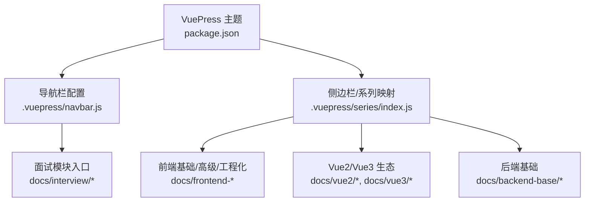
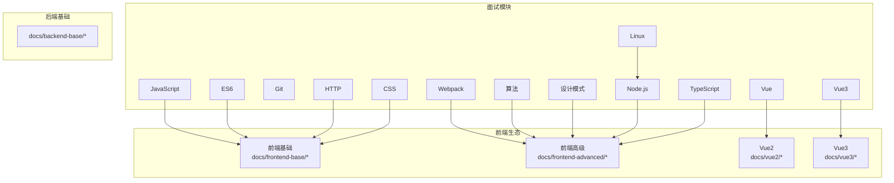
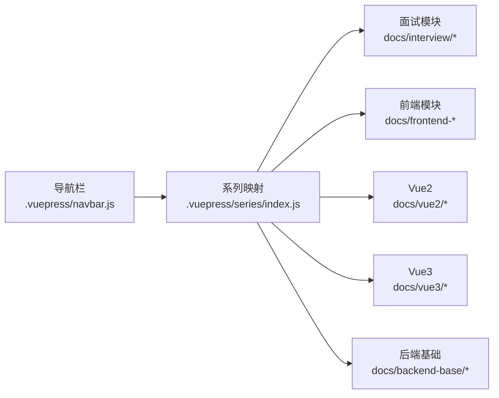

# 面试准备内容

<cite>
**本文档引用的文件**
- [README.md](file://README.md)
- [package.json](file://package.json)
- [.vuepress/series/index.js](file://.vuepress/series/index.js)
- [.vuepress/navbar.js](file://.vuepress/navbar.js)
- [docs/interview/JavaScript/array_api.md](file://docs/interview/JavaScript/array_api.md)
- [docs/interview/JavaScript/inherit.md](file://docs/interview/JavaScript/inherit.md)
- [docs/interview/es6/promise.md](file://docs/interview/es6/promise.md)
- [docs/interview/es6/function.md](file://docs/interview/es6/function.md)
- [docs/interview/git/git reset_ git revert.md](file://docs/interview/git/git reset_ git revert.md)
- [docs/interview/http/DNS.md](file://docs/interview/http/DNS.md)
- [docs/interview/linux/linux users.md](file://docs/interview/linux/linux users.md)
- [docs/interview/node/nodejs.md](file://docs/interview/node/nodejs.md)
- [docs/interview/typescript/data_type.md](file://docs/interview/typescript/data_type.md)
- [docs/interview/vue/vue.md](file://docs/interview/vue/vue.md)
- [docs/interview/vue3/proxy.md](file://docs/interview/vue3/proxy.md)
- [docs/interview/webpack/build_process.md](file://docs/interview/webpack/build_process.md)
- [docs/frontend-advanced/algorithm/Algorithm.md](file://docs/frontend-advanced/algorithm/Algorithm.md)
- [docs/interview/design/design.md](file://docs/interview/design/design.md)
- [docs/interview/css/animation.md](file://docs/interview/css/animation.md)
</cite>

## 目录
1. [简介](#简介)
2. [项目结构](#项目结构)
3. [核心组件](#核心组件)
4. [架构总览](#架构总览)
5. [详细组件分析](#详细组件分析)
6. [依赖分析](#依赖分析)
7. [性能考量](#性能考量)
8. [故障排查指南](#故障排查指南)
9. [结论](#结论)
10. [附录](#附录)

## 简介
本文件面向前端与全栈岗位的面试准备，系统梳理并整合仓库中关于 JavaScript、CSS、设计模式、ES6、Git、HTTP、Linux、Node.js、TypeScript、Vue、Vue3、Webpack 等高频技术点的文档内容，提供：
- 面试内容组织方式与复习策略
- 技术要点的深度要求与答题技巧
- 面试真题与模拟练习建议
- 面试官常见问题与优秀答案示例
- 算法题解与最佳实践总结

## 项目结构
该仓库采用 VuePress 主题进行文档组织，面试相关内容集中在 docs/interview 目录下，涵盖前端基础、高级算法、设计模式、工程化与后端基础等模块。导航栏与侧边栏通过 .vuepress 配置文件进行聚合。

图表来源
- [package.json:1-17](file://package.json#L1-L17)
- [.vuepress/navbar.js:89-105](file://.vuepress/navbar.js#L89-L105)
- [.vuepress/series/index.js:29-57](file://.vuepress/series/index.js#L29-L57)

章节来源
- [README.md:1-12](file://README.md#L1-L12)
- [package.json:1-17](file://package.json#L1-L17)
- [.vuepress/navbar.js:89-105](file://.vuepress/navbar.js#L89-L105)
- [.vuepress/series/index.js:29-57](file://.vuepress/series/index.js#L29-L57)

## 核心组件
围绕面试高频技术点，本仓库提供了以下核心知识单元：
- JavaScript：数组 API、继承实现、原型链与寄生组合式继承、严格模式与函数扩展
- ES6：Promise 机制与使用场景、函数参数默认值/解构/name/length/严格模式与箭头函数
- Git：reset 与 revert 的区别与适用场景
- HTTP：DNS 查询完整流程与缓存
- Linux：用户与用户组、权限模型、常用用户管理命令
- Node.js：运行时特性、优缺点与应用场景
- TypeScript：基础数据类型与扩展类型
- Vue：框架理解、MVVM、组件化、指令系统与与 jQuery 的差异
- Vue3：Proxy API 替代 defineProperty 的原因与优势
- Webpack：构建流程（初始化/编译/输出）
- CSS：动画实现（transition/transform/animation）
- 算法：算法与数据结构的关系、应用场景
- 设计模式：常见模式与适用场景

章节来源
- [docs/interview/JavaScript/array_api.md:1-295](file://docs/interview/JavaScript/array_api.md#L1-L295)
- [docs/interview/JavaScript/inherit.md:1-254](file://docs/interview/JavaScript/inherit.md#L1-L254)
- [docs/interview/es6/promise.md:1-388](file://docs/interview/es6/promise.md#L1-L388)
- [docs/interview/es6/function.md:1-228](file://docs/interview/es6/function.md#L1-L228)
- [docs/interview/git/git reset_ git revert.md:1-109](file://docs/interview/git/git reset_ git revert.md#L1-L109)
- [docs/interview/http/DNS.md:1-77](file://docs/interview/http/DNS.md#L1-L77)
- [docs/interview/linux/linux users.md:1-329](file://docs/interview/linux/linux users.md#L1-L329)
- [docs/interview/node/nodejs.md:1-69](file://docs/interview/node/nodejs.md#L1-L69)
- [docs/interview/typescript/data_type.md:1-197](file://docs/interview/typescript/data_type.md#L1-L197)
- [docs/interview/vue/vue.md:1-119](file://docs/interview/vue/vue.md#L1-L119)
- [docs/interview/vue3/proxy.md:1-300](file://docs/interview/vue3/proxy.md#L1-L300)
- [docs/interview/webpack/build_process.md:1-219](file://docs/interview/webpack/build_process.md#L1-L219)
- [docs/interview/css/animation.md:1-187](file://docs/interview/css/animation.md#L1-L187)
- [docs/frontend-advanced/algorithm/Algorithm.md:1-60](file://docs/frontend-advanced/algorithm/Algorithm.md#L1-L60)
- [docs/interview/design/design.md:1-122](file://docs/interview/design/design.md#L1-L122)

## 架构总览
面试内容的组织遵循“主题-专题-知识点”的层级结构，通过导航与侧边栏聚合，形成“知识地图”。下图展示面试模块与前端/后端生态的关联：

图表来源
- [.vuepress/navbar.js:89-105](file://.vuepress/navbar.js#L89-L105)
- [.vuepress/series/index.js:29-57](file://.vuepress/series/index.js#L29-L57)

## 详细组件分析

### JavaScript 数组 API
- 操作方法：增（push/unshift/splice/concat）、删（pop/shift/splice/slice）、改（splice）、查（indexOf/includes/find/findIndex）
- 排序：reverse/sort（比较函数）
- 转换：join
- 迭代：some/every/forEach/filter/map
- 答题技巧：强调“是否修改原数组”“返回值类型”“典型使用场景”

章节来源
- [docs/interview/JavaScript/array_api.md:1-295](file://docs/interview/JavaScript/array_api.md#L1-L295)

### JavaScript 继承实现
- 原型链继承、构造函数继承、组合继承、原型式继承、寄生式继承、寄生组合式继承
- ES6 extends 语法与寄生组合继承的关系
- 答题技巧：指出每种方式的优缺点与适用场景，强调“引用属性共享”“方法继承”“性能开销”

章节来源
- [docs/interview/JavaScript/inherit.md:1-254](file://docs/interview/JavaScript/inherit.md#L1-L254)

### ES6 Promise
- 状态：pending/fulfilled/rejected
- 实例方法：then/catch/finally
- 构造函数方法：all/race/allSettled/resolve/reject
- 使用场景：链式调用、并发合并、超时控制
- 答题技巧：解释“冒泡”“错误捕获”“性能与可读性提升”

章节来源
- [docs/interview/es6/promise.md:1-388](file://docs/interview/es6/promise.md#L1-L388)

### ES6 函数扩展
- 参数默认值、解构默认值、尾参数默认值、作用域
- length/name/严格模式限制
- 箭头函数：this 绑定、不可构造、不可用 arguments/yield
- 答题技巧：对比 ES5/ES6 的差异，强调“作用域与严格模式约束”

章节来源
- [docs/interview/es6/function.md:1-228](file://docs/interview/es6/function.md#L1-L228)

### Git reset 与 git revert
- reset：回退版本，移除历史，适合本地修改
- revert：新增一次提交抵消历史，适合已推送的提交
- 答题技巧：区分“是否改变历史”“merge 冲突影响”“安全性”

章节来源
- [docs/interview/git/git reset_ git revert.md:1-109](file://docs/interview/git/git reset_ git revert.md#L1-L109)

### HTTP DNS 查询
- 域名层次、查询方式（递归/迭代）、缓存（浏览器/系统/本地服务器）
- 完整查询过程与图示
- 答题技巧：按层级逐步说明，强调“缓存命中优先”“根/顶级/权威服务器协作”

章节来源
- [docs/interview/http/DNS.md:1-77](file://docs/interview/http/DNS.md#L1-L77)

### Linux 用户与权限
- 用户/用户组/其他人的权限模型
- 文件权限（rwx）与 ls -l 解析
- 用户/用户组/密码管理命令（useradd/passwd/chage/userdel/groupadd/groupmod/groupdel/su/sudo）
- 答题技巧：结合“最小权限原则”“安全与审计”展开

章节来源
- [docs/interview/linux/linux users.md:1-329](file://docs/interview/linux/linux users.md#L1-L329)

### Node.js 运行时
- 非阻塞 I/O、事件驱动、单线程
- 优缺点与应用场景（I/O 密集、高并发、实时交互）
- 与浏览器差异（API/环境/语法）
- 答题技巧：结合“性能瓶颈”“CPU 密集 vs I/O 密集”说明适用性

章节来源
- [docs/interview/node/nodejs.md:1-69](file://docs/interview/node/nodejs.md#L1-L69)

### TypeScript 数据类型
- 基础类型：boolean/number/string/array/tuple/enum/null/undefined/void/never/object
- 严格空检查与 any 的使用边界
- 答题技巧：强调“编译期类型检查”“类型安全收益”

章节来源
- [docs/interview/typescript/data_type.md:1-197](file://docs/interview/typescript/data_type.md#L1-L197)

### Vue 框架理解
- 历史演进：静态页→服务端渲染→SPA→百花齐放
- MVVM：Model/View/ViewModel
- 组件化：低耦合、可维护、可复用
- 指令系统：v-if/v-for/v-bind/v-on/v-model
- 与 jQuery 的差异：数据驱动 vs DOM 操作
- 答题技巧：结合“开发效率”“可维护性”“生态工具链”举例

章节来源
- [docs/interview/vue/vue.md:1-119](file://docs/interview/vue/vue.md#L1-L119)

### Vue3 Proxy 替代 defineProperty
- defineProperty：需遍历属性、无法监听新增/删除、数组 API 需重写、深层监听性能差
- Proxy：拦截整个对象、13 种拦截、天然支持数组、深层代理更自然
- 答题技巧：对比“能力边界”“性能与可维护性”“兼容性”

章节来源
- [docs/interview/vue3/proxy.md:1-300](file://docs/interview/vue3/proxy.md#L1-L300)

### Webpack 构建流程
- 初始化：读取配置、初始化 Compiler、激活插件
- 编译：从 Entry 分析模块依赖，递归构建 Module，AST 与 Loader 处理
- 输出：封装 Chunk、优化、生成文件
- 答题技巧：强调“事件流”“钩子机制”“模块化依赖图”

章节来源
- [docs/interview/webpack/build_process.md:1-219](file://docs/interview/webpack/build_process.md#L1-L219)

### CSS 动画
- transition：渐变动画（property/duration/timing-function/delay）
- transform：位移/缩放/旋转/倾斜
- animation：关键帧与 8 个属性简写
- 答题技巧：结合“性能”“可维护性”“浏览器兼容性”说明

章节来源
- [docs/interview/css/animation.md:1-187](file://docs/interview/css/animation.md#L1-L187)

### 算法与数据结构
- 算法定义、特性（有限性/确切性/输入/输出/可行性）
- 应用场景：虚拟 DOM/AST/相似度检测（最小编辑距离）
- 答题技巧：强调“数据结构是基础”“算法思维贯穿工程实践”

章节来源
- [docs/frontend-advanced/algorithm/Algorithm.md:1-60](file://docs/frontend-advanced/algorithm/Algorithm.md#L1-L60)

### 设计模式
- 定义：针对普遍问题的解决方案
- 常见模式：单例/工厂/策略/代理/中介者/装饰者
- 答题技巧：结合“解耦”“可扩展性”“可维护性”举例

章节来源
- [docs/interview/design/design.md:1-122](file://docs/interview/design/design.md#L1-L122)

## 依赖分析
- 导航与侧边栏映射：通过 .vuepress/series/index.js 将 docs/interview/* 与 docs/frontend-advanced/*、docs/vue2/*、docs/vue3/*、docs/backend-base/* 关联
- 运行时依赖：VuePress 与主题版本在 package.json 中声明
- 答题建议：将“知识地图”与“面试场景”结合，按“基础—进阶—工程化—生态”四层递进复习

图表来源
- [.vuepress/navbar.js:89-105](file://.vuepress/navbar.js#L89-L105)
- [.vuepress/series/index.js:29-57](file://.vuepress/series/index.js#L29-L57)

章节来源
- [.vuepress/series/index.js:29-57](file://.vuepress/series/index.js#L29-L57)
- [package.json:1-17](file://package.json#L1-L17)

## 性能考量
- JavaScript：优先使用迭代方法（map/filter/forEach）替代副作用循环；避免不必要的深拷贝
- ES6：合理使用解构与默认值，减少分支判断；箭头函数避免额外的 this 绑定成本
- Promise：all/race/allSettled 的选择依据“全部成功/首个失败/全部收敛”
- Vue3：Proxy 监听整体对象，减少深层监听开销；数组变更天然可监听
- Webpack：Loader 顺序与缓存、Tree Shaking、SplitChunks
- CSS：优先使用 transform/opacity；避免频繁布局抖动
- 算法：选择合适的数据结构（前缀树、哈希表）降低时间复杂度

## 故障排查指南
- Git：reset 与 revert 的误用导致历史混乱，应根据“是否已推送”选择策略
- Linux：权限不足导致命令失败，使用 sudo 或调整用户/用户组；passwd/chage 管理口令有效期
- Node.js：单线程阻塞 CPU 密集任务，应拆分微服务或使用 worker
- Vue3：Proxy 兼容性问题（IE），需考虑 polyfill 或降级策略
- Webpack：Loader 顺序不当导致 AST 解析失败，需按“从右到左”顺序配置

章节来源
- [docs/interview/git/git reset_ git revert.md:89-104](file://docs/interview/git/git reset_ git revert.md#L89-L104)
- [docs/interview/linux/linux users.md:312-323](file://docs/interview/linux/linux users.md#L312-L323)
- [docs/interview/node/nodejs.md:32-37](file://docs/interview/node/nodejs.md#L32-L37)
- [docs/interview/vue3/proxy.md:297-298](file://docs/interview/vue3/proxy.md#L297-L298)
- [docs/interview/webpack/build_process.md:179-204](file://docs/interview/webpack/build_process.md#L179-L204)

## 结论
本仓库以“知识地图+工程实践”为主线，覆盖前端与全栈面试高频技术点。建议按“基础—进阶—工程化—生态”四层递进复习，结合“面试真题—模拟练习—优秀答案示例—算法题解—最佳实践”闭环训练，提升综合能力与应试表现。

## 附录
- 面试真题与模拟练习建议
  - JavaScript：数组 API 与继承实现的代码改错题
  - ES6：Promise 并发与超时控制、函数参数默认值与解构陷阱
  - Git：reset 与 revert 的选择题与场景题
  - HTTP：DNS 查询流程与缓存命中路径
  - Linux：用户权限与命令组合题
  - Node.js：I/O 密集场景与单线程瓶颈
  - TypeScript：联合类型与严格空检查
  - Vue/Vue3：响应式原理与 Proxy 优势
  - Webpack：Loader/Plugin 生命周期与优化策略
  - CSS：动画性能与 transform/opacity 最佳实践
  - 算法：虚拟 DOM/AST/相似度检测
  - 设计模式：适配器/代理/策略在业务中的应用

- 答题技巧清单
  - 先总后分：先讲概念/原理，再给场景/案例
  - 对比分析：强调“ES5 vs ES6”“Vue2 vs Vue3”“Webpack 与 Vite”
  - 性能导向：说明“时间/空间复杂度”“渲染性能”“可维护性”
  - 工程化：结合“Loader/Plugin/配置”“CI/CD/监控”
  - 安全与兼容：Linux 权限、浏览器兼容、Node 版本策略