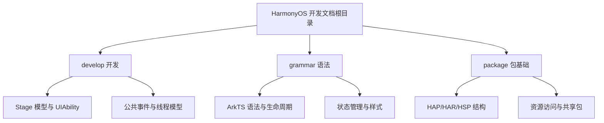
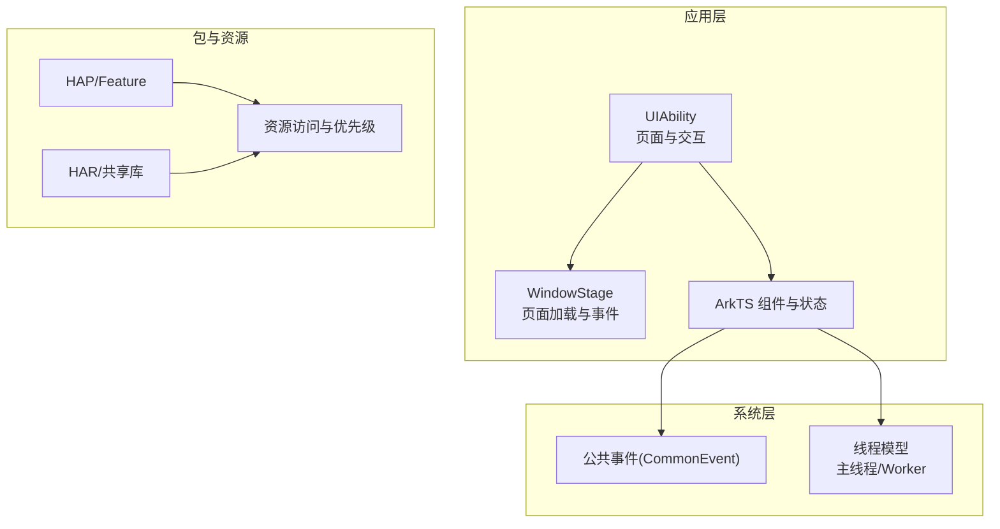
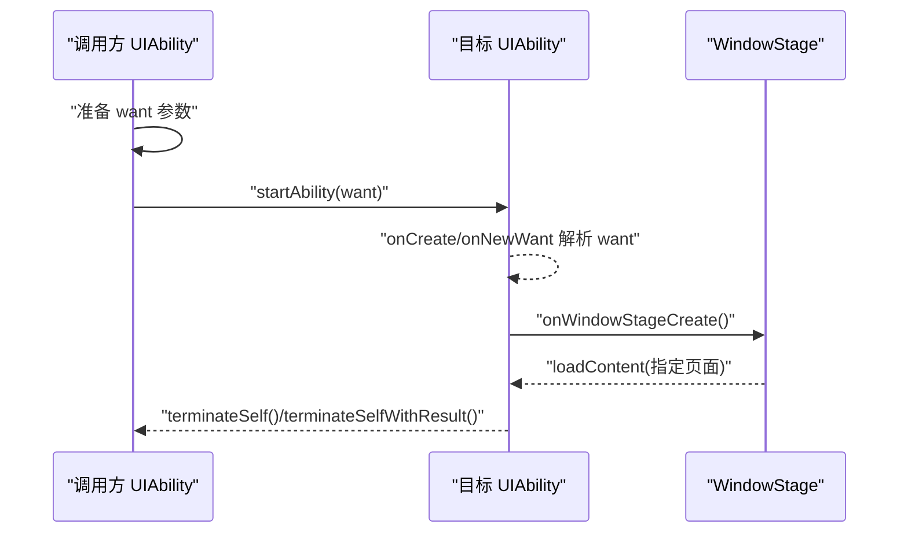
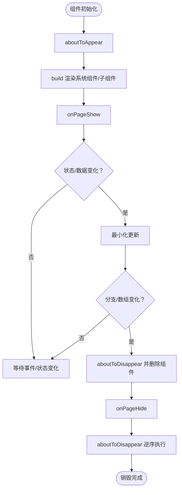
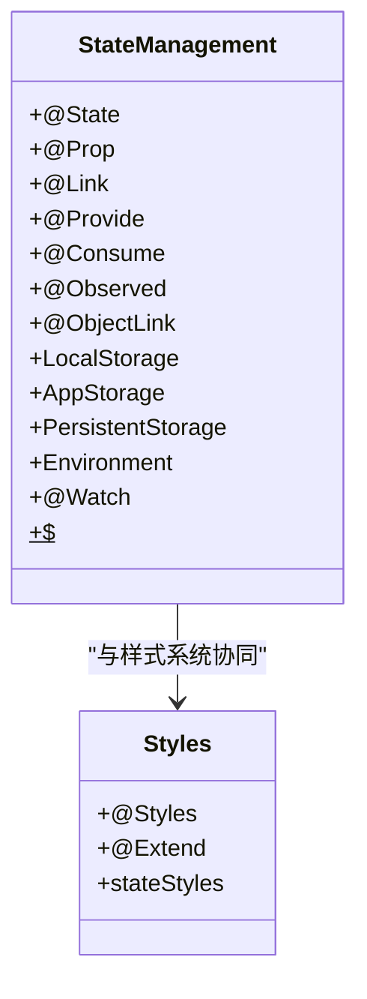
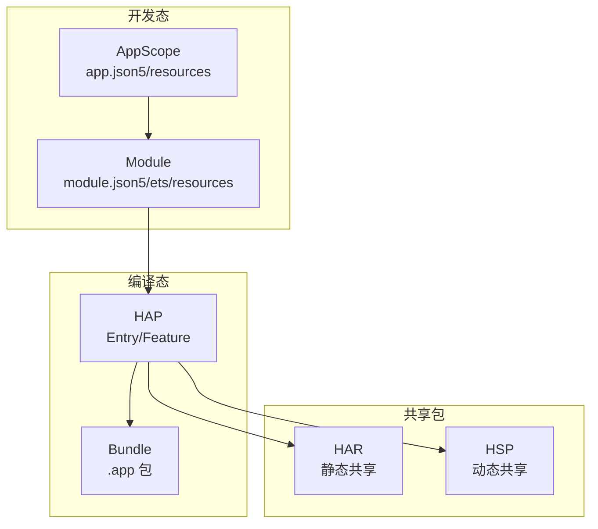
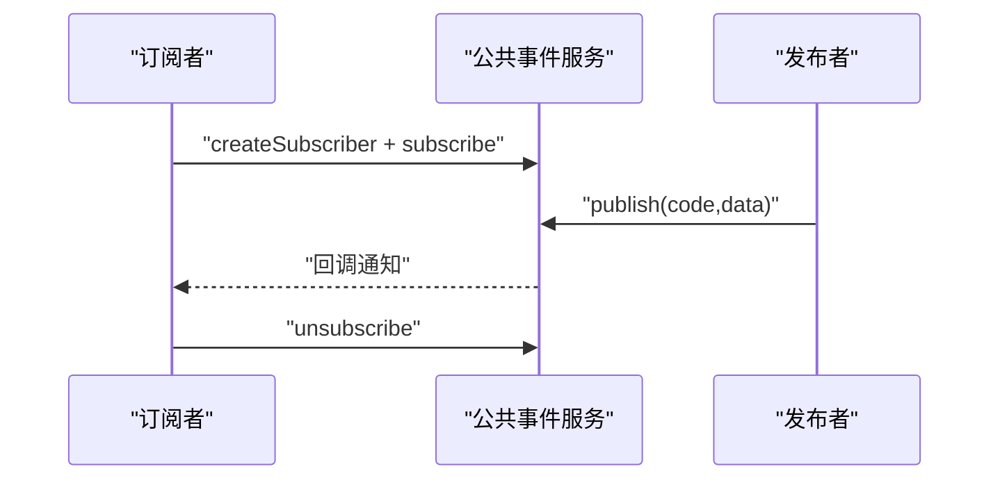
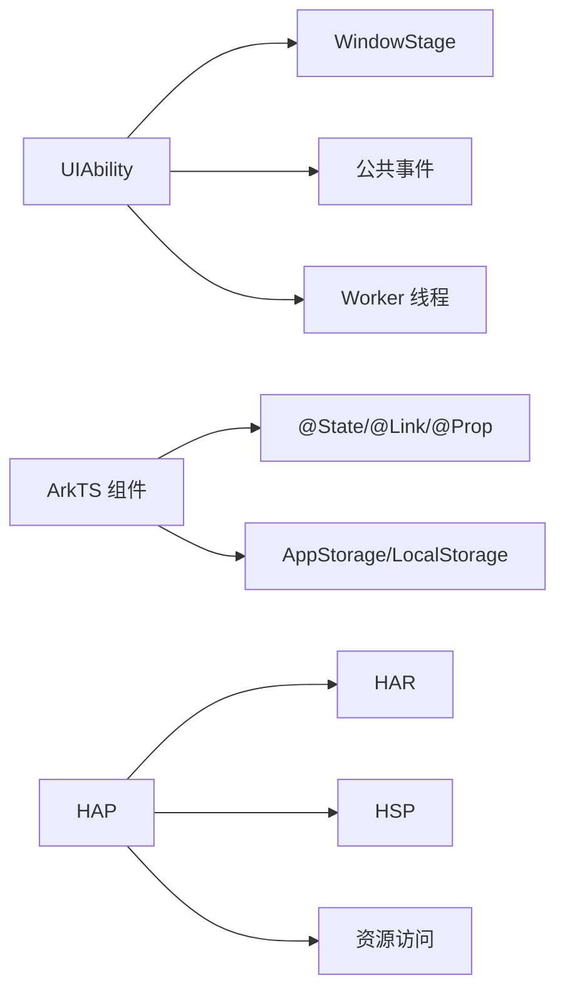

# HarmonyOS 开发

<cite>
**本文档引用的文件**
- [develop.md](file://docs/harmony-os/develop/develop.md)
- [grammar.md](file://docs/harmony-os/grammar/grammar.md)
- [package.md](file://docs/harmony-os/package/package.md)
- [README.md](file://README.md)
</cite>

## 目录
1. [简介](#简介)
2. [项目结构](#项目结构)
3. [核心组件](#核心组件)
4. [架构总览](#架构总览)
5. [详细组件分析](#详细组件分析)
6. [依赖分析](#依赖分析)
7. [性能考量](#性能考量)
8. [故障排查指南](#故障排查指南)
9. [结论](#结论)
10. [附录](#附录)

## 简介
本学习文档面向希望开发跨平台应用的前端开发者，系统梳理 HarmonyOS 应用开发的关键知识：开发环境与工具链、应用开发流程、ArkTS 语法特性与状态管理、包结构与共享包、打包与发布、调试与部署、以及与 Android/Web 的对比与迁移要点。文档以仓库现有资料为基础，辅以可视化图示帮助理解。

## 项目结构
HarmonyOS 开发相关内容集中在 docs/harmony-os 目录下，包含三类主题：
- 开发：应用模型、UIAbility 生命周期、组件交互、公共事件、线程模型等
- 语法：ArkTS 语言特性、组件生命周期、状态管理、样式与样式扩展、环境变量等
- 包基础：Stage 模型包结构、HAP/HAR/HSP、资源访问与共享包发布与引用

图表来源
- [develop.md:1-641](file://docs/harmony-os/develop/develop.md#L1-L641)
- [grammar.md:1-545](file://docs/harmony-os/grammar/grammar.md#L1-L545)
- [package.md:1-376](file://docs/harmony-os/package/package.md#L1-L376)

章节来源
- [develop.md:1-641](file://docs/harmony-os/develop/develop.md#L1-L641)
- [grammar.md:1-545](file://docs/harmony-os/grammar/grammar.md#L1-L545)
- [package.md:1-376](file://docs/harmony-os/package/package.md#L1-L376)

## 核心组件
- Stage 模型与 UIAbility：HarmonyOS 应用的基本运行单元，负责承载 UI 界面与交互，支持多种启动模式与生命周期回调。
- ArkTS 语言与组件：声明式 UI 描述、组件生命周期、状态管理装饰器与样式系统。
- 包结构与共享包：HAP/Feature/HAR/HSP 的组织方式、资源优先级与共享包发布与引用。
- 公共事件与线程模型：跨进程事件通信、Worker 线程与事件发射器。

章节来源
- [develop.md:1-641](file://docs/harmony-os/develop/develop.md#L1-L641)
- [grammar.md:1-545](file://docs/harmony-os/grammar/grammar.md#L1-L545)
- [package.md:1-376](file://docs/harmony-os/package/package.md#L1-L376)

## 架构总览
HarmonyOS 应用以 Stage 模型为核心，UIAbility 作为承载 UI 的基本单元，配合 WindowStage 管理页面加载与事件；ArkTS 提供声明式 UI 与状态管理；包结构支持多模块、多 HAP、共享包；公共事件与 Worker 线程支撑跨进程与异步能力。

图表来源
- [develop.md:1-641](file://docs/harmony-os/develop/develop.md#L1-L641)
- [grammar.md:1-545](file://docs/harmony-os/grammar/grammar.md#L1-L545)
- [package.md:1-376](file://docs/harmony-os/package/package.md#L1-L376)

## 详细组件分析

### Stage 模型与 UIAbility
- 模型概述与 UIAbility 组件：UIAbility 是包含 UI 界面的应用组件，系统调度的基本单元，提供绘制界面的窗口。
- 生命周期：Create → WindowStageCreate → Foreground → Background → WindowStageDestroy → Destroy；各阶段提供回调用于初始化、前台资源申请、后台资源释放、窗口销毁与实例销毁。
- 启动模式：singleton（单实例）、standard（标准实例）、specified（指定实例）。
- 基本用法：在 WindowStageCreate 中通过 loadContent 指定启动页面；通过 getContext 获取上下文；通过 EventHub 或 globalThis 实现 UIAbility 与 UI 的数据同步。
- 组件间交互：启动应用内 UIAbility、启动其他应用 UIAbility（显式/隐式 Want）、启动并获取返回结果、指定启动页面与 onNewWant 处理。

图表来源
- [develop.md:187-341](file://docs/harmony-os/develop/develop.md#L187-L341)

章节来源
- [develop.md:1-641](file://docs/harmony-os/develop/develop.md#L1-L641)

### ArkTS 语言与组件生命周期
- 语法组成：装饰器（@Entry、@Component、@State 等）、UI 描述（build 方法）、自定义组件、系统组件、属性与事件方法。
- 页面生命周期：onPageShow、onPageHide、onBackPress。
- 组件生命周期：aboutToAppear、aboutToDisappear。
- 生命周期流程：初始化成员变量 → aboutToAppear → build 渲染 → onPageShow → 状态变化触发最小化更新 → 分支/数组变化触发组件删除 → 销毁时 onPageHide → aboutToDisappear 逆序执行。

图表来源
- [grammar.md:16-45](file://docs/harmony-os/grammar/grammar.md#L16-L45)

章节来源
- [grammar.md:1-545](file://docs/harmony-os/grammar/grammar.md#L1-L545)

### 状态管理与样式系统
- 组件状态：@State（组件内绑定，不可外部访问）、@Prop（单向同步，父到子）、@Link（双向绑定，父到子，需 $ 语法）、@Provide/@Consume（跨层级传递）、@Observed/@ObjectLink（嵌套对象/数组深层监测）。
- 页面级状态：LocalStorage（页面共享，@LocalStorageProp/@LocalStorageLink）、AppStorage（应用级中心存储，与 UI 同步）、PersistentStorage（持久化 AppStorage 属性）。
- 环境变量：Environment（设备语言等运行状态注入 AppStorage）。
- 样式与扩展：@Styles（通用属性/事件方法封装）、@Extend（扩展原生组件样式，支持状态参数与私有属性）、stateStyles（根据状态设置样式）。
- 监听器：@Watch（监听状态变量变化，回调中可区分变化属性）。
- 内置组件双向绑定：$$（绑定 Popup/单选/刷新等属性）。

图表来源
- [grammar.md:184-545](file://docs/harmony-os/grammar/grammar.md#L184-L545)

章节来源
- [grammar.md:1-545](file://docs/harmony-os/grammar/grammar.md#L1-L545)

### 包结构与共享包
- Stage 模型包结构：Module（Ability/Library）、HAP（Entry/Feature）、Bundle（多个 .hap 合并为 .app）、App Pack（发布包含 pack.info）。
- 多 HAP 构建视图：IDE 开发态（AppScope、entry/feature 目录）、编译打包后（HAP/module.json 合成）。
- 共享包：HAR（静态共享包，不能独立运行）、HSP（动态共享包，运行时进程内仅一份）。
- 资源访问：resources 目录（base/限定词/rawfile）、资源组（element/media/profile）、应用资源与系统资源访问方式。

图表来源
- [package.md:1-376](file://docs/harmony-os/package/package.md#L1-L376)

章节来源
- [package.md:1-376](file://docs/harmony-os/package/package.md#L1-L376)

### 公共事件与线程模型
- 公共事件：动态订阅、取消订阅、发布；系统公共事件与自定义公共事件；无序/有序/粘性事件。
- 线程模型：主线程负责 UI 绘制、事件分发、生命周期回调；Worker 线程处理耗时任务；Emitter 提供线程间事件通信；Worker 线程创建与通信。

图表来源
- [develop.md:725-812](file://docs/harmony-os/develop/develop.md#L725-L812)

章节来源
- [develop.md:707-880](file://docs/harmony-os/develop/develop.md#L707-L880)

## 依赖分析
- 组件耦合：UIAbility 与 WindowStage 强耦合（页面加载与事件），ArkTS 组件与状态管理解耦（通过装饰器与 Link/Provide/Consume 传递）。
- 包依赖：HAP 依赖 HAR/HSP，资源冲突按优先级覆盖；AppStorage/PersistentStorage 与 UI 组件双向同步。
- 外部依赖：公共事件服务、线程模型与 Worker、资源访问 API。

图表来源
- [develop.md:1-641](file://docs/harmony-os/develop/develop.md#L1-L641)
- [grammar.md:1-545](file://docs/harmony-os/grammar/grammar.md#L1-L545)
- [package.md:1-376](file://docs/harmony-os/package/package.md#L1-L376)

章节来源
- [develop.md:1-641](file://docs/harmony-os/develop/develop.md#L1-L641)
- [grammar.md:1-545](file://docs/harmony-os/grammar/grammar.md#L1-L545)
- [package.md:1-376](file://docs/harmony-os/package/package.md#L1-L376)

## 性能考量
- 生命周期与最小化更新：状态变化触发最小化更新，避免全量重绘。
- 资源优先级：限定词目录优先匹配，减少回退到 base 的成本。
- PersistentStorage 写入：同步写入 UI 线程，避免大量数据持久化影响渲染。
- Worker 线程：耗时任务放 Worker，避免阻塞主线程 UI。

[本节为通用性能建议，无需特定文件来源]

## 故障排查指南
- UI 白屏：确认 UIAbility 的 WindowStageCreate 中已通过 loadContent 指定页面。
- 事件未触发：检查 EventHub 订阅/取消订阅逻辑，确保事件名一致。
- 资源冲突：依据资源优先级覆盖规则定位冲突模块，调整资源命名或限定词。
- 公共事件未收到：确认订阅者创建、订阅回调与发布参数正确。
- Worker 通信失败：检查事件 ID、优先级与回调注册。

章节来源
- [develop.md:1-641](file://docs/harmony-os/develop/develop.md#L1-L641)
- [grammar.md:1-545](file://docs/harmony-os/grammar/grammar.md#L1-L545)
- [package.md:1-376](file://docs/harmony-os/package/package.md#L1-L376)

## 结论
HarmonyOS 开发以 Stage 模型为核心，UIAbility 与 ArkTS 语法提供清晰的组件化与声明式 UI 能力；包结构与共享包支持模块化与复用；公共事件与线程模型保障跨进程与异步需求。结合本文档的知识体系，前端开发者可快速掌握 HarmonyOS 应用开发流程与最佳实践。

[本节为总结性内容，无需特定文件来源]

## 附录
- 开发环境与工具链：仓库未包含 HarmonyOS 开发环境搭建与 DevEco Studio 安装细节，建议参考官方文档。
- 跨平台对比与迁移：仓库未包含 HarmonyOS 与 Android/Web 的对比与迁移指南，建议结合各自生态与 API 差异进行迁移策略设计。

[本节为补充说明，无需特定文件来源]