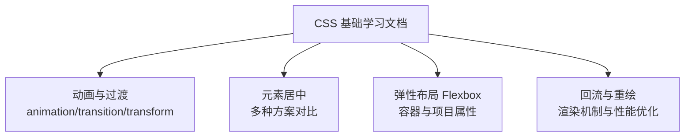
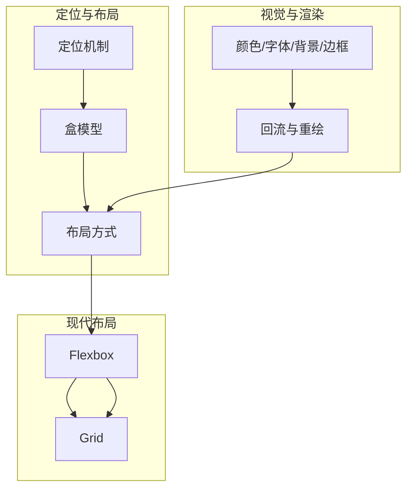
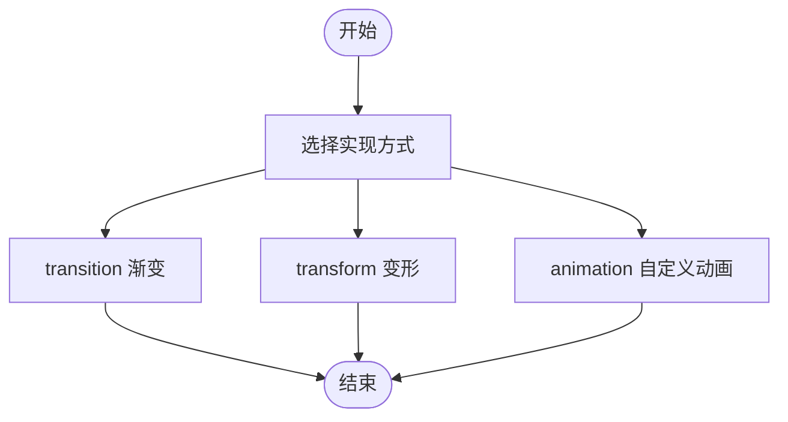
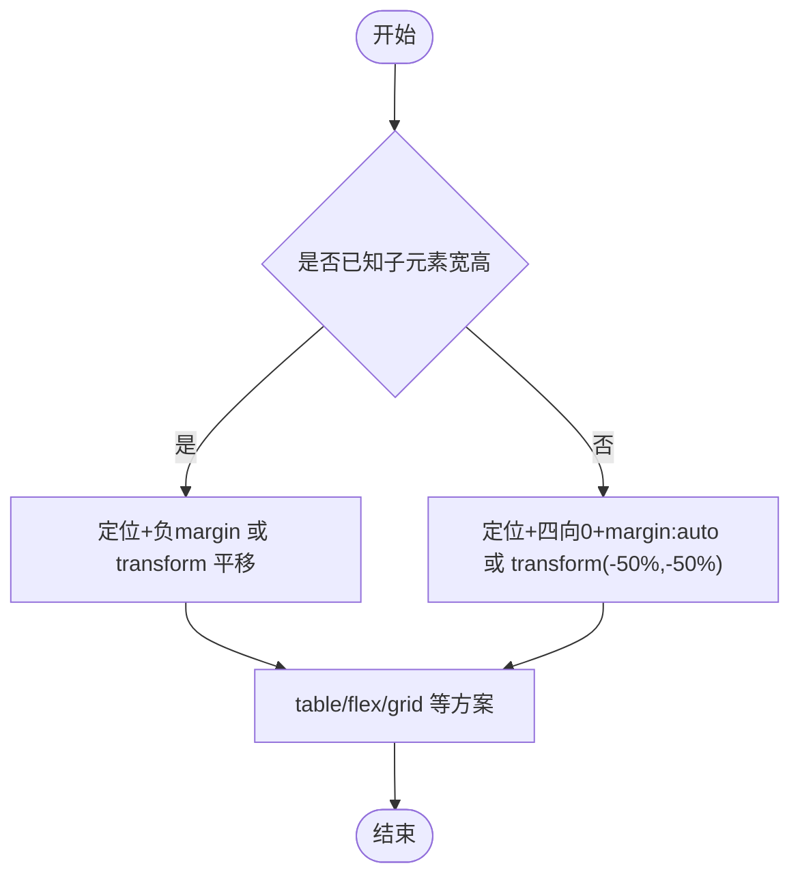
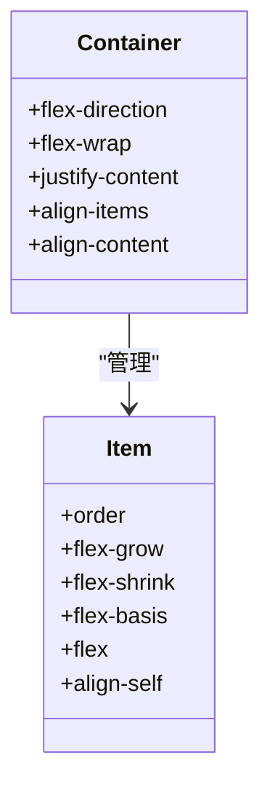
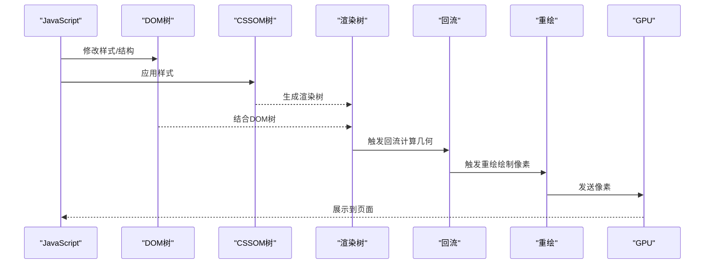
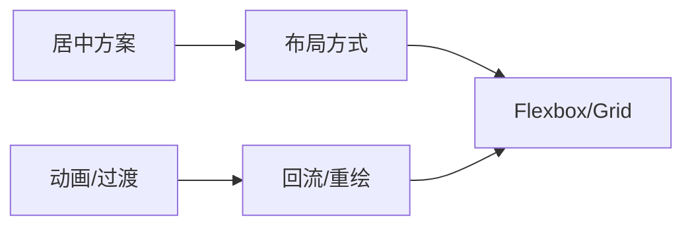

# CSS 基础

<cite>
**本文引用的文件**
- [animation.md](file://docs/interview/css/animation.md)
- [center.md](file://docs/interview/css/center.md)
- [flexbox.md](file://docs/interview/css/flexbox.md)
- [layout_painting.md](file://docs/interview/css/layout_painting.md)
</cite>

## 目录
1. [引言](#引言)
2. [项目结构](#项目结构)
3. [核心组件](#核心组件)
4. [架构总览](#架构总览)
5. [详细组件分析](#详细组件分析)
6. [依赖分析](#依赖分析)
7. [性能考量](#性能考量)
8. [故障排查指南](#故障排查指南)
9. [结论](#结论)
10. [附录](#附录)

## 引言
本学习文档围绕CSS基础语法与现代布局技术，系统梳理选择器思想、盒模型、定位与布局方式，并结合颜色、字体、背景、边框等视觉属性，辅以Flexbox与Grid的实际应用示例，帮助读者建立完整的CSS知识体系。同时，文档强调响应式设计的基本原理与实践路径，使学习者既能掌握基础概念，也能应对真实工程问题。

## 项目结构
本次文档聚焦于仓库中与CSS相关的面试专题文档，涵盖动画、居中、弹性布局与回流重绘等主题。这些内容共同构成CSS基础与进阶能力的支撑材料。

## 核心组件
- 动画与过渡：涵盖transition、transform与animation三种实现路径，解释关键属性与速度曲线，理解从“样式过渡”到“自定义动画”的差异。
- 元素居中：提供定位+margin/auto、定位+负margin、定位+transform、table布局、flex布局、grid布局等多方案，按“已知/未知宽高”分类说明适用场景。
- 弹性布局 Flexbox：系统讲解容器属性（flex-direction、flex-wrap、justify-content、align-items、align-content）与项目属性（order、flex-grow、flex-shrink、flex-basis、flex、align-self），并给出典型应用场景。
- 回流与重绘：阐述渲染流程、触发条件与浏览器优化机制，提供减少回流重绘的实践建议。

**章节来源**
- [animation.md:1-187](file://docs/interview/css/animation.md#L1-L187)
- [center.md:1-259](file://docs/interview/css/center.md#L1-L259)
- [flexbox.md:1-270](file://docs/interview/css/flexbox.md#L1-L270)
- [layout_painting.md:1-178](file://docs/interview/css/layout_painting.md#L1-L178)

## 架构总览
下图展示了CSS基础学习的知识架构：从“视觉属性与渲染机制”出发，逐步深入到“布局与定位”，最终落到“现代布局技术（Flexbox/Grid）”与“性能优化”。

## 详细组件分析

### 动画与过渡（transition/transform/animation）
- transition：用于设置元素的样式过渡，支持属性、持续时间、缓动函数与延迟，适合交互驱动的渐变效果。
- transform：用于元素的位移、缩放、旋转与倾斜，常与transition配合实现流畅的视觉变换。
- animation：通过@keyframes定义关键帧，结合animation属性控制时长、缓动、次数、方向、填充模式与播放状态，适合复杂自定义动画。

**图表来源**
- [animation.md:11-181](file://docs/interview/css/animation.md#L11-L181)

**章节来源**
- [animation.md:11-181](file://docs/interview/css/animation.md#L11-L181)

### 元素居中（水平垂直）
- 已知宽高：定位+负margin、transform平移、margin:0 auto（水平）。
- 未知宽高：定位+四向0+margin:auto、定位+transform(-50%,-50%)。
- 其他方案：table-cell + text-align/vertical-align、flex布局、grid布局。

**图表来源**
- [center.md:14-254](file://docs/interview/css/center.md#L14-L254)

**章节来源**
- [center.md:14-254](file://docs/interview/css/center.md#L14-L254)

### 弹性布局 Flexbox
- 容器属性：flex-direction（主轴方向）、flex-wrap（换行）、justify-content（主轴对齐）、align-items/align-content（交叉轴对齐与多轴线对齐）。
- 项目属性：order（排序）、flex-grow/shrink/basis（伸缩与初始尺寸）、flex（简写）、align-self（覆盖容器对齐）。
- 典型场景：两端对齐、等间距、垂直居中、响应式两栏/三栏布局。

**图表来源**
- [flexbox.md:21-258](file://docs/interview/css/flexbox.md#L21-L258)

**章节来源**
- [flexbox.md:21-258](file://docs/interview/css/flexbox.md#L21-L258)

### 回流与重绘（渲染机制与性能）
- 回流：布局阶段，计算元素几何信息（位置、大小），常见触发：DOM增删、尺寸变化、位置变化、内容变化、窗口变化、读取布局属性。
- 重绘：绘制阶段，基于渲染树与几何信息绘制像素，常见触发：颜色、阴影、文本方向等样式变化。
- 优化策略：分离读写、批量修改、使用类名合并样式、脱离文档流、CSS3硬件加速（transform/opactiy/filters）、避免table/iframe慢元素、离线操作（display:none）。

**图表来源**
- [layout_painting.md:13-71](file://docs/interview/css/layout_painting.md#L13-L71)

**章节来源**
- [layout_painting.md:13-71](file://docs/interview/css/layout_painting.md#L13-L71)

## 依赖分析
- 动画与过渡依赖于浏览器渲染管线中的“回流/重绘”阶段，不当使用可能导致频繁重排重绘。
- 居中方案与布局方式相互补充：未知宽高的场景更适合flex/grid；已知宽高的场景可选定位+负margin或transform。
- Flexbox与Grid作为现代布局方案，与传统定位/盒模型形成互补，提升响应式与自适应能力。

## 性能考量
- 合理选择动画实现：优先使用transform与opacity等可触发合成层的属性，减少回流重绘。
- 批量更新样式：通过类名合并样式，避免逐条修改导致的多次重排。
- 避免强制同步布局：尽量避免在循环中反复读取offset/scroll/client系列属性。
- 使用离线操作：对复杂DOM变更先隐藏元素，完成后再恢复显示。

**章节来源**
- [layout_painting.md:72-172](file://docs/interview/css/layout_painting.md#L72-L172)

## 故障排查指南
- 症状：页面闪烁/卡顿
  - 排查：是否存在频繁读取布局属性、是否使用大量table/iframe、是否对同一元素多次逐条修改样式。
  - 处置：合并样式、使用类名、避免强制布局、使用transform/opactiy/filters。
- 症状：元素无法正确居中
  - 排查：是否已知宽高、是否正确设置父容器的display/text-align/vertical-align或flex/grid属性。
  - 处置：未知宽高优先使用flex/grid或定位+transform；已知宽高可用负margin或margin:0 auto。
- 症状：动画卡顿
  - 排查：是否使用了会引起回流的属性（如width/height/left/top等）。
  - 处置：改用transform与opacity，必要时开启硬件加速。

**章节来源**
- [center.md:14-254](file://docs/interview/css/center.md#L14-L254)
- [layout_painting.md:72-172](file://docs/interview/css/layout_painting.md#L72-L172)

## 结论
CSS基础语法与现代布局技术相辅相成：视觉属性与渲染机制决定了表现力与性能，定位与布局方式决定了结构与可维护性，Flexbox与Grid则提供了强大的自适应能力。通过系统掌握这些知识并结合性能优化策略，可以构建既美观又高效的用户界面。

## 附录
- 响应式设计要点
  - 移动优先：先设计移动端，再向上适配。
  - 弹性单位：优先使用相对单位（%、em、rem、vw/vh、fr）。
  - 媒体查询：按断点组织布局与排版。
  - 弹性布局：在复杂布局中优先考虑Flexbox/Grid。
  - 图片与媒体：为不同设备提供合适尺寸与格式，避免加载过大资源。
- 最佳实践清单
  - 使用语义化HTML与合理CSS命名规范。
  - 将动画与交互限定在必要区域，避免全局重绘。
  - 对复杂列表与表格优先考虑Flexbox/Grid替代table。
  - 在高频交互场景中，优先使用transform与opacity。