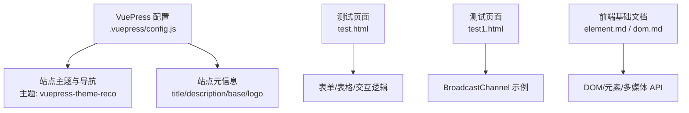
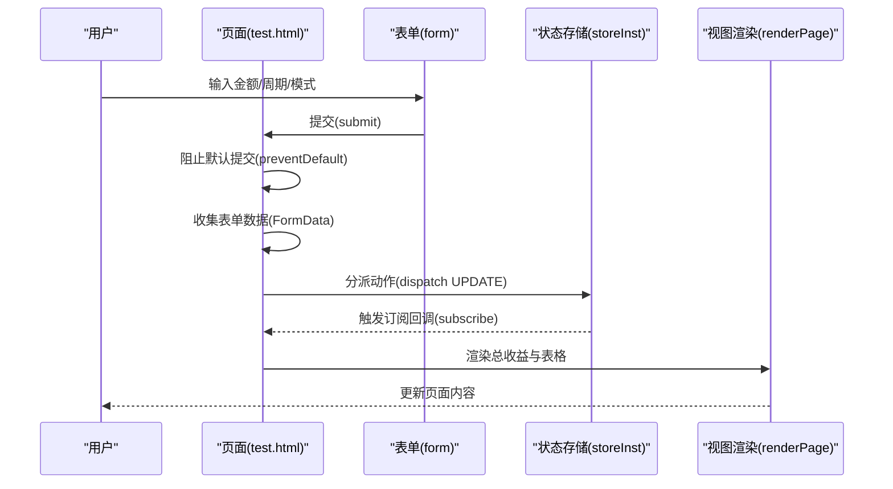
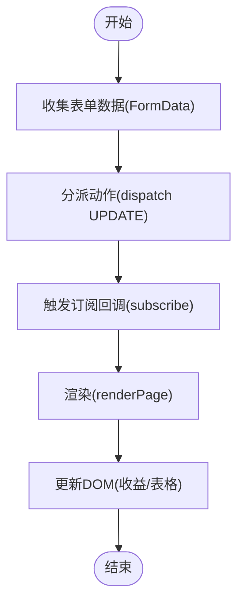
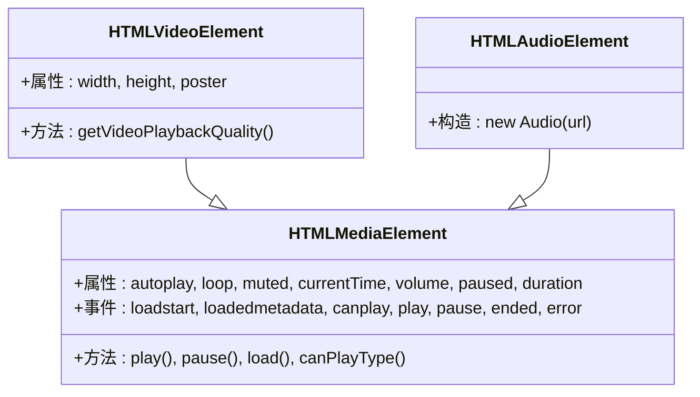
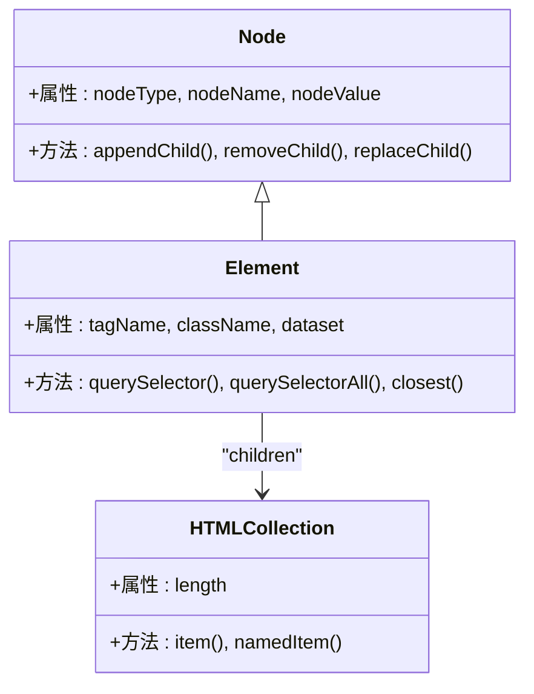
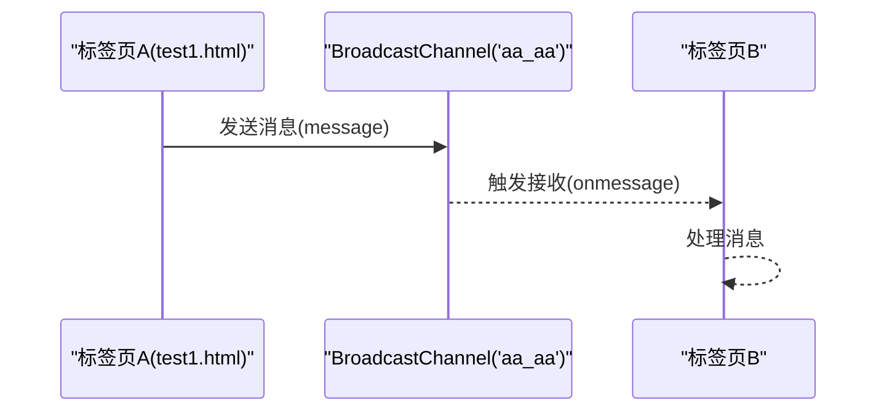
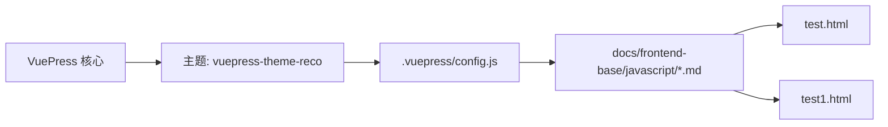

# HTML 基础

<cite>
**本文引用的文件**
- [test.html](file://test.html)
- [test1.html](file://test1.html)
- [element.md](file://docs/frontend-base/javascript/element.md)
- [dom.md](file://docs/frontend-base/javascript/dom.md)
- [config.js](file://.vuepress/config.js)
- [README.md](file://README.md)
</cite>

## 目录
1. [引言](#引言)
2. [项目结构](#项目结构)
3. [核心组件](#核心组件)
4. [架构概览](#架构概览)
5. [详细组件分析](#详细组件分析)
6. [依赖分析](#依赖分析)
7. [性能考量](#性能考量)
8. [故障排查指南](#故障排查指南)
9. [结论](#结论)
10. [附录](#附录)

## 引言
本入门文档围绕 HTML 基础语法展开，系统讲解语义化标签、文档结构、表单与多媒体元素等核心内容，并结合仓库中的测试页面与前端基础文档，帮助初学者建立对 HTML 结构化特性的理解，掌握现代 Web 开发中的最佳实践与可访问性设计原则。

## 项目结构
该项目基于 VuePress 构建，文档内容分布在 docs 目录中，前端基础部分包含大量与 DOM、元素与多媒体相关的技术细节，便于在 HTML 学习中进行交叉参考。测试页面 test.html 与 test1.html 提供了实际的 HTML 示例与交互演示，有助于理解表单、表格与多媒体元素的使用场景。

**图表来源**
- [.vuepress/config.js:1-18](file://.vuepress/config.js#L1-L18)
- [test.html:1-353](file://test.html#L1-L353)
- [test1.html:1-21](file://test1.html#L1-L21)
- [element.md:1-601](file://docs/frontend-base/javascript/element.md#L1-L601)
- [dom.md:1-2784](file://docs/frontend-base/javascript/dom.md#L1-L2784)

**章节来源**
- [.vuepress/config.js:1-18](file://.vuepress/config.js#L1-L18)
- [README.md:1-12](file://README.md#L1-L12)

## 核心组件
- 文档结构与语义化标签
  - HTML5 语义化标签（如 header、nav、main、section、article、aside、footer）用于清晰表达页面结构，提升可读性与可访问性。
  - meta 标签（charset、viewport、X-UA-Compatible）确保字符集、移动端适配与兼容性策略。
- 表单与交互
  - 表单控件（input、select、button、label）与事件处理（submit、change）构成用户输入与反馈的核心。
  - DOM API（createElement、appendChild、dispatchEvent）支撑动态内容更新与交互。
- 多媒体元素
  - video/audio 与 source 组合，提供跨浏览器的媒体播放能力；controls 控制条与属性（autoplay、loop、muted）增强用户体验。
- 测试页面示例
  - test.html：包含表单、表格与交互逻辑，演示状态管理与 DOM 更新。
  - test1.html：演示 BroadcastChannel 的跨标签页通信。

**章节来源**
- [test.html:1-353](file://test.html#L1-L353)
- [test1.html:1-21](file://test1.html#L1-L21)
- [element.md:482-600](file://docs/frontend-base/javascript/element.md#L482-L600)
- [dom.md:1080-1714](file://docs/frontend-base/javascript/dom.md#L1080-L1714)

## 架构概览
HTML 页面的典型生命周期：解析 HTML → 构建 DOM → 应用样式 → 渲染与交互 → 事件驱动的动态更新。测试页面通过表单提交与 DOM 操作实现“计算收益”与“渲染表格”的闭环。

**图表来源**
- [test.html:322-350](file://test.html#L322-L350)
- [test.html:216-320](file://test.html#L216-L320)

## 详细组件分析

### 组件一：HTML 文档结构与语义化标签
- 结构要点
  - DOCTYPE 声明与 html 根元素，head 中 meta 与 title，body 中业务内容。
  - 语义化标签组织页面内容，利于 SEO 与可访问性。
- 最佳实践
  - 使用 header/nav/main/section/article/aside/footer 明确层级。
  - 为关键元素提供合适的语义角色，避免滥用 div。
  - 为图片提供 alt 文本，为链接提供描述性文本。

**章节来源**
- [test.html:1-110](file://test.html#L1-L110)

### 组件二：表单与交互（含状态管理）
- 表单元素
  - input（number/text）、select、button、label 与 form。
  - 通过 FormData 收集数据，结合事件监听实现交互。
- 状态管理与渲染
  - 使用自定义状态管理（reducer + subscribe）维护数据与视图联动。
  - renderPage 动态更新页面内容（收益与表格）。
- 代码路径参考
  - [表单提交与数据收集:322-334](file://test.html#L322-L334)
  - [状态更新与订阅:216-219](file://test.html#L216-L219)
  - [渲染逻辑:292-320](file://test.html#L292-L320)

**图表来源**
- [test.html:216-320](file://test.html#L216-L320)
- [test.html:322-334](file://test.html#L322-L334)

**章节来源**
- [test.html:153-350](file://test.html#L153-L350)

### 组件三：多媒体元素与 API
- video/audio 与 source
  - 使用 source 提供多种格式，提升兼容性；controls 展示控制条。
- HTMLMediaElement 接口
  - 属性：autoplay、loop、muted、currentTime、volume、paused、duration 等。
  - 方法：play()、pause()、load()、canPlayType() 等。
- 事件
  - loadstart、loadedmetadata、canplay、play、pause、ended、error 等。
- 代码路径参考
  - [video/audio 概述与属性:482-599](file://docs/frontend-base/javascript/element.md#L482-L599)

**图表来源**
- [element.md:482-599](file://docs/frontend-base/javascript/element.md#L482-L599)

**章节来源**
- [element.md:482-599](file://docs/frontend-base/javascript/element.md#L482-L599)

### 组件四：DOM 操作与节点模型
- 节点类型与关系
  - Node/Element/HTMLElement 接口，父子兄弟关系（parentNode、firstChild、nextSibling）。
- 节点集合
  - NodeList/HTMLCollection，动态与静态集合的区别。
- DOM 操作
  - createElement、appendChild、removeChild、replaceChild、insertAdjacentElement/HTML/Text。
- 代码路径参考
  - [Node/Element/DOM 概述与方法:1-2784](file://docs/frontend-base/javascript/dom.md#L1-L2784)

**图表来源**
- [dom.md:1-2784](file://docs/frontend-base/javascript/dom.md#L1-L2784)

**章节来源**
- [dom.md:1-2784](file://docs/frontend-base/javascript/dom.md#L1-L2784)

### 组件五：跨标签页通信（BroadcastChannel）
- BroadcastChannel API
  - 在同源标签页间传递消息，支持 onmessage 与 onmessageerror。
- 代码路径参考
  - [BroadcastChannel 示例:10-18](file://test1.html#L10-L18)

**图表来源**
- [test1.html:10-18](file://test1.html#L10-L18)

**章节来源**
- [test1.html:1-21](file://test1.html#L1-L21)

## 依赖分析
- VuePress 主题与配置
  - 使用 vuepress-theme-reco，配置站点标题、描述、图标与基础路径，为文档提供统一外观与导航。
- 文档与示例的耦合
  - element.md 与 dom.md 提供 DOM/元素/API 的权威说明，test.html/test1.html 作为实践示例，形成“理论—实践”的闭环。
- 外部依赖
  - 项目未直接引入第三方 HTML/CSS/JS 库，主要依赖浏览器原生 API 与 VuePress 运行时。

**图表来源**
- [.vuepress/config.js:1-18](file://.vuepress/config.js#L1-L18)
- [element.md:1-601](file://docs/frontend-base/javascript/element.md#L1-L601)
- [dom.md:1-2784](file://docs/frontend-base/javascript/dom.md#L1-L2784)
- [test.html:1-353](file://test.html#L1-L353)
- [test1.html:1-21](file://test1.html#L1-L21)

**章节来源**
- [.vuepress/config.js:1-18](file://.vuepress/config.js#L1-L18)

## 性能考量
- 减少重排与重绘
  - 使用 DocumentFragment 或批量更新 DOM，降低布局抖动。
- 媒体资源优化
  - 为 video/audio 提供多种格式与合适尺寸，避免过大资源影响加载。
- 事件处理
  - 合理使用事件委托，减少监听器数量；在高频交互中避免不必要的 DOM 查询。

## 故障排查指南
- 表单提交问题
  - 确认阻止默认提交（preventDefault），检查 FormData 数据类型转换（如 number）。
  - 参考：[表单提交与数据收集:322-334](file://test.html#L322-L334)
- 视图未更新
  - 确认状态分派与订阅流程是否触发，renderPage 是否正确更新 DOM。
  - 参考：[状态更新与订阅:216-219](file://test.html#L216-L219)、[渲染逻辑:292-320](file://test.html#L292-L320)
- 多媒体播放异常
  - 检查媒体格式与 controls 属性，确认 canPlayType 与事件链路。
  - 参考：[video/audio 概述与属性:482-599](file://docs/frontend-base/javascript/element.md#L482-L599)
- 跨标签页通信失败
  - 确认同源策略与频道名称一致，检查 onmessage 与 onmessageerror。
  - 参考：[BroadcastChannel 示例:10-18](file://test1.html#L10-L18)

**章节来源**
- [test.html:216-350](file://test.html#L216-L350)
- [element.md:482-599](file://docs/frontend-base/javascript/element.md#L482-L599)
- [test1.html:10-18](file://test1.html#L10-L18)

## 结论
通过语义化标签、规范的文档结构与完善的表单/多媒体实现，HTML 不仅承担页面骨架，更是可访问性与 SEO 的基石。结合 DOM API 与现代前端模式（如状态管理），可构建高性能、易维护的交互体验。仓库中的测试页面与前端基础文档为学习者提供了从理论到实践的完整路径。

## 附录
- 实际应用场景
  - 金融计算器：表单输入 + 计算逻辑 + 动态表格展示。
  - 媒体播放器：多格式媒体 + 控制条 + 事件驱动播放控制。
  - 跨标签页协作：同源标签页间消息传递与状态同步。
- 参考路径
  - [test.html:1-353](file://test.html#L1-L353)
  - [test1.html:1-21](file://test1.html#L1-L21)
  - [element.md:1-601](file://docs/frontend-base/javascript/element.md#L1-L601)
  - [dom.md:1-2784](file://docs/frontend-base/javascript/dom.md#L1-L2784)