# JavaScript 基础

<cite>
**本文引用的文件**
- [docs/frontend-base/javascript/array.md](file://docs/frontend-base/javascript/array.md)
- [docs/frontend-base/javascript/object.md](file://docs/frontend-base/javascript/object.md)
- [docs/frontend-base/javascript/string.md](file://docs/frontend-base/javascript/string.md)
- [docs/frontend-base/javascript/dom.md](file://docs/frontend-base/javascript/dom.md)
- [docs/frontend-base/javascript/event.md](file://docs/frontend-base/javascript/event.md)
- [docs/frontend-base/javascript/bom.md](file://docs/frontend-base/javascript/bom.md)
- [docs/frontend-base/javascript/ajax.md](file://docs/frontend-base/javascript/ajax.md)
- [docs/interview/JavaScript/data_type.md](file://docs/interview/JavaScript/data_type.md)
- [docs/interview/JavaScript/scope.md](file://docs/interview/JavaScript/scope.md)
- [docs/interview/JavaScript/functional_programming.md](file://docs/interview/JavaScript/functional_programming.md)
</cite>

## 目录
1. [引言](#引言)
2. [项目结构](#项目结构)
3. [核心组件](#核心组件)
4. [架构总览](#架构总览)
5. [详细组件分析](#详细组件分析)
6. [依赖分析](#依赖分析)
7. [性能考量](#性能考量)
8. [故障排查指南](#故障排查指南)
9. [结论](#结论)
10. [附录](#附录)

## 引言
本学习文档围绕 JavaScript 基础语法与浏览器 API，系统梳理变量与作用域、数据类型与存储、运算符与控制结构、函数与面向对象、数组与对象操作、字符串处理、DOM 与事件、BOM 与异步编程（XHR/Beacon）等主题。文档以仓库现有 Markdown 内容为依据，辅以可视化图示帮助理解，适合初学者与进阶读者循序渐进掌握。

## 项目结构
本仓库前端基础部分以“前端基础/JavaScript”为主题，涵盖数组、对象、字符串、DOM、事件、BOM、AJAX 等专题；面试题部分补充了数据类型与存储差异、作用域链、函数式编程等概念性知识。这些内容共同构成 JavaScript 基础学习的知识地图。

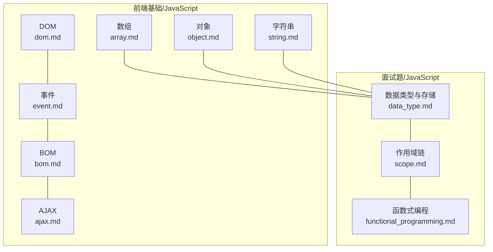

**图表来源**
- [docs/frontend-base/javascript/array.md](file://docs/frontend-base/javascript/array.md)
- [docs/frontend-base/javascript/object.md](file://docs/frontend-base/javascript/object.md)
- [docs/frontend-base/javascript/string.md](file://docs/frontend-base/javascript/string.md)
- [docs/frontend-base/javascript/dom.md](file://docs/frontend-base/javascript/dom.md)
- [docs/frontend-base/javascript/event.md](file://docs/frontend-base/javascript/event.md)
- [docs/frontend-base/javascript/bom.md](file://docs/frontend-base/javascript/bom.md)
- [docs/frontend-base/javascript/ajax.md](file://docs/frontend-base/javascript/ajax.md)
- [docs/interview/JavaScript/data_type.md](file://docs/interview/JavaScript/data_type.md)
- [docs/interview/JavaScript/scope.md](file://docs/interview/JavaScript/scope.md)
- [docs/interview/JavaScript/functional_programming.md](file://docs/interview/JavaScript/functional_programming.md)

**章节来源**
- [docs/frontend-base/javascript/array.md](file://docs/frontend-base/javascript/array.md)
- [docs/frontend-base/javascript/object.md](file://docs/frontend-base/javascript/object.md)
- [docs/frontend-base/javascript/string.md](file://docs/frontend-base/javascript/string.md)
- [docs/frontend-base/javascript/dom.md](file://docs/frontend-base/javascript/dom.md)
- [docs/frontend-base/javascript/event.md](file://docs/frontend-base/javascript/event.md)
- [docs/frontend-base/javascript/bom.md](file://docs/frontend-base/javascript/bom.md)
- [docs/frontend-base/javascript/ajax.md](file://docs/frontend-base/javascript/ajax.md)
- [docs/interview/JavaScript/data_type.md](file://docs/interview/JavaScript/data_type.md)
- [docs/interview/JavaScript/scope.md](file://docs/interview/JavaScript/scope.md)
- [docs/interview/JavaScript/functional_programming.md](file://docs/interview/JavaScript/functional_programming.md)

## 核心组件
- 变量与作用域：全局、函数、块级作用域；词法作用域与作用域链。
- 数据类型与存储：基本类型（Number、String、Boolean、Undefined、Null、Symbol）与引用类型（Object/Array/Function）；栈与堆存储差异。
- 控制结构：条件、循环、异常处理。
- 函数与面向对象：函数声明/表达式/箭头函数；原型链与属性描述符；封装、继承与多态思想。
- 数组与对象：常用 API（遍历、筛选、映射、归约、拼接、排序等）与浅拷贝/深拷贝策略。
- 字符串：字符集、转义、编码、大小写转换、检索与替换。
- DOM/BOM：节点树、属性与关系、文档状态、窗口与历史、位置尺寸与滚动。
- 事件：事件流（捕获/目标/冒泡）、监听与传播控制、鼠标/键盘/触摸/拖拽事件。
- 异步编程：XMLHttpRequest 生命周期与事件、超时与凭据、上传进度；Navigator.sendBeacon 优雅退出上报。

**章节来源**
- [docs/interview/JavaScript/scope.md](file://docs/interview/JavaScript/scope.md)
- [docs/interview/JavaScript/data_type.md](file://docs/interview/JavaScript/data_type.md)
- [docs/interview/JavaScript/functional_programming.md](file://docs/interview/JavaScript/functional_programming.md)
- [docs/frontend-base/javascript/array.md](file://docs/frontend-base/javascript/array.md)
- [docs/frontend-base/javascript/object.md](file://docs/frontend-base/javascript/object.md)
- [docs/frontend-base/javascript/string.md](file://docs/frontend-base/javascript/string.md)
- [docs/frontend-base/javascript/dom.md](file://docs/frontend-base/javascript/dom.md)
- [docs/frontend-base/javascript/event.md](file://docs/frontend-base/javascript/event.md)
- [docs/frontend-base/javascript/bom.md](file://docs/frontend-base/javascript/bom.md)
- [docs/frontend-base/javascript/ajax.md](file://docs/frontend-base/javascript/ajax.md)

## 架构总览
下图展示从“语法基础”到“浏览器 API”的知识流转：语法基础（变量/类型/函数）为“数据与控制”，DOM/BOM/事件/异步为“运行时交互”，数组/对象/字符串为“数据处理工具”。

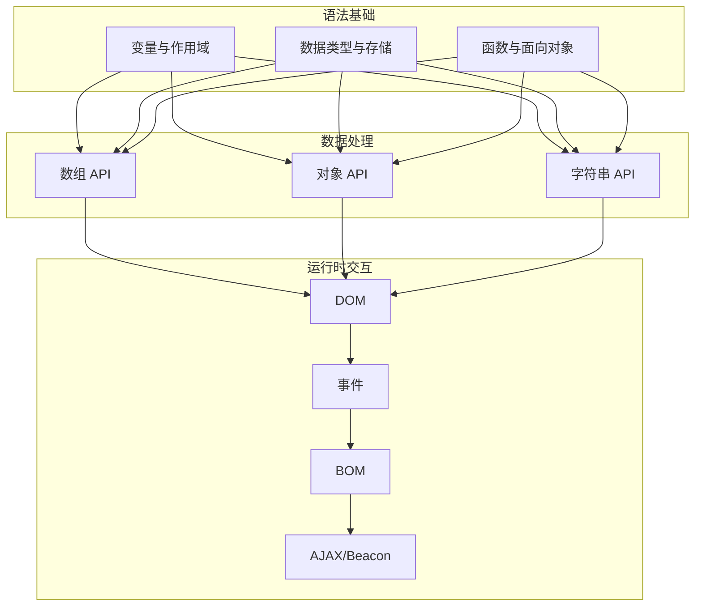

**图表来源**
- [docs/interview/JavaScript/scope.md](file://docs/interview/JavaScript/scope.md)
- [docs/interview/JavaScript/data_type.md](file://docs/interview/JavaScript/data_type.md)
- [docs/interview/JavaScript/functional_programming.md](file://docs/interview/JavaScript/functional_programming.md)
- [docs/frontend-base/javascript/array.md](file://docs/frontend-base/javascript/array.md)
- [docs/frontend-base/javascript/object.md](file://docs/frontend-base/javascript/object.md)
- [docs/frontend-base/javascript/string.md](file://docs/frontend-base/javascript/string.md)
- [docs/frontend-base/javascript/dom.md](file://docs/frontend-base/javascript/dom.md)
- [docs/frontend-base/javascript/event.md](file://docs/frontend-base/javascript/event.md)
- [docs/frontend-base/javascript/bom.md](file://docs/frontend-base/javascript/bom.md)
- [docs/frontend-base/javascript/ajax.md](file://docs/frontend-base/javascript/ajax.md)

## 详细组件分析

### 变量与作用域
- 作用域类型：全局、函数、块级（let/const）。
- 词法作用域：变量在定义时确定作用域，而非执行时。
- 作用域链：变量解析沿当前作用域向上查找，直至全局。
- 示例参考：[作用域与作用域链](file://docs/interview/JavaScript/scope.md)

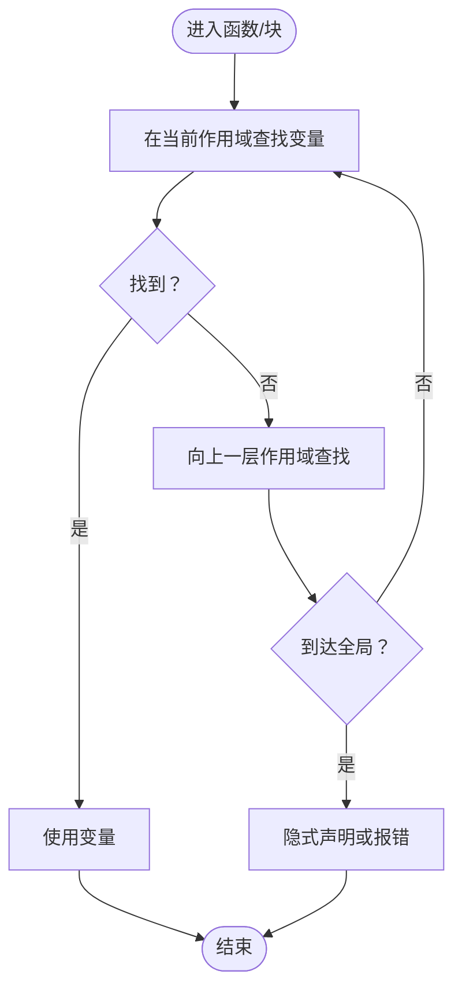

**图表来源**
- [docs/interview/JavaScript/scope.md](file://docs/interview/JavaScript/scope.md)

**章节来源**
- [docs/interview/JavaScript/scope.md](file://docs/interview/JavaScript/scope.md)

### 数据类型与存储
- 基本类型：Number、String、Boolean、Undefined、Null、Symbol（ES6）。
- 引用类型：Object/Array/Function 及 Date/RegExp/Map/Set 等。
- 存储差异：基本类型存于栈；引用类型对象存于堆，栈中保存指向堆的引用。
- 示例参考：[数据类型与存储](file://docs/interview/JavaScript/data_type.md)

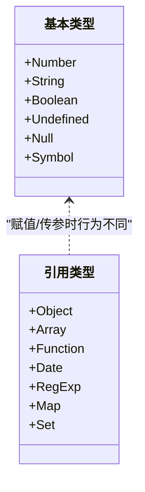

**图表来源**
- [docs/interview/JavaScript/data_type.md](file://docs/interview/JavaScript/data_type.md)

**章节来源**
- [docs/interview/JavaScript/data_type.md](file://docs/interview/JavaScript/data_type.md)

### 函数与面向对象
- 函数声明/表达式/箭头函数；this 绑定与参数绑定。
- 面向对象：原型链、属性描述符（value/writable/enumerable/configurable/get/set）、冻结/密封/不可扩展。
- 示例参考：[函数式编程](file://docs/interview/JavaScript/functional_programming.md)、[对象 API](file://docs/frontend-base/javascript/object.md)

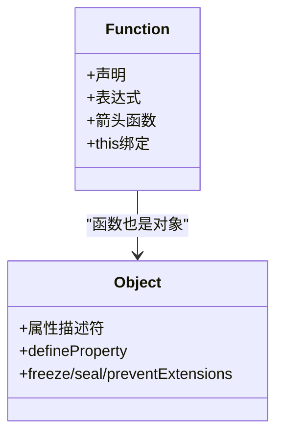

**图表来源**
- [docs/interview/JavaScript/functional_programming.md](file://docs/interview/JavaScript/functional_programming.md)
- [docs/frontend-base/javascript/object.md](file://docs/frontend-base/javascript/object.md)

**章节来源**
- [docs/interview/JavaScript/functional_programming.md](file://docs/interview/JavaScript/functional_programming.md)
- [docs/frontend-base/javascript/object.md](file://docs/frontend-base/javascript/object.md)

### 数组 API 与实践
- 常用方法：队栈/入队、查（indexOf/lastIndexOf）、转（join/reverse/sort）、截取/替换（slice/splice）、遍历（forEach/map/filter/some/every）、归并（reduce/reduceRight）。
- 链式使用与注意事项（空位、this 绑定、排序自定义比较函数）。
- 示例参考：[数组 API](file://docs/frontend-base/javascript/array.md)

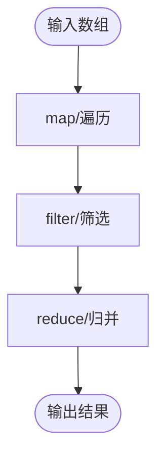

**图表来源**
- [docs/frontend-base/javascript/array.md](file://docs/frontend-base/javascript/array.md)

**章节来源**
- [docs/frontend-base/javascript/array.md](file://docs/frontend-base/javascript/array.md)

### 对象 API 与属性控制
- 静态方法：Object.keys/getOwnPropertyNames/assign 等。
- 属性描述符：value/writable/enumerable/configurable 与 getter/setter。
- 对象冻结/密封/不可扩展：preventExtensions/isExtensible、seal/isSealed、freeze/isFrozen。
- 示例参考：[对象 API](file://docs/frontend-base/javascript/object.md)

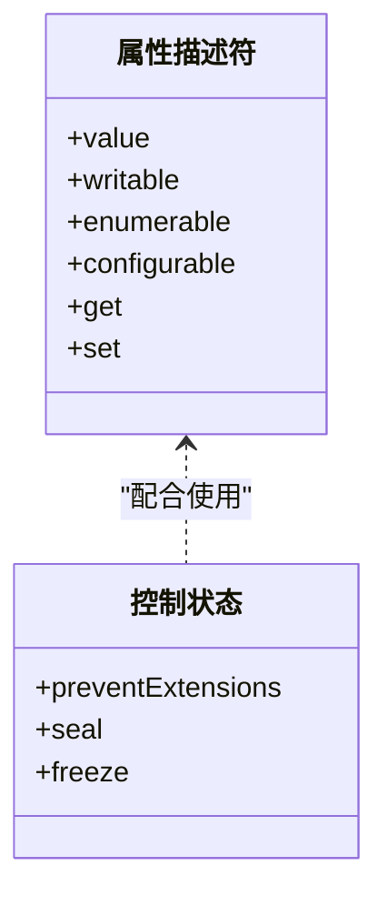

**图表来源**
- [docs/frontend-base/javascript/object.md](file://docs/frontend-base/javascript/object.md)

**章节来源**
- [docs/frontend-base/javascript/object.md](file://docs/frontend-base/javascript/object.md)

### 字符串 API 与编码
- 字符串与数组相似性：方括号取字符、length、不可变。
- 常用方法：查找/检索（indexOf/lastIndexOf/match/search）、大小写转换、截取（slice/substring/substr）、拼接/拆分（concat/split）、修剪（trim）、本地化比较（localeCompare）。
- 编码与转义：Unicode、Base64、转义序列。
- 示例参考：[字符串 API](file://docs/frontend-base/javascript/string.md)

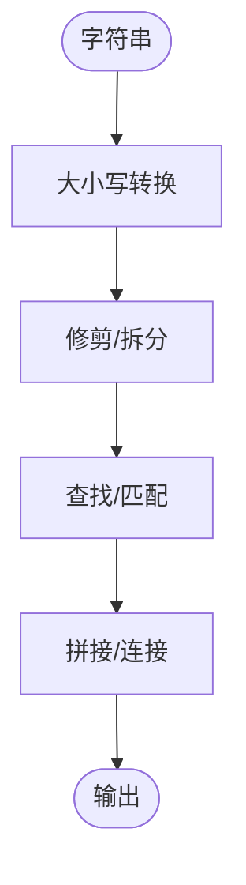

**图表来源**
- [docs/frontend-base/javascript/string.md](file://docs/frontend-base/javascript/string.md)

**章节来源**
- [docs/frontend-base/javascript/string.md](file://docs/frontend-base/javascript/string.md)

### DOM 操作与节点关系
- 节点类型与属性：nodeType/nodeName/nodeValue/textContent/baseURI。
- 节点关系：父子兄弟、firstChild/lastChild/childNodes、contains/compareDocumentPosition。
- 节点操作：appendChild/insertBefore/removeChild/replaceChild/cloneNode/normalize。
- NodeList/HTMLCollection：动态/静态集合、遍历与转换。
- 示例参考：[DOM](file://docs/frontend-base/javascript/dom.md)

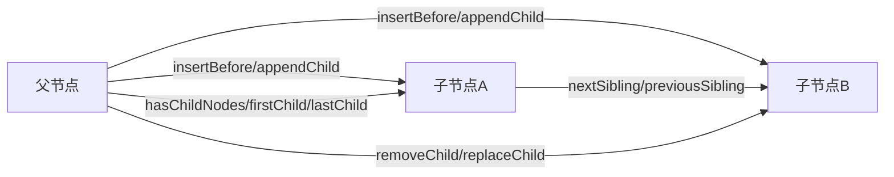

**图表来源**
- [docs/frontend-base/javascript/dom.md](file://docs/frontend-base/javascript/dom.md)

**章节来源**
- [docs/frontend-base/javascript/dom.md](file://docs/frontend-base/javascript/dom.md)

### 事件模型与传播
- 事件流：捕获 → 目标 → 冒泡；EventTarget 接口与 addEventListener/removeEventListener/dispatchEvent。
- 鼠标/键盘/触摸/拖拽事件；事件对象属性（坐标、按键、触摸点、拖拽数据）。
- 示例参考：[事件](file://docs/frontend-base/javascript/event.md)

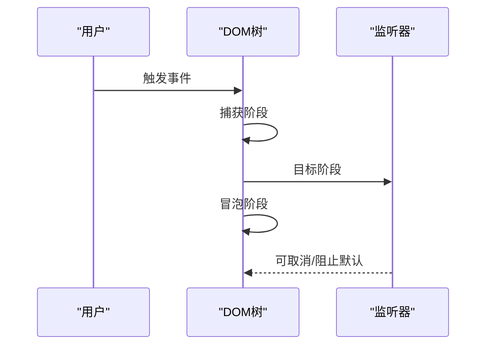

**图表来源**
- [docs/frontend-base/javascript/event.md](file://docs/frontend-base/javascript/event.md)

**章节来源**
- [docs/frontend-base/javascript/event.md](file://docs/frontend-base/javascript/event.md)

### BOM 与窗口/历史/位置
- window 对象：属性（name/closed/opener/top/parent/self/frameElement）、方法（open/close/print/focus/blur/scrollTo/resizeTo/requestAnimationFrame/requestIdleCallback）。
- History：back/forward/go、pushState/replaceState/popstate。
- Location：href/protocol/host/pathname/search/hash/origin、assign/replace/reload。
- 示例参考：[BOM](file://docs/frontend-base/javascript/bom.md)

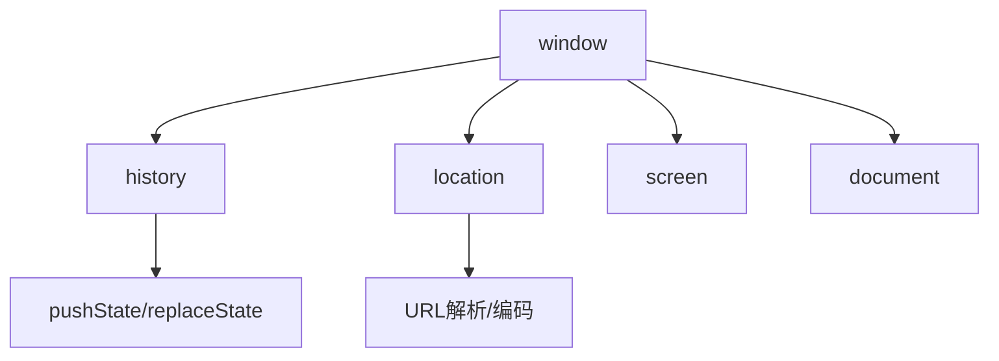

**图表来源**
- [docs/frontend-base/javascript/bom.md](file://docs/frontend-base/javascript/bom.md)

**章节来源**
- [docs/frontend-base/javascript/bom.md](file://docs/frontend-base/javascript/bom.md)

### 异步编程与 AJAX
- XMLHttpRequest 生命周期：readyState/status/statusText/response/responseType/responseText/responseXML/responseURL。
- 事件与回调：onreadystatechange/load/error/abort/loadend/timeout；上传进度 upload。
- 跨域与凭据：withCredentials、CORS 头；上传文件与 FormData。
- 优雅退出上报：Navigator.sendBeacon。
- 示例参考：[AJAX](file://docs/frontend-base/javascript/ajax.md)

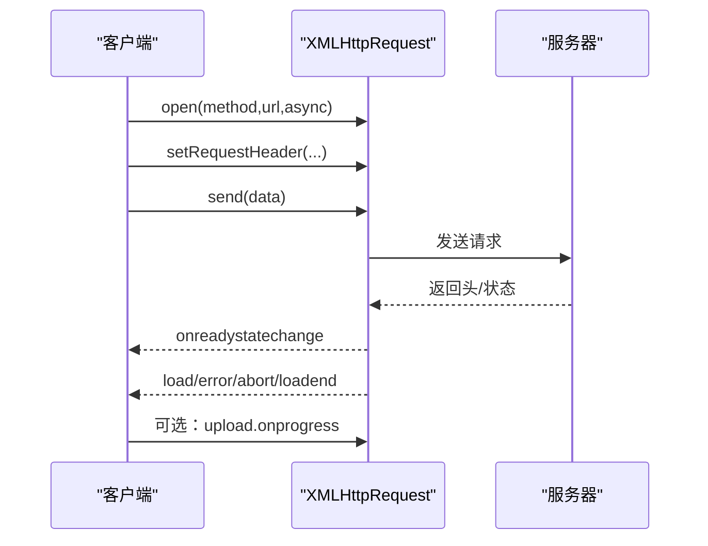

**图表来源**
- [docs/frontend-base/javascript/ajax.md](file://docs/frontend-base/javascript/ajax.md)

**章节来源**
- [docs/frontend-base/javascript/ajax.md](file://docs/frontend-base/javascript/ajax.md)

## 依赖分析
- 语法基础（变量/类型/函数）为“数据与控制”的根基，贯穿所有数据处理与运行时交互。
- DOM/BOM/事件/异步依赖浏览器宿主环境，彼此协作完成页面渲染、用户交互与网络请求。
- 数组/对象/字符串 API 为数据处理工具，服务于 DOM/BOM/事件/异步场景中的数据准备与转换。

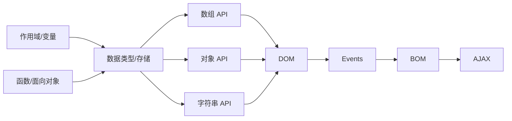

**图表来源**
- [docs/interview/JavaScript/scope.md](file://docs/interview/JavaScript/scope.md)
- [docs/interview/JavaScript/data_type.md](file://docs/interview/JavaScript/data_type.md)
- [docs/interview/JavaScript/functional_programming.md](file://docs/interview/JavaScript/functional_programming.md)
- [docs/frontend-base/javascript/array.md](file://docs/frontend-base/javascript/array.md)
- [docs/frontend-base/javascript/object.md](file://docs/frontend-base/javascript/object.md)
- [docs/frontend-base/javascript/string.md](file://docs/frontend-base/javascript/string.md)
- [docs/frontend-base/javascript/dom.md](file://docs/frontend-base/javascript/dom.md)
- [docs/frontend-base/javascript/event.md](file://docs/frontend-base/javascript/event.md)
- [docs/frontend-base/javascript/bom.md](file://docs/frontend-base/javascript/bom.md)
- [docs/frontend-base/javascript/ajax.md](file://docs/frontend-base/javascript/ajax.md)

**章节来源**
- [docs/interview/JavaScript/scope.md](file://docs/interview/JavaScript/scope.md)
- [docs/interview/JavaScript/data_type.md](file://docs/interview/JavaScript/data_type.md)
- [docs/interview/JavaScript/functional_programming.md](file://docs/interview/JavaScript/functional_programming.md)
- [docs/frontend-base/javascript/array.md](file://docs/frontend-base/javascript/array.md)
- [docs/frontend-base/javascript/object.md](file://docs/frontend-base/javascript/object.md)
- [docs/frontend-base/javascript/string.md](file://docs/frontend-base/javascript/string.md)
- [docs/frontend-base/javascript/dom.md](file://docs/frontend-base/javascript/dom.md)
- [docs/frontend-base/javascript/event.md](file://docs/frontend-base/javascript/event.md)
- [docs/frontend-base/javascript/bom.md](file://docs/frontend-base/javascript/bom.md)
- [docs/frontend-base/javascript/ajax.md](file://docs/frontend-base/javascript/ajax.md)

## 性能考量
- 函数式编程：强调纯函数与组合，提升可测试性与可维护性；但需注意上下文切换与对象创建带来的开销。
- DOM 操作：批量更新、使用 DocumentFragment、避免频繁重排/重绘；必要时结合 requestAnimationFrame/requestIdleCallback。
- 数组/对象处理：优先使用原地修改 API（如 splice/sort）与惰性求值（如惰性执行的柯里化）。
- 异步请求：合理设置超时与凭据，上传进度使用 upload 事件；退出时使用 sendBeacon 保障数据送达。

[本节为通用指导，无需特定文件引用]

## 故障排查指南
- XHR 状态码与提示：检查 readyState 与 status/statusText，区分 2xx/304 正常与 4xx/5xx 错误。
- 跨域问题：withCredentials 与 CORS 头配置，确保 Access-Control-Allow-Credentials。
- 事件未触发：确认监听器在 send() 前绑定；捕获/冒泡阶段监听器顺序与阻止传播。
- DOM 查询：querySelectorAll 返回静态集合；NodeList/HTMLCollection 的动态性差异。
- BOM 安全：同源策略限制；window.opener 与 noopener 防护。

**章节来源**
- [docs/frontend-base/javascript/ajax.md](file://docs/frontend-base/javascript/ajax.md)
- [docs/frontend-base/javascript/event.md](file://docs/frontend-base/javascript/event.md)
- [docs/frontend-base/javascript/dom.md](file://docs/frontend-base/javascript/dom.md)
- [docs/frontend-base/javascript/bom.md](file://docs/frontend-base/javascript/bom.md)

## 结论
本学习文档以仓库现有内容为基础，构建了从语法基础到浏览器 API 的系统知识体系。建议读者先掌握变量/类型/函数与作用域，再过渡到数组/对象/字符串的 API 实战，最后结合 DOM/事件/BOM/AJAX 完成前端交互闭环。配合函数式编程思想与性能优化实践，可进一步提升代码质量与运行效率。

[本节为总结性内容，无需特定文件引用]

## 附录
- 常用 API 快速索引
  - 数组：map/filter/forEach/slice/splice/sort/reduce
  - 对象：Object.keys/assign/defineProperty/freeze
  - 字符串：split/match/replace/trim/localeCompare
  - DOM：querySelector/querySelectorAll/事件监听/滚动定位
  - BOM：history/location/window.requestAnimationFrame
  - AJAX：open/send/onload/上传进度/退出上报

[本节为概览性内容，无需特定文件引用]