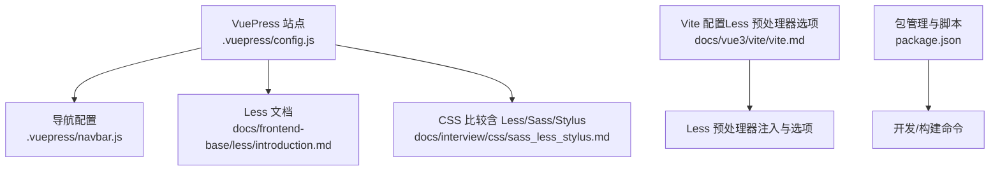
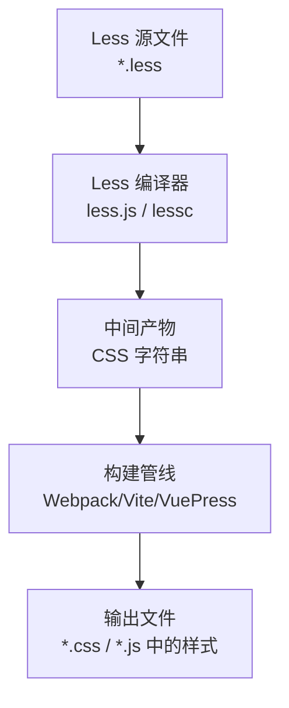
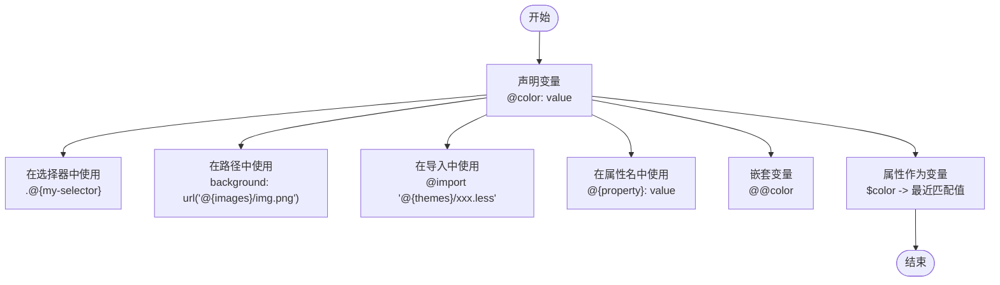
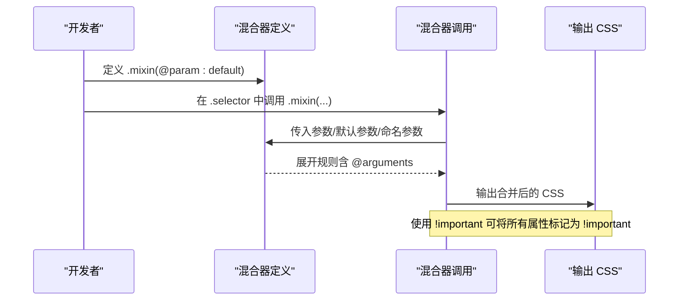
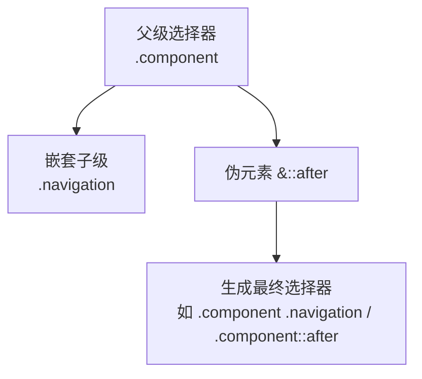
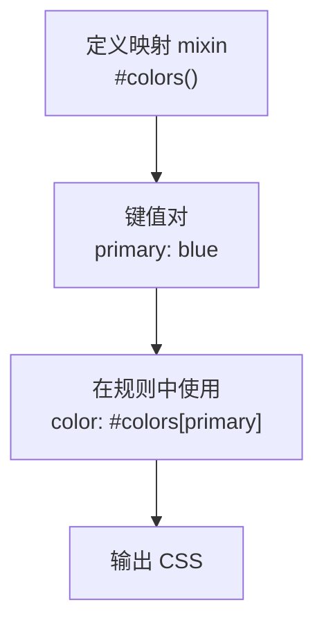
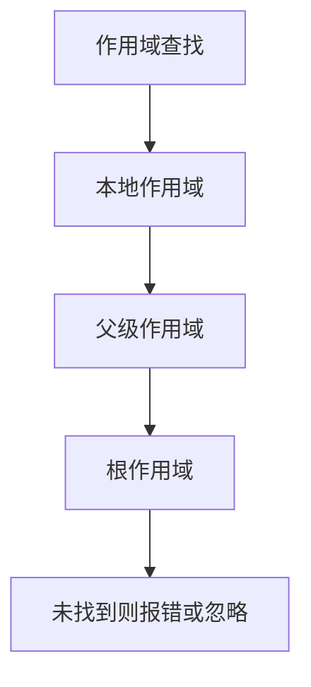
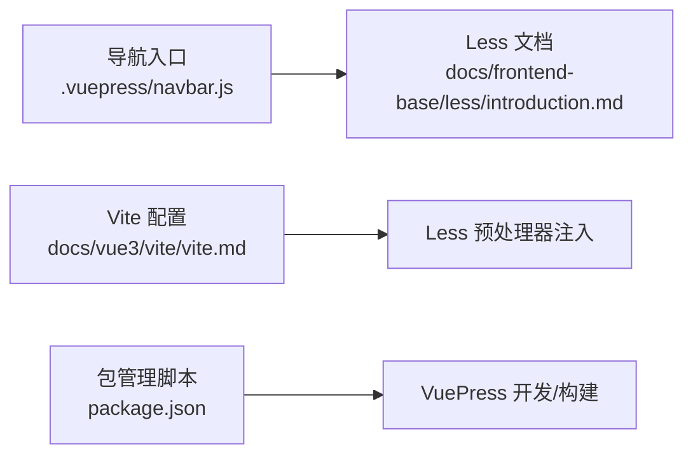

# Less 预处理器

<cite>
**本文引用的文件**
- [docs\frontend-base\less\introduction.md](file://docs/frontend-base/less/introduction.md)
- [docs\interview\css\sass_less_stylus.md](file://docs/interview/css/sass_less_stylus.md)
- [.vuepress\config.js](file://.vuepress/config.js)
- [package.json](file://package.json)
- [.vuepress\navbar.js](file://.vuepress/navbar.js)
- [docs\vue3\vite\vite.md](file://docs/vue3/vite/vite.md)
</cite>

## 目录
1. [简介](#简介)
2. [项目结构](#项目结构)
3. [核心组件](#核心组件)
4. [架构总览](#架构总览)
5. [详细组件分析](#详细组件分析)
6. [依赖分析](#依赖分析)
7. [性能考量](#性能考量)
8. [故障排查指南](#故障排查指南)
9. [结论](#结论)
10. [附录](#附录)

## 简介
本篇面向初学者与实践者，系统讲解 Less 预处理器的核心能力：变量、嵌套、混合器（mixin）、函数与映射、作用域、导入与编译配置，并结合与原生 CSS 的差异、在现代前端工程中的集成方式（如 VuePress、Vite、Webpack）给出实用建议与最佳实践。读者可据此快速掌握 Less 的优势与适用场景。

## 项目结构
本仓库为 VuePress 文档站点，Less 相关内容位于前端基础文档中；同时在面试 CSS 比较文章中对 Less/Sass/Stylus 的特性进行了横向对比；Vite 配置中提供了 Less 预处理器的注入与选项配置示例；VuePress 主题配置展示了站点整体风格与导航。

**图表来源**
- [.vuepress\config.js:1-18](file://.vuepress/config.js#L1-L18)
- [.vuepress\navbar.js:1-142](file://.vuepress/navbar.js#L1-L142)
- [docs\frontend-base\less\introduction.md:1-502](file://docs/frontend-base/less/introduction.md#L1-L502)
- [docs\interview\css\sass_less_stylus.md:1-286](file://docs/interview/css/sass_less_stylus.md#L1-L286)
- [docs\vue3\vite\vite.md:580-643](file://docs/vue3/vite/vite.md#L580-L643)
- [package.json:1-17](file://package.json#L1-L17)

**章节来源**
- [.vuepress\config.js:1-18](file://.vuepress/config.js#L1-L18)
- [.vuepress\navbar.js:1-142](file://.vuepress/navbar.js#L1-L142)
- [package.json:1-17](file://package.json#L1-L17)

## 核心组件
- 变量与属性作为变量
  - 变量用于集中管理颜色、尺寸、间距等，提升一致性与可维护性；支持在选择器、路径、导入语句、属性名等多处使用；支持属性作为变量（$prop）从当前/父级范围捕获最近匹配值。
- 嵌套与父选择器
  - 通过嵌套减少重复书写，提升层次感；& 表示父选择器，便于伪类、伪元素与组合类的书写。
- 混合器（mixin）
  - 类/ID 混合器可将一组规则复用到多个选择器；带括号的混合器定义可避免输出到 CSS；支持参数、默认参数、命名参数、@arguments；!important 可继承至所有属性。
- 函数与映射
  - Less 内置颜色、数学、字符串等函数；从 3.5 起支持将 mixin/规则集作为映射使用，通过 #map[key] 读取。
- 作用域与导入
  - 作用域遵循就近原则，先局部后父级；@import 支持多种扩展与导入选项（reference/inline/less/css/once/multiple/optional）。
- 运算与转义
  - 支持数值、颜色、变量的四则运算与单位换算；转义用于原样输出任意字符串，简化媒体查询等场景。
- 浏览器与命令行编译
  - less.js 可在浏览器中即时编译与监视；命令行工具 lessc 支持多种参数与输入输出方式；支持运行时修改变量。

**章节来源**
- [docs\frontend-base\less\introduction.md:5-502](file://docs/frontend-base/less/introduction.md#L5-L502)

## 架构总览
Less 在前端工程中的典型编译链路如下：源码（.less）经编译器（命令行或构建工具）转换为 CSS；在 VuePress/Vite/webpack 等环境中，Less 通常与 CSS Loader、PostCSS、压缩器等协同工作，最终产出可部署的样式资源。

**图表来源**
- [docs\frontend-base\less\introduction.md:422-502](file://docs/frontend-base/less/introduction.md#L422-L502)

## 详细组件分析

### 变量与属性作为变量
- 变量的多场景使用：选择器名、路径、导入路径、属性名等；支持变量嵌套变量（@@var）。
- 属性作为变量（$prop）：在嵌套层级中，$prop 可捕获最近匹配的属性值，便于跨层级复用。

**图表来源**
- [docs\frontend-base\less\introduction.md:22-96](file://docs/frontend-base/less/introduction.md#L22-L96)

**章节来源**
- [docs\frontend-base\less\introduction.md:22-96](file://docs/frontend-base/less/introduction.md#L22-L96)

### 混合器（mixin）与参数
- 混合器定义与调用：类/ID 混合器可直接复用；带括号的混合器定义不输出到 CSS。
- 参数与默认值：支持分号分隔的参数列表与逗号分隔的调用；支持命名参数与 @arguments。
- 父选择器与 !important：在混合器中使用 &:hover 等；!important 可继承至所有属性。

**图表来源**
- [docs\frontend-base\less\introduction.md:98-245](file://docs/frontend-base/less/introduction.md#L98-L245)

**章节来源**
- [docs\frontend-base\less\introduction.md:98-245](file://docs/frontend-base/less/introduction.md#L98-L245)

### 嵌套与父选择器
- 普通嵌套：减少重复书写，提升可读性。
- 父选择器 &：在嵌套中引用父级选择器，常用于伪类、伪元素与组合类。

**图表来源**
- [docs\frontend-base\less\introduction.md:247-321](file://docs/frontend-base/less/introduction.md#L247-L321)

**章节来源**
- [docs\frontend-base\less\introduction.md:247-321](file://docs/frontend-base/less/introduction.md#L247-L321)

### 函数与映射
- 函数：颜色、数学、字符串等常用函数，提升样式灵活性。
- 映射：将 mixin/规则集作为映射使用，通过 #map[key] 读取，便于主题化与模块化。

**图表来源**
- [docs\frontend-base\less\introduction.md:365-381](file://docs/frontend-base/less/introduction.md#L365-L381)

**章节来源**
- [docs\frontend-base\less\introduction.md:365-381](file://docs/frontend-base/less/introduction.md#L365-L381)

### 导入与作用域
- 导入策略：根据扩展名区分处理；支持 reference/inline/less/css/once/multiple/optional 等选项。
- 作用域：先局部后父级，变量与 mixin 的查找遵循就近原则。

**图表来源**
- [docs\frontend-base\less\introduction.md:383-421](file://docs/frontend-base/less/introduction.md#L383-L421)

**章节来源**
- [docs\frontend-base\less\introduction.md:383-421](file://docs/frontend-base/less/introduction.md#L383-L421)

### 与原生 CSS 的对比与差异
- 嵌套语法一致：Less/Sass/Stylus 均支持嵌套与 & 父选择器，差异在于书写风格（大括号 vs 无大括号）。
- 变量前缀：Less 使用 @，Sass 使用 $，Stylus 可用多种写法。
- 作用域：Less 与 Stylus 与 JS 类似，先局部后父级；Sass 中全局变量概念不同。
- 混入：三者均可模块化复用，语法与参数风格略有差异。
- 导入：Less 支持多种导入选项，便于控制输出与复用。

**章节来源**
- [docs\interview\css\sass_less_stylus.md:45-286](file://docs/interview/css/sass_less_stylus.md#L45-L286)

### 浏览器与命令行编译
- 浏览器端：less.js 可在浏览器中即时编译；支持设置环境、异步、轮询、dumpLineNumbers、relativeUrls 等选项；支持监视模式与运行时修改变量。
- 命令行：lessc 支持多种参数与输入输出方式，适合 CI/CD 与批量编译。

**章节来源**
- [docs\frontend-base\less\introduction.md:422-502](file://docs/frontend-base/less/introduction.md#L422-L502)

## 依赖分析
- VuePress 主题与导航
  - 主题配置与导航菜单中包含 Less 文档入口，体现 Less 在前端基础中的地位。
- Vite 预处理器选项
  - Vite 配置中提供 preprocessorOptions，可为 less 注入额外数据与选项（如 math: 'parens-division'），便于在构建时统一注入变量与函数。
- 包管理与脚本
  - package.json 提供 dev/build 命令，配合 VuePress 与构建工具完成开发与生产构建。

**图表来源**
- [.vuepress\navbar.js:16](file://.vuepress/navbar.js#L16)
- [docs\frontend-base\less\introduction.md:16](file://docs/frontend-base/less/introduction.md#L16)
- [docs\vue3\vite\vite.md:611-635](file://docs/vue3/vite/vite.md#L611-L635)
- [package.json:8-12](file://package.json#L8-L12)

**章节来源**
- [.vuepress\navbar.js:1-142](file://.vuepress/navbar.js#L1-L142)
- [docs\vue3\vite\vite.md:580-643](file://docs/vue3/vite/vite.md#L580-L643)
- [package.json:1-17](file://package.json#L1-L17)

## 性能考量
- 构建阶段优化
  - 在构建工具中开启压缩与 Tree-Shaking，减少未使用样式；合理拆分与缓存策略降低重复打包成本。
- 开发体验
  - 使用监视模式与热更新，缩短反馈周期；在浏览器端启用 dumpLineNumbers 便于定位 Less 源码。
- 资源体积
  - 合理使用变量与混合器，避免重复定义；在导入时使用 once/multiple 控制重复包含，减少冗余输出。

[本节为通用指导，不直接分析具体文件]

## 故障排查指南
- 变量未定义或作用域冲突
  - 检查变量声明位置与作用域链；确认父级是否存在同名覆盖。
- 导入异常
  - 检查文件扩展名与导入选项（reference/less/css/optional）；确认路径正确。
- 媒体查询与转义
  - 使用转义避免单位换算错误；确认转义语法与冒泡规则。
- 浏览器端编译问题
  - 检查 less.js 初始化选项（env/async/poll/dumpLineNumbers/relativeUrls）；确认监视模式已启用。

**章节来源**
- [docs\frontend-base\less\introduction.md:383-502](file://docs/frontend-base/less/introduction.md#L383-L502)

## 结论
Less 通过变量、嵌套、混合器、函数与映射等特性，显著提升了 CSS 的可维护性与可复用性。结合现代构建工具与运行时能力，Less 能在工程化场景中发挥更大价值。建议在团队中统一变量命名规范、混合器参数约定与导入策略，并在构建配置中注入必要的预处理选项，以获得稳定、高效的样式体系。

[本节为总结，不直接分析具体文件]

## 附录
- 常见使用场景与最佳实践
  - 设计系统：集中管理品牌色、字号、间距、圆角等变量，统一命名与分层。
  - 组件化：将通用样式抽象为混合器，支持参数化与命名参数，提升复用性。
  - 响应式：在嵌套中使用媒体查询，利用冒泡规则生成紧凑的断点样式。
  - 主题切换：通过运行时修改变量（浏览器端）或构建时注入（Vite/webpack）实现主题切换。
- 与 VuePress/Vite/webpack 的集成要点
  - VuePress：通过主题与导航组织 Less 文档；在 Vite 配置中为 Less 注入全局变量与选项。
  - Vite：使用 preprocessorOptions 为 less 注入额外数据与选项，如数学运算模式。
  - webpack：在模块规则中配置 less 与 less-loader，结合 MiniCssExtractPlugin 与压缩器优化输出。

**章节来源**
- [docs\frontend-base\less\introduction.md:1-502](file://docs/frontend-base/less/introduction.md#L1-L502)
- [docs\vue3\vite\vite.md:611-635](file://docs/vue3/vite/vite.md#L611-L635)
- [.vuepress\config.js:1-18](file://.vuepress/config.js#L1-L18)
- [package.json:8-12](file://package.json#L8-L12)