# TypeScript 语法

<cite>
**本文引用的文件**
- [docs\frontend-base\typescript\grammar.md](file://docs/frontend-base/typescript/grammar.md)
- [docs\interview\typescript\class.md](file://docs/interview/typescript/class.md)
- [docs\interview\typescript\data_type.md](file://docs/interview/typescript/data_type.md)
- [docs\interview\typescript\decorator.md](file://docs/interview/typescript/decorator.md)
- [docs\interview\typescript\function.md](file://docs/interview/typescript/function.md)
- [docs\interview\typescript\generic.md](file://docs/interview/typescript/generic.md)
- [docs\interview\typescript\high_type.md](file://docs/interview/typescript/high_type.md)
- [docs\interview\typescript\namespace_module.md](file://docs/interview/typescript/namespace_module.md)
- [docs\interview\typescript\typescript_javascript.md](file://docs/interview/typescript/typescript_javascript.md)
</cite>

## 目录
1. [简介](#简介)
2. [项目结构](#项目结构)
3. [核心组件](#核心组件)
4. [架构总览](#架构总览)
5. [详细组件分析](#详细组件分析)
6. [依赖分析](#依赖分析)
7. [性能考虑](#性能考虑)
8. [故障排查指南](#故障排查指南)
9. [结论](#结论)
10. [附录](#附录)

## 简介
本入门文档围绕 TypeScript 的类型系统、接口、泛型、装饰器、模块与命名空间、高级类型等核心特性展开，结合仓库中的多篇 TypeScript 文档，形成从基础到进阶的系统化知识体系。文档同时提供从 JavaScript 迁移到 TypeScript 的转换思路与最佳实践，帮助在大型项目中落地类型安全与工程化能力。

## 项目结构
本仓库中与 TypeScript 相关的知识分布在两类文档路径：
- 前端基础路径：docs/frontend-base/typescript，侧重语法与类型系统入门
- 面试专题路径：docs/interview/typescript，侧重进阶特性与工程实践

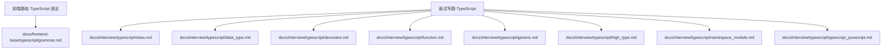

图表来源
- [docs/frontend-base/typescript/grammar.md](file://docs/frontend-base/typescript/grammar.md)
- [docs/interview/typescript/class.md](file://docs/interview/typescript/class.md)
- [docs/interview/typescript/data_type.md](file://docs/interview/typescript/data_type.md)
- [docs/interview/typescript/decorator.md](file://docs/interview/typescript/decorator.md)
- [docs/interview/typescript/function.md](file://docs/interview/typescript/function.md)
- [docs/interview/typescript/generic.md](file://docs/interview/typescript/generic.md)
- [docs/interview/typescript/high_type.md](file://docs/interview/typescript/high_type.md)
- [docs/interview/typescript/namespace_module.md](file://docs/interview/typescript/namespace_module.md)
- [docs/interview/typescript/typescript_javascript.md](file://docs/interview/typescript/typescript_javascript.md)

章节来源
- [docs/frontend-base/typescript/grammar.md](file://docs/frontend-base/typescript/grammar.md)
- [docs/interview/typescript/class.md](file://docs/interview/typescript/class.md)
- [docs/interview/typescript/data_type.md](file://docs/interview/typescript/data_type.md)
- [docs/interview/typescript/decorator.md](file://docs/interview/typescript/decorator.md)
- [docs/interview/typescript/function.md](file://docs/interview/typescript/function.md)
- [docs/interview/typescript/generic.md](file://docs/interview/typescript/generic.md)
- [docs/interview/typescript/high_type.md](file://docs/interview/typescript/high_type.md)
- [docs/interview/typescript/namespace_module.md](file://docs/interview/typescript/namespace_module.md)
- [docs/interview/typescript/typescript_javascript.md](file://docs/interview/typescript/typescript_javascript.md)

## 核心组件
- 类型系统与基础类型：布尔、数字、字符串、数组、元组、枚举、null/undefined、void、never、object、字面量、联合/交叉类型、any/unknown、类型断言、非空断言
- 接口与类型别名：接口定义、属性修饰符（可选/只读）、索引签名、接口扩展与交叉类型差异、泛型接口
- 函数：函数签名、调用签名/构造签名、可选参数/默认值/剩余参数/参数解构、函数重载、泛型函数、约束与指定类型
- 类：成员修饰符（public/protected/private/static）、继承与方法重写、静态属性、抽象类
- 装饰器：类/方法/属性/参数/访问器装饰器、装饰器工厂、执行顺序
- 模块与命名空间：ES 模块与顶级 import/export 规则、命名空间定义与使用
- 高级类型：交叉/联合、类型别名、索引类型 key of、约束 extends、映射类型、条件类型
- 从 JS 迁移：类型注解、类型推断、类型擦除、接口、枚举、泛型、命名空间、元组等

章节来源
- [docs/frontend-base/typescript/grammar.md](file://docs/frontend-base/typescript/grammar.md)
- [docs/interview/typescript/class.md](file://docs/interview/typescript/class.md)
- [docs/interview/typescript/data_type.md](file://docs/interview/typescript/data_type.md)
- [docs/interview/typescript/decorator.md](file://docs/interview/typescript/decorator.md)
- [docs/interview/typescript/function.md](file://docs/interview/typescript/function.md)
- [docs/interview/typescript/generic.md](file://docs/interview/typescript/generic.md)
- [docs/interview/typescript/high_type.md](file://docs/interview/typescript/high_type.md)
- [docs/interview/typescript/namespace_module.md](file://docs/interview/typescript/namespace_module.md)
- [docs/interview/typescript/typescript_javascript.md](file://docs/interview/typescript/typescript_javascript.md)

## 架构总览
下图展示了 TypeScript 在工程中的“类型-模块-高级类型”协同工作方式，帮助理解从基础类型到高级特性的演进路径。

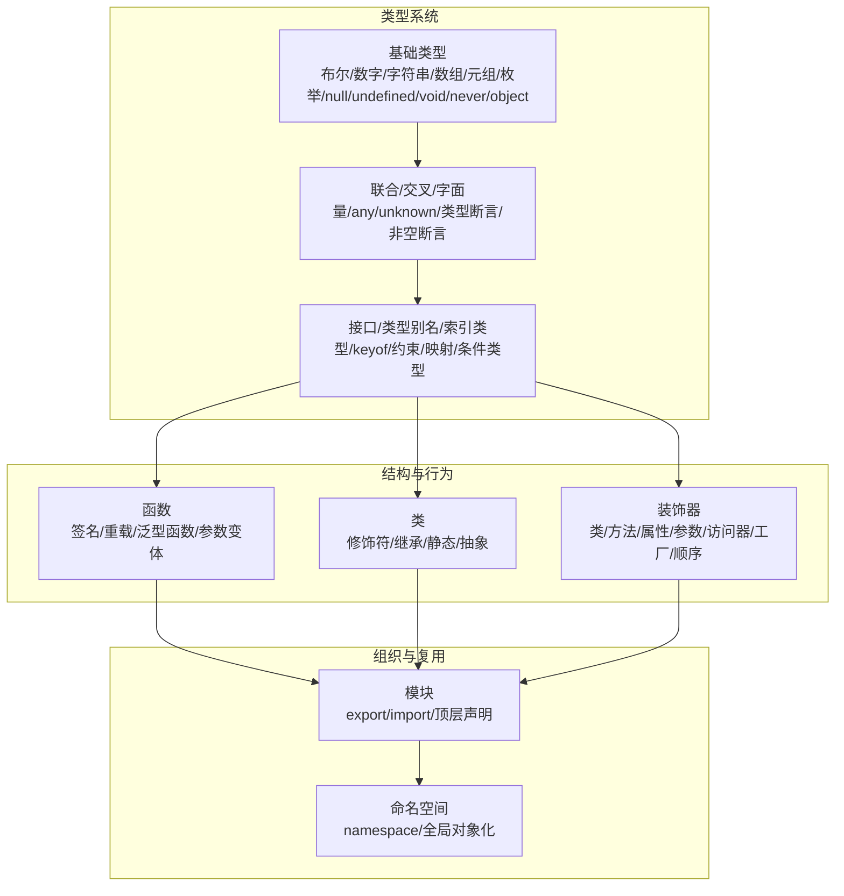

图表来源
- [docs/frontend-base/typescript/grammar.md](file://docs/frontend-base/typescript/grammar.md)
- [docs/interview/typescript/class.md](file://docs/interview/typescript/class.md)
- [docs/interview/typescript/data_type.md](file://docs/interview/typescript/data_type.md)
- [docs/interview/typescript/decorator.md](file://docs/interview/typescript/decorator.md)
- [docs/interview/typescript/function.md](file://docs/interview/typescript/function.md)
- [docs/interview/typescript/generic.md](file://docs/interview/typescript/generic.md)
- [docs/interview/typescript/high_type.md](file://docs/interview/typescript/high_type.md)
- [docs/interview/typescript/namespace_module.md](file://docs/interview/typescript/namespace_module.md)
- [docs/interview/typescript/typescript_javascript.md](file://docs/interview/typescript/typescript_javascript.md)

## 详细组件分析

### 类型系统与基础类型
- 基础类型覆盖：布尔、数字（含二/八/十/十六进制）、字符串与模板字符串、数组与元组（可选元素/剩余元素）
- 特殊类型：null/undefined、void、never、unknown、any、object
- 联合/交叉/字面量：联合类型用于“或”，交叉类型用于“且”，字面量常与联合配合表达有限取值
- 类型断言与非空断言：在确定类型时缩小范围；非空断言用于排除 null/undefined
- 类型收缩：在分支中根据 typeof 等进行收窄，提升类型安全性

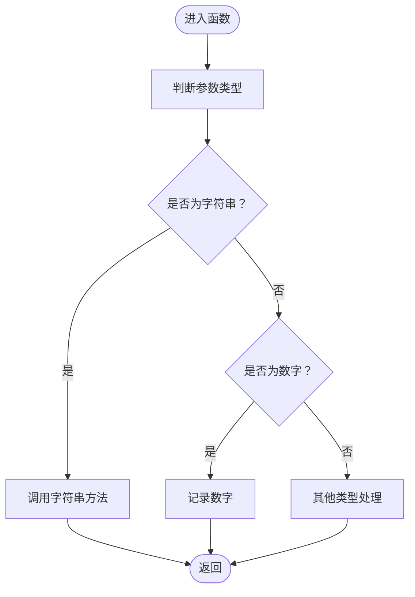

图表来源
- [docs/frontend-base/typescript/grammar.md](file://docs/frontend-base/typescript/grammar.md)

章节来源
- [docs/frontend-base/typescript/grammar.md](file://docs/frontend-base/typescript/grammar.md)
- [docs/interview/typescript/data_type.md](file://docs/interview/typescript/data_type.md)

### 接口与类型别名
- 接口定义对象结构，支持可选属性、只读属性、索引签名
- 接口扩展与交叉类型差异：接口合并规则与冲突处理；交叉类型合并属性时的兼容性
- 泛型接口：在接口层面使用类型参数，增强复用性
- 类型别名：可表达联合/交叉/元组/原始类型等，适用范围更广

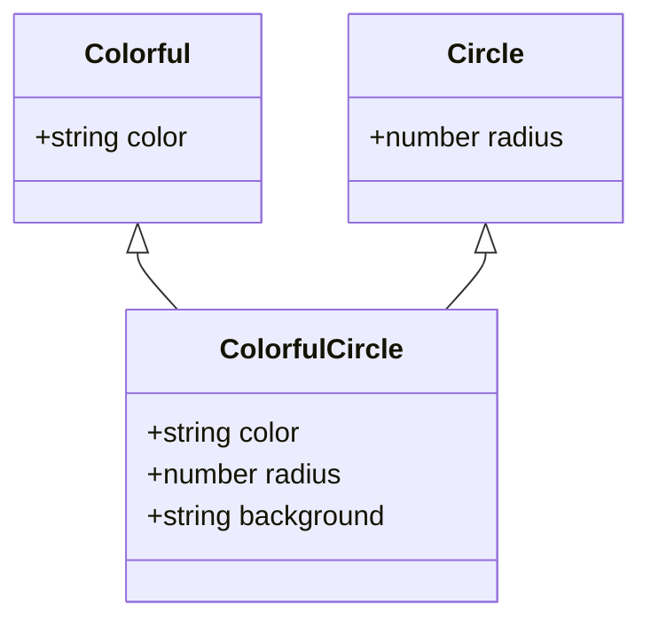

图表来源
- [docs/frontend-base/typescript/grammar.md](file://docs/frontend-base/typescript/grammar.md)

章节来源
- [docs/frontend-base/typescript/grammar.md](file://docs/frontend-base/typescript/grammar.md)

### 函数：签名、重载与泛型
- 函数签名与调用/构造签名：描述函数的参数与返回类型，或作为构造器签名
- 参数变体：可选参数、默认值、剩余参数、参数解构
- 函数重载：声明多个签名，实现一个兼容的实现签名
- 泛型函数：通过类型参数关联输入输出，支持约束与手动指定类型

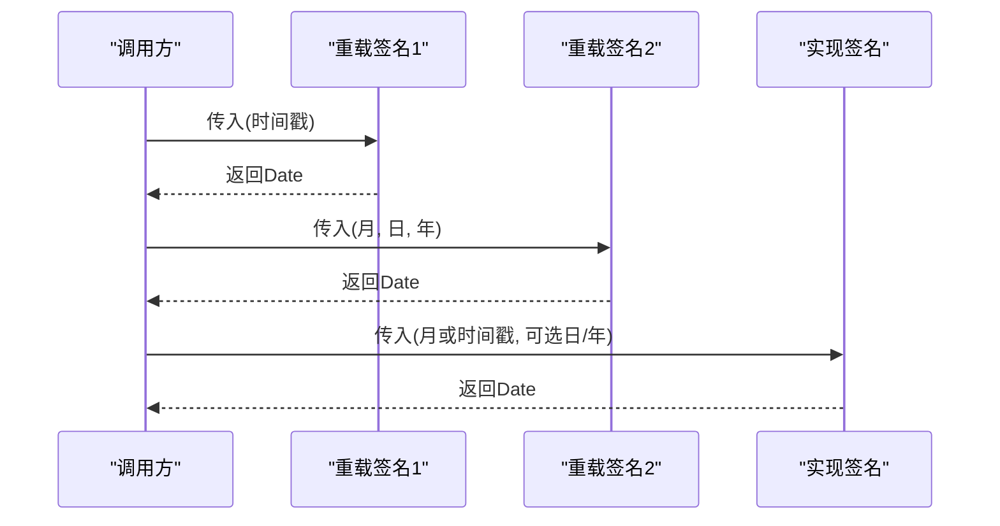

图表来源
- [docs/frontend-base/typescript/grammar.md](file://docs/frontend-base/typescript/grammar.md)
- [docs/interview/typescript/function.md](file://docs/interview/typescript/function.md)

章节来源
- [docs/frontend-base/typescript/grammar.md](file://docs/frontend-base/typescript/grammar.md)
- [docs/interview/typescript/function.md](file://docs/interview/typescript/function.md)

### 类：成员、继承与抽象
- 成员修饰符：public（默认）、protected、private、static
- 继承与方法重写：遵循基类约定，使用 super 调用父类成员
- 抽象类：定义抽象方法，子类必须实现

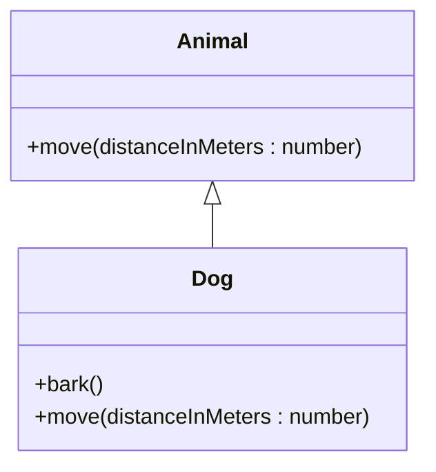

图表来源
- [docs/interview/typescript/class.md](file://docs/interview/typescript/class.md)

章节来源
- [docs/interview/typescript/class.md](file://docs/interview/typescript/class.md)

### 装饰器：类/方法/属性/参数/访问器
- 装饰器本质是函数，@expression 形式在运行时求值并调用
- 支持类/方法/属性/参数/访问器装饰器，可组合并按特定顺序执行
- 装饰器工厂：返回装饰器函数，便于传参

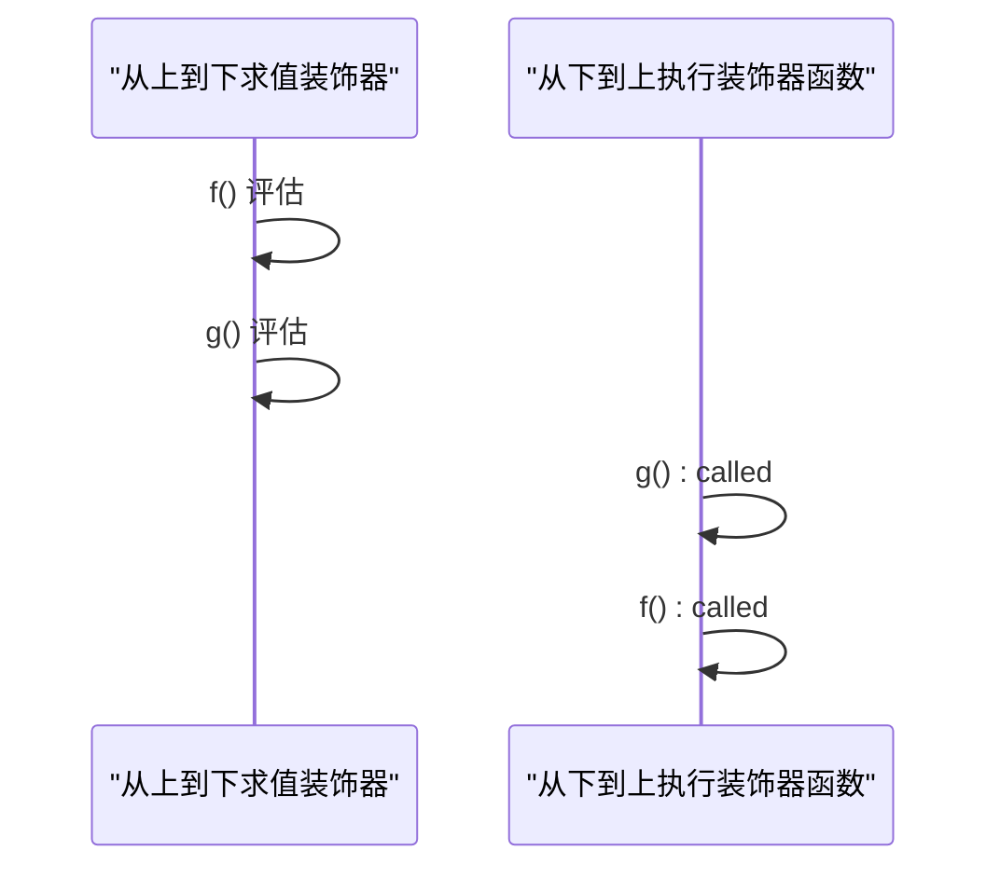

图表来源
- [docs/interview/typescript/decorator.md](file://docs/interview/typescript/decorator.md)

章节来源
- [docs/interview/typescript/decorator.md](file://docs/interview/typescript/decorator.md)

### 模块与命名空间
- 模块：包含顶级 import/export 的文件视为模块；无顶级导入导出则视为全局可见
- 命名空间：通过 namespace 组织全局变量，本质是对象化，便于避免重名

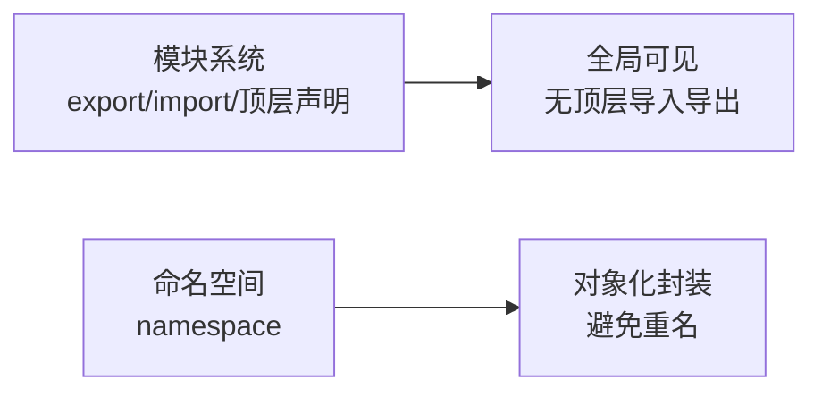

图表来源
- [docs/interview/typescript/namespace_module.md](file://docs/interview/typescript/namespace_module.md)

章节来源
- [docs/interview/typescript/namespace_module.md](file://docs/interview/typescript/namespace_module.md)

### 高级类型：交叉/联合/索引/约束/映射/条件
- 交叉/联合：并/或，联合常与类型收缩配合
- 类型别名：表达复杂类型组合，适用范围广
- 索引类型 key of：从接口中提取键的联合类型
- 约束 extends：限制泛型取值范围
- 映射类型：遍历键并生成新类型
- 条件类型：三元表达式风格的类型分支

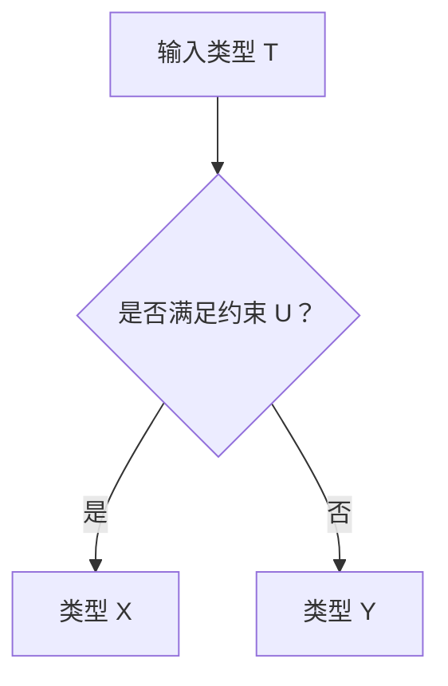

图表来源
- [docs/interview/typescript/high_type.md](file://docs/interview/typescript/high_type.md)

章节来源
- [docs/interview/typescript/high_type.md](file://docs/interview/typescript/high_type.md)

### 从 JavaScript 迁移到 TypeScript
- 类型注解与推断：逐步为变量/函数添加类型注解，利用推断减少样板
- 类型擦除：编译期类型信息在运行时被擦除，不影响产物
- 接口与枚举：为对象与有限取值建模
- 泛型与高级类型：提升代码复用与健壮性
- 命名空间与模块：组织代码，避免全局污染
- 元组：表达异构数组结构

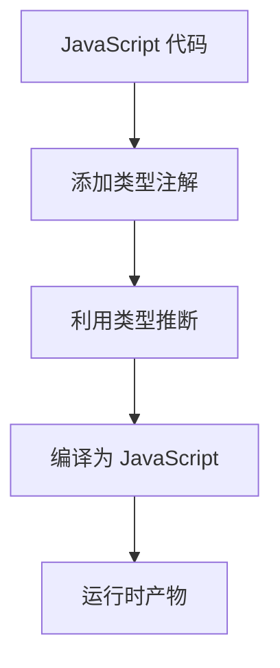

图表来源
- [docs/interview/typescript/typescript_javascript.md](file://docs/interview/typescript/typescript_javascript.md)

章节来源
- [docs/interview/typescript/typescript_javascript.md](file://docs/interview/typescript/typescript_javascript.md)

## 依赖分析
- 内聚性：各主题文档围绕单一特性（如函数、类、装饰器、高级类型）展开，内聚度高
- 耦合性：前端基础语法文档为后续进阶文档提供基础；进阶文档在基础之上扩展高级特性
- 循环依赖：文档间无循环引用，采用线性演进结构
- 外部依赖：模块系统与命名空间用于组织代码；装饰器需编译器配置启用

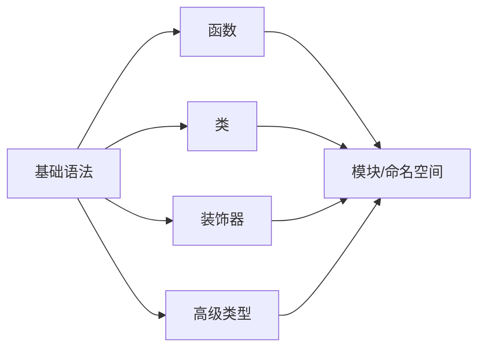

图表来源
- [docs/frontend-base/typescript/grammar.md](file://docs/frontend-base/typescript/grammar.md)
- [docs/interview/typescript/class.md](file://docs/interview/typescript/class.md)
- [docs/interview/typescript/decorator.md](file://docs/interview/typescript/decorator.md)
- [docs/interview/typescript/high_type.md](file://docs/interview/typescript/high_type.md)
- [docs/interview/typescript/namespace_module.md](file://docs/interview/typescript/namespace_module.md)

章节来源
- [docs/frontend-base/typescript/grammar.md](file://docs/frontend-base/typescript/grammar.md)
- [docs/interview/typescript/class.md](file://docs/interview/typescript/class.md)
- [docs/interview/typescript/decorator.md](file://docs/interview/typescript/decorator.md)
- [docs/interview/typescript/high_type.md](file://docs/interview/typescript/high_type.md)
- [docs/interview/typescript/namespace_module.md](file://docs/interview/typescript/namespace_module.md)

## 性能考虑
- 类型检查在编译期完成，不引入运行时开销
- 泛型与高级类型在编译期被擦除，仅影响类型安全，不影响运行时性能
- 模块化与命名空间有助于代码分割与按需加载，间接优化打包体积与加载性能
- 合理使用装饰器与类型断言，避免过度复杂化导致编译时间增长

## 故障排查指南
- 类型不匹配：检查联合/交叉类型、类型收缩与断言使用是否合理
- 装饰器未生效：确认编译器配置已启用实验性装饰器
- 模块冲突：确保文件具备顶级 import/export，避免全局污染
- 泛型约束错误：核对 extends 约束与 key of 索引类型使用

章节来源
- [docs/interview/typescript/decorator.md](file://docs/interview/typescript/decorator.md)
- [docs/interview/typescript/namespace_module.md](file://docs/interview/typescript/namespace_module.md)
- [docs/interview/typescript/high_type.md](file://docs/interview/typescript/high_type.md)

## 结论
TypeScript 通过静态类型系统与丰富的语言特性，为大型项目提供类型安全、可维护性与可扩展性。从基础类型到高级类型、从模块化组织到装饰器扩展，结合迁移策略与最佳实践，可在工程中稳定落地并持续演进。

## 附录
- 进一步阅读建议：结合仓库中的前端基础与面试专题文档，循序渐进掌握 TypeScript 的全貌
- 实践建议：在现有 JS 项目中逐步引入类型注解与模块化，优先使用接口与泛型提升代码质量