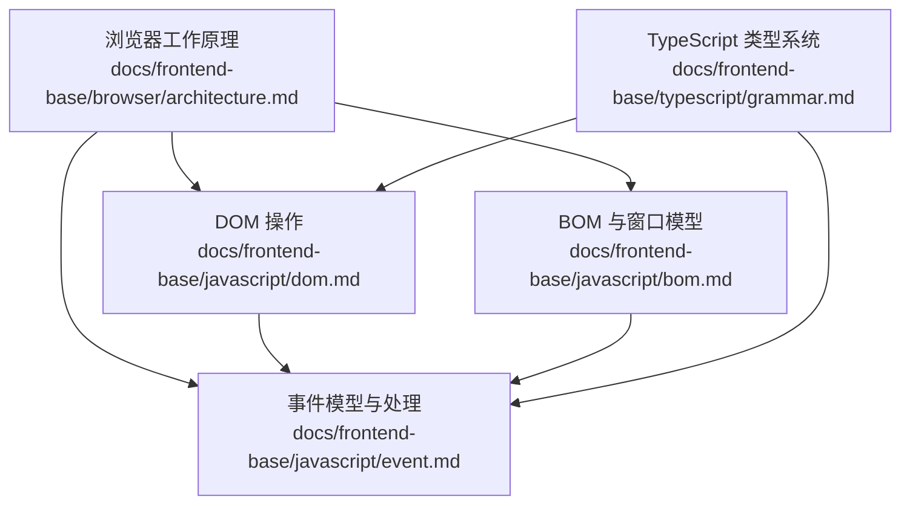
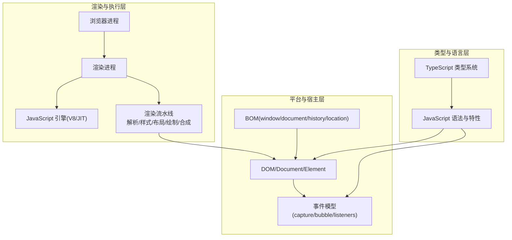
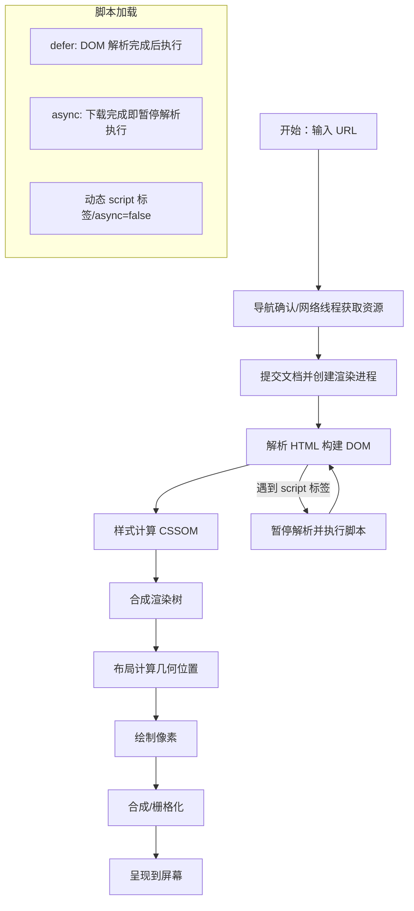
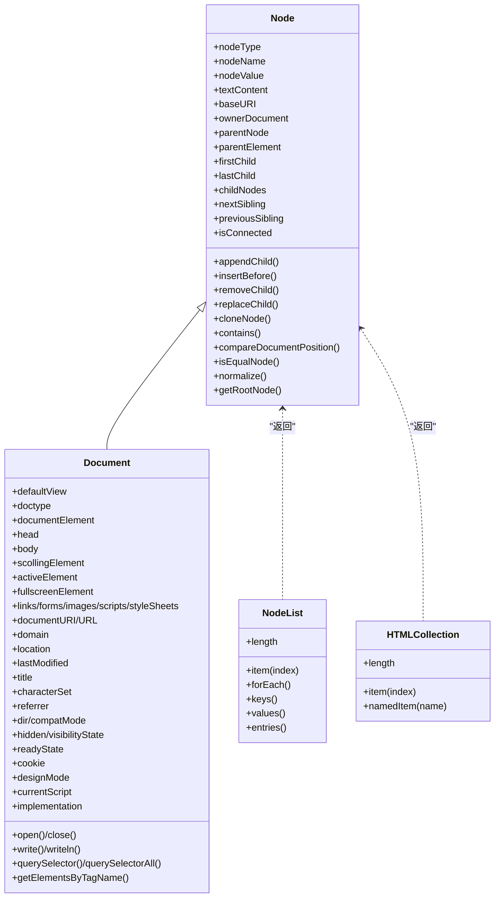
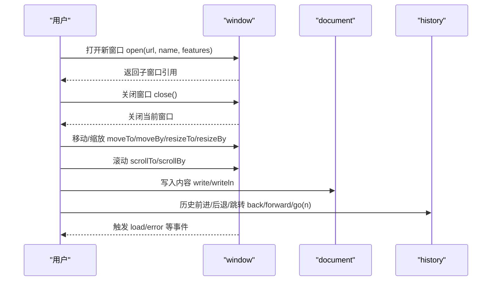
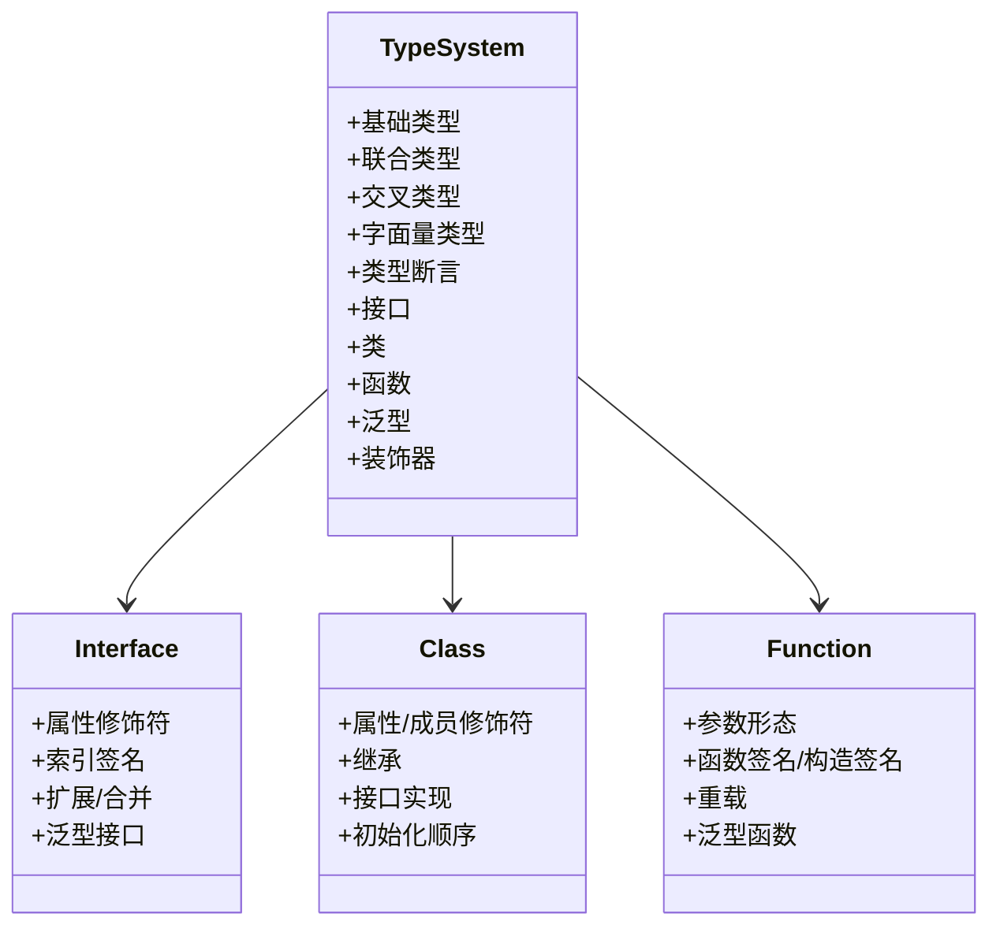
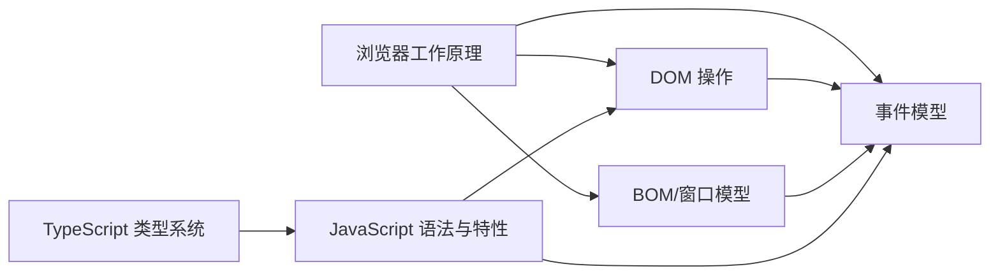

# 前端基础

<cite>
**本文引用的文件**
- [浏览器架构.md](file://docs/frontend-base/browser/architecture.md)
- [DOM.md](file://docs/frontend-base/javascript/dom.md)
- [事件.md](file://docs/frontend-base/javascript/event.md)
- [BOM.md](file://docs/frontend-base/javascript/bom.md)
- [TypeScript 语法.md](file://docs/frontend-base/typescript/grammar.md)
</cite>

## 目录
1. [引言](#引言)
2. [项目结构](#项目结构)
3. [核心组件](#核心组件)
4. [架构总览](#架构总览)
5. [详细组件分析](#详细组件分析)
6. [依赖分析](#依赖分析)
7. [性能考虑](#性能考虑)
8. [故障排查指南](#故障排查指南)
9. [结论](#结论)
10. [附录](#附录)

## 引言
本学习文档面向前端入门者，系统梳理 HTML 语义化标签、CSS 选择器与布局、JavaScript 基础语法与 DOM 操作、浏览器工作原理、TypeScript 类型系统等核心知识。文档以“理论+实践”为主线，提供循序渐进的学习路径与大量示例指引，帮助读者建立扎实的前端基础。

## 项目结构
本仓库的前端基础内容分布在 docs/frontend-base 目录下，涵盖浏览器工作原理、DOM/BOM/事件、TypeScript 等主题。以下为与本文相关的核心文件与定位：

- 浏览器工作原理：docs/frontend-base/browser/architecture.md
- DOM/BOM/事件：docs/frontend-base/javascript/dom.md、docs/frontend-base/javascript/bom.md、docs/frontend-base/javascript/event.md
- TypeScript：docs/frontend-base/typescript/grammar.md



图表来源
- [浏览器架构.md](file://docs/frontend-base/browser/architecture.md)
- [DOM.md](file://docs/frontend-base/javascript/dom.md)
- [BOM.md](file://docs/frontend-base/javascript/bom.md)
- [事件.md](file://docs/frontend-base/javascript/event.md)
- [TypeScript 语法.md](file://docs/frontend-base/typescript/grammar.md)

章节来源
- [浏览器架构.md](file://docs/frontend-base/browser/architecture.md)
- [DOM.md](file://docs/frontend-base/javascript/dom.md)
- [BOM.md](file://docs/frontend-base/javascript/bom.md)
- [事件.md](file://docs/frontend-base/javascript/event.md)
- [TypeScript 语法.md](file://docs/frontend-base/typescript/grammar.md)

## 核心组件
- 浏览器渲染管线与脚本加载策略：涵盖多进程架构、输入 URL 到渲染的关键阶段、脚本 defer/async/动态加载与回流重绘优化。
- DOM/BOM/事件体系：DOM 节点模型、NodeList/HTMLCollection、Document/Element 查询与操作；BOM 窗口模型、History/Location；事件捕获/冒泡、监听与派发。
- TypeScript 类型系统：基础类型、联合/交叉类型、接口与类、泛型、装饰器等。

章节来源
- [浏览器架构.md](file://docs/frontend-base/browser/architecture.md)
- [DOM.md](file://docs/frontend-base/javascript/dom.md)
- [BOM.md](file://docs/frontend-base/javascript/bom.md)
- [事件.md](file://docs/frontend-base/javascript/event.md)
- [TypeScript 语法.md](file://docs/frontend-base/typescript/grammar.md)

## 架构总览
前端基础学习的“知识架构”可抽象为三层：
- 渲染与执行层：浏览器进程、渲染进程、脚本执行（V8/JIT）、渲染流水线（解析/样式/布局/绘制/合成）。
- 平台与宿主层：DOM/BOM/事件模型，浏览器提供的全局对象与能力（window/document/history/location）。
- 类型与语言层：JavaScript 语言特性与 TypeScript 类型系统，为工程化与大型项目提供类型安全保障。



图表来源
- [浏览器架构.md](file://docs/frontend-base/browser/architecture.md)
- [DOM.md](file://docs/frontend-base/javascript/dom.md)
- [BOM.md](file://docs/frontend-base/javascript/bom.md)
- [事件.md](file://docs/frontend-base/javascript/event.md)
- [TypeScript 语法.md](file://docs/frontend-base/typescript/grammar.md)

## 详细组件分析

### 浏览器工作原理与渲染管线
- 多进程架构与职责划分：浏览器进程、渲染进程、GPU 进程、插件进程。
- 输入 URL 到渲染的关键阶段：导航确认/数据获取/提交确认 → 构造 DOM/样式计算/创建渲染树/布局/绘制/合成。
- 脚本加载策略：defer/async/动态加载与执行时机；脚本阻塞与性能影响；integrity 与安全加载。
- 回流与重绘：触发条件、代价与优化策略（transform、will-change、分层、避免 table/flex 高成本布局）。



图表来源
- [浏览器架构.md](file://docs/frontend-base/browser/architecture.md)

章节来源
- [浏览器架构.md](file://docs/frontend-base/browser/architecture.md)

### DOM 操作与节点模型
- Node 接口与节点类型：ELEMENT/TEXT/DOCUMENT 等 nodeType 常量与 nodeName/value/attributes。
- 节点关系：父子兄弟/文档根/片段/文档类型/注释节点。
- 节点操作：appendChild/insertBefore/removeChild/replaceChild/cloneNode/contains/compareDocumentPosition/isEqualNode。
- NodeList/HTMLCollection：动态集合、遍历、命名项访问。
- Document 快捷属性与方法：documentElement/head/body/URL/title/readyState/visibilityState/cookie/write/close/querySelector/querySelectorAll/getElementsByTagName。



图表来源
- [DOM.md](file://docs/frontend-base/javascript/dom.md)

章节来源
- [DOM.md](file://docs/frontend-base/javascript/dom.md)

### BOM 与窗口模型
- window 对象：顶层对象、name/closed/opener/self/window/frames/length/frameElement/top/parent。
- 位置与尺寸：screenX/Y、inner/outer/scrollX/Y/pageX/YOffset、devicePixelRatio。
- 组件可见性：locationbar/menubar/scrollbars/toolbar/statusbar/personalbar。
- 全局对象属性：document/location/navigator/history/localStorage/sessionStorage/console/screen。
- 对话框与交互：alert/prompt/confirm；打开/关闭/停止：open/close/stop；移动/缩放/滚动：moveTo/moveBy/resizeTo/resizeBy/scrollTo/scrollBy/print/focus/blur；选择与样式：getSelection/getComputedStyle/matchMedia/requestAnimationFrame/requestIdleCallback。
- 事件：load/error/onerror、页面生命周期事件等。
- 多窗口：_top/_parent/_blank、frames/parent/self、postMessage 通信与同源限制。



图表来源
- [BOM.md](file://docs/frontend-base/javascript/bom.md)

章节来源
- [BOM.md](file://docs/frontend-base/javascript/bom.md)

### 事件模型与处理
- 事件流：捕获阶段 → 目标阶段 → 冒泡阶段；addEventListener/useCapture/once/passive。
- 监听与移除：addEventListener/removeEventListener/dispatchEvent；handleEvent 对象。
- 鼠标/键盘/触摸/拖拽事件：click/dblclick/mouseover/mouseenter/mouseout/mouseleave/mousedown/mouseup/mousemove/wheel/keydown/keypress/keyup/touchstart/touchmove/touchend/touchcancel/drag/dragstart/dragend/dragenter/dragover/dragleave/drop。
- DataTransfer：拖拽数据读写、dropEffect/effectAllowed/files。
- 事件对象属性：button/buttons/keys/screen/client/page/offset/movement 等坐标系；altKey/ctrlKey/metaKey/shiftKey；repeat/location 等。

```mermaid
sequenceDiagram
participant U as "用户"
participant P as "父元素"
participant T as "目标元素"
participant C as "子元素"
U->>C : 触发点击
C-->>C : 目标阶段(target)
C-->>P : 冒泡阶段(bubble)
P-->>T : 捕获阶段(capture)
Note over C,P,T : 可通过 useCapture 控制捕获/冒泡监听
```

图表来源
- [事件.md](file://docs/frontend-base/javascript/event.md)

章节来源
- [事件.md](file://docs/frontend-base/javascript/event.md)

### TypeScript 类型系统
- 基础类型：null/undefined/number/boolean/string/array/tuple/Function/unknown/any/void/never/字面量类型。
- 联合/交叉类型：联合类型与共有成员访问、类型收缩；交叉类型合并与冲突处理。
- 类型断言/非空断言：as/! 断言场景与注意事项。
- 接口与类：属性修饰符（可选/只读）、索引签名、接口扩展/合并、泛型接口。
- 函数：参数（可选/默认/剩余/解构）、函数签名/构造签名、函数重载、泛型函数、约束。
- 类：属性/成员修饰符（public/protected/private/static）、继承与初始化顺序、接口实现。
- 装饰器：类/方法/属性/参数装饰器组合与执行顺序。
- 泛型：类型参数、约束、指定泛型类型；与接口/函数/类结合。



图表来源
- [TypeScript 语法.md](file://docs/frontend-base/typescript/grammar.md)

章节来源
- [TypeScript 语法.md](file://docs/frontend-base/typescript/grammar.md)

## 依赖分析
- 浏览器工作原理为 DOM/BOM/事件提供宿主环境与执行上下文，脚本加载策略直接影响 DOM 构建与渲染时机。
- DOM/BOM/事件三者紧密耦合：DOM 提供节点模型，BOM 提供窗口与历史/位置等能力，事件贯穿二者并驱动交互。
- TypeScript 为 JavaScript 提供类型保障，提升大型前端项目的可维护性与协作效率。



图表来源
- [浏览器架构.md](file://docs/frontend-base/browser/architecture.md)
- [DOM.md](file://docs/frontend-base/javascript/dom.md)
- [BOM.md](file://docs/frontend-base/javascript/bom.md)
- [事件.md](file://docs/frontend-base/javascript/event.md)
- [TypeScript 语法.md](file://docs/frontend-base/typescript/grammar.md)

章节来源
- [浏览器架构.md](file://docs/frontend-base/browser/architecture.md)
- [DOM.md](file://docs/frontend-base/javascript/dom.md)
- [BOM.md](file://docs/frontend-base/javascript/bom.md)
- [事件.md](file://docs/frontend-base/javascript/event.md)
- [TypeScript 语法.md](file://docs/frontend-base/typescript/grammar.md)

## 性能考虑
- 渲染性能：避免频繁读取引发回流/重绘的属性；使用 transform 替代 top/left；将动画应用于 absolute/fixed 元素；启用 will-change；合理分层与合成；避免 table/flex 高成本布局。
- 脚本加载：defer/async/动态加载策略；避免 document.write；CDN 与 integrity；按需加载与缓存。
- 事件处理：使用 passive 监听；批量 DOM 更新；事件委托；避免在高频事件中执行昂贵逻辑。
- 类型系统：通过 TypeScript 提前发现潜在错误，减少运行时开销与调试成本。

## 故障排查指南
- DOM 操作问题：检查节点是否存在 isConnected；区分 firstChild/firstElementChild；注意动态集合 NodeList 的实时性；使用 normalize 合并相邻文本节点。
- 事件不触发：确认事件监听是否在正确的阶段（捕获/冒泡）注册；检查 preventDefault/stopPropagation 是否被调用；确保事件目标与冒泡路径正确。
- BOM 与窗口：跨域限制导致 opener 为 null；postMessage 通信需同源或正确设置 origin；多窗口间通信使用 window.postMessage。
- 浏览器渲染：脚本阻塞导致白屏；defer/async 顺序与依赖；回流重绘频繁导致卡顿；使用 requestAnimationFrame/requestIdleCallback 合理安排任务。
- TypeScript：联合类型访问受限时进行类型收缩；泛型约束与类型推断；装饰器组合顺序与副作用。

章节来源
- [DOM.md](file://docs/frontend-base/javascript/dom.md)
- [事件.md](file://docs/frontend-base/javascript/event.md)
- [BOM.md](file://docs/frontend-base/javascript/bom.md)
- [浏览器架构.md](file://docs/frontend-base/browser/architecture.md)
- [TypeScript 语法.md](file://docs/frontend-base/typescript/grammar.md)

## 结论
前端基础学习应以“浏览器工作原理”为骨架，以“DOM/BOM/事件”为实践载体，辅以“TypeScript 类型系统”提升工程化质量。通过理解渲染管线、脚本加载策略与回流重绘机制，结合 DOM/BOM/事件的实际操作与最佳实践，配合 TypeScript 的类型保障，能够系统性地掌握前端开发的核心能力，为进阶学习打下坚实基础。

## 附录
- 学习路径建议
  - 第一阶段：浏览器工作原理与渲染管线（含脚本加载策略）
  - 第二阶段：DOM/BOM/事件模型与实战
  - 第三阶段：TypeScript 类型系统与工程化
  - 第四阶段：综合项目实践与性能优化