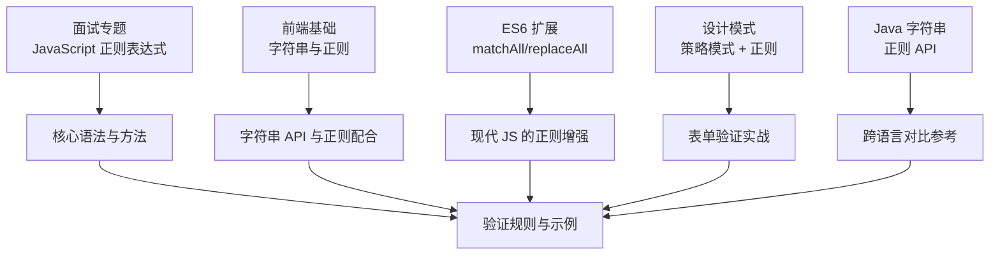
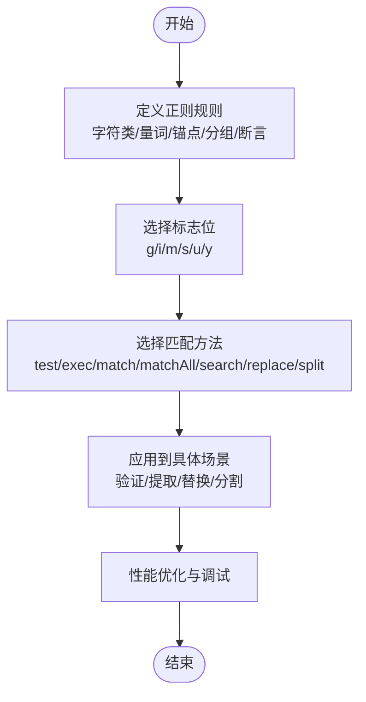
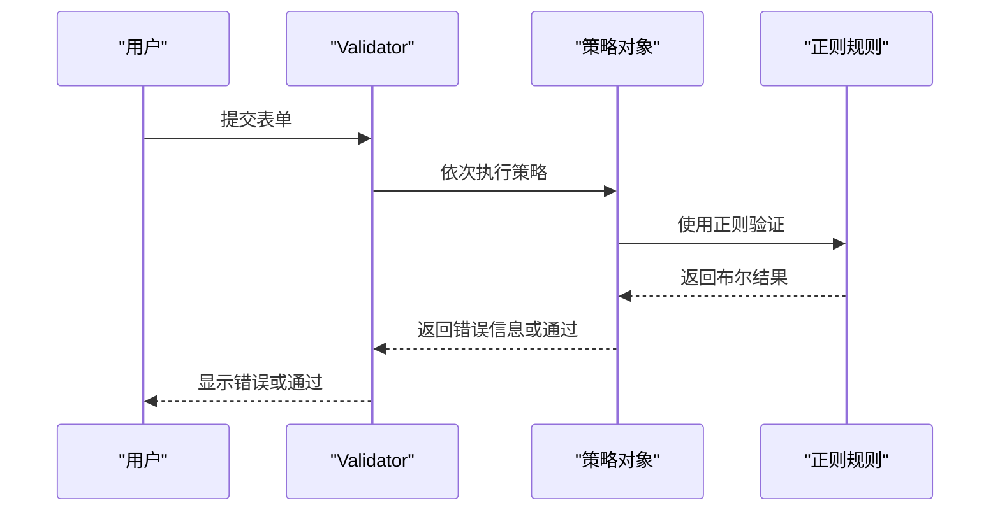
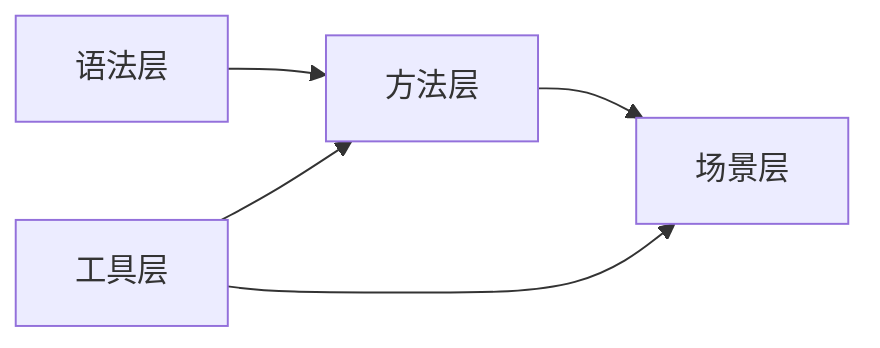

# 正则表达式

<cite>
**本文引用的文件**
- [docs/interview/JavaScript/regexp.md](file://docs/interview/JavaScript/regexp.md)
- [docs/frontend-base/javascript/string.md](file://docs/frontend-base/javascript/string.md)
- [docs/frontend-advanced/es6/grammar.md](file://docs/frontend-advanced/es6/grammar.md)
- [.vuepress/reference/wangtunan/designPattern/README.md](file://.vuepress/reference/wangtunan/designPattern/README.md)
- [docs/interview/design/Strategy Pattern.md](file://docs/interview/design/Strategy Pattern.md)
- [docs/backend-base/java/string.md](file://docs/backend-base/java/string.md)
</cite>

## 目录
1. [简介](#简介)
2. [项目结构](#项目结构)
3. [核心组件](#核心组件)
4. [架构总览](#架构总览)
5. [详细组件分析](#详细组件分析)
6. [依赖关系分析](#依赖关系分析)
7. [性能考量](#性能考量)
8. [故障排查指南](#故障排查指南)
9. [结论](#结论)
10. [附录](#附录)

## 简介
本学习文档系统性梳理正则表达式的核心语法与实践，覆盖语法规则、字符类、量词、分组、断言、匹配方法、常用验证规则、文本处理技巧，并结合 JavaScript 实际应用（表单验证、URL 解析、文本替换等）给出场景化示例与最佳实践。同时强调性能优化与调试方法，帮助读者在工程实践中高效、稳定地使用正则表达式。

## 项目结构
本仓库中与正则表达式相关的内容主要分布在以下文档：
- 面试专题：JavaScript 正则表达式详解与应用
- 前端基础：字符串与正则表达式的关系
- ES6 扩展：matchAll、replaceAll 等新能力
- 设计模式：策略模式 + 正则表达式实现表单验证
- Java 文档：字符串与正则表达式 API 的对比

**章节来源**
- [docs/interview/JavaScript/regexp.md:1-351](file://docs/interview/JavaScript/regexp.md#L1-L351)
- [docs/frontend-base/javascript/string.md:1-397](file://docs/frontend-base/javascript/string.md#L1-L397)
- [docs/frontend-advanced/es6/grammar.md:1600-1799](file://docs/frontend-advanced/es6/grammar.md#L1600-L1799)
- [.vuepress/reference/wangtunan/designPattern/README.md:892-952](file://.vuepress/reference/wangtunan/designPattern/README.md#L892-L952)
- [docs/interview/design/Strategy Pattern.md:80-183](file://docs/interview/design/Strategy Pattern.md#L80-L183)
- [docs/backend-base/java/string.md:45-150](file://docs/backend-base/java/string.md#L45-L150)

## 核心组件
- 语法与规则：字符类、量词、锚点、分组、断言、转义、Unicode 支持
- 标志位：g、i、m、s、u、y
- 匹配方法：test、exec、match、matchAll、search、replace、split
- 常用验证规则：手机号、账号、QQ、URL 解析等
- 文本处理技巧：贪婪/懒惰、分组捕获、反向引用、命名分组
- 现代能力：matchAll、replaceAll、sticky/y 标志

**章节来源**
- [docs/interview/JavaScript/regexp.md:28-79](file://docs/interview/JavaScript/regexp.md#L28-L79)
- [docs/interview/JavaScript/regexp.md:132-272](file://docs/interview/JavaScript/regexp.md#L132-L272)
- [docs/frontend-advanced/es6/grammar.md:1606-1683](file://docs/frontend-advanced/es6/grammar.md#L1606-L1683)

## 架构总览
从“语法—方法—应用”的视角组织知识体系，形成“规则定义—匹配执行—结果处理”的闭环。

## 详细组件分析

### 语法与规则
- 字符类与转义：支持普通字符、转义符、Unicode 码点表示
- 量词：*, +, ?, {n}, {n,}, {n,m}
- 锚点：^, $, \b, \B
- 字符簇：\d, \D, \w, \W, \s, \S, \f, \n, \r
- 分组与或：()、|，命名分组 (?<name>...)
- 断言：先行/后行、正向/反向否定查找
- 特殊点：. 默认不匹配换行符，需 s 标志

**章节来源**
- [docs/interview/JavaScript/regexp.md:30-62](file://docs/interview/JavaScript/regexp.md#L30-L62)
- [docs/interview/JavaScript/regexp.md:41-44](file://docs/interview/JavaScript/regexp.md#L41-L44)
- [docs/frontend-base/javascript/string.md:118-134](file://docs/frontend-base/javascript/string.md#L118-L134)

### 标志位与匹配方法
- 标志位：g（全局）、i（忽略大小写）、m（多行）、s（. 匹配换行）、u（Unicode）、y（粘性）
- 匹配方法：test、exec、match、matchAll、search、replace、split
- 区分 g 标志下的 match 行为差异
- matchAll 返回迭代器，便于遍历所有匹配与分组

**章节来源**
- [docs/interview/JavaScript/regexp.md:63-79](file://docs/interview/JavaScript/regexp.md#L63-L79)
- [docs/interview/JavaScript/regexp.md:139-147](file://docs/interview/JavaScript/regexp.md#L139-L147)
- [docs/interview/JavaScript/regexp.md:190-205](file://docs/interview/JavaScript/regexp.md#L190-L205)

### 贪婪、懒惰与分组
- 贪婪：优先匹配更长的可能
- 懒惰：量词后加 ?，尽可能少匹配
- 分组：() 捕获，| 或逻辑，反向引用 $n
- 命名分组：(?<name>)，groups 访问
- sticky/y：从 lastIndex 开始匹配，适合流式解析

**章节来源**
- [docs/interview/JavaScript/regexp.md:83-116](file://docs/interview/JavaScript/regexp.md#L83-L116)
- [docs/interview/JavaScript/regexp.md:117-131](file://docs/interview/JavaScript/regexp.md#L117-L131)
- [docs/interview/JavaScript/regexp.md:240-261](file://docs/interview/JavaScript/regexp.md#L240-L261)

### 常用验证规则与示例
- QQ 合法性：5~15 位数字、不以 0 开头
- 用户账号：5~20 位、字母开头、可含数字、下划线、点
- URL 解析：协议、主机、端口、路径、查询、哈希
- URL 参数解析：使用粘性 y 标志逐段提取键值对

**章节来源**
- [docs/interview/JavaScript/regexp.md:280-323](file://docs/interview/JavaScript/regexp.md#L280-L323)
- [docs/interview/JavaScript/regexp.md:294-346](file://docs/interview/JavaScript/regexp.md#L294-L346)

### 文本处理技巧
- 替换：replace 与 replaceAll 的区别；$&、$`、$'、$n、$$ 占位符
- 分割：split 使用正则作为分隔符
- matchAll：获取所有匹配与分组，便于二次处理
- 与字符串 API 结合：trim、localeCompare 等

**章节来源**
- [docs/interview/JavaScript/regexp.md:219-238](file://docs/interview/JavaScript/regexp.md#L219-L238)
- [docs/frontend-advanced/es6/grammar.md:1606-1683](file://docs/frontend-advanced/es6/grammar.md#L1606-L1683)
- [docs/frontend-base/javascript/string.md:321-397](file://docs/frontend-base/javascript/string.md#L321-L397)

### 现代能力：matchAll 与 replaceAll
- matchAll：返回迭代器，包含完整匹配与各分组
- replaceAll：一次性替换所有匹配，支持函数回调与分组占位符

**章节来源**
- [docs/frontend-advanced/es6/grammar.md:1606-1683](file://docs/frontend-advanced/es6/grammar.md#L1606-L1683)

### 应用场景：表单验证（策略模式 + 正则）
- 策略对象封装验证规则（非空、最小长度、手机号格式）
- Validator 组合策略，按序执行，遇错即停
- 正则表达式作为策略规则的一部分，提升可维护性与可扩展性

**图表来源**
- [.vuepress/reference/wangtunan/designPattern/README.md:892-952](file://.vuepress/reference/wangtunan/designPattern/README.md#L892-L952)
- [docs/interview/design/Strategy Pattern.md:80-183](file://docs/interview/design/Strategy Pattern.md#L80-L183)

**章节来源**
- [.vuepress/reference/wangtunan/designPattern/README.md:892-952](file://.vuepress/reference/wangtunan/designPattern/README.md#L892-L952)
- [docs/interview/design/Strategy Pattern.md:80-183](file://docs/interview/design/Strategy Pattern.md#L80-L183)

### 跨语言对比：Java 字符串与正则
- Java String 的 replaceAll、replaceFirst、split 均支持正则
- 有助于理解不同语言在正则上的共性与差异

**章节来源**
- [docs/backend-base/java/string.md:45-60](file://docs/backend-base/java/string.md#L45-L60)

## 依赖关系分析
- 语法层：字符类、量词、锚点、分组、断言构成规则基础
- 方法层：test/exec/match/matchAll/search/replace/split 作为执行载体
- 场景层：验证、提取、替换、分割等应用
- 工具层：策略模式、命名分组、sticky/y 标志、matchAll/replaceAll

## 性能考量
- 避免回溯灾难：减少嵌套贪婪量词、使用原子组或前瞻/后顾
- 选择合适标志：g 会改变 match 行为；y 粘性适合流式解析
- 使用 matchAll/replaceAll：现代 API 更易用且性能更优
- 预编译正则：频繁使用时缓存 RegExp 对象
- 优先使用精确字符类：减少范围过大导致的匹配开销

## 故障排查指南
- 无匹配：检查锚点、量词边界、标志位（g/i/m/s/u/y）
- 匹配过多或过少：区分贪婪与懒惰，调整量词与分组
- 分组引用：确认分组序号与命名，使用 groups 访问命名分组
- 粘性匹配：关注 lastIndex，避免遗漏或重复匹配
- 调试技巧：逐步缩小正则范围、使用在线工具验证、单元测试覆盖边界

## 结论
正则表达式是字符串处理的强大工具。通过系统掌握语法规则、方法与现代能力，并结合策略模式与工程实践，可以在表单验证、URL 解析、文本提取与替换等场景中高效、稳健地解决问题。同时，重视性能与调试，持续优化正则表达式质量。

## 附录
- 常用验证规则速查
  - 手机号：/^1[34578]\d{9}$/
  - QQ：/^[1-9][0-9]{4,14}$/
  - 用户名：/^[a-zA-Z][a-zA-Z0-9_.]{4,19}$/
- 常用方法对照
  - test/exec：布尔/数组结果，适合快速判定与流式解析
  - match/matchAll：数组/迭代器，适合提取与二次处理
  - replace/replaceAll：字符串替换，支持函数回调与分组占位符
  - search：首个位置，适合快速定位
  - split：正则分隔，适合复杂分隔符