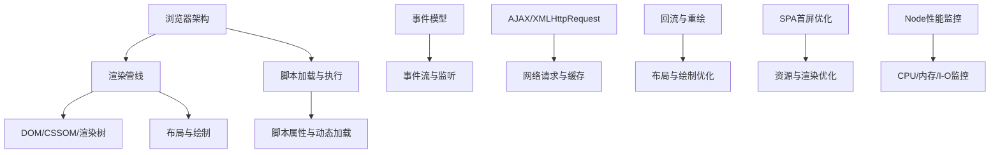
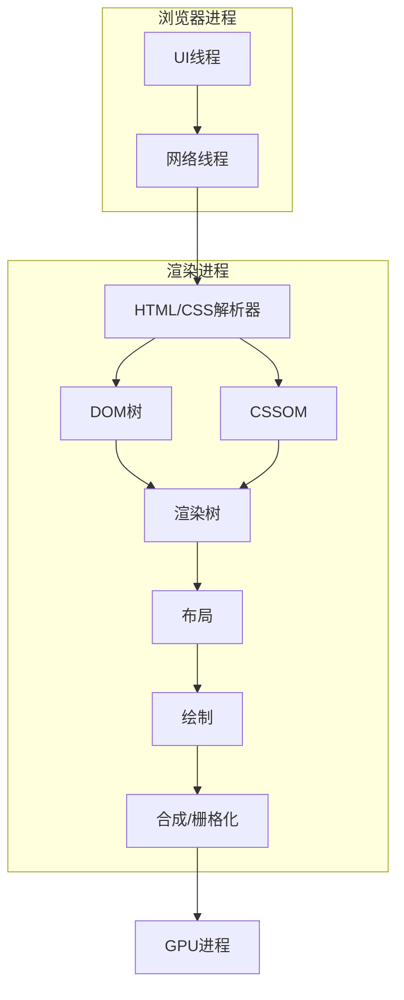
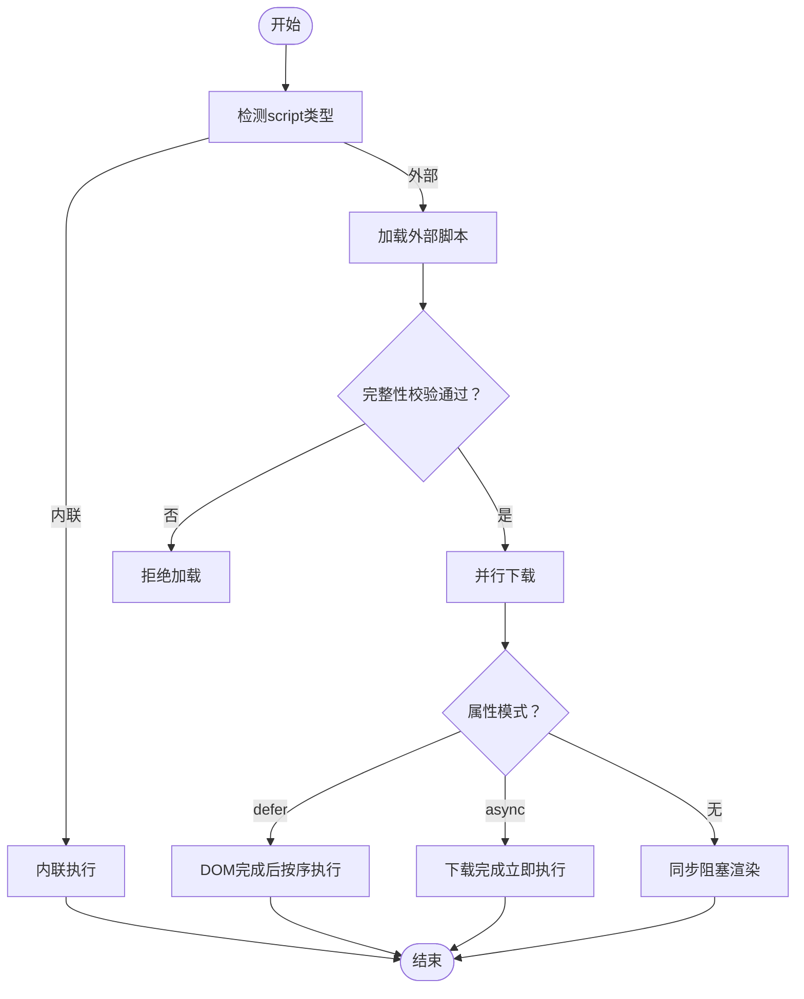
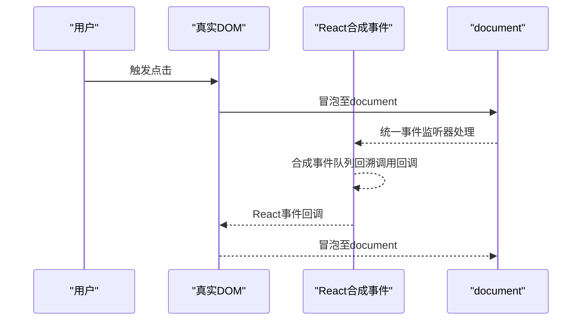
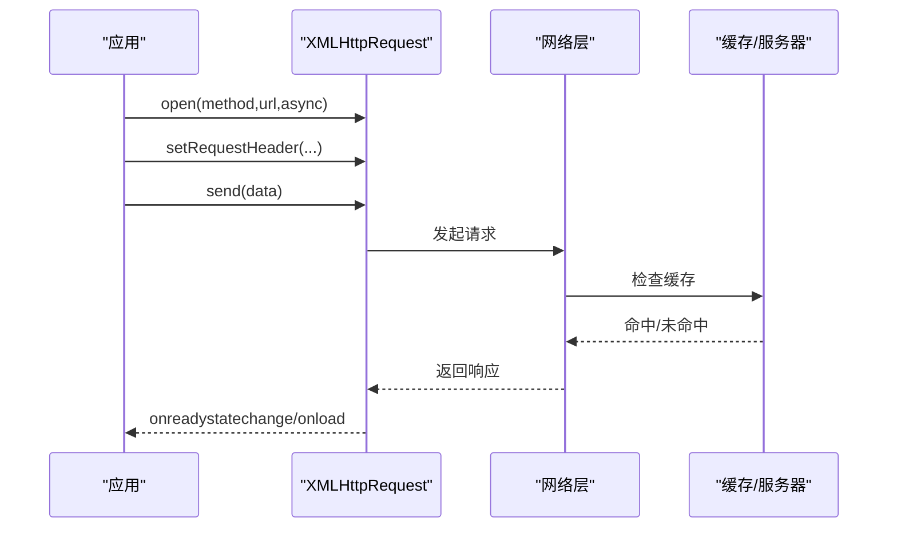
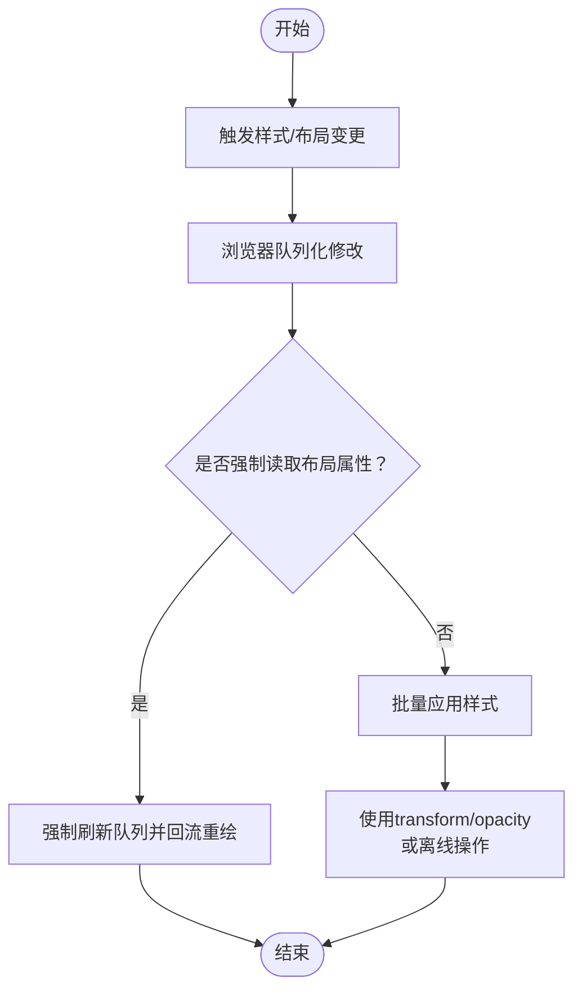
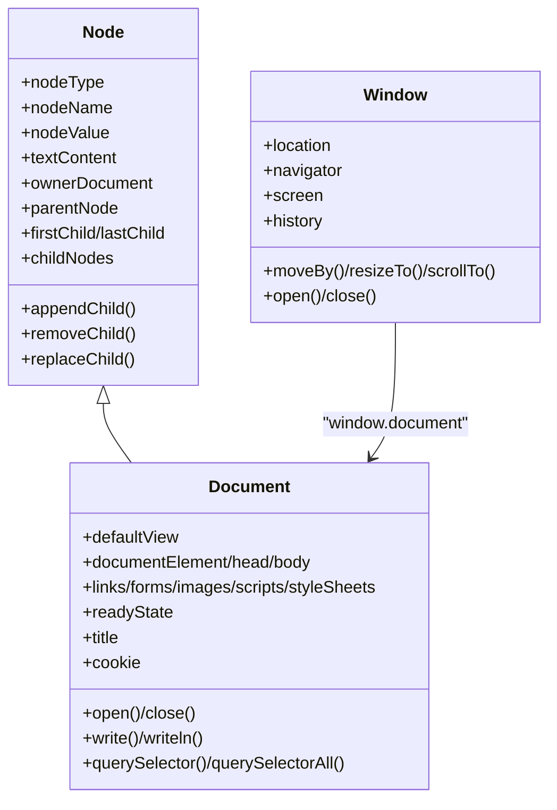
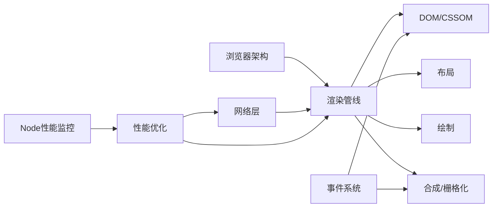

# 浏览器架构

<cite>
**本文引用的文件**
- [浏览器架构](file://docs/frontend-base/browser/architecture.md)
- [DOM](file://docs/frontend-base/javascript/dom.md)
- [事件](file://docs/frontend-base/javascript/event.md)
- [BOM](file://docs/interview/JavaScript/BOM.md)
- [SyntheticEvent](file://docs/interview/React/SyntheticEvent.md)
- [AJAX](file://docs/frontend-base/javascript/ajax.md)
- [数组API](file://docs/interview/JavaScript/array_api.md)
- [回流与重绘](file://docs/interview/css/layout_painting.md)
- [Node性能监控与优化](file://docs/interview/node/performance.md)
- [SPA首屏加载优化](file://docs/interview/vue/first_page_time.md)
</cite>

## 目录
1. [引言](#引言)
2. [项目结构](#项目结构)
3. [核心组件](#核心组件)
4. [架构总览](#架构总览)
5. [详细组件分析](#详细组件分析)
6. [依赖分析](#依赖分析)
7. [性能考量](#性能考量)
8. [故障排查指南](#故障排查指南)
9. [结论](#结论)
10. [附录](#附录)

## 引言
本技术文档围绕浏览器工作原理展开，系统梳理浏览器内核架构、页面渲染流程、JavaScript 引擎、网络请求处理等核心机制，并结合仓库中的前端基础与面试知识点，提供页面加载优化、性能监控、内存管理、跨浏览器兼容性与性能优化策略的实践指导。文档同时给出浏览器开发者工具的使用要点，帮助理解网页运行时的行为特征。

## 项目结构
本仓库以 VuePress 文档为主，涵盖前端基础、面试题与性能优化相关内容。与浏览器工作原理直接相关的知识分布在以下主题：
- 浏览器架构与渲染管线
- DOM/事件/BOM 模型
- JavaScript 引擎与运行时
- 网络请求与缓存
- 回流与重绘
- SPA 首屏优化
- Node 性能监控与优化

图表来源
- [浏览器架构:267-366](file://docs/frontend-base/browser/architecture.md#L267-L366)
- [事件:1-80](file://docs/frontend-base/javascript/event.md#L1-L80)
- [AJAX:1-100](file://docs/frontend-base/javascript/ajax.md#L1-L100)
- [回流与重绘:1-70](file://docs/interview/css/layout_painting.md#L1-L70)
- [SPA首屏加载优化:1-60](file://docs/interview/vue/first_page_time.md#L1-L60)
- [Node性能监控与优化:1-60](file://docs/interview/node/performance.md#L1-L60)

章节来源
- [浏览器架构:267-366](file://docs/frontend-base/browser/architecture.md#L267-L366)
- [DOM:1-120](file://docs/frontend-base/javascript/dom.md#L1-L120)
- [事件:1-80](file://docs/frontend-base/javascript/event.md#L1-L80)
- [AJAX:1-100](file://docs/frontend-base/javascript/ajax.md#L1-L100)
- [回流与重绘:1-70](file://docs/interview/css/layout_painting.md#L1-L70)
- [SPA首屏加载优化:1-60](file://docs/interview/vue/first_page_time.md#L1-L60)
- [Node性能监控与优化:1-60](file://docs/interview/node/performance.md#L1-L60)

## 核心组件
- 浏览器进程与渲染进程：多进程架构，隔离渲染与网络、GPU 等职责，提升稳定性与安全性。
- 渲染引擎：解析 HTML/CSS，生成 DOM/CSSOM，合成渲染树，执行布局与绘制。
- JavaScript 引擎：解释/编译执行 JS，现代浏览器采用 JIT 优化与虚拟机运行时。
- 事件系统：DOM 事件模型、事件流、合成事件（React）。
- 网络层：XHR/请求生命周期、缓存策略、跨域与超时。
- 性能监控：CPU/内存/I-O 指标采集与可视化。

章节来源
- [浏览器架构:269-300](file://docs/frontend-base/browser/architecture.md#L269-L300)
- [DOM:485-580](file://docs/frontend-base/javascript/dom.md#L485-L580)
- [事件:48-120](file://docs/frontend-base/javascript/event.md#L48-L120)
- [AJAX:54-120](file://docs/frontend-base/javascript/ajax.md#L54-L120)
- [Node性能监控与优化:15-60](file://docs/interview/node/performance.md#L15-L60)

## 架构总览
浏览器以多进程架构组织，渲染进程负责页面渲染与 JS 执行，浏览器进程负责 UI 与导航，网络进程负责资源获取与安全校验，GPU 进程负责图形加速。渲染管线包括：HTML/CSS 解析、DOM/CSSOM 构建、渲染树合成、布局、绘制与合成栅格化。

图表来源
- [浏览器架构:301-366](file://docs/frontend-base/browser/architecture.md#L301-L366)

章节来源
- [浏览器架构:301-366](file://docs/frontend-base/browser/architecture.md#L301-L366)

## 详细组件分析

### 组件A：脚本加载与执行（defer/async/动态加载）
- script 元素嵌入与外部脚本加载、字符集与完整性校验。
- defer：DOM 解析完成后按顺序执行，避免阻塞渲染。
- async：并行下载，下载完成暂停解析执行，可能破坏执行顺序。
- 动态加载：createElement + appendChild，可设置 async=false 保证顺序。
- 回调与错误处理：onload/onerror。

图表来源
- [浏览器架构:137-183](file://docs/frontend-base/browser/architecture.md#L137-L183)
- [浏览器架构:184-244](file://docs/frontend-base/browser/architecture.md#L184-L244)

章节来源
- [浏览器架构:137-183](file://docs/frontend-base/browser/architecture.md#L137-L183)
- [浏览器架构:184-244](file://docs/frontend-base/browser/architecture.md#L184-L244)

### 组件B：事件系统（事件流与合成事件）
- 事件流：捕获阶段 → 目标阶段 → 冒泡阶段。
- DOM2 事件监听：addEventListener（支持捕获/冒泡、一次性监听、被动监听）。
- React 合成事件：统一挂载在 document，先原生事件后合成事件，stopPropagation 与 stopImmediatePropagation 的区别。

图表来源
- [事件:1-80](file://docs/frontend-base/javascript/event.md#L1-L80)
- [SyntheticEvent:59-128](file://docs/interview/React/SyntheticEvent.md#L59-L128)

章节来源
- [事件:1-80](file://docs/frontend-base/javascript/event.md#L1-L80)
- [SyntheticEvent:59-128](file://docs/interview/React/SyntheticEvent.md#L59-L128)

### 组件C：网络请求与缓存（XHR/缓存策略）
- XHR 生命周期：readyState 变化、onload/error/abort/loadend、超时与 withCredentials。
- 响应类型：text/json/blob/arraybuffer/document，响应头与状态码处理。
- 缓存策略：Cache-Control/ETag/Last-Modified、Service Worker、GZip 压缩。

图表来源
- [AJAX:54-120](file://docs/frontend-base/javascript/ajax.md#L54-L120)
- [SPA首屏加载优化:82-92](file://docs/interview/vue/first_page_time.md#L82-L92)

章节来源
- [AJAX:54-120](file://docs/frontend-base/javascript/ajax.md#L54-L120)
- [SPA首屏加载优化:82-92](file://docs/interview/vue/first_page_time.md#L82-L92)

### 组件D：回流与重绘（布局与绘制优化）
- 回流：布局计算，触发时机包括 DOM 结构变化、尺寸/位置变化、视口变化、读取布局属性。
- 重绘：样式变化但不改变几何属性，颜色/阴影等。
- 优化策略：分离读写、批量修改样式、使用 transform/opacity 硬件加速、避免 table/iframe、离线操作。

图表来源
- [回流与重绘:64-120](file://docs/interview/css/layout_painting.md#L64-L120)

章节来源
- [回流与重绘:64-120](file://docs/interview/css/layout_painting.md#L64-L120)

### 组件E：DOM 模型与 BOM 对象
- DOM：Node 接口、节点关系、NodeList/HTMLCollection、document 对象与属性。
- BOM：window、location、navigator、screen、history，窗口控制与 URL 操作。

图表来源
- [DOM:1-120](file://docs/frontend-base/javascript/dom.md#L1-L120)
- [DOM:485-790](file://docs/frontend-base/javascript/dom.md#L485-L790)
- [BOM:13-127](file://docs/interview/JavaScript/BOM.md#L13-L127)

章节来源
- [DOM:1-120](file://docs/frontend-base/javascript/dom.md#L1-L120)
- [DOM:485-790](file://docs/frontend-base/javascript/dom.md#L485-L790)
- [BOM:13-127](file://docs/interview/JavaScript/BOM.md#L13-L127)

### 组件F：JavaScript 引擎与运行时
- 解释/编译：词法/语法分析、字节码、JIT 编译与缓存（inline cache）。
- 虚拟机：运行时环境，现代浏览器普遍采用 JIT 优化。

章节来源
- [浏览器架构:388-406](file://docs/frontend-base/browser/architecture.md#L388-L406)

### 组件G：SPA 首屏优化
- 首屏时间：FCP 计算与 timing API。
- 优化手段：路由懒加载、静态资源缓存、UI 框架按需加载、图片压缩、GZip 压缩、SSR。

章节来源
- [SPA首屏加载优化:12-60](file://docs/interview/vue/first_page_time.md#L12-L60)
- [SPA首屏加载优化:62-170](file://docs/interview/vue/first_page_time.md#L62-L170)

### 组件H：Node 性能监控与优化
- 指标：CPU 负载/使用率、内存占用（rss/heapUsed/heapTotal）、I/O。
- 监控：Easy-Monitor 2.0。
- 优化：使用最新 Node、正确使用流、合并查询、内存池与对象池。

章节来源
- [Node性能监控与优化:15-60](file://docs/interview/node/performance.md#L15-L60)
- [Node性能监控与优化:72-130](file://docs/interview/node/performance.md#L72-L130)
- [Node性能监控与优化:137-192](file://docs/interview/node/performance.md#L137-L192)

## 依赖分析
- 浏览器架构与渲染管线：依赖 DOM/CSSOM/渲染树、布局/绘制/合成。
- 事件系统：依赖 DOM 事件模型与 React 合成事件。
- 网络层：依赖 XHR 生命周期与缓存策略。
- 性能优化：依赖回流/重绘优化、SPA 首屏优化、Node 性能监控。

图表来源
- [浏览器架构:301-366](file://docs/frontend-base/browser/architecture.md#L301-L366)
- [事件:1-80](file://docs/frontend-base/javascript/event.md#L1-L80)
- [AJAX:54-120](file://docs/frontend-base/javascript/ajax.md#L54-L120)
- [回流与重绘:64-120](file://docs/interview/css/layout_painting.md#L64-L120)
- [SPA首屏加载优化:62-170](file://docs/interview/vue/first_page_time.md#L62-L170)
- [Node性能监控与优化:72-130](file://docs/interview/node/performance.md#L72-L130)

章节来源
- [浏览器架构:301-366](file://docs/frontend-base/browser/architecture.md#L301-L366)
- [事件:1-80](file://docs/frontend-base/javascript/event.md#L1-L80)
- [AJAX:54-120](file://docs/frontend-base/javascript/ajax.md#L54-L120)
- [回流与重绘:64-120](file://docs/interview/css/layout_painting.md#L64-L120)
- [SPA首屏加载优化:62-170](file://docs/interview/vue/first_page_time.md#L62-L170)
- [Node性能监控与优化:72-130](file://docs/interview/node/performance.md#L72-L130)

## 性能考量
- 渲染性能
  - 使用 transform/opacity 等避免回流重绘。
  - 避免 table 布局与 iframe，减少布局复杂度。
  - 离线操作与批量 DOM 修改。
- 网络性能
  - 启用 GZip 压缩、Service Worker 缓存、合理的 Cache-Control。
  - 资源按需加载与懒加载。
- 运行时性能
  - 合理使用事件监听与被动监听，避免阻塞主线程。
  - React 合成事件与原生事件的冒泡与阻止策略。
- 监控与优化
  - 使用性能 API（performance.timing、FCP）与 Node 监控工具（Easy-Monitor）。
  - 内存池与对象池减少 GC 压力。

章节来源
- [回流与重绘:72-170](file://docs/interview/css/layout_painting.md#L72-L170)
- [SPA首屏加载优化:138-170](file://docs/interview/vue/first_page_time.md#L138-L170)
- [Node性能监控与优化:72-192](file://docs/interview/node/performance.md#L72-L192)
- [SyntheticEvent:124-149](file://docs/interview/React/SyntheticEvent.md#L124-L149)

## 故障排查指南
- 页面渲染阻塞
  - 检查 script 是否使用 defer/async，避免同步脚本阻塞。
  - 使用动态加载与回调错误处理。
- 事件冒泡与阻止
  - 明确 React 合成事件与原生事件的阻止方式。
  - 使用 stopPropagation 与 stopImmediatePropagation 区分阶段。
- 网络请求异常
  - 检查 readyState/status/headers，设置 withCredentials 与超时。
  - 使用 Navigator.sendBeacon 确保卸载时上报。
- 性能瓶颈定位
  - 使用性能 API 获取首屏时间与关键指标。
  - Node 端使用 Easy-Monitor 采集 CPU/内存/I-O。

章节来源
- [浏览器架构:137-183](file://docs/frontend-base/browser/architecture.md#L137-L183)
- [SyntheticEvent:124-149](file://docs/interview/React/SyntheticEvent.md#L124-L149)
- [AJAX:178-240](file://docs/frontend-base/javascript/ajax.md#L178-L240)
- [SPA首屏加载优化:12-35](file://docs/interview/vue/first_page_time.md#L12-L35)
- [Node性能监控与优化:72-130](file://docs/interview/node/performance.md#L72-L130)

## 结论
浏览器工作原理涉及多进程架构、渲染管线、事件系统与网络层等多个维度。通过理解脚本加载策略、事件流与合成事件、回流重绘机制、网络请求与缓存、以及性能监控与优化手段，可以系统性地提升页面加载速度与运行时表现。结合仓库中的前端基础与面试知识点，能够更好地在工程实践中落地性能优化与跨浏览器兼容策略。

## 附录
- 开发者工具使用要点
  - Performance 面板：记录渲染、脚本与网络事件，分析首屏与交互性能。
  - Network 面板：查看请求耗时、缓存命中、压缩效果与跨域策略。
  - Memory 面板：采样堆快照，定位内存泄漏与 GC 抖动。
- 常用 API 与概念
  - DOM：Node 接口、NodeList/HTMLCollection、document 对象。
  - 事件：addEventListener、事件流、合成事件。
  - 网络：XMLHttpRequest、fetch、Service Worker、缓存头。
  - 性能：FCP、LCP、CLS、TTFB、CPU/内存/I-O 指标。