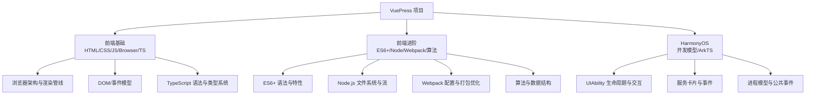
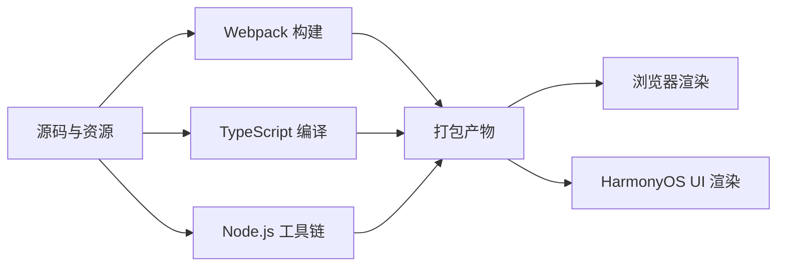
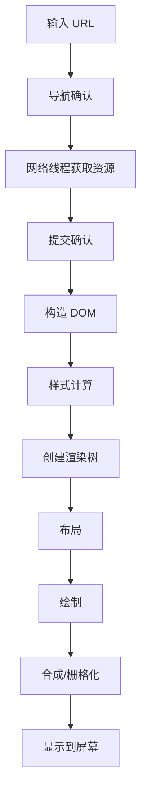
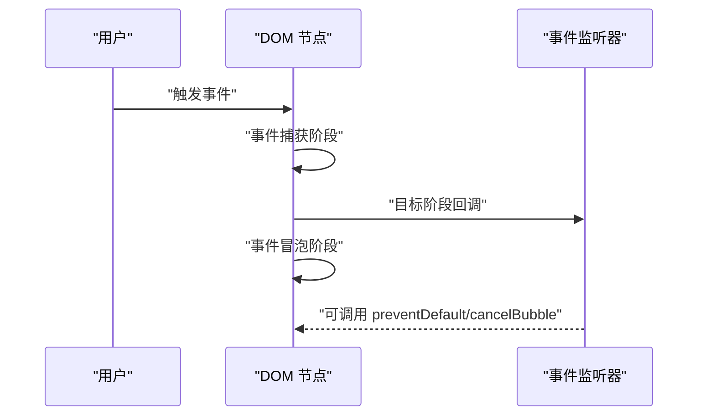
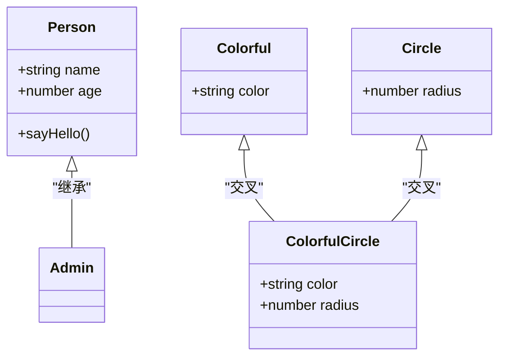
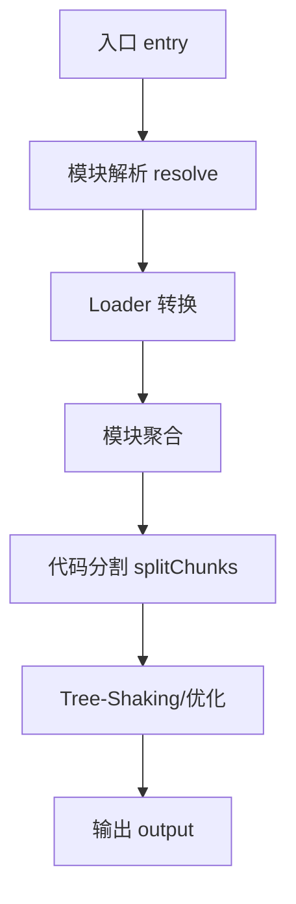
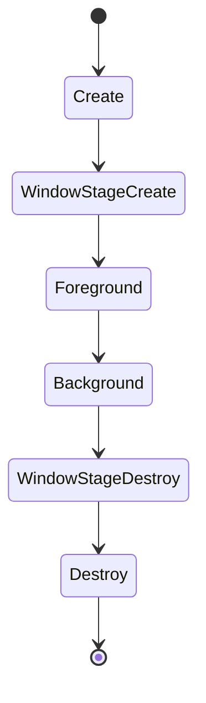
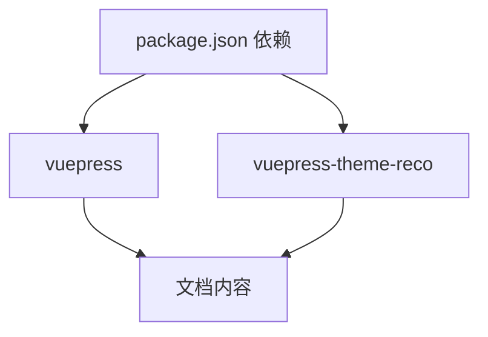

# 前端开发

<cite>
**本文引用的文件**
- [README.md](file://README.md)
- [package.json](file://package.json)
- [browser/architecture.md](file://docs/frontend-base/browser/architecture.md)
- [typescript/grammar.md](file://docs/frontend-base/typescript/grammar.md)
- [es6/grammar.md](file://docs/frontend-advanced/es6/grammar.md)
- [webpack/config.md](file://docs/frontend-advanced/webpack/config.md)
- [javascript/dom.md](file://docs/frontend-base/javascript/dom.md)
- [javascript/event.md](file://docs/frontend-base/javascript/event.md)
- [node/fs.md](file://docs/frontend-advanced/node/fs.md)
- [harmony-os/develop/develop.md](file://docs/harmony-os/develop/develop.md)
- [harmony-os/grammar/grammar.md](file://docs/harmony-os/grammar/grammar.md)
- [algorithm/Algorithm.md](file://docs/frontend-advanced/algorithm/Algorithm.md)
</cite>

## 目录
1. [简介](#简介)
2. [项目结构](#项目结构)
3. [核心组件](#核心组件)
4. [架构总览](#架构总览)
5. [详细组件分析](#详细组件分析)
6. [依赖分析](#依赖分析)
7. [性能考量](#性能考量)
8. [故障排查指南](#故障排查指南)
9. [结论](#结论)
10. [附录](#附录)

## 简介
本学习文档面向不同层次的前端开发者，系统梳理前端基础技术（HTML、CSS、JavaScript、浏览器原理、TypeScript）与进阶技术（ES6+、Node.js、Webpack、算法实现），并补充跨平台开发（HarmonyOS）相关内容。文档强调“理论与实践结合”，通过结构化的知识图谱、可视化图表与循序渐进的学习路径，帮助读者建立完整的前端知识体系与工程化能力。

## 项目结构
本仓库以 VuePress 文档站点组织前端知识，采用“主题 + 内容”的结构：
- 主题与构建：VuePress 2.x + 主题，提供开发与构建脚本
- 内容组织：按“前端基础”“前端进阶”“HarmonyOS”三大板块组织，覆盖浏览器原理、TypeScript、ES6、Node.js、Webpack、算法、DOM/事件、HarmonyOS 开发与 ArkTS 语法等

**图表来源**
- [package.json:1-17](file://package.json#L1-L17)
- [README.md:1-12](file://README.md#L1-L12)

**章节来源**
- [package.json:1-17](file://package.json#L1-L17)
- [README.md:1-12](file://README.md#L1-L12)

## 核心组件
- 浏览器架构与渲染管线：从输入 URL 到页面渲染的完整流程，涵盖多进程架构、样式计算、布局、绘制与合成等阶段
- DOM/事件模型：节点类型、关系与操作，事件流（捕获/冒泡）、事件监听与触发
- TypeScript：类型系统、接口、泛型、装饰器、类与模块化
- ES6+：变量声明、解构、箭头函数、模块、Promise、Proxy、Symbol 等
- Node.js：文件系统、流、权限与状态
- Webpack：入口/输出、解析规则、Loader/Plugin、代码分割与 Tree-Shaking
- 算法与数据结构：算法特性、常见数据结构与典型应用
- HarmonyOS：UIAbility 生命周期、组件间交互、服务卡片、进程模型与公共事件

**章节来源**
- [browser/architecture.md:267-446](file://docs/frontend-base/browser/architecture.md#L267-L446)
- [javascript/dom.md:1-200](file://docs/frontend-base/javascript/dom.md#L1-L200)
- [javascript/event.md:1-120](file://docs/frontend-base/javascript/event.md#L1-L120)
- [typescript/grammar.md:1-120](file://docs/frontend-base/typescript/grammar.md#L1-L120)
- [es6/grammar.md:1-120](file://docs/frontend-advanced/es6/grammar.md#L1-L120)
- [node/fs.md:1-120](file://docs/frontend-advanced/node/fs.md#L1-L120)
- [webpack/config.md:1-120](file://docs/frontend-advanced/webpack/config.md#L1-L120)
- [algorithm/Algorithm.md:1-60](file://docs/frontend-advanced/algorithm/Algorithm.md#L1-L60)
- [harmony-os/develop/develop.md:1-120](file://docs/harmony-os/develop/develop.md#L1-L120)
- [harmony-os/grammar/grammar.md:1-120](file://docs/harmony-os/grammar/grammar.md#L1-L120)

## 架构总览
前端技术栈的“输入—处理—输出”架构如下：
- 输入：HTML/CSS/JS/TS 源码与资源
- 处理：Webpack 构建、TypeScript 编译、Node.js 工具链
- 输出：浏览器渲染、HarmonyOS UI 渲染与卡片

**图表来源**
- [webpack/config.md:1-120](file://docs/frontend-advanced/webpack/config.md#L1-L120)
- [typescript/grammar.md:1-120](file://docs/frontend-base/typescript/grammar.md#L1-L120)
- [node/fs.md:1-120](file://docs/frontend-advanced/node/fs.md#L1-L120)
- [harmony-os/develop/develop.md:1-120](file://docs/harmony-os/develop/develop.md#L1-L120)

## 详细组件分析

### 浏览器架构与渲染管线
- 多进程架构：浏览器进程、渲染进程、GPU 进程、插件进程
- 输入 URL 到渲染：导航确认 → 数据获取 → 提交确认 → 构造 DOM → 样式计算 → 创建渲染树 → 布局 → 绘制 → 合成
- JavaScript 引擎与 JIT：字节码与即时编译
- 回流与重绘：优化策略（避免频繁 DOM/样式操作、使用 transform、开启硬件加速）

**图表来源**
- [browser/architecture.md:301-366](file://docs/frontend-base/browser/architecture.md#L301-L366)

**章节来源**
- [browser/architecture.md:267-446](file://docs/frontend-base/browser/architecture.md#L267-L446)

### DOM/事件模型
- 节点类型与关系：Node/Element/Attr/Text/DocumentFragment/DocumentType/Comment
- 节点操作：appendChild/removeChild/replaceChild/cloneNode/contains
- 事件流：捕获阶段、目标阶段、冒泡阶段；addEventListener/removeEventListener/dispatchEvent
- 事件对象：鼠标、键盘、触摸、拖拽、DataTransfer

**图表来源**
- [javascript/event.md:1-120](file://docs/frontend-base/javascript/event.md#L1-L120)

**章节来源**
- [javascript/dom.md:1-200](file://docs/frontend-base/javascript/dom.md#L1-L200)
- [javascript/event.md:1-200](file://docs/frontend-base/javascript/event.md#L1-L200)

### TypeScript 类型系统
- 基本类型：null/undefined/number/boolean/string/array/tuple
- 联合/交叉类型、字面量类型、类型断言、非空断言
- 接口与类：属性修饰符、索引签名、接口扩展、泛型接口
- 函数：参数、可选/默认/剩余参数、函数重载、泛型函数
- 装饰器：类装饰器、方法/属性/参数装饰器与组合

**图表来源**
- [typescript/grammar.md:200-420](file://docs/frontend-base/typescript/grammar.md#L200-L420)

**章节来源**
- [typescript/grammar.md:1-200](file://docs/frontend-base/typescript/grammar.md#L1-L200)

### ES6+ 语法与特性
- 变量声明：let/const、暂时性死区、不允许重复声明
- 解构：数组/对象解构、默认值、剩余/展开
- 函数：箭头函数、默认参数、函数重载（TS）
- 模块：import/export、动态 import
- Promise/Await、Proxy、Symbol、迭代器、Set/Map、WeakMap/WeakSet
- 类：构造函数、静态方法、继承、私有属性（#）

**章节来源**
- [es6/grammar.md:1-200](file://docs/frontend-advanced/es6/grammar.md#L1-L200)

### Node.js 文件系统与流
- 文件操作：appendFile/writeFile/readFile/copyFile/truncate
- 目录操作：mkdir/mkdtemp/readdir/cp/rmdir
- 链接操作：link/readlink/symlink/unlink
- 共有方法：rm/rename/watch
- 创建流：createReadStream/createWriteStream
- 文件状态：chmod/open/close/stat/access/chown

**章节来源**
- [node/fs.md:1-200](file://docs/frontend-advanced/node/fs.md#L1-L200)

### Webpack 配置与打包优化
- 入口与输出：entry/output、filename/chunkFilename、publicPath、clean
- 解析规则：resolve.alias/extensions/mainFields/modules 等
- Loader/Parser：css/less/scss/image/font/json/csv 等资源处理
- 优化：Tree-Shaking、usedExports、sideEffects、splitChunks、runtimeChunk、minimizer
- 环境变量与模式：--env/--mode、DefinePlugin、NODE_ENV
- 开发体验：devServer、热更新、source-map

**图表来源**
- [webpack/config.md:1-200](file://docs/frontend-advanced/webpack/config.md#L1-L200)

**章节来源**
- [webpack/config.md:1-200](file://docs/frontend-advanced/webpack/config.md#L1-L200)

### 算法与数据结构
- 算法特性：有穷性、确切性、输入、输出、可行性
- 数据结构与算法关系：算法依赖数据结构实现，二者不可分割
- 典型应用：虚拟 DOM/Vue/React 的 diff、AST 转换、前缀树、最小编辑距离

**章节来源**
- [algorithm/Algorithm.md:1-60](file://docs/frontend-advanced/algorithm/Algorithm.md#L1-L60)

### HarmonyOS 开发与 ArkTS 语法
- 开发模型：Stage 模型、UIAbility 生命周期（Create/Foreground/Background/Destroy）
- 组件与页面：@Entry/@Component/@State/@Prop/@Link/@Provide/@Consume 等
- 服务卡片：FormExtensionAbility 生命周期、事件（router/message/call）
- 进程模型与公共事件：CES 动态订阅/取消订阅/发布

**图表来源**
- [harmony-os/develop/develop.md:15-60](file://docs/harmony-os/develop/develop.md#L15-L60)

**章节来源**
- [harmony-os/develop/develop.md:1-120](file://docs/harmony-os/develop/develop.md#L1-L120)
- [harmony-os/grammar/grammar.md:1-120](file://docs/harmony-os/grammar/grammar.md#L1-L120)

## 依赖分析
- 构建与运行：VuePress 2.x 与主题依赖
- 内容组织：按“前端基础/前端进阶/HarmonyOS”划分，便于学习路径与知识检索
- 工具链：Webpack/TypeScript/Node.js 形成前端工程化闭环

**图表来源**
- [package.json:13-16](file://package.json#L13-L16)

**章节来源**
- [package.json:1-17](file://package.json#L1-L17)

## 性能考量
- 浏览器渲染性能：减少回流/重绘、使用 transform、开启硬件加速、合理布局（避免 table/flex 高成本）
- 构建性能：最小化 Loader、合理 resolve 配置、Tree-Shaking、splitChunks、worker 池
- Node.js：流式读写、AbortSignal 中止、权限与状态检查

**章节来源**
- [browser/architecture.md:407-446](file://docs/frontend-base/browser/architecture.md#L407-L446)
- [webpack/config.md:638-700](file://docs/frontend-advanced/webpack/config.md#L638-L700)
- [node/fs.md:296-350](file://docs/frontend-advanced/node/fs.md#L296-L350)

## 故障排查指南
- 浏览器渲染问题：检查样式计算与布局、避免频繁 DOM/样式读取、确认 GPU 加速与合成层
- Webpack 构建问题：核对入口/输出配置、resolve 解析顺序、Loader 顺序与参数、sideEffects 与 Tree-Shaking
- Node.js 文件系统：确认权限与模式、文件描述符与路径、watch 信号与中止
- HarmonyOS 事件与生命周期：确认 UIAbility 生命周期回调、事件订阅/退订、卡片事件类型与参数

**章节来源**
- [browser/architecture.md:407-446](file://docs/frontend-base/browser/architecture.md#L407-L446)
- [webpack/config.md:638-800](file://docs/frontend-advanced/webpack/config.md#L638-L800)
- [node/fs.md:296-448](file://docs/frontend-advanced/node/fs.md#L296-L448)
- [harmony-os/develop/develop.md:700-800](file://docs/harmony-os/develop/develop.md#L700-L800)

## 结论
本学习文档以“知识图谱 + 工程化实践 + 跨平台扩展”为主线，帮助读者从浏览器原理、DOM/事件、TypeScript、ES6+，到 Node.js、Webpack、算法与 HarmonyOS 开发，构建系统化、可迁移的前端能力。建议按“基础—进阶—工程—扩展”的路径推进，并结合仓库中的示例与配置文件进行实操训练。

## 附录
- 学习路径建议
  - 初学者：HTML/CSS/JavaScript 基础 → 浏览器原理 → DOM/事件 → TypeScript
  - 进阶者：ES6+/模块化 → Node.js → Webpack → 算法与数据结构
  - 工程化：构建优化、性能优化、CI/CD
  - 跨平台：HarmonyOS 开发与 ArkTS 语法
- 实践建议：以仓库现有文档为“参考手册”，结合示例文件与配置进行动手实验，逐步形成“理论—实践—优化”的闭环