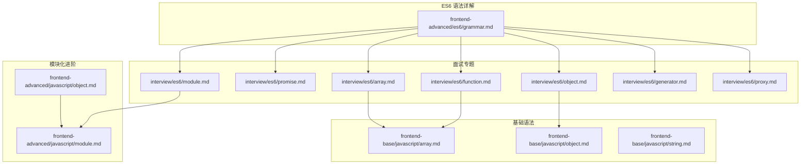
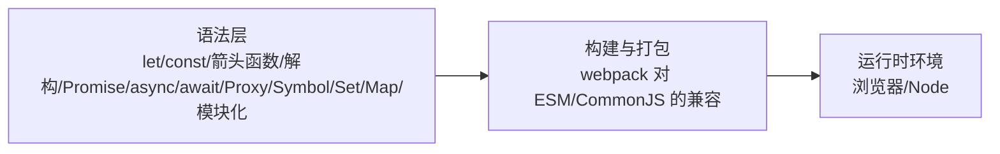
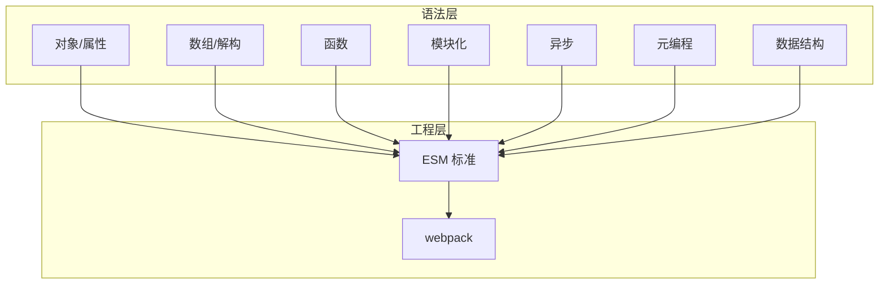

# ES6+ 语法特性

<cite>
**本文引用的文件**
- [docs/frontend-advanced/es6/grammar.md](file://docs/frontend-advanced/es6/grammar.md)
- [docs/interview/es6/function.md](file://docs/interview/es6/function.md)
- [docs/interview/es6/promise.md](file://docs/interview/es6/promise.md)
- [docs/interview/es6/module.md](file://docs/interview/es6/module.md)
- [docs/interview/es6/object.md](file://docs/interview/es6/object.md)
- [docs/interview/es6/array.md](file://docs/interview/es6/array.md)
- [docs/interview/es6/generator.md](file://docs/interview/es6/generator.md)
- [docs/interview/es6/proxy.md](file://docs/interview/es6/proxy.md)
- [docs/frontend-base/javascript/array.md](file://docs/frontend-base/javascript/array.md)
- [docs/frontend-base/javascript/object.md](file://docs/frontend-base/javascript/object.md)
- [docs/frontend-base/javascript/string.md](file://docs/frontend-base/javascript/string.md)
- [docs/frontend-advanced/javascript/module.md](file://docs/frontend-advanced/javascript/module.md)
- [docs/frontend-advanced/javascript/object.md](file://docs/frontend-advanced/javascript/object.md)
</cite>

## 目录
1. [简介](#简介)
2. [项目结构](#项目结构)
3. [核心特性总览](#核心特性总览)
4. [架构概览](#架构概览)
5. [详细特性解析](#详细特性解析)
6. [依赖关系分析](#依赖关系分析)
7. [性能考量](#性能考量)
8. [故障排查指南](#故障排查指南)
9. [结论](#结论)
10. [附录](#附录)

## 简介
本学习文档围绕 ES6+ 现代 JavaScript 语法特性，系统梳理箭头函数、模板字符串、解构赋值、类继承、模块化、Promise、async/await、Symbol、Set/Map 等关键能力。文档以仓库现有资料为基础，结合语法说明、使用场景、最佳实践与迁移建议，帮助读者从 ES5 平滑过渡到 ES6+，并掌握性能优化要点。

## 项目结构
本仓库包含大量前端知识与面试题资源，其中与 ES6+ 语法密切相关的文档主要分布在：
- frontend-advanced/es6：ES6 语法详解（变量声明、数值扩展、Math 扩展、对象扩展等）
- interview/es6：函数、Promise、模块、对象、数组、Generator、Proxy 等专题
- frontend-base/javascript：基础语法（数组、对象、字符串）与 ES6 前后对比
- frontend-advanced/javascript：JS 模块化演进与实现

图表来源
- [docs/frontend-advanced/es6/grammar.md:1-10025](file://docs/frontend-advanced/es6/grammar.md#L1-L10025)
- [docs/interview/es6/function.md:1-228](file://docs/interview/es6/function.md#L1-L228)
- [docs/interview/es6/promise.md:1-388](file://docs/interview/es6/promise.md#L1-L388)
- [docs/interview/es6/module.md:1-314](file://docs/interview/es6/module.md#L1-L314)
- [docs/interview/es6/object.md:1-306](file://docs/interview/es6/object.md#L1-L306)
- [docs/interview/es6/array.md:1-354](file://docs/interview/es6/array.md#L1-L354)
- [docs/interview/es6/generator.md:1-305](file://docs/interview/es6/generator.md#L1-L305)
- [docs/interview/es6/proxy.md:1-318](file://docs/interview/es6/proxy.md#L1-L318)
- [docs/frontend-base/javascript/array.md:1-550](file://docs/frontend-base/javascript/array.md#L1-L550)
- [docs/frontend-base/javascript/object.md:1-772](file://docs/frontend-base/javascript/object.md#L1-L772)
- [docs/frontend-base/javascript/string.md:1-397](file://docs/frontend-base/javascript/string.md#L1-L397)
- [docs/frontend-advanced/javascript/module.md:1-337](file://docs/frontend-advanced/javascript/module.md#L1-L337)
- [docs/frontend-advanced/javascript/object.md:1-384](file://docs/frontend-advanced/javascript/object.md#L1-L384)

章节来源
- [docs/frontend-advanced/es6/grammar.md:1-10025](file://docs/frontend-advanced/es6/grammar.md#L1-L10025)
- [docs/interview/es6/function.md:1-228](file://docs/interview/es6/function.md#L1-L228)
- [docs/interview/es6/promise.md:1-388](file://docs/interview/es6/promise.md#L1-L388)
- [docs/interview/es6/module.md:1-314](file://docs/interview/es6/module.md#L1-L314)
- [docs/interview/es6/object.md:1-306](file://docs/interview/es6/object.md#L1-L306)
- [docs/interview/es6/array.md:1-354](file://docs/interview/es6/array.md#L1-L354)
- [docs/interview/es6/generator.md:1-305](file://docs/interview/es6/generator.md#L1-L305)
- [docs/interview/es6/proxy.md:1-318](file://docs/interview/es6/proxy.md#L1-L318)
- [docs/frontend-base/javascript/array.md:1-550](file://docs/frontend-base/javascript/array.md#L1-L550)
- [docs/frontend-base/javascript/object.md:1-772](file://docs/frontend-base/javascript/object.md#L1-L772)
- [docs/frontend-base/javascript/string.md:1-397](file://docs/frontend-base/javascript/string.md#L1-L397)
- [docs/frontend-advanced/javascript/module.md:1-337](file://docs/frontend-advanced/javascript/module.md#L1-L337)
- [docs/frontend-advanced/javascript/object.md:1-384](file://docs/frontend-advanced/javascript/object.md#L1-L384)

## 核心特性总览
- 变量声明与作用域：let/const、块级作用域、TDZ、顶层对象差异
- 数值与数学扩展：二进制/八进制、Number 系列方法、Math 扩展、安全整数
- 对象与属性：属性简写、属性名表达式、super、扩展运算符、对象方法
- 数组与解构：扩展运算符、Array.from/Array.of、实例方法、解构赋值
- 函数：参数默认值、解构默认值、rest 参数、箭头函数、严格模式限制
- 模块化：export/import、默认导出、命名导出、动态导入、复合写法
- 异步：Promise 链式、all/race/allSettled、async/await、Generator
- 元编程：Proxy 拦截、Reflect API
- 数据结构：Symbol、Set/Map（含 WeakMap/WeakSet）

章节来源
- [docs/frontend-advanced/es6/grammar.md:1-10025](file://docs/frontend-advanced/es6/grammar.md#L1-L10025)
- [docs/interview/es6/function.md:1-228](file://docs/interview/es6/function.md#L1-L228)
- [docs/interview/es6/promise.md:1-388](file://docs/interview/es6/promise.md#L1-L388)
- [docs/interview/es6/module.md:1-314](file://docs/interview/es6/module.md#L1-L314)
- [docs/interview/es6/object.md:1-306](file://docs/interview/es6/object.md#L1-L306)
- [docs/interview/es6/array.md:1-354](file://docs/interview/es6/array.md#L1-L354)
- [docs/interview/es6/generator.md:1-305](file://docs/interview/es6/generator.md#L1-L305)
- [docs/interview/es6/proxy.md:1-318](file://docs/interview/es6/proxy.md#L1-L318)

## 架构概览
ES6+ 语法特性在工程中的落地路径：
- 语法层：变量声明、函数、对象、数组、模块、异步
- 工程层：模块化（CommonJS/AMD/CMD/ESM）、打包（webpack 对 ESM/CommonJS 的兼容）
- 运行时层：Proxy/Reflect、Symbol/Set/Map、Promise/async/await/Generator

图表来源
- [docs/frontend-advanced/javascript/module.md:1-337](file://docs/frontend-advanced/javascript/module.md#L1-L337)
- [docs/interview/es6/module.md:1-314](file://docs/interview/es6/module.md#L1-L314)
- [docs/interview/es6/promise.md:1-388](file://docs/interview/es6/promise.md#L1-L388)
- [docs/interview/es6/generator.md:1-305](file://docs/interview/es6/generator.md#L1-L305)
- [docs/interview/es6/proxy.md:1-318](file://docs/interview/es6/proxy.md#L1-L318)

## 详细特性解析

### 变量声明与作用域（let/const/块级作用域）
- let/const 的块级作用域、暂时性死区（TDZ）、不可重复声明、不挂载到顶层对象
- 与 var 的差异：不存在变量提升、严格模式下的限制、与函数声明在块级作用域的差异
- 顶层对象差异：var/函数声明仍挂载顶层对象，let/const 不挂载

最佳实践
- 优先使用 const，仅在需要重新赋值时使用 let
- 避免在块级作用域内重复声明同名变量
- 注意 TDZ，确保在声明后再使用变量

章节来源
- [docs/frontend-advanced/es6/grammar.md:1-200](file://docs/frontend-advanced/es6/grammar.md#L1-L200)
- [docs/frontend-base/javascript/object.md:1-772](file://docs/frontend-base/javascript/object.md#L1-L772)

### 数值与数学扩展
- 二进制/八进制字面量、Number.isFinite/isNaN/parseInt/parseFloat/parseInt、Number.isInteger、Number.EPSILON、安全整数与 Number.isSafeInteger
- Math 扩展：trunc/sign/cbrt/clz32/imul/fround/hypot/expm1/log1p/log10/log2/sinh/cosh/tanh/asinh/acosh/atanh

最佳实践
- 使用 Number.isSafeInteger 判断计算安全性
- 使用 Number.EPSILON 进行浮点数误差判断
- 使用 Math.sign/ Math.trunc 等替代手动类型转换

章节来源
- [docs/frontend-advanced/es6/grammar.md:400-600](file://docs/frontend-advanced/es6/grammar.md#L400-L600)

### 对象与属性扩展
- 属性简写、方法简写、属性名表达式、super 关键字
- 扩展运算符在解构中的应用、浅拷贝与深拷贝注意事项
- 对象新增方法：Object.is/assign/getOwnPropertyDescriptors/setPrototypeOf/getPrototypeOf/keys/values/entries/fromEntries

最佳实践
- 使用属性简写与方法简写提升可读性
- 解构赋值配合扩展运算符时注意浅拷贝
- 使用 Object.assign 进行浅合并，必要时配合冻结/密封

章节来源
- [docs/interview/es6/object.md:1-306](file://docs/interview/es6/object.md#L1-L306)
- [docs/interview/es6/array.md:1-354](file://docs/interview/es6/array.md#L1-L354)

### 数组与解构
- 扩展运算符：数组复制、合并、与解构结合
- 构造函数新增：Array.from/Array.of
- 实例新增：copyWithin/find/findIndex/fill/entries/keys/values/includes/flat/flatMap
- 空位与排序稳定性

最佳实践
- 使用扩展运算符进行数组浅拷贝与拼接
- 使用 flat/flatMap 处理嵌套数组
- 使用 includes 替代 indexOf 判断存在性（支持 NaN）

章节来源
- [docs/interview/es6/array.md:1-354](file://docs/interview/es6/array.md#L1-L354)
- [docs/frontend-base/javascript/array.md:1-550](file://docs/frontend-base/javascript/array.md#L1-L550)

### 函数：参数默认值、解构默认值、rest、箭头函数
- 参数默认值与解构默认值、尾参数优先、作用域与严格模式限制
- 箭头函数：this 绑定、不可构造、不可使用 arguments/yield、返回对象需加括号

最佳实践
- 将默认值设为尾参数，避免跳过参数
- 箭头函数适合短小的纯函数，避免复杂逻辑
- 使用 rest 收集剩余参数，配合扩展运算符解构

章节来源
- [docs/interview/es6/function.md:1-228](file://docs/interview/es6/function.md#L1-L228)

### 模块化：export/import、动态导入、复合写法
- 导出：命名导出、默认导出、复合写法
- 导入：命名导入、批量导入、默认导入、动态导入 import()
- webpack 对 ESM/CommonJS 的兼容与依赖分析差异

最佳实践
- 优先使用命名导出，配合默认导出用于主入口
- 使用动态导入实现按需加载
- 在构建工具中启用 Tree Shaking，减少无用代码

章节来源
- [docs/interview/es6/module.md:1-314](file://docs/interview/es6/module.md#L1-L314)
- [docs/frontend-advanced/javascript/module.md:1-337](file://docs/frontend-advanced/javascript/module.md#L1-L337)

### 异步：Promise、async/await、Generator
- Promise：状态机、链式调用、all/race/allSettled/resolve/reject/try
- async/await：基于 Promise 的语法糖，简化异步链路
- Generator：yield 暂停、next 恢复、与异步结合（co/Redux-Saga）

最佳实践
- 使用 Promise.all 并行聚合，race 设置超时
- async/await 提升可读性，配合 try/catch 处理错误
- Generator 适合复杂流程控制与异步状态机

章节来源
- [docs/interview/es6/promise.md:1-388](file://docs/interview/es6/promise.md#L1-L388)
- [docs/interview/es6/generator.md:1-305](file://docs/interview/es6/generator.md#L1-L305)

### 元编程：Proxy 与 Reflect
- Proxy：get/set/has/deleteProperty/ownKeys/getOwnPropertyDescriptor/defineProperty/preventExtensions/getPrototypeOf/isExtensible/setPrototypeOf/apply/construct
- Reflect：与 Proxy 协同，提供对象默认行为的函数式接口

最佳实践
- 使用 Proxy 实现数据校验、私有属性保护、观察者模式
- 使用 Reflect 替代部分 Object API，获得更合理的行为

章节来源
- [docs/interview/es6/proxy.md:1-318](file://docs/interview/es6/proxy.md#L1-L318)

### 数据结构：Symbol、Set/Map
- Symbol：唯一标识符、内置 Symbol、作为属性名
- Set/Map：去重、键值对存储、WeakMap/WeakSet 弱引用

最佳实践
- 使用 Symbol 避免属性名冲突
- 使用 Set/Map 存储唯一值或键值映射，注意内存回收

章节来源
- [docs/interview/es6/object.md:1-306](file://docs/interview/es6/object.md#L1-L306)
- [docs/interview/es6/array.md:1-354](file://docs/interview/es6/array.md#L1-L354)

## 依赖关系分析
- 语法层依赖：对象/数组/函数/模块/异步/元编程共同构成 ES6+ 生态
- 工程层依赖：模块化标准（ESM）与打包工具（webpack）对依赖进行静态分析与优化
- 运行时依赖：Proxy/Reflect/Symbol/Set/Map 在不同环境下的支持度与垫片

图表来源
- [docs/interview/es6/module.md:1-314](file://docs/interview/es6/module.md#L1-L314)
- [docs/frontend-advanced/javascript/module.md:1-337](file://docs/frontend-advanced/javascript/module.md#L1-L337)

章节来源
- [docs/interview/es6/module.md:1-314](file://docs/interview/es6/module.md#L1-L314)
- [docs/frontend-advanced/javascript/module.md:1-337](file://docs/frontend-advanced/javascript/module.md#L1-L337)

## 性能考量
- 模块化与 Tree Shaking：ESM 的静态分析利于按需加载与无用代码剔除
- Promise 与 async/await：减少回调嵌套，提升可读性与调试体验
- Proxy/Reflect：拦截与反射带来灵活性，但需注意性能开销
- Set/Map：相比普通对象在大规模键值存储时具备更好性能
- 数组与解构：扩展运算符与 flat/flatMap 在大数据量时需谨慎使用

章节来源
- [docs/interview/es6/module.md:1-314](file://docs/interview/es6/module.md#L1-L314)
- [docs/interview/es6/promise.md:1-388](file://docs/interview/es6/promise.md#L1-L388)
- [docs/interview/es6/proxy.md:1-318](file://docs/interview/es6/proxy.md#L1-L318)
- [docs/interview/es6/array.md:1-354](file://docs/interview/es6/array.md#L1-L354)

## 故障排查指南
- TDZ 报错：在 let/const 声明前访问变量
- 严格模式限制：参数默认值/解构/扩展运算符与严格模式冲突
- Promise 链错误传播：使用 catch 捕获，避免静默失败
- Generator/async/await：注意与 Promise 的配合，避免阻塞主线程
- Proxy：不可配置/不可写属性的拦截与赋值异常
- Symbol：属性名冲突与遍历问题

章节来源
- [docs/frontend-advanced/es6/grammar.md:1-200](file://docs/frontend-advanced/es6/grammar.md#L1-L200)
- [docs/interview/es6/function.md:1-228](file://docs/interview/es6/function.md#L1-L228)
- [docs/interview/es6/promise.md:1-388](file://docs/interview/es6/promise.md#L1-L388)
- [docs/interview/es6/generator.md:1-305](file://docs/interview/es6/generator.md#L1-L305)
- [docs/interview/es6/proxy.md:1-318](file://docs/interview/es6/proxy.md#L1-L318)

## 结论
ES6+ 语法特性显著提升了 JavaScript 的表达力与工程化能力。通过模块化、Promise/async/await、Proxy/Reflect、Symbol/Set/Map 等能力，开发者可以构建更清晰、可维护、高性能的现代前端应用。建议在项目中优先采用 ESM、Tree Shaking 与现代构建工具，结合本文的最佳实践与性能建议，实现从 ES5 到 ES6+ 的平滑迁移。

## 附录

### 从 ES5 到 ES6+ 的迁移清单
- 变量声明：将 var 全部替换为 let/const，遵循块级作用域
- 函数：使用箭头函数简化回调，参数默认值与解构提升可读性
- 对象：属性简写、方法简写、扩展运算符
- 数组：扩展运算符、Array.from/Array.of、flat/flatMap
- 模块化：统一 export/import，使用动态导入实现按需加载
- 异步：将回调改为 Promise/async/await，合理使用 all/race
- 元编程：在需要时使用 Proxy/Reflect，注意性能与兼容性
- 数据结构：优先使用 Set/Map，Symbol 避免属性名冲突

章节来源
- [docs/interview/es6/function.md:1-228](file://docs/interview/es6/function.md#L1-L228)
- [docs/interview/es6/object.md:1-306](file://docs/interview/es6/object.md#L1-L306)
- [docs/interview/es6/array.md:1-354](file://docs/interview/es6/array.md#L1-L354)
- [docs/interview/es6/module.md:1-314](file://docs/interview/es6/module.md#L1-L314)
- [docs/interview/es6/promise.md:1-388](file://docs/interview/es6/promise.md#L1-L388)
- [docs/interview/es6/proxy.md:1-318](file://docs/interview/es6/proxy.md#L1-L318)