# JavaScript 引擎实现

<cite>
**本文引用的文件**
- [implement.md](file://docs/frontend-advanced/js-implement/implement.md)
- [array_api.md](file://docs/interview/JavaScript/array_api.md)
- [debounce_throttle.md](file://docs/interview/JavaScript/debounce_throttle.md)
- [functional_programming.md](file://docs/interview/JavaScript/functional_programming.md)
- [inherit.md](file://docs/interview/JavaScript/inherit.md)
- [prototype.md](file://docs/interview/JavaScript/prototype.md)
- [typeof_instanceof.md](file://docs/interview/JavaScript/typeof_instanceof.md)
- [copy.md](file://docs/interview/JavaScript/copy.md)
- [promise.md](file://docs/interview/es6/promise.md)
- [array.md](file://docs/interview/es6/array.md)
</cite>

## 目录
1. [引言](#引言)
2. [项目结构](#项目结构)
3. [核心组件](#核心组件)
4. [架构总览](#架构总览)
5. [详细组件分析](#详细组件分析)
6. [依赖分析](#依赖分析)
7. [性能考量](#性能考量)
8. [故障排查指南](#故障排查指南)
9. [结论](#结论)
10. [附录](#附录)

## 引言
本学习文档围绕“JavaScript 引擎实现”的主题，系统梳理并深入讲解手写 JavaScript 核心 API 与常见机制，包括但不限于：
- 数组扁平化与去重
- 类数组转换
- 数组方法实现（filter、map、forEach、reduce）
- 函数方法实现（apply、call、bind）
- 防抖与节流
- 函数柯里化
- new 操作符模拟
- instanceof 实现
- 原型与原型链
- 深拷贝
- Promise 实现与并发控制

每个实现均提供原理分析、代码实现路径与测试验证建议，帮助读者从“知其然”走向“知其所以然”。

## 项目结构
本仓库与“JavaScript 引擎实现”相关的知识主要分布在以下文档：
- 前端高级实践：手写 JS API 实现
- 面试专题：数组 API、防抖节流、函数式编程、继承与原型、类型判断、深浅拷贝
- ES6 专题：Promise 与数组新增 API

```mermaid
graph TB
A["前端高级实践<br/>手写JS实现"] --> A1["数组扁平化/去重/类数组转换"]
A --> A2["数组方法实现<br/>filter/map/forEach/reduce"]
A --> A3["函数方法实现<br/>apply/call/bind"]
A --> A4["防抖/节流/柯里化"]
A --> A5["new/instanceof/原型/深拷贝/Promise"]
B["面试专题-数组API"] --> B1["数组操作/查找/排序/转换/迭代"]
C["面试专题-防抖节流"] --> C1["节流/防抖实现与场景"]
D["面试专题-函数式编程"] --> D1["纯函数/高阶函数/柯里化/组合/管道"]
E["面试专题-继承与原型"] --> E1["继承方式/原型链/ES6继承"]
F["面试专题-类型判断"] --> F1["typeof/instanceof/Object.prototype.toString"]
G["面试专题-深浅拷贝"] --> G1["浅/深拷贝差异与实现"]
H["ES6-Promise"] --> H1["Promise状态/then/catch/并发(all/race)"]
I["ES6-数组新增API"] --> I1["扩展运算符/from/of/flat/flatMap等"]
```

图表来源
- [implement.md](file://docs/frontend-advanced/js-implement/implement.md)
- [array_api.md](file://docs/interview/JavaScript/array_api.md)
- [debounce_throttle.md](file://docs/interview/JavaScript/debounce_throttle.md)
- [functional_programming.md](file://docs/interview/JavaScript/functional_programming.md)
- [inherit.md](file://docs/interview/JavaScript/inherit.md)
- [prototype.md](file://docs/interview/JavaScript/prototype.md)
- [typeof_instanceof.md](file://docs/interview/JavaScript/typeof_instanceof.md)
- [copy.md](file://docs/interview/JavaScript/copy.md)
- [promise.md](file://docs/interview/es6/promise.md)
- [array.md](file://docs/interview/es6/array.md)

章节来源
- [implement.md](file://docs/frontend-advanced/js-implement/implement.md)
- [array_api.md](file://docs/interview/JavaScript/array_api.md)
- [debounce_throttle.md](file://docs/interview/JavaScript/debounce_throttle.md)
- [functional_programming.md](file://docs/interview/JavaScript/functional_programming.md)
- [inherit.md](file://docs/interview/JavaScript/inherit.md)
- [prototype.md](file://docs/interview/JavaScript/prototype.md)
- [typeof_instanceof.md](file://docs/interview/JavaScript/typeof_instanceof.md)
- [copy.md](file://docs/interview/JavaScript/copy.md)
- [promise.md](file://docs/interview/es6/promise.md)
- [array.md](file://docs/interview/es6/array.md)

## 核心组件
本节聚焦于“手写 JS 核心 API”的关键实现与要点，涵盖数组、函数、异步与继承等主题。

- 数组扁平化与去重
  - 扁平化：递归、reduce、正则、flat(Infinity) 等多种思路
  - 去重：Set、双层循环+splice、indexOf/include/filter、Map
- 类数组转换：Array.from、slice.call、扩展运算符、concat.apply
- 数组方法实现：filter/map/forEach/reduce 的规范实现要点（this 绑定、长度处理、回调调用、返回值）
- 函数方法实现：apply/call/bind 的 this 绑定与参数传递策略
- 防抖与节流：时间戳/定时器/精确版策略
- 函数柯里化：多参数到单参链式调用的转换
- new 操作符模拟：原型创建、构造函数调用、返回值判定
- instanceof 实现：沿原型链查找
- 原型与原型链：__proto__/prototype 关系与继承演进
- 深拷贝：递归、WeakMap 去环、Symbol 属性处理
- Promise 实现：状态机、then 链式、resolvePromise 规范、并发控制（all/race）

章节来源
- [implement.md](file://docs/frontend-advanced/js-implement/implement.md)
- [array_api.md](file://docs/interview/JavaScript/array_api.md)
- [debounce_throttle.md](file://docs/interview/JavaScript/debounce_throttle.md)
- [functional_programming.md](file://docs/interview/JavaScript/functional_programming.md)
- [inherit.md](file://docs/interview/JavaScript/inherit.md)
- [prototype.md](file://docs/interview/JavaScript/prototype.md)
- [copy.md](file://docs/interview/JavaScript/copy.md)
- [promise.md](file://docs/interview/es6/promise.md)

## 架构总览
下图从“实现视角”展示核心 API 的关系与交互：

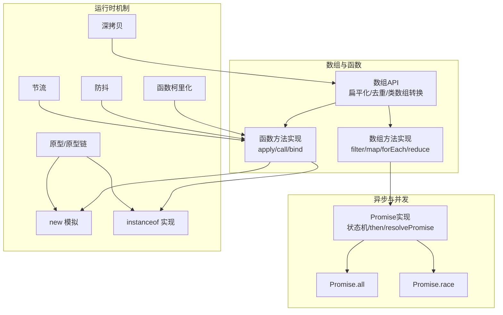

图表来源
- [implement.md](file://docs/frontend-advanced/js-implement/implement.md)
- [promise.md](file://docs/interview/es6/promise.md)

## 详细组件分析

### 数组扁平化
- 原理要点
  - 递归：遇到数组则递归展开，非数组直接收集
  - reduce：累积器 concat 当前项（若为数组则递归）
  - 正则：序列化后替换括号，再解析回数组（注意类型丢失）
  - flat(Infinity)：标准 API
- 复杂度
  - 递归/reduce：时间 O(n)，空间 O(n)（不含递归栈）
- 边界与陷阱
  - 深层数组、空数组、混合类型
  - 正则方案会丢失原始类型（如数字变字符串）

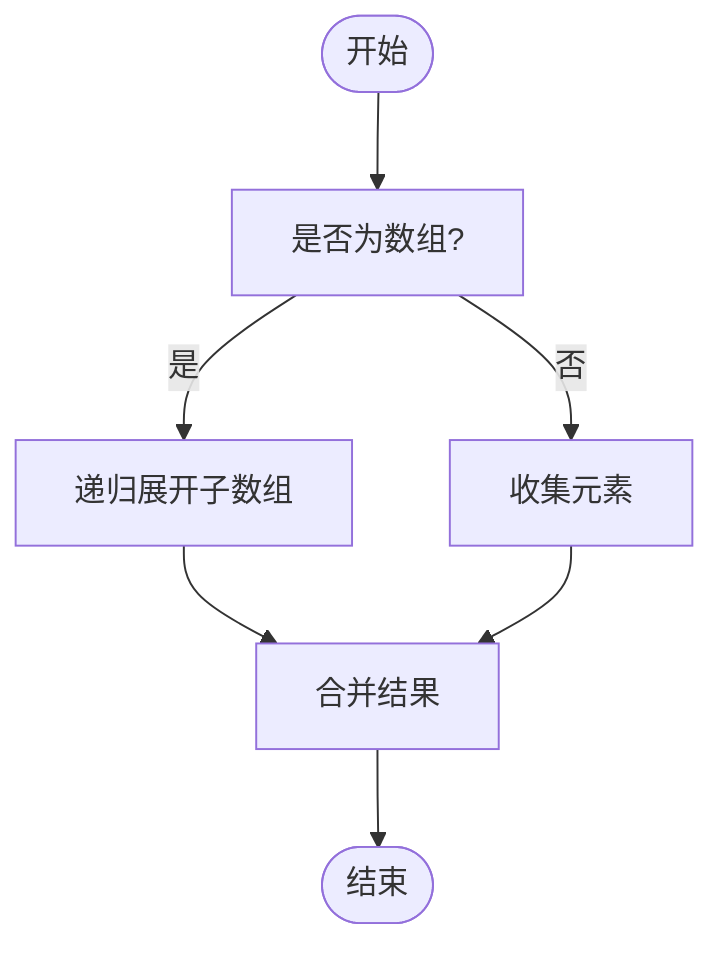

图表来源
- [implement.md](file://docs/frontend-advanced/js-implement/implement.md)

章节来源
- [implement.md](file://docs/frontend-advanced/js-implement/implement.md)

### 数组去重
- 原理要点
  - Set：最简洁，但不区分 0/-0、NaN
  - 双层循环+splice：原地去重，适合理解
  - indexOf/include/filter：按索引去重
  - Map：键值去重，适合复杂对象
- 复杂度
  - Set/Map：O(n)
  - 双层循环：O(n^2)
- 边界与陷阱
  - 引用类型去重需结合业务规则（如浅比较、序列化）

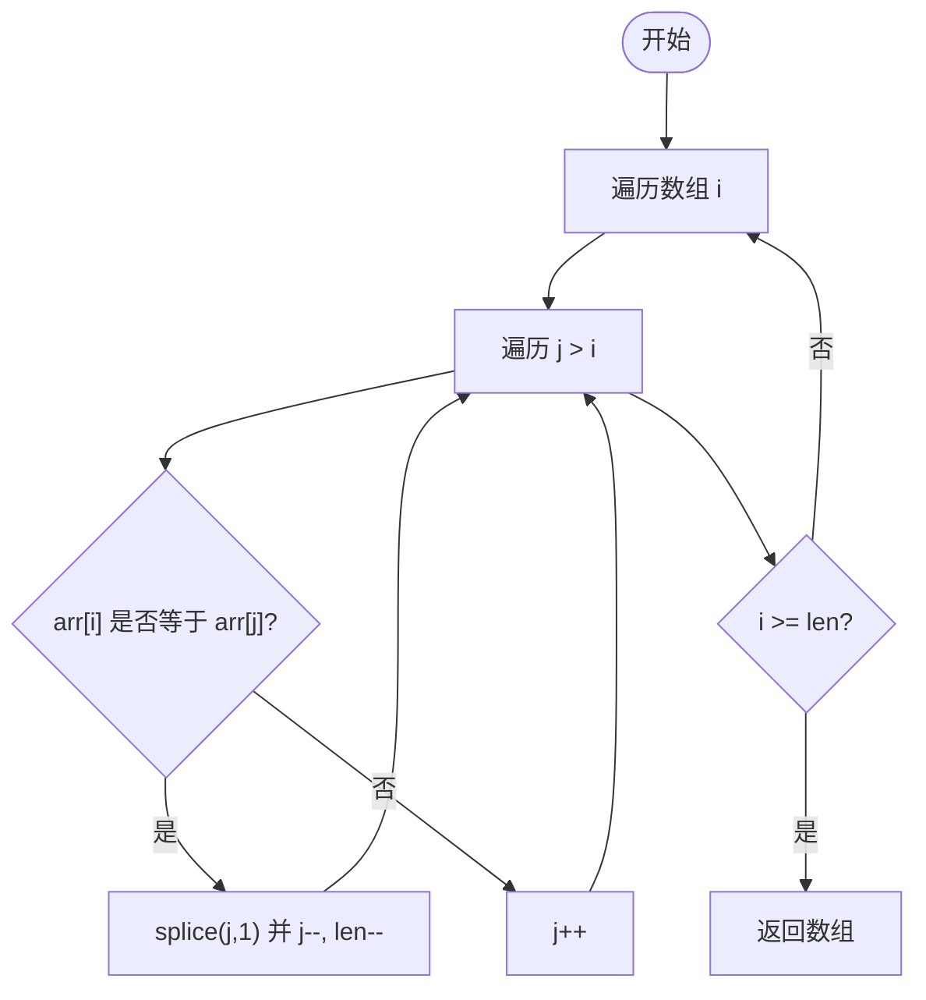

图表来源
- [implement.md](file://docs/frontend-advanced/js-implement/implement.md)

章节来源
- [implement.md](file://docs/frontend-advanced/js-implement/implement.md)

### 类数组转换
- 常见类数组：arguments、DOM 查询结果
- 转换方式
  - Array.from
  - Array.prototype.slice.call
  - 扩展运算符
  - Array.prototype.concat.apply([], 类数组)

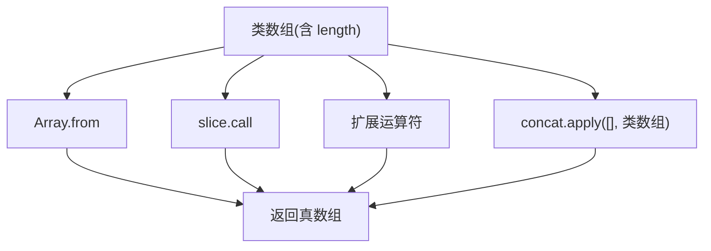

图表来源
- [implement.md](file://docs/frontend-advanced/js-implement/implement.md)

章节来源
- [implement.md](file://docs/frontend-advanced/js-implement/implement.md)

### 数组方法实现（filter/map/forEach/reduce）
- filter：过滤回调为真值的元素
- map：按序映射，返回新数组
- forEach：无返回值，逐项执行
- reduce：累积器迭代，支持初始值与首个有效值策略
- 关键实现细节
  - this 绑定与类型校验
  - 长度处理（>>>0）
  - 存在性检查（i in O）
  - 回调调用参数（值、索引、原数组）

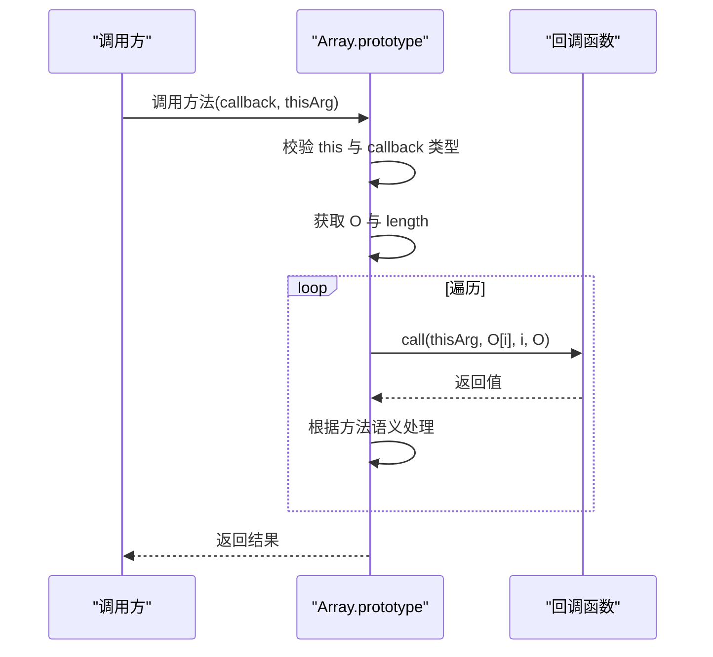

图表来源
- [implement.md](file://docs/frontend-advanced/js-implement/implement.md)

章节来源
- [implement.md](file://docs/frontend-advanced/js-implement/implement.md)

### 函数方法实现（apply/call/bind）
- apply：绑定 this 并传入参数数组
- call：绑定 this 并传参列表
- bind：返回绑定后的函数，支持 new 透传
- 关键实现细节
  - this 校验与默认 window
  - Symbol 临时属性避免污染
  - new 情况下的返回值判定

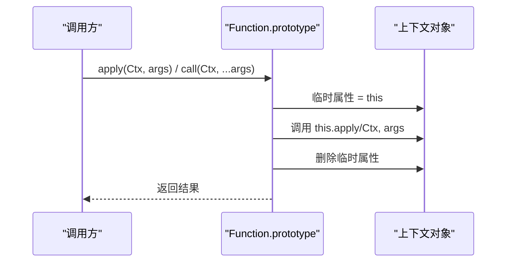

图表来源
- [implement.md](file://docs/frontend-advanced/js-implement/implement.md)

章节来源
- [implement.md](file://docs/frontend-advanced/js-implement/implement.md)

### 防抖与节流
- 防抖：n 秒内多次触发仅最后一次生效
- 节流：n 秒内最多触发一次
- 实现策略
  - 标志位/时间戳/定时器/精确版
- 场景
  - 输入搜索、窗口 resize、滚动加载

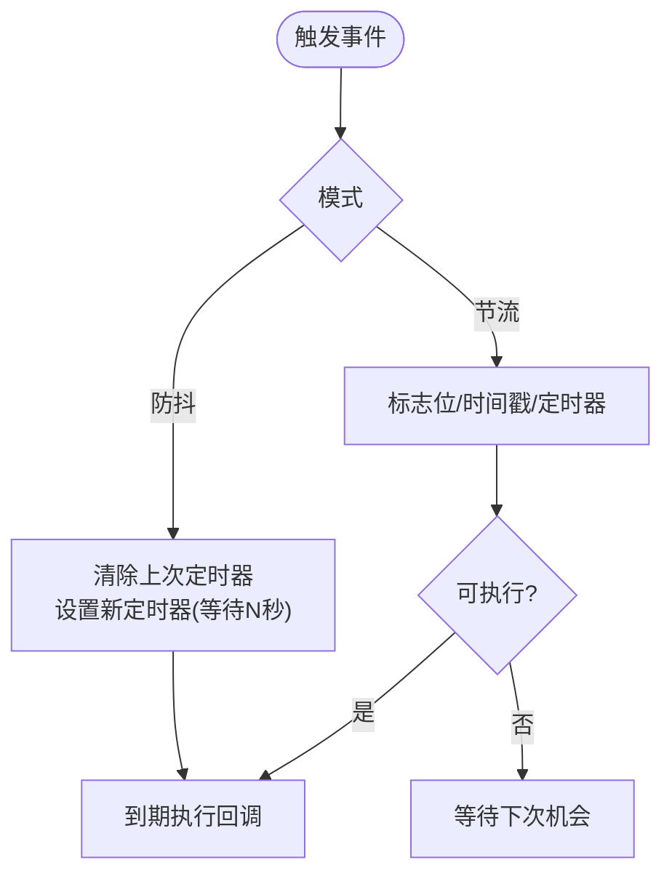

图表来源
- [debounce_throttle.md](file://docs/interview/JavaScript/debounce_throttle.md)

章节来源
- [debounce_throttle.md](file://docs/interview/JavaScript/debounce_throttle.md)

### 函数柯里化
- 将多参数函数转为单参链式调用
- 实现要点：参数收集、长度判断、返回闭包
- 应用：惰性求值、函数组合

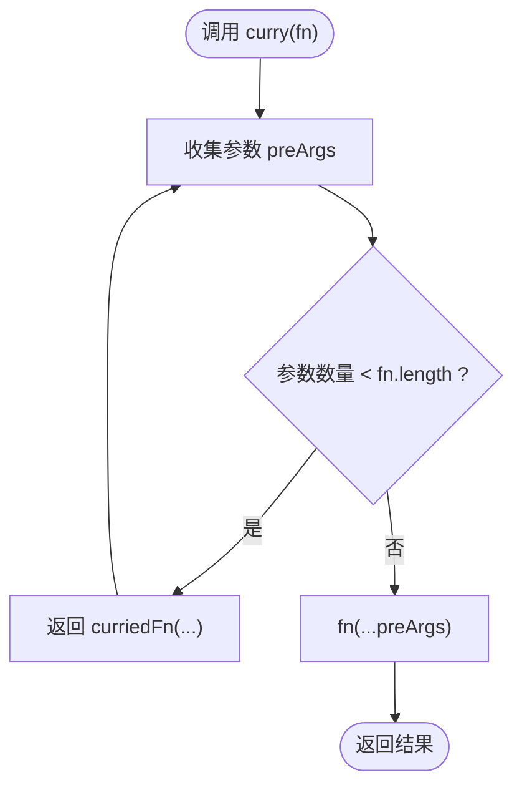

图表来源
- [functional_programming.md](file://docs/interview/JavaScript/functional_programming.md)

章节来源
- [functional_programming.md](file://docs/interview/JavaScript/functional_programming.md)

### new 操作符模拟
- 步骤
  - 以构造函数原型为原型创建对象
  - 执行构造函数并将 this 绑定到新对象
  - 判定返回值类型，决定返回新对象或构造函数结果

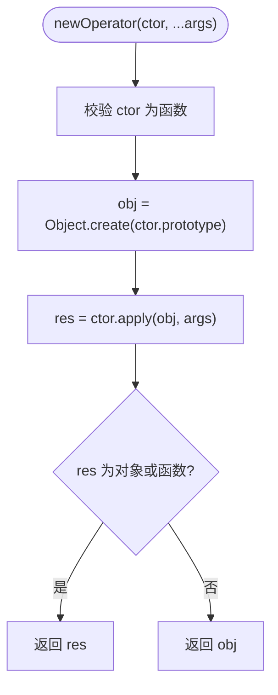

图表来源
- [implement.md](file://docs/frontend-advanced/js-implement/implement.md)

章节来源
- [implement.md](file://docs/frontend-advanced/js-implement/implement.md)

### instanceof 实现
- 原理：沿原型链查找，若发现构造函数的 prototype 则返回 true
- 注意：基本类型返回 false

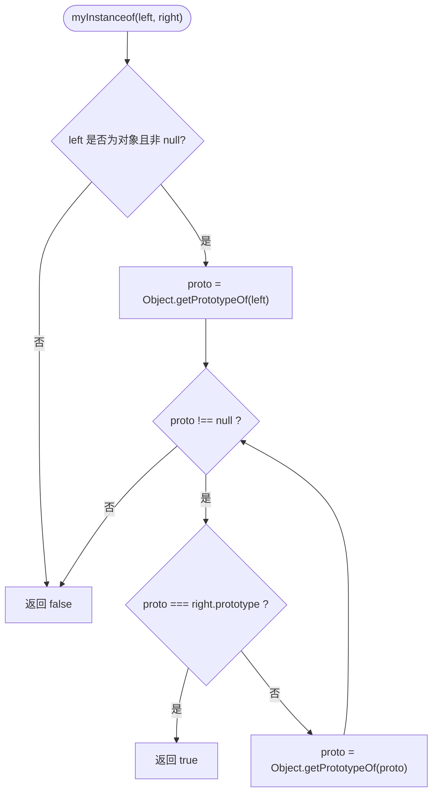

图表来源
- [implement.md](file://docs/frontend-advanced/js-implement/implement.md)

章节来源
- [implement.md](file://docs/frontend-advanced/js-implement/implement.md)

### 原型与原型链
- 原型：函数的 prototype 属性
- 原型链：对象沿 __proto__ 向上查找，直至 null
- 关键关系：对象.__proto__ === 构造函数.prototype；函数.__proto__ === Function.prototype；Object.prototype.__proto__ === null

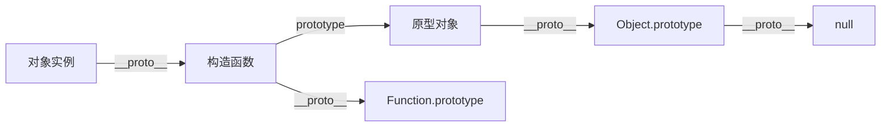

图表来源
- [prototype.md](file://docs/interview/JavaScript/prototype.md)

章节来源
- [prototype.md](file://docs/interview/JavaScript/prototype.md)

### 深拷贝
- 递归实现：处理对象/数组、Date/RegExp、循环引用（WeakMap）
- 复杂度：时间 O(n)，空间 O(n)
- 边界：Symbol 属性、函数、undefined/symbol 忽略（JSON 方案）

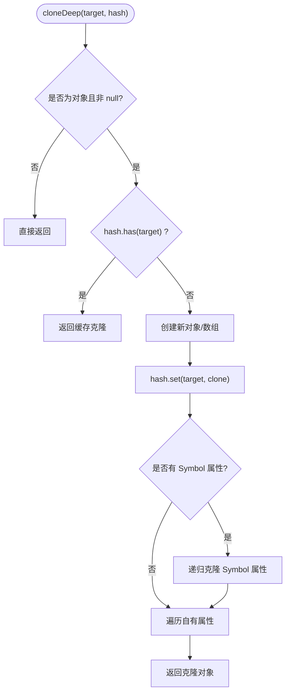

图表来源
- [implement.md](file://docs/frontend-advanced/js-implement/implement.md)

章节来源
- [implement.md](file://docs/frontend-advanced/js-implement/implement.md)

### Promise 实现与并发控制
- 状态机：pending/fulfilled/rejected
- then：返回新 Promise，订阅/发布机制
- resolvePromise：处理 thenable/x 自身引用、异常传播
- 并发：all（全部成功才成功）、race（任一完成）

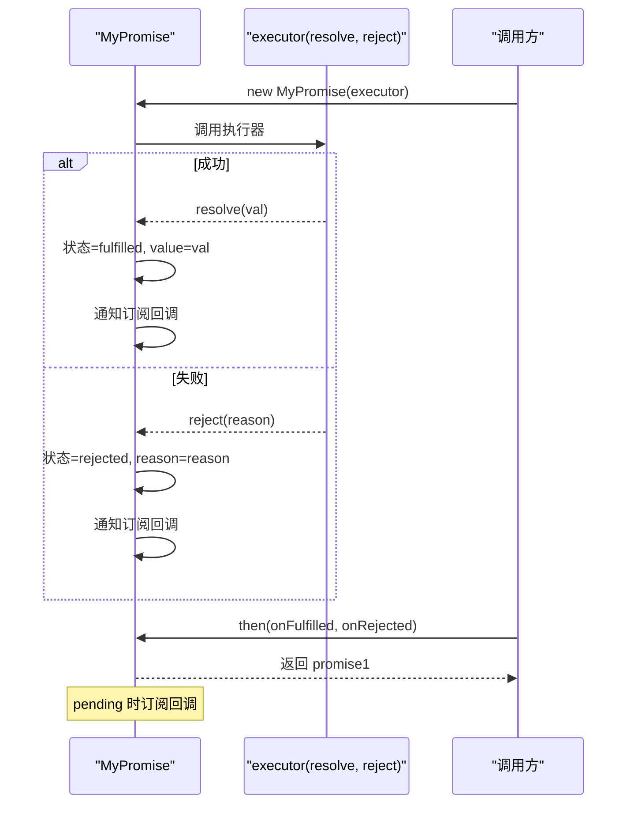

图表来源
- [implement.md](file://docs/frontend-advanced/js-implement/implement.md)

章节来源
- [implement.md](file://docs/frontend-advanced/js-implement/implement.md)

## 依赖分析
- 组件耦合
  - 数组方法实现依赖函数方法（apply/call）与 this 绑定
  - new/instanceof 依赖原型链与构造函数
  - Promise 依赖 thenable 规范与异常传播
  - 柯里化与函数方法实现相互独立但可组合
- 外部依赖
  - ES6 语法（扩展运算符、类、箭头函数）与 API（flat/flatMap/Array.from/of）为实现提供参考

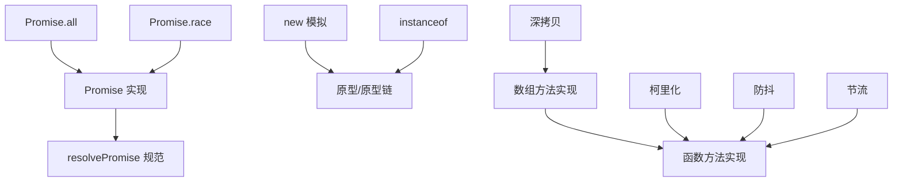

图表来源
- [implement.md](file://docs/frontend-advanced/js-implement/implement.md)
- [promise.md](file://docs/interview/es6/promise.md)

章节来源
- [implement.md](file://docs/frontend-advanced/js-implement/implement.md)
- [promise.md](file://docs/interview/es6/promise.md)

## 性能考量
- 时间复杂度
  - 数组扁平化/去重：Set/Map O(n)，双层循环 O(n^2)
  - reduce/递归：O(n)
  - 深拷贝：O(n)，递归深度与对象结构相关
- 空间复杂度
  - 递归/队列/WeakMap 缓存带来额外空间
- 异步与并发
  - Promise 链式调用避免回调地狱，但需注意微任务队列与内存占用
  - all/race 在大量并发时需控制速率，避免资源争用

## 故障排查指南
- 数组方法实现常见问题
  - this 为空或非函数：抛出类型错误
  - 回调未传或非函数：抛出类型错误
  - 空数组/稀疏数组：注意 length 与属性存在性检查
- 函数方法实现常见问题
  - this 绑定失败：确认 Symbol 临时属性未被覆盖
  - bind 返回函数与 new 的兼容：需区分实例化路径
- Promise 常见问题
  - thenable 循环引用：自身 then 调用导致栈溢出
  - 异常未捕获：确保 catch 链路完整
- 深拷贝常见问题
  - 循环引用：使用 WeakMap 去环
  - Symbol 属性：需显式遍历 Symbol 键
- 类型判断
  - typeof null === 'object'：需特殊处理
  - instanceof 无法判断基础类型：需结合 Object.prototype.toString

章节来源
- [implement.md](file://docs/frontend-advanced/js-implement/implement.md)
- [typeof_instanceof.md](file://docs/interview/JavaScript/typeof_instanceof.md)
- [copy.md](file://docs/interview/JavaScript/copy.md)

## 结论
通过对数组、函数、原型、异步与运行时机制的系统梳理与实现剖析，读者可以掌握 JavaScript 引擎中“核心 API”的实现原理与工程实践。建议在理解原理的基础上，结合测试用例与边界场景进行验证，逐步形成“从规范到实现再到优化”的闭环能力。

## 附录
- 相关 ES6 API 参考
  - 扩展运算符、Array.from/Array.of、flat/flatMap、entries/keys/values、includes 等
- Promise 并发控制
  - all/race 的语义与实现要点
- 继承与原型链
  - 寄生组合式继承与 ES6 extends 的等价实现

章节来源
- [array.md](file://docs/interview/es6/array.md)
- [promise.md](file://docs/interview/es6/promise.md)
- [inherit.md](file://docs/interview/JavaScript/inherit.md)