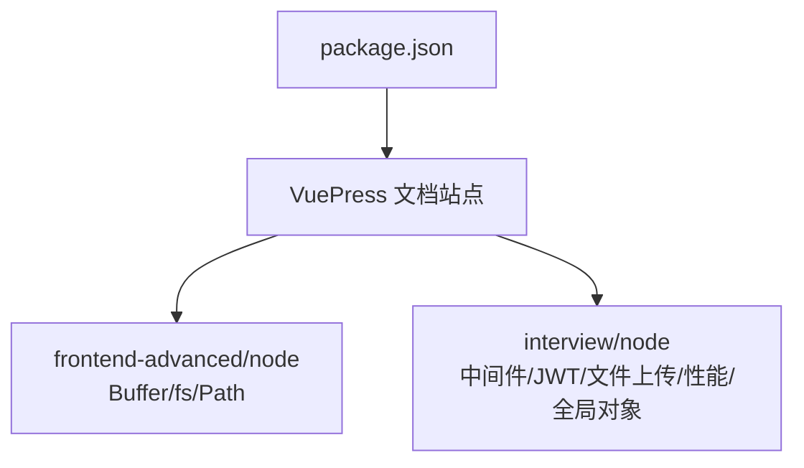
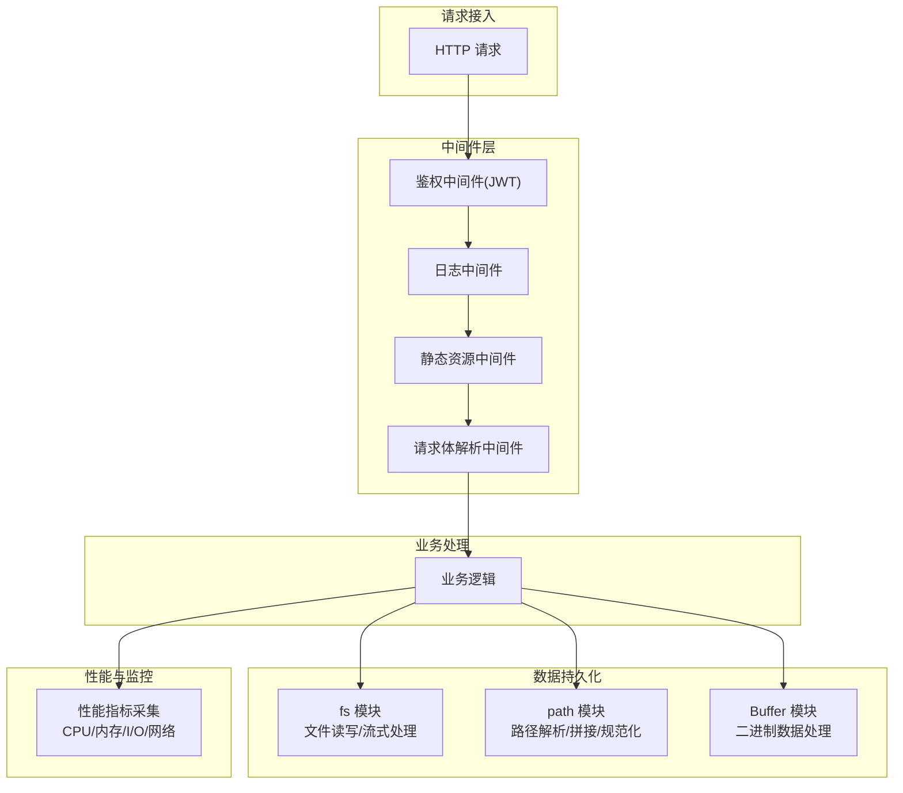
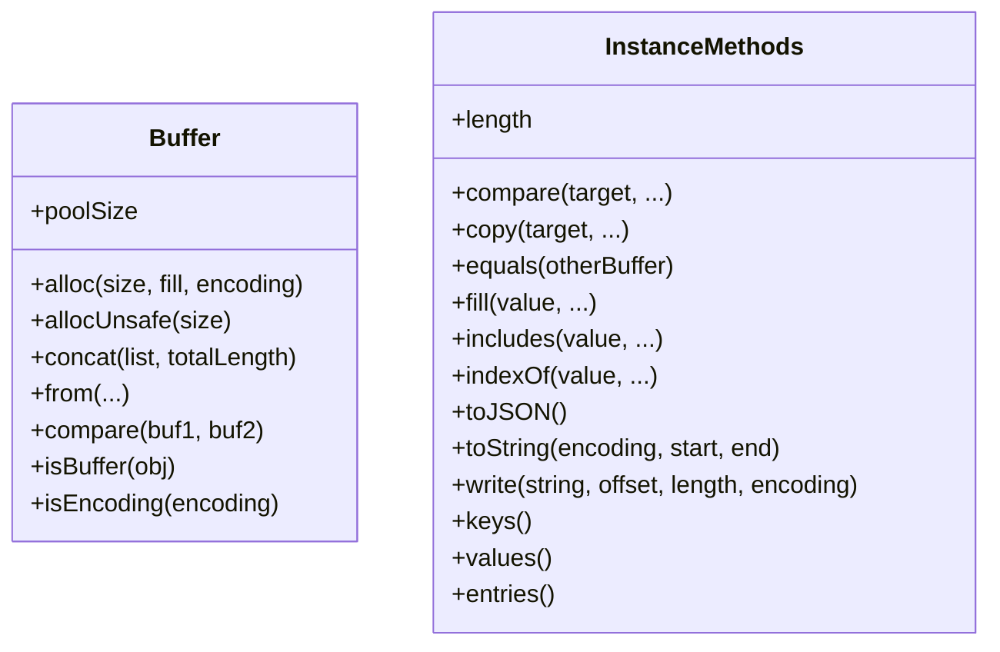
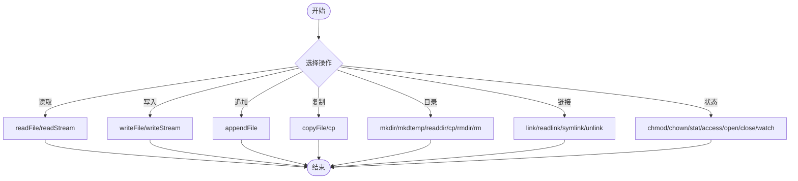
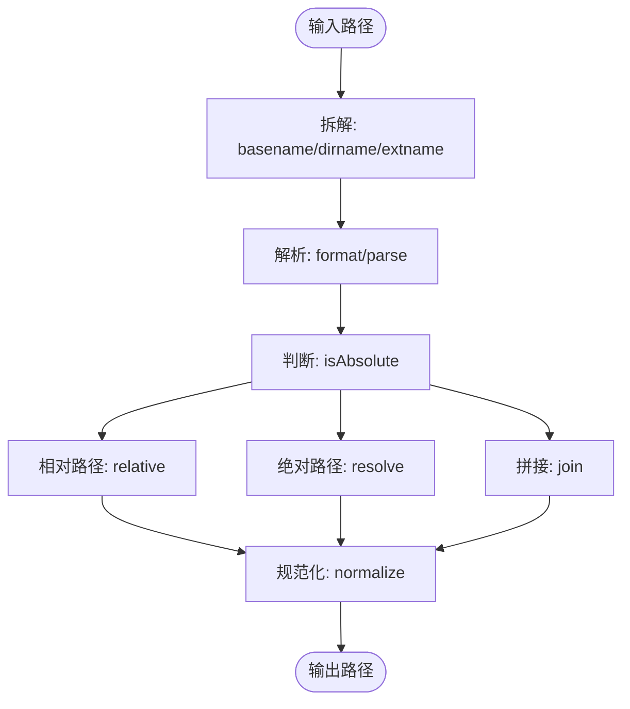
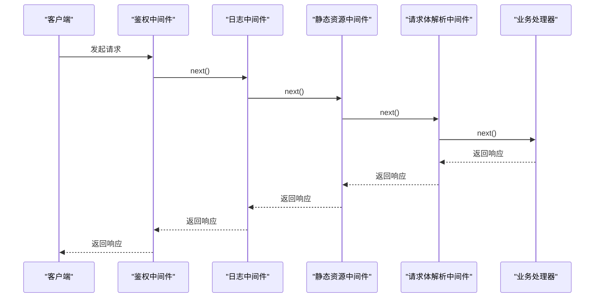
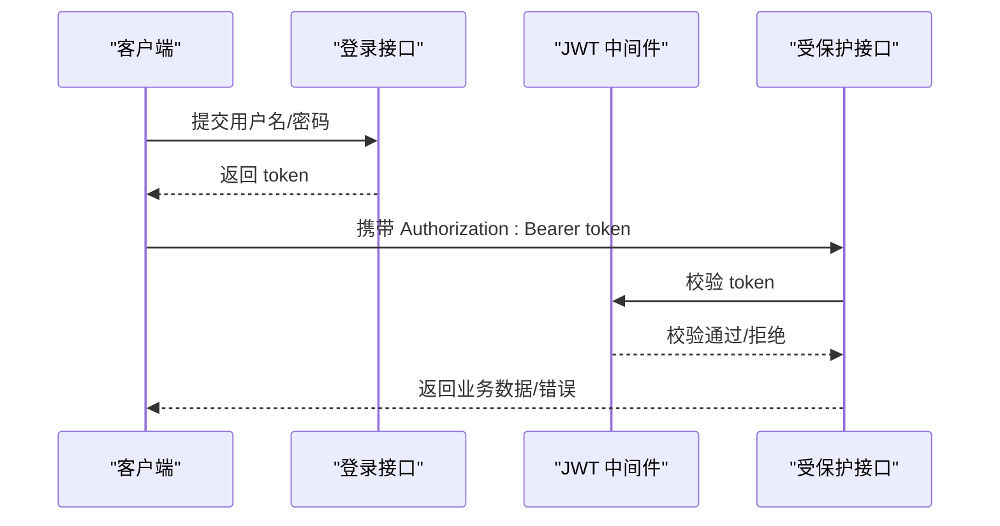
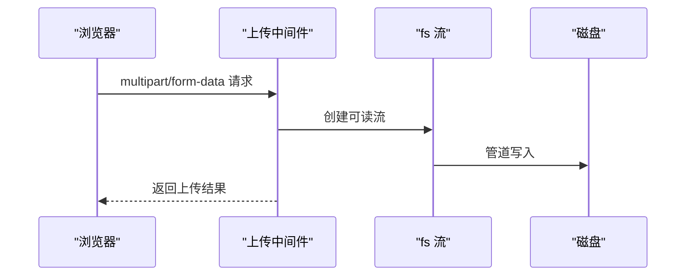
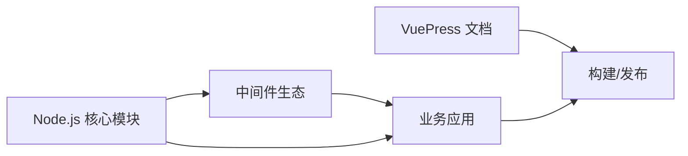

# Node.js 开发

<cite>
**本文引用的文件**
- [buffer.md](file://docs/frontend-advanced/node/buffer.md)
- [fs.md](file://docs/frontend-advanced/node/fs.md)
- [path.md](file://docs/frontend-advanced/node/path.md)
- [nodejs.md](file://docs/interview/node/nodejs.md)
- [performance.md](file://docs/interview/node/performance.md)
- [middleware.md](file://docs/interview/node/middleware.md)
- [jwt.md](file://docs/interview/node/jwt.md)
- [file_upload.md](file://docs/interview/node/file_upload.md)
- [global.md](file://docs/interview/node/global.md)
- [package.json](file://package.json)
</cite>

## 目录
1. [简介](#简介)
2. [项目结构](#项目结构)
3. [核心组件](#核心组件)
4. [架构概览](#架构概览)
5. [详细组件分析](#详细组件分析)
6. [依赖分析](#依赖分析)
7. [性能考量](#性能考量)
8. [故障排查指南](#故障排查指南)
9. [结论](#结论)
10. [附录](#附录)

## 简介
本学习文档面向 Node.js 服务端开发，围绕核心模块（Buffer、fs、path 等）、事件循环与异步编程、文件系统与路径处理、中间件与 JWT 鉴权、文件上传、性能监控与优化等主题，提供系统化知识梳理与实践指引。文档既适合初学者建立整体认知，也为进阶开发者提供深入的技术要点与最佳实践参考。

## 项目结构
本仓库为 VuePress 文档站点，Node.js 相关内容集中在 docs/frontend-advanced/node 与 docs/interview/node 下，涵盖 Buffer、fs、path、中间件、JWT、文件上传、性能与全局对象等专题。package.json 用于文档站点的构建与运行。

**章节来源**
- [package.json:1-17](file://package.json#L1-L17)

## 核心组件
- Buffer：二进制数据容器，提供分配、拼接、比较、编码/解码、写入/读取等能力，支持安全与高性能的构造策略。
- fs：文件系统操作，覆盖文件读写、追加、复制、截断、目录创建/删除、链接、状态查询、流式读写与文件监控。
- path：路径解析与格式化，提供 POSIX 与 Windows 的一致性处理、路径片段拼接与规范化、相对/绝对路径转换。
- 中间件：封装 HTTP 请求处理的洋葱模型，支持鉴权、日志、静态资源、请求体解析等通用能力。
- JWT：基于 JSON Web Token 的鉴权机制，包含生成与校验流程及安全注意事项。
- 文件上传：multipart/form-data 协议解析与服务端落盘，结合流式处理与中间件实现。
- 性能：CPU/内存/I/O/网络指标监控与优化策略，包含流式处理、内存池与对象池等实践。
- 全局对象：Node.js 全局命名空间与模块级全局变量，理解运行时上下文与模块系统。

**章节来源**
- [buffer.md:1-359](file://docs/frontend-advanced/node/buffer.md#L1-L359)
- [fs.md:1-448](file://docs/frontend-advanced/node/fs.md#L1-L448)
- [path.md:1-202](file://docs/frontend-advanced/node/path.md#L1-L202)
- [middleware.md:1-206](file://docs/interview/node/middleware.md#L1-L206)
- [jwt.md:1-207](file://docs/interview/node/jwt.md#L1-L207)
- [file_upload.md:1-179](file://docs/interview/node/file_upload.md#L1-L179)
- [performance.md:1-202](file://docs/interview/node/performance.md#L1-L202)
- [global.md:1-236](file://docs/interview/node/global.md#L1-L236)

## 架构概览
Node.js 服务端开发围绕“事件驱动 + 非阻塞 I/O”的运行时特性展开，结合核心模块与中间件生态，形成从请求接入、鉴权校验、业务处理、数据持久化到性能监控的完整链路。

## 详细组件分析

### Buffer 模块
- 构造策略
  - 安全分配：Buffer.alloc(size, fill, encoding) 保证新分配的 Buffer 内容不会残留旧数据。
  - 高性能分配：Buffer.allocUnsafe(size) 与内部池配合，适合对性能敏感的场景，需自行填充。
  - 拼接与池：Buffer.concat(list, totalLength) 与内部池协同，提升批量拼接效率。
- 编码与比较
  - 支持多种 from/from/string/compare/isEncoding 等方法，便于跨格式数据处理与排序。
- 实例方法
  - 比较、拷贝、填充、包含/索引、JSON 序列化、字符串解码、写入、迭代与长度属性等。

**图表来源**
- [buffer.md:5-175](file://docs/frontend-advanced/node/buffer.md#L5-L175)
- [buffer.md:181-359](file://docs/frontend-advanced/node/buffer.md#L181-L359)

**章节来源**
- [buffer.md:1-359](file://docs/frontend-advanced/node/buffer.md#L1-L359)

### fs 模块
- 文件操作
  - 追加写入、覆盖写入、读取、复制、截断、重命名、删除、链接与符号链接、权限变更、属主变更、访问性检查。
- 目录与文件树
  - 递归创建、临时目录、读取目录、复制目录树、删除目录（含递归与重试策略）。
- 流式处理
  - 读写流创建与选项（flags、encoding、fd、mode、autoClose、emitClose、start/end、highWaterMark 等）。
- 文件监控
  - watch 监听文件/目录变更，支持持久化、递归、编码与中止信号。

**图表来源**
- [fs.md:5-448](file://docs/frontend-advanced/node/fs.md#L5-L448)

**章节来源**
- [fs.md:1-448](file://docs/frontend-advanced/node/fs.md#L1-L448)

### path 模块
- 路径拆解与解析
  - basename/dirname/extname；format/parse；isAbsolute；relative/resolve/join；normalize。
- 平台一致性
  - win32/posix 适配，确保在不同操作系统上获得一致结果。

**图表来源**
- [path.md:51-202](file://docs/frontend-advanced/node/path.md#L51-L202)

**章节来源**
- [path.md:1-202](file://docs/frontend-advanced/node/path.md#L1-L202)

### 中间件与洋葱模型
- 概念与封装
  - 中间件本质为回调函数，参数包含 ctx（封装 request/response）与 next（进入下一个中间件）。
- 常见能力
  - 鉴权（JWT）、日志、静态资源（koa-static）、请求体解析（koa-bodyparser）等。
- 设计原则
  - 单一职责、高效、必要时缓存重复获取数据。

**图表来源**
- [middleware.md:23-53](file://docs/interview/node/middleware.md#L23-L53)
- [middleware.md:99-141](file://docs/interview/node/middleware.md#L99-L141)
- [middleware.md:145-187](file://docs/interview/node/middleware.md#L145-L187)

**章节来源**
- [middleware.md:1-206](file://docs/interview/node/middleware.md#L1-L206)

### JWT 鉴权机制
- 结构与流程
  - Header/Payload/Signature 三段式，服务端签发 token，客户端携带 Authorization: Bearer token 访问。
- 实现要点
  - 登录成功生成 token（含过期时间），校验中间件（koa-jwt）或手动 verify。
- 安全与扩展
  - 单密钥 HS256 与非对称 RS256；白名单路径；HTTPS 传输。

**图表来源**
- [jwt.md:72-165](file://docs/interview/node/jwt.md#L72-L165)

**章节来源**
- [jwt.md:1-207](file://docs/interview/node/jwt.md#L1-L207)

### 文件上传
- 协议与结构
  - multipart/form-data，boundary 分隔，Content-Disposition/name/filename 等头信息。
- 服务端实现
  - 使用中间件（koa-body/koa-multer）解析，结合 fs.createReadStream/fs.createWriteStream 管道落盘。
- 最佳实践
  - 控制文件大小、存储目录、文件名策略、安全性校验。

**图表来源**
- [file_upload.md:62-171](file://docs/interview/node/file_upload.md#L62-L171)

**章节来源**
- [file_upload.md:1-179](file://docs/interview/node/file_upload.md#L1-L179)

### 全局对象与运行时
- 全局对象
  - 真正全局：Buffer、process、console、定时器、global。
  - 模块级全局：__dirname、__filename、exports、module、require。
- 进程与参数
  - process.argv 获取启动参数；process.memoryUsage 获取内存指标；平台信息等。

**章节来源**
- [global.md:1-236](file://docs/interview/node/global.md#L1-L236)

## 依赖分析
- Node.js 核心模块
  - Buffer、fs、path、stream、os、url、events 等为服务端开发的基础。
- 中间件生态
  - koa-body、koa-static、koa-jwt 等在中间件层提供通用能力。
- 文档站点
  - VuePress 2.x 与主题用于文档构建与发布。

**章节来源**
- [package.json:1-17](file://package.json#L1-L17)

## 性能考量
- 指标与监控
  - CPU 负载与使用率、内存占用率（rss/heap/external）、磁盘 I/O 与网络。
  - 使用 Easy-Monitor 2.0 进行内核级性能监控与分析。
- 优化策略
  - 使用最新版本 Node.js；正确使用流（readStream/writeStream）；合并查询减少数据库往返；内存管理（减少泄漏、使用池）；对象池降低频繁创建/销毁开销。
- 代码层面
  - 避免同步阻塞；合理使用 Promise/async-await；中间件职责单一；静态资源走缓存与 CDN。

**章节来源**
- [performance.md:1-202](file://docs/interview/node/performance.md#L1-L202)

## 故障排查指南
- 文件系统错误
  - 使用 fs.rm 的 force/recursive/maxRetries/retryDelay 选项处理删除失败；watch 的 signal 中止；readFile 的 AbortSignal 控制读取生命周期。
- 中间件异常
  - 鉴权中间件（koa-jwt）配置白名单；请求体解析中间件（koa-body/koa-multer）设置最大文件大小与存储目录。
- 性能问题
  - 通过 process.memoryUsage 与 Easy-Monitor 观察内存与 CPU；对大文件使用流式处理；避免一次性读取至内存。
- 路径问题
  - 使用 path.win32/path.posix 保证跨平台一致性；join/resolve/normalize 规范化路径。

**章节来源**
- [fs.md:268-448](file://docs/frontend-advanced/node/fs.md#L268-L448)
- [middleware.md:99-187](file://docs/interview/node/middleware.md#L99-L187)
- [performance.md:72-202](file://docs/interview/node/performance.md#L72-L202)
- [path.md:17-202](file://docs/frontend-advanced/node/path.md#L17-L202)

## 结论
Node.js 服务端开发以事件驱动与非阻塞 I/O 为核心，结合 Buffer、fs、path 等核心模块与中间件生态，可高效构建 I/O 密集型应用。通过合理的流式处理、中间件设计、JWT 鉴权与文件上传策略，以及完善的性能监控与优化，可在保证稳定性的同时提升吞吐与用户体验。

## 附录
- 事件循环与异步编程
  - Promise/async-await 与 Generator 的演进，减少回调地狱，提升可读性与可维护性。
- 全局对象与模块系统
  - 理解 global、process、Buffer、定时器与模块级全局变量，有助于把握运行时上下文与模块加载机制。

**章节来源**
- [nodejs.md:1-69](file://docs/interview/node/nodejs.md#L1-L69)
- [global.md:166-236](file://docs/interview/node/global.md#L166-L236)