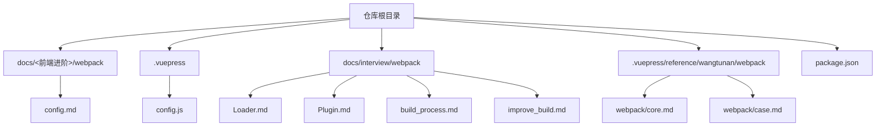
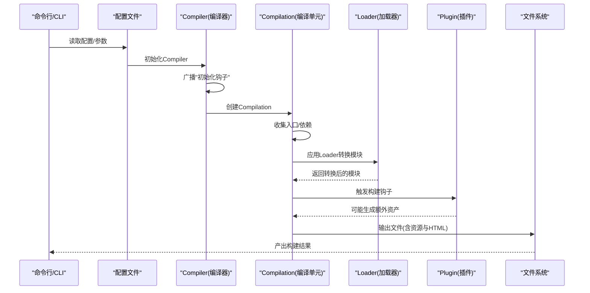
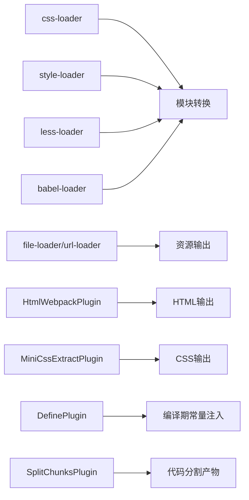

# Webpack 构建工具

<cite>
**本文引用的文件**
- [config.md](file://docs/frontend-advanced/webpack/config.md)
- [Loader.md](file://docs/interview/webpack/Loader.md)
- [Plugin.md](file://docs/interview/webpack/Plugin.md)
- [build_process.md](file://docs/interview/webpack/build_process.md)
- [improve_build.md](file://docs/interview/webpack/improve_build.md)
- [core.md](file://.vuepress/reference/wangtunan/webpack/webpack/core.md)
- [case.md](file://.vuepress/reference/wangtunan/webpack/webpack/case.md)
- [config.js](file://.vuepress/config.js)
- [package.json](file://package.json)
</cite>

## 目录
1. [简介](#简介)
2. [项目结构](#项目结构)
3. [核心组件](#核心组件)
4. [架构总览](#架构总览)
5. [详细组件分析](#详细组件分析)
6. [依赖分析](#依赖分析)
7. [性能考量](#性能考量)
8. [故障排查指南](#故障排查指南)
9. [结论](#结论)
10. [附录](#附录)

## 简介
本学习文档围绕 Webpack 构建工具展开，系统讲解配置文件结构、Loader 机制、Plugin 系统、构建流程、性能优化与最佳实践。文档结合仓库中的多篇实战与原理类文章，提供从入门到进阶的完整知识体系，并配套不同项目类型的配置模板与优化策略，帮助读者快速掌握 Webpack 的核心能力与落地技巧。

## 项目结构
本仓库以 VuePress 文档为主，其中包含大量前端构建与 Webpack 相关的资料，涵盖基础配置、Loader/Plugin 使用、构建流程、性能优化、多页打包、库打包、PWA、TypeScript 等主题。VuePress 本身并不直接使用 Webpack，但其配置与脚本为理解构建生态提供了良好背景。

图表来源
- [config.md](file://docs/frontend-advanced/webpack/config.md)
- [Loader.md](file://docs/interview/webpack/Loader.md)
- [Plugin.md](file://docs/interview/webpack/Plugin.md)
- [build_process.md](file://docs/interview/webpack/build_process.md)
- [improve_build.md](file://docs/interview/webpack/improve_build.md)
- [core.md](file://.vuepress/reference/wangtunan/webpack/webpack/core.md)
- [case.md](file://.vuepress/reference/wangtunan/webpack/webpack/case.md)
- [config.js](file://.vuepress/config.js)
- [package.json](file://package.json)

章节来源
- [config.js](file://.vuepress/config.js)
- [package.json](file://package.json)

## 核心组件
- 配置文件与模式
  - 支持通过配置文件与 CLI 指定 mode，自动注入 DefinePlugin，影响构建产物与优化策略。
  - 支持环境变量注入与 NODE_ENV 的使用边界说明。
- 入口与输出
  - 支持字符串、数组、对象、函数等多种入口形式；输出文件名支持占位符，支持 CDN publicPath。
- 解析与模块规则
  - resolve.alias、extensions、modules 等提升解析效率；module.rules 支持 test/include/exclude/noParse 等精细化控制。
- Loader 机制
  - Loader 链式执行，支持前置/后置/行内/普通；常见场景包括 CSS、Less/Sass、图片、数据文件、ES6 转 ES5 等。
- Plugin 系统
  - 基于 Tapable 生命周期钩子，贯穿编译周期；常用插件包括 HtmlWebpackPlugin、MiniCssExtractPlugin、DefinePlugin、ProvidePlugin、CopyWebpackPlugin 等。
- 代码分割与懒加载
  - 入口分离、动态 import()、魔法注释、prefetch/preload；SplitChunksPlugin 自动拆分与缓存组策略。
- 优化与性能
  - Tree-Shaking、Side Effects、usedExports、providedExports、minimizer、runtimeChunk、sourceMap、缓存与多线程等。

章节来源
- [config.md](file://docs/frontend-advanced/webpack/config.md)
- [Loader.md](file://docs/interview/webpack/Loader.md)
- [Plugin.md](file://docs/interview/webpack/Plugin.md)
- [build_process.md](file://docs/interview/webpack/build_process.md)
- [improve_build.md](file://docs/interview/webpack/improve_build.md)

## 架构总览
Webpack 的运行流程是一个串行过程，围绕 Compiler 与 Compilation 的生命周期展开，通过 Loader 转换模块内容，通过 Plugin 扩展构建能力，最终输出到文件系统。

图表来源
- [build_process.md](file://docs/interview/webpack/build_process.md)
- [config.md](file://docs/frontend-advanced/webpack/config.md)

## 详细组件分析

### 配置文件与模式
- 模式与 DefinePlugin
  - mode: development/production 影响默认优化与 DefinePlugin 注入。
  - NODE_ENV 的使用边界：配置文件中无法直接通过 process.env.NODE_ENV 判断，需借助 DefinePlugin 或 mode。
- 入口配置
  - 支持字符串、数组、对象、函数；对象形式可指定 filename、dependOn、chunkLoading、asyncChunks、layer 等。
- 输出管理
  - filename/chunkFilename 支持占位符；publicPath 支持 auto/CDN；clean/compareBeforeEmit/crossOriginLoading 等。
- 解析规则
  - alias、extensions、mainFields、mainFiles、modules、preferRelative/preferAbsolute、roots 等。
- 模块规则
  - test/include/exclude/noParse、oneOf、sideEffects、parser/generator、dataUrlCondition 等。
- 优化策略
  - usedExports、providedExports、splitChunks、runtimeChunk、minimizer、nodeEnv、chunkIds/moduleIds 等。
- 开发与生产差异
  - devServer 配置、sourceMap 选择、Tree-Shaking 与 Side Effects、路径信息输出控制等。

章节来源
- [config.md](file://docs/frontend-advanced/webpack/config.md)

### Loader 机制
- Loader 的作用与链式执行
  - 在 import/require 时对模块源代码进行转换；链式执行顺序与 use 数组相反。
- 常见 Loader
  - CSS：style-loader + css-loader；Less/Sass：less-loader/sass-loader；PostCSS：postcss-loader。
  - 图片/字体：file-loader/url-loader；内置 asset modules。
  - 数据：csv-loader、json（内置）、raw-loader。
  - 脚本：babel-loader（ES6->ES5）、imports-loader（修改 this 指向）。
- 配置要点
  - include/exclude/test 精准命中；缓存（cache-loader）与多线程（thread-loader）优化。

章节来源
- [Loader.md](file://docs/interview/webpack/Loader.md)
- [config.md](file://docs/frontend-advanced/webpack/config.md)

### Plugin 系统
- 生命周期与钩子
  - Compiler 生命周期：entry-option、run、compile、compilation、make、after-compile、emit、after-emit、done、failed。
  - 插件通过 apply(compiler) 订阅钩子。
- 常用插件
  - HtmlWebpackPlugin：自动生成 HTML 并注入 JS。
  - CleanWebpackPlugin：构建前清理输出目录。
  - MiniCssExtractPlugin：提取 CSS 到独立文件。
  - DefinePlugin：编译期注入全局常量。
  - ProvidePlugin：全局注入模块（如 _、$）。
  - CopyWebpackPlugin：复制静态资源。
- 最佳实践
  - 将插件集中管理，避免重复与冲突；按需启用开发/生产插件。

章节来源
- [Plugin.md](file://docs/interview/webpack/Plugin.md)
- [config.md](file://docs/frontend-advanced/webpack/config.md)

### 构建流程
- 初始化流程
  - 合并参数、初始化插件、创建 Compiler。
- 编译构建流程
  - compile -> make -> build-module -> seal -> emit。
- 关键阶段
  - 入口分析与依赖收集、AST 解析、模块构建、Chunk 组装、资源输出。

章节来源
- [build_process.md](file://docs/interview/webpack/build_process.md)

### 代码分割与懒加载
- 入口分离
  - 多入口打包，适合多页面或多入口场景。
- 动态导入与魔法注释
  - import() 作为分割点；webpackChunkName、webpackMode、webpackPrefetch、webpackPreload、webpackInclude/Exclude 等。
- SplitChunksPlugin
  - automaticNameDelimiter、chunks、maxAsyncRequests/maxInitialRequests、minChunks/minSize/minSizeReduction/maxSize、cacheGroups、reuseExistingChunk、priority、enforce 等。
- 预获取与预加载
  - preload（父 chunk 并行加载，较高优先级）与 prefetch（空闲时加载，较低优先级）。

章节来源
- [config.md](file://docs/frontend-advanced/webpack/config.md)

### 性能优化与最佳实践
- 通用优化
  - 选择较新 Node/webpack；减少 resolve.modules/extensions/mainFiles/descriptionFiles 条目；禁用 symlink；关闭 cacheWithContext。
  - DLL（DllPlugin/DllReferencePlugin）分离稳定依赖；保持较小 chunk；使用缓存与多线程。
- 开发环境
  - watch 模式增量编译；内存编译（webpack-dev-server）；合理 devtool；避免生产专用插件与优化步骤；关闭 pathinfo。
- 生产环境
  - 合理 sourceMap；Tree-Shaking 与 Side Effects；usedExports/providedExports；minimizer；runtimeChunk；缓存与 CDN。
- 构建加速
  - loader include/exclude/test 精准匹配；cache-loader；terser 多线程；合理 sourceMap 级别。

章节来源
- [improve_build.md](file://docs/interview/webpack/improve_build.md)
- [config.md](file://docs/frontend-advanced/webpack/config.md)

### 配置模板与最佳实践
- 单页应用（SPA）
  - HtmlWebpackPlugin + CleanWebpackPlugin + 多入口 + CSS 提取 + SplitChunks + runtimeChunk。
- 多页应用（MPA）
  - 多入口 + 多 HtmlWebpackPlugin + chunks 指定 + CleanWebpackPlugin。
- 库打包（Library）
  - output.library/libraryTarget（如 UMD）+ externals 排除第三方依赖 + 生产模式 + 产物校验。
- PWA
  - workbox-webpack-plugin 生成 service-worker 与 precache 清单。
- TypeScript
  - ts-loader + tsconfig.json + 类型定义文件（@types/*）。
- DevServer 代理
  - proxy 配置（target、pathRewrite、secure、changeOrigin、多路径）。

章节来源
- [case.md](file://.vuepress/reference/wangtunan/webpack/webpack/case.md)
- [core.md](file://.vuepress/reference/wangtunan/webpack/webpack/core.md)

## 依赖分析
- 组件耦合与协作
  - Loader 与 Parser/Geneartor：共同决定模块转换与资源输出策略。
  - Plugin 与 Compiler/Compilation：通过钩子扩展构建生命周期。
  - SplitChunksPlugin 与 optimization：影响 chunk 拆分与缓存策略。
- 外部依赖与集成
  - 第三方插件（如 MiniCssExtractPlugin、WorkboxWebpackPlugin、CopyWebpackPlugin）与内置插件协同。
  - DevServer 与 http-proxy-middleware 的代理集成。

图表来源
- [Loader.md](file://docs/interview/webpack/Loader.md)
- [Plugin.md](file://docs/interview/webpack/Plugin.md)
- [config.md](file://docs/frontend-advanced/webpack/config.md)

章节来源
- [Loader.md](file://docs/interview/webpack/Loader.md)
- [Plugin.md](file://docs/interview/webpack/Plugin.md)
- [config.md](file://docs/frontend-advanced/webpack/config.md)

## 性能考量
- 解析与模块规则
  - 通过 alias、extensions、modules、symlinks、cacheWithContext 等减少文件系统调用。
  - noParse 忽略大型库的依赖扫描。
- Loader 与转换
  - include/exclude 精准命中；cache-loader 缓存昂贵转换；thread-loader 分流耗时 Loader。
- 优化与压缩
  - usedExports/providedExports + Tree-Shaking；minimizer 多线程；runtimeChunk；splitChunks maxSize 与优先级。
- 开发体验
  - DevServer 内存编译、HMR、合理 devtool；避免生产专用优化在开发阶段执行。
- 生产策略
  - sourceMap 降级；CDN publicPath；缓存与长期缓存策略（contenthash）。

章节来源
- [improve_build.md](file://docs/interview/webpack/improve_build.md)
- [config.md](file://docs/frontend-advanced/webpack/config.md)

## 故障排查指南
- 常见问题定位
  - Loader 顺序错误：检查 use 数组顺序与覆盖前缀（!/-!/!!）。
  - 解析失败：确认 resolve.alias、extensions、modules、mainFields 配置是否正确。
  - 资源未输出：检查 asset modules/generator/publicPath/outputPath。
  - CSS 未生效：确认 style-loader/css-loader 链顺序与 MiniCssExtractPlugin 使用场景。
  - 动态导入异常：检查 import() 路径是否静态可分析；魔法注释是否正确。
- 插件冲突
  - HtmlWebpackPlugin 与 CleanWebpackPlugin 的顺序；CSS 提取与 HMR 的兼容。
- DevServer 代理
  - target/pathRewrite/secure/changeOrigin；多路径代理数组写法；bypass 返回逻辑。
- 性能瓶颈
  - watch 模式轮询间隔；sourceMap 级别；loader 缓存与多线程；resolve 缓存与 symlink。

章节来源
- [Loader.md](file://docs/interview/webpack/Loader.md)
- [Plugin.md](file://docs/interview/webpack/Plugin.md)
- [build_process.md](file://docs/interview/webpack/build_process.md)
- [improve_build.md](file://docs/interview/webpack/improve_build.md)
- [case.md](file://.vuepress/reference/wangtunan/webpack/webpack/case.md)

## 结论
Webpack 通过配置文件、Loader 与 Plugin 的组合，实现了对模块的灵活转换与构建生命周期的深度扩展。结合代码分割、Tree-Shaking、缓存与多线程等策略，可在开发体验与产物质量之间取得平衡。本仓库中的多篇文档提供了从原理到实践的完整路径，建议按“配置—流程—优化—模板”的顺序逐步掌握，并在实际项目中持续迭代与优化。

## 附录
- 术语速览
  - Loader：对模块源代码进行转换的函数链。
  - Plugin：在编译生命周期中执行的扩展。
  - Chunk：由入口或动态导入产生的代码块。
  - Bundle：最终输出的文件集合。
  - SplitChunks：将公共依赖或第三方模块抽取为独立 chunk。
  - Tree-Shaking：基于 ES6 静态导入/导出的死代码消除。
  - Side Effects：副作用标记，配合 optimization.sideEffects 跳过整文件/子树。
  - DevServer：本地开发服务器，支持热更新与代理。
- 参考资料
  - Webpack 官方文档与社区实践
  - VuePress 主题与脚本（dev/build）