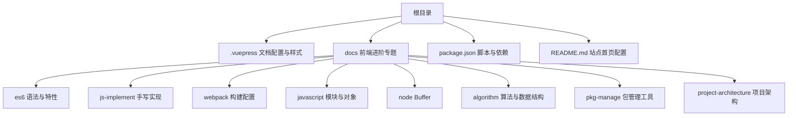
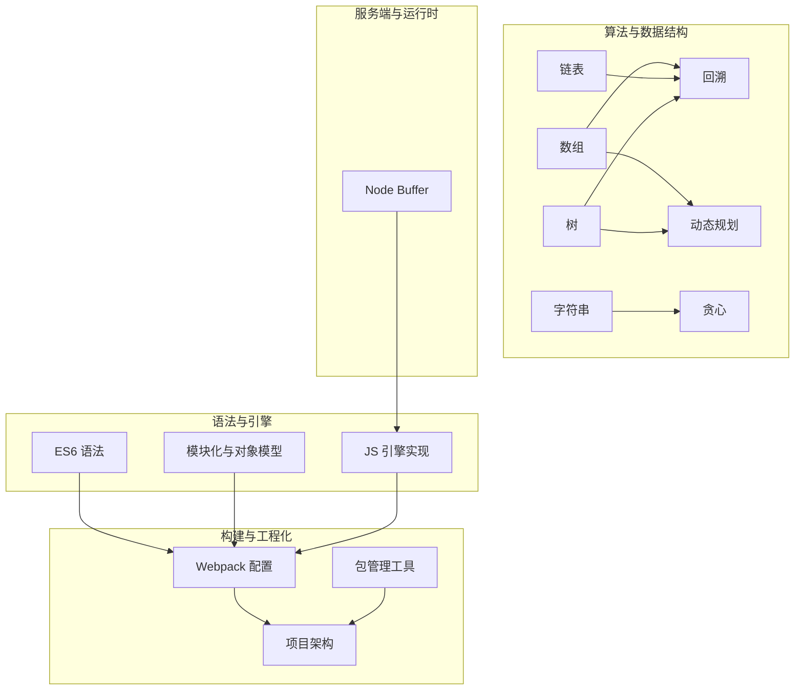
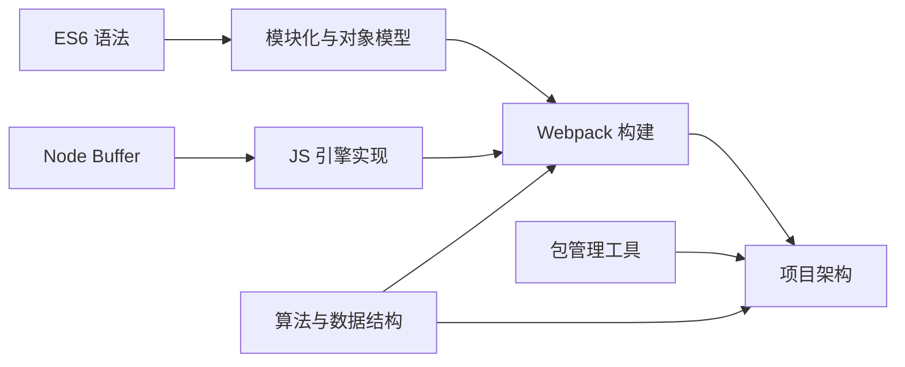

# 前端进阶

<cite>
**本文引用的文件**
- [package.json](file://package.json)
- [README.md](file://README.md)
- [grammar.md](file://docs/frontend-advanced/es6/grammar.md)
- [implement.md](file://docs/frontend-advanced/js-implement/implement.md)
- [config.md](file://docs/frontend-advanced/webpack/config.md)
- [module.md](file://docs/frontend-advanced/javascript/module.md)
- [object.md](file://docs/frontend-advanced/javascript/object.md)
- [buffer.md](file://docs/frontend-advanced/node/buffer.md)
- [Algorithm.md](file://docs/frontend-advanced/algorithm/Algorithm.md)
- [array.md](file://docs/frontend-advanced/algorithm/array.md)
- [back-trace.md](file://docs/frontend-advanced/algorithm/back-trace.md)
- [dynamic-programming.md](file://docs/frontend-advanced/algorithm/dynamic-programming.md)
- [greedy.md](file://docs/frontend-advanced/algorithm/greedy.md)
- [linked-list.md](file://docs/frontend-advanced/algorithm/linked-list.md)
- [string.md](file://docs/frontend-advanced/algorithm/string.md)
- [tree-example.md](file://docs/frontend-advanced/algorithm/tree-example.md)
- [instruction.md](file://docs/frontend-advanced/pkg-manage/instruction.md)
- [introduction.md](file://docs/frontend-advanced/project-architecture/introduction.md)
</cite>

## 目录
1. [简介](#简介)
2. [项目结构](#项目结构)
3. [核心组件](#核心组件)
4. [架构总览](#架构总览)
5. [详细组件分析](#详细组件分析)
6. [依赖分析](#依赖分析)
7. [性能考量](#性能考量)
8. [故障排查指南](#故障排查指南)
9. [结论](#结论)
10. [附录](#附录)

## 简介
本学习文档面向具有一定前端基础的工程师，系统梳理现代前端进阶所需的“语法与引擎实现、服务端与构建、算法与数据结构、包管理与工程化”等知识体系。文档以仓库中的 Markdown 文档为依据，配合可视化图示与实践路径，帮助读者建立从语法到架构、从理论到工程化的完整知识地图。

## 项目结构
该项目为 VuePress 文档站点，围绕“前端进阶”主题组织内容，涵盖 ES6+、JS 引擎实现、Webpack 构建、算法与数据结构、Node.js Buffer、包管理工具、前端项目架构等多个专题。整体结构清晰，便于按主题深入学习与查阅。

图表来源
- [package.json](file://package.json)
- [README.md](file://README.md)

章节来源
- [package.json](file://package.json)
- [README.md](file://README.md)

## 核心组件
- ES6+ 语法与特性：变量声明、块级作用域、数值扩展、Math 扩展、模块化演进等，奠定现代 JS 语法基础。
- JS 引擎实现与手写：数组与函数原型方法、防抖节流、函数柯里化、new/instanceof、深拷贝、Promise 等，加深对语言机制的理解。
- Webpack 构建：入口与解析、Loader/Parser/Generator、输出与清理、代码分割与 Tree Shaking、优化与性能。
- 算法与数据结构：数组、链表、字符串、树、回溯、贪心、动态规划等，强化工程问题的算法思维。
- Node.js Buffer：构造方法、比较与复制、编码与写入，掌握二进制数据处理。
- 包管理工具：NPM 生态、package.json 字段、生命周期、发布与访问控制、工作区与条件导出。
- 项目架构：Gitlab、CI/CD、埋点与监控、代码规范与提交规范、多页/单页选型、UI 与图标库、浏览器兼容。

章节来源
- [grammar.md](file://docs/frontend-advanced/es6/grammar.md)
- [implement.md](file://docs/frontend-advanced/js-implement/implement.md)
- [config.md](file://docs/frontend-advanced/webpack/config.md)
- [module.md](file://docs/frontend-advanced/javascript/module.md)
- [object.md](file://docs/frontend-advanced/javascript/object.md)
- [buffer.md](file://docs/frontend-advanced/node/buffer.md)
- [Algorithm.md](file://docs/frontend-advanced/algorithm/Algorithm.md)
- [array.md](file://docs/frontend-advanced/algorithm/array.md)
- [back-trace.md](file://docs/frontend-advanced/algorithm/back-trace.md)
- [dynamic-programming.md](file://docs/frontend-advanced/algorithm/dynamic-programming.md)
- [greedy.md](file://docs/frontend-advanced/algorithm/greedy.md)
- [linked-list.md](file://docs/frontend-advanced/algorithm/linked-list.md)
- [string.md](file://docs/frontend-advanced/algorithm/string.md)
- [tree-example.md](file://docs/frontend-advanced/algorithm/tree-example.md)
- [instruction.md](file://docs/frontend-advanced/pkg-manage/instruction.md)
- [introduction.md](file://docs/frontend-advanced/project-architecture/introduction.md)

## 架构总览
前端进阶的知识体系可抽象为“语法与引擎实现—构建与工程化—算法与数据结构—服务端与包管理”的闭环。下图展示各模块之间的关系与依赖：

图表来源
- [grammar.md](file://docs/frontend-advanced/es6/grammar.md)
- [module.md](file://docs/frontend-advanced/javascript/module.md)
- [object.md](file://docs/frontend-advanced/javascript/object.md)
- [implement.md](file://docs/frontend-advanced/js-implement/implement.md)
- [config.md](file://docs/frontend-advanced/webpack/config.md)
- [instruction.md](file://docs/frontend-advanced/pkg-manage/instruction.md)
- [introduction.md](file://docs/frontend-advanced/project-architecture/introduction.md)
- [buffer.md](file://docs/frontend-advanced/node/buffer.md)
- [array.md](file://docs/frontend-advanced/algorithm/array.md)
- [linked-list.md](file://docs/frontend-advanced/algorithm/linked-list.md)
- [string.md](file://docs/frontend-advanced/algorithm/string.md)
- [tree-example.md](file://docs/frontend-advanced/algorithm/tree-example.md)
- [greedy.md](file://docs/frontend-advanced/algorithm/greedy.md)
- [dynamic-programming.md](file://docs/frontend-advanced/algorithm/dynamic-programming.md)
- [back-trace.md](file://docs/frontend-advanced/algorithm/back-trace.md)

## 详细组件分析

### ES6+ 语法与特性
- 关键点：块级作用域、let/const、暂时性死区、Math 扩展、数值扩展、模块化演进。
- 实践价值：减少全局污染、提升作用域安全、改善循环与声明行为、统一模块化形态。
- 学习路径：从变量声明到模块化，再到数值与 Math 扩展，逐步建立现代 JS 语法体系。

章节来源
- [grammar.md](file://docs/frontend-advanced/es6/grammar.md)

### JS 引擎实现与手写
- 关键点：数组与函数原型方法、防抖节流、函数柯里化、new/instanceof、深拷贝、Promise。
- 实践价值：理解语言机制、提升调试与性能优化能力、增强对运行时行为的掌控。
- 学习路径：从原型链与继承出发，逐步深入到 Promise、调度器与深拷贝等高级主题。

章节来源
- [implement.md](file://docs/frontend-advanced/js-implement/implement.md)
- [object.md](file://docs/frontend-advanced/javascript/object.md)

### Webpack 构建配置
- 关键点：入口与解析、Loader/Parser/Generator、输出与清理、代码分割与 Tree Shaking、优化与性能。
- 实践价值：掌握打包流程、优化构建性能、实现按需加载与产物治理。
- 学习路径：从入口与解析开始，逐步深入到 SplitChunks、Shimming、优化策略与生产环境配置。

章节来源
- [config.md](file://docs/frontend-advanced/webpack/config.md)

### 模块化与对象模型
- 关键点：CommonJS、AMD/CMD、ES Module 的差异与实现；原型链、继承与 instanceof。
- 实践价值：理解模块加载机制、跨环境兼容与运行时依赖分析。
- 学习路径：从函数作用域到 CommonJS，再到 ES Module 的编译期分析与运行时加载。

章节来源
- [module.md](file://docs/frontend-advanced/javascript/module.md)
- [object.md](file://docs/frontend-advanced/javascript/object.md)

### Node.js Buffer
- 关键点：构造方法、比较与复制、编码与写入、池化与性能。
- 实践价值：处理二进制数据、网络与文件 IO、性能敏感场景的内存管理。
- 学习路径：从构造与填充到复制与编码，理解 Buffer 的内存模型与性能权衡。

章节来源
- [buffer.md](file://docs/frontend-advanced/node/buffer.md)

### 算法与数据结构
- 关键点：数组、链表、字符串、树、回溯、贪心、动态规划。
- 实践价值：提升工程问题的算法思维、优化时间与空间复杂度、应对面试与实战。
- 学习路径：从数组与双指针到树的层序/递归遍历，再到回溯、贪心与动态规划的通用套路。

章节来源
- [Algorithm.md](file://docs/frontend-advanced/algorithm/Algorithm.md)
- [array.md](file://docs/frontend-advanced/algorithm/array.md)
- [linked-list.md](file://docs/frontend-advanced/algorithm/linked-list.md)
- [string.md](file://docs/frontend-advanced/algorithm/string.md)
- [tree-example.md](file://docs/frontend-advanced/algorithm/tree-example.md)
- [back-trace.md](file://docs/frontend-advanced/algorithm/back-trace.md)
- [greedy.md](file://docs/frontend-advanced/algorithm/greedy.md)
- [dynamic-programming.md](file://docs/frontend-advanced/algorithm/dynamic-programming.md)

### 包管理工具与发布
- 关键点：package.json 字段、生命周期、发布与访问控制、工作区与条件导出。
- 实践价值：规范化依赖管理、统一团队协作流程、保障发布质量与可追溯性。
- 学习路径：从 package.json 字段到生命周期脚本，再到发布与访问控制、工作区与条件导出。

章节来源
- [instruction.md](file://docs/frontend-advanced/pkg-manage/instruction.md)

### 前端项目架构
- 关键点：Gitlab、CI/CD、埋点与监控、代码规范与提交规范、多页/单页选型、UI 与图标库、浏览器兼容。
- 实践价值：提升项目可管理性、稳定性与可扩展性，降低协作成本与风险。
- 学习路径：从基础设施到自动化流程，再到监控与规范，形成完整的工程化体系。

章节来源
- [introduction.md](file://docs/frontend-advanced/project-architecture/introduction.md)

## 依赖分析
- 语法与引擎实现依赖于 ES6 语法与模块化知识，为构建与工程化提供语言基础。
- 构建与工程化依赖于模块化与对象模型，Webpack 通过解析与打包实现模块化落地。
- 算法与数据结构为工程问题提供解法，回溯、贪心、动态规划等在前端业务与面试中高频出现。
- 服务端与包管理工具支撑工程化与发布流程，保障版本与依赖的可追溯性。
- 项目架构将上述能力整合为可执行的工程实践，形成从开发到上线的闭环。

图表来源
- [grammar.md](file://docs/frontend-advanced/es6/grammar.md)
- [module.md](file://docs/frontend-advanced/javascript/module.md)
- [object.md](file://docs/frontend-advanced/javascript/object.md)
- [implement.md](file://docs/frontend-advanced/js-implement/implement.md)
- [config.md](file://docs/frontend-advanced/webpack/config.md)
- [instruction.md](file://docs/frontend-advanced/pkg-manage/instruction.md)
- [introduction.md](file://docs/frontend-advanced/project-architecture/introduction.md)
- [buffer.md](file://docs/frontend-advanced/node/buffer.md)
- [Algorithm.md](file://docs/frontend-advanced/algorithm/Algorithm.md)

## 性能考量
- 构建性能：选择合适 loader、减少解析条目、启用缓存与并行、避免不必要的优化步骤。
- 运行时性能：Tree Shaking、按需加载、代码分割、懒执行与节流防抖、深拷贝与对象复用。
- 存储与传输：Buffer 池化、压缩与缓存、CDN 与静态资源治理。
- 监控与可观测：埋点系统、错误上报、指标采集与告警阈值设定。

## 故障排查指南
- 构建问题：检查入口与解析规则、Loader 顺序与覆盖、输出清理与 publicPath、SplitChunks 配置与缓存组。
- 模块问题：确认模块导出与导入一致性、ES Module 与 CommonJS 的差异、运行时依赖分析与 shim。
- 算法问题：核对边界条件、指针修改与链表拼接、贪心策略的正确性与回溯剪枝。
- 发布问题：核对 package.json 字段、生命周期脚本、访问级别与 dist-tags、工作区依赖连接。

章节来源
- [config.md](file://docs/frontend-advanced/webpack/config.md)
- [module.md](file://docs/frontend-advanced/javascript/module.md)
- [instruction.md](file://docs/frontend-advanced/pkg-manage/instruction.md)

## 结论
本学习文档以仓库内容为基础，构建了从前端进阶所需的关键知识点体系。通过语法与引擎实现、构建与工程化、算法与数据结构、服务端与包管理、项目架构等维度的系统梳理，读者可据此制定深入学习与实践计划，逐步提升工程化能力与系统设计水平。

## 附录
- VuePress 项目脚本与依赖：用于本地开发与构建。
- 文档首页配置：用于站点首页展示与导航。

章节来源
- [package.json](file://package.json)
- [README.md](file://README.md)