# 前端项目架构

<cite>
**本文引用的文件**
- [README.md](file://README.md)
- [package.json](file://package.json)
- [.vuepress/config.js](file://.vuepress/config.js)
- [.vuepress/navbar.js](file://.vuepress/navbar.js)
- [.github/workflows/deploy.yml](file://.github/workflows/deploy.yml)
- [docs/frontend-advanced/project-architecture/introduction.md](file://docs/frontend-advanced/project-architecture/introduction.md)
- [docs/frontend-advanced/webpack/config.md](file://docs/frontend-advanced/webpack/config.md)
- [docs/frontend-base/browser/architecture.md](file://docs/frontend-base/browser/architecture.md)
- [docs/vue3/vite/vite.md](file://docs/vue3/vite/vite.md)
- [docs/vue3/vue-router/grammar.md](file://docs/vue3/vue-router/grammar.md)
- [docs/vue3/pinia/grammar.md](file://docs/vue3/pinia/grammar.md)
</cite>

## 目录
1. [引言](#引言)
2. [项目结构](#项目结构)
3. [核心组件](#核心组件)
4. [架构总览](#架构总览)
5. [详细组件分析](#详细组件分析)
6. [依赖分析](#依赖分析)
7. [性能考量](#性能考量)
8. [故障排查指南](#故障排查指南)
9. [结论](#结论)
10. [附录](#附录)

## 引言
本学习文档围绕前端项目架构设计展开，结合仓库中的 VuePress 技术栈与大量前端知识文档，系统梳理架构设计原则、模块划分策略、目录结构组织、技术选型决策、开发规范与最佳实践。文档既关注工程化能力（构建、部署、性能），也强调设计模式与可演进性（组件化、状态管理、路由设计），并提供可落地的实践建议与可视化图示。

## 项目结构
该项目采用 VuePress 主题进行知识体系化呈现，整体结构清晰、职责分明：
- 根目录包含项目元信息与构建脚本
- .vuepress 目录承载主题配置与导航
- docs 目录按主题维度组织前端知识与架构文档
- .github/workflows 目录提供自动化部署流水线

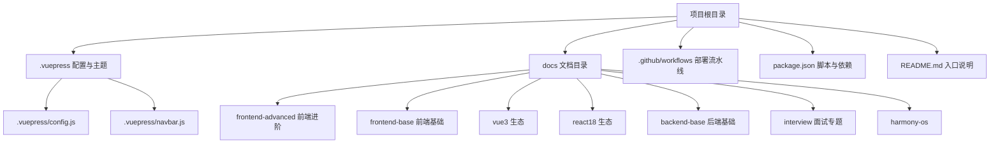

图表来源
- [.vuepress/config.js:1-18](file://.vuepress/config.js#L1-L18)
- [.vuepress/navbar.js:1-142](file://.vuepress/navbar.js#L1-L142)
- [package.json:1-17](file://package.json#L1-L17)
- [README.md:1-12](file://README.md#L1-L12)

章节来源
- [.vuepress/config.js:1-18](file://.vuepress/config.js#L1-L18)
- [.vuepress/navbar.js:1-142](file://.vuepress/navbar.js#L1-L142)
- [package.json:1-17](file://package.json#L1-L17)
- [README.md:1-12](file://README.md#L1-L12)

## 核心组件
- 主题与配置层：VuePress 主题与基础配置，负责站点标题、描述、导航、系列目录与主题样式等
- 导航与内容层：多层级导航菜单与文档内容，覆盖前端基础、进阶、生态与面试专题
- 构建与发布层：本地开发与构建脚本，GitHub Actions 自动化部署到 GitHub Pages
- 架构与工程层：前端项目架构设计文档与构建工具（Webpack/Vite）说明

章节来源
- [.vuepress/config.js:1-18](file://.vuepress/config.js#L1-L18)
- [.vuepress/navbar.js:1-142](file://.vuepress/navbar.js#L1-L142)
- [package.json:8-12](file://package.json#L8-L12)
- [.github/workflows/deploy.yml:1-36](file://.github/workflows/deploy.yml#L1-L36)

## 架构总览
整体架构以 VuePress 为主题载体，通过主题配置与导航组织内容；通过构建脚本与 GitHub Actions 实现本地开发与自动化发布；通过前端架构与工程文档沉淀最佳实践。

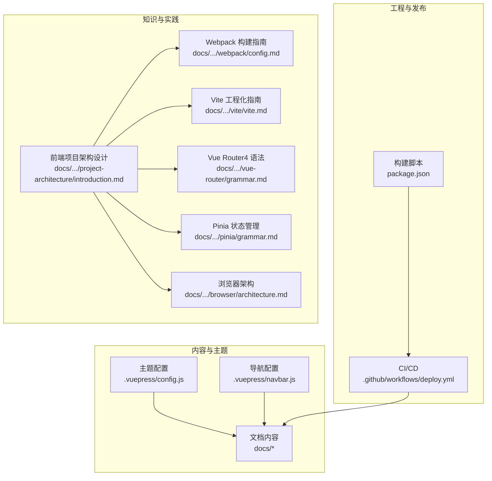

图表来源
- [.vuepress/config.js:1-18](file://.vuepress/config.js#L1-L18)
- [.vuepress/navbar.js:1-142](file://.vuepress/navbar.js#L1-L142)
- [package.json:8-12](file://package.json#L8-L12)
- [.github/workflows/deploy.yml:1-36](file://.github/workflows/deploy.yml#L1-L36)
- [docs/frontend-advanced/project-architecture/introduction.md:1-112](file://docs/frontend-advanced/project-architecture/introduction.md#L1-L112)
- [docs/frontend-advanced/webpack/config.md:1-890](file://docs/frontend-advanced/webpack/config.md#L1-L890)
- [docs/vue3/vite/vite.md:1-1269](file://docs/vue3/vite/vite.md#L1-L1269)
- [docs/vue3/vue-router/grammar.md:1-139](file://docs/vue3/vue-router/grammar.md#L1-L139)
- [docs/vue3/pinia/grammar.md:1-450](file://docs/vue3/pinia/grammar.md#L1-L450)
- [docs/frontend-base/browser/architecture.md:1-446](file://docs/frontend-base/browser/architecture.md#L1-L446)

## 详细组件分析

### 主题与导航配置
- 主题配置负责站点基础信息、主题参数与系列/导航配置
- 导航配置提供多层级菜单，覆盖前端基础、进阶、生态与面试专题

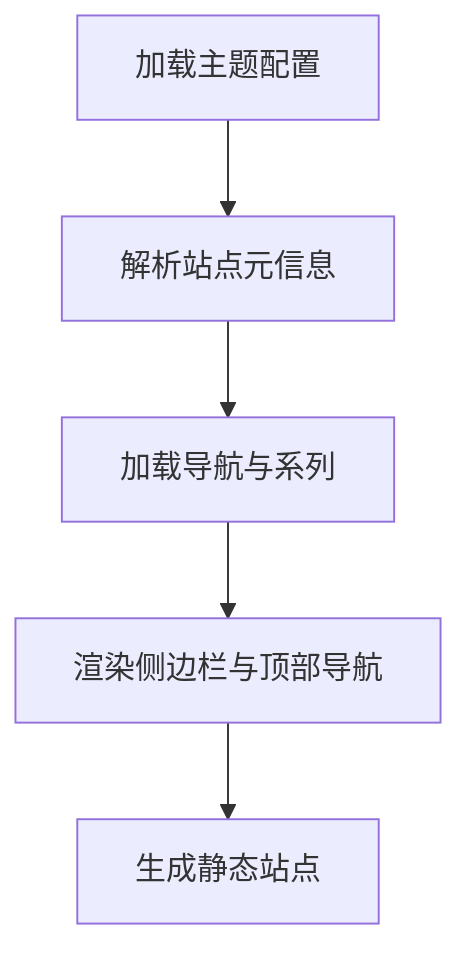

图表来源
- [.vuepress/config.js:1-18](file://.vuepress/config.js#L1-L18)
- [.vuepress/navbar.js:1-142](file://.vuepress/navbar.js#L1-L142)

章节来源
- [.vuepress/config.js:1-18](file://.vuepress/config.js#L1-L18)
- [.vuepress/navbar.js:1-142](file://.vuepress/navbar.js#L1-L142)

### 构建与发布流水线
- 本地开发与构建脚本通过 npm scripts 管理
- GitHub Actions 在 master 推送时自动安装依赖、构建并部署到 GitHub Pages

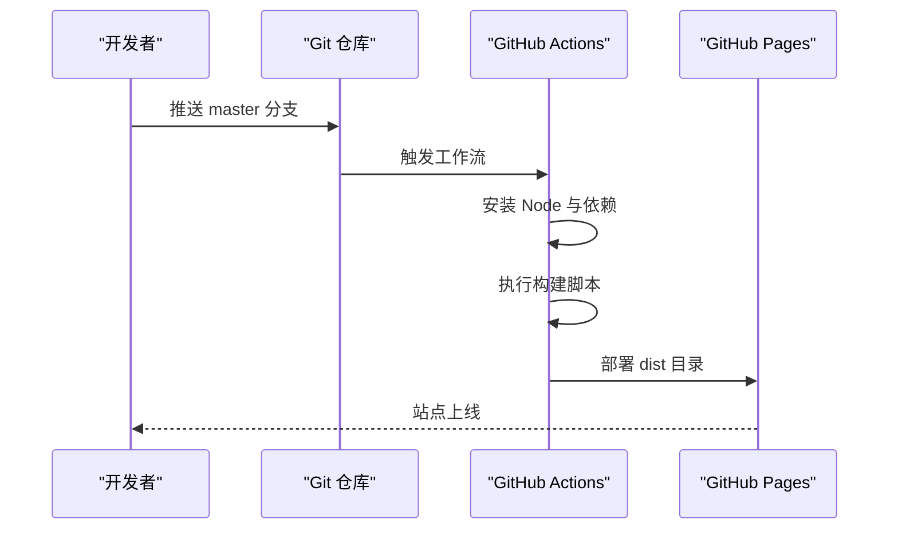

图表来源
- [package.json:8-12](file://package.json#L8-L12)
- [.github/workflows/deploy.yml:1-36](file://.github/workflows/deploy.yml#L1-L36)

章节来源
- [package.json:8-12](file://package.json#L8-L12)
- [.github/workflows/deploy.yml:1-36](file://.github/workflows/deploy.yml#L1-L36)

### 前端项目架构设计
- 架构设计应解决现有与未来技术问题，提升可管理性、稳定性与可扩展性
- 基础层包括：自建 Git/GitLab、自动编译发布、埋点系统、监控与报警、代码规范与提交规范、Mock
- 应用层包括：多页与单页选择、库与UI组件库选择、图标库、浏览器兼容策略

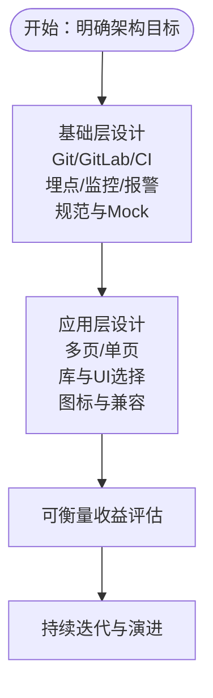

图表来源
- [docs/frontend-advanced/project-architecture/introduction.md:7-112](file://docs/frontend-advanced/project-architecture/introduction.md#L7-L112)

章节来源
- [docs/frontend-advanced/project-architecture/introduction.md:7-112](file://docs/frontend-advanced/project-architecture/introduction.md#L7-L112)

### 构建工具与工程化（Webpack）
- 入口、上下文、模式与资源处理
- 解析规则与别名、扩展名、主字段
- Loader 与 Generator、Parser、Side Effects
- 输出管理、公共路径、文件名占位符
- 开发服务器、热更新、代理与静态资源
- 代码分割、动态导入、SplitChunks、Prefetch/Preload
- Tree Shaking、Side Effects、Shimming、ProvidePlugin
- 性能优化：版本、Loader、解析、DLL、Worker 池、SourceMap

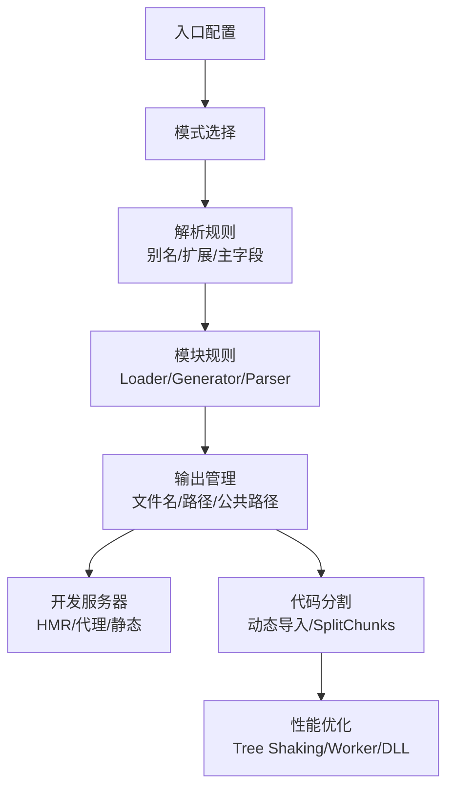

图表来源
- [docs/frontend-advanced/webpack/config.md:1-890](file://docs/frontend-advanced/webpack/config.md#L1-L890)

章节来源
- [docs/frontend-advanced/webpack/config.md:1-890](file://docs/frontend-advanced/webpack/config.md#L1-L890)

### 构建工具与工程化（Vite）
- 命令行与模式：dev/build/optimize/preview
- 资源处理：依赖解析、TypeScript、Vue、JSX、CSS、Assets、public、JSON、Glob 导入
- 配置：root/base/define/plugins/publicDir/cacheDir/resolve/css/esbuild/json
- 服务器：host/port/https/open/proxy/headers/watch/base/origin
- 构建：target/outDir/assetsDir/assetsInlineLimit/cssCodeSplit/minify/rollupOptions/lib
- 依赖优化：entries/exclude/include/esbuildOptions/force/disabled
- 插件：约定、获取、按需应用、调用顺序、虚拟模块、钩子

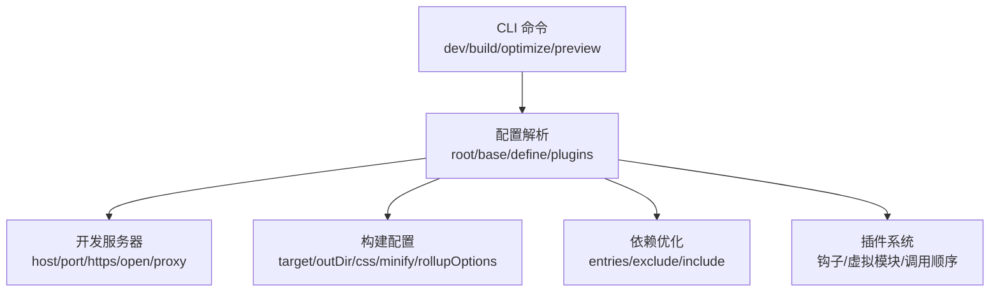

图表来源
- [docs/vue3/vite/vite.md:1-1269](file://docs/vue3/vite/vite.md#L1-L1269)

章节来源
- [docs/vue3/vite/vite.md:1-1269](file://docs/vue3/vite/vite.md#L1-L1269)

### 路由设计（Vue Router4）
- 动态路由与正则表达式
- 命名视图与多视图布局
- 导航守卫：全局前置/解析/后置、路由守卫、组件守卫
- 组合式 API：useRouter/useRoute、onBeforeRouteLeave/Update

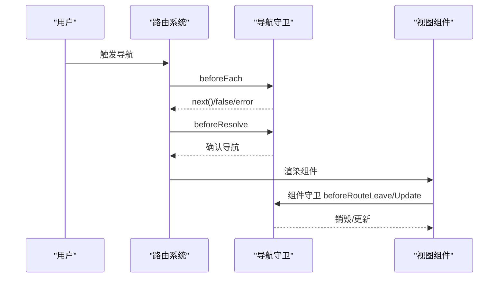

图表来源
- [docs/vue3/vue-router/grammar.md:1-139](file://docs/vue3/vue-router/grammar.md#L1-L139)

章节来源
- [docs/vue3/vue-router/grammar.md:1-139](file://docs/vue3/vue-router/grammar.md#L1-L139)

### 状态管理（Pinia）
- Store 定义：defineStore、Option 与 Setup 两种风格
- State：读写、重置、$patch、订阅
- Getter：计算属性、传参函数、跨 Store 访问
- Action：方法、调用、订阅
- 插件：扩展 Store、添加外部属性、订阅与自定义选项

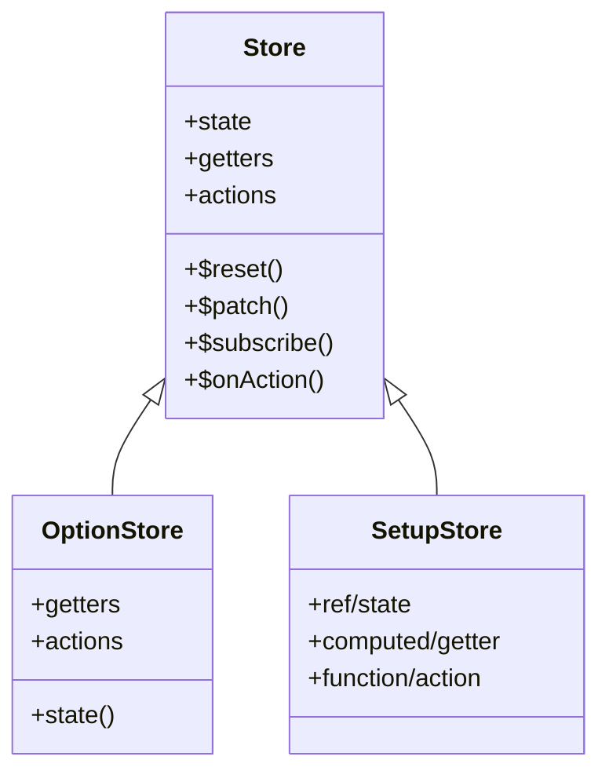

图表来源
- [docs/vue3/pinia/grammar.md:1-450](file://docs/vue3/pinia/grammar.md#L1-L450)

章节来源
- [docs/vue3/pinia/grammar.md:1-450](file://docs/vue3/pinia/grammar.md#L1-L450)

### 浏览器架构与性能
- 多进程架构与渲染管线：输入 URL 到渲染、DOM/CSSOM/渲染树/布局/绘制/合成
- Script 加载策略：defer/async、动态加载与回调
- 回流与重绘：优化建议与最佳实践

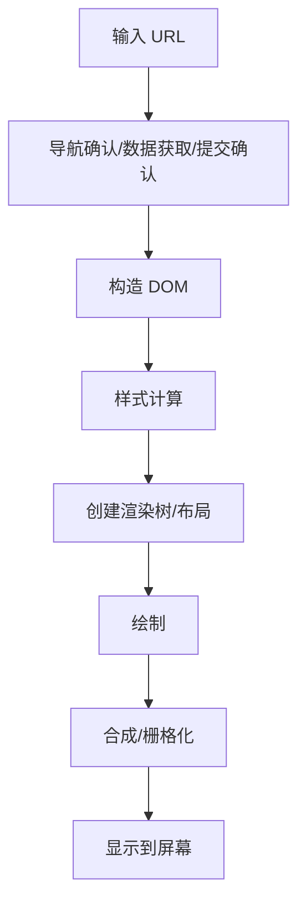

图表来源
- [docs/frontend-base/browser/architecture.md:301-366](file://docs/frontend-base/browser/architecture.md#L301-L366)

章节来源
- [docs/frontend-base/browser/architecture.md:1-446](file://docs/frontend-base/browser/architecture.md#L1-L446)

## 依赖分析
- 主题依赖：vuepress 与 vuepress-theme-reco
- 构建脚本：npm scripts 管理 dev/start/build
- CI 依赖：GitHub Actions 与 GitHub Pages

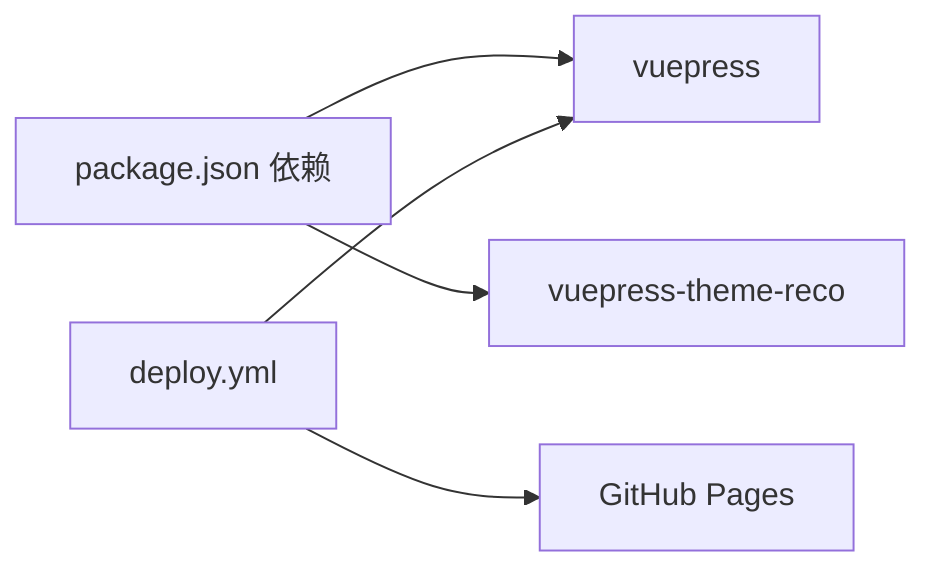

图表来源
- [package.json:13-16](file://package.json#L13-L16)
- [.github/workflows/deploy.yml:18-31](file://.github/workflows/deploy.yml#L18-L31)

章节来源
- [package.json:13-16](file://package.json#L13-L16)
- [.github/workflows/deploy.yml:18-31](file://.github/workflows/deploy.yml#L18-L31)

## 性能考量
- 构建性能：版本、Loader、解析、DLL、Worker 池、增量编译、合理 devtool、避免生产优化步骤、关闭路径信息
- 代码分割：入口分离、动态导入、SplitChunks、Prefetch/Preload
- Tree Shaking：usedExports、sideEffects、模块连接
- 资源优化：内联阈值、公共路径、输出清理、对比写入
- 运行时优化：浏览器架构与回流/重绘优化

章节来源
- [docs/frontend-advanced/webpack/config.md:638-800](file://docs/frontend-advanced/webpack/config.md#L638-L800)
- [docs/frontend-base/browser/architecture.md:407-446](file://docs/frontend-base/browser/architecture.md#L407-L446)

## 故障排查指南
- 构建失败：检查模式与环境变量、解析规则、Loader 配置、Side Effects 标记
- 资源加载异常：核对 publicPath、输出目录、静态资源内联阈值
- 路由导航问题：检查导航守卫返回值、动态路由参数与正则匹配
- 状态异常：确认 Store 初始化、$patch 使用、订阅生命周期
- CI 部署失败：核对 Node 版本、依赖安装、构建产物与分支权限

章节来源
- [docs/frontend-advanced/webpack/config.md:136-275](file://docs/frontend-advanced/webpack/config.md#L136-L275)
- [docs/vue3/vue-router/grammar.md:59-128](file://docs/vue3/vue-router/grammar.md#L59-L128)
- [docs/vue3/pinia/grammar.md:108-173](file://docs/vue3/pinia/grammar.md#L108-L173)
- [.github/workflows/deploy.yml:18-31](file://.github/workflows/deploy.yml#L18-L31)

## 结论
本项目以 VuePress 为主题与工程化支撑，结合前端架构设计与工程化文档，形成一套可复用、可演进的前端知识与实践体系。通过明确的模块划分、清晰的目录组织、规范的技术选型与完善的 CI/CD 流程，项目在可管理性、稳定性与可扩展性方面具备良好基础。建议持续沉淀架构演进经验，完善监控与报警体系，强化代码规范与提交规范，推动前端工程化水平稳步提升。

## 附录
- 架构演进与重构最佳实践
  - 以“可衡量收益”为导向，优先解决高频痛点
  - 采用渐进式重构，避免大规模推倒重来
  - 建立监控与报警，前置发现线上问题
  - 强化规范与工具链，降低技术债积累
  - 以文档驱动工程化，沉淀可复用模式与组件

章节来源
- [docs/frontend-advanced/project-architecture/introduction.md:7-112](file://docs/frontend-advanced/project-architecture/introduction.md#L7-L112)