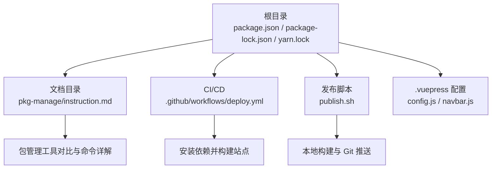
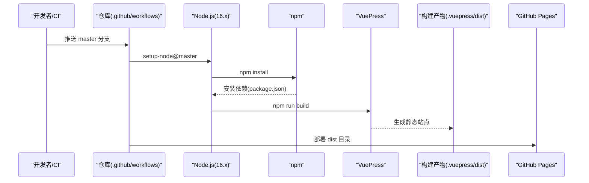
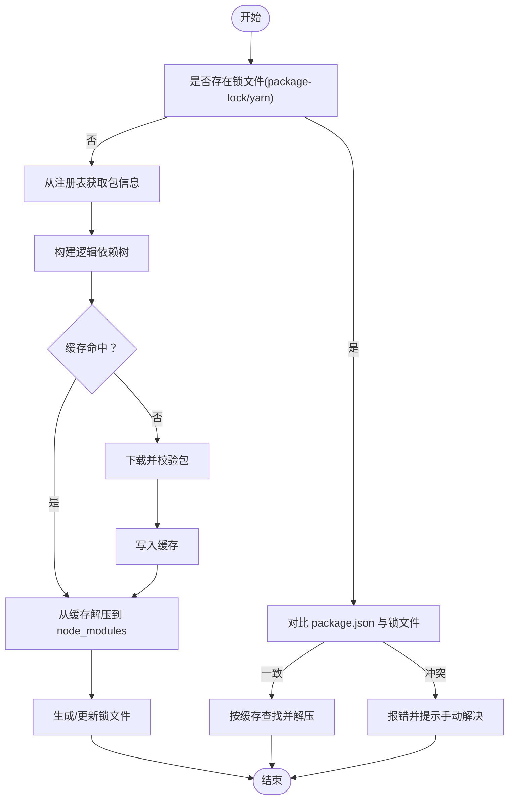
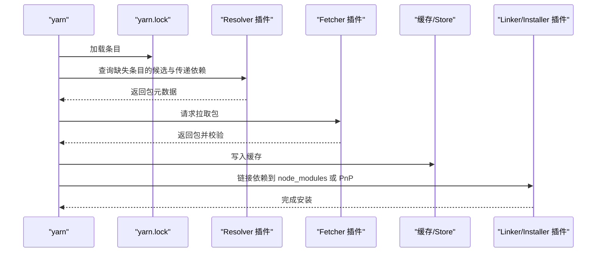
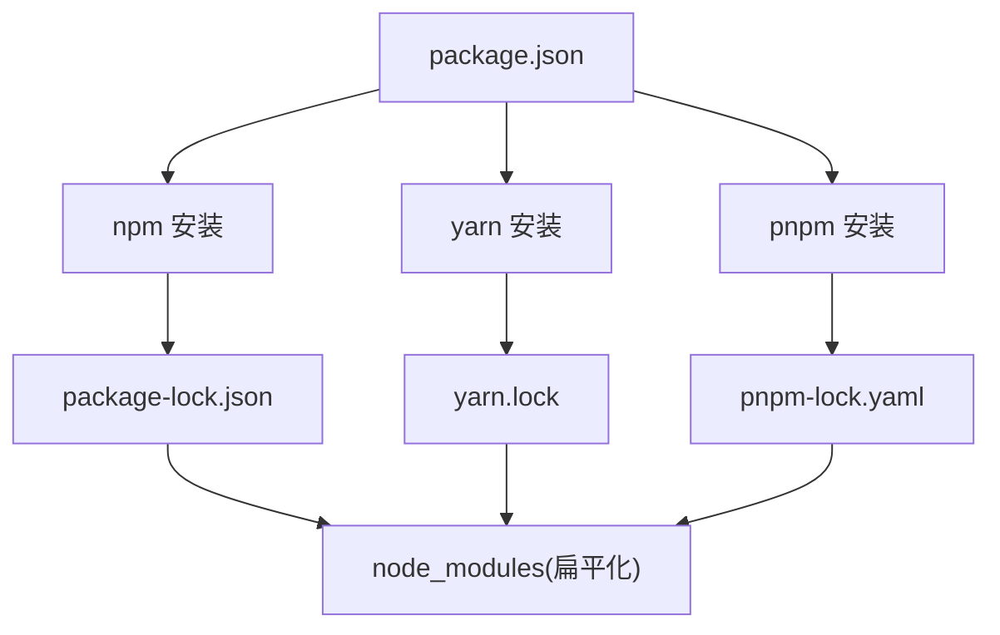

# 包管理工具

<cite>
**本文引用的文件**
- [package.json](file://package.json)
- [package-lock.json](file://package-lock.json)
- [yarn.lock](file://yarn.lock)
- [publish.sh](file://publish.sh)
- [.github/workflows/deploy.yml](file://.github/workflows/deploy.yml)
- [.vuepress/config.js](file://.vuepress/config.js)
- [.vuepress/navbar.js](file://.vuepress/navbar.js)
- [docs/frontend-advanced/pkg-manage/instruction.md](file://docs/frontend-advanced/pkg-manage/instruction.md)
</cite>

## 目录
1. [简介](#简介)
2. [项目结构](#项目结构)
3. [核心组件](#核心组件)
4. [架构总览](#架构总览)
5. [详细组件分析](#详细组件分析)
6. [依赖关系分析](#依赖关系分析)
7. [性能考量](#性能考量)
8. [故障排除指南](#故障排除指南)
9. [结论](#结论)
10. [附录](#附录)

## 简介
本学习文档围绕包管理工具展开，结合本仓库的实际配置与文档，系统讲解 npm、yarn、pnpm 的使用方法、命令行操作、依赖管理、版本控制、脚本执行与发布流程，并提供 CI/CD 集成、故障排除与性能优化建议。读者无需具备深厚的包管理背景，即可通过循序渐进的内容掌握现代前端工程中的包管理最佳实践。

## 项目结构
本仓库是一个基于 VuePress 的静态站点，包管理相关的关键文件集中在根目录与文档目录中：
- 根目录包含 npm 的 package.json、package-lock.json，以及 Yarn 的 yarn.lock，体现两种锁文件的存在与共存。
- 文档目录包含“前端包管理工具”专题文档，涵盖 npm、yarn、pnpm 的命令、配置、安装流程与对比。
- GitHub Actions 工作流负责在推送 master 分支时自动安装依赖并构建部署。
- 发布脚本 publish.sh 展示了本地构建与 Git 推送的典型流程。

图表来源
- [package.json:1-17](file://package.json#L1-L17)
- [package-lock.json:1-20](file://package-lock.json#L1-L20)
- [yarn.lock:1-20](file://yarn.lock#L1-L20)
- [.github/workflows/deploy.yml:1-36](file://.github/workflows/deploy.yml#L1-L36)
- [publish.sh:1-20](file://publish.sh#L1-L20)
- [.vuepress/config.js:1-18](file://.vuepress/config.js#L1-L18)
- [.vuepress/navbar.js:1-40](file://.vuepress/navbar.js#L1-L40)
- [docs/frontend-advanced/pkg-manage/instruction.md:1-40](file://docs/frontend-advanced/pkg-manage/instruction.md#L1-L40)

章节来源
- [package.json:1-17](file://package.json#L1-L17)
- [.github/workflows/deploy.yml:1-36](file://.github/workflows/deploy.yml#L1-L36)
- [publish.sh:1-20](file://publish.sh#L1-L20)
- [.vuepress/config.js:1-18](file://.vuepress/config.js#L1-L18)
- [.vuepress/navbar.js:1-40](file://.vuepress/navbar.js#L1-L40)
- [docs/frontend-advanced/pkg-manage/instruction.md:1-40](file://docs/frontend-advanced/pkg-manage/instruction.md#L1-L40)

## 核心组件
- 包清单与脚本
  - package.json 定义了项目名称、版本、描述、脚本（dev/start/build）与依赖（vuepress、主题等）。
- 锁文件
  - package-lock.json 与 yarn.lock 分别记录 npm 与 Yarn 的精确依赖树与哈希，保障安装一致性。
- CI/CD
  - GitHub Actions 在 Ubuntu Runner 上安装 Node 16.x，执行 npm install 与 npm run build，随后部署到 GitHub Pages。
- 发布脚本
  - publish.sh 先执行构建，再进入构建产物目录进行 Git 初始化、提交与推送，最后回到根目录提交改动。
- 文档
  - pkg-manage/instruction.md 提供 npm/yarn/pnpm 的命令、配置、安装流程、工作区、发布与对比等内容。

章节来源
- [package.json:8-16](file://package.json#L8-L16)
- [package-lock.json:1-20](file://package-lock.json#L1-L20)
- [yarn.lock:1-20](file://yarn.lock#L1-L20)
- [.github/workflows/deploy.yml:18-36](file://.github/workflows/deploy.yml#L18-L36)
- [publish.sh:1-20](file://publish.sh#L1-L20)
- [docs/frontend-advanced/pkg-manage/instruction.md:1-40](file://docs/frontend-advanced/pkg-manage/instruction.md#L1-L40)

## 架构总览
下图展示了从“本地开发/CI 触发”到“站点构建与发布”的整体流程，以及包管理工具在其中的角色。

图表来源
- [.github/workflows/deploy.yml:18-36](file://.github/workflows/deploy.yml#L18-L36)
- [package.json:8-12](file://package.json#L8-L12)
- [.vuepress/config.js:1-18](file://.vuepress/config.js#L1-L18)

章节来源
- [.github/workflows/deploy.yml:1-36](file://.github/workflows/deploy.yml#L1-L36)
- [package.json:8-12](file://package.json#L8-L12)
- [.vuepress/config.js:1-18](file://.vuepress/config.js#L1-L18)

## 详细组件分析

### npm 组件分析
- 基本命令与生命周期
  - 安装/更新/卸载：install、ci、update、uninstall、outdated。
  - 发布与版本：publish、version、dist-tags。
  - 其他：cache、docs、exec、explain、init、link、ping、pkg、whoami、profile 等。
- 配置与优先级
  - .npmrc 配置项丰富，优先级从项目级到全局级逐层覆盖；支持环境变量 npm_config_*。
- 安装过程
  - 无锁文件：从注册表获取包信息，构建逻辑依赖树，缓存命中则解压，否则下载校验后缓存并解压，最终生成锁文件。
  - 有锁文件：若 package.json 与锁文件冲突则报错，否则直接按缓存查找与解压。
- 工作区
  - 支持在根包中管理多个本地包，自动符号链接，便于 monorepo 场景。

图表来源
- [docs/frontend-advanced/pkg-manage/instruction.md:884-917](file://docs/frontend-advanced/pkg-manage/instruction.md#L884-L917)

章节来源
- [docs/frontend-advanced/pkg-manage/instruction.md:498-917](file://docs/frontend-advanced/pkg-manage/instruction.md#L498-L917)

### yarn 组件分析
- 安装与解析
  - install 支持 --json、--immutable、--immutable-cache、--refresh-lockfile、--check-cache、--check-resolutions 等选项。
  - 解析阶段：加载 lockfile 条目，运行核心算法找出缺失条目，通过 Resolver 插件查询候选与传递依赖，构建“虚拟包”树。
  - 获取阶段：通过 Fetcher 插件查询并拉取包，校验后写入缓存。
  - 链接阶段：根据依赖关系树，使用 Linker/Installer 插件将包链接到 node_modules 或 PnP。
- PnP（Plug’n’Play）
  - 通过 .pnp.cjs 映射包名/版本到磁盘位置与依赖列表，避免传统 node_modules 的大量文件与 I/O 开销。
- 命令与特性
  - add、bin、cache clean、constraints、dedupe、dlx、exec、info、init、npm tag、patch、set version、up、workspace 等。
  - .yarnrc.yml 支持 cacheFolder、compressionLevel、defaultSemverRangePrefix、enableGlobalCache、enableImmutableCache、enableMirror、enableNetwork、globalFolder、installStatePath、lockfileFilename、NodeLinker 等配置。

图表来源
- [docs/frontend-advanced/pkg-manage/instruction.md:1896-1915](file://docs/frontend-advanced/pkg-manage/instruction.md#L1896-L1915)

章节来源
- [docs/frontend-advanced/pkg-manage/instruction.md:1454-1915](file://docs/frontend-advanced/pkg-manage/instruction.md#L1454-L1915)

### pnpm 组件分析
- 安装策略
  - 统一存储在 store，使用硬链接/软链接减少磁盘占用；扁平化 node_modules 结构，避免幽灵依赖风险。
- 命令与配置
  - add、install（i）、run、update、remove、link、dlx、licenses list 等。
  - 支持 --force、--offline、--prefer-offline、--prod/--dev、--no-optional、--lockfile-only 等选项。
- 工作区
  - 支持 workspace，递归安装与管理依赖，可禁用递归安装。
- 与 npm/yarn 的对比
  - 在空间占用、node_modules 结构、安全性（幽灵依赖）等方面各有优劣。

章节来源
- [docs/frontend-advanced/pkg-manage/instruction.md:918-1488](file://docs/frontend-advanced/pkg-manage/instruction.md#L918-L1488)

### 锁文件与版本控制
- 锁文件的作用
  - package-lock.json（npm）、yarn.lock（yarn）记录精确版本与哈希，确保不同环境安装一致性。
- 与 .npmrc 的关系
  - .npmrc 的 registry、engineStrict、package-lock、package-lock-only、loglevel 等影响安装行为与锁文件生成。
- 版本范围与标签
  - 支持 ~、^、精确版本与 dist-tags（如 beta），配合 publish 与 dist-tag add/remove 实现灰度发布与版本管理。

章节来源
- [docs/frontend-advanced/pkg-manage/instruction.md:498-722](file://docs/frontend-advanced/pkg-manage/instruction.md#L498-L722)

### 脚本执行与发布
- package.json 脚本
  - dev/start/build 三类常用脚本，分别用于开发、启动与构建。
- 发布脚本 publish.sh
  - 先构建，再进入构建产物目录初始化 Git 并推送至页面分支，最后回到根目录提交改动。
- CI/CD 集成
  - GitHub Actions 在 Ubuntu Runner 上安装 Node 16.x，执行 npm install 与 npm run build，部署到 GitHub Pages。

章节来源
- [package.json:8-12](file://package.json#L8-L12)
- [publish.sh:1-20](file://publish.sh#L1-L20)
- [.github/workflows/deploy.yml:18-36](file://.github/workflows/deploy.yml#L18-L36)

## 依赖关系分析
- 依赖来源与安装策略
  - npm 安装包可来自 npm 注册表、本地包、Git 仓库；安装策略受锁文件与 .npmrc 影响。
  - yarn/pnpm 亦支持类似来源与策略，且各自提供独特的安装与链接机制。
- 锁文件优先级
  - 若存在 package-lock.json、yarn.lock 或 shrinkwrap，则安装过程优先依据锁文件，避免版本漂移。
- 依赖树与扁平化
  - npm/yarn/pnpm 均采用扁平化策略，但 pnpm 通过 store 与硬链接进一步降低空间占用；yarn PnP 通过 .pnp.cjs 替代 node_modules。

图表来源
- [package.json:13-16](file://package.json#L13-L16)
- [package-lock.json:1-20](file://package-lock.json#L1-L20)
- [yarn.lock:1-20](file://yarn.lock#L1-L20)
- [docs/frontend-advanced/pkg-manage/instruction.md:1916-1952](file://docs/frontend-advanced/pkg-manage/instruction.md#L1916-L1952)

章节来源
- [package.json:13-16](file://package.json#L13-L16)
- [package-lock.json:1-20](file://package-lock.json#L1-L20)
- [yarn.lock:1-20](file://yarn.lock#L1-L20)
- [docs/frontend-advanced/pkg-manage/instruction.md:1916-1952](file://docs/frontend-advanced/pkg-manage/instruction.md#L1916-L1952)

## 性能考量
- 安装速度
  - pnpm 通过 store 与硬链接显著减少磁盘占用与 I/O；yarn PnP 减少 node_modules 文件数量与解析开销。
- 缓存与离线
  - npm 的缓存目录与 yarn 的全局/本地缓存均可加速安装；pnpm 的 offline/prefer-offline 选项支持离线安装。
- CI/CD 最佳实践
  - 固定 Node 版本（如 16.x），复用缓存，避免不必要的网络请求；在 CI 中使用 --frozen-lockfile 或 --immutable 保证一致性。

章节来源
- [docs/frontend-advanced/pkg-manage/instruction.md:918-1488](file://docs/frontend-advanced/pkg-manage/instruction.md#L918-L1488)
- [.github/workflows/deploy.yml:18-36](file://.github/workflows/deploy.yml#L18-L36)

## 故障排除指南
- 锁文件冲突
  - 现象：package.json 与锁文件版本不一致导致安装失败。
  - 处理：根据提示手动调整版本范围或删除锁文件后重新安装。
- 幽灵依赖
  - 现象：项目中可引用未在清单中声明的依赖。
  - 处理：pnpm 通过扁平化与 store 降低风险；yarn PnP 通过 .pnp.cjs 明确依赖映射。
- CI 安装失败
  - 现象：CI 中因锁文件更新或网络限制导致安装失败。
  - 处理：使用 --frozen-lockfile 或 --immutable；在 .yarnrc.yml 中禁用网络或启用镜像。
- 发布与版本标签
  - 现象：发布后无法通过 dist-tags 访问特定版本。
  - 处理：使用 npm dist-tag add/remove 或 yarn npm tag 管理标签。

章节来源
- [docs/frontend-advanced/pkg-manage/instruction.md:884-917](file://docs/frontend-advanced/pkg-manage/instruction.md#L884-L917)
- [docs/frontend-advanced/pkg-manage/instruction.md:1454-1915](file://docs/frontend-advanced/pkg-manage/instruction.md#L1454-L1915)
- [.github/workflows/deploy.yml:18-36](file://.github/workflows/deploy.yml#L18-L36)

## 结论
本仓库以 VuePress 为主题，结合 npm/yarn/pnpm 的命令、配置与安装流程，提供了从开发到发布的完整包管理实践。通过锁文件、CI/CD 与发布脚本，项目实现了可复现的构建与稳定部署。建议在团队中统一包管理器与版本策略，充分利用工作区、PnP、store 等特性提升开发效率与稳定性。

## 附录
- 常用命令速查
  - npm：install、ci、update、uninstall、outdated、publish、version、dist-tag、cache、exec、pkg、whoami、profile。
  - yarn：install、add、bin、cache clean、constraints、dedupe、dlx、exec、info、init、npm tag、patch、set version、up、workspace。
  - pnpm：add、install、run、update、remove、link、dlx、licenses list、workspaces。
- 配置参考
  - .npmrc：registry、engine-strict、package-lock、package-lock-only、loglevel、progress、cache、prefix、workspaces 等。
  - .yarnrc.yml：cacheFolder、compressionLevel、defaultSemverRangePrefix、enableGlobalCache、enableImmutableCache、enableMirror、enableNetwork、globalFolder、installStatePath、lockfileFilename、NodeLinker。

章节来源
- [docs/frontend-advanced/pkg-manage/instruction.md:498-1952](file://docs/frontend-advanced/pkg-manage/instruction.md#L498-L1952)