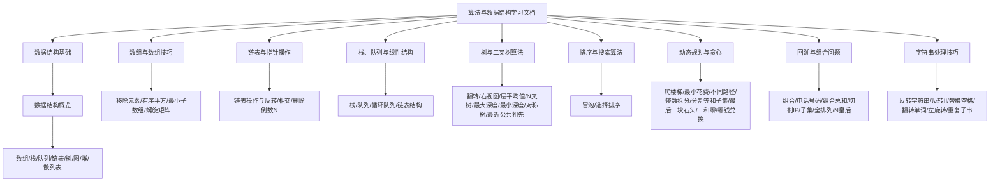
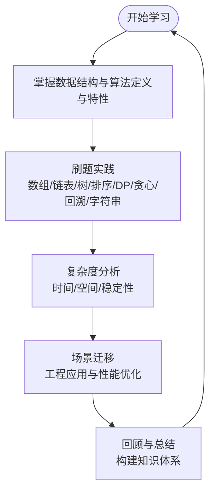
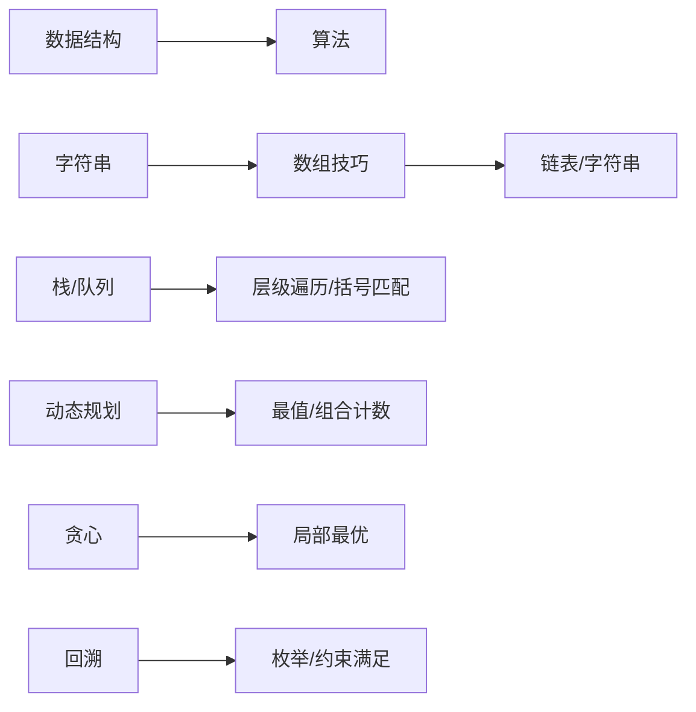

# 算法与数据结构

<cite>
**本文引用的文件**
- [Algorithm.md](file://docs/frontend-advanced/algorithm/Algorithm.md)
- [structure.md](file://docs/frontend-advanced/algorithm/structure.md)
- [array.md](file://docs/frontend-advanced/algorithm/array.md)
- [linked-list.md](file://docs/frontend-advanced/algorithm/linked-list.md)
- [stack_queue.md](file://docs/frontend-advanced/algorithm/stack_queue.md)
- [tree-example.md](file://docs/frontend-advanced/algorithm/tree-example.md)
- [dynamic-programming.md](file://docs/frontend-advanced/algorithm/dynamic-programming.md)
- [greedy.md](file://docs/frontend-advanced/algorithm/greedy.md)
- [bubbleSort.md](file://docs/frontend-advanced/algorithm/bubbleSort.md)
- [selectionSort.md](file://docs/frontend-advanced/algorithm/selectionSort.md)
- [back-trace.md](file://docs/frontend-advanced/algorithm/back-trace.md)
- [string.md](file://docs/frontend-advanced/algorithm/string.md)
- [design1.md](file://docs/frontend-advanced/algorithm/design1.md)
- [js_data_structure.md](file://docs/interview/JavaScript/js_data_structure.md)
</cite>

## 目录
1. [简介](#简介)
2. [项目结构](#项目结构)
3. [核心组件](#核心组件)
4. [架构总览](#架构总览)
5. [详细组件分析](#详细组件分析)
6. [依赖分析](#依赖分析)
7. [性能考量](#性能考量)
8. [故障排查指南](#故障排查指南)
9. [结论](#结论)
10. [附录](#附录)

## 简介
本学习文档围绕算法与数据结构展开，系统覆盖数组、链表、栈队列、树、图等基础数据结构，以及排序算法、搜索算法、动态规划、贪心算法、回溯等经典算法。每个主题均包含原理说明、代码实现路径、时间与空间复杂度分析、应用场景与练习建议，帮助读者建立系统性的算法思维与工程实践能力。

## 项目结构
本仓库中与算法与数据结构相关的文档主要集中在前端高级算法专题与面试JavaScript数据结构专题中，形成“理论—结构—算法—实践”的完整学习路径。

图表来源
- [structure.md:1-80](file://docs/frontend-advanced/algorithm/structure.md#L1-L80)
- [array.md:1-161](file://docs/frontend-advanced/algorithm/array.md#L1-L161)
- [linked-list.md:1-342](file://docs/frontend-advanced/algorithm/linked-list.md#L1-L342)
- [stack_queue.md:1-283](file://docs/frontend-advanced/algorithm/stack_queue.md#L1-L283)
- [tree-example.md:1-532](file://docs/frontend-advanced/algorithm/tree-example.md#L1-L532)
- [bubbleSort.md:1-104](file://docs/frontend-advanced/algorithm/bubbleSort.md#L1-L104)
- [selectionSort.md:1-88](file://docs/frontend-advanced/algorithm/selectionSort.md#L1-L88)
- [dynamic-programming.md:1-210](file://docs/frontend-advanced/algorithm/dynamic-programming.md#L1-L210)
- [greedy.md:1-380](file://docs/frontend-advanced/algorithm/greedy.md#L1-L380)
- [back-trace.md:1-433](file://docs/frontend-advanced/algorithm/back-trace.md#L1-L433)
- [string.md:1-207](file://docs/frontend-advanced/algorithm/string.md#L1-L207)

章节来源
- [structure.md:1-80](file://docs/frontend-advanced/algorithm/structure.md#L1-L80)

## 核心组件
- 数据结构基础：数组、栈、队列、链表、树、图、堆、散列表的定义、特性与区别。
- 算法与实现：数组技巧（双指针、滑动窗口）、链表操作（反转、相交、删除倒数N）、栈队列应用（括号匹配、LRU）、树的遍历与性质（层序、最大/最小深度、对称性、最近公共祖先）、排序（冒泡、选择）、动态规划（爬楼梯、不同路径、分割等和子集、最后一块石头、一和零、零钱兑换）、贪心（最大子数组和、跳跃游戏、加油站、划分字母区间、合并区间）、回溯（组合、子集、排列、N皇后、恢复IP）、字符串处理（反转、替换空格、翻转单词、左旋转、重复子串）。

章节来源
- [Algorithm.md:1-60](file://docs/frontend-advanced/algorithm/Algorithm.md#L1-L60)
- [structure.md:23-80](file://docs/frontend-advanced/algorithm/structure.md#L23-L80)
- [js_data_structure.md:1-78](file://docs/interview/JavaScript/js_data_structure.md#L1-L78)

## 架构总览
本学习文档采用“知识—实践—验证”的闭环结构：先理解数据结构与算法的定义与特性，再通过典型题目掌握实现与复杂度分析，最后以练习巩固与迁移应用。

## 详细组件分析

### 数据结构总览
- 定义与分类：线性结构（数组、栈、队列、链表）与非线性结构（树、图、堆）；散列表通过哈希函数实现高效存取。
- 特性与差异：数组连续内存、随机访问；栈/队列受限线性表；链表动态扩展、插入删除高效；树/图表达层次与关系；堆满足堆序性质；散列表处理冲突。
- 应用场景：缓存（LRU）、编译器括号匹配、广度优先搜索、二叉搜索树查询、哈希检索等。

章节来源
- [structure.md:3-80](file://docs/frontend-advanced/algorithm/structure.md#L3-L80)
- [js_data_structure.md:22-78](file://docs/interview/JavaScript/js_data_structure.md#L22-L78)

### 数组与数组技巧
- 原理与实现要点：双指针、滑动窗口、对撞指针、前缀和/单调性。
- 典型题目与路径：
  - 移除元素：[removeElement 实现:25-37](file://docs/frontend-advanced/algorithm/array.md#L25-L37)
  - 有序数组的平方：[sortedSquares 实现:53-73](file://docs/frontend-advanced/algorithm/array.md#L53-L73)
  - 长度最小的子数组：[minSubArrayLen 实现:89-109](file://docs/frontend-advanced/algorithm/array.md#L89-L109)
  - 螺旋矩阵：[generateMatrix 实现:119-161](file://docs/frontend-advanced/algorithm/array.md#L119-L161)
- 复杂度与空间：原地修改多为 O(1) 额外空间；滑动窗口多为 O(n) 时间。
- 场景：窗口类问题、对撞指针、矩阵构造。

章节来源
- [array.md:1-161](file://docs/frontend-advanced/algorithm/array.md#L1-L161)

### 链表与指针操作
- 原理与技巧：画图、虚拟头、快慢指针、穿针引线、先穿再排后判空。
- 典型题目与路径：
  - 链表操作类：[链表类与操作示例:80-215](file://docs/frontend-advanced/algorithm/linked-list.md#L80-L215)
  - 反转链表：[reverseList 实现:225-237](file://docs/frontend-advanced/algorithm/linked-list.md#L225-L237)
  - 两两交换节点：[swapPairs 实现:247-260](file://docs/frontend-advanced/algorithm/linked-list.md#L247-L260)
  - 删除倒数第 N 个节点：[removeNthFromEnd 实现:270-289](file://docs/frontend-advanced/algorithm/linked-list.md#L270-L289)
  - 链表相交：[getIntersectionNode 实现:299-341](file://docs/frontend-advanced/algorithm/linked-list.md#L299-L341)
- 复杂度与空间：原地操作 O(1) 额外空间；时间 O(n)。
- 场景：链表反转、合并、环检测、相交判断、倒数第 K 个节点。

章节来源
- [linked-list.md:1-342](file://docs/frontend-advanced/algorithm/linked-list.md#L1-L342)

### 栈、队列与线性结构
- 栈：后进先出，典型应用括号匹配、函数调用、表达式求值。
- 队列：先进先出，典型应用广度优先搜索、循环队列、LRU 缓存。
- 链表：插入/删除 O(1)，查找 O(n)，适合频繁变动场景。
- 典型实现与路径：
  - 栈类：[Stack 类实现:13-62](file://docs/frontend-advanced/algorithm/stack_queue.md#L13-L62)
  - 队列类：[Queue 类实现:78-95](file://docs/frontend-advanced/algorithm/stack_queue.md#L78-L95)
  - 循环队列：[循环队列实现:107-138](file://docs/frontend-advanced/algorithm/stack_queue.md#L107-L138)
  - 链表节点：[Node 类实现:152-159](file://docs/frontend-advanced/algorithm/stack_queue.md#L152-L159)
- 复杂度与空间：栈/队列基本操作 O(1)；循环队列空间复用避免假溢。
- 场景：LRU 缓存、括号匹配、层级遍历。

章节来源
- [stack_queue.md:1-283](file://docs/frontend-advanced/algorithm/stack_queue.md#L1-L283)

### 树与二叉树算法
- 基础与遍历：前序/中序/后序/层序；二叉搜索树性质；平衡/完全二叉树。
- 典型题目与路径：
  - 翻转二叉树：[invertTree 实现:11-24](file://docs/frontend-advanced/algorithm/tree-example.md#L11-L24)
  - 右视图：[rightSideView 实现:34-54](file://docs/frontend-advanced/algorithm/tree-example.md#L34-L54)
  - 层平均值：[averageOfLevels 实现:63-82](file://docs/frontend-advanced/algorithm/tree-example.md#L63-L82)
  - N 叉树层序：[levelOrder 实现:94-119](file://docs/frontend-advanced/algorithm/tree-example.md#L94-L119)
  - 最大/最小深度：[maxDepth/minDepth 实现:197-260](file://docs/frontend-advanced/algorithm/tree-example.md#L197-L260)
  - 对称二叉树：[isSymmetric 实现:270-288](file://docs/frontend-advanced/algorithm/tree-example.md#L270-L288)
  - 最近公共祖先：[lowestCommonAncestor 实现:516-531](file://docs/frontend-advanced/algorithm/tree-example.md#L516-L531)
- 复杂度与空间：层序遍历 O(n) 时间；递归深度取决于树高。
- 场景：层级遍历、路径查找、树的性质判定、BST 查询。

章节来源
- [tree-example.md:1-532](file://docs/frontend-advanced/algorithm/tree-example.md#L1-L532)

### 排序算法
- 冒泡排序：相邻比较交换，稳定，时间 O(n^2)，空间 O(1)。
  - 实现路径：[冒泡排序实现:49-63](file://docs/frontend-advanced/algorithm/bubbleSort.md#L49-L63)
  - 优化：提前结束、记录最后交换位置。
- 选择排序：每轮选择最小值，不稳定，时间 O(n^2)，空间 O(1)。
  - 实现路径：[选择排序实现:43-64](file://docs/frontend-advanced/algorithm/selectionSort.md#L43-L64)
- 场景：教学演示、小规模数据、稳定性要求。

章节来源
- [bubbleSort.md:1-104](file://docs/frontend-advanced/algorithm/bubbleSort.md#L1-L104)
- [selectionSort.md:1-88](file://docs/frontend-advanced/algorithm/selectionSort.md#L1-L88)

### 动态规划
- 思想与步骤：最优子结构、重叠子问题、状态转移、初始化、遍历顺序、举例推导。
- 典型题目与路径：
  - 爬楼梯：[climbStairs 实现:25-35](file://docs/frontend-advanced/algorithm/dynamic-programming.md#L25-L35)
  - 最小花费爬楼梯：[minCostClimbingStairs 实现:43-54](file://docs/frontend-advanced/algorithm/dynamic-programming.md#L43-L54)
  - 不同路径：[uniquePaths 实现:62-80](file://docs/frontend-advanced/algorithm/dynamic-programming.md#L62-L80)
  - 整数拆分：[integerBreak 实现:88-100](file://docs/frontend-advanced/algorithm/dynamic-programming.md#L88-L100)
  - 分割等和子集：[canPartition 实现:108-131](file://docs/frontend-advanced/algorithm/dynamic-programming.md#L108-L131)
  - 最后一块石头的重量 II：[lastStoneWeightII 实现:139-159](file://docs/frontend-advanced/algorithm/dynamic-programming.md#L139-L159)
  - 一和零：[findMaxForm 实现:167-188](file://docs/frontend-advanced/algorithm/dynamic-programming.md#L167-L188)
  - 零钱兑换 II：[change 实现:196-209](file://docs/frontend-advanced/algorithm/dynamic-programming.md#L196-L209)
- 复杂度与空间：多数二维 DP 为 O(mn) 或 O(target) 空间。
- 场景：最值问题、组合计数、背包变形、状态压缩。

章节来源
- [dynamic-programming.md:1-210](file://docs/frontend-advanced/algorithm/dynamic-programming.md#L1-L210)
- [design1.md:44-86](file://docs/frontend-advanced/algorithm/design1.md#L44-L86)

### 贪心算法
- 思想与步骤：局部最优推全局最优，策略设计与正确性证明。
- 典型题目与路径：
  - 分发饼干：[findContentChildren 实现:22-40](file://docs/frontend-advanced/algorithm/greedy.md#L22-L40)
  - 最大子数组和：[maxSubArray 实现:48-63](file://docs/frontend-advanced/algorithm/greedy.md#L48-L63)
  - 买卖股票最佳时机 II：[maxProfit 实现:71-83](file://docs/frontend-advanced/algorithm/greedy.md#L71-L83)
  - 跳跃游戏：[canJump 实现:91-103](file://docs/frontend-advanced/algorithm/greedy.md#L91-L103)
  - 跳跃游戏 II：[jump 实现:111-126](file://docs/frontend-advanced/algorithm/greedy.md#L111-L126)
  - K 次取反最大化：[largestSumAfterKNegations 实现:134-149](file://docs/frontend-advanced/algorithm/greedy.md#L134-L149)
  - 加油站：[canCompleteCircuit 实现:157-177](file://docs/frontend-advanced/algorithm/greedy.md#L157-L177)
  - 分发糖果：[candy 实现:185-207](file://docs/frontend-advanced/algorithm/greedy.md#L185-L207)
  - 柠檬水找零：[lemonadeChange 实现:215-244](file://docs/frontend-advanced/algorithm/greedy.md#L215-L244)
  - 用最少箭引爆气球：[findMinArrowShots 实现:253-269](file://docs/frontend-advanced/algorithm/greedy.md#L253-L269)
  - 无重叠区间：[eraseOverlapIntervals 实现:277-295](file://docs/frontend-advanced/algorithm/greedy.md#L277-L295)
  - 划分字母区间：[partitionLabels 实现:303-323](file://docs/frontend-advanced/algorithm/greedy.md#L303-L323)
  - 合并区间：[merge 实现:331-349](file://docs/frontend-advanced/algorithm/greedy.md#L331-L349)
  - 单调递增的数字：[monotoneIncreasingDigits 实现:357-379](file://docs/frontend-advanced/algorithm/greedy.md#L357-L379)
- 复杂度与空间：多数 O(n) 时间，O(1)/O(n) 空间。
- 场景：区间调度、贪心构造、局部最优策略。

章节来源
- [greedy.md:1-380](file://docs/frontend-advanced/algorithm/greedy.md#L1-L380)

### 回溯与组合问题
- 思想与模板：树形搜索、三部曲（参数/终止条件/遍历过程）、剪枝优化。
- 典型题目与路径：
  - 组合：[combine 实现:91-111](file://docs/frontend-advanced/algorithm/back-trace.md#L91-L111)
  - 电话号码的字母组合：[letterCombinations 实现:119-145](file://docs/frontend-advanced/algorithm/back-trace.md#L119-L145)
  - 组合总和：[combinationSum 实现:154-177](file://docs/frontend-advanced/algorithm/back-trace.md#L154-L177)
  - 组合总和 II：[combinationSum2 实现:185-222](file://docs/frontend-advanced/algorithm/back-trace.md#L185-L222)
  - 切割复原 IP 地址：[restoreIpAddresses 实现:230-254](file://docs/frontend-advanced/algorithm/back-trace.md#L230-L254)
  - 子集：[subsets 实现:262-277](file://docs/frontend-advanced/algorithm/back-trace.md#L262-L277)
  - 子集 II：[subsetsWithDup 实现:285-315](file://docs/frontend-advanced/algorithm/back-trace.md#L285-L315)
  - 全排列：[permute 实现:323-341](file://docs/frontend-advanced/algorithm/back-trace.md#L323-L341)
  - 全排列 II：[permuteUnique 实现:350-379](file://docs/frontend-advanced/algorithm/back-trace.md#L350-L379)
  - N 皇后：[solveNQueens 实现:411-431](file://docs/frontend-advanced/algorithm/back-trace.md#L411-L431)
- 复杂度与空间：指数级搜索空间，常用剪枝降低分支。
- 场景：枚举组合/排列/分割/棋盘约束。

章节来源
- [back-trace.md:1-433](file://docs/frontend-advanced/algorithm/back-trace.md#L1-L433)

### 字符串处理技巧
- 原理与技巧：双指针、原地修改、分段处理、预处理统计。
- 典型题目与路径：
  - 反转字符串：[reverseString 实现:13-24](file://docs/frontend-advanced/algorithm/string.md#L13-L24)
  - 反转字符串 II：[reverseStr 实现:38-48](file://docs/frontend-advanced/algorithm/string.md#L38-L48)
  - 替换空格：[replaceSpace 实现:58-78](file://docs/frontend-advanced/algorithm/string.md#L58-L78)
  - 翻转单词：[reverseWords 实现:93-145](file://docs/frontend-advanced/algorithm/string.md#L93-L145)
  - 左旋转字符串：[reverseLeftWords 实现:155-175](file://docs/frontend-advanced/algorithm/string.md#L155-L175)
  - 重复的子字符串：[repeatedSubstringPattern 实现:185-206](file://docs/frontend-advanced/algorithm/string.md#L185-L206)
- 复杂度与空间：多数 O(n) 时间，原地修改 O(1) 额外空间。
- 场景：文本处理、格式化、模式匹配。

章节来源
- [string.md:1-207](file://docs/frontend-advanced/algorithm/string.md#L1-L207)

### 分而治之与动态规划对比
- 分而治之：分解、解决、合并；递归结构清晰，如归并排序、快速排序、二分搜索。
- 动态规划：最优子结构与重叠子问题；自底向上或记忆化递归；如斐波那契、背包问题。
- 区别：分治子问题独立，DP 子问题重叠并可复用。

章节来源
- [design1.md:3-86](file://docs/frontend-advanced/algorithm/design1.md#L3-L86)

## 依赖分析
- 知识依赖：数据结构是算法实现的基础，算法依赖数据结构的特性（如链表的 O(1) 插入、树的层次遍历、哈希的 O(1) 查找）。
- 实践依赖：数组技巧（双指针/滑动窗口）为链表/字符串问题提供通用解法；栈/队列贯穿括号匹配、层级遍历；回溯/贪心/动态规划分别覆盖组合/局部最优/全局最优。
- 工程依赖：LRU 缓存依赖链表与哈希；编译器括号匹配依赖栈；广度优先搜索依赖队列；二叉搜索树查询依赖 BST 性质。

## 性能考量
- 时间复杂度：数组技巧多为 O(n)；链表操作 O(n)；树的遍历 O(n)；排序 O(n^2) 或更优；DP/贪心多为 O(n) 或 O(nW)。
- 空间复杂度：原地修改 O(1)；递归深度 O(h)；哈希表 O(n)；循环队列 O(k)。
- 稳定性：冒泡稳定，选择不稳定；字符串原地修改避免额外空间。
- 优化策略：双指针减少嵌套、滑动窗口降低重复计算、哈希加速查找、剪枝减少搜索空间。

## 故障排查指南
- 链表问题
  - 环与死循环：使用快慢指针检测环，确保指针推进与判空。
  - 边界条件：头/尾/空链表处理，注意虚拟头统一插入/删除逻辑。
  - 递归栈溢出：迭代替代递归或控制递归深度。
- 栈/队列问题
  - 空队列/满队列：循环队列通过取模避免假溢。
  - 括号匹配：栈空与不匹配即失败。
- 树问题
  - 层序遍历：队列判空与每层长度控制。
  - 最大/最小深度：注意叶子节点定义与提前返回。
- 动态规划
  - 状态定义不清：明确 dp 含义与转移方程。
  - 初始化错误：边界值与第一行/列处理。
  - 遍历顺序：确保子问题先于父问题计算。
- 贪心
  - 局部最优不等价全局最优：严格证明或反例验证。
  - 区间类问题：按结束时间排序常更优。
- 回溯
  - 重复组合：排序+跳过重复元素。
  - 剪枝不足：尽早判断不可能性。
- 字符串
  - 原地修改：从右向左写入避免覆盖未读数据。
  - 空白处理：先清理前后与中间多余空格。

章节来源
- [linked-list.md:52-71](file://docs/frontend-advanced/algorithm/linked-list.md#L52-L71)
- [stack_queue.md:97-141](file://docs/frontend-advanced/algorithm/stack_queue.md#L97-L141)
- [tree-example.md:187-260](file://docs/frontend-advanced/algorithm/tree-example.md#L187-L260)
- [dynamic-programming.md:9-16](file://docs/frontend-advanced/algorithm/dynamic-programming.md#L9-L16)
- [greedy.md:5-13](file://docs/frontend-advanced/algorithm/greedy.md#L5-L13)
- [back-trace.md:29-82](file://docs/frontend-advanced/algorithm/back-trace.md#L29-L82)
- [string.md:115-145](file://docs/frontend-advanced/algorithm/string.md#L115-L145)

## 结论
本学习文档以“数据结构—算法—实践—优化”的主线组织内容，配合典型题目与实现路径，帮助读者建立系统性的算法思维与工程能力。建议按模块逐步深入，重视复杂度分析与边界处理，通过大量练习巩固与迁移应用。

## 附录
- 练习建议
  - 数组：双指针/滑动窗口/对撞指针专项训练。
  - 链表：反转/相交/删除倒数 N/快慢指针。
  - 栈/队列：括号匹配/层级遍历/LRU。
  - 树：层序/路径/对称/最近公共祖先。
  - 排序：冒泡/选择理解复杂度，掌握更优排序。
  - DP：五步法与背包九讲入门。
  - 贪心：区间调度/构造性策略。
  - 回溯：组合/子集/排列/N 皇后。
  - 字符串：原地修改/分段处理/模式匹配。