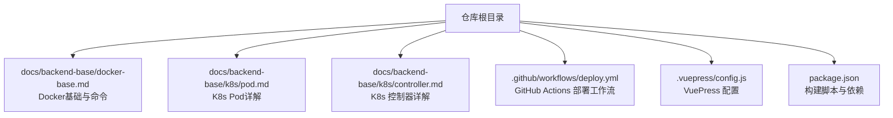
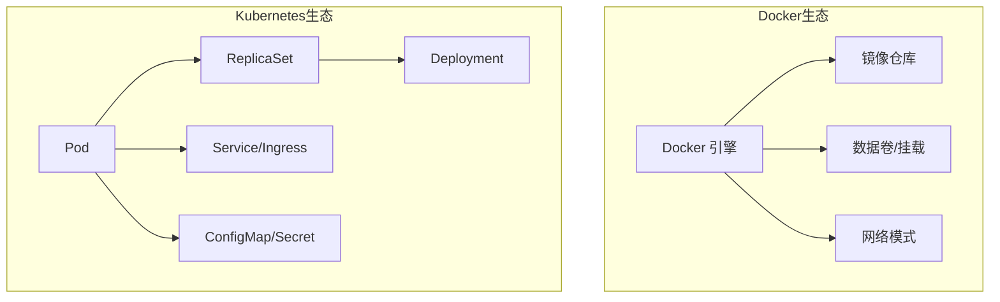
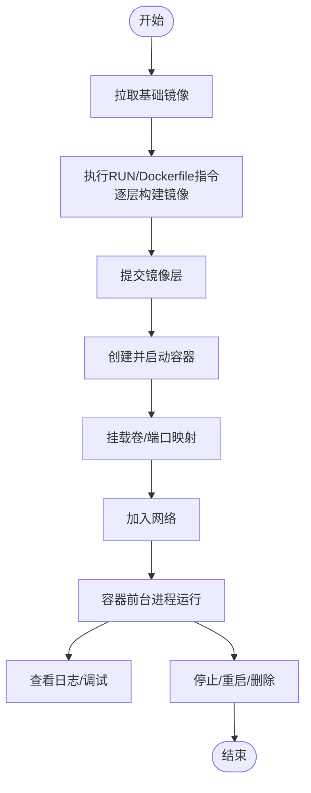
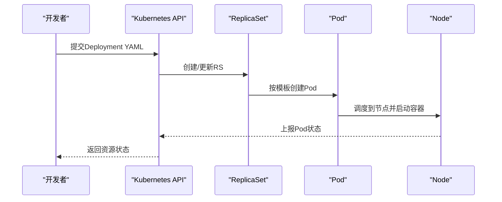
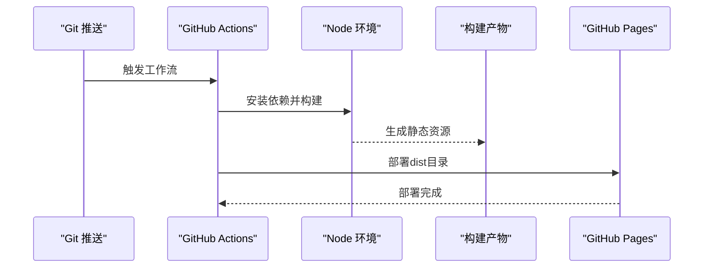
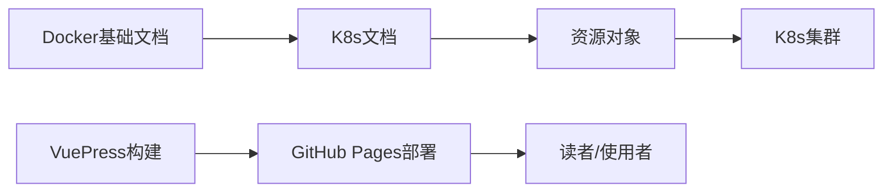

# Docker容器化

<cite>
**本文引用的文件**
- [docker-base.md](file://docs/backend-base/docker-base.md)
- [deploy.yml](file://.github/workflows/deploy.yml)
- [config.js](file://.vuepress/config.js)
- [package.json](file://package.json)
- [pod.md](file://docs/backend-base/k8s/pod.md)
- [controller.md](file://docs/backend-base/k8s/controller.md)
</cite>

## 目录
1. [引言](#引言)
2. [项目结构](#项目结构)
3. [核心组件](#核心组件)
4. [架构总览](#架构总览)
5. [详细组件分析](#详细组件分析)
6. [依赖分析](#依赖分析)
7. [性能考虑](#性能考虑)
8. [故障排查指南](#故障排查指南)
9. [结论](#结论)
10. [附录](#附录)

## 引言
本技术文档围绕Docker容器化展开，结合项目中的Docker基础与Kubernetes相关内容，系统梳理Docker基本概念、镜像与容器管理、网络与数据卷、Dockerfile编写与构建、容器编排（Compose/Kubernetes）等主题，并补充在微服务架构中的应用思路（服务发现、负载均衡、配置管理）。文档同时提供命令参考与实践案例，帮助容器化开发者快速掌握Docker与相关编排能力。

## 项目结构
本仓库为文档站点项目，Docker相关内容集中在后端基础模块的Docker文档中；Kubernetes相关内容位于后端基础模块的K8s子模块中；CI/CD流程由GitHub Actions工作流提供自动化部署支持。VuePress配置与脚本用于本地开发与构建。

图表来源
- [docker-base.md](file://docs/backend-base/docker-base.md)
- [pod.md](file://docs/backend-base/k8s/pod.md)
- [controller.md](file://docs/backend-base/k8s/controller.md)
- [deploy.yml](file://.github/workflows/deploy.yml)
- [config.js](file://.vuepress/config.js)
- [package.json](file://package.json)

章节来源
- [docker-base.md](file://docs/backend-base/docker-base.md)
- [pod.md](file://docs/backend-base/k8s/pod.md)
- [controller.md](file://docs/backend-base/k8s/controller.md)
- [deploy.yml](file://.github/workflows/deploy.yml)
- [config.js](file://.vuepress/config.js)
- [package.json](file://package.json)

## 核心组件
- Docker基础与命令：涵盖镜像、容器、仓库三要素，常用命令（启动/停止/查看/日志/进入/导出/导入/提交）、镜像分层与联合文件系统、容器卷与数据持久化、Dockerfile指令与构建流程、网络模式与操作。
- Kubernetes基础：Pod结构与生命周期、容器探测、钩子函数、资源配额、控制器（ReplicaSet/Deployment）等，为理解容器编排与生产实践提供支撑。
- CI/CD集成：通过GitHub Actions在推送时自动构建与部署静态站点，体现容器化思维在持续交付中的应用。

章节来源
- [docker-base.md](file://docs/backend-base/docker-base.md)
- [pod.md](file://docs/backend-base/k8s/pod.md)
- [controller.md](file://docs/backend-base/k8s/controller.md)
- [deploy.yml](file://.github/workflows/deploy.yml)

## 架构总览
下图展示Docker与Kubernetes在本项目中的角色定位：Docker作为容器运行时与镜像构建工具，Kubernetes作为容器编排平台，二者共同支撑微服务架构下的服务治理与弹性伸缩。

图表来源
- [docker-base.md](file://docs/backend-base/docker-base.md)
- [pod.md](file://docs/backend-base/k8s/pod.md)
- [controller.md](file://docs/backend-base/k8s/controller.md)

## 详细组件分析

### Docker基础与命令
- 三要素：镜像（只读模板）、容器（隔离运行环境）、仓库（镜像存储）。
- 常用命令：镜像列表、搜索、拉取、删除、空间查看；容器启动/停止/重启/删除、日志查看、信息查询、进入容器、文件导出导入、提交为镜像。
- 镜像分层与联合文件系统：镜像由多层组成，容器启动时在镜像层之上叠加可写层，实现隔离与复用。
- 容器卷：用于持久化与跨容器共享数据，支持主机目录挂载与卷继承。
- Dockerfile：构建镜像的脚本，包含FROM、RUN、EXPOSE、WORKDIR、ENV、VOLUME、ADD/COPY、CMD/ENTRYPOINT等指令，遵循从上至下顺序执行与逐层提交原则。
- 网络：默认bridge模式，支持自定义网络、子网与网关；host/none/container模式用于特殊场景。
- 容器编排：Docker Compose用于多服务编排，Kubernetes用于大规模集群编排与高可用。

图表来源
- [docker-base.md](file://docs/backend-base/docker-base.md)

章节来源
- [docker-base.md](file://docs/backend-base/docker-base.md)

### Kubernetes基础（Pod与控制器）
- Pod结构：包含Pause根容器与用户容器，统一IP与网络命名空间；支持初始化容器、生命周期钩子、健康探测与资源配额。
- 控制器：ReplicaSet保证副本数；Deployment通过RS实现滚动升级、回滚与扩缩容；结合Service实现服务发现与负载均衡。
- 资源管理：通过requests/limits控制CPU与内存，避免资源争抢；通过探针保障存活与就绪状态。

图表来源
- [controller.md](file://docs/backend-base/k8s/controller.md)
- [pod.md](file://docs/backend-base/k8s/pod.md)

章节来源
- [pod.md](file://docs/backend-base/k8s/pod.md)
- [controller.md](file://docs/backend-base/k8s/controller.md)

### CI/CD与容器化部署
- 工作流：在master分支推送时触发，检出代码、安装Node依赖、构建产物，随后部署到GitHub Pages。
- 与Docker的关系：虽然当前工作流未直接使用Docker镜像，但可扩展为使用容器化构建（如在容器内执行npm install/build），以提升一致性与可移植性。

图表来源
- [deploy.yml](file://.github/workflows/deploy.yml)

章节来源
- [deploy.yml](file://.github/workflows/deploy.yml)
- [package.json](file://package.json)
- [config.js](file://.vuepress/config.js)

## 依赖分析
- 文档依赖：Docker基础文档为K8s内容提供前置知识；K8s文档进一步拓展到编排与生产实践。
- 工具链依赖：VuePress用于文档渲染与本地开发；GitHub Actions用于自动化部署。
- 运行时依赖：K8s集群中的Pod/Service/ConfigMap/Secret等资源对象，依赖Docker镜像与网络配置。

图表来源
- [docker-base.md](file://docs/backend-base/docker-base.md)
- [pod.md](file://docs/backend-base/k8s/pod.md)
- [controller.md](file://docs/backend-base/k8s/controller.md)
- [deploy.yml](file://.github/workflows/deploy.yml)
- [config.js](file://.vuepress/config.js)
- [package.json](file://package.json)

章节来源
- [docker-base.md](file://docs/backend-base/docker-base.md)
- [pod.md](file://docs/backend-base/k8s/pod.md)
- [controller.md](file://docs/backend-base/k8s/controller.md)
- [deploy.yml](file://.github/workflows/deploy.yml)
- [config.js](file://.vuepress/config.js)
- [package.json](file://package.json)

## 性能考虑
- 镜像优化：减少层数、合并RUN指令、清理缓存与无关文件，使用多阶段构建降低体积。
- 容器资源：合理设置requests/limits，避免资源争抢；使用亲和性与反亲和性约束提升调度效率。
- 网络与存储：优先使用overlay网络与持久化卷，减少IO瓶颈；合理规划端口与服务暴露。
- 日志与监控：集中化日志采集与指标上报，结合探针与HPA实现弹性伸缩。

## 故障排查指南
- 容器前台进程：容器需保持前台进程常驻，否则会因无前台进程自动退出。
- 日志查看：使用日志命令查看容器日志，结合时间窗口与尾部行数定位问题。
- 端口映射：确认hostPort:containerPort映射正确，避免端口冲突。
- 数据卷：确认挂载路径与权限，避免容器内写入失败。
- 镜像与网络：检查镜像拉取策略与网络连通性，必要时切换网络模式或自定义网络。
- K8s资源：通过describe查看事件与状态，结合探针与钩子定位异常。

章节来源
- [docker-base.md](file://docs/backend-base/docker-base.md)
- [pod.md](file://docs/backend-base/k8s/pod.md)
- [controller.md](file://docs/backend-base/k8s/controller.md)

## 结论
本项目文档系统性地覆盖了Docker基础与Kubernetes编排的核心知识点，结合CI/CD工作流展示了容器化在持续交付中的应用。建议在实际工程中进一步引入Docker Compose与Kubernetes原生资源（Service/ConfigMap/Secret/HPA等），完善服务发现、配置管理与弹性伸缩能力，逐步形成面向生产的容器化体系。

## 附录
- 实践建议
  - 使用Dockerfile规范构建流程，配合.dockerignore排除无关文件。
  - 在K8s中使用Deployment管理RS，结合探针与资源配额保障稳定性。
  - 通过ConfigMap/Secret管理配置，避免硬编码与镜像耦合。
  - 使用Ingress实现外部流量接入与负载均衡，结合Service进行服务发现。
- 命令参考索引
  - 镜像：列表、搜索、拉取、删除、空间查看。
  - 容器：启动/停止/重启/删除、日志、信息、进入、导出导入、提交。
  - 网络：创建/查看/删除网络，自定义子网与网关。
  - 编排：Docker Compose常用命令（up/down/ps/exec/logs等）。

章节来源
- [docker-base.md](file://docs/backend-base/docker-base.md)
- [pod.md](file://docs/backend-base/k8s/pod.md)
- [controller.md](file://docs/backend-base/k8s/controller.md)
- [deploy.yml](file://.github/workflows/deploy.yml)