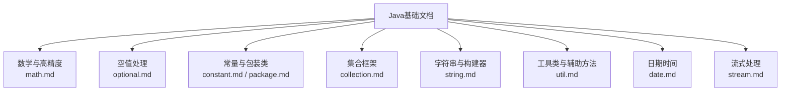
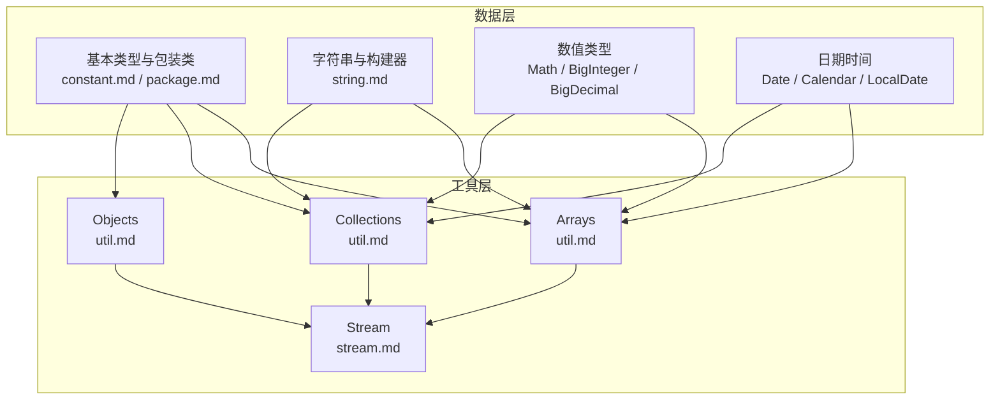
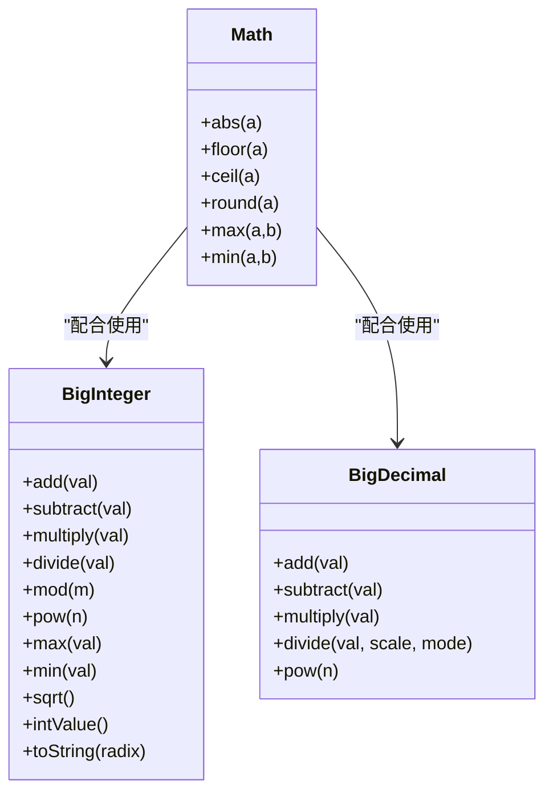
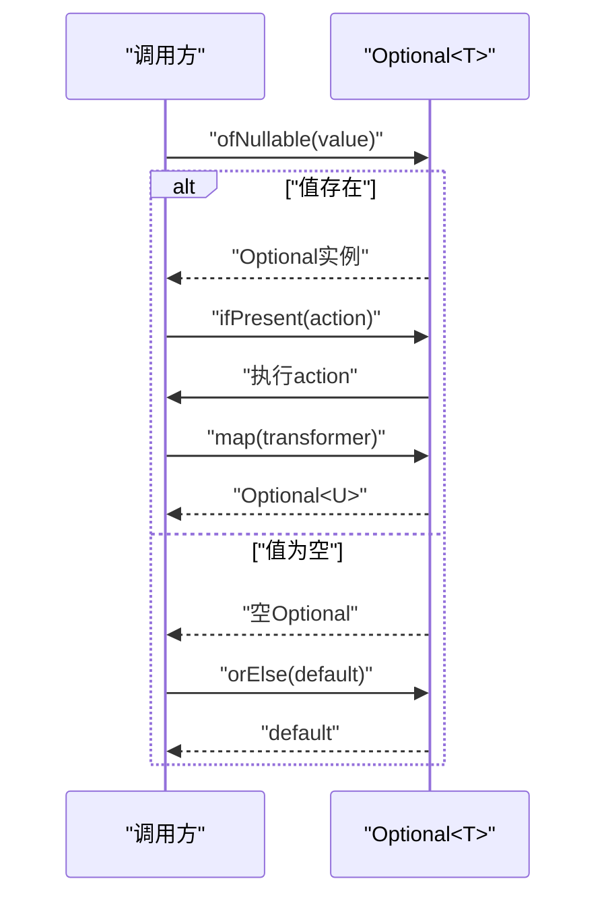
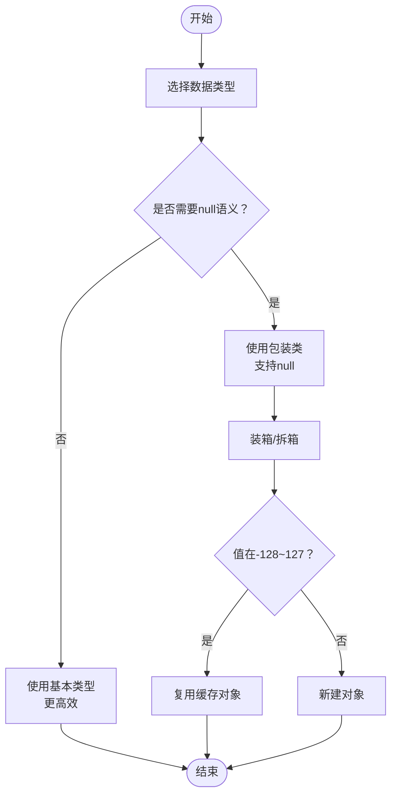
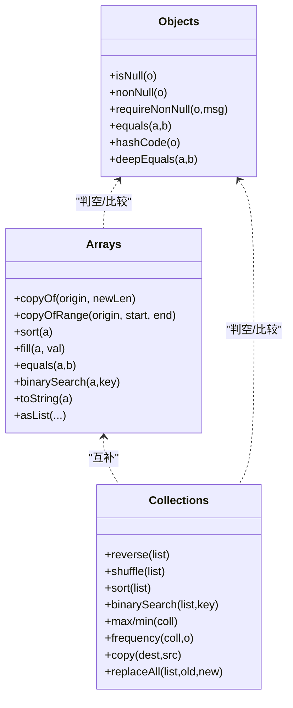
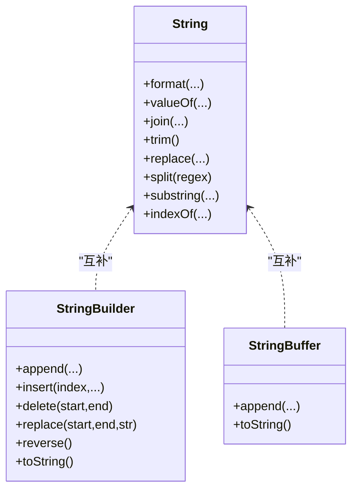
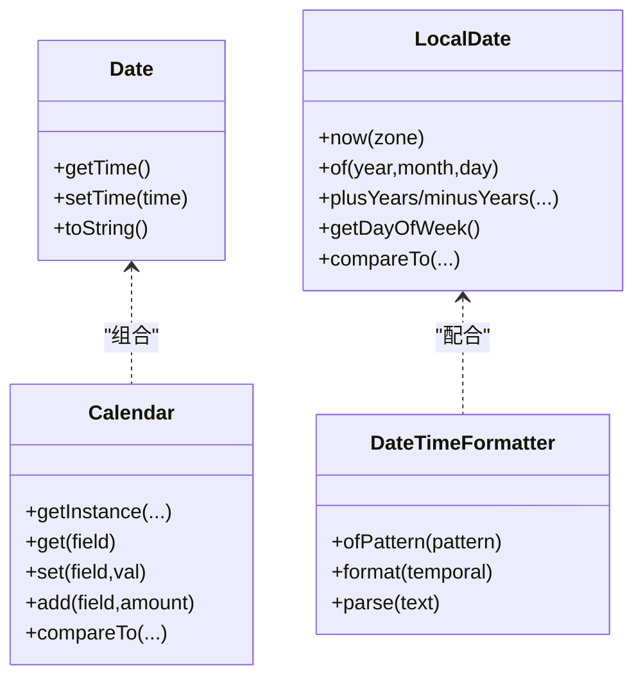
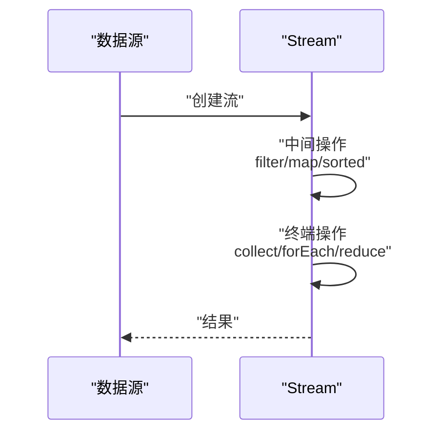
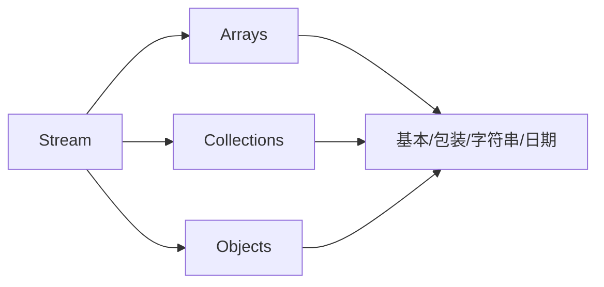

# Java实用工具类

<cite>
**本文引用的文件**
- [math.md](file://docs/backend-base/java/math.md)
- [optional.md](file://docs/backend-base/java/optional.md)
- [constant.md](file://docs/backend-base/java/constant.md)
- [package.md](file://docs/backend-base/java/package.md)
- [collection.md](file://docs/backend-base/java/collection.md)
- [string.md](file://docs/backend-base/java/string.md)
- [util.md](file://docs/backend-base/java/util.md)
- [date.md](file://docs/backend-base/java/date.md)
- [stream.md](file://docs/backend-base/java/stream.md)
</cite>

## 目录
1. [简介](#简介)
2. [项目结构](#项目结构)
3. [核心组件](#核心组件)
4. [架构总览](#架构总览)
5. [详细组件分析](#详细组件分析)
6. [依赖分析](#依赖分析)
7. [性能考量](#性能考量)
8. [故障排查指南](#故障排查指南)
9. [结论](#结论)
10. [附录](#附录)

## 简介
本技术文档围绕Java实用工具类展开，系统梳理并深入讲解以下主题：
- 数学运算与高精度数值处理：Math类、BigInteger、BigDecimal
- 空值安全与可选值处理：Optional
- 常量与包装类设计：常量类型、基本类型与包装类差异
- 工具类实战：Arrays、Collections、Objects、StringUtils（概念性）
- 日期时间与格式化：Date、Calendar、LocalDate、SimpleDateFormat、DateTimeFormatter
- 流式处理：Stream API
- 包管理与最佳实践：包结构、导入策略、版本兼容性

文档以循序渐进的方式呈现，既适合初学者快速上手，也为进阶开发者提供深入的技术洞察与实践建议。

## 项目结构
本仓库的Java基础文档分布在docs/backend-base/java目录下，涵盖语言基础、集合框架、IO、注解、反射、Lambda、流式处理、日期时间、工具类等多个专题。本文聚焦与“实用工具类”直接相关的内容，形成知识地图与实践指南。

**图表来源**
- [math.md](file://docs/backend-base/java/math.md)
- [optional.md](file://docs/backend-base/java/optional.md)
- [constant.md](file://docs/backend-base/java/constant.md)
- [package.md](file://docs/backend-base/java/package.md)
- [collection.md](file://docs/backend-base/java/collection.md)
- [string.md](file://docs/backend-base/java/string.md)
- [util.md](file://docs/backend-base/java/util.md)
- [date.md](file://docs/backend-base/java/date.md)
- [stream.md](file://docs/backend-base/java/stream.md)

**章节来源**
- [math.md](file://docs/backend-base/java/math.md)
- [optional.md](file://docs/backend-base/java/optional.md)
- [constant.md](file://docs/backend-base/java/constant.md)
- [package.md](file://docs/backend-base/java/package.md)
- [collection.md](file://docs/backend-base/java/collection.md)
- [string.md](file://docs/backend-base/java/string.md)
- [util.md](file://docs/backend-base/java/util.md)
- [date.md](file://docs/backend-base/java/date.md)
- [stream.md](file://docs/backend-base/java/stream.md)

## 核心组件
本节概述与工具类密切相关的Java标准库组件及其职责边界：
- 数学与高精度：Math类提供基础数学运算；BigInteger/BigDecimal用于任意精度整数与小数运算，解决大数与精度问题
- 空值安全：Optional提供显式空值表达与安全访问，降低NPE风险
- 常量与包装类：常量类型与基本类型/包装类差异影响内存、空值与性能
- 工具类：Arrays/Collections/Objects提供数组、集合与对象的通用操作
- 字符串工具：String/ StringBuilder/ StringBuffer 提供字符串拼接与修改能力
- 日期时间：Date/Calendar 与现代JSR-310（LocalDate/DateTimeFormatter）并存，需注意线程安全与格式化策略
- 流式处理：Stream提供函数式风格的数据处理管道

**章节来源**
- [math.md](file://docs/backend-base/java/math.md)
- [optional.md](file://docs/backend-base/java/optional.md)
- [constant.md](file://docs/backend-base/java/constant.md)
- [package.md](file://docs/backend-base/java/package.md)
- [util.md](file://docs/backend-base/java/util.md)
- [string.md](file://docs/backend-base/java/string.md)
- [date.md](file://docs/backend-base/java/date.md)
- [stream.md](file://docs/backend-base/java/stream.md)

## 架构总览
下图展示了工具类在Java生态中的定位与协作关系：基础类型与包装类为数据载体；工具类负责数据加工；日期时间类提供时间语义；流式API提供函数式处理范式。

**图表来源**
- [constant.md](file://docs/backend-base/java/constant.md)
- [package.md](file://docs/backend-base/java/package.md)
- [string.md](file://docs/backend-base/java/string.md)
- [math.md](file://docs/backend-base/java/math.md)
- [util.md](file://docs/backend-base/java/util.md)
- [date.md](file://docs/backend-base/java/date.md)
- [stream.md](file://docs/backend-base/java/stream.md)

## 详细组件分析

### 数学与高精度：Math、BigInteger、BigDecimal
- Math类提供基础数学运算（绝对值、取整、取舍、最值等），适用于常规数值计算
- BigInteger用于任意精度整数运算，支持加减乘除、取模、幂运算、最值、平方根等
- BigDecimal用于高精度小数运算，支持指定精度与舍入模式，解决除不尽与精度问题

**图表来源**
- [math.md](file://docs/backend-base/java/math.md)

**章节来源**
- [math.md](file://docs/backend-base/java/math.md)

### 空值处理：Optional
Optional通过显式封装可选值，避免直接使用null带来的NPE风险。典型用法包括：
- 创建：empty、of、ofNullable
- 判空：isEmpty、isPresent、ifPresent、ifPresentOrElse
- 获取：get、orElse、orElseGet
- 过滤：filter
- 转换：map

**图表来源**
- [optional.md](file://docs/backend-base/java/optional.md)

**章节来源**
- [optional.md](file://docs/backend-base/java/optional.md)

### 常量与包装类：设计模式与最佳实践
- 常量类型：整数、小数、字符、字符串、布尔、空常量
- 包装类与基本类型：包装类可为null，基本类型更高效；POJO中推荐使用包装类以适配数据库空值
- 自动装箱/拆箱与缓存：-128~127区间使用缓存对象
- 数据存储区域：寄存器、栈、堆、磁盘

**图表来源**
- [package.md](file://docs/backend-base/java/package.md)
- [constant.md](file://docs/backend-base/java/constant.md)

**章节来源**
- [package.md](file://docs/backend-base/java/package.md)
- [constant.md](file://docs/backend-base/java/constant.md)

### 工具类：Arrays、Collections、Objects
- Arrays：数组复制、排序、填充、比较、二分查找、打印、转List
- Collections：集合反转、打乱、排序、查找最值、填充、频率统计、复制、替换
- Objects：判空、判等、hashCode、数组深度比较

**图表来源**
- [util.md](file://docs/backend-base/java/util.md)

**章节来源**
- [util.md](file://docs/backend-base/java/util.md)

### 字符串与构建器：拼接与修改
- String不可变，频繁拼接会产生大量临时对象
- StringBuilder/StringBuffer用于可变字符串拼接，StringBuilder线程不安全但性能更高
- 常用API：format、valueOf、join、trim、replace、split、substring、indexOf等

**图表来源**
- [string.md](file://docs/backend-base/java/string.md)

**章节来源**
- [string.md](file://docs/backend-base/java/string.md)

### 日期时间：传统与现代方案
- Date/Calendar：传统方案，存在线程安全问题与易错字段
- LocalDate/LocalDateTime/DateTimeFormatter：JSR-310现代方案，线程安全、API清晰
- SimpleDateFormat：格式化/解析，但非线程安全；推荐使用DateTimeFormatter

**图表来源**
- [date.md](file://docs/backend-base/java/date.md)

**章节来源**
- [date.md](file://docs/backend-base/java/date.md)

### 流式处理：函数式数据管道
- Stream是高级迭代器，支持中间操作（filter、map、peek、sorted、distinct）与终端操作（forEach、collect、reduce、count、findAny/findFirst）
- 可与Arrays/Collections配合，实现链式处理

**图表来源**
- [stream.md](file://docs/backend-base/java/stream.md)

**章节来源**
- [stream.md](file://docs/backend-base/java/stream.md)

## 依赖分析
- 组件耦合度：工具类（Arrays/Collections/Objects）与数据类型（基本/包装、字符串、日期）松耦合，通过方法参数与返回值交互
- 外部依赖：日期时间类依赖JDK时间API；流式处理依赖JDK Stream API
- 循环依赖：无明显循环依赖，各工具类职责清晰

**图表来源**
- [util.md](file://docs/backend-base/java/util.md)
- [stream.md](file://docs/backend-base/java/stream.md)

**章节来源**
- [util.md](file://docs/backend-base/java/util.md)
- [stream.md](file://docs/backend-base/java/stream.md)

## 性能考量
- 数组与集合：优先使用Arrays/Collections提供的原地操作，避免不必要的拷贝
- 字符串拼接：大量拼接使用StringBuilder，避免使用+拼接
- 日期格式化：优先使用DateTimeFormatter，避免SimpleDateFormat的线程安全问题
- 流式处理：合理使用并行流（parallelStream）提升大数据量处理性能，但需评估开销
- 空值处理：使用Optional减少分支与NPE，提升可读性与安全性

[本节为通用指导，不直接分析具体文件]

## 故障排查指南
- NPE问题：使用Objects.requireNonNull/Optional判空，避免直接调用null对象
- 日期格式化异常：确保使用线程安全的DateTimeFormatter；避免在多线程共享SimpleDateFormat
- 数组/集合越界：使用Arrays/Collections提供的边界安全方法，或在调用前校验索引
- 流式处理阻塞：避免在forEach中执行耗时操作；必要时使用并行流并控制并发度
- 包装类缓存陷阱：-128~127区间使用==比较可能误判，应使用equals

**章节来源**
- [util.md](file://docs/backend-base/java/util.md)
- [date.md](file://docs/backend-base/java/date.md)
- [stream.md](file://docs/backend-base/java/stream.md)

## 结论
Java实用工具类在工程实践中扮演着“基础设施”的角色：Math/BigInteger/BigDecimal保障数值计算的准确性与性能；Optional提升空值处理的安全性；Arrays/Collections/Objects简化常见数据操作；String/ StringBuilder/ StringBuffer优化字符串处理；Date/Calendar与LocalDate/DateTimeFormatter平衡历史兼容与现代API；Stream提供函数式数据处理范式。遵循本文的最佳实践与注意事项，可在保证性能的同时显著提升代码质量与可维护性。

[本节为总结性内容，不直接分析具体文件]

## 附录
- 包管理最佳实践
  - 明确模块边界，避免跨模块强耦合
  - 使用静态导入减少冗余前缀（谨慎使用）
  - 版本统一与升级策略：优先采用长期支持版本，逐步迁移
  - 依赖冲突排查：使用工具扫描并解决冲突
- 常见误区
  - 将null与空字符串混淆
  - 在循环中使用+拼接字符串
  - 直接比较包装类对象使用==而非equals
  - 在多线程环境中共享非线程安全的日期格式化器

[本节为通用指导，不直接分析具体文件]