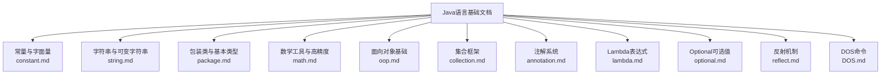
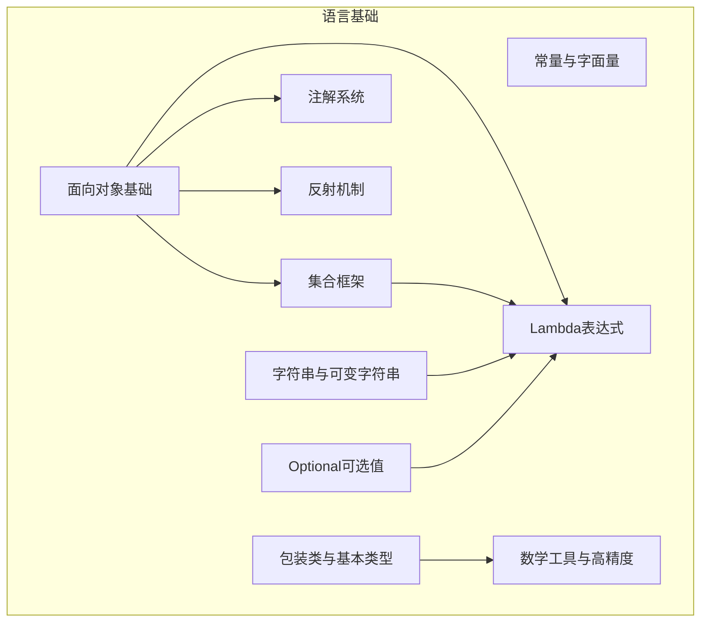
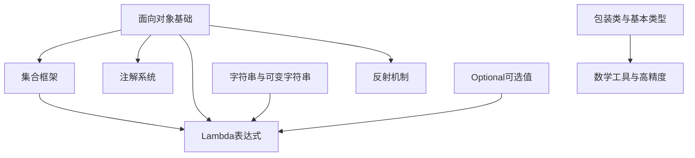

# Java语言基础

<cite>
**本文引用的文件**
- [DOS.md](file://docs/backend-base/java/DOS.md)
- [annotation.md](file://docs/backend-base/java/annotation.md)
- [collection.md](file://docs/backend-base/java/collection.md)
- [constant.md](file://docs/backend-base/java/constant.md)
- [lambda.md](file://docs/backend-base/java/lambda.md)
- [math.md](file://docs/backend-base/java/math.md)
- [oop.md](file://docs/backend-base/java/oop.md)
- [optional.md](file://docs/backend-base/java/optional.md)
- [package.md](file://docs/backend-base/java/package.md)
- [reflect.md](file://docs/backend-base/java/reflect.md)
- [string.md](file://docs/backend-base/java/string.md)
</cite>

## 目录
1. [简介](#简介)
2. [项目结构](#项目结构)
3. [核心组件](#核心组件)
4. [架构总览](#架构总览)
5. [详细组件分析](#详细组件分析)
6. [依赖分析](#依赖分析)
7. [性能考虑](#性能考虑)
8. [故障排查指南](#故障排查指南)
9. [结论](#结论)
10. [附录](#附录)

## 简介
本文件为Java语言基础的系统性编程文档，围绕Java核心语法、面向对象编程、集合框架、注解系统、Lambda表达式、反射机制、字符串处理等主题展开，辅以常量定义、包管理、数学运算、Optional类等实用功能的详解与最佳实践。文档旨在帮助Java初学者与进阶开发者建立扎实的语言基础，理解Java的设计哲学与编程范式，并提供可追溯的参考路径，便于进一步查阅与实践。

## 项目结构
本仓库的Java语言基础内容集中在docs/backend-base/java目录下，采用按主题分文件的组织方式，便于独立阅读与检索：
- 常量与字面量：constant.md
- 字符串与可变字符串：string.md
- 包装类与基本类型：package.md
- 数学工具类与高精度计算：math.md
- 面向对象基础：oop.md
- 集合框架：collection.md
- 注解系统：annotation.md
- Lambda表达式与函数式接口：lambda.md
- Optional可选值：optional.md
- 反射机制：reflect.md
- 开发环境与DOS命令：DOS.md

图表来源
- [constant.md:1-29](file://docs/backend-base/java/constant.md#L1-L29)
- [string.md:1-150](file://docs/backend-base/java/string.md#L1-L150)
- [package.md:1-46](file://docs/backend-base/java/package.md#L1-L46)
- [math.md:1-67](file://docs/backend-base/java/math.md#L1-L67)
- [oop.md:1-223](file://docs/backend-base/java/oop.md#L1-L223)
- [collection.md:1-434](file://docs/backend-base/java/collection.md#L1-L434)
- [annotation.md:1-68](file://docs/backend-base/java/annotation.md#L1-L68)
- [lambda.md:1-309](file://docs/backend-base/java/lambda.md#L1-L309)
- [optional.md:1-41](file://docs/backend-base/java/optional.md#L1-L41)
- [reflect.md:1-111](file://docs/backend-base/java/reflect.md#L1-L111)
- [DOS.md:1-75](file://docs/backend-base/java/DOS.md#L1-L75)

章节来源
- [constant.md:1-29](file://docs/backend-base/java/constant.md#L1-L29)
- [string.md:1-150](file://docs/backend-base/java/string.md#L1-L150)
- [package.md:1-46](file://docs/backend-base/java/package.md#L1-L46)
- [math.md:1-67](file://docs/backend-base/java/math.md#L1-L67)
- [oop.md:1-223](file://docs/backend-base/java/oop.md#L1-L223)
- [collection.md:1-434](file://docs/backend-base/java/collection.md#L1-L434)
- [annotation.md:1-68](file://docs/backend-base/java/annotation.md#L1-L68)
- [lambda.md:1-309](file://docs/backend-base/java/lambda.md#L1-L309)
- [optional.md:1-41](file://docs/backend-base/java/optional.md#L1-L41)
- [reflect.md:1-111](file://docs/backend-base/java/reflect.md#L1-L111)
- [DOS.md:1-75](file://docs/backend-base/java/DOS.md#L1-L75)

## 核心组件
本节概述Java语言基础的关键主题与职责边界，便于快速定位与学习。

- 常量与字面量：涵盖整数、小数、字符、字符串、布尔、空值等常量类型，帮助理解数据字面值的语义与使用场景。
- 字符串与可变字符串：讲解String不可变特性、常见API、StringBuilder与StringBuffer的性能差异与使用场景。
- 包装类与基本类型：阐述装箱/拆箱、自动装箱缓存、基本类型与包装类的内存与性能差异。
- 数学工具与高精度：Math类静态方法、BigInteger/BigDecimal的高精度算术与舍入策略。
- 面向对象基础：类与对象、封装、继承、多态、接口与抽象类、访问修饰符、static/final等关键概念。
- 集合框架：Collection/List/Set/Map体系、典型实现类（ArrayList/LinkedList/HashSet/TreeSet/HashMap/LinkedHashMap/TreeMap等）的特性与API。
- 注解系统：注解的作用、生命周期、目标类型、定义与使用、解析思路。
- Lambda表达式与函数式接口：语法、作用域、方法引用、构造器引用、数组引用、常见函数式接口（Supplier/Consumer/Predicate）。
- Optional可选值：空值安全的建模与常见操作。
- 反射机制：Class对象获取、构造方法、成员方法、成员变量的获取与调用。
- 开发环境与DOS命令：Windows命令行常用操作，辅助开发与部署。

章节来源
- [constant.md:1-29](file://docs/backend-base/java/constant.md#L1-L29)
- [string.md:1-150](file://docs/backend-base/java/string.md#L1-L150)
- [package.md:1-46](file://docs/backend-base/java/package.md#L1-L46)
- [math.md:1-67](file://docs/backend-base/java/math.md#L1-L67)
- [oop.md:1-223](file://docs/backend-base/java/oop.md#L1-L223)
- [collection.md:1-434](file://docs/backend-base/java/collection.md#L1-L434)
- [annotation.md:1-68](file://docs/backend-base/java/annotation.md#L1-L68)
- [lambda.md:1-309](file://docs/backend-base/java/lambda.md#L1-L309)
- [optional.md:1-41](file://docs/backend-base/java/optional.md#L1-L41)
- [reflect.md:1-111](file://docs/backend-base/java/reflect.md#L1-L111)
- [DOS.md:1-75](file://docs/backend-base/java/DOS.md#L1-L75)

## 架构总览
下图展示Java语言基础各主题之间的关系与依赖，帮助读者建立整体认知。

图表来源
- [oop.md:1-223](file://docs/backend-base/java/oop.md#L1-L223)
- [collection.md:1-434](file://docs/backend-base/java/collection.md#L1-L434)
- [annotation.md:1-68](file://docs/backend-base/java/annotation.md#L1-L68)
- [lambda.md:1-309](file://docs/backend-base/java/lambda.md#L1-L309)
- [reflect.md:1-111](file://docs/backend-base/java/reflect.md#L1-L111)
- [string.md:1-150](file://docs/backend-base/java/string.md#L1-L150)
- [package.md:1-46](file://docs/backend-base/java/package.md#L1-L46)
- [math.md:1-67](file://docs/backend-base/java/math.md#L1-L67)
- [optional.md:1-41](file://docs/backend-base/java/optional.md#L1-L41)

## 详细组件分析

### 常量与字面量
- 整数常量：所有整数字面值。
- 小数常量：带小数点的数值。
- 字符常量：单引号包裹的单字符，注意不能使用空字符。
- 字符串常量：双引号包裹的字符序列。
- 布尔常量：true/false。
- 空常量：null，表示“无值”。

最佳实践
- 明确区分字符与字符串字面量，避免混淆。
- 使用布尔常量表达业务状态，提升可读性。

章节来源
- [constant.md:1-29](file://docs/backend-base/java/constant.md#L1-L29)

### 字符串与可变字符串
- 不可变性：字符串拼接、截取、替换等操作会产生新对象，原对象不变。
- 字面量共享：相同内容的字符串字面量共享同一对象。
- 常用API：比较、获取、修改、转换、拼接、判断等。
- StringBuilder：线程不安全的可变字符串，适合频繁拼接场景。
- StringBuffer：线程安全的可变字符串，API与StringBuilder相似。

性能建议
- 大量拼接使用StringBuilder，减少中间对象创建。
- 需要并发安全时使用StringBuffer。

章节来源
- [string.md:1-150](file://docs/backend-base/java/string.md#L1-L150)

### 包装类与基本类型
- 装箱/拆箱：手动与自动装箱/拆箱，注意缓存区间与性能差异。
- 字符串与包装类互转：parseXxx与toString。
- 内存与性能：基本类型更高效，包装类型可为null，适合POJO与数据库映射。

章节来源
- [package.md:1-46](file://docs/backend-base/java/package.md#L1-L46)

### 数学工具与高精度
- Math类：绝对值、取整、取舍、最值等静态方法。
- BigInteger：任意精度整数，支持加减乘除、取余、幂、最值、开方等。
- BigDecimal：高精度浮点计算，支持指定精度与舍入模式，解决除不尽问题。

最佳实践
- 金融与科学计算优先使用BigDecimal，明确精度与舍入策略。
- BigInteger适合大整数运算与密码学场景。

章节来源
- [math.md:1-67](file://docs/backend-base/java/math.md#L1-L67)

### 面向对象基础
- 类与对象：类是对一类事物的抽象，由属性与行为组成。
- 封装：通过private与getter/setter隐藏实现细节。
- 继承：单一继承，子类继承父类成员，遵循方法重写规则。
- 多态：父类引用指向子类对象，运行时体现不同行为。
- 接口与抽象类：接口强调契约，抽象类强调模板与默认实现。
- 访问修饰符：public/protected/default/private的可见性与继承影响。
- static/final：静态成员属于类，final修饰不可变。

章节来源
- [oop.md:1-223](file://docs/backend-base/java/oop.md#L1-L223)

### 集合框架
- 单列集合：Collection接口，List/Queue有序、Set无序且去重。
- 双列集合：Map接口，键唯一，值可重复。
- 典型实现：
  - List：ArrayList（数组）、LinkedList（链表）、Vector（遗留）。
  - Set：HashSet（哈希表）、LinkedHashSet（链表+哈希）、TreeSet（红黑树）。
  - Map：HashMap（哈希表）、LinkedHashMap（哈希表+链表）、TreeMap（红黑树）、Hashtable（遗留）、Properties（遗留）。
- API要点：增删改查、遍历、视图、排序、比较器等。

性能与选择
- 频繁随机访问与扩容：ArrayList。
- 频繁插入/删除：LinkedList。
- 去重与无序：HashSet。
- 有序去重：TreeSet。
- 键值映射：HashMap；需要线程安全：ConcurrentHashMap；需要有序：LinkedHashMap/TreeMap。

章节来源
- [collection.md:1-434](file://docs/backend-base/java/collection.md#L1-L434)

### 注解系统
- 作用：说明、检查、分析（替代配置文件）。
- 生命周期：SOURCE/CLASS/RUNTIME。
- 目标类型：ElementType枚举覆盖类、接口、字段、方法、参数、构造器、局部变量、包、模块等。
- 定义与使用：@Retention/@Target等元注解，属性与默认值，使用时赋值。
- 解析：通过反射读取注解信息并执行相应逻辑。

章节来源
- [annotation.md:1-68](file://docs/backend-base/java/annotation.md#L1-L68)

### Lambda表达式与函数式接口
- 语法：参数列表、箭头、表达式或语句块。
- 使用场景：变量赋值、返回值、数组元素、方法/构造器参数。
- 作用域：局部变量需final或effectively final。
- 方法引用：对象::实例方法、类::静态方法、类::实例方法。
- 构造器引用：类::new。
- 数组引用：类型[]::new。
- 常见函数式接口：Supplier、Consumer（含andThen组合）、Predicate（and/or/negate）。

最佳实践
- 优先使用方法引用简化Lambda。
- 使用andThen组合多个Consumer操作。
- 保持Lambda简洁，复杂逻辑抽取为方法。

章节来源
- [lambda.md:1-309](file://docs/backend-base/java/lambda.md#L1-L309)

### Optional可选值
- 创建：empty、of、ofNullable。
- 判断：isEmpty/isPresent/ifPresent/ifPresentOrElse。
- 获取：get、orElse、orElseGet。
- 过滤：filter。
- 转换：map。

设计思想
- 以显式方式表达“可能为空”，避免null分支散落，提升可读性与安全性。

章节来源
- [optional.md:1-41](file://docs/backend-base/java/optional.md#L1-L41)

### 反射机制
- 获取Class对象：Class.forName、对象.getClass、类.class。
- 构造方法：public与非public、空参/有参、解除私有限制。
- 成员方法：public与非public、指定方法、调用invoke。
- 成员变量：public与非public、指定字段、set/get、解除私有限制。

注意事项
- 反射破坏封装，谨慎使用；注意性能与安全风险。

章节来源
- [reflect.md:1-111](file://docs/backend-base/java/reflect.md#L1-L111)

### 开发环境与DOS命令
- 盘符切换、查看文件/目录、进入目录、文件夹创建/删除/重命名/移动。
- 常用命令：dir、cd、mkdir、rmdir、del、rd、ren、move。

章节来源
- [DOS.md:1-75](file://docs/backend-base/java/DOS.md#L1-L75)

## 依赖分析
Java语言基础各主题相互支撑，形成知识闭环：
- 面向对象基础为集合、注解、Lambda、反射提供概念与范式。
- 字符串与可变字符串贯穿所有文本处理场景。
- 包装类与基本类型影响集合、数学运算与Optional的使用。
- 数学工具与高精度为金融与科学计算提供保障。
- Lambda与函数式接口推动集合API的现代化使用。
- Optional与反射在空值处理与动态调用中发挥关键作用。

图表来源
- [oop.md:1-223](file://docs/backend-base/java/oop.md#L1-L223)
- [collection.md:1-434](file://docs/backend-base/java/collection.md#L1-L434)
- [annotation.md:1-68](file://docs/backend-base/java/annotation.md#L1-L68)
- [lambda.md:1-309](file://docs/backend-base/java/lambda.md#L1-L309)
- [reflect.md:1-111](file://docs/backend-base/java/reflect.md#L1-L111)
- [string.md:1-150](file://docs/backend-base/java/string.md#L1-L150)
- [package.md:1-46](file://docs/backend-base/java/package.md#L1-L46)
- [math.md:1-67](file://docs/backend-base/java/math.md#L1-L67)
- [optional.md:1-41](file://docs/backend-base/java/optional.md#L1-L41)

## 性能考虑
- 字符串拼接：大量拼接使用StringBuilder，避免频繁创建中间对象。
- 集合选择：根据访问与修改模式选择合适实现，减少扩容与迁移成本。
- 装箱/拆箱：避免在循环中频繁装箱/拆箱，必要时使用基本类型。
- 数学计算：高精度场景使用BigInteger/BigDecimal，合理设置精度与舍入模式。
- 反射：尽量避免在热路径使用反射，权衡性能与灵活性。
- Optional：以显式空值表达降低null分支复杂度，提升可读性。

## 故障排查指南
- 字符串空指针：使用Optional或判空后再调用API。
- 集合并发修改异常：使用并发安全集合或同步策略。
- Lambda作用域问题：确保捕获变量为final或effectively final。
- 反射访问失败：确认可见性与签名匹配，必要时解除私有限制。
- 包装类缓存陷阱：注意-128至127的缓存行为，避免误用==比较对象。

章节来源
- [string.md:1-150](file://docs/backend-base/java/string.md#L1-L150)
- [collection.md:1-434](file://docs/backend-base/java/collection.md#L1-L434)
- [lambda.md:1-309](file://docs/backend-base/java/lambda.md#L1-L309)
- [reflect.md:1-111](file://docs/backend-base/java/reflect.md#L1-L111)
- [package.md:1-46](file://docs/backend-base/java/package.md#L1-L46)
- [optional.md:1-41](file://docs/backend-base/java/optional.md#L1-L41)

## 结论
本文件系统梳理了Java语言基础的核心主题，从语法与数据类型到面向对象、集合、注解、Lambda、Optional与反射，辅以数学工具与字符串处理的最佳实践。建议读者按主题逐步深入，结合实际项目场景反复练习，逐步形成对Java语言的整体把握与工程化应用能力。

## 附录
- 术语速查：常量、字面量、不可变、装箱/拆箱、高精度、函数式接口、Optional、反射、集合视图、比较器。
- 参考路径：各章节均提供文件路径与行号，便于快速定位与查阅。