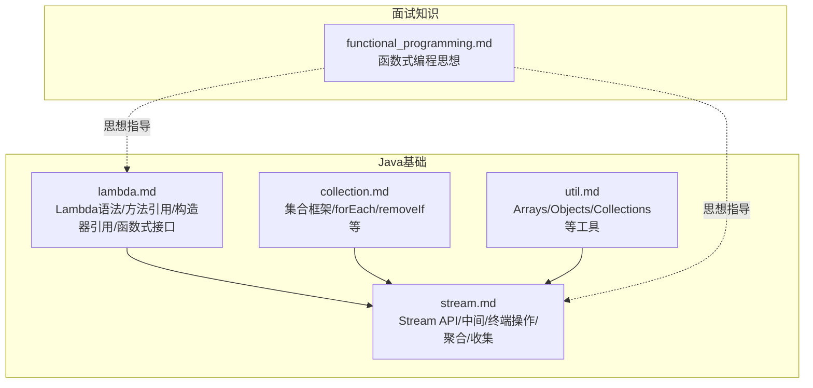
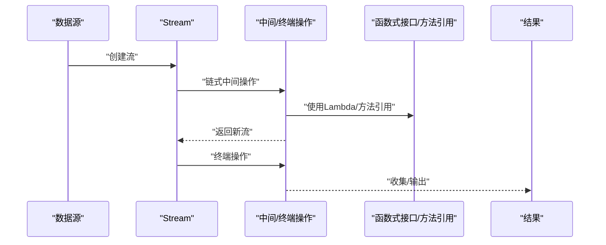
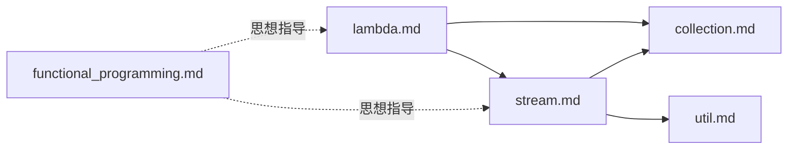

# Lambda表达式与函数式编程

<cite>
**本文引用的文件**
- [lambda.md](file://docs/backend-base/java/lambda.md)
- [stream.md](file://docs/backend-base/java/stream.md)
- [collection.md](file://docs/backend-base/java/collection.md)
- [util.md](file://docs/backend-base/java/util.md)
- [functional_programming.md](file://docs/interview/JavaScript/functional_programming.md)
</cite>

## 目录
1. [简介](#简介)
2. [项目结构](#项目结构)
3. [核心组件](#核心组件)
4. [架构总览](#架构总览)
5. [详细组件分析](#详细组件分析)
6. [依赖分析](#依赖分析)
7. [性能考量](#性能考量)
8. [故障排查指南](#故障排查指南)
9. [结论](#结论)
10. [附录](#附录)

## 简介
本文件系统化梳理Java Lambda表达式与函数式编程思想，围绕语法结构、函数式接口、Stream API、方法引用与构造器引用、聚合操作与并行流等主题展开，辅以仓库中已有的示例路径与说明，帮助不同层次读者快速掌握从入门到进阶的实战能力。同时，补充函数式编程理念与实践建议，便于在工程中落地。

## 项目结构
本仓库与Lambda与函数式编程相关的资料主要分布在以下文档：
- Java基础：Lambda表达式、Stream API、集合框架、工具类
- 面试知识：函数式编程思想与JS示例

图表来源
- [lambda.md:1-309](file://docs/backend-base/java/lambda.md#L1-L309)
- [stream.md:1-105](file://docs/backend-base/java/stream.md#L1-L105)
- [collection.md:1-434](file://docs/backend-base/java/collection.md#L1-L434)
- [util.md:1-213](file://docs/backend-base/java/util.md#L1-L213)
- [functional_programming.md:1-233](file://docs/interview/JavaScript/functional_programming.md#L1-L233)

章节来源
- [lambda.md:1-309](file://docs/backend-base/java/lambda.md#L1-L309)
- [stream.md:1-105](file://docs/backend-base/java/stream.md#L1-L105)
- [collection.md:1-434](file://docs/backend-base/java/collection.md#L1-L434)
- [util.md:1-213](file://docs/backend-base/java/util.md#L1-L213)
- [functional_programming.md:1-233](file://docs/interview/JavaScript/functional_programming.md#L1-L233)

## 核心组件
- Lambda表达式语法与作用域
- 函数式接口与三大核心函数式接口（Supplier/Consumer/Predicate）
- 方法引用与构造器引用
- Stream API：创建、中间操作、终端操作、聚合与收集
- 并行流与聚合操作（计数、求和、平均值等）
- 函数式编程思想与最佳实践

章节来源
- [lambda.md:7-53](file://docs/backend-base/java/lambda.md#L7-L53)
- [lambda.md:170-309](file://docs/backend-base/java/lambda.md#L170-L309)
- [stream.md:1-105](file://docs/backend-base/java/stream.md#L1-L105)
- [collection.md:154-159](file://docs/backend-base/java/collection.md#L154-L159)
- [util.md:21-22](file://docs/backend-base/java/util.md#L21-L22)

## 架构总览
从“数据源”出发，通过Stream API进行链式处理，借助Lambda表达式与函数式接口实现简洁、可组合的数据处理流程；方法引用与构造器引用进一步降低样板代码，提升可读性与可维护性。

图表来源
- [stream.md:1-105](file://docs/backend-base/java/stream.md#L1-L105)
- [lambda.md:55-168](file://docs/backend-base/java/lambda.md#L55-L168)

## 详细组件分析

### 1) Lambda表达式语法与作用域
- 语法要点：参数列表、箭头符号、表达式或语句体
- 使用场景：变量赋值、作为返回值、数组元素、方法/构造器参数
- 作用域规则：Lambda体内不得修改方法内局部变量；引用的外部变量需为final或effectively final

章节来源
- [lambda.md:9-17](file://docs/backend-base/java/lambda.md#L9-L17)
- [lambda.md:19-53](file://docs/backend-base/java/lambda.md#L19-L53)

### 2) 方法引用与构造器引用
- 方法引用分类：对象::实例方法、类::静态方法、类::实例方法
- 构造器引用：类::new，参数列表需与函数式接口抽象方法一致
- 数组引用：int[]::new等

章节来源
- [lambda.md:55-168](file://docs/backend-base/java/lambda.md#L55-L168)

### 3) 函数式接口与三大核心接口
- Supplier：无参提供数据
- Consumer：消费数据，支持andThen组合
- Predicate：条件判断，支持and/or/negate组合

章节来源
- [lambda.md:174-309](file://docs/backend-base/java/lambda.md#L174-L309)

### 4) Stream API：创建、操作与收集
- 创建流：静态工厂、Arrays.stream、concat、empty、of等
- 操作类型：中间操作（filter/map/peek/sorted/skip/limit/distinct等）、终端操作（forEach/allMatch/anyMatch/noneMatch/reduce/collect/count/findFirst/findAny/max/min等）
- 收集：toList、toArray、自定义Collector

章节来源
- [stream.md:10-105](file://docs/backend-base/java/stream.md#L10-L105)

### 5) 集合框架与Stream的衔接
- 集合支持forEach、removeIf等，天然适配函数式风格
- Arrays提供数组到Stream的便捷入口

章节来源
- [collection.md:154-159](file://docs/backend-base/java/collection.md#L154-L159)
- [util.md:21-22](file://docs/backend-base/java/util.md#L21-L22)

### 6) 聚合操作与并行流
- 聚合：reduce、count、min/max、findAny/findFirst
- 并行流：通过并行度与分治策略提升大数据处理性能（具体API与示例可参考Stream文档）

章节来源
- [stream.md:50-105](file://docs/backend-base/java/stream.md#L50-L105)

### 7) 函数式编程思想
- 纯函数、高阶函数、柯里化、组合与管道
- 优势：可测试、可复用、可组合；劣势：性能与资源占用、递归陷阱
- 与Java实践结合：优先使用无副作用的函数、组合Consumer/Predicate/Function等接口

章节来源
- [functional_programming.md:32-233](file://docs/interview/JavaScript/functional_programming.md#L32-L233)

## 依赖分析
- Lambda与函数式接口：Lambda表达式依赖函数式接口（如Supplier/Consumer/Predicate）
- Stream与集合/数组：Stream依赖集合或数组作为数据源
- 工具类支撑：Arrays/Objects/Collections等为Stream与集合提供便利

图表来源
- [lambda.md:1-309](file://docs/backend-base/java/lambda.md#L1-L309)
- [stream.md:1-105](file://docs/backend-base/java/stream.md#L1-L105)
- [collection.md:1-434](file://docs/backend-base/java/collection.md#L1-L434)
- [util.md:1-213](file://docs/backend-base/java/util.md#L1-L213)
- [functional_programming.md:1-233](file://docs/interview/JavaScript/functional_programming.md#L1-L233)

## 性能考量
- 并行流：适用于CPU密集型或可并行的大数据集；注意分治成本与同步开销
- 流的中间/终端操作链：尽量减少中间步骤，避免不必要的装箱拆箱
- 方法引用与构造器引用：减少Lambda样板代码，间接提升可读性与维护性
- 集合选择：ArrayList/LinkedList/TreeSet等各有性能特征，结合使用Stream时应考虑迭代与排序成本

[本节为通用指导，不直接分析具体文件]

## 故障排查指南
- Lambda作用域问题：确保引用的外部变量为final或effectively final
- 方法引用签名不匹配：参数列表与返回值需与函数式接口一致
- Stream重复消费：Stream只能遍历一次，终端操作后流即失效
- 并行流状态共享：避免在并行流中共享可变状态，必要时使用无副作用的纯函数

章节来源
- [lambda.md:51-62](file://docs/backend-base/java/lambda.md#L51-L62)
- [stream.md:3-8](file://docs/backend-base/java/stream.md#L3-L8)

## 结论
通过Lambda表达式与函数式接口，配合Stream API与方法/构造器引用，Java在保持强类型与性能的同时，提供了简洁、可组合的数据处理能力。结合函数式编程思想，可在工程中实现更清晰、可测试、可维护的代码。建议从三大核心函数式接口入手，逐步掌握Stream的中间/终端操作与聚合收集，并在合适场景引入并行流以提升吞吐。

[本节为总结性内容，不直接分析具体文件]

## 附录
- 示例路径参考（不直接展示代码内容）：
  - Lambda语法与使用场景：[lambda.md:19-50](file://docs/backend-base/java/lambda.md#L19-L50)
  - 方法引用示例（对象/类静态/类实例）：[lambda.md:64-139](file://docs/backend-base/java/lambda.md#L64-L139)
  - 构造器引用与数组引用：[lambda.md:141-168](file://docs/backend-base/java/lambda.md#L141-L168)
  - Supplier/Consumer/Predicate示例与组合：[lambda.md:174-309](file://docs/backend-base/java/lambda.md#L174-L309)
  - Stream创建与操作：[stream.md:10-105](file://docs/backend-base/java/stream.md#L10-L105)
  - 集合与数组到Stream的衔接：[collection.md:154-159](file://docs/backend-base/java/collection.md#L154-L159), [util.md:21-22](file://docs/backend-base/java/util.md#L21-L22)
  - 函数式编程思想与JS示例：[functional_programming.md:32-233](file://docs/interview/JavaScript/functional_programming.md#L32-L233)