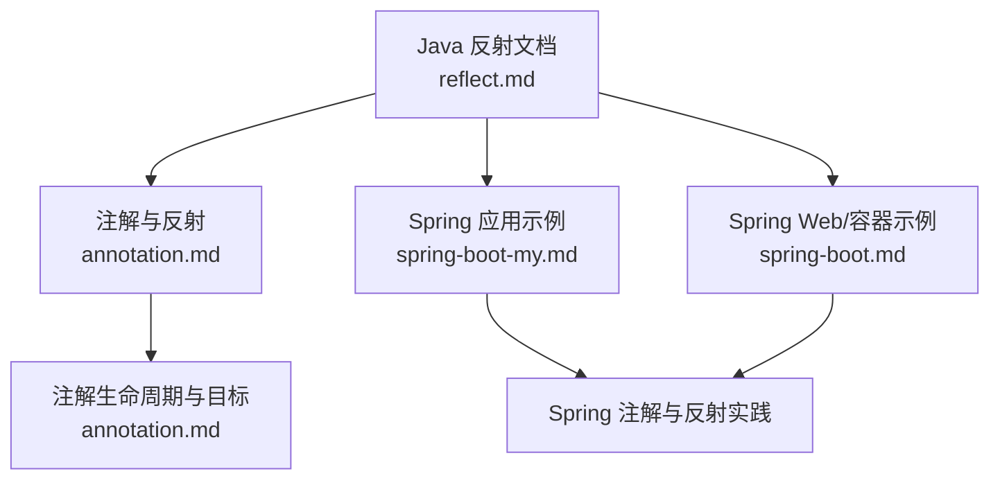
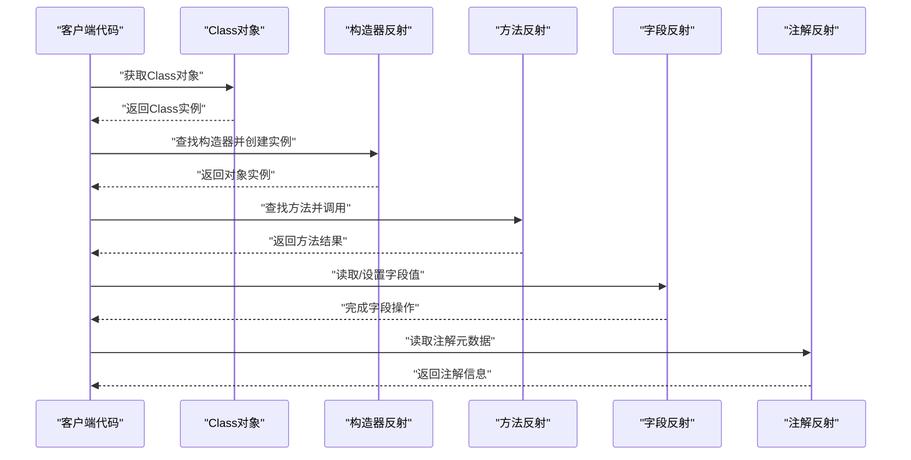
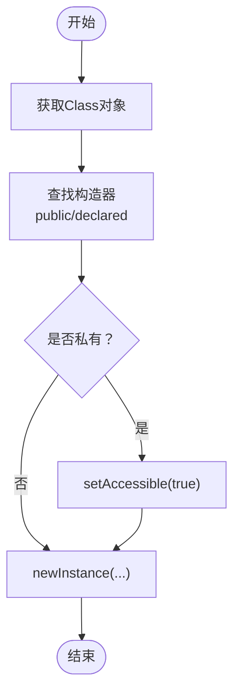
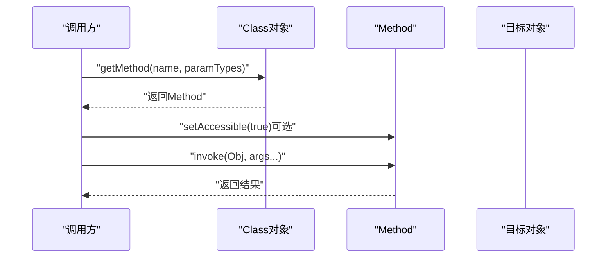
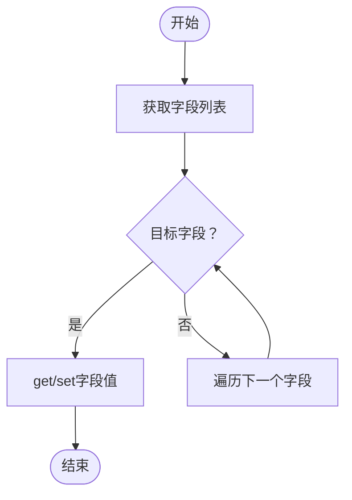
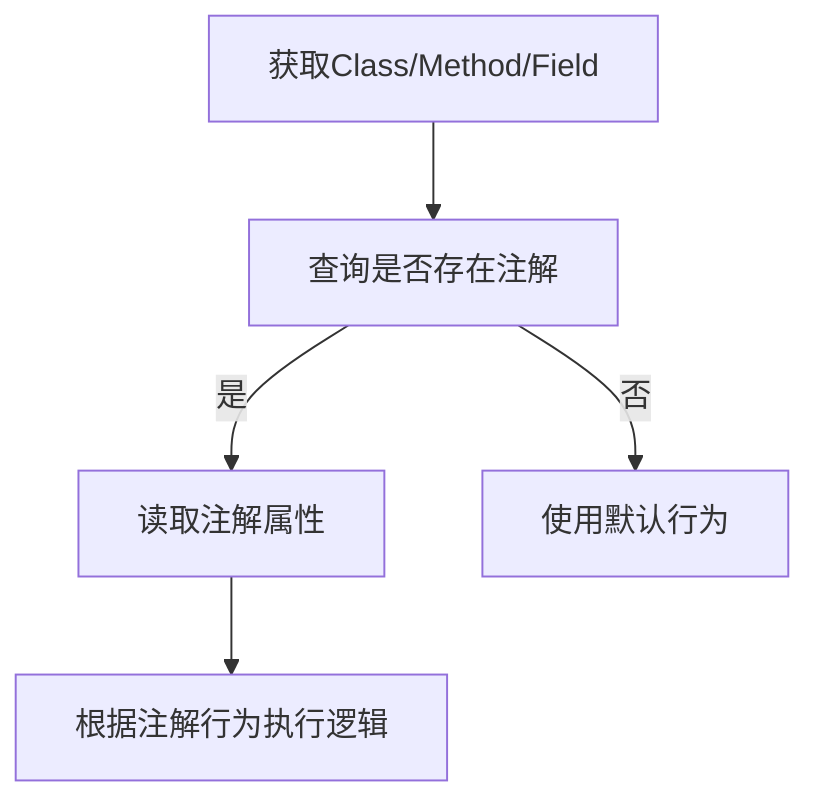
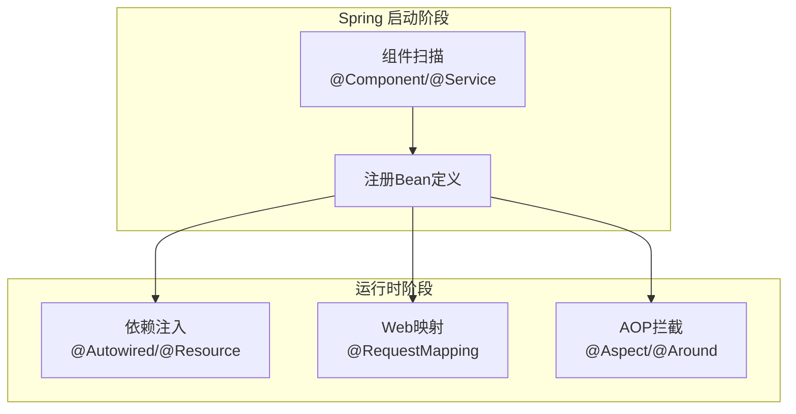
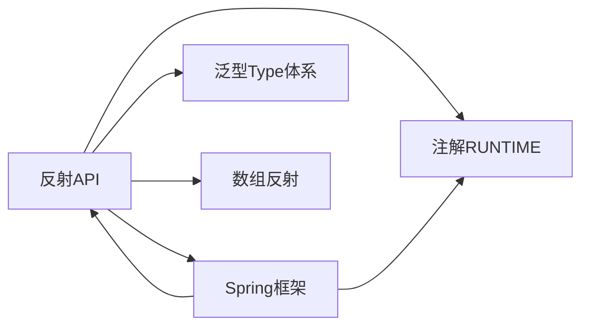

# 反射机制与动态编程

<cite>
**本文引用的文件**
- [reflect.md](file://docs/backend-base/java/reflect.md)
- [annotation.md](file://docs/backend-base/java/annotation.md)
- [spring-boot-my.md](file://docs/backend-base/spring/spring-boot-my.md)
- [spring-boot.md](file://docs/backend-base/spring/spring-boot.md)
</cite>

## 目录
1. [简介](#简介)
2. [项目结构](#项目结构)
3. [核心组件](#核心组件)
4. [架构总览](#架构总览)
5. [详细组件分析](#详细组件分析)
6. [依赖分析](#依赖分析)
7. [性能考量](#性能考量)
8. [故障排查指南](#故障排查指南)
9. [结论](#结论)
10. [附录](#附录)

## 简介
本技术文档围绕Java反射机制展开，系统梳理Class对象的获取方式、构造器、字段与方法的反射操作；深入讲解泛型与反射的结合、数组反射处理、注解的反射读取；并结合Spring框架的实际应用，总结反射在框架开发中的常见模式与最佳实践。文档以循序渐进的方式组织内容，既适合初学者建立知识体系，也为进阶读者提供架构与性能层面的思考。

## 项目结构
本仓库中与反射主题直接相关的资料主要集中在“后端基础/Java”与“Spring”两大板块：
- Java基础：reflect.md 提供反射API的系统性使用说明；annotation.md 讲解注解的定义、目标与生命周期，为注解反射奠定基础。
- Spring：spring-boot-my.md 与 spring-boot.md 中包含大量注解与反射在框架中的应用示例，如组件扫描、依赖注入、Web映射等。

**章节来源**
- [reflect.md:1-111](file://docs/backend-base/java/reflect.md#L1-L111)
- [annotation.md:1-68](file://docs/backend-base/java/annotation.md#L1-L68)
- [spring-boot-my.md:547-555](file://docs/backend-base/spring/spring-boot-my.md#L547-L555)
- [spring-boot.md:94-1081](file://docs/backend-base/spring/spring-boot.md#L94-L1081)

## 核心组件
- Class对象获取：通过类名.class、Class.forName(...)、实例.getClass()三种途径获得Class对象，这是所有反射操作的前提。
- 构造器反射：获取public与非public构造器，支持无参、有参构造器的查找与创建；可通过setAccessible(true)解除私有限制。
- 方法反射：获取public与非public方法，支持方法签名匹配与invoke调用；同样可通过setAccessible(true)访问非public方法。
- 字段反射：获取public与非public字段，支持读取与设置字段值；同样可通过setAccessible(true)访问非public字段。
- 注解反射：基于RUNTIME生命周期的注解，可在运行时通过反射读取注解元数据，驱动框架行为。
- 数组反射：通过Array类与get/setLength等API处理动态数组，结合泛型与反射实现通用序列化/反序列化。
- 泛型与反射：Type、ParameterizedType、GenericArrayType等配合Class获取真实类型信息，解决泛型擦除问题。

**章节来源**
- [reflect.md:3-111](file://docs/backend-base/java/reflect.md#L3-L111)
- [annotation.md:11-15](file://docs/backend-base/java/annotation.md#L11-L15)
- [annotation.md:17-31](file://docs/backend-base/java/annotation.md#L17-L31)

## 架构总览
下图展示了从“获取Class对象”到“通过反射调用构造器/方法/字段”的整体流程，以及注解在运行时如何参与控制逻辑：

**图表来源**
- [reflect.md:5-111](file://docs/backend-base/java/reflect.md#L5-L111)
- [annotation.md:13-15](file://docs/backend-base/java/annotation.md#L13-L15)

## 详细组件分析

### Class对象与获取方式
- 通过类名.class获取：适用于已知编译期类型。
- 通过Class.forName(...)获取：适用于运行时按字符串定位类。
- 通过实例.getClass()获取：适用于已有对象实例。
- 典型场景：框架在启动时按全限定名加载类，或在序列化/反序列化过程中按类型字符串创建实例。

**章节来源**
- [reflect.md:5-7](file://docs/backend-base/java/reflect.md#L5-L7)

### 构造器反射与对象创建
- 获取public构造器：getConstructors()与getConstructor(...)。
- 获取所有构造器（含私有）：getDeclaredConstructors()与getDeclaredConstructor(...)。
- 创建对象：newInstance()或带参数的newInstance(args)。
- 安全控制：setAccessible(true)解除私有限制，谨慎使用。
- 典型场景：工厂模式、依赖注入容器按构造器装配Bean。

**图表来源**
- [reflect.md:9-54](file://docs/backend-base/java/reflect.md#L9-L54)

**章节来源**
- [reflect.md:9-54](file://docs/backend-base/java/reflect.md#L9-L54)

### 方法反射与调用
- 获取public方法：getMethods()与getMethod(name, paramTypes)。
- 获取所有方法（含私有）：getDeclaredMethods()与getDeclaredMethod(name, paramTypes)。
- 调用方法：invoke(obj, args...)。
- 安全控制：setAccessible(true)解除私有限制。
- 典型场景：AOP拦截、事件分发、动态代理、RPC调用。

**图表来源**
- [reflect.md:56-81](file://docs/backend-base/java/reflect.md#L56-L81)

**章节来源**
- [reflect.md:56-81](file://docs/backend-base/java/reflect.md#L56-L81)

### 字段反射与读写
- 获取public字段：getFields()与getField(name)。
- 获取所有字段（含私有）：getDeclaredFields()与getDeclaredField(name)。
- 读取/设置值：get(obj)与set(obj, val)。
- 安全控制：setAccessible(true)解除私有限制。
- 典型场景：ORM映射、JSON序列化、配置注入、日志脱敏。

**图表来源**
- [reflect.md:82-111](file://docs/backend-base/java/reflect.md#L82-L111)

**章节来源**
- [reflect.md:82-111](file://docs/backend-base/java/reflect.md#L82-L111)

### 注解的反射读取
- 生命周期：RUNTIME生命周期的注解可在运行时通过反射读取。
- 作用目标：ElementType涵盖类、字段、方法、参数、构造器等。
- 典型应用：Spring注解驱动（组件扫描、依赖注入、Web映射）、MyBatis注解映射、JUnit测试标记等。
- 解析步骤：判断是否存在注解、读取注解属性、根据注解行为执行相应逻辑。

**图表来源**
- [annotation.md:11-15](file://docs/backend-base/java/annotation.md#L11-L15)
- [annotation.md:17-31](file://docs/backend-base/java/annotation.md#L17-L31)

**章节来源**
- [annotation.md:11-15](file://docs/backend-base/java/annotation.md#L11-L15)
- [annotation.md:17-31](file://docs/backend-base/java/annotation.md#L17-L31)

### 泛型与反射的结合
- 问题背景：Java泛型在编译后会进行类型擦除，导致运行时无法直接获取真实泛型类型。
- 解决方案：通过Type、ParameterizedType、GenericArrayType等类型信息，结合Class获取真实类型参数。
- 实践要点：在集合、数组、函数式接口等场景中，利用Type信息进行安全的类型判断与转换。

**章节来源**
- [reflect.md:3-7](file://docs/backend-base/java/reflect.md#L3-L7)

### 数组的反射处理
- 动态数组创建：通过Array.newInstance(baseType, length)创建指定长度的数组。
- 数组长度与元素访问：getLength、get、set等API实现动态数组的读写。
- 与泛型结合：在序列化/反序列化中，结合Type与Array实现通用的泛型数组处理。

**章节来源**
- [reflect.md:3-7](file://docs/backend-base/java/reflect.md#L3-L7)

### 在框架中的应用：Spring
- 组件扫描与注册：通过注解（如@Component、@Service等）标注类，框架在启动时通过反射扫描并注册Bean。
- 依赖注入：通过@Autowired、@Resource等注解，框架在运行时通过反射定位字段/方法并注入依赖。
- Web映射：@RequestMapping、@GetMapping等注解由框架通过反射解析，建立URL与处理器的映射关系。
- AOP与事务：基于注解与反射实现方法拦截、事务传播等横切逻辑。

**图表来源**
- [spring-boot-my.md:547-555](file://docs/backend-base/spring/spring-boot-my.md#L547-L555)
- [spring-boot.md:94-1081](file://docs/backend-base/spring/spring-boot.md#L94-L1081)

**章节来源**
- [spring-boot-my.md:547-555](file://docs/backend-base/spring/spring-boot-my.md#L547-L555)
- [spring-boot.md:94-1081](file://docs/backend-base/spring/spring-boot.md#L94-L1081)

## 依赖分析
- 反射与注解：注解的RUNTIME生命周期是反射读取注解元数据的前提。
- 反射与框架：Spring通过反射实现组件扫描、依赖注入、Web映射等核心能力。
- 反射与泛型：Type体系弥补泛型擦除带来的类型信息缺失。
- 反射与数组：Array类与Type结合实现动态数组的创建与访问。

**图表来源**
- [annotation.md:11-15](file://docs/backend-base/java/annotation.md#L11-L15)
- [reflect.md:3-111](file://docs/backend-base/java/reflect.md#L3-L111)
- [spring-boot-my.md:547-555](file://docs/backend-base/spring/spring-boot-my.md#L547-L555)

**章节来源**
- [annotation.md:11-15](file://docs/backend-base/java/annotation.md#L11-L15)
- [reflect.md:3-111](file://docs/backend-base/java/reflect.md#L3-L111)
- [spring-boot-my.md:547-555](file://docs/backend-base/spring/spring-boot-my.md#L547-L555)

## 性能考量
- 反射开销：反射调用相比直接调用存在额外的类型解析、权限检查与JNI桥接成本，应避免在高频路径中频繁使用。
- 缓存策略：缓存Class、Constructor、Method、Field对象，减少重复查找；缓存Method引用并在热点路径复用。
- 安全与性能权衡：setAccessible(true)虽能访问私有成员，但会破坏封装并引入安全风险，需谨慎评估。
- 数组与泛型：动态数组创建与泛型类型解析会带来额外成本，建议在批量处理时采用批量优化策略。
- 框架层优化：Spring在启动阶段完成扫描与注册，运行时通过缓存与字节码增强降低反射成本。

[本节为通用性能指导，无需特定文件引用]

## 故障排查指南
- 找不到构造器/方法/字段：确认目标签名是否匹配，区分public与declared族API；注意方法重载与参数类型匹配。
- 访问受限异常：对私有成员调用前使用setAccessible(true)，但需评估安全与兼容性。
- 注解读取为空：确认注解是否为RUNTIME生命周期；确认目标元素上是否正确标注注解。
- 类加载问题：Class.forName(...)需确保类名正确且类已加载；必要时指定类加载器。
- 泛型类型丢失：通过Type体系获取真实类型参数，避免直接使用raw Type造成类型错误。

**章节来源**
- [reflect.md:5-111](file://docs/backend-base/java/reflect.md#L5-L111)
- [annotation.md:11-15](file://docs/backend-base/java/annotation.md#L11-L15)

## 结论
反射是Java动态编程的核心能力，贯穿从底层API到上层框架的广泛场景。理解Class对象的获取、构造器/方法/字段的反射操作、注解的反射读取，以及与泛型、数组的结合，是构建高性能、可扩展框架的基础。在工程实践中，应在保证功能正确性的前提下，通过缓存、预扫描、字节码增强等手段降低反射开销，并严格控制setAccessible的使用范围，确保安全性与稳定性。

## 附录
- 常用API速查
  - Class对象获取：类名.class、Class.forName(...)、实例.getClass()
  - 构造器：getConstructors()/getConstructor(...)、getDeclaredConstructors()/getDeclaredConstructor(...)
  - 方法：getMethods()/getMethod(...)、getDeclaredMethods()/getDeclaredMethod(...)
  - 字段：getFields()/getField(...)、getDeclaredFields()/getDeclaredField(...)
  - 注解：isAnnotationPresent(...)、getAnnotation(...)、getAnnotations()
  - 数组：Array.newInstance(...)、Array.getLength(...)、Array.get/set(...)

[本节为概念性汇总，无需特定文件引用]