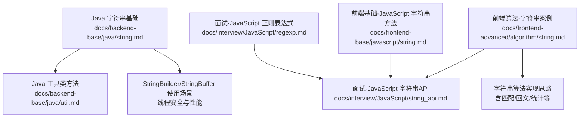
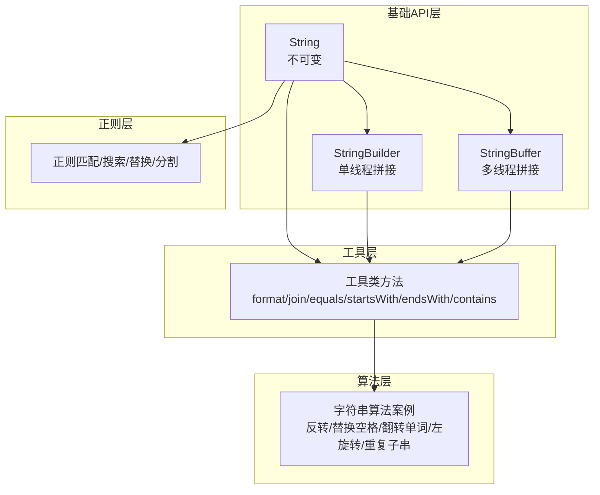
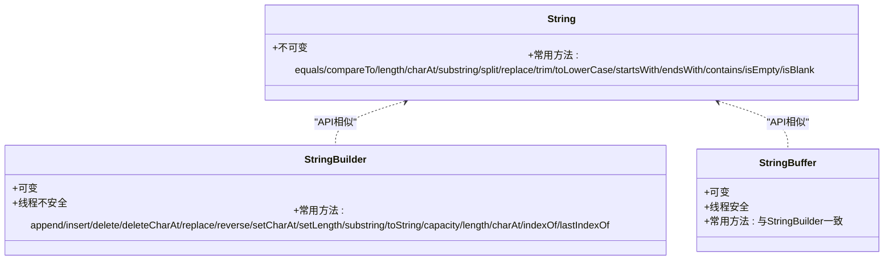
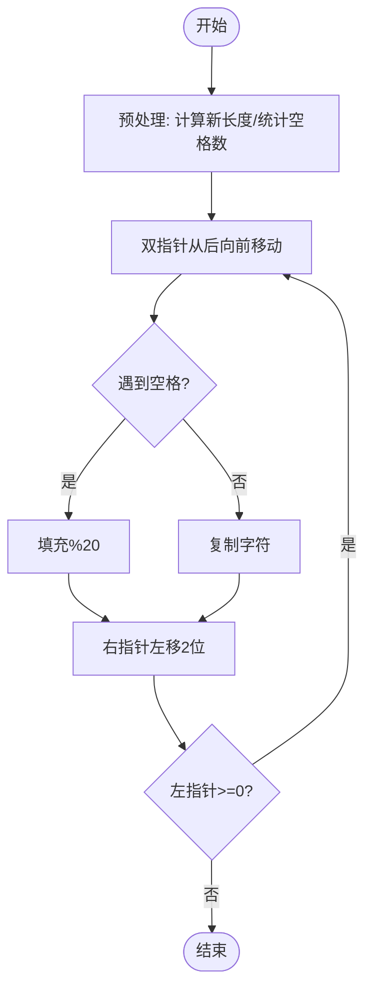
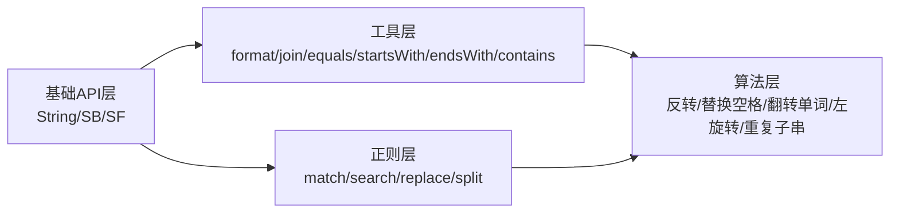

# 字符串处理与算法

<cite>
**本文引用的文件**
- [docs/backend-base/java/string.md](file://docs/backend-base/java/string.md)
- [docs/frontend-advanced/algorithm/string.md](file://docs/frontend-advanced/algorithm/string.md)
- [docs/interview/JavaScript/string_api.md](file://docs/interview/JavaScript/string_api.md)
- [docs/backend-base/java/util.md](file://docs/backend-base/java/util.md)
- [docs/frontend-base/javascript/string.md](file://docs/frontend-base/javascript/string.md)
- [docs/interview/JavaScript/regexp.md](file://docs/interview/JavaScript/regexp.md)
</cite>

## 目录
1. [简介](#简介)
2. [项目结构](#项目结构)
3. [核心组件](#核心组件)
4. [架构总览](#架构总览)
5. [详细组件分析](#详细组件分析)
6. [依赖关系分析](#依赖关系分析)
7. [性能考量](#性能考量)
8. [故障排查指南](#故障排查指南)
9. [结论](#结论)
10. [附录](#附录)

## 简介
本技术文档围绕Java字符串处理与常见字符串算法展开，系统梳理String、StringBuilder、StringBuffer三者的差异与适用场景；深入讲解字符串的创建、拼接、查找、替换、分割等常用操作；提供字符串匹配、回文判断、字符统计等经典算法思路与实现路径；并总结性能优化技巧、内存管理策略与最佳实践，辅以多语言示例与实战案例，帮助开发者高效、稳健地处理字符串任务。

## 项目结构
本仓库中与字符串处理相关的内容主要分布在以下文档：
- 后端基础（Java）：字符串基础、工具类方法、性能与内存要点
- 前端算法：字符串算法案例（反转、替换空格、翻转单词、左旋转、重复子串等）
- 面试JavaScript：字符串API与正则匹配
- 前端基础JavaScript：字符串方法对比与注意事项
- 面试JavaScript：正则表达式与字符串匹配

图表来源
- [docs/backend-base/java/string.md:1-150](file://docs/backend-base/java/string.md#L1-L150)
- [docs/backend-base/java/util.md:120-213](file://docs/backend-base/java/util.md#L120-L213)
- [docs/frontend-advanced/algorithm/string.md:1-207](file://docs/frontend-advanced/algorithm/string.md#L1-L207)
- [docs/interview/JavaScript/string_api.md:1-189](file://docs/interview/JavaScript/string_api.md#L1-L189)
- [docs/frontend-base/javascript/string.md:294-313](file://docs/frontend-base/javascript/string.md#L294-L313)
- [docs/interview/JavaScript/regexp.md:139-215](file://docs/interview/JavaScript/regexp.md#L139-L215)

章节来源
- [docs/backend-base/java/string.md:1-150](file://docs/backend-base/java/string.md#L1-L150)
- [docs/frontend-advanced/algorithm/string.md:1-207](file://docs/frontend-advanced/algorithm/string.md#L1-L207)
- [docs/interview/JavaScript/string_api.md:1-189](file://docs/interview/JavaScript/string_api.md#L1-L189)
- [docs/frontend-base/javascript/string.md:294-313](file://docs/frontend-base/javascript/string.md#L294-L313)
- [docs/interview/JavaScript/regexp.md:139-215](file://docs/interview/JavaScript/regexp.md#L139-L215)

## 核心组件
- String：不可变字符序列，适合读多写少、常量共享的场景；提供丰富查询、比较、转换、拼接与判断方法。
- StringBuilder：可变字符序列，线程不安全，适合单线程下的频繁拼接与修改。
- StringBuffer：可变字符序列，线程安全，适合多线程环境下的拼接与修改。
- 工具类与API：提供格式化、连接、判空、比较、数组/集合操作等辅助能力，减少空指针风险与样板代码。

章节来源
- [docs/backend-base/java/string.md:1-150](file://docs/backend-base/java/string.md#L1-L150)
- [docs/backend-base/java/util.md:120-213](file://docs/backend-base/java/util.md#L120-L213)

## 架构总览
下图展示字符串处理在不同层面的协作关系：基础API层（String、StringBuilder、StringBuffer）、工具层（格式化、判空、连接）、算法层（字符串算法案例）、正则层（匹配/替换/分割）。

图表来源
- [docs/backend-base/java/string.md:1-150](file://docs/backend-base/java/string.md#L1-L150)
- [docs/backend-base/java/util.md:120-213](file://docs/backend-base/java/util.md#L120-L213)
- [docs/frontend-advanced/algorithm/string.md:1-207](file://docs/frontend-advanced/algorithm/string.md#L1-L207)
- [docs/interview/JavaScript/regexp.md:139-215](file://docs/interview/JavaScript/regexp.md#L139-L215)

## 详细组件分析

### String、StringBuilder、StringBuffer 的区别与使用场景
- 不可变性与内存共享：String不可变，相同字面量共享同一实例，有利于缓存与常量池优化。
- 拼接成本：频繁拼接会产生大量中间对象，建议使用StringBuilder（单线程）或StringBuffer（多线程）。
- 线程安全：StringBuilder非线程安全，StringBuffer线程安全；在高并发场景优先考虑StringBuffer或通过同步手段保证安全。
- API一致性：StringBuilder与StringBuffer提供相似的追加、插入、删除、替换、反转、截取等方法，便于互换。

图表来源
- [docs/backend-base/java/string.md:1-150](file://docs/backend-base/java/string.md#L1-L150)

章节来源
- [docs/backend-base/java/string.md:1-150](file://docs/backend-base/java/string.md#L1-L150)

### 字符串创建与常用操作
- 创建方式：字面量、构造函数、char数组、byte数组、StringBuilder/StringBuffer生成。
- 查询与判断：length、charAt、codePointAt、indexOf/lastIndexOf、startsWith/endsWith/contains/isEmpty/isBlank。
- 修改与转换：toLowerCase/toUpperCase/trim/replace系列、split、toCharArray、getBytes、getChars。
- 拼接：concat；更推荐StringBuilder.append进行批量拼接。

章节来源
- [docs/backend-base/java/string.md:1-150](file://docs/backend-base/java/string.md#L1-L150)

### 工具类与API（格式化、判空、连接、数组/集合）
- 格式化与连接：format、valueOf、join等静态方法，简化字符串拼接与格式化。
- 判空与比较：Objects类提供判空与equals，避免空指针与误判。
- 字符串工具方法：startsWith/endsWith/contains/substring/replace系列/join/split/capitalize/uncapitalize等。

章节来源
- [docs/backend-base/java/util.md:120-213](file://docs/backend-base/java/util.md#L120-L213)

### 字符串算法案例（反转、替换空格、翻转单词、左旋转、重复子串）
- 反转字符串：双指针原地交换，时间复杂度O(n)，空间复杂度O(1)。
- 反转字符串II：按2k步长分段反转前k个字符，注意边界处理。
- 替换空格：预估新长度，从后向前填充，避免覆盖。
- 翻转单词：先移除多余空格，整体反转，再逐词反转，保持单空格分隔。
- 左旋转字符串：三次反转实现循环左移。
- 重复的子字符串：枚举子串长度，验证重复拼接是否等于原串。

图表来源
- [docs/frontend-advanced/algorithm/string.md:50-79](file://docs/frontend-advanced/algorithm/string.md#L50-L79)

章节来源
- [docs/frontend-advanced/algorithm/string.md:1-207](file://docs/frontend-advanced/algorithm/string.md#L1-L207)

### 正则表达式与字符串匹配
- 正则方法：match、matchAll、search、replace、split等，支持分组与全局匹配。
- 注意事项：substring与slice语义差异，优先使用slice；substr的负参数行为需谨慎。

章节来源
- [docs/interview/JavaScript/regexp.md:139-215](file://docs/interview/JavaScript/regexp.md#L139-L215)
- [docs/frontend-base/javascript/string.md:294-313](file://docs/frontend-base/javascript/string.md#L294-L313)

### 多语言示例与路径指引
- Java字符串API与StringBuilder/StringBuffer说明：[docs/backend-base/java/string.md:1-150](file://docs/backend-base/java/string.md#L1-L150)
- Java工具类方法与判空：[docs/backend-base/java/util.md:120-213](file://docs/backend-base/java/util.md#L120-L213)
- 字符串算法案例（JavaScript实现）：[docs/frontend-advanced/algorithm/string.md:1-207](file://docs/frontend-advanced/algorithm/string.md#L1-L207)
- JavaScript字符串API与正则：[docs/interview/JavaScript/string_api.md:1-189](file://docs/interview/JavaScript/string_api.md#L1-L189)、[docs/interview/JavaScript/regexp.md:139-215](file://docs/interview/JavaScript/regexp.md#L139-L215)
- JavaScript字符串方法对比与注意事项：[docs/frontend-base/javascript/string.md:294-313](file://docs/frontend-base/javascript/string.md#L294-L313)

## 依赖关系分析
- 基础API层依赖工具层提供的格式化与判空能力，提升健壮性。
- 算法层依赖基础API与正则能力，形成“查询/替换/分割”闭环。
- 多语言文档相互补充：Java侧重不可变性与线程安全，JavaScript侧重API对比与正则实践。

图表来源
- [docs/backend-base/java/string.md:1-150](file://docs/backend-base/java/string.md#L1-L150)
- [docs/backend-base/java/util.md:120-213](file://docs/backend-base/java/util.md#L120-L213)
- [docs/frontend-advanced/algorithm/string.md:1-207](file://docs/frontend-advanced/algorithm/string.md#L1-L207)
- [docs/interview/JavaScript/regexp.md:139-215](file://docs/interview/JavaScript/regexp.md#L139-L215)

章节来源
- [docs/backend-base/java/string.md:1-150](file://docs/backend-base/java/string.md#L1-L150)
- [docs/backend-base/java/util.md:120-213](file://docs/backend-base/java/util.md#L120-L213)
- [docs/frontend-advanced/algorithm/string.md:1-207](file://docs/frontend-advanced/algorithm/string.md#L1-L207)
- [docs/interview/JavaScript/regexp.md:139-215](file://docs/interview/JavaScript/regexp.md#L139-L215)

## 性能考量
- 避免频繁拼接：使用StringBuilder（单线程）或StringBuffer（多线程）进行批量拼接，减少中间对象创建。
- 初始容量：合理设置StringBuilder/StringBuffer初始容量，减少扩容带来的拷贝成本。
- 不可变性优势：String常量共享与字符串常量池有助于节省内存，但在高频修改场景应选择可变序列。
- 正则性能：尽量避免复杂的回溯；必要时使用预编译的Pattern；对大文本匹配优先考虑分块处理。
- I/O与编码：getBytes/toString涉及字符集转换，注意平台默认字符集差异，明确指定字符集以避免性能与兼容性问题。

## 故障排查指南
- 空指针与判空：使用Objects类判空与equals，避免直接调用null对象的方法。
- 索引越界：charAt/substring/replace等方法需确保索引合法，结合length与indexOf结果进行边界校验。
- 正则陷阱：注意match与matchAll的返回形态；search返回首个匹配位置；replace支持函数回调。
- 线程安全：在多线程环境下使用StringBuffer或显式同步；单线程优先StringBuilder。
- 内存泄漏与碎片：避免无意义的字符串拼接与重复创建；及时释放不再使用的StringBuilder/StringBuffer实例。

章节来源
- [docs/backend-base/java/util.md:120-213](file://docs/backend-base/java/util.md#L120-L213)
- [docs/interview/JavaScript/regexp.md:139-215](file://docs/interview/JavaScript/regexp.md#L139-L215)

## 结论
- 在Java中，String适合只读与共享场景；StringBuilder适用于单线程的高性能拼接；StringBuffer适用于多线程环境。
- 工具类与API能显著提升开发效率与健壮性，配合正则可完成复杂文本处理。
- 字符串算法强调边界与复杂度控制，工程实践中应结合性能与可维护性综合权衡。
- 通过本文档的路径指引，读者可在多语言环境中快速定位相关实现与最佳实践，构建稳定高效的字符串处理体系。

## 附录
- 实战建议
  - 批量拼接：优先StringBuilder（单线程）或StringBuffer（多线程），并预估容量。
  - 文本清洗：先trim/去除多余空格，再进行大小写转换与替换。
  - 正则匹配：明确需求后再选择全局匹配与分组，避免过度回溯。
  - 性能监控：关注字符串对象数量与GC压力，必要时引入内存分析工具。