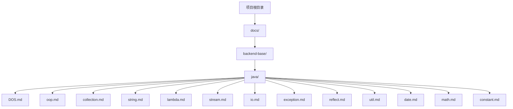
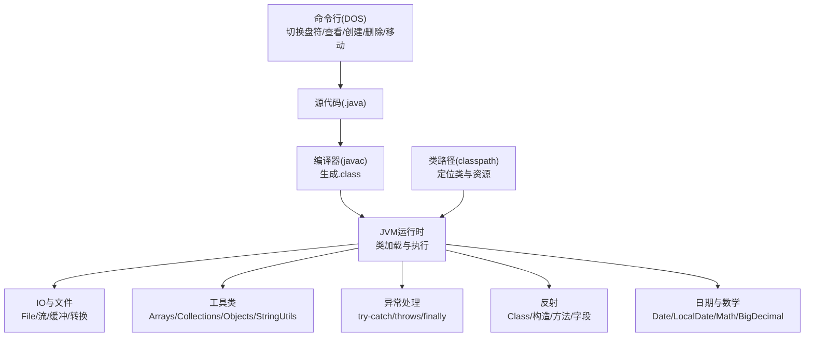
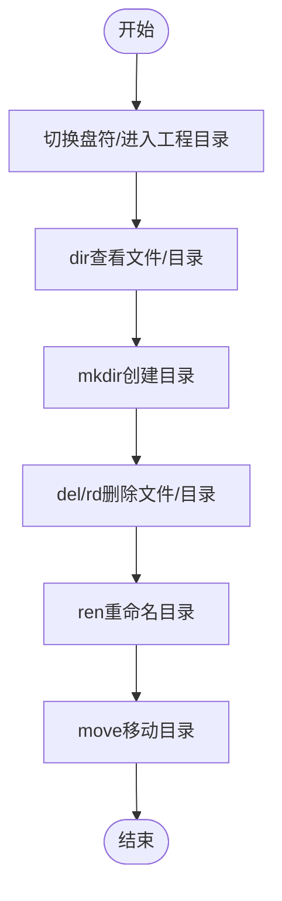
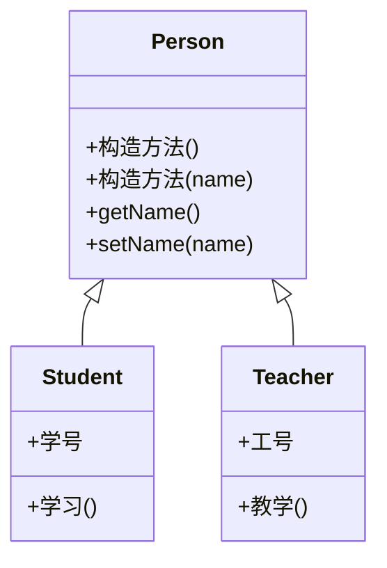
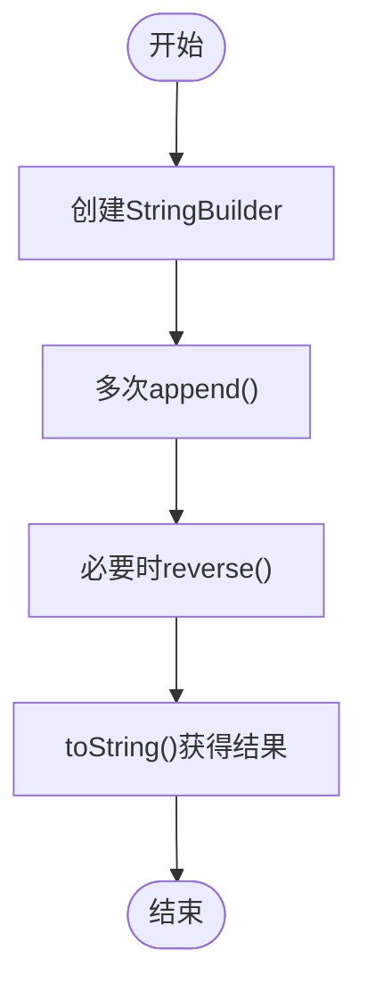
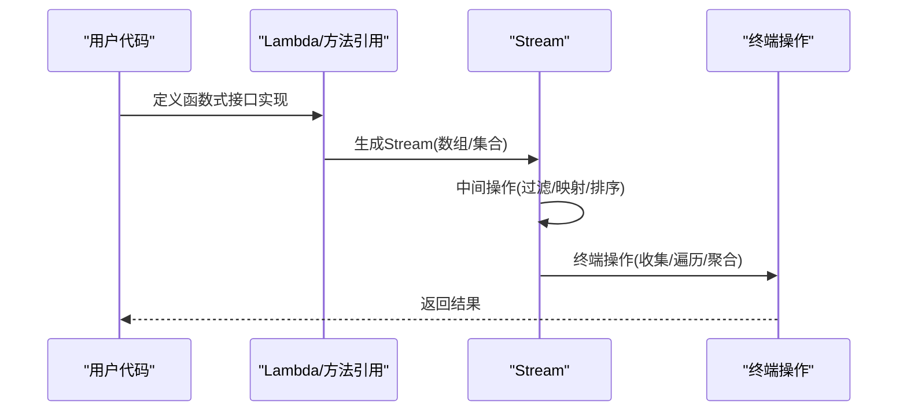
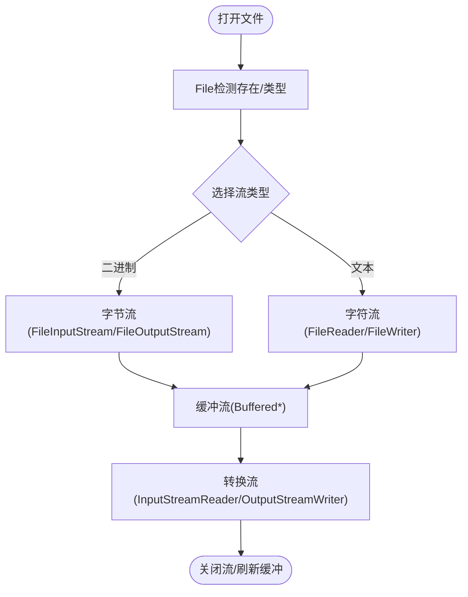
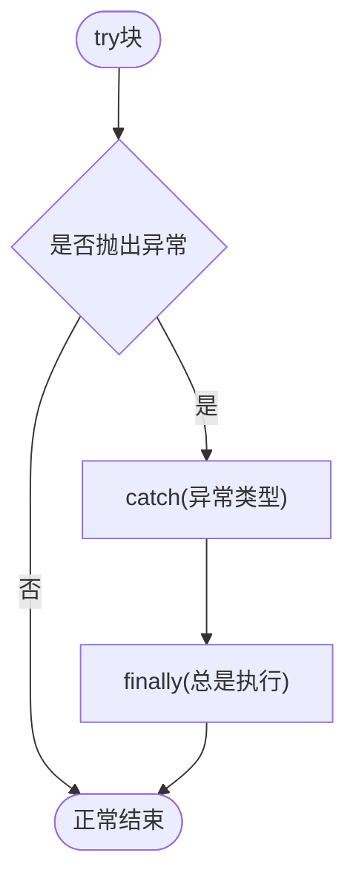
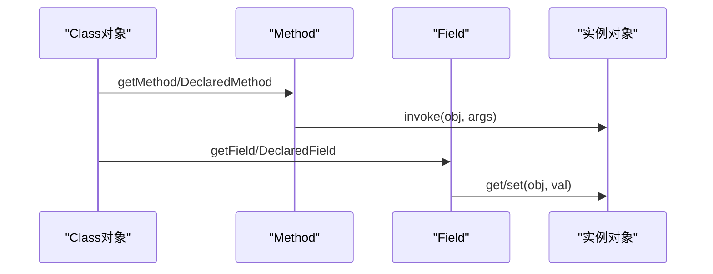
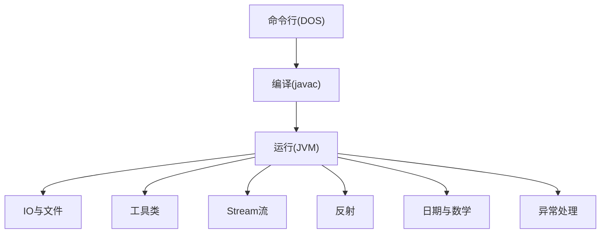

# 开发环境与命令行

<cite>
**本文引用的文件**
- [README.md](file://README.md)
- [DOS.md](file://docs/backend-base/java/DOS.md)
- [oop.md](file://docs/backend-base/java/oop.md)
- [collection.md](file://docs/backend-base/java/collection.md)
- [string.md](file://docs/backend-base/java/string.md)
- [lambda.md](file://docs/backend-base/java/lambda.md)
- [stream.md](file://docs/backend-base/java/stream.md)
- [io.md](file://docs/backend-base/java/io.md)
- [exception.md](file://docs/backend-base/java/exception.md)
- [reflect.md](file://docs/backend-base/java/reflect.md)
- [util.md](file://docs/backend-base/java/util.md)
- [date.md](file://docs/backend-base/java/date.md)
- [math.md](file://docs/backend-base/java/math.md)
- [constant.md](file://docs/backend-base/java/constant.md)
</cite>

## 目录
1. [简介](#简介)
2. [项目结构](#项目结构)
3. [核心组件](#核心组件)
4. [架构总览](#架构总览)
5. [详细组件分析](#详细组件分析)
6. [依赖分析](#依赖分析)
7. [性能考量](#性能考量)
8. [故障排查指南](#故障排查指南)
9. [结论](#结论)
10. [附录](#附录)

## 简介
本指南围绕Java开发环境与命令行工具展开，结合仓库中的Java基础文档，系统讲解：
- JDK安装与环境变量配置
- DOS命令行基础与常用操作
- Java程序的编译与运行流程
- classpath配置与项目结构组织
- IDE配置建议与实用技巧
- 常见问题排查与解决方案

本指南力求循序渐进，既适合初学者快速上手，也为有经验的开发者提供可操作的实践要点。

## 项目结构
该仓库采用VuePress文档结构，Java开发相关内容集中在 backend-base/java 目录下，涵盖命令行、面向对象、集合、字符串、Lambda、Stream、IO、异常、反射、工具类、日期时间、数学类、常量等主题。README用于首页展示与导航。



**图表来源**
- [README.md](file://README.md)
- [DOS.md](file://docs/backend-base/java/DOS.md)
- [oop.md](file://docs/backend-base/java/oop.md)
- [collection.md](file://docs/backend-base/java/collection.md)
- [string.md](file://docs/backend-base/java/string.md)
- [lambda.md](file://docs/backend-base/java/lambda.md)
- [stream.md](file://docs/backend-base/java/stream.md)
- [io.md](file://docs/backend-base/java/io.md)
- [exception.md](file://docs/backend-base/java/exception.md)
- [reflect.md](file://docs/backend-base/java/reflect.md)
- [util.md](file://docs/backend-base/java/util.md)
- [date.md](file://docs/backend-base/java/date.md)
- [math.md](file://docs/backend-base/java/math.md)
- [constant.md](file://docs/backend-base/java/constant.md)

**章节来源**
- [README.md](file://README.md)
- [DOS.md](file://docs/backend-base/java/DOS.md)

## 核心组件
- 命令行与文件系统操作：DOS命令用于切换盘符、查看/创建/删除/移动文件与文件夹，为Java工程准备工作目录与资源。
- 面向对象基础：类、抽象、封装、继承、接口、多态与this/super关键字，奠定Java语法与设计基础。
- 集合框架：Collection/List/Set/Map体系及常用实现类（ArrayList、LinkedList、HashSet、LinkedHashSet、TreeSet、HashMap、LinkedHashMap、TreeMap、Hashtable、Properties），支撑数据结构与算法实现。
- 字符串与构建：String、StringBuilder、StringBuffer的差异与使用场景，理解不可变性与可变性带来的性能影响。
- 函数式编程：Lambda表达式、方法引用、构造器引用与函数式接口（Supplier、Consumer、Predicate），提升代码简洁性与可读性。
- Stream流：中间操作与终端操作、过滤、映射、聚合、收集、排序、去重、查找等，配合集合高效处理数据。
- IO与文件：File类、字节流/字符流、缓冲流、转换流，掌握文件读写与文本处理。
- 异常处理：异常分类、try-catch、throws、finally与常用API，保障程序健壮性。
- 反射机制：Class对象获取、构造方法、成员方法与成员变量的获取与调用，理解动态性与安全性。
- 工具类：Arrays、Collections、Objects、StringUtils等，简化数组、集合与对象操作。
- 日期时间与数学：Date/Calendar与LocalDate/LocalDateTime/DateTimeFormatter、SimpleDateFormat、Math、BigInteger、BigDecimal，满足时间与高精度数值处理需求。
- 常量：整数、小数、字符、字符串、布尔、空常量的语义与使用。

**章节来源**
- [oop.md](file://docs/backend-base/java/oop.md)
- [collection.md](file://docs/backend-base/java/collection.md)
- [string.md](file://docs/backend-base/java/string.md)
- [lambda.md](file://docs/backend-base/java/lambda.md)
- [stream.md](file://docs/backend-base/java/stream.md)
- [io.md](file://docs/backend-base/java/io.md)
- [exception.md](file://docs/backend-base/java/exception.md)
- [reflect.md](file://docs/backend-base/java/reflect.md)
- [util.md](file://docs/backend-base/java/util.md)
- [date.md](file://docs/backend-base/java/date.md)
- [math.md](file://docs/backend-base/java/math.md)
- [constant.md](file://docs/backend-base/java/constant.md)

## 架构总览
下图展示了从命令行到Java程序执行的关键路径：命令行准备工程目录与资源，编译器将源码编译为字节码，运行时加载类与依赖，通过IO与工具类完成数据处理，异常与反射贯穿程序生命周期。



**图表来源**
- [DOS.md](file://docs/backend-base/java/DOS.md)
- [io.md](file://docs/backend-base/java/io.md)
- [util.md](file://docs/backend-base/java/util.md)
- [exception.md](file://docs/backend-base/java/exception.md)
- [reflect.md](file://docs/backend-base/java/reflect.md)
- [date.md](file://docs/backend-base/java/date.md)
- [math.md](file://docs/backend-base/java/math.md)

## 详细组件分析

### 命令行与文件系统操作
- 切换盘符与路径导航：快速进入工程根目录或资源目录。
- 查看文件与目录：dir列出当前/指定路径内容，支持/s递归显示。
- 创建/删除/重命名/移动目录：mkdir/rmdir/del/rd/ren/move等。
- 实战建议：在工程根目录统一管理src、lib、conf等子目录，使用mkdir批量创建；使用move整理历史版本或迁移资源；使用rmdir /s /q清理临时构建产物。



**图表来源**
- [DOS.md](file://docs/backend-base/java/DOS.md)

**章节来源**
- [DOS.md](file://docs/backend-base/java/DOS.md)

### 面向对象基础
- 类与对象：类是对一类事物的抽象，包含属性与行为；测试类含main方法，实体类不含main方法。
- 抽象与继承：抽象类不可实例化，必须被继承；子类需实现抽象方法；继承通过extends实现，单一继承。
- 封装与访问修饰符：private封装细节，this区分成员与局部变量；构造方法用于初始化。
- 接口与多态：接口不能实例化，通过implements实现；多态通过父类引用指向子类对象实现；方法重写需满足权限与异常约束；instanceof辅助转型。



**图表来源**
- [oop.md](file://docs/backend-base/java/oop.md)

**章节来源**
- [oop.md](file://docs/backend-base/java/oop.md)

### 集合框架
- Collection/List/Set/Map体系：List有序可重复，Set无序无重复，Map键值对唯一。
- 常用实现类：ArrayList/LinkedList/Vector（List），HashSet/LinkedHashSet/TreeSet（Set），HashMap/LinkedHashMap/TreeMap/Hashtable/Properties（Map）。
- 使用建议：频繁插入删除使用LinkedList；需要有序且去重使用LinkedHashSet；需要按键排序使用TreeMap；需要线程安全使用Hashtable或Collections.synchronizedMap包装。

```mermaid
classDiagram
class Collection~E~
class E[] {
+add(index, e)
+remove(index)
+get(index)
+set(index, e)
}
class Set~E~ {
+add(e)
+remove(e)
+contains(e)
}
class Map~K,V~ {
+put(k, v)
+get(k)
+remove(k)
+keySet()
+values()
}
Collection <|.. List
Collection <|.. Set
Map <|.. HashMap
Map <|.. TreeMap
Map <|.. LinkedHashMap
Map <|.. Hashtable
Map <|.. Properties
```

**图表来源**
- [collection.md](file://docs/backend-base/java/collection.md)

**章节来源**
- [collection.md](file://docs/backend-base/java/collection.md)

### 字符串与构建
- 不可变性：String对象一旦创建不可变，拼接会产生新对象；推荐StringBuilder进行频繁拼接。
- StringBuilder/StringBuffer：StringBuilder线程不安全但性能更高；StringBuffer线程安全。
- 使用建议：短文本拼接使用+即可；长文本或循环拼接使用StringBuilder；最终需要字符串时调用toString()。



**图表来源**
- [string.md](file://docs/backend-base/java/string.md)

**章节来源**
- [string.md](file://docs/backend-base/java/string.md)

### 函数式编程与Stream
- Lambda表达式：以->为分隔，参数列表与实现体；需配合函数式接口。
- 方法引用与构造器引用：简化Lambda；类::静态方法、对象::实例方法、类::new。
- Stream流：中间操作（filter/map/peek/sorted/skip/distinct）与终端操作（forEach/allMatch/anyMatch/noneMatch/reduce/collect/count/findFirst/findAny），支持链式调用且原有流不变。



**图表来源**
- [lambda.md](file://docs/backend-base/java/lambda.md)
- [stream.md](file://docs/backend-base/java/stream.md)

**章节来源**
- [lambda.md](file://docs/backend-base/java/lambda.md)
- [stream.md](file://docs/backend-base/java/stream.md)

### IO与文件
- File类：检测/增删改查文件与目录，获取路径、名称、大小、修改时间等。
- 字节流/字符流：字节流处理二进制文件，字符流处理文本文件。
- 缓冲流：BufferedInputStream/BufferedOutputStream、BufferedReader/BufferedWriter，减少系统调用与磁盘读写次数。
- 转换流：InputStreamReader/OutputStreamWriter，实现字节流与字符流互转，指定字符集。
- 实战建议：读写文本文件优先使用BufferedReader/BufferedWriter；跨平台换行使用newLine()；及时flush/close释放资源。



**图表来源**
- [io.md](file://docs/backend-base/java/io.md)

**章节来源**
- [io.md](file://docs/backend-base/java/io.md)

### 异常处理
- 异常分类：编译时异常必须处理；运行时异常建议处理。
- 处理方式：try-catch捕获；throws声明；finally保证执行；常用API：getCause/getMessage/printStackTrace/toString。
- 最佳实践：明确异常类型，记录堆栈信息；避免吞掉异常；在合适层级处理异常并向上抛出有意义的信息。



**图表来源**
- [exception.md](file://docs/backend-base/java/exception.md)

**章节来源**
- [exception.md](file://docs/backend-base/java/exception.md)

### 反射机制
- 获取Class对象：Class.forName/类名.class/对象.getClass()。
- 获取构造方法/成员方法/成员变量：getConstructors/getConstructor/getDeclaredConstructors/getMethod/getDeclaredMethod/getFields/getDeclaredField等。
- 动态调用：Constructor.newInstance/Method.invoke/Field.get/set，必要时setAccessible(true)解除私有限制。
- 安全与性能：反射带来灵活性但也引入安全风险与性能开销，谨慎使用。



**图表来源**
- [reflect.md](file://docs/backend-base/java/reflect.md)

**章节来源**
- [reflect.md](file://docs/backend-base/java/reflect.md)

### 工具类与实用技巧
- Arrays：复制、排序、填充、比较、二分查找、转字符串、转Stream。
- Collections：反转、打乱、排序、交换、二分查找、最值、填充、频率统计、复制、replaceAll。
- Objects：判空、equals、hashCode、深度比较数组。
- StringUtils：判空/空白、分割、拼接、大小写转换、包含/索引、替换、截取等（来自Apache Commons Lang）。
- 实用建议：判空优先使用Objects/StringUtils；数组/集合操作尽量使用工具类；注意不可变集合的局限性。

**章节来源**
- [util.md](file://docs/backend-base/java/util.md)

### 日期时间与数学
- 日期类：Date/Calendar（传统API），LocalDate/LocalDateTime/DateTimeFormatter/SimpleDateFormat（现代API）。
- 数学类：Math基本运算；BigInteger/BigDecimal支持高精度与任意精度计算。
- 实战建议：优先使用java.time.* API；BigDecimal除法需指定精度与舍入模式；注意时区与时差。

**章节来源**
- [date.md](file://docs/backend-base/java/date.md)
- [math.md](file://docs/backend-base/java/math.md)

## 依赖分析
- 模块内聚：各主题文档独立成章，便于按需查阅；命令行作为前置准备，其余模块相互独立但可组合使用。
- 外部依赖：工具类部分提及Apache Commons IO/StringUtils，需在工程中引入相应依赖；反射与IO涉及JDK标准库。
- 循环依赖：文档层面无循环引用；实际工程中应避免模块间循环依赖，采用接口隔离与分层设计。



**图表来源**
- [DOS.md](file://docs/backend-base/java/DOS.md)
- [io.md](file://docs/backend-base/java/io.md)
- [util.md](file://docs/backend-base/java/util.md)
- [stream.md](file://docs/backend-base/java/stream.md)
- [reflect.md](file://docs/backend-base/java/reflect.md)
- [date.md](file://docs/backend-base/java/date.md)
- [math.md](file://docs/backend-base/java/math.md)
- [exception.md](file://docs/backend-base/java/exception.md)

**章节来源**
- [DOS.md](file://docs/backend-base/java/DOS.md)
- [io.md](file://docs/backend-base/java/io.md)
- [util.md](file://docs/backend-base/java/util.md)
- [stream.md](file://docs/backend-base/java/stream.md)
- [reflect.md](file://docs/backend-base/java/reflect.md)
- [date.md](file://docs/backend-base/java/date.md)
- [math.md](file://docs/backend-base/java/math.md)
- [exception.md](file://docs/backend-base/java/exception.md)

## 性能考量
- 字符串拼接：避免频繁使用+，优先StringBuilder；必要时预估容量减少扩容。
- 集合选择：频繁插入删除使用LinkedList；需要排序使用TreeSet/TreeMap；需要线程安全使用同步集合或并发集合。
- IO优化：使用缓冲流减少系统调用；文本读写使用字符流并指定字符集；及时flush/close。
- Stream链式操作：合理拆分中间操作，避免过长链导致可读性下降；终端操作仅执行一次。
- 反射与异常：反射成本较高，仅在必要时使用；异常处理避免频繁创建异常对象，优先在上层统一处理。
- 数学计算：高精度使用BigDecimal并设定精度与舍入模式；避免不必要的装箱拆箱。

## 故障排查指南
- 编译失败
  - 检查JDK安装与JAVA_HOME/PATH配置；确认javac可用。
  - classpath未包含依赖或资源路径错误，使用-classpath或IDE设置。
  - 源码编码与文件编码不一致导致乱码，统一使用UTF-8。
- 运行时异常
  - NullPointerException：使用Objects/StringUtils判空；确保对象初始化。
  - ClassNotFound/NoClassDefFoundError：核对classpath与依赖版本；确认jar包存在且未被覆盖。
  - ArrayIndexOutOfBoundsException：检查循环边界与集合size()。
- IO异常
  - FileNotFoundException：确认文件路径与权限；使用File类先exists()检测。
  - 字符集问题：明确输入输出字符集，使用InputStreamReader/OutputStreamWriter指定charset。
- 反射异常
  - IllegalAccessException/NoSuchMethodException：确认方法可见性与签名；必要时setAccessible(true)。
- 性能问题
  - 字符串频繁拼接导致GC压力大：改为StringBuilder；减少对象创建。
  - Stream链过长：拆分为多个步骤，便于调试与优化。
- 日期时间问题
  - 时区与时差：使用java.time.* API并显式指定ZoneId；避免使用已废弃的Date/Calendar。

**章节来源**
- [exception.md](file://docs/backend-base/java/exception.md)
- [io.md](file://docs/backend-base/java/io.md)
- [reflect.md](file://docs/backend-base/java/reflect.md)
- [date.md](file://docs/backend-base/java/date.md)

## 结论
通过命令行准备工程、掌握面向对象与集合框架、善用Lambda与Stream、严谨处理IO与异常、理解反射与工具类、并结合日期与数学类的最佳实践，可以构建高效稳定的Java开发环境。建议在实际项目中遵循清晰的目录结构、严格的编码规范与完善的异常处理策略，持续优化性能与可维护性。

## 附录
- 常用命令速查
  - 切换盘符：盘符+冒号+回车
  - 查看目录：dir、dir /s
  - 创建目录：mkdir
  - 删除目录/文件：rmdir /s、del /q、rd /s /q
  - 重命名/移动：ren、move
- Java开发清单
  - 安装JDK并配置JAVA_HOME与PATH
  - 使用命令行创建工程目录与src/lib/conf
  - 编译与运行：javac、java
  - classpath配置：-cp或IDE设置
  - 依赖管理：maven或gradle（参考仓库中maven基础文档）