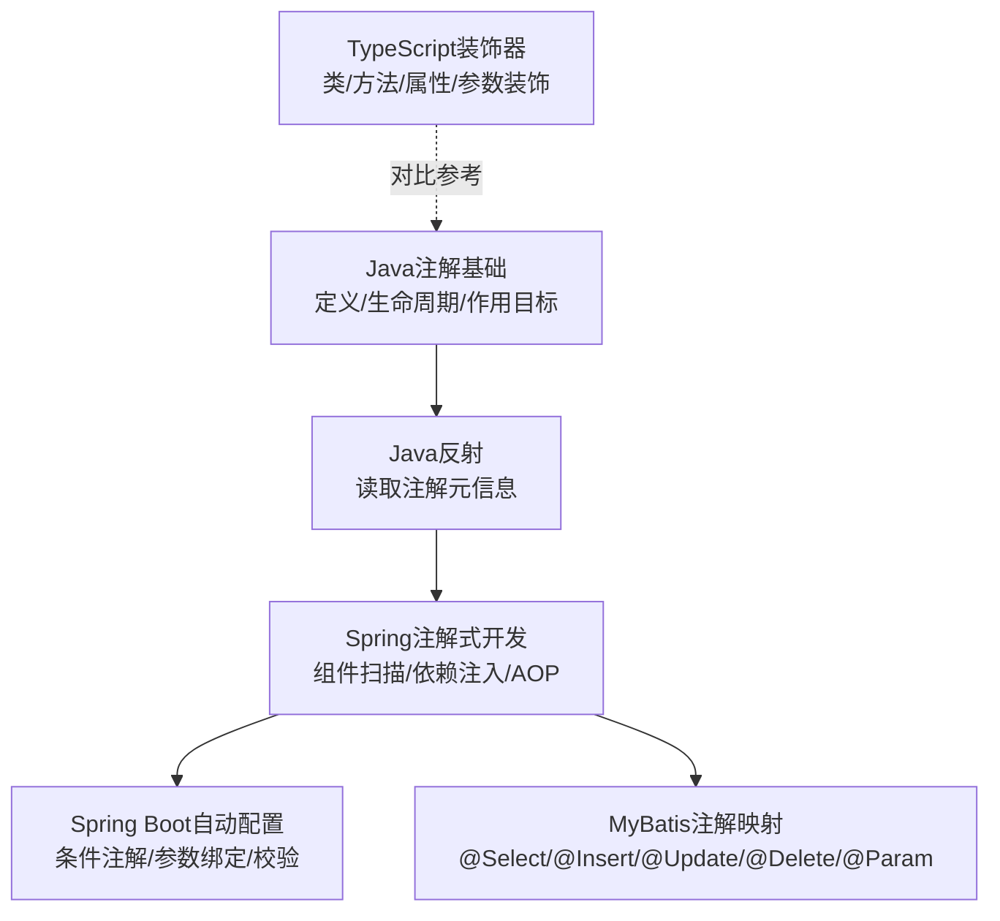
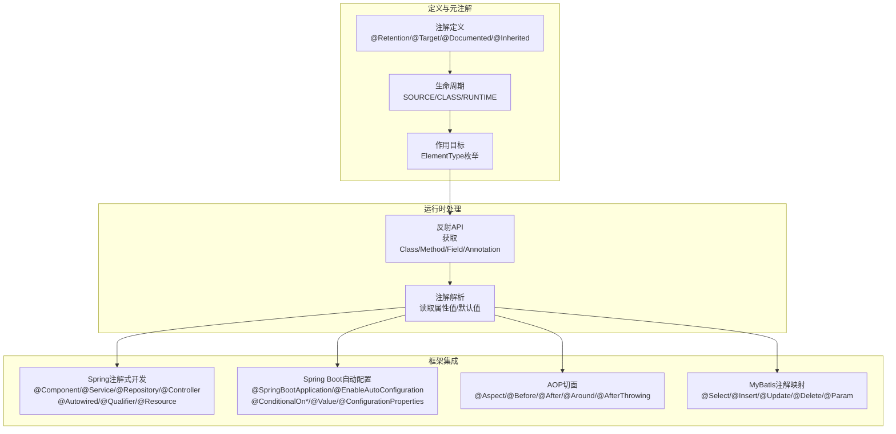
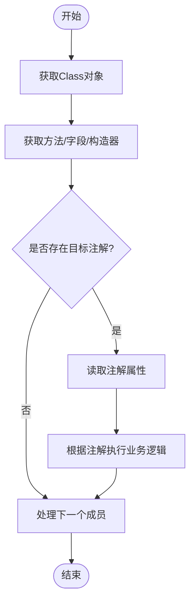
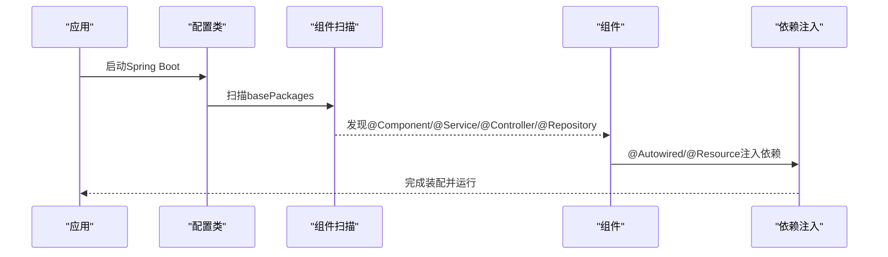
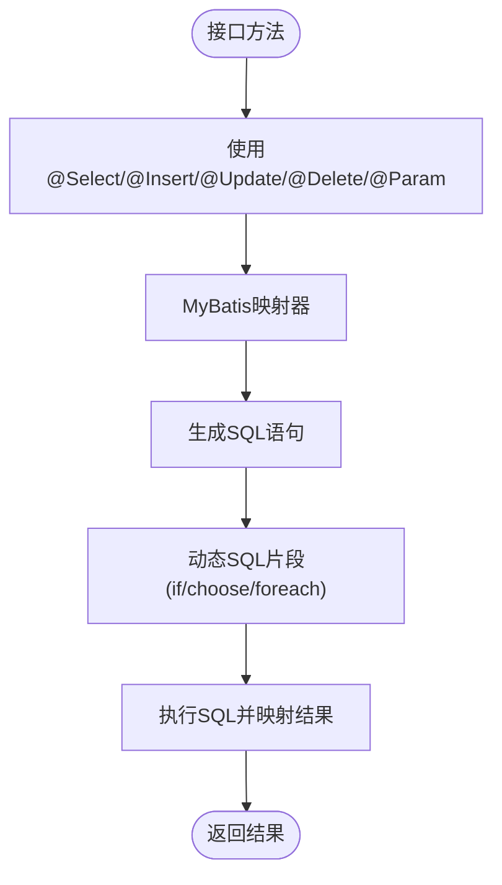

# 注解系统与元数据

<cite>
**本文引用的文件**
- [annotation.md](file://docs/backend-base/java/annotation.md)
- [reflect.md](file://docs/backend-base/java/reflect.md)
- [spring.md](file://docs/backend-base/spring/spring.md)
- [spring-boot-my.md](file://docs/backend-base/spring/spring-boot-my.md)
- [mapper.md](file://docs/backend-base/mybatis/mapper.md)
- [dynamic-sql.md](file://docs/backend-base/mybatis/dynamic-sql.md)
- [decorator.md](file://docs/interview/typescript/decorator.md)
</cite>

## 目录
1. [简介](#简介)
2. [项目结构](#项目结构)
3. [核心组件](#核心组件)
4. [架构总览](#架构总览)
5. [详细组件分析](#详细组件分析)
6. [依赖分析](#依赖分析)
7. [性能考量](#性能考量)
8. [故障排查指南](#故障排查指南)
9. [结论](#结论)
10. [附录](#附录)

## 简介
本技术文档围绕Java注解系统展开，系统梳理内置注解（Override、Deprecated、SuppressWarnings）的使用与作用，深入讲解自定义注解的定义、元注解的使用、注解处理器的开发思路，并对比运行时注解与编译时注解的区别。文档还结合Spring框架与MyBatis在注解驱动开发中的实践，阐述注解在框架开发中的关键作用，覆盖配置注解、依赖注入、ORM映射等典型应用场景，并提供最佳实践与排障建议。

## 项目结构
本仓库中与注解相关的内容主要分布在以下文档：
- Java基础：注解定义、生命周期、作用目标、使用与解析
- Java反射：通过反射读取注解元信息
- Spring框架：注解式开发、组件扫描、依赖注入、AOP切面、条件装配等
- Spring Boot：自动配置、条件注解、参数绑定与校验
- MyBatis：SQL映射与动态SQL，参数绑定注解
- TypeScript装饰器：与Java注解相似的元编程能力

图表来源
- [annotation.md:1-68](file://docs/backend-base/java/annotation.md#L1-L68)
- [reflect.md:1-111](file://docs/backend-base/java/reflect.md#L1-L111)
- [spring.md:5584-5806](file://docs/backend-base/spring/spring.md#L5584-L5806)
- [spring-boot-my.md:43-114](file://docs/backend-base/spring/spring-boot-my.md#L43-L114)
- [mapper.md:1-102](file://docs/backend-base/mybatis/mapper.md#L1-L102)
- [decorator.md:1-245](file://docs/interview/typescript/decorator.md#L1-L245)

章节来源
- [annotation.md:1-68](file://docs/backend-base/java/annotation.md#L1-L68)
- [reflect.md:1-111](file://docs/backend-base/java/reflect.md#L1-L111)
- [spring.md:5584-5806](file://docs/backend-base/spring/spring.md#L5584-L5806)
- [spring-boot-my.md:43-114](file://docs/backend-base/spring/spring-boot-my.md#L43-L114)
- [mapper.md:1-102](file://docs/backend-base/mybatis/mapper.md#L1-L102)
- [decorator.md:1-245](file://docs/interview/typescript/decorator.md#L1-L245)

## 核心组件
- 注解定义与元注解：Retention、Target、Documented、Inherited等
- 注解的生命周期：SOURCE、CLASS、RUNTIME
- 注解的作用目标：ElementType枚举覆盖类、方法、字段、参数等
- 注解的使用与解析：属性赋值、反射读取注解元信息
- 内置注解：Override、Deprecated、SuppressWarnings的用途与使用要点
- 自定义注解：定义属性、默认值、元注解约束
- 注解处理器：基于反射的注解解析与处理流程
- 运行时注解 vs 编译时注解：生命周期差异与处理时机
- 框架集成：Spring注解式开发、条件装配、AOP切面、参数绑定与校验；MyBatis注解映射与动态SQL

章节来源
- [annotation.md:11-68](file://docs/backend-base/java/annotation.md#L11-L68)
- [reflect.md:1-111](file://docs/backend-base/java/reflect.md#L1-L111)
- [spring.md:5584-5806](file://docs/backend-base/spring/spring.md#L5584-L5806)
- [spring-boot-my.md:43-114](file://docs/backend-base/spring/spring-boot-my.md#L43-L114)
- [mapper.md:1-102](file://docs/backend-base/mybatis/mapper.md#L1-L102)

## 架构总览
下图展示了注解在Java生态中的整体架构：从注解定义与元注解，到运行时通过反射解析，再到Spring与MyBatis等框架对注解的深度集成与扩展。

图表来源
- [annotation.md:11-68](file://docs/backend-base/java/annotation.md#L11-L68)
- [reflect.md:1-111](file://docs/backend-base/java/reflect.md#L1-L111)
- [spring.md:5707-5806](file://docs/backend-base/spring/spring.md#L5707-L5806)
- [spring-boot-my.md:43-114](file://docs/backend-base/spring/spring-boot-my.md#L43-L114)
- [mapper.md:1-102](file://docs/backend-base/mybatis/mapper.md#L1-L102)

## 详细组件分析

### 内置注解详解：Override、Deprecated、SuppressWarnings
- Override：用于标记方法覆写，编译期校验是否确为覆写父类或实现接口的方法，避免拼写错误导致的隐藏方法而非覆写。
- Deprecated：标记过时API，提示开发者替换为新接口；可配合SuppressWarnings抑制告警，但应谨慎使用。
- SuppressWarnings：用于抑制编译器警告，常用于兼容旧代码或特定场景，但应尽量减少使用并提供替代方案。

章节来源
- [annotation.md:3-9](file://docs/backend-base/java/annotation.md#L3-L9)

### 自定义注解与元注解
- 注解定义：通过@interface声明，可定义属性与默认值，使用元注解约束生命周期与作用目标。
- 元注解：@Retention、@Target、@Documented、@Inherited等，决定注解的可见性、作用范围、是否写入文档、是否可被继承。
- 注解使用：在类、方法、字段、参数、局部变量上使用，支持属性赋值与数组形式。
- 注解解析：通过反射读取注解元信息，获取属性值与默认值，实现运行时行为控制。

章节来源
- [annotation.md:33-68](file://docs/backend-base/java/annotation.md#L33-L68)
- [reflect.md:1-111](file://docs/backend-base/java/reflect.md#L1-L111)

### 注解处理器开发思路
- 基于反射的注解解析：获取Class、Method、Field、Constructor等，读取注解属性，执行相应逻辑。
- 处理流程示意：

图表来源
- [reflect.md:1-111](file://docs/backend-base/java/reflect.md#L1-L111)
- [annotation.md:55-68](file://docs/backend-base/java/annotation.md#L55-L68)

### 运行时注解与编译时注解
- 运行时注解：@Retention(RetentionPolicy.RUNTIME)，可通过反射在运行时读取注解信息，适合依赖注入、AOP、参数校验等场景。
- 编译时注解：@Retention(RetentionPolicy.CLASS/SOURCE)，在编译期或源码阶段生效，适合代码生成、静态分析等场景。
- 区别与选择：运行时注解便于动态行为控制；编译时注解提升性能与安全性，但无法在运行时动态修改。

章节来源
- [annotation.md:11-16](file://docs/backend-base/java/annotation.md#L11-L16)

### Spring注解式开发与依赖注入
- 组件注解：@Component、@Controller、@Service、@Repository，均以@Component为核心，通过别名增强可读性。
- 自动装配：@Autowired按类型装配，@Qualifier按名称装配；@Resource按名称装配，兼容JDK标准。
- 条件装配：@ConditionalOnMissingBean、@ConditionalOnProperty、@ConditionalOnClass等，实现按环境与依赖自动配置。
- 参数绑定与校验：@Value、@ConfigurationProperties、Spring Validation注解实现参数绑定与校验。

图表来源
- [spring.md:5707-5806](file://docs/backend-base/spring/spring.md#L5707-L5806)
- [spring-boot-my.md:43-114](file://docs/backend-base/spring/spring-boot-my.md#L43-L114)

章节来源
- [spring.md:5707-5806](file://docs/backend-base/spring/spring.md#L5707-L5806)
- [spring-boot-my.md:43-114](file://docs/backend-base/spring/spring-boot-my.md#L43-L114)

### MyBatis注解映射与动态SQL
- 注解映射：@Select、@Insert、@Update、@Delete、@Param等，用于直接在接口上声明SQL，替代XML映射。
- 动态SQL：if/choose/when/otherwise/foreach等标签，支持条件拼接与集合遍历。
- 参数绑定：@Param用于命名参数，简化SQL中参数引用。

图表来源
- [mapper.md:1-102](file://docs/backend-base/mybatis/mapper.md#L1-L102)
- [dynamic-sql.md:1-113](file://docs/backend-base/mybatis/dynamic-sql.md#L1-L113)

章节来源
- [mapper.md:1-102](file://docs/backend-base/mybatis/mapper.md#L1-L102)
- [dynamic-sql.md:1-113](file://docs/backend-base/mybatis/dynamic-sql.md#L1-L113)

### TypeScript装饰器（对比参考）
- 装饰器本质是运行时调用的函数，可装饰类、方法、属性、参数与访问器。
- 支持装饰器工厂，通过闭包传递参数。
- 执行顺序：由上至下评估装饰器表达式，再由下至上依次调用。

章节来源
- [decorator.md:1-245](file://docs/interview/typescript/decorator.md#L1-L245)

## 依赖分析
- 注解与反射：注解定义与元注解决定注解的可用性与作用范围；反射提供运行时读取注解的能力。
- Spring框架：注解式开发依赖组件扫描与依赖注入；AOP切面依赖注解识别与织入。
- Spring Boot：自动配置依赖条件注解与配置类；参数绑定与校验依赖注解解析。
- MyBatis：注解映射与动态SQL依赖注解解析与SQL构建。

图表来源
- [annotation.md:11-68](file://docs/backend-base/java/annotation.md#L11-L68)
- [reflect.md:1-111](file://docs/backend-base/java/reflect.md#L1-L111)
- [spring.md:5707-5806](file://docs/backend-base/spring/spring.md#L5707-L5806)
- [spring-boot-my.md:43-114](file://docs/backend-base/spring/spring-boot-my.md#L43-L114)
- [mapper.md:1-102](file://docs/backend-base/mybatis/mapper.md#L1-L102)

章节来源
- [annotation.md:11-68](file://docs/backend-base/java/annotation.md#L11-L68)
- [reflect.md:1-111](file://docs/backend-base/java/reflect.md#L1-L111)
- [spring.md:5707-5806](file://docs/backend-base/spring/spring.md#L5707-L5806)
- [spring-boot-my.md:43-114](file://docs/backend-base/spring/spring-boot-my.md#L43-L114)
- [mapper.md:1-102](file://docs/backend-base/mybatis/mapper.md#L1-L102)

## 性能考量
- 运行时注解：反射读取注解带来额外开销，建议在启动阶段缓存注解元信息，避免频繁反射。
- 编译时注解：在编译期生成代码或进行静态分析，减少运行时成本，适合大规模代码生成与校验。
- Spring条件装配：合理使用条件注解，避免不必要的Bean创建与初始化。
- MyBatis注解映射：复杂SQL建议使用XML映射或动态SQL标签，减少注解表达式复杂度。

## 故障排查指南
- 注解未生效
  - 检查@Retention是否为RUNTIME，确保可在运行时读取。
  - 确认注解作用目标与使用位置一致。
- 反射读取失败
  - 确保目标类、方法、字段可见性正确，必要时使用setAccessible(true)。
  - 检查注解属性默认值与实际赋值是否冲突。
- Spring依赖注入失败
  - 确认组件扫描路径包含目标类。
  - 检查@Autowired/@Qualifier/@Resource的使用是否正确。
  - 若存在多个候选Bean，使用@Qualifier指定名称。
- Spring Boot条件装配不生效
  - 检查条件注解的属性值与配置文件是否一致。
  - 确认所需依赖类是否存在。
- MyBatis注解映射问题
  - 检查@Param命名与SQL占位符是否一致。
  - 复杂条件使用动态SQL标签，避免注解表达式过长。

章节来源
- [reflect.md:1-111](file://docs/backend-base/java/reflect.md#L1-L111)
- [spring.md:6231-6530](file://docs/backend-base/spring/spring.md#L6231-L6530)
- [spring-boot-my.md:277-288](file://docs/backend-base/spring/spring-boot-my.md#L277-L288)
- [mapper.md:1-102](file://docs/backend-base/mybatis/mapper.md#L1-L102)

## 结论
注解是Java元数据的重要载体，贯穿从语言层面到框架集成的全栈开发。通过合理定义与使用注解，结合反射与框架能力，可以实现声明式配置、依赖注入、AOP切面、自动配置与ORM映射等高级能力。在实践中，应权衡运行时与编译时注解的取舍，遵循最佳实践，提升代码可读性与可维护性。

## 附录
- 示例路径参考（不展示具体代码内容）
  - 注解定义与使用：[注解定义与使用:33-68](file://docs/backend-base/java/annotation.md#L33-L68)
  - 反射读取注解：[反射API与注解解析:1-111](file://docs/backend-base/java/reflect.md#L1-L111)
  - Spring注解式开发：[@Component/@Service/@Controller/@Repository:5707-5806](file://docs/backend-base/spring/spring.md#L5707-L5806)
  - Spring依赖注入：[@Autowired/@Qualifier/@Resource:6231-6530](file://docs/backend-base/spring/spring.md#L6231-L6530)
  - Spring Boot自动配置：[@SpringBootApplication/@EnableAutoConfiguration/@ConditionalOn*/@Value/@ConfigurationProperties:43-114](file://docs/backend-base/spring/spring-boot-my.md#L43-L114)
  - MyBatis注解映射：[@Select/@Insert/@Update/@Delete/@Param:1-102](file://docs/backend-base/mybatis/mapper.md#L1-L102)
  - MyBatis动态SQL：[动态SQL标签与@Param:1-113](file://docs/backend-base/mybatis/dynamic-sql.md#L1-L113)
  - TypeScript装饰器：[装饰器使用与执行顺序:1-245](file://docs/interview/typescript/decorator.md#L1-L245)