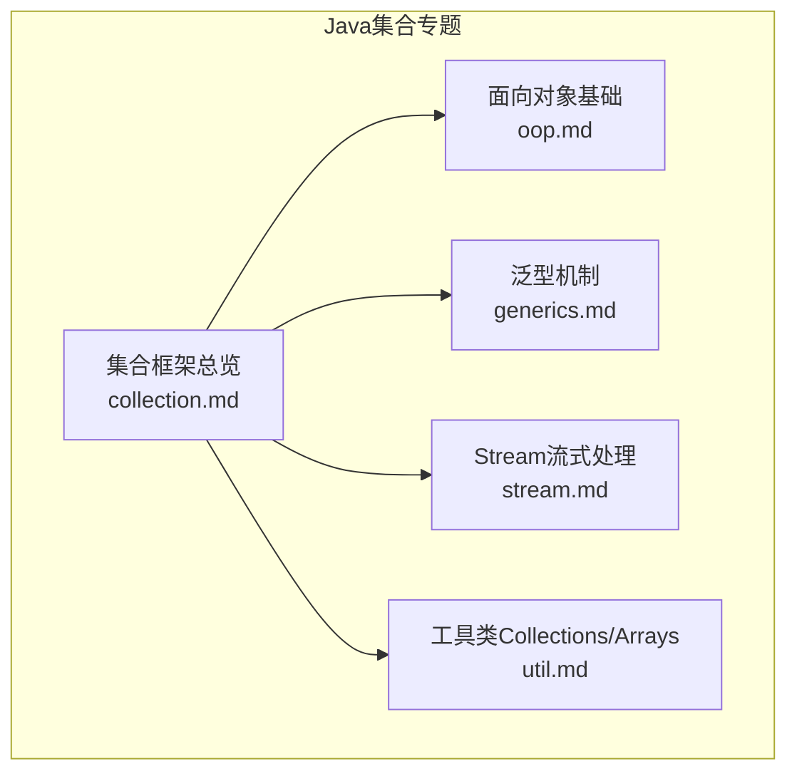
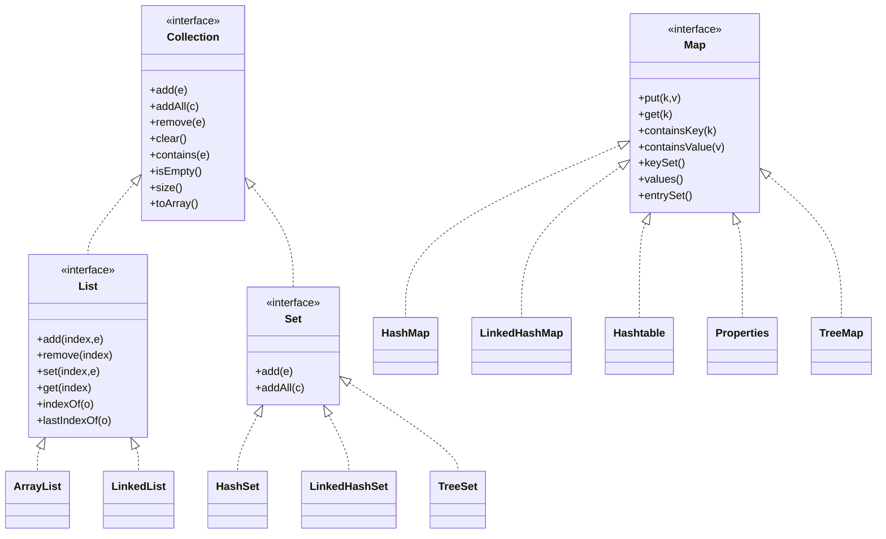
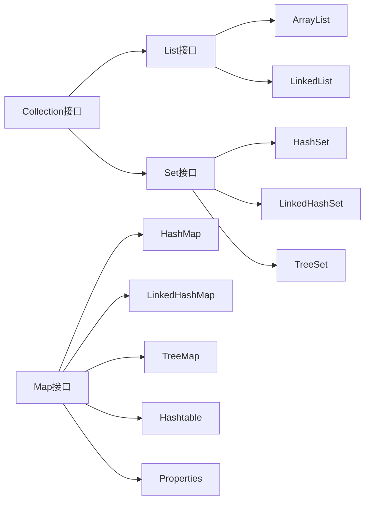

# 集合框架详解

<cite>
**本文引用的文件**
- [collection.md](file://docs/backend-base/java/collection.md)
- [oop.md](file://docs/backend-base/java/oop.md)
- [generics.md](file://docs/backend-base/java/generics.md)
- [stream.md](file://docs/backend-base/java/stream.md)
- [util.md](file://docs/backend-base/java/util.md)
</cite>

## 目录
1. [简介](#简介)
2. [项目结构](#项目结构)
3. [核心组件](#核心组件)
4. [架构总览](#架构总览)
5. [详细组件分析](#详细组件分析)
6. [依赖分析](#依赖分析)
7. [性能考量](#性能考量)
8. [故障排查指南](#故障排查指南)
9. [结论](#结论)
10. [附录](#附录)

## 简介
本技术文档围绕Java集合框架展开，系统梳理Collection接口体系、List接口（ArrayList、LinkedList）、Set接口（HashSet、LinkedHashSet、TreeSet）、Map接口（HashMap、LinkedHashMap、Hashtable、Properties、TreeMap）等核心集合类的特性、实现原理、性能特征、线程安全性与适用场景。文档同时提供集合操作的最佳实践、常见问题解决方案与性能优化建议，并通过流程图与类图帮助读者建立完整的知识结构。

## 项目结构
本仓库为个人博客站点，集合框架相关内容集中在后端基础模块的Java专题中，主要文档包括：
- 集合框架总览与各实现类说明
- 面向对象基础（接口、继承、多态）
- 泛型机制
- Stream流式处理
- 工具类Collections与Arrays

图表来源
- [collection.md:1-434](file://docs/backend-base/java/collection.md#L1-L434)
- [oop.md:167-223](file://docs/backend-base/java/oop.md#L167-L223)
- [generics.md:1-62](file://docs/backend-base/java/generics.md#L1-L62)
- [stream.md:1-105](file://docs/backend-base/java/stream.md#L1-L105)
- [util.md:187-213](file://docs/backend-base/java/util.md#L187-L213)

章节来源
- [collection.md:1-434](file://docs/backend-base/java/collection.md#L1-L434)

## 核心组件
本节聚焦Collection接口体系及其实现类的关键能力与差异点，便于快速定位适用场景。

- Collection接口
  - 单列集合顶级接口，提供增删改查、批量操作与转换为数组等通用能力。
  - 常用方法：add/addAll/remove/removeAll/retainAll/removeIf/clear/contains/containsAll/isEmpty/size/toArray等。

- List接口
  - 继承自Collection，支持按索引访问与插入，允许重复元素。
  - 扩展方法：add(index)/remove(index)/set(index)/get(index)/indexOf/lastIndexOf等。
  - 静态工厂：copyOf/of等不可变列表创建。

- Set接口
  - 表示不包含重复元素的集合，最多一个null。
  - 静态工厂：copyOf/of等不可变集合创建。

- Map接口
  - 双列集合顶级接口，键唯一，值可重复。
  - 常用方法：put/putAll/get/getOrDefault/containsKey/containsValue/keySet/values/entrySet/forEach等。
  - 静态工厂：copyOf/entry/of等不可变Map创建。

章节来源
- [collection.md:16-103](file://docs/backend-base/java/collection.md#L16-L103)
- [collection.md:324-369](file://docs/backend-base/java/collection.md#L324-L369)

## 架构总览
Java集合框架采用“接口+实现类”的分层设计，接口定义统一契约，具体实现类负责不同数据结构与性能权衡。下图展示了核心接口与典型实现的关系。

图表来源
- [collection.md:10-11](file://docs/backend-base/java/collection.md#L10-L11)
- [collection.md:50-82](file://docs/backend-base/java/collection.md#L50-L82)
- [collection.md:84-102](file://docs/backend-base/java/collection.md#L84-L102)
- [collection.md:324-369](file://docs/backend-base/java/collection.md#L324-L369)
- [collection.md:104-159](file://docs/backend-base/java/collection.md#L104-L159)
- [collection.md:161-211](file://docs/backend-base/java/collection.md#L161-L211)
- [collection.md:213-245](file://docs/backend-base/java/collection.md#L213-L245)
- [collection.md:247-277](file://docs/backend-base/java/collection.md#L247-L277)
- [collection.md:279-322](file://docs/backend-base/java/collection.md#L279-L322)
- [collection.md:371-387](file://docs/backend-base/java/collection.md#L371-L387)
- [collection.md:388-392](file://docs/backend-base/java/collection.md#L388-L392)
- [collection.md:394-398](file://docs/backend-base/java/collection.md#L394-L398)
- [collection.md:400-429](file://docs/backend-base/java/collection.md#L400-L429)
- [collection.md:431-434](file://docs/backend-base/java/collection.md#L431-L434)

## 详细组件分析

### Collection接口与List接口
- 设计要点
  - Collection提供集合通用操作，List在Collection基础上增加按索引访问与插入的能力。
  - List支持随机访问（如ArrayList）与顺序访问（如LinkedList）两类策略。
- 性能与适用场景
  - 随机访问频繁：优先ArrayList。
  - 插入/删除频繁：优先LinkedList。
  - 需要不可变视图：使用List静态工厂方法。
- 最佳实践
  - 明确类型参数，避免原始类型导致的装箱拆箱与类型转换风险。
  - 使用增强for循环或Stream进行遍历，减少索引越界风险。

章节来源
- [collection.md:16-82](file://docs/backend-base/java/collection.md#L16-L82)
- [collection.md:50-82](file://docs/backend-base/java/collection.md#L50-L82)

### Set接口与实现类
- HashSet
  - 底层由哈希表实现，不保证迭代顺序，线程不安全。
  - 特性：无序、无索引、元素唯一、可含一个null。
  - 适用：去重、快速查找、缓存键集合。
- LinkedHashSet
  - 底层链表+哈希表，保持插入顺序，线程不安全。
  - 适用：需要稳定顺序的去重场景。
- TreeSet
  - 底层红黑树，可对元素排序，线程不安全。
  - 提供导航方法（first/last/ceiling/floor/higher/lower/pollFirst/pollLast等）。
  - 适用：需要有序集合与范围查询的场景。

章节来源
- [collection.md:84-102](file://docs/backend-base/java/collection.md#L84-L102)
- [collection.md:213-245](file://docs/backend-base/java/collection.md#L213-L245)
- [collection.md:247-277](file://docs/backend-base/java/collection.md#L247-L277)
- [collection.md:279-322](file://docs/backend-base/java/collection.md#L279-L322)

### Map接口与实现类
- HashMap
  - 键唯一、无序、可含一个null键与null值，线程不安全。
  - 底层为哈希表，适合大多数键值对存储与查询场景。
- LinkedHashMap
  - 继承HashMap，保持插入或访问顺序，线程不安全。
  - 适用：LRU缓存、需要稳定顺序的键值对集合。
- Hashtable
  - 线程安全，不可含null键与null值，底层为哈希表。
  - 适用：历史遗留系统或需要同步语义的场景。
- Properties
  - 继承Hashtable，键值均为字符串，提供load/store/XML加载能力。
  - 适用：配置文件读写。
- TreeMap
  - 键唯一、可对键排序，线程不安全，不可含null键与null值。
  - 底层为红黑树，适合需要按键排序与范围查询的场景。

章节来源
- [collection.md:324-369](file://docs/backend-base/java/collection.md#L324-L369)
- [collection.md:371-387](file://docs/backend-base/java/collection.md#L371-L387)
- [collection.md:388-392](file://docs/backend-base/java/collection.md#L388-L392)
- [collection.md:394-398](file://docs/backend-base/java/collection.md#L394-L398)
- [collection.md:400-429](file://docs/backend-base/java/collection.md#L400-L429)
- [collection.md:431-434](file://docs/backend-base/java/collection.md#L431-L434)

### ArrayList与LinkedList
- ArrayList
  - 底层数组实现，支持随机访问，扩容时有成本。
  - 适用：随机访问频繁、顺序遍历、批量操作。
  - 注意：并发修改需谨慎，必要时使用CopyOnWriteArrayList。
- LinkedList
  - 底层双向链表实现，插入/删除高效，随机访问较慢。
  - 适用：频繁插入/删除、队列/栈场景。
  - 注意：内存占用略高，不适合大量小对象的随机访问。

章节来源
- [collection.md:104-159](file://docs/backend-base/java/collection.md#L104-L159)
- [collection.md:161-211](file://docs/backend-base/java/collection.md#L161-L211)

### Stream流式处理与集合操作
- 流式处理优势
  - 函数式风格，支持惰性求值与链式操作。
  - 中间操作（filter/map/sorted/skip/takeWhile等）与终端操作（forEach/reduce/collect/count/find等）分离。
- 与集合的协作
  - 通过Collection.stream()/Arrays.stream()构建流。
  - 使用collect()将流转换回集合或数组。
- 最佳实践
  - 合理选择中间操作顺序，避免不必要的中间集合。
  - 对于大数据量，优先考虑并行流parallelStream()，注意状态共享与副作用。

章节来源
- [stream.md:1-105](file://docs/backend-base/java/stream.md#L1-L105)

### 工具类Collections与Arrays
- Collections
  - 提供排序、反转、打乱、二分查找、替换、频率统计等集合级操作。
  - 适合对List/Set等集合进行原地或批量操作。
- Arrays
  - 提供数组复制、填充、排序、二分查找、比较、打印等数组级操作。
  - 与集合互转：Arrays.asList()返回固定大小的List视图，若需可变List需二次包装。

章节来源
- [util.md:187-213](file://docs/backend-base/java/util.md#L187-L213)
- [util.md:7-82](file://docs/backend-base/java/util.md#L7-L82)

## 依赖分析
- 接口与实现的耦合
  - List/Set/Map均通过接口约束行为，具体实现类（ArrayList/LinkedList/HashSet/TreeSet/HashMap/TreeMap等）提供不同性能特征。
- 泛型与类型安全
  - 泛型在集合声明与方法签名中广泛使用，有助于编译期类型检查，减少运行时类型转换异常。
- Stream与集合的协作
  - Stream以集合或数组为数据源，中间操作返回新流，最终汇聚到集合或数组，形成清晰的数据处理管线。

图表来源
- [collection.md:10-11](file://docs/backend-base/java/collection.md#L10-L11)
- [collection.md:324-369](file://docs/backend-base/java/collection.md#L324-L369)
- [collection.md:104-159](file://docs/backend-base/java/collection.md#L104-L159)
- [collection.md:161-211](file://docs/backend-base/java/collection.md#L161-L211)
- [collection.md:213-322](file://docs/backend-base/java/collection.md#L213-L322)

## 性能考量
- 时间复杂度概览
  - ArrayList：随机访问O(1)，尾部插入摊销O(1)，中间插入/删除O(n)。
  - LinkedList：插入/删除O(1)，随机访问O(n)。
  - HashSet：平均查找/插入/删除O(1)，最坏O(n)。
  - TreeSet：查找/插入/删除O(log n)。
  - HashMap：平均查找/插入/删除O(1)，最坏O(n)。
  - TreeMap：查找/插入/删除O(log n)。
- 空间与内存
  - ArrayList扩容策略带来额外空间与复制成本。
  - LinkedList节点指针占用更高内存。
  - HashMap/TreeMap的负载因子与树化阈值影响内存与性能平衡。
- 并发与线程安全
  - 默认实现多数为非线程安全，需结合Collections.synchronizedXxx或并发集合。
- 优化建议
  - 预估容量：创建集合时指定初始容量，减少扩容次数。
  - 选择合适实现：根据访问模式选择ArrayList或LinkedList。
  - 使用Stream并行处理：对大数据量进行并行聚合与过滤。
  - 避免装箱拆箱：优先使用基本类型集合或数值型Stream。

[本节为通用性能指导，不直接分析特定文件]

## 故障排查指南
- 常见问题与对策
  - 空指针异常：使用Objects.requireNonNull/Stream的filter进行前置校验。
  - 并发修改异常：使用线程安全集合或显式同步；避免在迭代期间修改集合。
  - 类型转换异常：明确泛型类型，避免原始类型与强转。
  - 内存溢出：合理设置初始容量与负载因子；及时释放不再使用的集合引用。
- 定位思路
  - 使用Stream的peek进行中间步骤观察。
  - 使用Collections.frequency/Arrays.mismatch辅助定位重复或差异。
  - 使用Stream的distinct/filter/count等进行数据质量检查。

章节来源
- [util.md:135-185](file://docs/backend-base/java/util.md#L135-L185)
- [stream.md:27-104](file://docs/backend-base/java/stream.md#L27-L104)

## 结论
Java集合框架通过接口与实现分离的设计，为不同场景提供了多样化的数据结构选择。掌握各实现类的底层原理、性能特征与适用边界，是编写高性能、可维护代码的关键。配合Stream与工具类Collections/Arrays，能够进一步提升集合操作的表达力与效率。建议在实际项目中结合业务特征与性能目标，选择合适的集合类型并遵循最佳实践。

[本节为总结性内容，不直接分析特定文件]

## 附录
- 代码示例路径参考
  - 集合创建与遍历：[collection.md:20-48](file://docs/backend-base/java/collection.md#L20-L48)
  - List静态工厂：[collection.md:56-62](file://docs/backend-base/java/collection.md#L56-L62)
  - Set静态工厂：[collection.md:90-95](file://docs/backend-base/java/collection.md#L90-L95)
  - Map静态工厂：[collection.md:330-336](file://docs/backend-base/java/collection.md#L330-L336)
  - ArrayList构造与方法：[collection.md:112-159](file://docs/backend-base/java/collection.md#L112-L159)
  - LinkedList构造与方法：[collection.md:167-211](file://docs/backend-base/java/collection.md#L167-L211)
  - HashSet构造与方法：[collection.md:219-245](file://docs/backend-base/java/collection.md#L219-L245)
  - LinkedHashSet构造与方法：[collection.md:251-277](file://docs/backend-base/java/collection.md#L251-L277)
  - TreeSet构造与方法：[collection.md:283-322](file://docs/backend-base/java/collection.md#L283-L322)
  - HashMap构造与方法：[collection.md:375-387](file://docs/backend-base/java/collection.md#L375-L387)
  - LinkedHashMap说明：[collection.md:388-392](file://docs/backend-base/java/collection.md#L388-L392)
  - Hashtable说明：[collection.md:394-398](file://docs/backend-base/java/collection.md#L394-L398)
  - Properties构造与方法：[collection.md:406-429](file://docs/backend-base/java/collection.md#L406-L429)
  - TreeMap说明：[collection.md:431-434](file://docs/backend-base/java/collection.md#L431-L434)
  - Stream创建与操作：[stream.md:10-104](file://docs/backend-base/java/stream.md#L10-L104)
  - Collections工具方法：[util.md:187-213](file://docs/backend-base/java/util.md#L187-L213)
  - Arrays工具方法：[util.md:7-82](file://docs/backend-base/java/util.md#L7-L82)