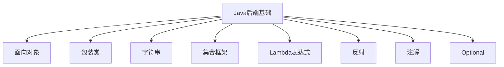
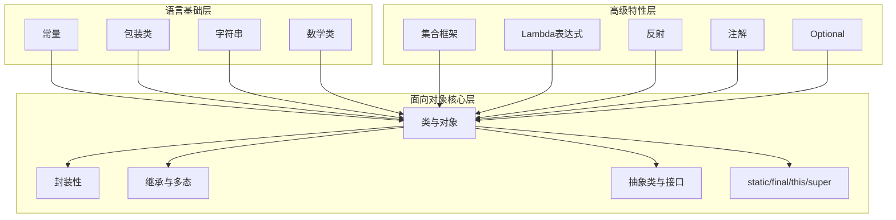
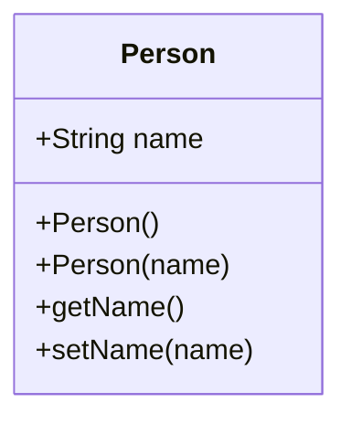
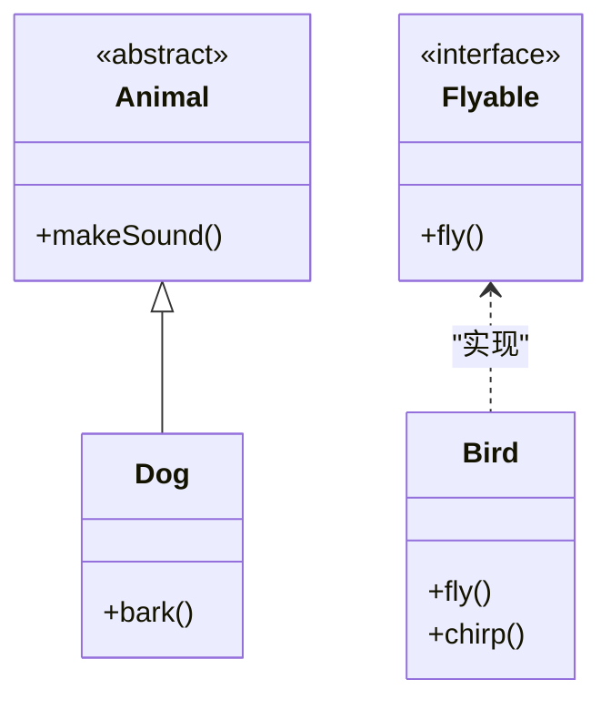
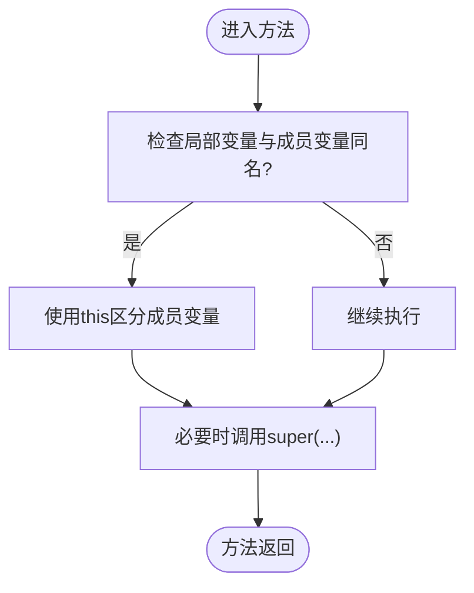
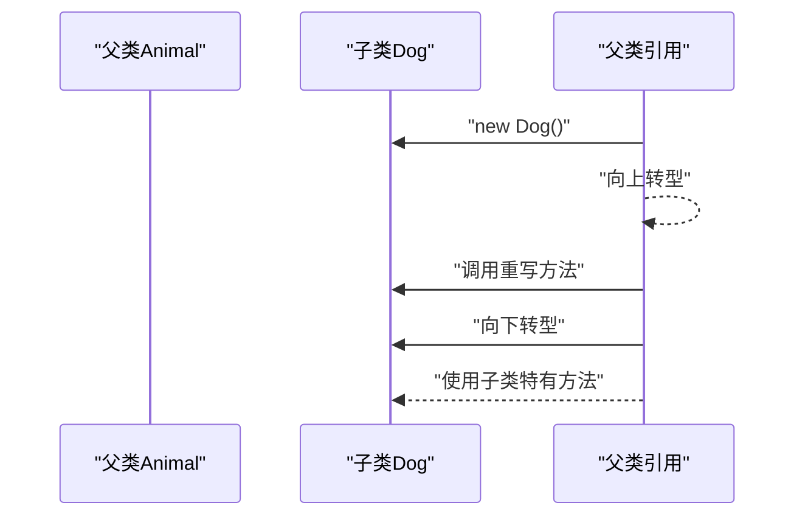
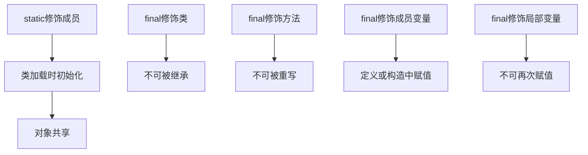
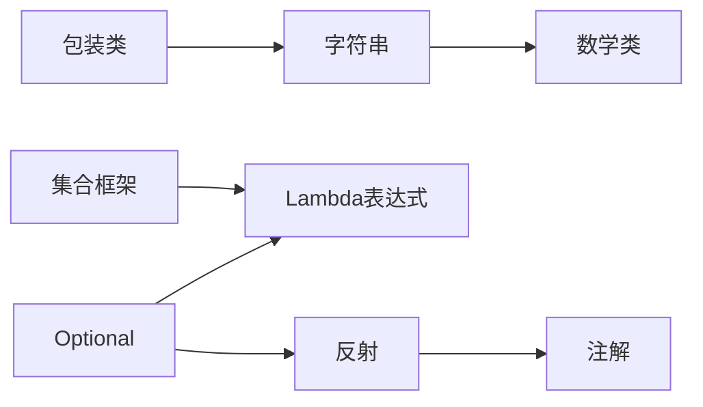
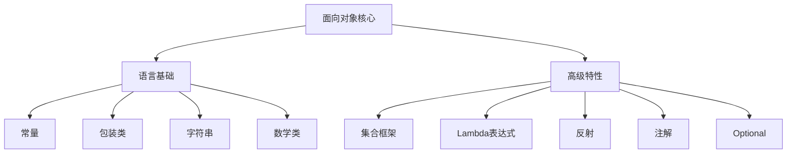

# 面向对象编程基础

<cite>
**本文引用的文件**
- [面向对象](file://docs/backend-base/java/oop.md)
- [包装类](file://docs/backend-base/java/package.md)
- [常量](file://docs/backend-base/java/constant.md)
- [字符串](file://docs/backend-base/java/string.md)
- [数学类](file://docs/backend-base/java/math.md)
- [集合框架](file://docs/backend-base/java/collection.md)
- [Lambda表达式](file://docs/backend-base/java/lambda.md)
- [反射](file://docs/backend-base/java/reflect.md)
- [注解](file://docs/backend-base/java/annotation.md)
- [Optional](file://docs/backend-base/java/optional.md)
</cite>

## 目录
1. [简介](#简介)
2. [项目结构](#项目结构)
3. [核心组件](#核心组件)
4. [架构总览](#架构总览)
5. [详细组件分析](#详细组件分析)
6. [依赖分析](#依赖分析)
7. [性能考虑](#性能考虑)
8. [故障排查指南](#故障排查指南)
9. [结论](#结论)
10. [附录](#附录)

## 简介
本篇文档围绕Java面向对象编程基础，系统梳理类与对象、抽象类与接口、封装性、继承关系、多态实现等核心概念，并结合仓库中的Java基础文档，给出访问修饰符、static、final、this与super的关键语义与使用要点。文档同时提供面向对象设计最佳实践与编程规范指导，帮助读者建立扎实的OOP知识体系与工程实践能力。

## 项目结构
本仓库的Java后端基础文档以主题化方式组织，面向对象编程相关内容集中在“面向对象”章节，同时配合“包装类”“字符串”“集合框架”“Lambda表达式”“反射”“注解”“Optional”等章节，形成从语言基础到高级特性的完整学习路径。

**图表来源**
- [面向对象:1-223](file://docs/backend-base/java/oop.md#L1-L223)
- [包装类:1-46](file://docs/backend-base/java/package.md#L1-L46)
- [字符串:1-150](file://docs/backend-base/java/string.md#L1-L150)
- [集合框架:1-434](file://docs/backend-base/java/collection.md#L1-L434)
- [Lambda表达式:1-309](file://docs/backend-base/java/lambda.md#L1-L309)
- [反射:1-111](file://docs/backend-base/java/reflect.md#L1-L111)
- [注解:1-68](file://docs/backend-base/java/annotation.md#L1-L68)
- [Optional:1-41](file://docs/backend-base/java/optional.md#L1-L41)

**章节来源**
- [面向对象:1-223](file://docs/backend-base/java/oop.md#L1-L223)

## 核心组件
本节聚焦面向对象的核心概念与关键特性，结合仓库文档中的要点进行归纳与延展。

- 类与对象
  - 类是对一类事物的抽象，由属性（成员变量）与行为（成员方法）组成；测试类包含main方法用于运行代码；实体类不含main方法，用于表示对象。
  - 构造方法：构造方法名与类名相同，无返回值且不使用void；若未显式定义，JVM提供默认无参构造；定义有参构造后默认无参构造会被覆盖，可通过重载提供多种构造方式。
  - JavaBean规范：类需具体且公共；包含无参与有参构造；成员变量私有化并通过getter/setter访问；体现封装性与可序列化性。

- 抽象类与接口
  - 抽象类：不能实例化，只能被继承；可包含抽象方法（无方法体，必须在子类中实现）与具体方法；子类必须实现父类的全部抽象方法。
  - 接口：抽象类型，不能实例化，通过implements实现；接口成员变量默认public static final，成员方法默认public abstract；JDK8起支持默认方法与静态方法，JDK9起支持私有方法；类可实现多个接口，接口可继承多个接口；当多个接口出现同名同参的默认方法时，实现类必须重写该方法。

- 封装性
  - 使用private修饰成员变量，外部类不能直接访问，通过getter/setter提供受控访问；this关键字用于区分成员变量与局部变量，也可用于调用当前对象的构造方法（this()）。

- 继承与多态
  - 继承：子类继承父类的属性与方法，单一继承；所有类最终继承自Object；成员变量覆盖规则与方法调用规则遵循“变量看左侧类型，方法看new类型”。
  - 方法重写：子类重写父类方法时，访问权限不得低于父类；构造方法、私有方法、静态方法不可被重写；异常抛出应为父类异常的子类类型。
  - 多态：前提包括继承或实现关系、方法重写、父类引用指向子类对象；向上转型与向下转型，注意instanceof校验与ClassCastException风险。

- 访问修饰符
  - public：所有类均可访问；protected：同包或不同包子类可访问；default（友好型）：仅同包可访问；private：仅本类可访问；封装性通过private实现；private方法不可被子类重写。

- static关键字
  - 修饰成员变量与成员方法，属于类而非对象；随类加载而加载；类内可直接访问，跨类需通过类名访问；静态成员被所有对象共享。

- final关键字
  - 修饰类：类不可被继承；修饰方法：子类不可重写；修饰成员变量：需在定义时或构造函数中赋值；修饰局部变量：不可再次赋值，引用类型可修改对象内部状态。

- this与super
  - this：指向调用所在方法的对象，用于区分成员变量与局部变量，也可调用当前对象的构造方法（this()）。
  - super：代表父类引用，用于调用父类构造方法、成员变量与成员方法；子类构造方法首行可显式调用super(...)。

**章节来源**
- [面向对象:3-223](file://docs/backend-base/java/oop.md#L3-L223)

## 架构总览
从知识结构角度，Java面向对象编程基础可视为“语言基础层（常量、包装类、字符串、数学类）+ 高级特性层（集合、Lambda、反射、注解、Optional）+ 面向对象核心层（类与对象、封装、继承、多态、抽象类与接口、static/final/this/super）”的分层体系。下图给出概念性架构示意：

[本图为概念性架构示意，不直接映射具体源文件，故无图表来源]

## 详细组件分析

### 类与对象
- 定义与职责：类是对一类事物的抽象，包含属性与行为；测试类用于运行，实体类用于建模。
- 构造方法：无参与有参构造的定义与覆盖规则；JVM默认无参构造的存在与影响。
- JavaBean规范：公共、具体、无参/有参构造、私有成员变量与getter/setter。

**图表来源**
- [面向对象:39-60](file://docs/backend-base/java/oop.md#L39-L60)

**章节来源**
- [面向对象:3-60](file://docs/backend-base/java/oop.md#L3-L60)

### 抽象类与接口
- 抽象类：不能实例化，可包含抽象方法与具体方法；子类必须实现全部抽象方法。
- 接口：默认public static final成员变量与public abstract成员方法；JDK8+支持默认与静态方法；多实现与多继承接口的规则。

**图表来源**
- [面向对象:11-25](file://docs/backend-base/java/oop.md#L11-L25)
- [面向对象:167-194](file://docs/backend-base/java/oop.md#L167-L194)

**章节来源**
- [面向对象:11-25](file://docs/backend-base/java/oop.md#L11-L25)
- [面向对象:167-194](file://docs/backend-base/java/oop.md#L167-L194)

### 封装性、访问修饰符与this/super
- 封装：通过private隐藏实现细节，提供getter/setter；this区分成员与局部变量。
- 访问修饰符：public/protected/default/private的可见性与使用场景。
- this与super：this用于当前对象与构造方法调用；super用于父类引用与构造方法调用。

**图表来源**
- [面向对象:33-35](file://docs/backend-base/java/oop.md#L33-L35)
- [面向对象:150-166](file://docs/backend-base/java/oop.md#L150-L166)

**章节来源**
- [面向对象:27-35](file://docs/backend-base/java/oop.md#L27-L35)
- [面向对象:101-119](file://docs/backend-base/java/oop.md#L101-L119)
- [面向对象:150-166](file://docs/backend-base/java/oop.md#L150-L166)

### 继承与多态
- 继承：单一继承、Object为根；成员变量覆盖与方法调用规则。
- 多态：父类引用指向子类对象；向上/向下转型与instanceof校验。

**图表来源**
- [面向对象:120-141](file://docs/backend-base/java/oop.md#L120-L141)
- [面向对象:195-223](file://docs/backend-base/java/oop.md#L195-L223)

**章节来源**
- [面向对象:120-141](file://docs/backend-base/java/oop.md#L120-L141)
- [面向对象:195-223](file://docs/backend-base/java/oop.md#L195-L223)

### static、final语义
- static：类级成员，随类加载；类内可直接访问，跨类需类名访问；对象共享。
- final：修饰类（不可继承）、方法（不可重写）、成员变量（初始化后不可更改）、局部变量（不可再次赋值）。

**图表来源**
- [面向对象:65-80](file://docs/backend-base/java/oop.md#L65-L80)
- [面向对象:81-100](file://docs/backend-base/java/oop.md#L81-L100)

**章节来源**
- [面向对象:65-80](file://docs/backend-base/java/oop.md#L65-L80)
- [面向对象:81-100](file://docs/backend-base/java/oop.md#L81-L100)

### 语言基础与工具类支撑
- 包装类：基本类型与包装类的装箱/拆箱、自动装箱缓存、null与基本类型差异。
- 字符串：不可变性、字面值共享、常用API与StringBuilder/StringBuffer优化。
- 数学类：Math类静态方法、BigInteger/BigDecimal的大数与高精度计算。
- 集合框架：Collection/List/Set/Map层次结构与典型实现类的特性。
- Lambda表达式：函数式接口、语法、方法引用与构造器引用。
- 反射：Class对象获取、构造方法、成员方法与成员变量的获取与调用。
- 注解：生命周期、作用目标、定义与使用、解析。
- Optional：空值安全的可选值封装与常见操作。

**图表来源**
- [包装类:1-46](file://docs/backend-base/java/package.md#L1-L46)
- [字符串:1-150](file://docs/backend-base/java/string.md#L1-L150)
- [数学类:1-67](file://docs/backend-base/java/math.md#L1-L67)
- [集合框架:1-434](file://docs/backend-base/java/collection.md#L1-L434)
- [Lambda表达式:1-309](file://docs/backend-base/java/lambda.md#L1-L309)
- [反射:1-111](file://docs/backend-base/java/reflect.md#L1-L111)
- [注解:1-68](file://docs/backend-base/java/annotation.md#L1-L68)
- [Optional:1-41](file://docs/backend-base/java/optional.md#L1-L41)

**章节来源**
- [包装类:1-46](file://docs/backend-base/java/package.md#L1-L46)
- [字符串:1-150](file://docs/backend-base/java/string.md#L1-L150)
- [数学类:1-67](file://docs/backend-base/java/math.md#L1-L67)
- [集合框架:1-434](file://docs/backend-base/java/collection.md#L1-L434)
- [Lambda表达式:1-309](file://docs/backend-base/java/lambda.md#L1-L309)
- [反射:1-111](file://docs/backend-base/java/reflect.md#L1-L111)
- [注解:1-68](file://docs/backend-base/java/annotation.md#L1-L68)
- [Optional:1-41](file://docs/backend-base/java/optional.md#L1-L41)

## 依赖分析
- 概念依赖：面向对象核心概念依赖语言基础（常量、包装类、字符串、数学类）与高级特性（集合、Lambda、反射、注解、Optional）共同支撑。
- 工具依赖：集合框架为多态与接口实现提供容器支持；Lambda表达式与函数式接口简化回调与策略模式；反射用于运行期动态调用；注解与Optional提升代码可读性与安全性。

[本图为概念性依赖示意，不直接映射具体源文件，故无图表来源]

**章节来源**
- [面向对象:1-223](file://docs/backend-base/java/oop.md#L1-L223)
- [集合框架:1-434](file://docs/backend-base/java/collection.md#L1-L434)
- [Lambda表达式:1-309](file://docs/backend-base/java/lambda.md#L1-L309)
- [反射:1-111](file://docs/backend-base/java/reflect.md#L1-L111)
- [注解:1-68](file://docs/backend-base/java/annotation.md#L1-L68)
- [Optional:1-41](file://docs/backend-base/java/optional.md#L1-L41)

## 性能考虑
- 字符串拼接：频繁使用+会产生大量临时对象，推荐使用StringBuilder/StringBuffer进行拼接。
- 集合选择：ArrayList适合随机访问与顺序遍历；LinkedList适合频繁插入/删除；HashSet/LinkedHashSet/TreeSet分别满足去重、有序去重与排序需求。
- 包装类与基本类型：基本类型更高效，POJO中使用包装类避免空指针拆箱风险。
- Lambda与集合：在大数据量场景下，注意避免在forEach中执行阻塞操作；优先使用并行流（parallelStream）提升吞吐。
- 反射：反射调用开销较大，仅在必要时使用，且尽量缓存Method/Field对象。

[本节为通用性能建议，不直接分析具体源文件，故无章节来源]

## 故障排查指南
- ClassCastException：多态向下转型失败的常见原因；使用instanceof进行类型校验后再转型。
- NullPointerException：包装类与基本类型混用导致拆箱异常；确保数据库查询结果或外部输入的空值处理。
- 构造方法覆盖：定义有参构造后默认无参构造消失；通过重载提供无参构造或明确的构造策略。
- 接口默认方法冲突：多个接口出现同名同参默认方法时，实现类必须显式重写。
- 注解解析：RUNTIME生命周期注解可通过反射解析；确保注解定义与使用位置正确。

**章节来源**
- [面向对象:207-223](file://docs/backend-base/java/oop.md#L207-L223)
- [包装类:25-34](file://docs/backend-base/java/package.md#L25-L34)
- [集合框架:371-434](file://docs/backend-base/java/collection.md#L371-L434)
- [注解:11-16](file://docs/backend-base/java/annotation.md#L11-L16)

## 结论
通过对Java面向对象编程基础的系统梳理，结合仓库中的语言基础与高级特性文档，读者可以建立起从类与对象、封装、继承、多态到抽象类与接口的完整知识体系。在实践中，应重视访问修饰符、static/final、this/super的语义边界，遵循JavaBean与接口设计规范，善用集合、Lambda、反射与注解等工具提升代码质量与可维护性。

## 附录
- 最佳实践清单
  - 优先使用private封装成员变量，提供受控的getter/setter。
  - 明确构造方法策略，必要时提供无参与有参构造的重载。
  - 接口设计遵循单一职责，避免过度抽象；默认方法仅用于向后兼容。
  - 多态使用父类引用指向子类对象，注意向上/向下转型与instanceof校验。
  - 遵循JavaBean规范，便于序列化与框架集成。
  - 使用StringBuilder进行字符串拼接，避免频繁创建对象。
  - 在集合操作中选择合适实现类，权衡性能与功能需求。
  - 使用Optional处理可能为空的值，减少空指针风险。
  - 通过注解与反射实现配置驱动与动态行为，但需控制使用范围与性能成本。

[本节为通用实践建议，不直接分析具体源文件，故无章节来源]