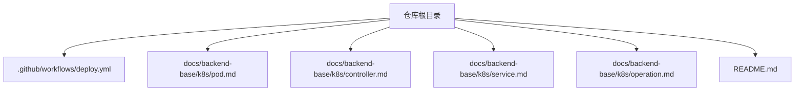
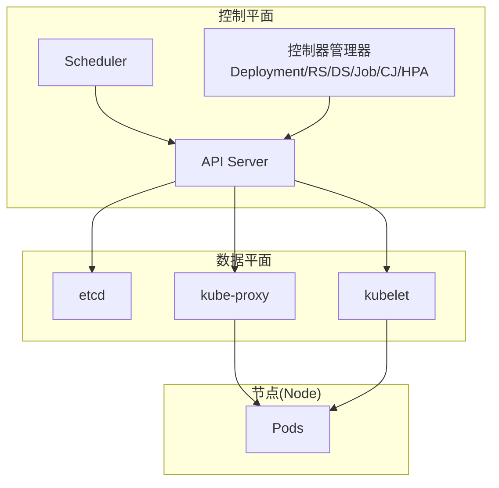
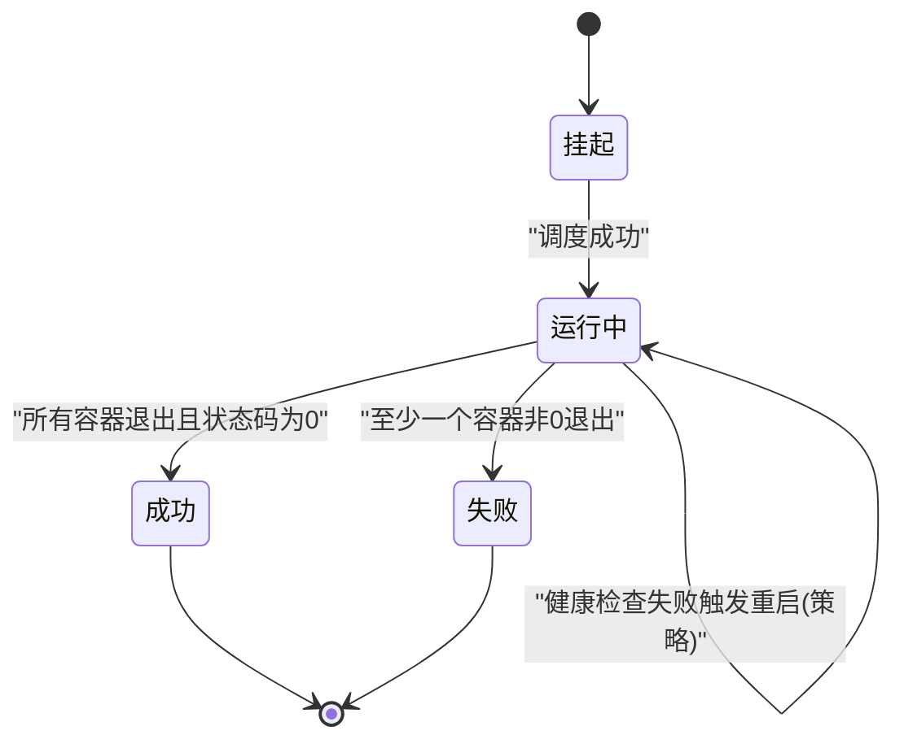
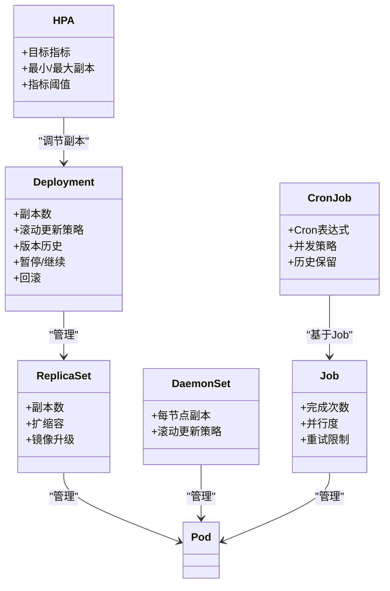
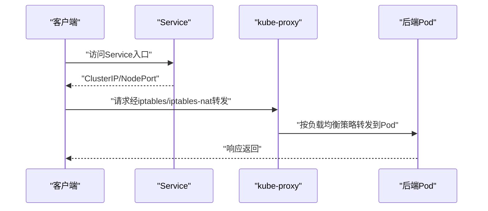
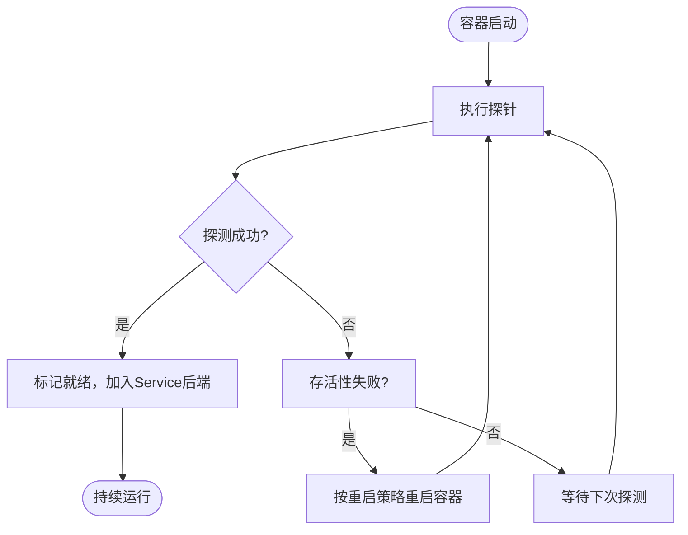
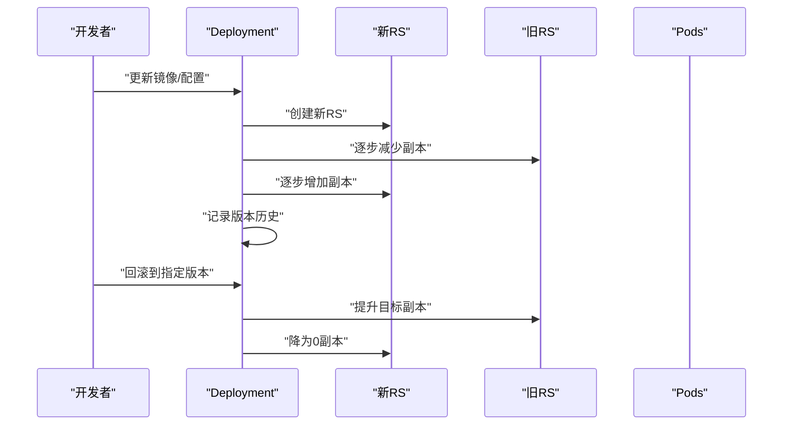
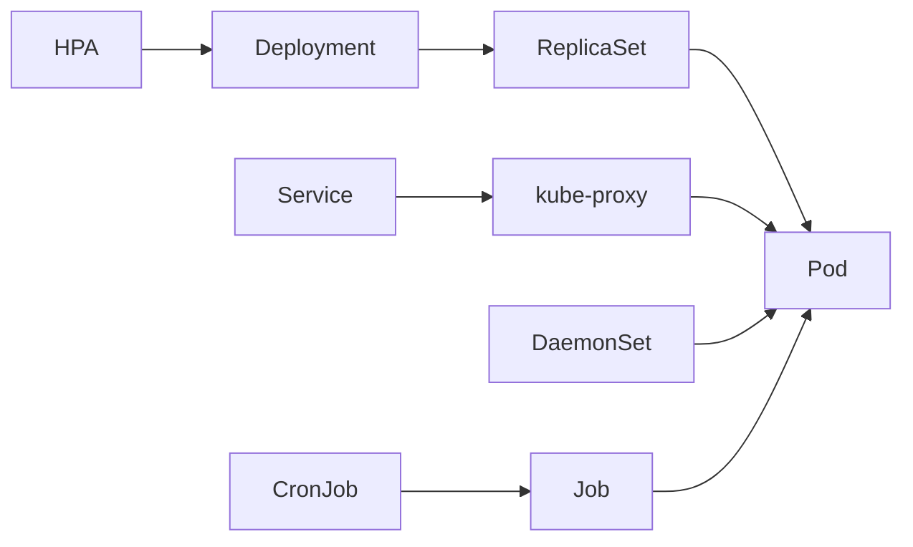

# Kubernetes编排

<cite>
**本文引用的文件**   
- [README.md](file://README.md)
- [deploy.yml](file://.github/workflows/deploy.yml)
- [pod.md](file://docs/backend-base/k8s/pod.md)
- [controller.md](file://docs/backend-base/k8s/controller.md)
- [service.md](file://docs/backend-base/k8s/service.md)
- [operation.md](file://docs/backend-base/k8s/operation.md)
</cite>

## 目录
1. [引言](#引言)
2. [项目结构](#项目结构)
3. [核心组件](#核心组件)
4. [架构总览](#架构总览)
5. [详细组件分析](#详细组件分析)
6. [依赖分析](#依赖分析)
7. [性能考量](#性能考量)
8. [故障排查指南](#故障排查指南)
9. [结论](#结论)
10. [附录](#附录)

## 引言
本技术文档面向容器编排开发者与运维工程师，系统梳理Kubernetes核心概念与实践，围绕Pod管理、控制器类型、Service网络、配置与存储、调度与亲和性、扩缩容与滚动更新、健康检查、HPA自动扩缩容、DaemonSet/Job/CronJob等主题展开。文档结合仓库内的Kubernetes学习资料，提供从入门到进阶的知识体系与可操作的实践指引。

## 项目结构
本仓库为基于VuePress的静态站点工程，Kubernetes相关内容集中在docs/backend-base/k8s目录下，包含Pod详解、控制器详解、Service与Ingress、运维操作等文档。CI/CD流程通过GitHub Actions实现，自动构建并部署到GitHub Pages。

**图表来源**
- [deploy.yml:1-36](file://.github/workflows/deploy.yml#L1-L36)
- [pod.md:1-1609](file://docs/backend-base/k8s/pod.md#L1-L1609)
- [controller.md:1-1094](file://docs/backend-base/k8s/controller.md#L1-L1094)
- [service.md:1-200](file://docs/backend-base/k8s/service.md#L1-L200)
- [operation.md:1-600](file://docs/backend-base/k8s/operation.md#L1-L600)
- [README.md:1-12](file://README.md#L1-L12)

**章节来源**
- [README.md:1-12](file://README.md#L1-L12)
- [.github/workflows/deploy.yml:1-36](file://.github/workflows/deploy.yml#L1-L36)

## 核心组件
- Pod：Kubernetes的最小管理单元，可包含一个或多个容器，内置Pause根容器用于健康评估与共享网络命名空间。
- 控制器：ReplicaSet、Deployment、DaemonSet、Job、CronJob、HPA等，用于管理Pod副本、生命周期与弹性伸缩。
- Service：为一组Pod提供稳定的访问入口与负载均衡，配合kube-proxy实现流量转发。
- ConfigMap/Secret：用于注入配置与密钥，支持以环境变量或卷形式挂载到Pod。
- 调度与亲和性：NodeName/Selector、Node/Pod亲和性、污点与容忍，实现灵活的节点选择与隔离。
- 健康检查：liveness/readiness探针，保障服务可用性与流量接入。

**章节来源**
- [pod.md:5-23](file://docs/backend-base/k8s/pod.md#L5-L23)
- [controller.md:17-34](file://docs/backend-base/k8s/controller.md#L17-L34)
- [service.md:4-12](file://docs/backend-base/k8s/service.md#L4-L12)

## 架构总览
Kubernetes通过API Server集中管理资源，Scheduler负责Pod调度，kubelet在Node上执行容器生命周期管理，kube-proxy在Node上实现Service的流量转发。控制器通过ReplicaSet/Deployment等抽象管理Pod副本与滚动更新。

**图表来源**
- [controller.md:212-310](file://docs/backend-base/k8s/controller.md#L212-L310)
- [service.md:12-35](file://docs/backend-base/k8s/service.md#L12-L35)

## 详细组件分析

### Pod管理与生命周期
- 结构与Pause容器：Pod内Pause容器用于评估整体健康与共享网络IP，实现Pod内容器间通信。
- 生命周期阶段：创建、初始化容器、主容器运行、钩子函数、健康检查、终止清理。
- 重启策略：Always/OnFailure/Never，影响故障后的容器重启行为。
- 调度方式：自动调度、定向调度（NodeName/NodeSelector）、亲和性（NodeAffinity/PodAffinity/PodAntiAffinity）、污点与容忍。

**图表来源**
- [pod.md:536-542](file://docs/backend-base/k8s/pod.md#L536-L542)
- [pod.md:968-976](file://docs/backend-base/k8s/pod.md#L968-L976)

**章节来源**
- [pod.md:5-23](file://docs/backend-base/k8s/pod.md#L5-L23)
- [pod.md:517-574](file://docs/backend-base/k8s/pod.md#L517-L574)
- [pod.md:1020-1137](file://docs/backend-base/k8s/pod.md#L1020-L1137)
- [pod.md:1138-1295](file://docs/backend-base/k8s/pod.md#L1138-L1295)
- [pod.md:1297-1474](file://docs/backend-base/k8s/pod.md#L1297-L1474)
- [pod.md:1476-1594](file://docs/backend-base/k8s/pod.md#L1476-L1594)

### 控制器类型与扩缩容策略
- ReplicaSet：保证副本数量稳定，支持扩缩容与镜像升级。
- Deployment：通过管理RS间接管理Pod，支持滚动更新、回滚、暂停/继续与金丝雀发布。
- HPA：基于CPU使用率等指标自动扩缩容，依赖Metrics Server采集资源使用数据。
- DaemonSet：在每个（或指定）节点上运行一个Pod副本，适用于日志、监控等守护类任务。
- Job：一次性任务，控制成功完成的Pod数量。
- CronJob：周期性任务，基于Cron表达式调度。

**图表来源**
- [controller.md:35-80](file://docs/backend-base/k8s/controller.md#L35-L80)
- [controller.md:212-260](file://docs/backend-base/k8s/controller.md#L212-L260)
- [controller.md:575-628](file://docs/backend-base/k8s/controller.md#L575-L628)
- [controller.md:766-851](file://docs/backend-base/k8s/controller.md#L766-L851)
- [controller.md:853-975](file://docs/backend-base/k8s/controller.md#L853-L975)
- [controller.md:977-1094](file://docs/backend-base/k8s/controller.md#L977-L1094)

**章节来源**
- [controller.md:35-80](file://docs/backend-base/k8s/controller.md#L35-L80)
- [controller.md:212-260](file://docs/backend-base/k8s/controller.md#L212-L260)
- [controller.md:575-628](file://docs/backend-base/k8s/controller.md#L575-L628)
- [controller.md:766-851](file://docs/backend-base/k8s/controller.md#L766-L851)
- [controller.md:853-975](file://docs/backend-base/k8s/controller.md#L853-L975)
- [controller.md:977-1094](file://docs/backend-base/k8s/controller.md#L977-L1094)

### Service网络与Ingress
- Service作用：聚合同一类Pod，提供稳定入口地址与负载均衡。
- Service类型：ClusterIP（默认，仅集群内可达）、NodePort（在各节点暴露端口）、LoadBalancer（云厂商负载均衡）。
- kube-proxy：监听Service变更并生成转发规则，支持userspace等模式。
- Ingress：统一入口，结合Ingress Controller实现HTTP/HTTPS路由与TLS终止。

**图表来源**
- [service.md:4-12](file://docs/backend-base/k8s/service.md#L4-L12)
- [service.md:35-68](file://docs/backend-base/k8s/service.md#L35-L68)
- [operation.md:487-559](file://docs/backend-base/k8s/operation.md#L487-L559)

**章节来源**
- [service.md:4-12](file://docs/backend-base/k8s/service.md#L4-L12)
- [service.md:68-120](file://docs/backend-base/k8s/service.md#L68-L120)
- [operation.md:487-559](file://docs/backend-base/k8s/operation.md#L487-L559)

### 配置与存储：ConfigMap/Secret
- ConfigMap：以键值对形式注入配置，支持环境变量与卷挂载。
- Secret：用于敏感信息（如数据库密码、证书），以卷或环境变量挂载到Pod。
- Pod中volumeMounts与env引用ConfigMap/Secret，实现配置与代码解耦。

**章节来源**
- [pod.md:92-107](file://docs/backend-base/k8s/pod.md#L92-L107)

### 健康检查与探针
- 存活性探针（livenessProbe）：判断容器是否存活，失败时触发重启策略。
- 就绪性探针（readinessProbe）：判断容器是否可接受流量，未就绪时不参与Service后端。
- 探测方式：Exec、TCPSocket、HTTPGet；支持initialDelaySeconds、timeoutSeconds、periodSeconds、failureThreshold、successThreshold等参数。

**图表来源**
- [pod.md:736-782](file://docs/backend-base/k8s/pod.md#L736-L782)
- [pod.md:832-926](file://docs/backend-base/k8s/pod.md#L832-L926)
- [pod.md:928-941](file://docs/backend-base/k8s/pod.md#L928-L941)

**章节来源**
- [pod.md:736-782](file://docs/backend-base/k8s/pod.md#L736-L782)
- [pod.md:832-926](file://docs/backend-base/k8s/pod.md#L832-L926)
- [pod.md:928-941](file://docs/backend-base/k8s/pod.md#L928-L941)

### 滚动更新与版本回退
- Deployment通过RS管理Pod，滚动更新策略支持maxSurge与maxUnavailable控制变更速率。
- 支持暂停/继续与版本回退，通过历史RS切换实现快速回滚。

**图表来源**
- [controller.md:401-467](file://docs/backend-base/k8s/controller.md#L401-L467)
- [controller.md:469-515](file://docs/backend-base/k8s/controller.md#L469-L515)

**章节来源**
- [controller.md:401-467](file://docs/backend-base/k8s/controller.md#L401-L467)
- [controller.md:469-515](file://docs/backend-base/k8s/controller.md#L469-L515)

### 自动扩缩容与HPA
- HPA基于Metrics Server采集的CPU/内存等指标，动态调整Deployment/RS/StatefulSet副本数。
- 需配置最小/最大副本与目标利用率阈值，结合压测验证扩缩容行为。

**章节来源**
- [controller.md:575-764](file://docs/backend-base/k8s/controller.md#L575-L764)

### DaemonSet/Job/CronJob
- DaemonSet：每节点一个Pod副本，适用于日志、监控等守护任务。
- Job：一次性任务，控制完成次数与并行度。
- CronJob：基于Cron表达式的周期性任务，支持并发策略与历史保留。

**章节来源**
- [controller.md:766-851](file://docs/backend-base/k8s/controller.md#L766-L851)
- [controller.md:853-975](file://docs/backend-base/k8s/controller.md#L853-L975)
- [controller.md:977-1094](file://docs/backend-base/k8s/controller.md#L977-L1094)

## 依赖分析
- 控制器依赖：Deployment依赖RS，RS管理Pod；HPA依赖Metrics Server；Service依赖kube-proxy。
- 调度依赖：Scheduler依赖etcd存储的集群状态与节点标签；Pod亲和性/反亲和性依赖节点与Pod标签匹配。
- 网络依赖：Service通过kube-proxy在节点侧生成转发规则，Ingress通过Ingress Controller实现统一入口。

**图表来源**
- [controller.md:212-310](file://docs/backend-base/k8s/controller.md#L212-L310)
- [controller.md:575-628](file://docs/backend-base/k8s/controller.md#L575-L628)
- [service.md:12-35](file://docs/backend-base/k8s/service.md#L12-L35)

**章节来源**
- [controller.md:212-310](file://docs/backend-base/k8s/controller.md#L212-L310)
- [controller.md:575-628](file://docs/backend-base/k8s/controller.md#L575-L628)
- [service.md:12-35](file://docs/backend-base/k8s/service.md#L12-L35)

## 性能考量
- 资源配额：合理设置requests/limits，避免资源抢占与抖动。
- 探针参数：适当延长initialDelaySeconds与periodSeconds，降低探针压力。
- 滚动更新：控制maxSurge/maxUnavailable，平衡更新速度与稳定性。
- HPA：设置合理的CPU/内存阈值与最小/最大副本，避免频繁扩缩容。
- 调度：使用Node/Pod亲和性与容忍，优化Pod分布与隔离。

[本节为通用指导，无需引用具体文件]

## 故障排查指南
- Pod状态异常
  - 查看Pod事件与状态，定位镜像拉取、资源不足、探针失败等问题。
  - 使用restartPolicy与探针参数调整容器重启行为。
- 调度失败
  - 检查NodeSelector/亲和性规则与节点标签匹配；查看污点与容忍配置。
- Service无法访问
  - 确认Service类型与端口映射；检查kube-proxy是否生效；核对后端Pod就绪状态。
- 滚动更新卡顿
  - 检查maxSurge/maxUnavailable配置；查看RS历史与版本回退。
- HPA不生效
  - 确认Metrics Server安装与权限；检查目标指标与阈值配置。

**章节来源**
- [pod.md:517-574](file://docs/backend-base/k8s/pod.md#L517-L574)
- [pod.md:1020-1137](file://docs/backend-base/k8s/pod.md#L1020-L1137)
- [pod.md:1138-1295](file://docs/backend-base/k8s/pod.md#L1138-L1295)
- [controller.md:575-764](file://docs/backend-base/k8s/controller.md#L575-L764)
- [operation.md:487-559](file://docs/backend-base/k8s/operation.md#L487-L559)

## 结论
Kubernetes通过控制器抽象实现了对Pod的自动化编排，结合Service网络、HPA弹性伸缩、健康检查与调度策略，形成完整的云原生应用生命周期管理体系。建议在生产环境中遵循资源配额、探针参数、滚动更新与亲和性等最佳实践，结合Metrics Server与Ingress Controller完善可观测与入口治理能力。

[本节为总结性内容，无需引用具体文件]

## 附录
- CI/CD与部署
  - 通过GitHub Actions在master分支推送后自动构建并部署到GitHub Pages，发布目录为.vuepress/dist。
- 实践建议
  - 使用ConfigMap/Secret分离配置与密钥；为关键任务启用就绪探针；为有状态应用选用StatefulSet；为守护类任务选用DaemonSet；为周期性任务选用CronJob。

**章节来源**
- [.github/workflows/deploy.yml:1-36](file://.github/workflows/deploy.yml#L1-L36)
- [README.md:1-12](file://README.md#L1-L12)