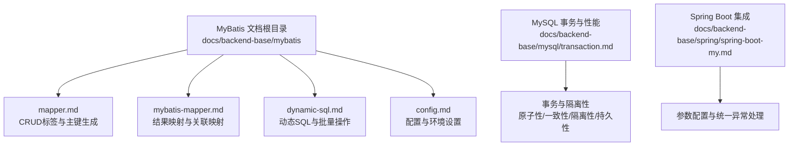
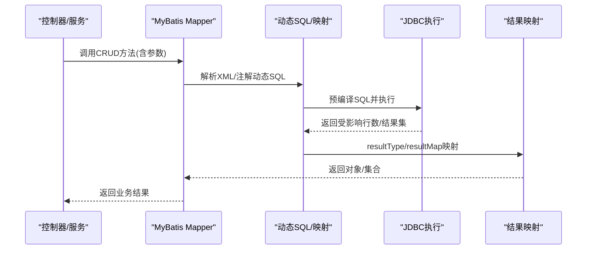
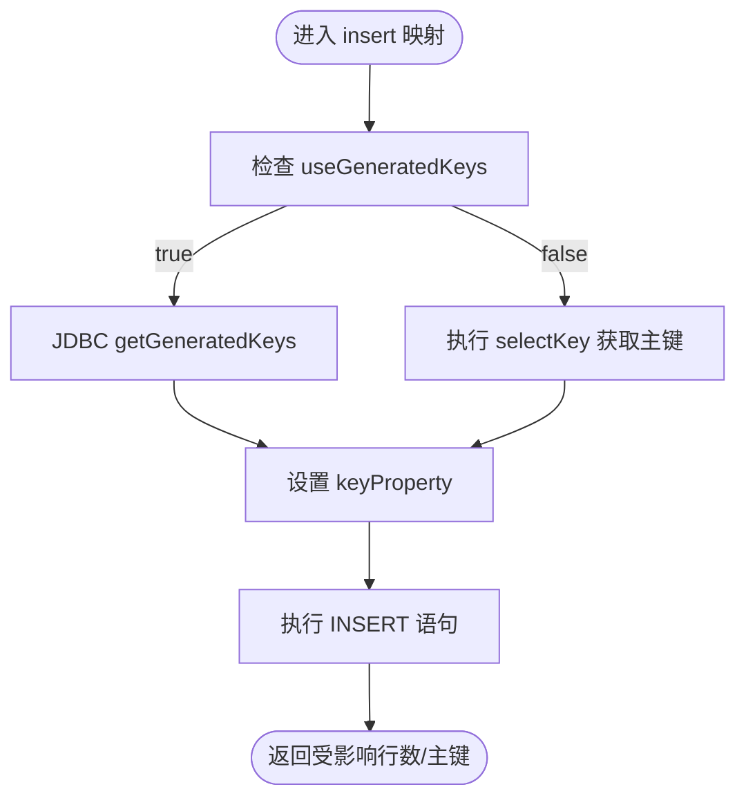
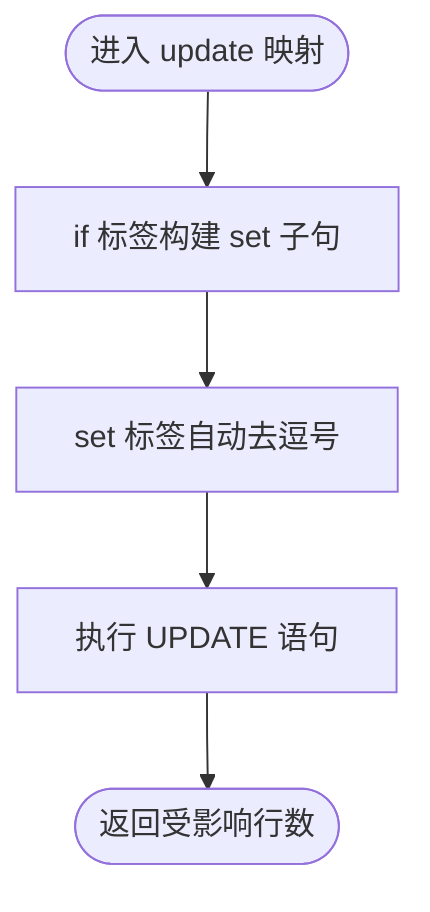
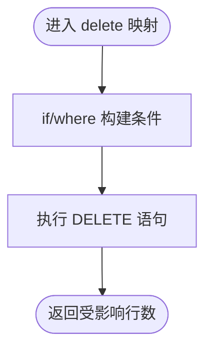
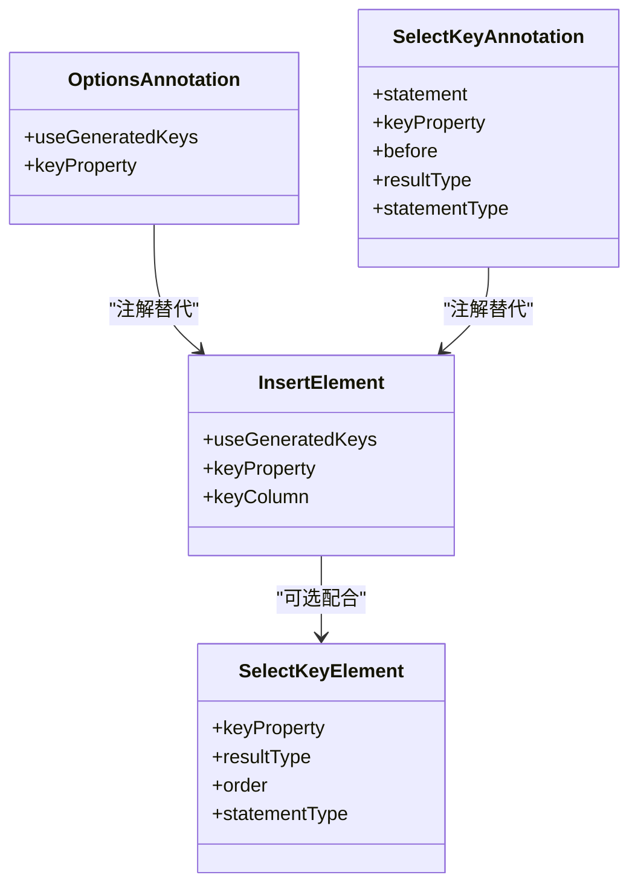
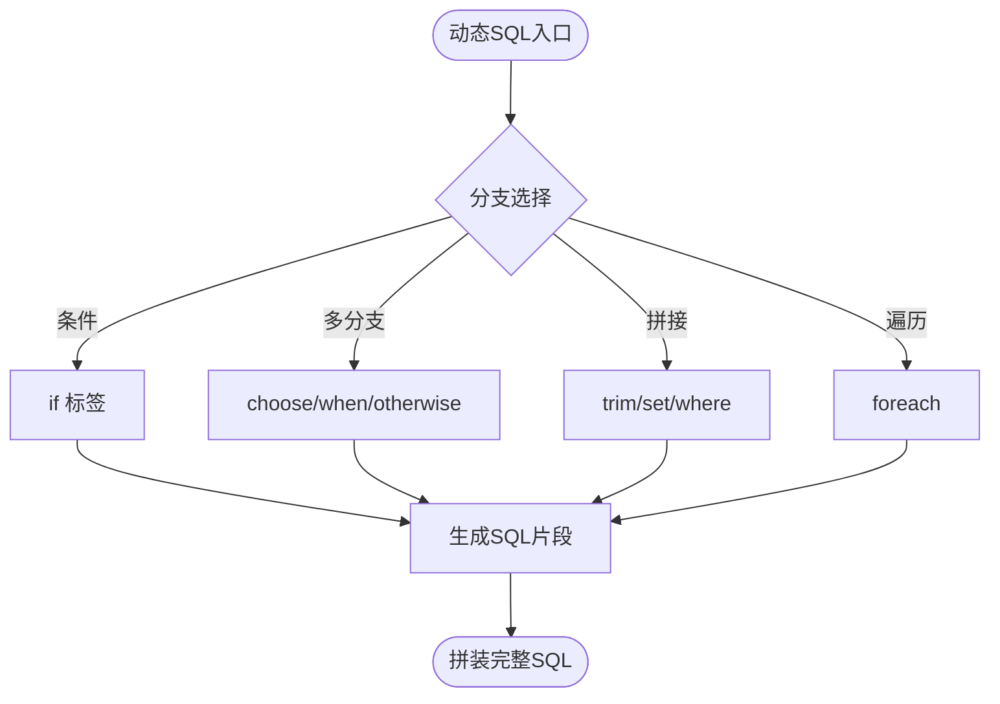
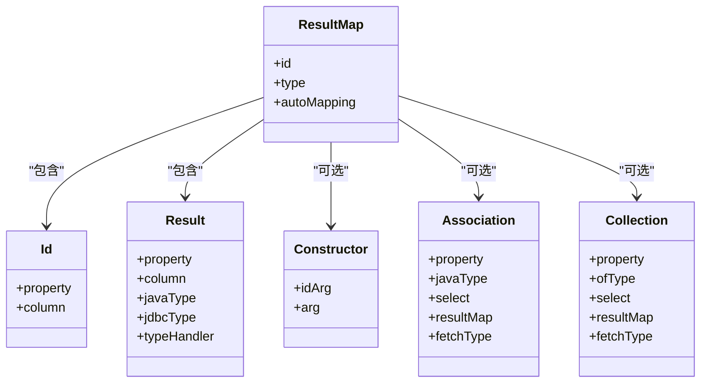
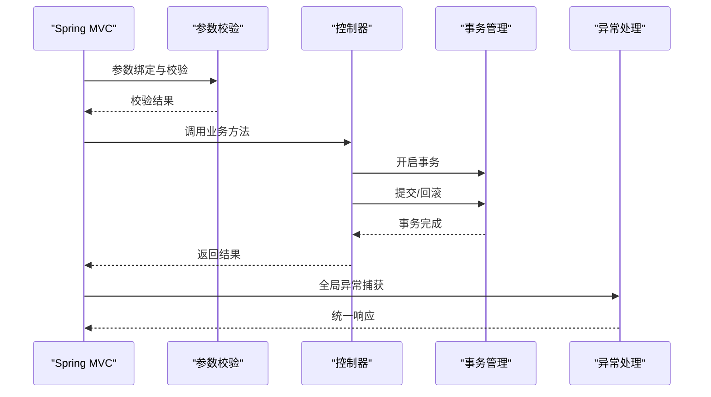
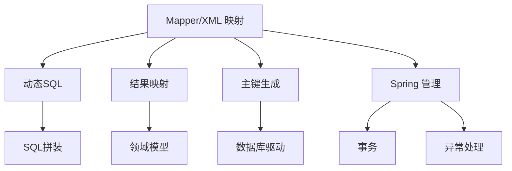

# CRUD操作标签

<cite>
**本文引用的文件**
- [mapper.md](file://docs/backend-base/mybatis/mapper.md)
- [mybatis-mapper.md](file://docs/backend-base/mybatis/mybatis-mapper.md)
- [dynamic-sql.md](file://docs/backend-base/mybatis/dynamic-sql.md)
- [config.md](file://docs/backend-base/mybatis/config.md)
- [transaction.md](file://docs/backend-base/mysql/transaction.md)
- [spring-boot-my.md](file://docs/backend-base/spring/spring-boot-my.md)
</cite>

## 目录
1. [简介](#简介)
2. [项目结构](#项目结构)
3. [核心组件](#核心组件)
4. [架构总览](#架构总览)
5. [详细组件分析](#详细组件分析)
6. [依赖分析](#依赖分析)
7. [性能考量](#性能考量)
8. [故障排查指南](#故障排查指南)
9. [结论](#结论)
10. [附录](#附录)

## 简介
本技术文档围绕 MyBatis 的 CRUD 操作标签（insert、update、delete）展开，系统梳理标签语法、属性配置、参数传递、主键生成策略、动态 SQL、事务与错误处理、性能优化等关键主题。文档以仓库中的 MyBatis 文档为基础，结合 Spring Boot 与 MySQL 事务知识，形成一套面向 Java 持久层开发的标准化实现指导。

## 项目结构
本仓库与 MyBatis 相关的核心文档位于 backend-base/mybatis 目录，涵盖：
- SQL 映射与 CRUD 标签说明
- 结果映射与复杂关联映射
- 动态 SQL 与批量操作
- MyBatis 配置与环境设置
- 事务与性能基础

**图表来源**
- [mapper.md:1-242](file://docs/backend-base/mybatis/mapper.md#L1-L242)
- [mybatis-mapper.md:1-488](file://docs/backend-base/mybatis/mybatis-mapper.md#L1-L488)
- [dynamic-sql.md:1-278](file://docs/backend-base/mybatis/dynamic-sql.md#L1-L278)
- [config.md:1-240](file://docs/backend-base/mybatis/config.md#L1-L240)
- [transaction.md:1-128](file://docs/backend-base/mysql/transaction.md#L1-L128)
- [spring-boot-my.md:1-647](file://docs/backend-base/spring/spring-boot-my.md#L1-L647)

**章节来源**
- [mapper.md:1-242](file://docs/backend-base/mybatis/mapper.md#L1-L242)
- [mybatis-mapper.md:1-488](file://docs/backend-base/mybatis/mybatis-mapper.md#L1-L488)
- [dynamic-sql.md:1-278](file://docs/backend-base/mybatis/dynamic-sql.md#L1-L278)
- [config.md:1-240](file://docs/backend-base/mybatis/config.md#L1-L240)
- [transaction.md:1-128](file://docs/backend-base/mysql/transaction.md#L1-L128)
- [spring-boot-my.md:1-647](file://docs/backend-base/spring/spring-boot-my.md#L1-L647)

## 核心组件
- CRUD 标签族：insert、update、delete，用于映射 DML 语句，属性与 select 标签相近，支持 flushCache、statementType、timeout 等通用属性。
- 主键生成：useGeneratedKeys、keyProperty、keyColumn 三件套，以及 selectKey 标签与 @SelectKey/@Options 注解。
- 动态 SQL：if、where、set、trim、choose/when/otherwise、foreach、bind 等，支撑条件插入、条件更新、批量操作与复杂查询。
- 结果映射：resultType/resultMap、自动映射、构造方法注入、association/collection 嵌套映射，支撑复杂对象组装。
- 事务与配置：MyBatis settings、environments、transactionManager、dataSource、databaseIdProvider；Spring Boot 参数配置与统一异常处理。

**章节来源**
- [mapper.md:46-176](file://docs/backend-base/mybatis/mapper.md#L46-L176)
- [dynamic-sql.md:3-278](file://docs/backend-base/mybatis/dynamic-sql.md#L3-L278)
- [mybatis-mapper.md:5-488](file://docs/backend-base/mybatis/mybatis-mapper.md#L5-L488)
- [config.md:54-240](file://docs/backend-base/mybatis/config.md#L54-L240)
- [spring-boot-my.md:289-647](file://docs/backend-base/spring/spring-boot-my.md#L289-L647)

## 架构总览
MyBatis 在持久层的典型调用链路：
- 控制器/服务层发起业务请求
- MyBatis Mapper 接口或 XML 映射执行 CRUD
- 动态 SQL 根据参数构建 SQL
- JDBC 预编译执行，返回结果映射
- Spring 管理事务与异常处理

**图表来源**
- [mapper.md:46-176](file://docs/backend-base/mybatis/mapper.md#L46-L176)
- [dynamic-sql.md:3-278](file://docs/backend-base/mybatis/dynamic-sql.md#L3-L278)
- [mybatis-mapper.md:5-488](file://docs/backend-base/mybatis/mybatis-mapper.md#L5-L488)

## 详细组件分析

### insert 标签：语法、属性与主键生成
- 语法要点
  - 支持 flushCache、statementType、timeout 等通用属性
  - 常配合 useGeneratedKeys、keyProperty、keyColumn 实现主键回填
- 主键生成策略
  - useGeneratedKeys：启用 JDBC getGeneratedKeys 获取数据库自增主键
  - keyProperty：目标实体的属性名，接收生成的主键值
  - keyColumn：当主键列非第一列时，指定列名（部分数据库）
  - selectKey：在 insert 前/后执行 SQL 获取主键，适用于不支持自增或驱动不支持 getGeneratedKeys 的场景
- 动态插入
  - 使用 if 标签按参数是否为空决定字段与值，避免冗余字段
- 示例场景
  - 简单插入：insert 标签 + useGeneratedKeys
  - 自定义主键：selectKey + order="BEFORE"
  - 动态字段插入：if 标签按参数拼接列与值

**图表来源**
- [mapper.md:86-123](file://docs/backend-base/mybatis/mapper.md#L86-L123)
- [dynamic-sql.md:33-64](file://docs/backend-base/mybatis/dynamic-sql.md#L33-L64)

**章节来源**
- [mapper.md:46-123](file://docs/backend-base/mybatis/mapper.md#L46-L123)
- [dynamic-sql.md:33-64](file://docs/backend-base/mybatis/dynamic-sql.md#L33-L64)

### update 标签：条件更新与 set 标签
- 语法要点
  - 支持 flushCache、statementType、timeout 等通用属性
  - 通过 set 标签动态拼接赋值语句，自动去除尾部逗号
- 动态更新
  - 使用 if 标签按参数是否为空决定赋值项
  - 使用 where 标签或 trim 标签处理条件拼接，避免多余的 AND/OR
- 示例场景
  - 条件更新：if + set
  - 多条件 where：if + where
  - 修复 where 末尾多余 AND/OR：trim

**图表来源**
- [dynamic-sql.md:66-91](file://docs/backend-base/mybatis/dynamic-sql.md#L66-L91)
- [dynamic-sql.md:214-239](file://docs/backend-base/mybatis/dynamic-sql.md#L214-L239)

**章节来源**
- [mapper.md:64-84](file://docs/backend-base/mybatis/mapper.md#L64-L84)
- [dynamic-sql.md:66-91](file://docs/backend-base/mybatis/dynamic-sql.md#L66-L91)
- [dynamic-sql.md:214-239](file://docs/backend-base/mybatis/dynamic-sql.md#L214-L239)

### delete 标签：条件删除与批量删除
- 语法要点
  - 支持 flushCache、statementType、timeout 等通用属性
  - 常配合 where/trim/if 构建条件
- 批量删除
  - 使用 foreach 遍历集合，拼接 in 列表
- 示例场景
  - 单条件删除：where + if
  - 批量删除：foreach + in

**图表来源**
- [dynamic-sql.md:241-278](file://docs/backend-base/mybatis/dynamic-sql.md#L241-L278)

**章节来源**
- [mapper.md:75-84](file://docs/backend-base/mybatis/mapper.md#L75-L84)
- [dynamic-sql.md:241-278](file://docs/backend-base/mybatis/dynamic-sql.md#L241-L278)

### 主键生成与注解支持
- XML 方案
  - useGeneratedKeys + keyProperty + keyColumn
  - selectKey：before/after 两种模式，支持自定义主键生成策略
- 注解方案
  - @Options：useGeneratedKeys、keyProperty
  - @SelectKey：statement、keyProperty、before、resultType、statementType
- 使用建议
  - 优先使用数据库自增主键 + useGeneratedKeys
  - Oracle 等不支持自增或驱动不支持 getGeneratedKeys 时，使用 selectKey 或 @SelectKey

**图表来源**
- [mapper.md:86-176](file://docs/backend-base/mybatis/mapper.md#L86-L176)

**章节来源**
- [mapper.md:86-176](file://docs/backend-base/mybatis/mapper.md#L86-L176)

### 动态 SQL 与批量操作
- 条件拼接
  - if：按参数是否为空决定字段/赋值
  - where：自动处理 AND/OR 前缀
  - set：自动处理赋值逗号
  - trim：自定义前缀/后缀与多余字符剔除
  - choose/when/otherwise：多分支择一
  - bind：在映射文件中定义变量
- 批量操作
  - foreach：遍历集合，支持 open/separator/close
  - in 条件：配合 foreach 生成列表
  - 动态插入：按集合元素逐条拼接 values

**图表来源**
- [dynamic-sql.md:3-278](file://docs/backend-base/mybatis/dynamic-sql.md#L3-L278)

**章节来源**
- [dynamic-sql.md:3-278](file://docs/backend-base/mybatis/dynamic-sql.md#L3-L278)

### 结果映射与复杂对象组装
- resultType/resultMap：简单映射与复杂映射二选一
- 自动映射：mapUnderscoreToCamelCase
- 构造方法注入：constructor/idArg/arg
- association/collection：一对一/一对多嵌套映射
- fetchType：eager/lazy 控制加载策略

**图表来源**
- [mybatis-mapper.md:5-488](file://docs/backend-base/mybatis/mybatis-mapper.md#L5-L488)

**章节来源**
- [mybatis-mapper.md:5-488](file://docs/backend-base/mybatis/mybatis-mapper.md#L5-L488)

### 事务与错误处理
- 事务特性：原子性、一致性、隔离性、持久性
- 事务控制：start transaction / begin、commit、rollback
- Spring Boot 集成：参数配置、统一异常处理
- 错误处理：@ControllerAdvice 全局异常捕获，结合 Spring Validation 进行参数校验

**图表来源**
- [transaction.md:1-128](file://docs/backend-base/mysql/transaction.md#L1-L128)
- [spring-boot-my.md:289-647](file://docs/backend-base/spring/spring-boot-my.md#L289-L647)

**章节来源**
- [transaction.md:1-128](file://docs/backend-base/mysql/transaction.md#L1-L128)
- [spring-boot-my.md:289-647](file://docs/backend-base/spring/spring-boot-my.md#L289-L647)

## 依赖分析
- 组件耦合
  - Mapper 依赖动态 SQL 与结果映射
  - 主键生成策略依赖数据库驱动能力
  - 事务与异常处理依赖 Spring 管理
- 外部依赖
  - MyBatis 配置（settings、environments、mappers）
  - 数据库连接池与驱动
  - Spring Boot 参数与异常处理

**图表来源**
- [mapper.md:46-176](file://docs/backend-base/mybatis/mapper.md#L46-L176)
- [dynamic-sql.md:3-278](file://docs/backend-base/mybatis/dynamic-sql.md#L3-L278)
- [mybatis-mapper.md:5-488](file://docs/backend-base/mybatis/mybatis-mapper.md#L5-L488)
- [config.md:54-240](file://docs/backend-base/mybatis/config.md#L54-L240)
- [spring-boot-my.md:289-647](file://docs/backend-base/spring/spring-boot-my.md#L289-L647)

**章节来源**
- [mapper.md:46-176](file://docs/backend-base/mybatis/mapper.md#L46-L176)
- [dynamic-sql.md:3-278](file://docs/backend-base/mybatis/dynamic-sql.md#L3-L278)
- [mybatis-mapper.md:5-488](file://docs/backend-base/mybatis/mybatis-mapper.md#L5-L488)
- [config.md:54-240](file://docs/backend-base/mybatis/config.md#L54-L240)
- [spring-boot-my.md:289-647](file://docs/backend-base/spring/spring-boot-my.md#L289-L647)

## 性能考量
- 动态 SQL 优化
  - 使用 where/trim/set 减少冗余 AND/OR 与逗号
  - 合理使用 bind 定义变量，避免重复拼接
- 结果映射优化
  - mapUnderscoreToCamelCase 开启自动映射
  - association/collection 使用 fetchType 控制懒加载
- 批量操作
  - foreach 遍历集合，减少多次往返
  - in 条件批量删除/查询
- 事务与连接
  - 使用连接池，避免频繁创建/销毁连接
  - Spring 管理事务边界，避免长事务

[本节为通用性能建议，不直接分析具体文件]

## 故障排查指南
- 常见问题
  - where 标签末尾多余 AND/OR：使用 trim 去除
  - set 标签尾部逗号：set 自动处理，确认 if 条件正确
  - 主键未回填：检查 useGeneratedKeys/keyProperty/keyColumn 或 selectKey 配置
  - 参数为空导致 SQL 语法错误：使用 if/where/trim 控制拼接
- Spring 集成
  - 参数校验失败：使用 @Valid/@Validated 与 @ControllerAdvice 统一处理
  - 事务未生效：确认 Spring 管理器与事务注解使用正确

**章节来源**
- [dynamic-sql.md:115-239](file://docs/backend-base/mybatis/dynamic-sql.md#L115-L239)
- [mapper.md:86-176](file://docs/backend-base/mybatis/mapper.md#L86-L176)
- [spring-boot-my.md:289-647](file://docs/backend-base/spring/spring-boot-my.md#L289-L647)

## 结论
通过系统掌握 MyBatis CRUD 标签的语法与属性、主键生成策略、动态 SQL 与批量操作、结果映射与复杂对象组装，以及结合 Spring Boot 的参数配置与统一异常处理，可以构建稳定、高性能、可维护的 Java 持久层实现。建议在实际项目中优先采用数据库自增主键 + useGeneratedKeys，配合动态 SQL 与懒加载策略，确保代码简洁与性能最优。

[本节为总结性内容，不直接分析具体文件]

## 附录
- 标签属性速查
  - insert/update/delete 通用属性：flushCache、statementType、timeout
  - insert 特有属性：useGeneratedKeys、keyProperty、keyColumn、selectKey
- 最佳实践清单
  - 使用 if/where/set/trim/choose/foreach 构建动态 SQL
  - 合理使用 resultType/resultMap 与自动映射
  - 使用懒加载优化一对多/一对一查询
  - 使用 Spring Boot 参数与异常处理提升可维护性
  - 严格控制事务边界，避免长事务与异常未捕获

[本节为补充性内容，不直接分析具体文件]