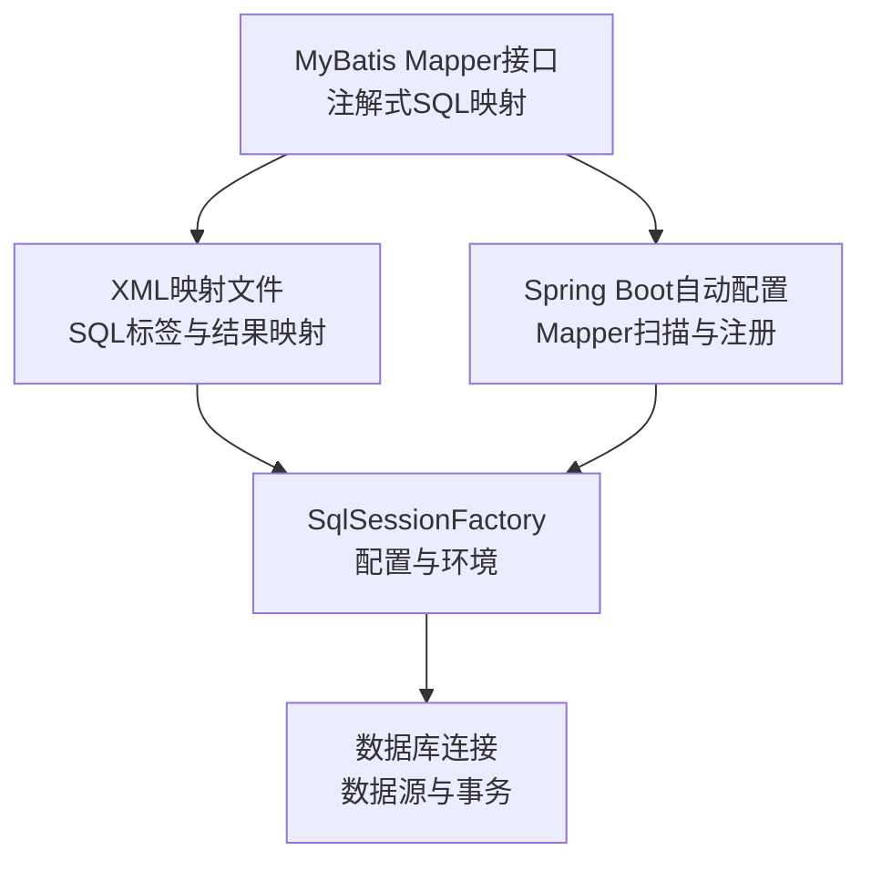
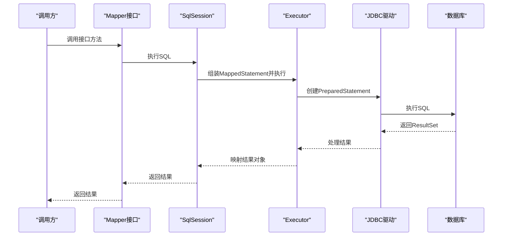
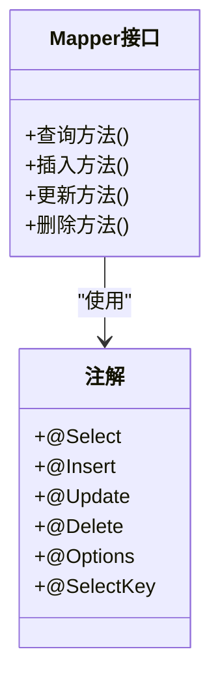
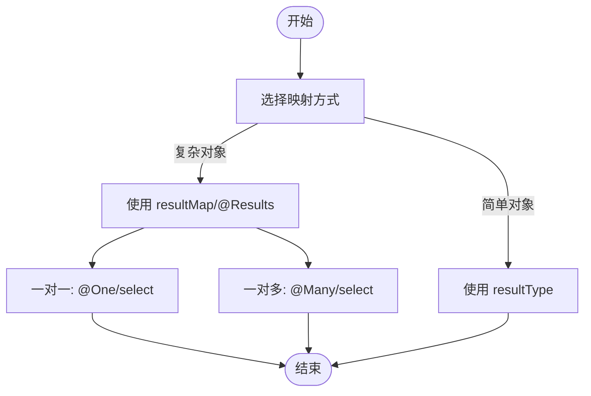
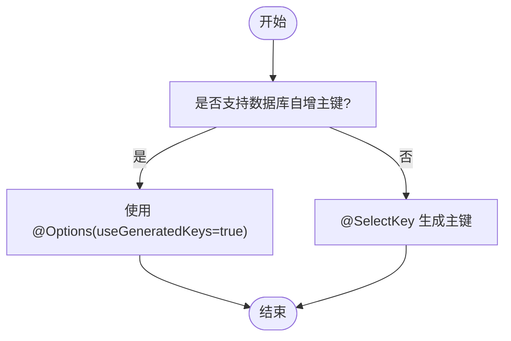
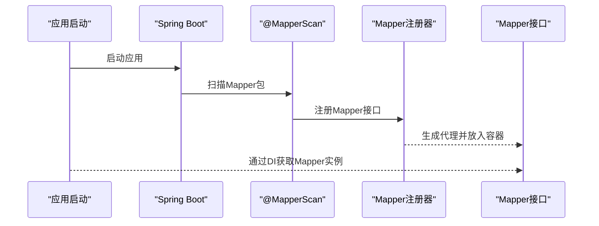
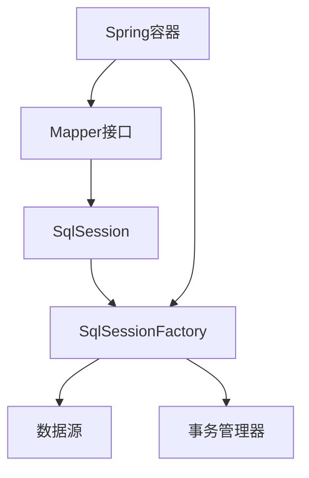

# Mapper接口映射

<cite>
**本文引用的文件**
- [mapper.md](file://docs/backend-base/mybatis/mapper.md)
- [mybatis-mapper.md](file://docs/backend-base/mybatis/mybatis-mapper.md)
- [config.md](file://docs/backend-base/mybatis/config.md)
- [spring-boot-my.md](file://docs/backend-base/spring/spring-boot-my.md)
- [spring-boot.md](file://docs/backend-base/spring/spring-boot.md)
</cite>

## 目录
1. [简介](#简介)
2. [项目结构](#项目结构)
3. [核心组件](#核心组件)
4. [架构总览](#架构总览)
5. [详细组件分析](#详细组件分析)
6. [依赖分析](#依赖分析)
7. [性能考量](#性能考量)
8. [故障排查指南](#故障排查指南)
9. [结论](#结论)
10. [附录](#附录)

## 简介
本技术文档围绕MyBatis的Mapper接口映射展开，系统阐述接口设计理念、注解式SQL映射（@Select、@Insert、@Update、@Delete等）、参数与返回值处理、结果映射（resultMap、@Results/@Result、@One/@Many）、复杂查询与关联查询、批量操作、与XML映射文件的对比，以及接口代理机制的实现原理。文档同时给出接口设计最佳实践，包括方法命名规范、参数封装策略、结果映射配置等，帮助开发者在Java持久层开发中高效、稳定地使用Mapper接口。

## 项目结构
本仓库与MyBatis Mapper接口映射相关的核心文档位于docs/backend-base/mybatis目录，配套Spring集成与配置说明位于docs/backend-base/spring目录。关键文件包括：
- MyBatis SQL映射与注解：docs/backend-base/mybatis/mapper.md
- MyBatis结果映射与注解式关联映射：docs/backend-base/mybatis/mybatis-mapper.md
- MyBatis配置与映射注册：docs/backend-base/mybatis/config.md
- Spring Boot集成与Mapper扫描：docs/backend-base/spring/spring-boot-my.md、docs/backend-base/spring/spring-boot.md

图表来源
- [mapper.md:1-242](file://docs/backend-base/mybatis/mapper.md#L1-L242)
- [mybatis-mapper.md:1-488](file://docs/backend-base/mybatis/mybatis-mapper.md#L1-L488)
- [config.md:199-240](file://docs/backend-base/mybatis/config.md#L199-L240)
- [spring-boot-my.md:173-183](file://docs/backend-base/spring/spring-boot-my.md#L173-L183)
- [spring-boot.md:3268-3277](file://docs/backend-base/spring/spring-boot.md#L3268-L3277)

章节来源
- [mapper.md:1-242](file://docs/backend-base/mybatis/mapper.md#L1-L242)
- [mybatis-mapper.md:1-488](file://docs/backend-base/mybatis/mybatis-mapper.md#L1-L488)
- [config.md:199-240](file://docs/backend-base/mybatis/config.md#L199-L240)
- [spring-boot-my.md:173-183](file://docs/backend-base/spring/spring-boot-my.md#L173-L183)
- [spring-boot.md:3268-3277](file://docs/backend-base/spring/spring-boot.md#L3268-L3277)

## 核心组件
- 接口与注解式SQL映射
  - @Select、@Insert、@Update、@Delete：用于在接口方法上直接编写SQL，简化XML配置。
  - @Options：用于控制主键生成、缓存、超时等行为。
  - @SelectKey：在注解方式中生成主键，等价于XML中的< selectKey >。
- 结果映射
  - resultType：简单类型映射，自动按列名与属性名匹配（可配合驼峰映射）。
  - resultMap：复杂映射，支持< id >、< result >、< association >、< collection >等。
  - @Results/@Result/@One/@Many：注解式结果映射，替代XML中的<resultMap>。
- 关联与集合映射
  - 嵌套Select查询：通过select属性引用另一个SQL，延迟加载。
  - 嵌套结果映射：基于连接查询一次性获取关联数据。
- 主键生成
  - useGeneratedKeys + keyProperty：数据库自增主键。
  - @SelectKey/@Options：自定义主键生成策略。
- 参数映射
  - 简单参数：直接传入基本类型或字符串。
  - 复杂参数：传入对象，#{property}访问属性；支持@Param命名参数。

章节来源
- [mapper.md:138-176](file://docs/backend-base/mybatis/mapper.md#L138-L176)
- [mybatis-mapper.md:50-88](file://docs/backend-base/mybatis/mybatis-mapper.md#L50-L88)
- [mybatis-mapper.md:100-132](file://docs/backend-base/mybatis/mybatis-mapper.md#L100-L132)
- [mybatis-mapper.md:163-232](file://docs/backend-base/mybatis/mybatis-mapper.md#L163-L232)
- [mybatis-mapper.md:234-298](file://docs/backend-base/mybatis/mybatis-mapper.md#L234-L298)
- [mybatis-mapper.md:415-462](file://docs/backend-base/mybatis/mybatis-mapper.md#L415-L462)

## 架构总览
MyBatis Mapper接口映射的运行时架构由三层组成：
- 接口层：定义Mapper接口，使用注解或XML声明SQL与映射规则。
- 映射层：MyBatis解析注解/XML，构建MappedStatement，建立参数与结果映射。
- 执行层：通过SqlSession执行，经Executor调度，JDBC执行SQL，返回结果并应用映射。

图表来源
- [mapper.md:11-25](file://docs/backend-base/mybatis/mapper.md#L11-L25)
- [mybatis-mapper.md:50-88](file://docs/backend-base/mybatis/mybatis-mapper.md#L50-L88)

## 详细组件分析

### 接口与注解式SQL映射
- 设计理念
  - 以接口方法承载SQL，注解声明SQL与映射，减少XML样板代码，提升开发效率。
  - 适合简单SQL与快速原型，复杂场景仍推荐XML。
- 常用注解
  - @Select/@Insert/@Update/@Delete：声明SQL文本。
  - @Options：控制useGeneratedKeys、keyProperty、flushCache、timeout等。
  - @SelectKey：在注解中生成主键，支持before/after两种顺序。
- 参数与返回值
  - 简单参数：基本类型、字符串直接传入。
  - 复杂参数：对象属性访问；可使用@Param为参数命名，避免歧义。
  - 返回值：单对象、集合、Map、基本类型均可。

图表来源
- [mapper.md:138-176](file://docs/backend-base/mybatis/mapper.md#L138-L176)
- [mybatis-mapper.md:415-462](file://docs/backend-base/mybatis/mybatis-mapper.md#L415-L462)

章节来源
- [mapper.md:138-176](file://docs/backend-base/mybatis/mapper.md#L138-L176)
- [mybatis-mapper.md:415-462](file://docs/backend-base/mybatis/mybatis-mapper.md#L415-L462)

### 结果映射与注解式关联
- resultType vs resultMap
  - resultType：简单映射，自动按列名与属性名匹配（可开启驼峰映射）。
  - resultMap：复杂映射，支持id、result、association、collection等。
- 注解式结果映射
  - @Results/@Result：等价于<resultMap>/<result>。
  - @One/@Many：等价于<association>/<collection>，支持select与嵌套结果映射。
- 关联与集合映射
  - 嵌套Select：通过select属性引用另一SQL，fetchType可设为eager/lazy。
  - 嵌套结果映射：基于连接查询，columnPrefix简化列别名。

图表来源
- [mybatis-mapper.md:50-88](file://docs/backend-base/mybatis/mybatis-mapper.md#L50-L88)
- [mybatis-mapper.md:100-132](file://docs/backend-base/mybatis/mybatis-mapper.md#L100-L132)
- [mybatis-mapper.md:163-232](file://docs/backend-base/mybatis/mybatis-mapper.md#L163-L232)
- [mybatis-mapper.md:234-298](file://docs/backend-base/mybatis/mybatis-mapper.md#L234-L298)

章节来源
- [mybatis-mapper.md:50-88](file://docs/backend-base/mybatis/mybatis-mapper.md#L50-L88)
- [mybatis-mapper.md:100-132](file://docs/backend-base/mybatis/mybatis-mapper.md#L100-L132)
- [mybatis-mapper.md:163-232](file://docs/backend-base/mybatis/mybatis-mapper.md#L163-L232)
- [mybatis-mapper.md:234-298](file://docs/backend-base/mybatis/mybatis-mapper.md#L234-L298)

### XML映射文件与注解式映射对比
- XML优势
  - 更强的可读性与可维护性，适合复杂SQL与团队协作。
  - 可复用SQL片段（< sql >、< include >）。
- 注解优势
  - 开发效率高，适合简单SQL与快速迭代。
  - 便于单元测试与IDE提示。
- 选择建议
  - 简单CRUD：注解式。
  - 复杂SQL、多表关联、条件拼接：XML式。

章节来源
- [mapper.md:177-242](file://docs/backend-base/mybatis/mapper.md#L177-L242)
- [mybatis-mapper.md:177-232](file://docs/backend-base/mybatis/mybatis-mapper.md#L177-L232)

### 主键生成策略
- 数据库自增：@Options(useGeneratedKeys=true, keyProperty="id")。
- 自定义主键：@SelectKey(statement="...", keyProperty="id", resultType=..., before=true/false)。
- XML等价：< selectKey >。

图表来源
- [mapper.md:156-176](file://docs/backend-base/mybatis/mapper.md#L156-L176)

章节来源
- [mapper.md:156-176](file://docs/backend-base/mybatis/mapper.md#L156-L176)

### 接口代理机制与Mapper扫描
- 接口代理
  - MyBatis通过JDK动态代理或CGLIB代理生成Mapper实现，将方法调用转换为MappedStatement执行。
- Mapper扫描与注册
  - Spring Boot：通过自动配置与@MapperScan扫描包，注册Mapper接口为Spring Bean。
  - 传统Spring：通过MapperScannerConfigurer或XML配置注册。

图表来源
- [spring-boot-my.md:173-183](file://docs/backend-base/spring/spring-boot-my.md#L173-L183)
- [spring-boot.md:3268-3277](file://docs/backend-base/spring/spring-boot.md#L3268-L3277)

章节来源
- [spring-boot-my.md:173-183](file://docs/backend-base/spring/spring-boot-my.md#L173-L183)
- [spring-boot.md:3268-3277](file://docs/backend-base/spring/spring-boot.md#L3268-L3277)

## 依赖分析
- 组件耦合
  - Mapper接口依赖注解或XML定义的SQL与映射规则。
  - SqlSessionFactory依赖数据源、事务管理器、环境配置。
  - Spring容器负责Mapper扫描与依赖注入。
- 外部依赖
  - JDBC驱动、数据库连接池（如HikariCP）。
  - 日志实现（SLF4J、Log4j等）。
- 潜在风险
  - XML与注解混用时命名冲突。
  - 复杂SQL未优化导致性能问题。
  - 关联查询N+1问题。

图表来源
- [config.md:199-240](file://docs/backend-base/mybatis/config.md#L199-L240)
- [spring-boot.md:3268-3277](file://docs/backend-base/spring/spring-boot.md#L3268-L3277)

章节来源
- [config.md:199-240](file://docs/backend-base/mybatis/config.md#L199-L240)
- [spring-boot.md:3268-3277](file://docs/backend-base/spring/spring-boot.md#L3268-L3277)

## 性能考量
- 查询性能
  - 合理使用缓存：二级缓存与本地缓存，注意脏读与一致性。
  - 关联查询：优先嵌套结果映射，避免N+1；必要时使用嵌套Select并设置fetchType=lazy。
  - 分页：RowBounds或分页插件，避免一次性加载大量数据。
- 写入性能
  - 批量插入/更新：使用批处理或批量参数，减少往返。
  - 主键生成：尽量使用数据库自增，减少额外查询。
- 参数与映射
  - 复杂对象参数使用@Param命名，避免歧义。
  - resultType与resultMap结合使用，确保映射准确且高效。

## 故障排查指南
- 常见问题
  - 参数类型不匹配：检查parameterType与实际传入类型，或使用@Param。
  - 列名与属性名不一致：开启驼峰映射或在SQL中使用别名。
  - 关联查询N+1：改为嵌套结果映射或设置fetchType=lazy。
  - 主键未回填：确认useGeneratedKeys或@SelectKey配置正确。
- 排查步骤
  - 启用日志：设置logImpl，查看SQL与参数。
  - 单元测试：最小化复现，逐步缩小范围。
  - 性能分析：使用慢查询日志与执行计划分析。

章节来源
- [config.md:54-71](file://docs/backend-base/mybatis/config.md#L54-L71)
- [mybatis-mapper.md:234-298](file://docs/backend-base/mybatis/mybatis-mapper.md#L234-L298)

## 结论
Mapper接口映射通过注解与XML相结合，实现了灵活高效的持久层开发。注解式映射适合简单SQL与快速迭代，XML更适合复杂SQL与团队协作。合理运用结果映射、关联与集合映射、主键生成策略，结合Spring Boot的自动配置与Mapper扫描，可显著提升开发效率与系统性能。建议在实践中遵循命名规范、参数封装策略与结果映射最佳实践，持续优化SQL与缓存策略，保障系统稳定性与可维护性。

## 附录
- 接口设计最佳实践
  - 方法命名：遵循CRUD语义，如selectById、insertUser、updateStatus等。
  - 参数封装：复杂查询使用DTO/VO，避免直接暴露实体。
  - 结果映射：优先使用resultType，复杂对象使用resultMap或注解式@Results。
  - 关联映射：优先嵌套结果映射，避免N+1；必要时使用@Many(fetchType=LAZY)。
  - 主键生成：优先数据库自增；不支持时使用@SelectKey。
- 与XML映射文件对比
  - XML适合复杂SQL与团队协作，注解适合简单SQL与快速开发。
  - 混用时注意命名空间与id冲突，统一管理SQL与映射。