# SQL复用机制

<cite>
**本文档引用的文件**
- [dynamic-sql.md](file://docs/backend-base/mybatis/dynamic-sql.md)
- [mapper.md](file://docs/backend-base/mybatis/mapper.md)
- [mybatis-mapper.md](file://docs/backend-base/mybatis/mybatis-mapper.md)
- [config.md](file://docs/backend-base/mybatis/config.md)
</cite>

## 目录
1. [简介](#简介)
2. [项目结构](#项目结构)
3. [核心组件](#核心组件)
4. [架构概览](#架构概览)
5. [详细组件分析](#详细组件分析)
6. [依赖分析](#依赖分析)
7. [性能考虑](#性能考虑)
8. [故障排除指南](#故障排除指南)
9. [结论](#结论)

## 简介

MyBatis SQL复用机制是MyBatis框架中一个重要的设计特性，它允许开发者定义可重用的SQL代码段，并在多个查询中进行引用。这种机制不仅提高了代码的可维护性，还减少了重复代码的编写，使SQL语句更加模块化和规范化。

本文档将深入探讨MyBatis中sql标签的设计理念和使用方法，包括可重用SQL代码段的定义和引用，详细解析sql标签的属性配置，重点说明id标识符的作用和命名规范，全面讲解include标签的使用方式，包括refid引用和property属性传递。同时提供丰富的复用场景示例，涵盖动态SQL与静态SQL的结合使用、性能优化策略、维护性考虑等实践经验。

## 项目结构

MyBatis相关的文档主要集中在`docs/backend-base/mybatis/`目录下，包含以下关键文件：

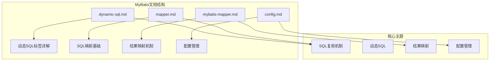

**图表来源**
- [dynamic-sql.md:1-278](file://docs/backend-base/mybatis/dynamic-sql.md#L1-L278)
- [mapper.md:1-242](file://docs/backend-base/mybatis/mapper.md#L1-L242)
- [mybatis-mapper.md:1-488](file://docs/backend-base/mybatis/mybatis-mapper.md#L1-L488)
- [config.md:1-240](file://docs/backend-base/mybatis/config.md#L1-L240)

**章节来源**
- [dynamic-sql.md:1-278](file://docs/backend-base/mybatis/dynamic-sql.md#L1-L278)
- [mapper.md:1-242](file://docs/backend-base/mybatis/mapper.md#L1-L242)
- [mybatis-mapper.md:1-488](file://docs/backend-base/mybatis/mybatis-mapper.md#L1-L488)
- [config.md:1-240](file://docs/backend-base/mybatis/config.md#L1-L240)

## 核心组件

MyBatis SQL复用机制的核心组件主要包括以下几个方面：

### SQL复用标签体系

MyBatis提供了完整的SQL复用标签体系，主要包括：

1. **sql标签** - 定义可重用的SQL代码段
2. **include标签** - 引用已定义的SQL片段
3. **property标签** - 传递参数给SQL片段

### 关键属性配置

| 属性名 | 类型 | 必需性 | 描述 |
|--------|------|--------|------|
| id | String | 是 | SQL片段的唯一标识符，用于引用 |
| refid | String | 是 | 引用其他SQL片段的标识符 |
| name | String | 是 | 参数名称 |
| value | String | 是 | 参数值 |

**章节来源**
- [mapper.md:177-216](file://docs/backend-base/mybatis/mapper.md#L177-L216)

## 架构概览

MyBatis SQL复用机制的整体架构如下：

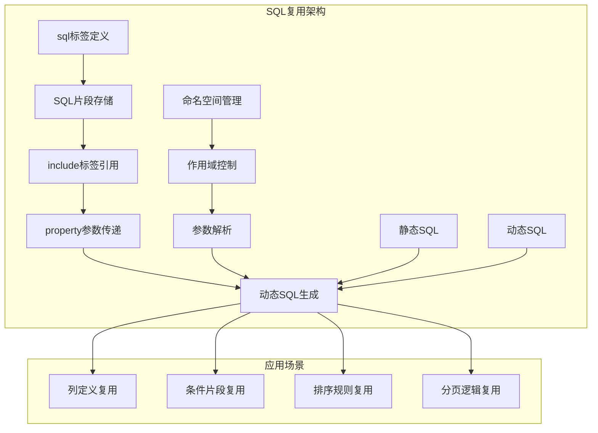

**图表来源**
- [mapper.md:177-216](file://docs/backend-base/mybatis/mapper.md#L177-L216)
- [dynamic-sql.md:115-153](file://docs/backend-base/mybatis/dynamic-sql.md#L115-L153)

## 详细组件分析

### SQL标签（sql标签）

#### 设计理念

sql标签的设计理念是提供一个可重用的SQL代码容器，允许开发者将常用的SQL片段定义为独立的模块，然后在多个查询中进行引用。这种设计遵循了软件工程中的DRY（Don't Repeat Yourself）原则，显著减少了代码重复。

#### 基本语法结构

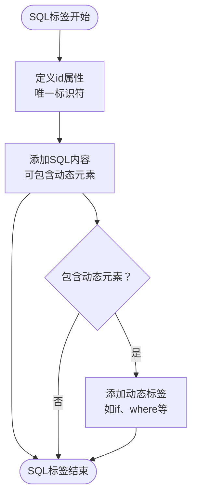

**图表来源**
- [mapper.md:177-185](file://docs/backend-base/mybatis/mapper.md#L177-L185)

#### 高级用法示例

sql标签支持参数化，可以通过`${}`语法接收动态参数：

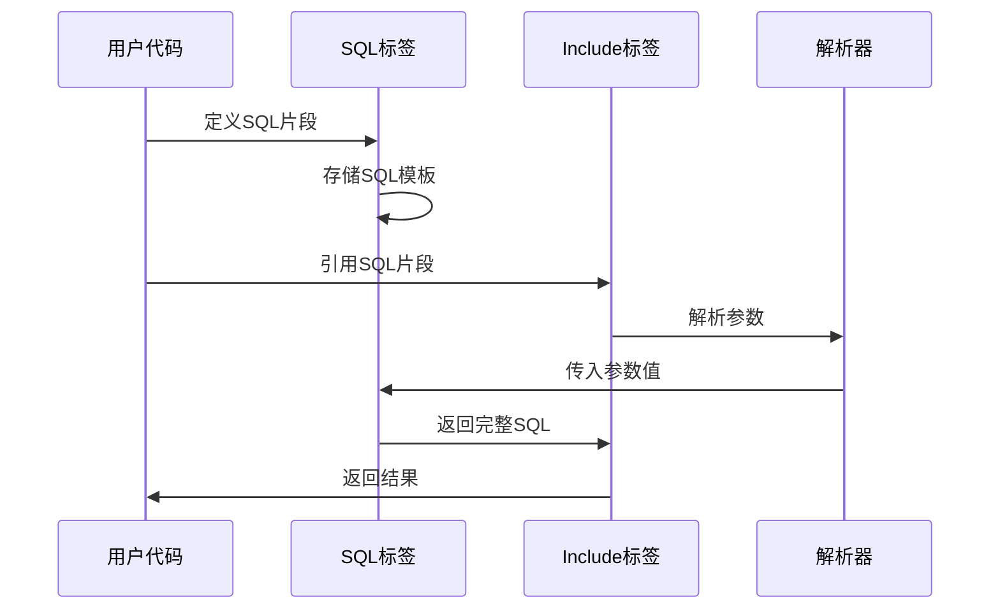

**图表来源**
- [mapper.md:199-216](file://docs/backend-base/mybatis/mapper.md#L199-L216)

**章节来源**
- [mapper.md:177-216](file://docs/backend-base/mybatis/mapper.md#L177-L216)

### Include标签（include标签）

#### 引用机制

include标签负责引用已经定义的SQL片段，其核心功能是将外部定义的SQL代码整合到当前查询中。

#### 属性配置详解

| 属性名 | 类型 | 必需性 | 描述 |
|--------|------|--------|------|
| refid | String | 是 | 引用目标SQL片段的id值 |
| name | String | 否 | 参数名称（配合property使用） |
| value | String | 否 | 参数值（配合property使用） |

#### 引用流程

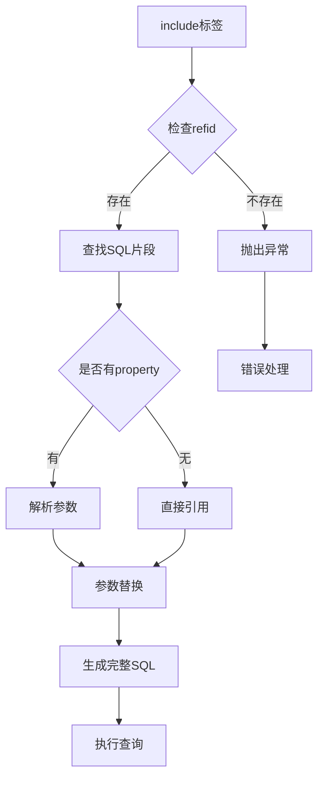

**图表来源**
- [mapper.md:187-195](file://docs/backend-base/mybatis/mapper.md#L187-L195)

**章节来源**
- [mapper.md:187-195](file://docs/backend-base/mybatis/mapper.md#L187-L195)

### Property标签（property标签）

#### 参数传递机制

property标签用于向被引用的SQL片段传递参数，支持动态参数的注入和替换。

#### 使用场景

1. **表名参数化** - 动态指定表名
2. **列名参数化** - 动态指定列名
3. **条件参数化** - 动态生成查询条件

**章节来源**
- [mapper.md:196-216](file://docs/backend-base/mybatis/mapper.md#L196-L216)

### 命名规范与最佳实践

#### id标识符命名规范

| 规范类型 | 建议格式 | 示例 | 说明 |
|----------|----------|------|------|
| 基本命名 | 命名空间.功能描述 | user.selectColumns | 推荐格式 |
| 分层命名 | 层级.功能.用途 | common.sql.columns | 适用于复杂项目 |
| 功能命名 | 功能.用途.细节 | user.paging.limit | 描述性强 |
| 简洁命名 | 功能.用途 | user.columns | 简洁明了 |

#### 作用域管理

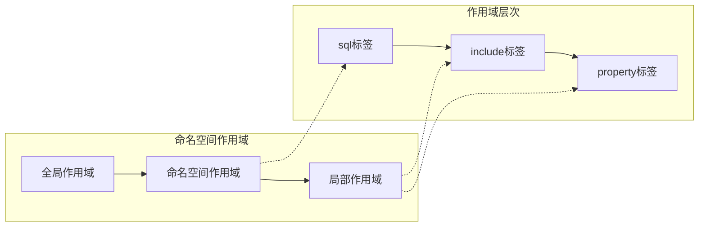

**图表来源**
- [mapper.md:177-185](file://docs/backend-base/mybatis/mapper.md#L177-L185)

**章节来源**
- [mapper.md:177-185](file://docs/backend-base/mybatis/mapper.md#L177-L185)

### 复用场景示例

#### 场景一：列定义复用

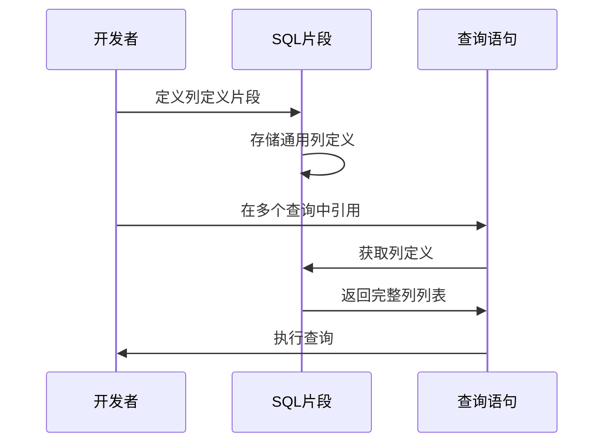

**图表来源**
- [mapper.md:183-195](file://docs/backend-base/mybatis/mapper.md#L183-L195)

#### 场景二：条件片段复用

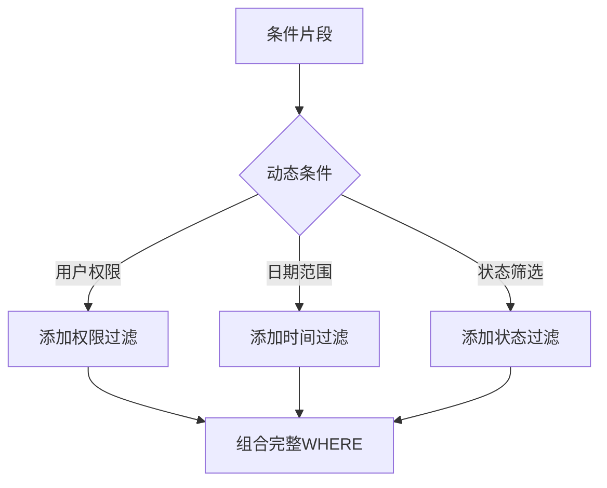

**图表来源**
- [dynamic-sql.md:115-153](file://docs/backend-base/mybatis/dynamic-sql.md#L115-L153)

#### 场景三：排序规则复用

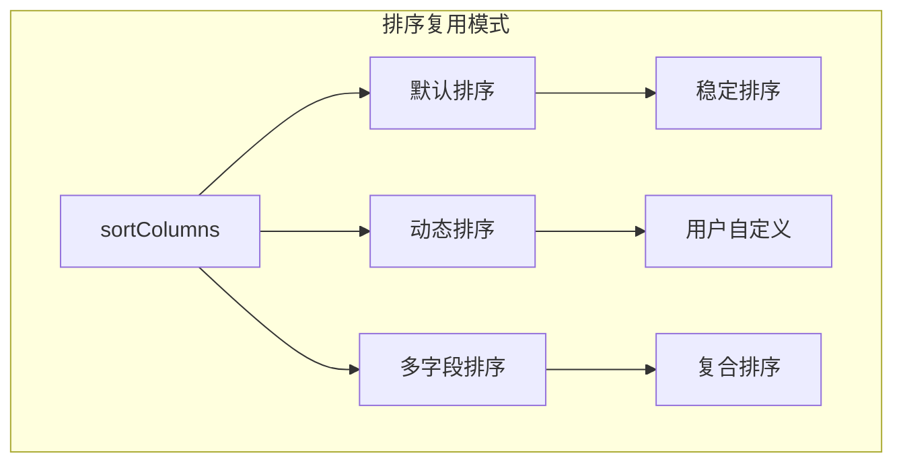

**图表来源**
- [mapper.md:199-216](file://docs/backend-base/mybatis/mapper.md#L199-L216)

**章节来源**
- [dynamic-sql.md:115-153](file://docs/backend-base/mybatis/dynamic-sql.md#L115-L153)
- [mapper.md:183-216](file://docs/backend-base/mybatis/mapper.md#L183-L216)

## 依赖分析

MyBatis SQL复用机制与其他组件的依赖关系如下：

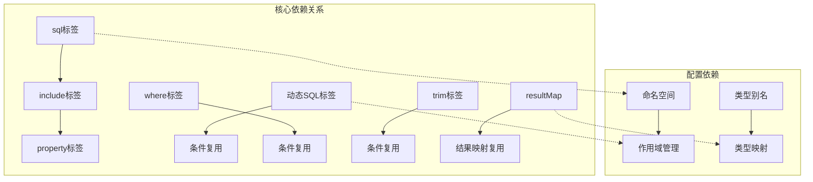

**图表来源**
- [mapper.md:177-216](file://docs/backend-base/mybatis/mapper.md#L177-L216)
- [dynamic-sql.md:115-153](file://docs/backend-base/mybatis/dynamic-sql.md#L115-L153)
- [mybatis-mapper.md:50-88](file://docs/backend-base/mybatis/mybatis-mapper.md#L50-L88)

**章节来源**
- [mapper.md:177-216](file://docs/backend-base/mybatis/mapper.md#L177-L216)
- [dynamic-sql.md:115-153](file://docs/backend-base/mybatis/dynamic-sql.md#L115-L153)
- [mybatis-mapper.md:50-88](file://docs/backend-base/mybatis/mybatis-mapper.md#L50-L88)

## 性能考虑

### 编译时优化

MyBatis在加载配置文件时会对SQL片段进行编译和优化，减少运行时的解析开销。

### 缓存策略

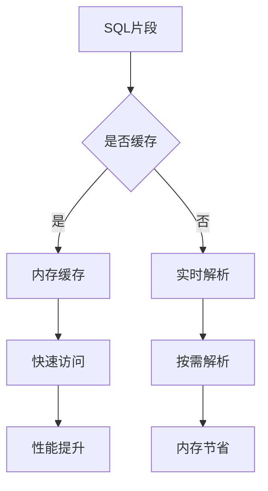

### 内存管理

- **碎片化控制** - 合理使用SQL片段避免过度嵌套
- **参数管理** - 控制参数数量和大小
- **作用域管理** - 限制SQL片段的作用域范围

## 故障排除指南

### 常见问题及解决方案

#### 问题1：SQL片段引用失败

**症状**：`找不到refid指定的SQL片段`

**解决方案**：
1. 检查id属性的拼写和大小写
2. 确认命名空间的一致性
3. 验证SQL片段的可见性范围

#### 问题2：参数传递异常

**症状**：`property参数无法正确解析`

**解决方案**：
1. 检查property标签的name和value属性
2. 确认参数在SQL片段中的使用方式
3. 验证参数的类型匹配

#### 问题3：作用域冲突

**症状**：`命名冲突或作用域错误`

**解决方案**：
1. 使用更具体的命名空间
2. 采用层级化的命名方式
3. 避免重复的id定义

**章节来源**
- [mapper.md:177-216](file://docs/backend-base/mybatis/mapper.md#L177-L216)

## 结论

MyBatis SQL复用机制通过sql、include和property标签的有机结合，为开发者提供了一个强大而灵活的SQL代码复用解决方案。该机制不仅提高了代码的可维护性和一致性，还为复杂SQL的模块化设计提供了坚实的基础。

### 主要优势

1. **代码复用** - 显著减少重复代码的编写
2. **维护性** - 集中管理SQL片段，便于统一修改
3. **灵活性** - 支持动态参数传递和条件组合
4. **性能** - 编译时优化和缓存机制

### 最佳实践建议

1. **合理的命名规范** - 建立清晰的命名约定
2. **适度的嵌套** - 避免过深的SQL片段嵌套
3. **参数化设计** - 充分利用property标签的参数传递能力
4. **作用域管理** - 合理控制SQL片段的作用范围

通过合理运用MyBatis SQL复用机制，开发者可以构建更加模块化、可维护和高性能的数据库访问层，为复杂业务场景提供可靠的SQL解决方案。