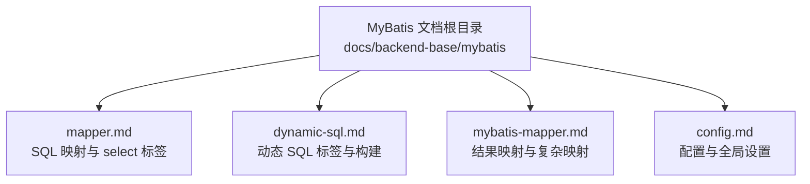
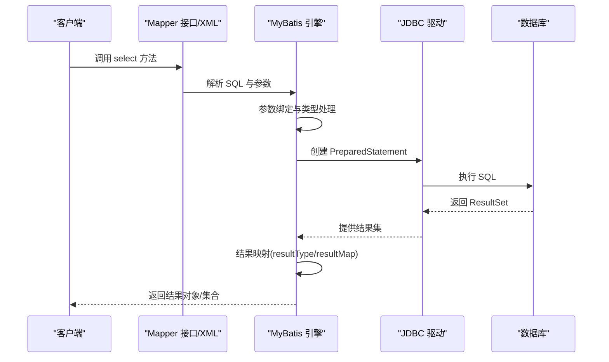
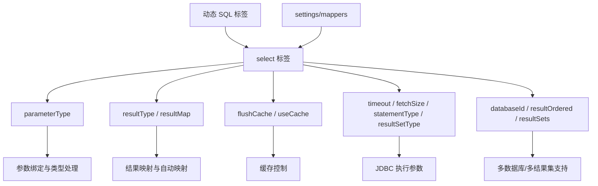

# Select查询标签

<cite>
**本文档引用的文件**
- [mapper.md](file://docs/backend-base/mybatis/mapper.md)
- [dynamic-sql.md](file://docs/backend-base/mybatis/dynamic-sql.md)
- [mybatis-mapper.md](file://docs/backend-base/mybatis/mybatis-mapper.md)
- [config.md](file://docs/backend-base/mybatis/config.md)
</cite>

## 目录
1. [简介](#简介)
2. [项目结构](#项目结构)
3. [核心组件](#核心组件)
4. [架构总览](#架构总览)
5. [详细组件分析](#详细组件分析)
6. [依赖分析](#依赖分析)
7. [性能考量](#性能考量)
8. [故障排查指南](#故障排查指南)
9. [结论](#结论)
10. [附录](#附录)

## 简介
本技术文档围绕 MyBatis 的 select 查询标签展开，系统讲解其基本用法、语法结构、核心属性与高级配置，结合动态 SQL 构建、参数绑定机制、预处理语句生成以及结果映射策略，帮助开发者在不同业务场景下高效、安全地使用 select 标签，并提供最佳实践建议。

## 项目结构
本仓库的 MyBatis 文档位于 backend-base/mybatis 目录，包含以下关键文件：
- mapper.md：SQL 映射与 select 标签详解
- dynamic-sql.md：动态 SQL 标签与构建技巧
- mybatis-mapper.md：结果映射（resultMap、resultType）与复杂映射
- config.md：MyBatis 配置项与全局设置

图表来源
- [mapper.md:1-242](file://docs/backend-base/mybatis/mapper.md#L1-L242)
- [dynamic-sql.md:1-278](file://docs/backend-base/mybatis/dynamic-sql.md#L1-L278)
- [mybatis-mapper.md:1-488](file://docs/backend-base/mybatis/mybatis-mapper.md#L1-L488)
- [config.md:1-240](file://docs/backend-base/mybatis/config.md#L1-L240)

章节来源
- [mapper.md:1-242](file://docs/backend-base/mybatis/mapper.md#L1-L242)
- [dynamic-sql.md:1-278](file://docs/backend-base/mybatis/dynamic-sql.md#L1-L278)
- [mybatis-mapper.md:1-488](file://docs/backend-base/mybatis/mybatis-mapper.md#L1-L488)
- [config.md:1-240](file://docs/backend-base/mybatis/config.md#L1-L240)

## 核心组件
- select 标签：用于映射查询语句，是最常用的标签之一。支持 id、parameterType、resultType、resultMap、flushCache、useCache、timeout、fetchSize、statementType、resultSetType、databaseId、resultOrdered、resultSets 等属性。
- 动态 SQL 标签：if、choose/when/otherwise、where、trim、set、foreach、bind 等，用于按需拼接 SQL 片段，提升查询灵活性。
- 结果映射：resultType 与 resultMap，支持简单字段映射、自动映射、复杂对象映射（association、collection）及嵌套查询/嵌套结果映射。
- 参数绑定与预处理：通过 #{...} 占位符绑定参数，MyBatis 生成 PreparedStatement，避免 SQL 注入风险。

章节来源
- [mapper.md:5-44](file://docs/backend-base/mybatis/mapper.md#L5-L44)
- [dynamic-sql.md:1-278](file://docs/backend-base/mybatis/dynamic-sql.md#L1-L278)
- [mybatis-mapper.md:5-98](file://docs/backend-base/mybatis/mybatis-mapper.md#L5-L98)

## 架构总览
MyBatis 的查询执行链路（简化）：
- Mapper XML/注解定义 select 语句
- MyBatis 解析 XML/注解，构建 MappedStatement
- 参数绑定阶段：将传入参数映射到 #{...} 占位符
- 预处理阶段：生成 PreparedStatement
- 执行阶段：执行 SQL，获取 ResultSet
- 结果映射阶段：根据 resultType 或 resultMap 将列映射到 Java 对象

图表来源
- [mapper.md:11-25](file://docs/backend-base/mybatis/mapper.md#L11-L25)
- [mybatis-mapper.md:5-98](file://docs/backend-base/mybatis/mybatis-mapper.md#L5-L98)

## 详细组件分析

### 1) select 标签基础与语法
- 用途：映射查询语句，最常用标签之一
- 基本语法：包含 id、parameterType、resultType 或 resultMap 等属性
- 参数绑定：使用 #{...} 占位符，MyBatis 生成 PreparedStatement，避免注入
- 返回类型：resultType 指向单个实体或集合元素类型；resultMap 指向外部定义的结果映射

章节来源
- [mapper.md:7-18](file://docs/backend-base/mybatis/mapper.md#L7-L18)
- [mapper.md:11-15](file://docs/backend-base/mybatis/mapper.md#L11-L15)

### 2) select 标签核心属性详解
- id：命名空间内唯一标识，用于引用该语句
- parameterType：参数类型（可省略，MyBatis 可推断）
- resultType：返回类型（集合时为集合元素类型，不可与 resultMap 同时使用）
- resultMap：外部定义的结果映射引用（不可与 resultType 同时使用）
- flushCache：是否清空本地缓存与二级缓存（默认 false）
- useCache：是否启用二级缓存（默认 true）
- timeout：超时秒数（默认 unset，依赖驱动）
- fetchSize：批量返回行数（默认 unset，依赖驱动）
- statementType：STATEMENT/PreparedStatement/CallableStatement（默认 PREPARED）
- resultSetType：FORWARD_ONLY/SCROLL_SENSITIVE/SCROLL_INSENSITIVE（默认 unset）
- databaseId：按数据库厂商选择语句（配合 databaseIdProvider）
- resultOrdered：嵌套结果 select 时控制顺序（默认 false）
- resultSets：多结果集命名（逗号分隔）

章节来源
- [mapper.md:27-44](file://docs/backend-base/mybatis/mapper.md#L27-L44)

### 3) 参数绑定机制与预处理语句生成
- 参数绑定：#{id} 会绑定到 PreparedStatement 的 ? 占位符
- 预处理：MyBatis 生成 PreparedStatement，传入参数值
- 简单参数：原生类型或简单类型直接替换
- 复杂参数：对象参数通过属性名绑定，如 #{id}、#{username}

章节来源
- [mapper.md:19-25](file://docs/backend-base/mybatis/mapper.md#L19-L25)
- [mapper.md:224-241](file://docs/backend-base/mybatis/mapper.md#L224-L241)

### 4) 动态 SQL 构建
- if：按条件拼接片段
- where：自动处理 WHERE 关键字与 AND/OR 前缀
- trim：自定义前缀/后缀并去除多余关键字
- set：动态 SET 关键字与逗号处理
- choose/when/otherwise：类似 switch 的分支选择
- foreach：集合/数组遍历，支持 in 条件与批量插入
- bind：定义变量并参与查询（如模糊匹配）

章节来源
- [dynamic-sql.md:3-134](file://docs/backend-base/mybatis/dynamic-sql.md#L3-L134)
- [dynamic-sql.md:157-239](file://docs/backend-base/mybatis/dynamic-sql.md#L157-L239)
- [dynamic-sql.md:241-278](file://docs/backend-base/mybatis/dynamic-sql.md#L241-L278)

### 5) 结果映射与复杂对象
- resultType：简单类型映射，自动将列名映射到 JavaBean 属性（可开启驼峰映射）
- resultMap：复杂映射，支持 id、result、constructor、association、collection 等
- 自动映射：忽略大小写匹配列名与属性名
- 嵌套查询与嵌套结果映射：一对多、一对一、多对多关系映射

章节来源
- [mybatis-mapper.md:5-98](file://docs/backend-base/mybatis/mybatis-mapper.md#L5-L98)
- [mybatis-mapper.md:90-298](file://docs/backend-base/mybatis/mybatis-mapper.md#L90-L298)

### 6) 高级配置与最佳实践
- 缓存策略：useCache 控制二级缓存；flushCache 控制缓存清空
- 超时与批处理：timeout、fetchSize 优化长查询与大数据集
- 语句类型：statementType 指定 Statement/PreparedStatement/CallableStatement
- 数据库适配：databaseId 与 databaseIdProvider
- 结果集顺序：resultOrdered 与多结果集 resultSets

章节来源
- [mapper.md:36-44](file://docs/backend-base/mybatis/mapper.md#L36-L44)

### 7) XML 配置示例与场景
- 简单查询：使用 resultType 返回 HashMap 或 JavaBean
- 复杂映射：使用 resultMap 定义 association/collection
- 动态条件：if/where/choose/trim/set/foreach/bind 组合
- 嵌套查询与嵌套结果映射：一对多、一对一、多对多
- 主键生成：selectKey 与 @SelectKey 注解

章节来源
- [mapper.md:11-15](file://docs/backend-base/mybatis/mapper.md#L11-L15)
- [mapper.md:224-241](file://docs/backend-base/mybatis/mapper.md#L224-L241)
- [dynamic-sql.md:9-113](file://docs/backend-base/mybatis/dynamic-sql.md#L9-L113)
- [dynamic-sql.md:170-216](file://docs/backend-base/mybatis/dynamic-sql.md#L170-L216)
- [mybatis-mapper.md:306-377](file://docs/backend-base/mybatis/mybatis-mapper.md#L306-L377)

## 依赖分析
- select 标签依赖：
  - 参数绑定：依赖 TypeHandler 与参数映射规则
  - 动态 SQL：依赖 if/where/choose/trim/set/foreach/bind 等标签
  - 结果映射：依赖 resultType 或 resultMap
  - 缓存与超时：受 useCache、flushCache、timeout、fetchSize、statementType、resultSetType、databaseId、resultOrdered、resultSets 等影响
- 配置依赖：
  - settings：cacheEnabled、mapUnderscoreToCamelCase、localCacheScope 等
  - mappers：Mapper XML/接口注册

图表来源
- [mapper.md:27-44](file://docs/backend-base/mybatis/mapper.md#L27-L44)
- [dynamic-sql.md:1-278](file://docs/backend-base/mybatis/dynamic-sql.md#L1-L278)
- [config.md:54-70](file://docs/backend-base/mybatis/config.md#L54-L70)

章节来源
- [mapper.md:27-44](file://docs/backend-base/mybatis/mapper.md#L27-L44)
- [dynamic-sql.md:1-278](file://docs/backend-base/mybatis/dynamic-sql.md#L1-L278)
- [config.md:54-70](file://docs/backend-base/mybatis/config.md#L54-L70)

## 性能考量
- 合理使用缓存：对只读查询启用 useCache，必要时通过 flushCache 清理脏数据
- 控制批处理与超时：合理设置 fetchSize 与 timeout，避免长时间阻塞
- 语句类型选择：默认 PREPARED 即可；存储过程使用 CallableStatement
- 自动映射优化：开启 mapUnderscoreToCamelCase，减少手工映射成本
- 动态 SQL 精简：避免过度拼接导致 SQL 复杂度上升，必要时拆分子查询
- 嵌套查询与懒加载：一对多/多对多建议使用懒加载，减少 N+1 问题

章节来源
- [config.md:56-70](file://docs/backend-base/mybatis/config.md#L56-L70)
- [mapper.md:36-44](file://docs/backend-base/mybatis/mapper.md#L36-L44)
- [mybatis-mapper.md:263-265](file://docs/backend-base/mybatis/mybatis-mapper.md#L263-L265)

## 故障排查指南
- 参数绑定异常：检查 parameterType 与 #{...} 名称是否匹配；复杂对象需确保属性存在
- 结果映射异常：确认 resultType 与 resultMap 二选一；列名与属性名不匹配时使用列别名或开启驼峰映射
- 动态 SQL 语法错误：where 标签末尾不要遗留 AND/OR；必要时改用 trim
- 超时与批处理：适当增大 timeout，调整 fetchSize；避免一次性返回过多数据
- 缓存一致性：写操作后使用 flushCache 清理缓存，或在读操作中谨慎使用 useCache
- 多数据库适配：配置 databaseIdProvider，确保语句按数据库厂商正确加载

章节来源
- [mapper.md:32-35](file://docs/backend-base/mybatis/mapper.md#L32-L35)
- [dynamic-sql.md:115-155](file://docs/backend-base/mybatis/dynamic-sql.md#L115-L155)
- [config.md:185-195](file://docs/backend-base/mybatis/config.md#L185-L195)

## 结论
select 标签是 MyBatis 查询能力的核心，结合动态 SQL 与结果映射，能够灵活应对复杂业务场景。通过合理配置缓存、超时、批处理与语句类型，配合参数绑定与预处理机制，可在保证安全性的同时获得良好性能。建议在实际项目中优先使用 resultMap 进行复杂映射，善用动态 SQL 与懒加载策略，持续优化查询效率与可维护性。

## 附录
- 常用标签速查：if、where、trim、set、choose/when/otherwise、foreach、bind
- 最佳实践清单：
  - 优先使用 resultMap
  - 合理设置 useCache/flushCache
  - 为长查询设置 timeout
  - 为大数据集设置 fetchSize
  - 使用驼峰映射减少手工映射
  - 动态 SQL 中避免遗留 AND/OR
  - 多对多/一对多使用懒加载