# 主键生成机制

<cite>
**本文档引用的文件**
- [config.md](file://docs/backend-base/mybatis/config.md)
- [mapper.md](file://docs/backend-base/mybatis/mapper.md)
- [mybatis-mapper.md](file://docs/backend-base/mybatis/mybatis-mapper.md)
- [dynamic-sql.md](file://docs/backend-base/mybatis/dynamic-sql.md)
</cite>

## 目录
1. [简介](#简介)
2. [项目结构](#项目结构)
3. [核心组件](#核心组件)
4. [架构概览](#架构概览)
5. [详细组件分析](#详细组件分析)
6. [依赖关系分析](#依赖关系分析)
7. [性能考虑](#性能考虑)
8. [故障排除指南](#故障排除指南)
9. [结论](#结论)

## 简介

MyBatis主键生成机制是持久层框架中的关键功能，负责在数据插入过程中自动生成或设置唯一标识符。本文档深入探讨了MyBatis的主键生成策略，包括XML配置和注解两种方式，涵盖了Oracle序列、UUID生成、雪花算法等实际应用场景，以及并发安全和性能优化等高级主题。

## 项目结构

MyBatis相关文档位于`docs/backend-base/mybatis/`目录下，包含四个核心文档文件：

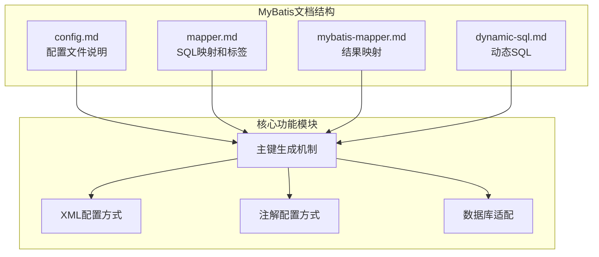

**图表来源**
- [config.md:1-240](file://docs/backend-base/mybatis/config.md#L1-L240)
- [mapper.md:1-242](file://docs/backend-base/mybatis/mapper.md#L1-L242)

**章节来源**
- [config.md:1-240](file://docs/backend-base/mybatis/config.md#L1-L240)
- [mapper.md:1-242](file://docs/backend-base/mybatis/mapper.md#L1-L242)

## 核心组件

MyBatis主键生成机制主要由以下核心组件构成：

### 1. selectKey标签组件

selectKey标签是MyBatis中实现自定义主键生成的核心组件，支持在插入操作前后执行主键生成逻辑。

### 2. @SelectKey注解组件

@SelectKey注解提供了基于注解的主键生成方式，与XML配置的selectKey标签功能等价。

### 3. useGeneratedKeys配置组件

useGeneratedKeys属性允许JDBC支持自动生成主键，适用于支持数据库自增的场景。

### 4. keyProperty和keyColumn组件

keyProperty指定主键属性，keyColumn指定对应的数据库列名，确保主键值正确映射到实体对象。

**章节来源**
- [mapper.md:92-176](file://docs/backend-base/mybatis/mapper.md#L92-L176)

## 架构概览

MyBatis主键生成机制的整体架构如下：

```mermaid
graph TB
subgraph "应用层"
A[业务逻辑层]
B[实体对象]
end
subgraph "MyBatis核心层"
C[SqlSession]
D[Executor执行器]
E[StatementHandler]
F[ParameterHandler]
G[ResultSetHandler]
end
subgraph "主键生成层"
H[selectKey处理器]
I[@SelectKey注解处理器]
J[useGeneratedKeys处理器]
K[数据库自增机制]
end
subgraph "数据访问层"
L[数据库连接]
M[SQL执行器]
end
A --> C
B --> D
D --> E
E --> F
E --> G
F --> H
G --> I
H --> J
J --> K
K --> L
L --> M
```

**图表来源**
- [mapper.md:86-91](file://docs/backend-base/mybatis/mapper.md#L86-L91)
- [mapper.md:138-176](file://docs/backend-base/mybatis/mapper.md#L138-L176)

## 详细组件分析

### selectKey标签深度解析

#### 标签语法和属性

selectKey标签提供了灵活的主键生成配置选项：

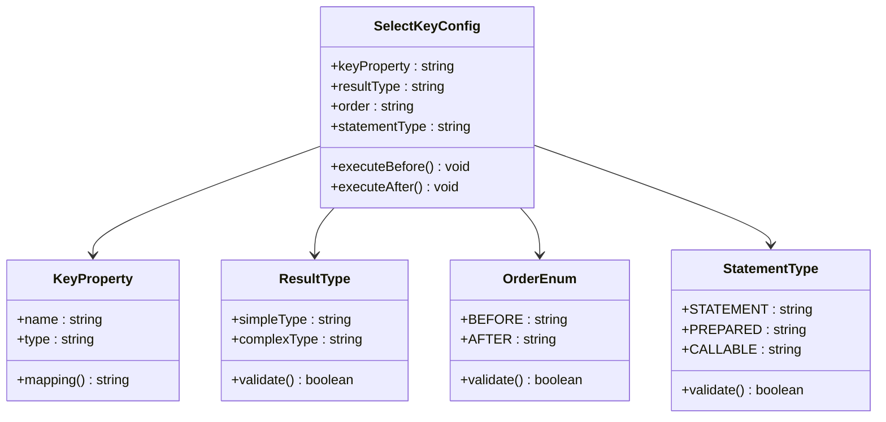

**图表来源**
- [mapper.md:96-107](file://docs/backend-base/mybatis/mapper.md#L96-L107)

#### before和after执行顺序详解

selectKey标签的order属性决定了主键生成的执行时机：

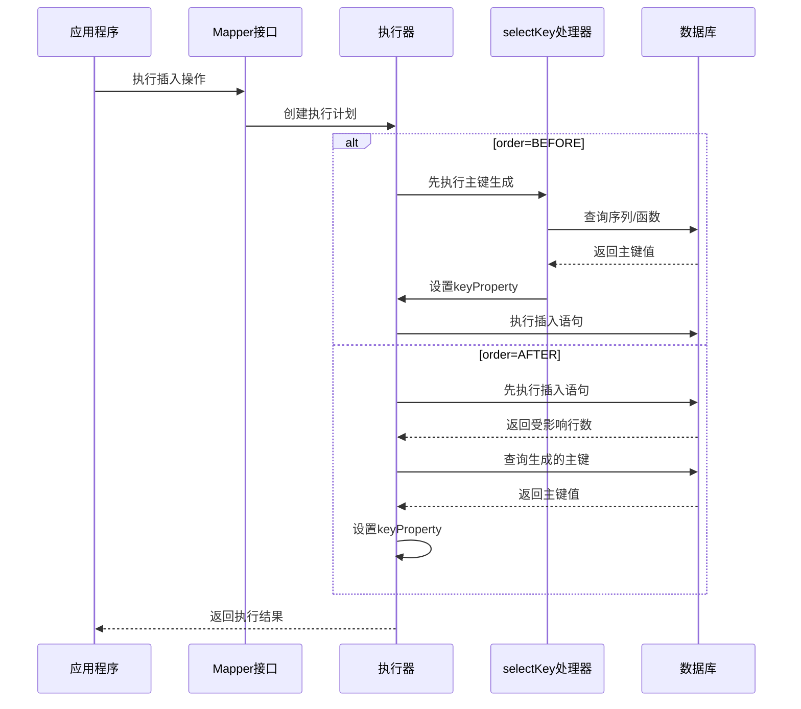

**图表来源**
- [mapper.md:106](file://docs/backend-base/mybatis/mapper.md#L106)

**章节来源**
- [mapper.md:92-123](file://docs/backend-base/mybatis/mapper.md#L92-L123)

### 关键属性配置详解

#### keyProperty属性

keyProperty指定了主键值应该设置到实体对象的哪个属性上：

| 属性配置 | 作用说明 | 使用场景 |
|---------|---------|---------|
| 单个属性 | 设置单一主键值 | 常规自增主键 |
| 多个属性 | 设置复合主键值 | 复合主键场景 |
| 嵌套属性 | 设置嵌套对象属性 | 复杂对象主键 |

#### resultType属性

resultType明确了主键值的数据类型：

| 数据类型 | 适用场景 | 注意事项 |
|---------|---------|---------|
| 整数类型 | 自增主键 | 包括Long、Integer等 |
| 字符串类型 | UUID主键 | 必须明确指定 |
| 复杂类型 | 对象或Map | 用于多列主键 |

#### order属性

order属性控制主键生成的执行时机：

| 执行顺序 | 适用数据库 | 性能特点 | 使用场景 |
|---------|-----------|---------|---------|
| BEFORE | Oracle、DB2等 | 需要额外查询 | 不支持自增的数据库 |
| AFTER | MySQL、SQL Server等 | 一次插入完成 | 支持自增的数据库 |

#### statementType属性

statementType决定了SQL执行器的类型：

| 执行器类型 | 适用场景 | 性能影响 |
|-----------|---------|---------|
| STATEMENT | 简单SQL | 最快但不安全 |
| PREPARED | 预编译SQL | 推荐使用 | 安全且高效 |
| CALLABLE | 存储过程 | 复杂场景 | 最慢但功能强 |

**章节来源**
- [mapper.md:98-107](file://docs/backend-base/mybatis/mapper.md#L98-L107)

### 自动生成主键策略

#### useGeneratedKeys配置

useGeneratedKeys属性允许JDBC驱动程序自动生成主键：

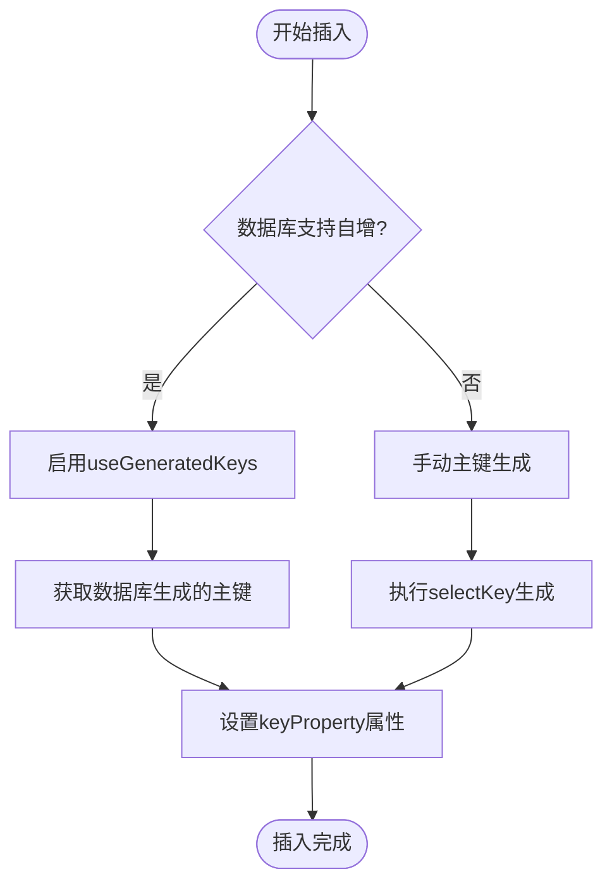

**图表来源**
- [mapper.md:88-90](file://docs/backend-base/mybatis/mapper.md#L88-L90)

**章节来源**
- [mapper.md:88-90](file://docs/backend-base/mybatis/mapper.md#L88-L90)

### 自定义主键生成策略

#### Oracle序列生成

Oracle数据库推荐使用序列生成主键：

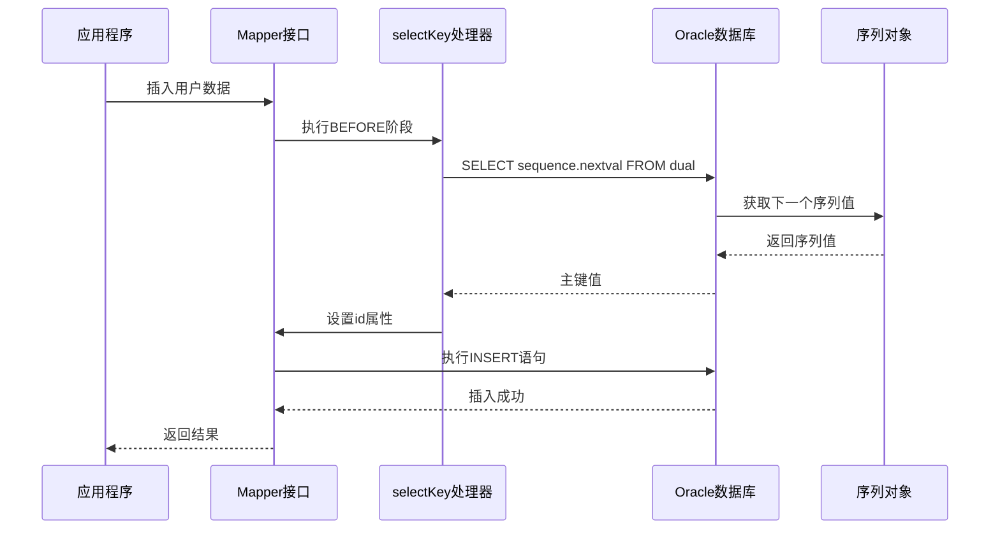

**图表来源**
- [mapper.md:113-122](file://docs/backend-base/mybatis/mapper.md#L113-L122)

#### UUID生成策略

UUID提供全局唯一标识符生成：

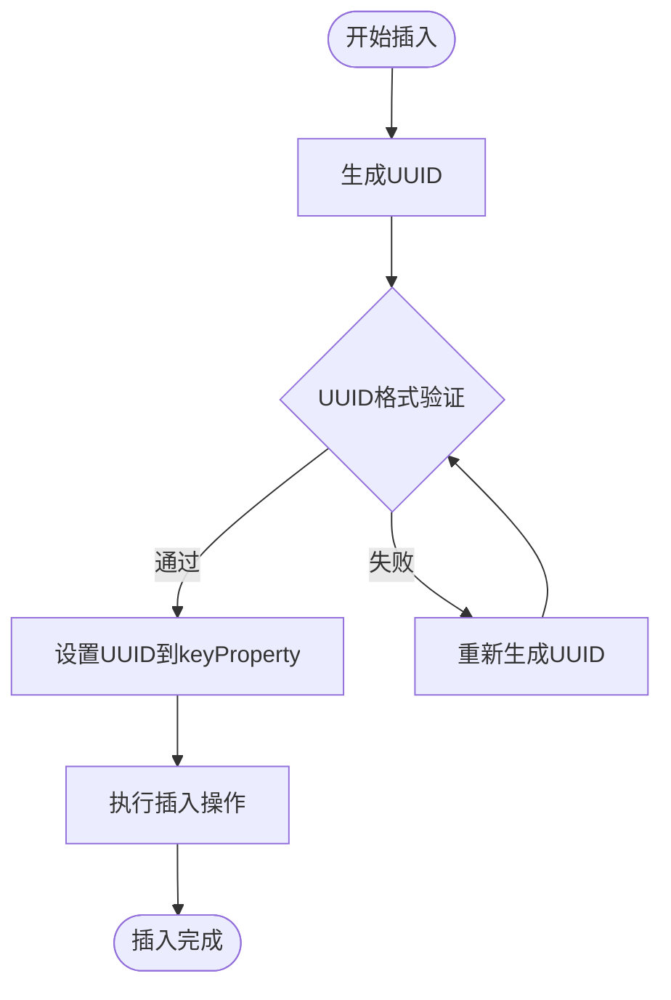

**图表来源**
- [mapper.md:129-136](file://docs/backend-base/mybatis/mapper.md#L129-L136)

**章节来源**
- [mapper.md:109-136](file://docs/backend-base/mybatis/mapper.md#L109-L136)

### @SelectKey注解深度分析

#### 注解属性详解

@SelectKey注解提供了与XML配置等价的功能：

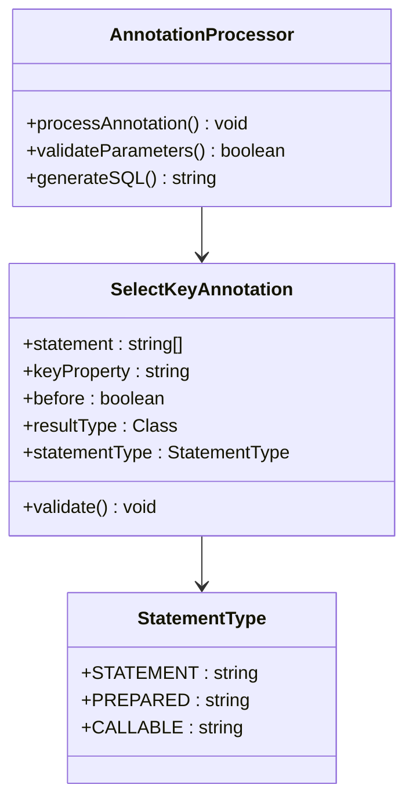

**图表来源**
- [mapper.md:146-154](file://docs/backend-base/mybatis/mapper.md#L146-L154)

#### 注解与XML配置对比

| 特性 | @SelectKey注解 | XML selectKey标签 |
|------|---------------|------------------|
| 配置方式 | Java代码注解 | XML配置文件 |
| 类型安全 | 编译时检查 | 运行时检查 |
| 灵活性 | 代码级控制 | 配置级控制 |
| 维护性 | 集中管理 | 分散管理 |
| 性能 | 相同 | 相同 |

**章节来源**
- [mapper.md:138-176](file://docs/backend-base/mybatis/mapper.md#L138-L176)

### 高级应用场景

#### 复合主键生成

对于需要复合主键的场景，可以同时设置多个keyProperty：

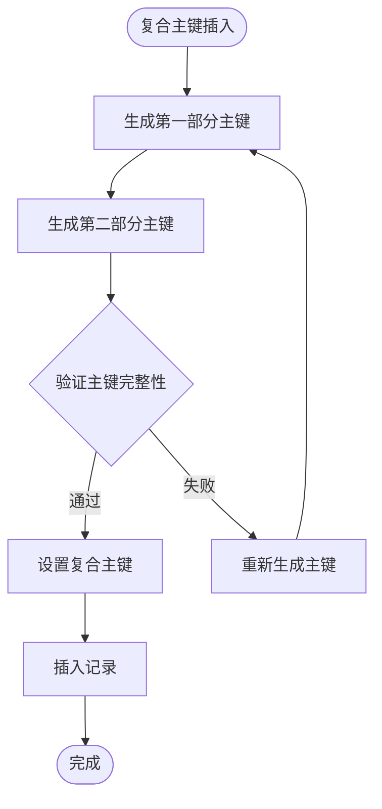

#### 分布式主键生成

结合雪花算法等分布式ID生成策略：

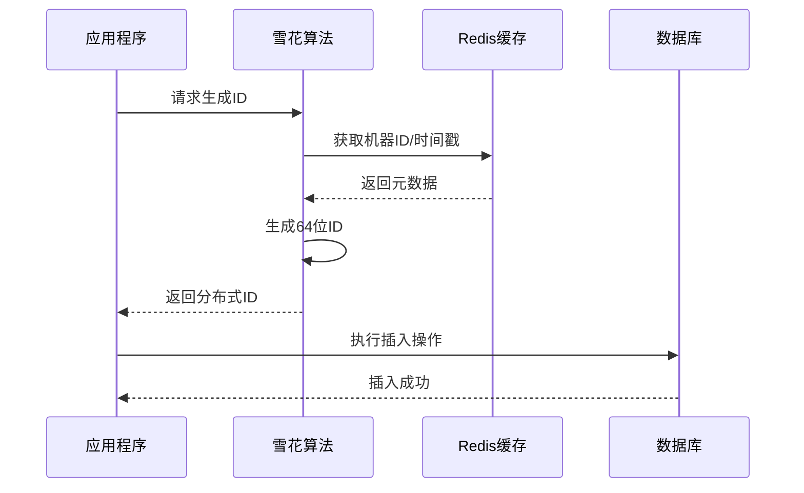

## 依赖关系分析

MyBatis主键生成机制的依赖关系如下：

```mermaid
graph TB
subgraph "外部依赖"
A[数据库驱动]
B[JDBC API]
C[数据库管理系统]
end
subgraph "MyBatis内部组件"
D[SqlSessionFactory]
E[SqlSession]
F[Executor]
G[StatementHandler]
H[ParameterHandler]
I[ResultSetHandler]
end
subgraph "主键生成组件"
J[selectKey处理器]
K[@SelectKey注解处理器]
L[useGeneratedKeys处理器]
M[数据库自增机制]
end
A --> B
B --> C
D --> E
E --> F
F --> G
G --> H
H --> I
I --> J
I --> K
J --> L
L --> M
M --> C
```

**图表来源**
- [config.md:58](file://docs/backend-base/mybatis/config.md#L58)
- [mapper.md:88](file://docs/backend-base/mybatis/mapper.md#L88)

**章节来源**
- [config.md:58](file://docs/backend-base/mybatis/config.md#L58)
- [mapper.md:88](file://docs/backend-base/mybatis/mapper.md#L88)

## 性能考虑

### 并发安全性

主键生成机制在高并发场景下的安全性保障：

1. **数据库序列锁机制**：Oracle序列在多线程环境下自动加锁
2. **JDBC驱动支持**：现代JDBC驱动程序提供线程安全的主键生成
3. **事务隔离**：通过数据库事务确保主键生成的一致性

### 性能优化策略

#### 选择合适的执行顺序

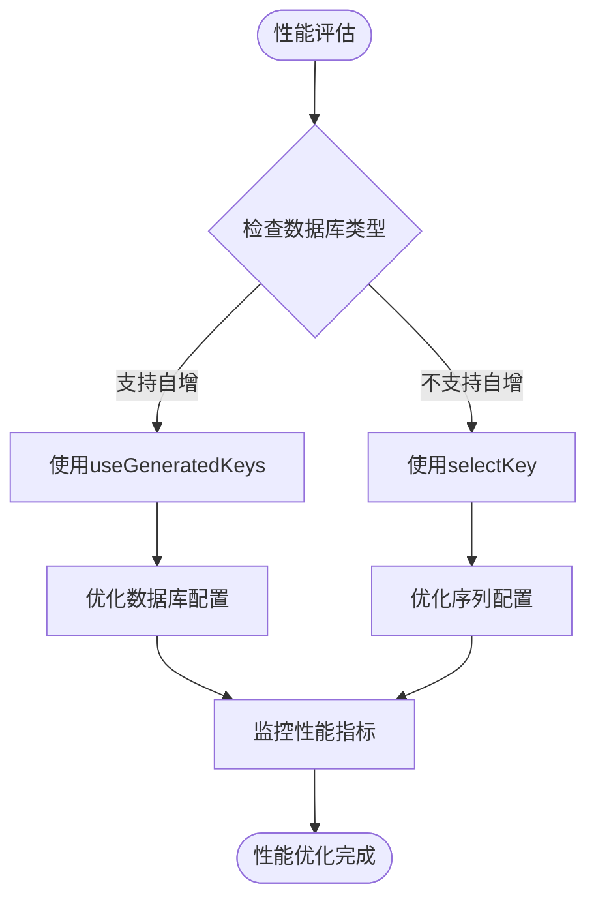

#### 缓存策略

- **序列值缓存**：减少数据库查询次数
- **主键值缓存**：避免重复计算
- **连接池优化**：合理配置数据库连接

**章节来源**
- [config.md:58](file://docs/backend-base/mybatis/config.md#L58)

## 故障排除指南

### 常见问题及解决方案

#### 主键冲突问题

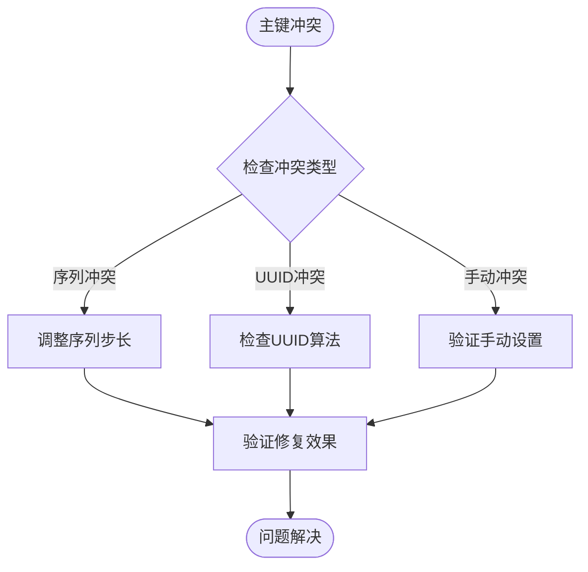

#### 并发安全问题

1. **数据库锁机制**：确保序列和表级锁正确配置
2. **事务边界**：合理设置事务范围
3. **重试机制**：实现幂等的主键生成逻辑

#### 性能问题诊断

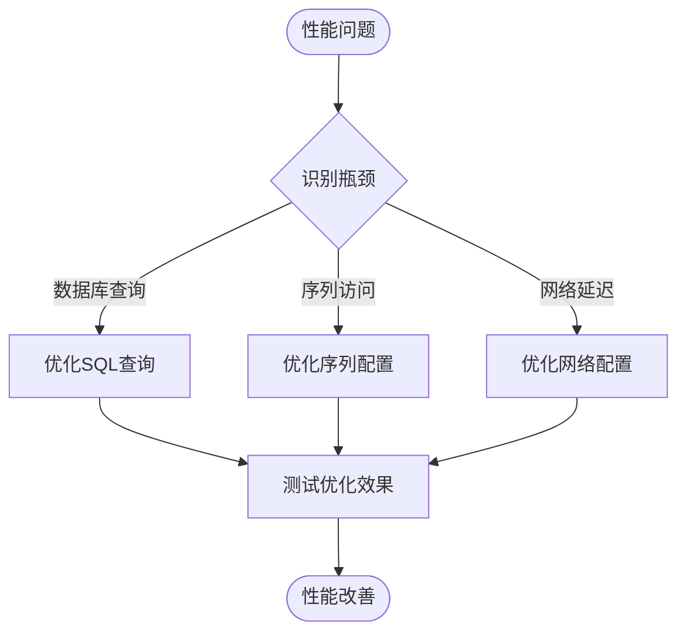

**章节来源**
- [mapper.md:109-136](file://docs/backend-base/mybatis/mapper.md#L109-L136)

## 结论

MyBatis主键生成机制提供了灵活而强大的数据持久化能力。通过selectKey标签和@SelectKey注解，开发者可以根据具体的业务需求和数据库特性选择最适合的主键生成策略。

关键要点总结：

1. **灵活性**：支持多种主键生成策略，包括数据库自增、序列生成、UUID和自定义算法
2. **兼容性**：适配主流数据库系统，提供统一的配置接口
3. **性能**：通过合理的配置和优化策略，确保高并发场景下的性能表现
4. **安全性**：提供完善的并发控制和错误处理机制

在实际应用中，建议根据具体的业务场景选择合适的主键生成策略，并结合数据库特性和性能要求进行优化配置。