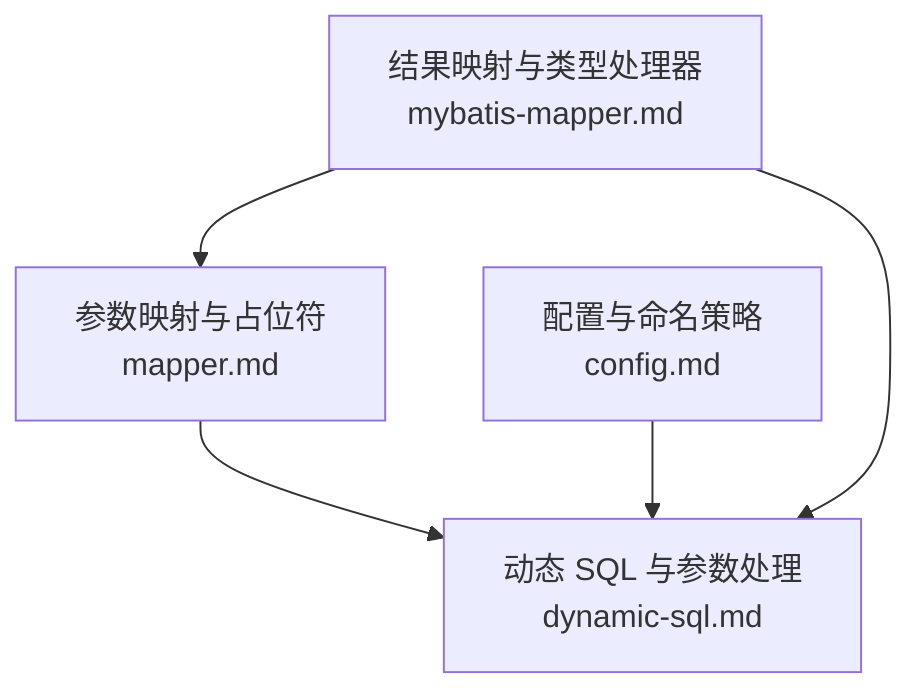
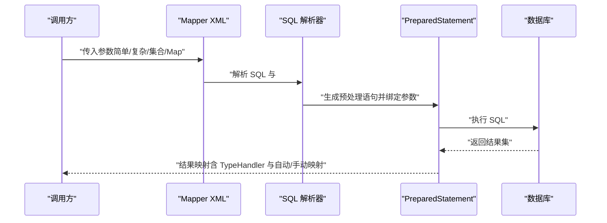
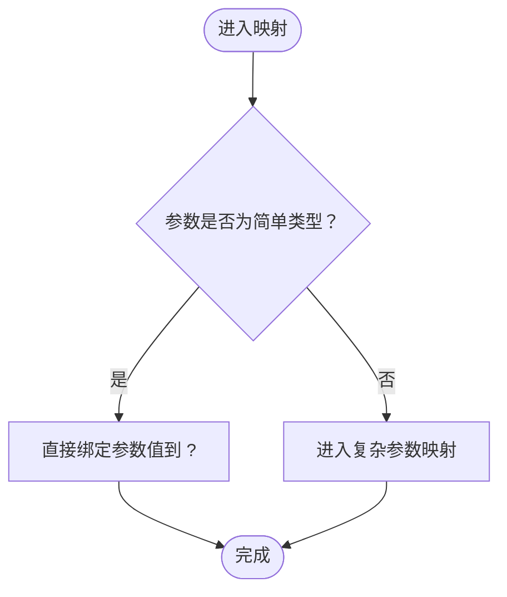
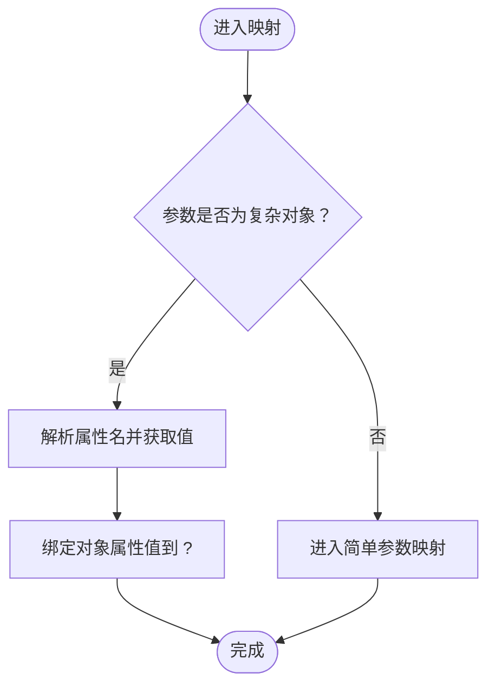
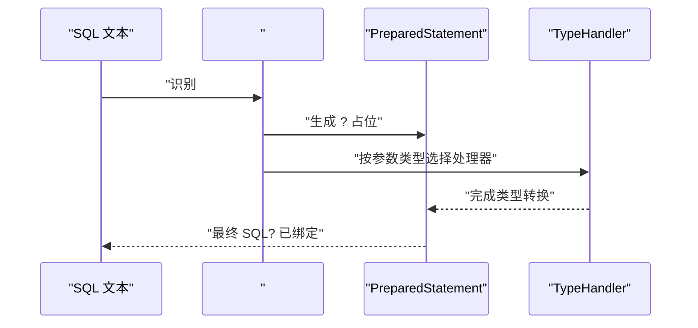
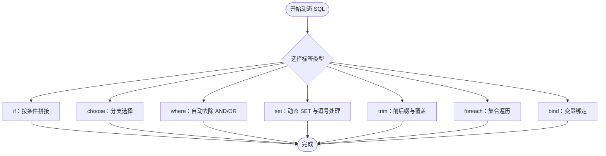
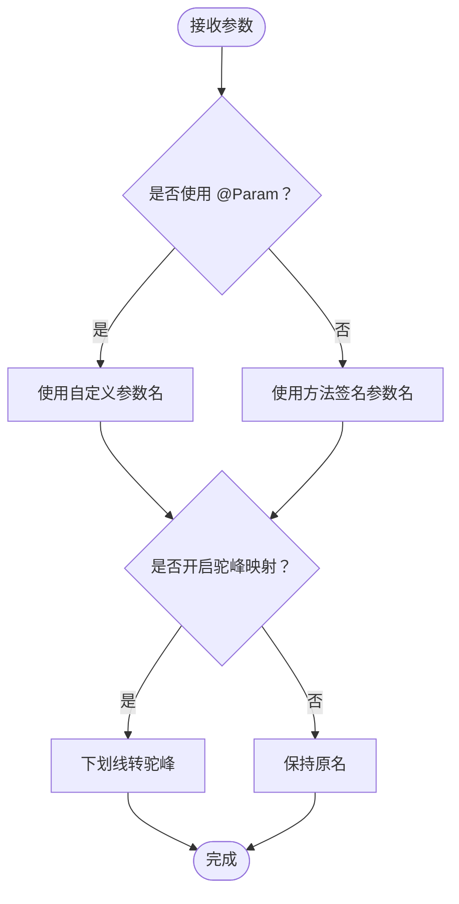
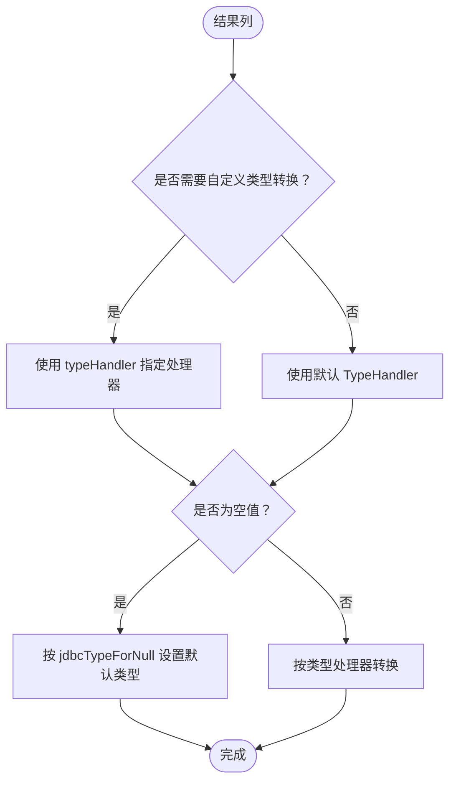
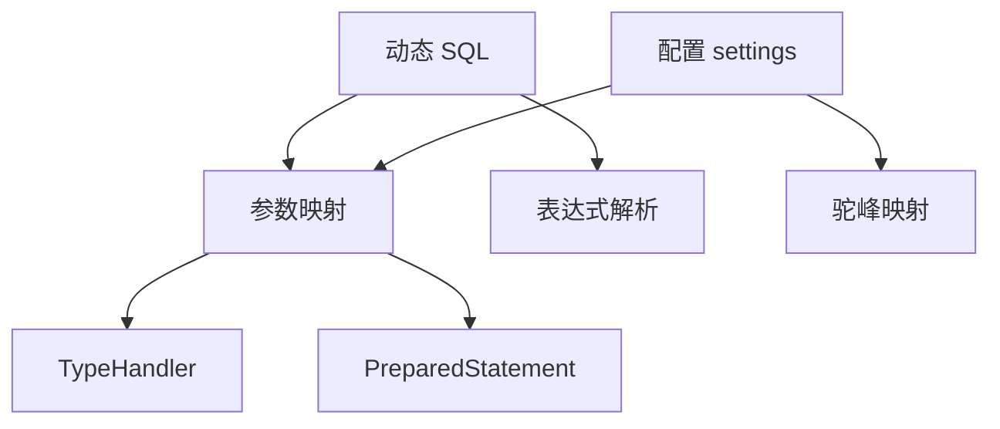

# 参数映射机制

<cite>
**本文引用的文件**
- [mapper.md](file://docs/backend-base/mybatis/mapper.md)
- [dynamic-sql.md](file://docs/backend-base/mybatis/dynamic-sql.md)
- [config.md](file://docs/backend-base/mybatis/config.md)
- [mybatis-mapper.md](file://docs/backend-base/mybatis/mybatis-mapper.md)
</cite>

## 目录
1. [简介](#简介)
2. [项目结构](#项目结构)
3. [核心组件](#核心组件)
4. [架构总览](#架构总览)
5. [详细组件分析](#详细组件分析)
6. [依赖分析](#依赖分析)
7. [性能考量](#性能考量)
8. [故障排查指南](#故障排查指南)
9. [结论](#结论)
10. [附录](#附录)

## 简介
本文件围绕 MyBatis 的参数映射机制展开，系统梳理简单参数映射与复杂参数映射的实现原理与使用方法，深入解析 #{} 占位符在预处理语句中的参数绑定、类型转换与空值处理等关键环节，并结合动态 SQL 提供参数处理的完整示例与最佳实践。文档同时覆盖参数命名策略、驼峰命名转换、类型处理器（TypeHandler）的使用，以及在动态 SQL 中的条件判断、循环遍历等高级用法。

## 项目结构
MyBatis 参数映射相关内容主要分布在以下文档：
- 参数映射与占位符说明：mapper.md
- 动态 SQL 与参数处理：dynamic-sql.md
- 配置与命名策略：config.md
- 结果映射与类型处理器：mybatis-mapper.md

图表来源
- [mapper.md:218-241](file://docs/backend-base/mybatis/mapper.md#L218-L241)
- [dynamic-sql.md:1-278](file://docs/backend-base/mybatis/dynamic-sql.md#L1-L278)
- [config.md:54-71](file://docs/backend-base/mybatis/config.md#L54-L71)
- [mybatis-mapper.md:50-135](file://docs/backend-base/mybatis/mybatis-mapper.md#L50-L135)

章节来源
- [mapper.md:1-242](file://docs/backend-base/mybatis/mapper.md#L1-L242)
- [dynamic-sql.md:1-278](file://docs/backend-base/mybatis/dynamic-sql.md#L1-L278)
- [config.md:1-240](file://docs/backend-base/mybatis/config.md#L1-L240)
- [mybatis-mapper.md:1-488](file://docs/backend-base/mybatis/mybatis-mapper.md#L1-L488)

## 核心组件
- 参数映射（Parameter Mapping）
  - 简单参数映射：原生类型或简单数据类型直接替代占位符
  - 复杂参数映射：对象属性访问，按属性名解析并绑定到预处理参数
- 占位符机制（#{}）
  - 预处理语句参数绑定，SQL 中以 ? 占位，运行时由 JDBC PreparedStatement 设置
- 动态 SQL（Dynamic SQL）
  - if/choose/where/set/trim/foreach/bind 等标签配合参数进行条件构建
- 命名策略与驼峰转换
  - mapUnderscoreToCamelCase 控制下划线到驼峰的自动映射
- 类型处理器（TypeHandler）
  - resultType/resultMap 中的 jdbcType/typeHandler 控制类型转换与空值处理

章节来源
- [mapper.md:218-241](file://docs/backend-base/mybatis/mapper.md#L218-L241)
- [dynamic-sql.md:1-278](file://docs/backend-base/mybatis/dynamic-sql.md#L1-L278)
- [config.md:62-62](file://docs/backend-base/mybatis/config.md#L62-L62)
- [mybatis-mapper.md:123-131](file://docs/backend-base/mybatis/mybatis-mapper.md#L123-L131)

## 架构总览
MyBatis 参数映射的整体流程：
- Mapper XML 解析：将 SQL 文本与参数占位符 #{}、动态标签组合解析
- 参数绑定：根据传入参数类型（简单/复杂/集合/Map）解析并绑定到 PreparedStatement
- 预处理执行：JDBC 预处理语句按顺序设置参数，避免 SQL 注入
- 结果映射：查询结果通过 TypeHandler 与自动映射/手动映射转换为 Java 对象

图表来源
- [mapper.md:19-25](file://docs/backend-base/mybatis/mapper.md#L19-L25)
- [dynamic-sql.md:1-278](file://docs/backend-base/mybatis/dynamic-sql.md#L1-L278)
- [mybatis-mapper.md:50-135](file://docs/backend-base/mybatis/mybatis-mapper.md#L50-L135)

## 详细组件分析

### 简单参数映射
- 适用场景：基本数据类型（如 int、String）或简单类型
- 绑定规则：#{} 直接以参数值替代，无需属性访问
- 示例路径：[简单参数映射示例:224-230](file://docs/backend-base/mybatis/mapper.md#L224-L230)

图表来源
- [mapper.md:220-230](file://docs/backend-base/mybatis/mapper.md#L220-L230)

章节来源
- [mapper.md:220-230](file://docs/backend-base/mybatis/mapper.md#L220-L230)

### 复杂参数映射
- 适用场景：对象参数（如 User）
- 绑定规则：#{} 按属性名解析对象属性，将属性值绑定到对应 ? 位置
- 示例路径：[复杂参数映射示例:236-241](file://docs/backend-base/mybatis/mapper.md#L236-L241)

图表来源
- [mapper.md:232-241](file://docs/backend-base/mybatis/mapper.md#L232-L241)

章节来源
- [mapper.md:232-241](file://docs/backend-base/mybatis/mapper.md#L232-L241)

### 占位符 #{} 工作机制
- 预处理绑定：SQL 中的 #{} 被替换为 ?，由 PreparedStatement 逐个设置
- 类型推断：parameterType 可省略，MyBatis 通过 TypeHandler 推断参数类型
- 示例路径：[占位符与预处理示例:19-25](file://docs/backend-base/mybatis/mapper.md#L19-L25)

图表来源
- [mapper.md:19-25](file://docs/backend-base/mybatis/mapper.md#L19-L25)
- [mapper.md:32-32](file://docs/backend-base/mybatis/mapper.md#L32-L32)

章节来源
- [mapper.md:19-25](file://docs/backend-base/mybatis/mapper.md#L19-L25)
- [mapper.md:32-32](file://docs/backend-base/mybatis/mapper.md#L32-L32)

### 动态 SQL 中的参数处理
- if/choose/where/set/trim/foreach/bind 等标签配合参数进行条件构建
- 空值处理：通过判空表达式决定是否拼接条件
- foreach 集合参数：支持 list/array/map，默认集合名可自定义
- 示例路径：
  - [if/where/set/choose/trim/foreach/bind 示例:1-278](file://docs/backend-base/mybatis/dynamic-sql.md#L1-L278)

图表来源
- [dynamic-sql.md:3-278](file://docs/backend-base/mybatis/dynamic-sql.md#L3-L278)

章节来源
- [dynamic-sql.md:1-278](file://docs/backend-base/mybatis/dynamic-sql.md#L1-L278)

### 参数命名策略与驼峰命名转换
- 命名策略：支持使用 @Param 注解自定义参数名
- 驼峰转换：mapUnderscoreToCamelCase 开启后，下划线字段自动映射到驼峰属性
- 示例路径：
  - [settings 中 mapUnderscoreToCamelCase:62-62](file://docs/backend-base/mybatis/config.md#L62-L62)
  - [自动映射示例:66-88](file://docs/backend-base/mybatis/mybatis-mapper.md#L66-L88)

图表来源
- [config.md:62-62](file://docs/backend-base/mybatis/config.md#L62-L62)
- [mybatis-mapper.md:66-88](file://docs/backend-base/mybatis/mybatis-mapper.md#L66-L88)

章节来源
- [config.md:62-62](file://docs/backend-base/mybatis/config.md#L62-L62)
- [mybatis-mapper.md:66-88](file://docs/backend-base/mybatis/mybatis-mapper.md#L66-L88)

### 类型处理器（TypeHandler）与空值处理
- 类型转换：resultType/resultMap 中可通过 jdbcType/typeHandler 指定类型处理器
- 空值处理：settings 中 jdbcTypeForNull 指定空值默认 JDBC 类型
- 示例路径：
  - [jdbcTypeForNull 配置:64-64](file://docs/backend-base/mybatis/config.md#L64-L64)
  - [typeHandler 属性说明:123-131](file://docs/backend-base/mybatis/mybatis-mapper.md#L123-L131)

图表来源
- [config.md:64-64](file://docs/backend-base/mybatis/config.md#L64-L64)
- [mybatis-mapper.md:123-131](file://docs/backend-base/mybatis/mybatis-mapper.md#L123-L131)

章节来源
- [config.md:64-64](file://docs/backend-base/mybatis/config.md#L64-L64)
- [mybatis-mapper.md:123-131](file://docs/backend-base/mybatis/mybatis-mapper.md#L123-L131)

### 参数映射示例（场景覆盖）
- 基本数据类型：简单参数映射示例
  - [示例路径:224-230](file://docs/backend-base/mybatis/mapper.md#L224-L230)
- 对象属性访问：复杂参数映射示例
  - [示例路径:236-241](file://docs/backend-base/mybatis/mapper.md#L236-L241)
- 集合参数处理：foreach 标签与集合参数
  - [示例路径:241-278](file://docs/backend-base/mybatis/dynamic-sql.md#L241-L278)
- Map 参数传递：collection 属性值为 map.keys/map.values/map.entrySet()
  - [示例路径:258-265](file://docs/backend-base/mybatis/dynamic-sql.md#L258-L265)
- 动态 SQL 条件判断与循环遍历：if/choose/where/set/trim/foreach/bind
  - [示例路径:1-278](file://docs/backend-base/mybatis/dynamic-sql.md#L1-L278)

章节来源
- [mapper.md:224-241](file://docs/backend-base/mybatis/mapper.md#L224-L241)
- [dynamic-sql.md:241-278](file://docs/backend-base/mybatis/dynamic-sql.md#L241-L278)

## 依赖分析
- 组件耦合
  - 参数映射依赖 SQL 解析器与 TypeHandler
  - 动态 SQL 依赖参数表达式解析（if/choose/where/set/trim/foreach/bind）
  - 命名策略依赖 @Param 注解与方法签名
- 外部依赖
  - JDBC 预处理语句（PreparedStatement）
  - 配置项 settings（mapUnderscoreToCamelCase、jdbcTypeForNull）

图表来源
- [mapper.md:19-25](file://docs/backend-base/mybatis/mapper.md#L19-L25)
- [dynamic-sql.md:1-278](file://docs/backend-base/mybatis/dynamic-sql.md#L1-L278)
- [config.md:62-64](file://docs/backend-base/mybatis/config.md#L62-L64)

章节来源
- [mapper.md:19-25](file://docs/backend-base/mybatis/mapper.md#L19-L25)
- [dynamic-sql.md:1-278](file://docs/backend-base/mybatis/dynamic-sql.md#L1-L278)
- [config.md:62-64](file://docs/backend-base/mybatis/config.md#L62-L64)

## 性能考量
- 预编译复用：#{} 使用预处理语句，避免重复解析与注入风险
- 自动映射与手动映射：合理使用自动映射与手动映射，减少不必要的列映射
- 动态 SQL：避免生成冗余 SQL 片段，必要时使用 trim/where/set 等标签
- 集合参数：在 foreach 中控制集合大小，避免一次性传入过大集合
- 驼峰映射：开启 mapUnderscoreToCamelCase 可减少列别名与映射配置

## 故障排查指南
- 占位符未生效
  - 检查参数类型与占位符匹配（简单/复杂/集合/Map）
  - 确认动态 SQL 表达式正确（if/choose/where/set/trim/foreach/bind）
  - 参考：[动态 SQL 示例:1-278](file://docs/backend-base/mybatis/dynamic-sql.md#L1-L278)
- 驼峰映射不生效
  - 检查 settings 中 mapUnderscoreToCamelCase 是否开启
  - 参考：[settings 配置:62-62](file://docs/backend-base/mybatis/config.md#L62-L62)
- 空值处理异常
  - 检查 jdbcTypeForNull 配置与列 jdbcType 指定
  - 参考：[jdbcTypeForNull 配置:64-64](file://docs/backend-base/mybatis/config.md#L64-L64)
- 类型转换异常
  - 检查 resultType/resultMap 中 jdbcType/typeHandler 配置
  - 参考：[typeHandler 属性说明:123-131](file://docs/backend-base/mybatis/mybatis-mapper.md#L123-L131)

章节来源
- [dynamic-sql.md:1-278](file://docs/backend-base/mybatis/dynamic-sql.md#L1-L278)
- [config.md:62-64](file://docs/backend-base/mybatis/config.md#L62-L64)
- [mybatis-mapper.md:123-131](file://docs/backend-base/mybatis/mybatis-mapper.md#L123-L131)

## 结论
MyBatis 的参数映射机制通过 #{} 占位符与预处理语句实现安全高效的参数绑定，结合动态 SQL 标签可灵活构建复杂查询。通过合理的命名策略、驼峰转换与类型处理器配置，可显著提升开发效率与系统稳定性。建议在实际项目中遵循统一的参数命名规范、谨慎使用动态 SQL、合理配置类型处理器与空值处理策略，以获得最佳实践效果。

## 附录
- 相关配置项速览
  - mapUnderscoreToCamelCase：开启下划线到驼峰的自动映射
  - jdbcTypeForNull：空值的默认 JDBC 类型
  - useActualParamName：使用方法签名中的参数名作为语句参数名
- 相关标签速览
  - if/choose/where/set/trim/foreach/bind：动态 SQL 参数处理
- 相关示例路径
  - [简单参数映射示例:224-230](file://docs/backend-base/mybatis/mapper.md#L224-L230)
  - [复杂参数映射示例:236-241](file://docs/backend-base/mybatis/mapper.md#L236-L241)
  - [动态 SQL 示例:1-278](file://docs/backend-base/mybatis/dynamic-sql.md#L1-L278)