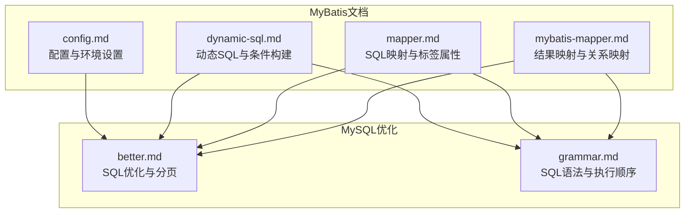
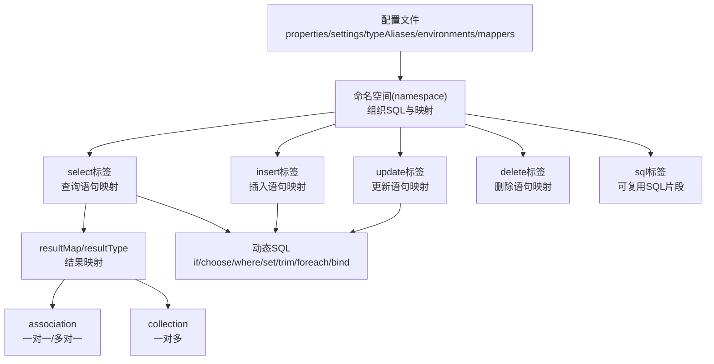
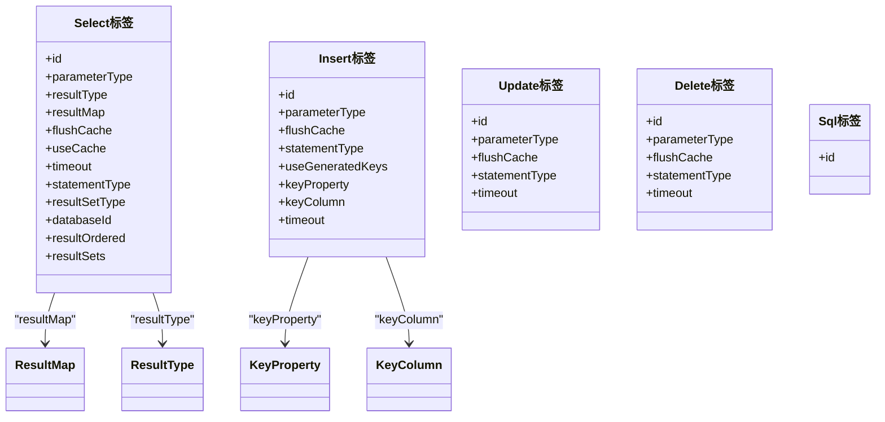
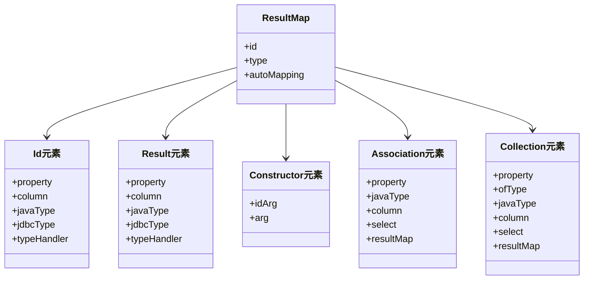
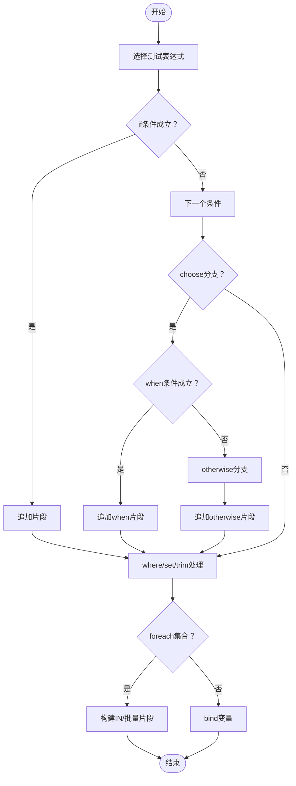
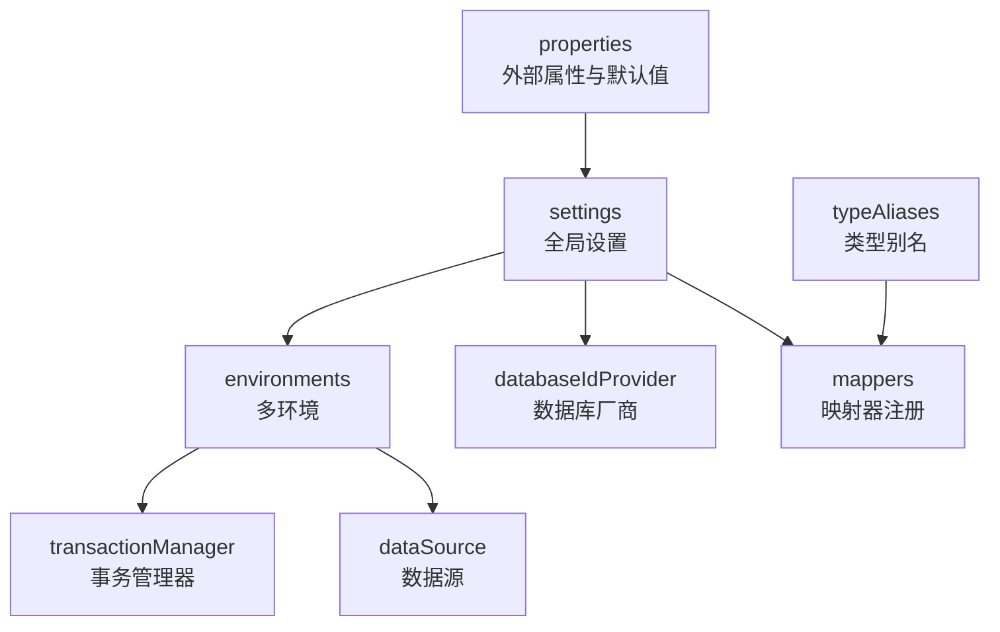
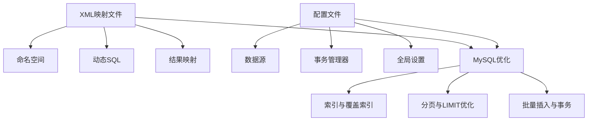

# MyBatis映射文件

<cite>
**本文档引用的文件**
- [mybatis-mapper.md](file://docs/backend-base/mybatis/mybatis-mapper.md)
- [mapper.md](file://docs/backend-base/mybatis/mapper.md)
- [dynamic-sql.md](file://docs/backend-base/mybatis/dynamic-sql.md)
- [config.md](file://docs/backend-base/mybatis/config.md)
- [better.md](file://docs/backend-base/mysql/better.md)
- [grammar.md](file://docs/backend-base/mysql/grammar.md)
</cite>

## 目录
1. [简介](#简介)
2. [项目结构](#项目结构)
3. [核心组件](#核心组件)
4. [架构概览](#架构概览)
5. [详细组件分析](#详细组件分析)
6. [依赖分析](#依赖分析)
7. [性能考量](#性能考量)
8. [故障排查指南](#故障排查指南)
9. [结论](#结论)
10. [附录](#附录)

## 简介
本技术文档围绕MyBatis XML映射文件展开，系统梳理了映射文件的结构与编写规范，涵盖select、insert、update、delete、sql、parameterMap、resultMap等核心元素的使用方法；深入讲解resultMap结果映射的配置技巧，包括基本类型映射、复合类型映射、关联关系映射、集合关系映射等；提供完整的SQL语句编写指南，包括查询优化、索引使用、分页实现等性能优化策略；覆盖复杂业务场景的SQL实现，如多表联查、子查询、存储过程调用等；并包含映射文件的调试方法与常见问题排查技巧，为开发者提供高质量的XML映射文件编写指导。

## 项目结构
本仓库中与MyBatis映射文件相关的知识主要集中在docs/backend-base/mybatis目录下的四篇Markdown文档，以及docs/backend-base/mysql目录下的SQL优化与语法文档。这些文档共同构成了MyBatis映射文件编写与优化的知识体系。

**图表来源**
- [mybatis-mapper.md:1-488](file://docs/backend-base/mybatis/mybatis-mapper.md#L1-L488)
- [mapper.md:1-242](file://docs/backend-base/mybatis/mapper.md#L1-L242)
- [dynamic-sql.md:1-278](file://docs/backend-base/mybatis/dynamic-sql.md#L1-L278)
- [config.md:1-240](file://docs/backend-base/mybatis/config.md#L1-L240)
- [better.md:1-123](file://docs/backend-base/mysql/better.md#L1-L123)
- [grammar.md:1-188](file://docs/backend-base/mysql/grammar.md#L1-L188)

**章节来源**
- [mybatis-mapper.md:1-488](file://docs/backend-base/mybatis/mybatis-mapper.md#L1-L488)
- [mapper.md:1-242](file://docs/backend-base/mybatis/mapper.md#L1-L242)
- [dynamic-sql.md:1-278](file://docs/backend-base/mybatis/dynamic-sql.md#L1-L278)
- [config.md:1-240](file://docs/backend-base/mybatis/config.md#L1-L240)
- [better.md:1-123](file://docs/backend-base/mysql/better.md#L1-L123)
- [grammar.md:1-188](file://docs/backend-base/mysql/grammar.md#L1-L188)

## 核心组件
- SQL映射标签族：select、insert、update、delete、sql，用于映射查询、插入、更新、删除与可复用SQL片段。
- 结果映射：resultMap、resultType、id、result、constructor、association、collection等，用于将查询结果映射到Java对象。
- 动态SQL：if、choose/when/otherwise、where、set、trim、foreach、bind等，用于根据条件动态生成SQL。
- 配置与环境：properties、settings、typeAliases、environments、transactionManager、dataSource、databaseIdProvider、mappers等，用于配置运行环境与数据源。

**章节来源**
- [mapper.md:3-45](file://docs/backend-base/mybatis/mapper.md#L3-L45)
- [mybatis-mapper.md:92-132](file://docs/backend-base/mybatis/mybatis-mapper.md#L92-L132)
- [dynamic-sql.md:3-92](file://docs/backend-base/mybatis/dynamic-sql.md#L3-L92)
- [config.md:54-240](file://docs/backend-base/mybatis/config.md#L54-L240)

## 架构概览
MyBatis XML映射文件通过命名空间组织SQL语句与结果映射，结合动态SQL实现灵活的查询构建；通过配置文件统一管理数据源、事务与缓存策略；配合MySQL的索引与分页优化，实现高性能的数据访问。

**图表来源**
- [mapper.md:5-45](file://docs/backend-base/mybatis/mapper.md#L5-L45)
- [mybatis-mapper.md:100-132](file://docs/backend-base/mybatis/mybatis-mapper.md#L100-L132)
- [dynamic-sql.md:3-92](file://docs/backend-base/mybatis/dynamic-sql.md#L3-L92)
- [config.md:54-240](file://docs/backend-base/mybatis/config.md#L54-L240)

## 详细组件分析

### SQL映射标签详解
- select标签：用于查询语句映射，支持resultType与resultMap返回类型选择，支持缓存、超时、语句类型、结果集类型等属性。
- insert、update、delete标签：用于DML语句映射，支持flushCache、statementType、timeout等属性；insert特有useGeneratedKeys、keyProperty、keyColumn等。
- sql标签：定义可复用SQL片段，支持属性化参数与include引用。

**图表来源**
- [mapper.md:27-45](file://docs/backend-base/mybatis/mapper.md#L27-L45)
- [mapper.md:46-91](file://docs/backend-base/mybatis/mapper.md#L46-L91)
- [mapper.md:177-216](file://docs/backend-base/mybatis/mapper.md#L177-L216)

**章节来源**
- [mapper.md:5-45](file://docs/backend-base/mybatis/mapper.md#L5-L45)
- [mapper.md:46-91](file://docs/backend-base/mybatis/mapper.md#L46-L91)
- [mapper.md:177-216](file://docs/backend-base/mybatis/mapper.md#L177-L216)

### 结果映射与关系映射
- 基本映射：id与result元素映射简单类型，id用于标识属性，有助于性能与缓存。
- 复杂映射：constructor用于构造方法注入；association处理一对一/多对一；collection处理一对多。
- 嵌套查询与嵌套结果：association/collection支持select属性与resultMap属性，分别对应嵌套Select查询与嵌套结果映射。
- 自动映射：mapUnderscoreToCamelCase开启驼峰命名映射，减少手动映射工作量。

**图表来源**
- [mybatis-mapper.md:92-132](file://docs/backend-base/mybatis/mybatis-mapper.md#L92-L132)
- [mybatis-mapper.md:133-162](file://docs/backend-base/mybatis/mybatis-mapper.md#L133-L162)
- [mybatis-mapper.md:234-298](file://docs/backend-base/mybatis/mybatis-mapper.md#L234-L298)

**章节来源**
- [mybatis-mapper.md:90-132](file://docs/backend-base/mybatis/mybatis-mapper.md#L90-L132)
- [mybatis-mapper.md:133-162](file://docs/backend-base/mybatis/mybatis-mapper.md#L133-L162)
- [mybatis-mapper.md:234-298](file://docs/backend-base/mybatis/mybatis-mapper.md#L234-L298)

### 动态SQL与条件构建
- 条件分支：if、choose/when/otherwise，实现多条件择优与条件组合。
- where与set：自动处理WHERE子句与SET子句的前置与逗号消除，避免手写冗余。
- trim：灵活控制前缀、后缀与多余关键字的去除。
- foreach：支持集合、数组、Map遍历，常用于IN条件与批量插入。
- bind：在映射文件中定义变量，便于模糊匹配等场景。

**图表来源**
- [dynamic-sql.md:3-92](file://docs/backend-base/mybatis/dynamic-sql.md#L3-L92)
- [dynamic-sql.md:115-156](file://docs/backend-base/mybatis/dynamic-sql.md#L115-L156)
- [dynamic-sql.md:157-213](file://docs/backend-base/mybatis/dynamic-sql.md#L157-L213)
- [dynamic-sql.md:241-278](file://docs/backend-base/mybatis/dynamic-sql.md#L241-L278)

**章节来源**
- [dynamic-sql.md:3-92](file://docs/backend-base/mybatis/dynamic-sql.md#L3-L92)
- [dynamic-sql.md:115-156](file://docs/backend-base/mybatis/dynamic-sql.md#L115-L156)
- [dynamic-sql.md:157-213](file://docs/backend-base/mybatis/dynamic-sql.md#L157-L213)
- [dynamic-sql.md:241-278](file://docs/backend-base/mybatis/dynamic-sql.md#L241-L278)

### 配置与环境设置
- properties：外部属性文件与动态替换，支持默认值特性。
- settings：全局设置项，如cacheEnabled、mapUnderscoreToCamelCase、localCacheScope、jdbcTypeForNull等。
- typeAliases：类型别名简化配置。
- environments：多环境配置，transactionManager与dataSource类型选择。
- databaseIdProvider：多厂商数据库支持。
- mappers：映射器注册方式，支持资源路径、URL、接口类、包扫描。

**图表来源**
- [config.md:3-53](file://docs/backend-base/mybatis/config.md#L3-L53)
- [config.md:54-71](file://docs/backend-base/mybatis/config.md#L54-L71)
- [config.md:72-98](file://docs/backend-base/mybatis/config.md#L72-L98)
- [config.md:106-147](file://docs/backend-base/mybatis/config.md#L106-L147)
- [config.md:185-196](file://docs/backend-base/mybatis/config.md#L185-L196)
- [config.md:199-240](file://docs/backend-base/mybatis/config.md#L199-L240)

**章节来源**
- [config.md:3-53](file://docs/backend-base/mybatis/config.md#L3-L53)
- [config.md:54-71](file://docs/backend-base/mybatis/config.md#L54-L71)
- [config.md:72-98](file://docs/backend-base/mybatis/config.md#L72-L98)
- [config.md:106-147](file://docs/backend-base/mybatis/config.md#L106-L147)
- [config.md:185-196](file://docs/backend-base/mybatis/config.md#L185-L196)
- [config.md:199-240](file://docs/backend-base/mybatis/config.md#L199-L240)

## 依赖分析
- 映射文件依赖：命名空间(namespace)组织SQL与映射；动态SQL依赖参数对象属性；结果映射依赖实体类字段与驼峰命名设置。
- 配置依赖：数据源与事务管理器影响SQL执行与事务控制；缓存设置影响查询性能；数据库厂商配置影响SQL方言。
- 性能依赖：索引设计与查询计划影响SQL执行效率；分页策略与覆盖索引优化LIMIT查询；批量插入与事务提交提升写入性能。

**图表来源**
- [mapper.md:3-45](file://docs/backend-base/mybatis/mapper.md#L3-L45)
- [dynamic-sql.md:3-92](file://docs/backend-base/mybatis/dynamic-sql.md#L3-L92)
- [mybatis-mapper.md:90-132](file://docs/backend-base/mybatis/mybatis-mapper.md#L90-L132)
- [config.md:54-147](file://docs/backend-base/mybatis/config.md#L54-L147)
- [better.md:87-123](file://docs/backend-base/mysql/better.md#L87-L123)

**章节来源**
- [mapper.md:3-45](file://docs/backend-base/mybatis/mapper.md#L3-L45)
- [dynamic-sql.md:3-92](file://docs/backend-base/mybatis/dynamic-sql.md#L3-L92)
- [mybatis-mapper.md:90-132](file://docs/backend-base/mybatis/mybatis-mapper.md#L90-L132)
- [config.md:54-147](file://docs/backend-base/mybatis/config.md#L54-L147)
- [better.md:87-123](file://docs/backend-base/mysql/better.md#L87-L123)

## 性能考量
- 查询优化：合理使用索引，避免FileSort；优先使用覆盖索引；优化ORDER BY与GROUP BY。
- 分页优化：使用覆盖索引与子查询方式减少OFFSET扫描；控制单页大小与总页数。
- 写入优化：批量插入与事务提交；主键顺序插入；必要时使用LOAD DATA LOCAL INFILE。
- 结果映射优化：开启mapUnderscoreToCamelCase减少手动映射；合理使用resultMap与自动映射；避免N+1查询问题，优先嵌套结果映射。
- 缓存策略：合理设置useCache与flushCache；理解本地缓存与二级缓存的作用域与失效策略。

**章节来源**
- [better.md:67-123](file://docs/backend-base/mysql/better.md#L67-L123)
- [mybatis-mapper.md:66-88](file://docs/backend-base/mybatis/mybatis-mapper.md#L66-L88)
- [mapper.md:36-44](file://docs/backend-base/mybatis/mapper.md#L36-L44)

## 故障排查指南
- 动态SQL语法错误：检查where/set/trim标签的前置与逗号处理；确保if条件表达式正确。
- 结果映射异常：确认resultMap中property与column匹配；检查驼峰命名设置；验证实体类字段是否存在。
- 主键生成问题：核对useGeneratedKeys、keyProperty、keyColumn配置；在不支持自动生成的数据库中使用selectKey。
- 数据源与事务问题：检查environments配置；确认transactionManager与dataSource类型；验证连接参数。
- 日志与调试：通过settings中的logPrefix与logImpl设置日志输出；利用数据库日志与慢查询日志定位问题。

**章节来源**
- [dynamic-sql.md:115-156](file://docs/backend-base/mybatis/dynamic-sql.md#L115-L156)
- [mybatis-mapper.md:66-88](file://docs/backend-base/mybatis/mybatis-mapper.md#L66-L88)
- [mapper.md:86-108](file://docs/backend-base/mybatis/mapper.md#L86-L108)
- [config.md:106-147](file://docs/backend-base/mybatis/config.md#L106-L147)
- [config.md:54-71](file://docs/backend-base/mybatis/config.md#L54-L71)

## 结论
MyBatis XML映射文件通过清晰的标签体系与灵活的动态SQL能力，为复杂业务场景提供了强大的数据访问支持。结合合理的配置与MySQL优化策略，可在保证开发效率的同时显著提升系统性能。建议在实际项目中遵循本文档的编写规范与优化建议，持续完善映射文件的设计与实现。

## 附录
- 常用SQL语法与执行顺序：FROM -> WHERE -> GROUP BY -> HAVING -> SELECT -> ORDER BY -> LIMIT，有助于理解分页与排序优化。
- MySQL语法要点：DDL、DML、DQL的基本用法与约束，为映射文件中的SQL编写提供基础。

**章节来源**
- [grammar.md:120-125](file://docs/backend-base/mysql/grammar.md#L120-L125)