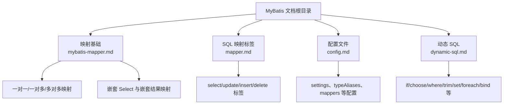
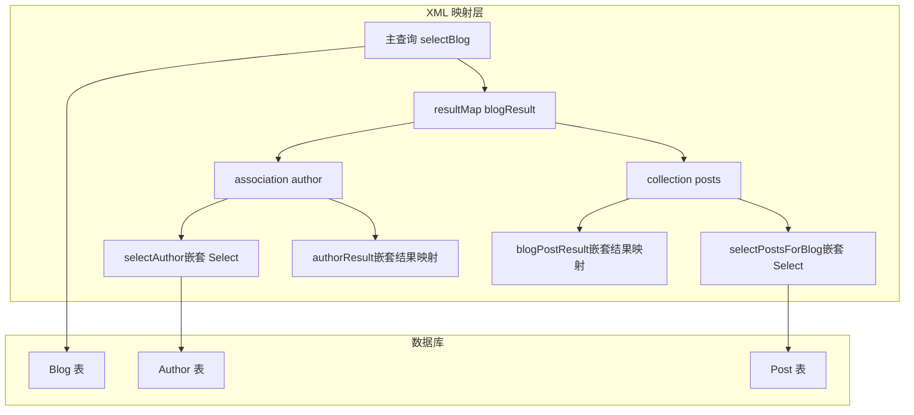
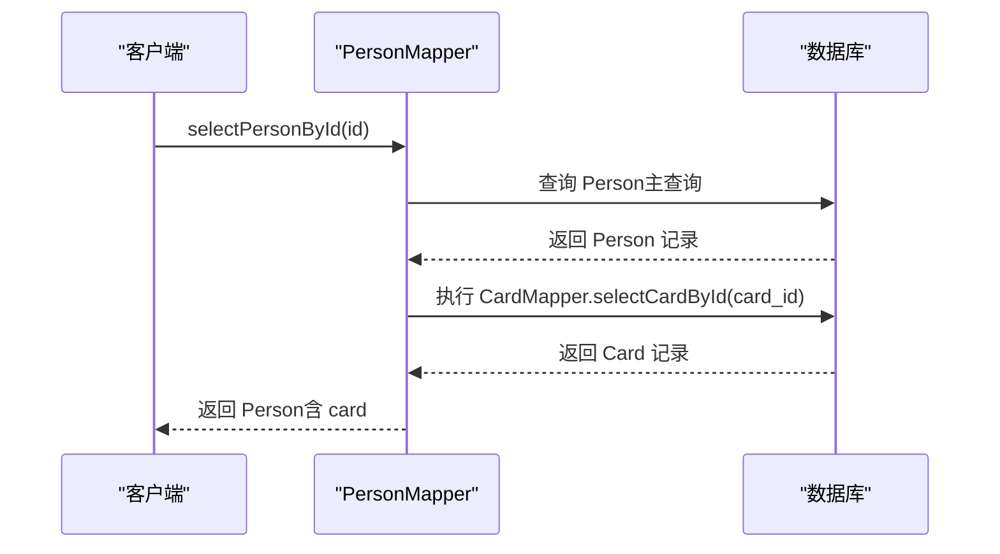
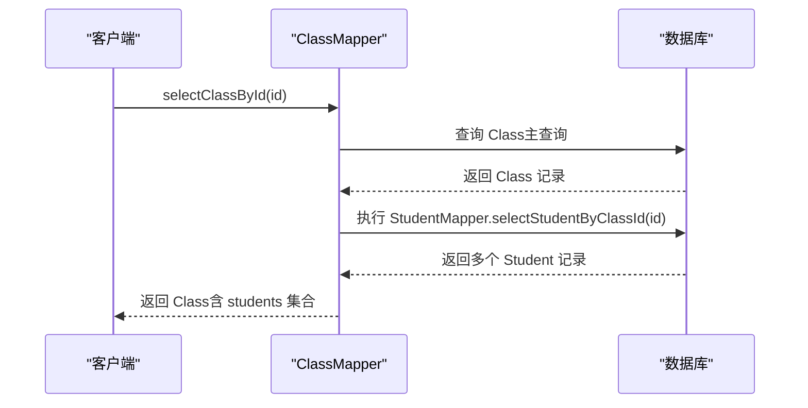
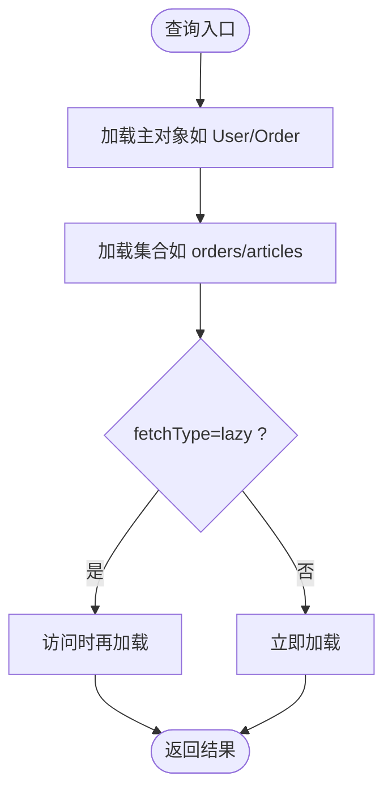
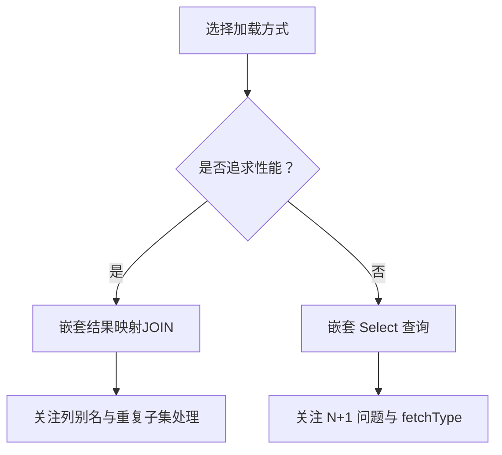
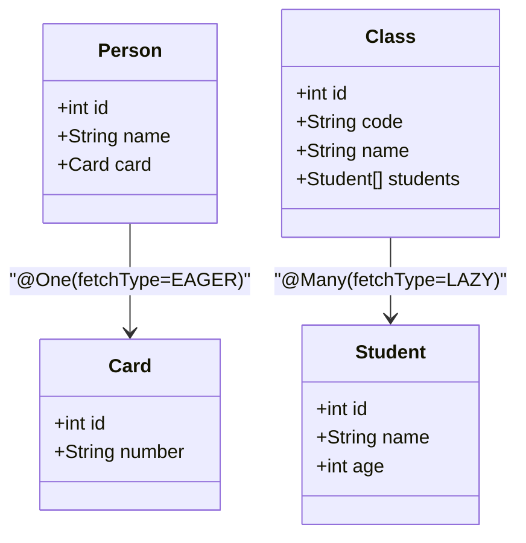
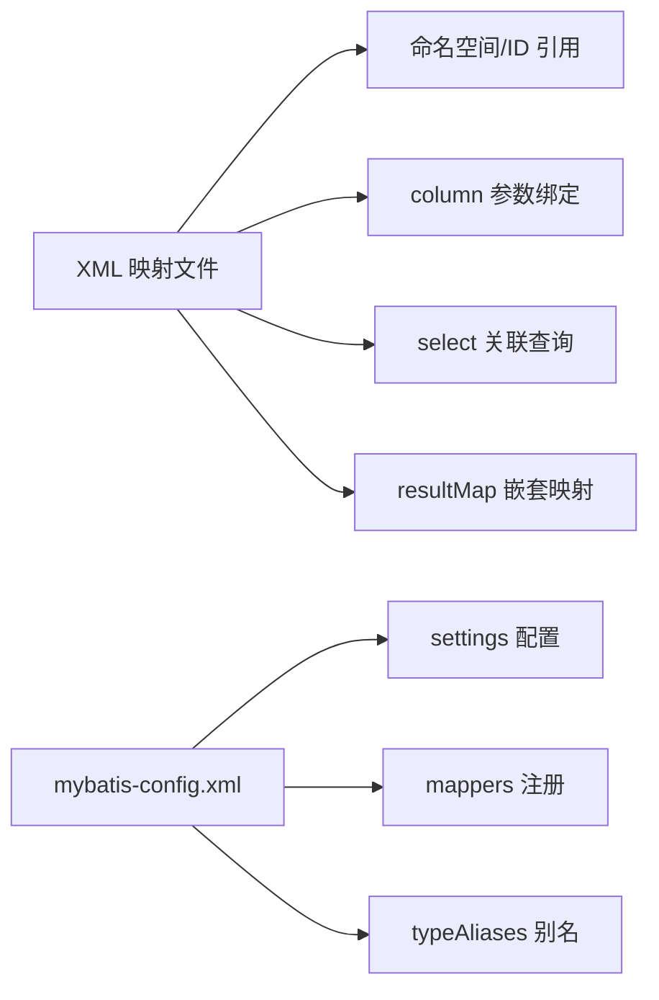

# 关联关系映射

<cite>
**本文引用的文件**
- [mybatis-mapper.md](file://docs/backend-base/mybatis/mybatis-mapper.md)
- [mapper.md](file://docs/backend-base/mybatis/mapper.md)
- [config.md](file://docs/backend-base/mybatis/config.md)
- [dynamic-sql.md](file://docs/backend-base/mybatis/dynamic-sql.md)
</cite>

## 目录
1. [简介](#简介)
2. [项目结构](#项目结构)
3. [核心组件](#核心组件)
4. [架构总览](#架构总览)
5. [详细组件分析](#详细组件分析)
6. [依赖分析](#依赖分析)
7. [性能考量](#性能考量)
8. [故障排查指南](#故障排查指南)
9. [结论](#结论)
10. [附录](#附录)

## 简介
本文件围绕 MyBatis 的关联关系映射展开，系统讲解一对一、一对多、多对多三类关系的映射实现方法，深入对比“嵌套 Select 查询”和“嵌套结果映射”两种加载方式的差异与适用场景，并结合 fetchType 属性的使用与性能影响，给出复杂关联查询的优化策略与常见问题解决方案。文档同时提供配置文件与实体类设计的思路指引，帮助读者在实际项目中高效落地。

## 项目结构
本仓库与 MyBatis 关联映射相关的核心内容集中在 backend-base/mybatis 文档目录中，包含映射基础、SQL 映射标签、配置文件、动态 SQL 等主题。本文档聚焦于关联映射与 fetchType 的使用，其余章节作为背景知识参考。

**图表来源**
- [mybatis-mapper.md:1-488](file://docs/backend-base/mybatis/mybatis-mapper.md#L1-L488)
- [mapper.md:1-242](file://docs/backend-base/mybatis/mapper.md#L1-L242)
- [config.md:1-240](file://docs/backend-base/mybatis/config.md#L1-L240)
- [dynamic-sql.md:1-278](file://docs/backend-base/mybatis/dynamic-sql.md#L1-L278)

**章节来源**
- [mybatis-mapper.md:1-488](file://docs/backend-base/mybatis/mybatis-mapper.md#L1-L488)
- [mapper.md:1-242](file://docs/backend-base/mybatis/mapper.md#L1-L242)
- [config.md:1-240](file://docs/backend-base/mybatis/config.md#L1-L240)
- [dynamic-sql.md:1-278](file://docs/backend-base/mybatis/dynamic-sql.md#L1-L278)

## 核心组件
- 关联映射（association）：用于“有一个类型”的关系，如博客与作者。
- 集合映射（collection）：用于“有多类型”的关系，如博客与文章集合。
- 嵌套 Select 查询：通过执行另一个 SQL 映射语句加载复杂类型。
- 嵌套结果映射：使用嵌套的结果映射处理连接结果的重复子集。
- fetchType：控制关联加载策略（eager/lazy），影响性能与访问行为。

**章节来源**
- [mybatis-mapper.md:109-115](file://docs/backend-base/mybatis/mybatis-mapper.md#L109-L115)
- [mybatis-mapper.md:234-298](file://docs/backend-base/mybatis/mybatis-mapper.md#L234-L298)
- [mybatis-mapper.md:300-413](file://docs/backend-base/mybatis/mybatis-mapper.md#L300-L413)

## 架构总览
下图展示 MyBatis 关联映射在 XML 映射文件中的典型结构：主查询负责顶层对象，association/collection 负责加载关联对象；两种加载方式分别对应“嵌套 Select 查询”和“嵌套结果映射”。

**图表来源**
- [mybatis-mapper.md:243-298](file://docs/backend-base/mybatis/mybatis-mapper.md#L243-L298)
- [mybatis-mapper.md:167-232](file://docs/backend-base/mybatis/mybatis-mapper.md#L167-L232)

## 详细组件分析

### 一对一映射
- 适用场景：主表与从表一一对应，如个人与身份证。
- 实现要点：
  - 主查询返回主对象；
  - association 指定关联对象的 javaType；
  - 通过 column 传递外键值，select 指向另一个查询；
  - 关联对象的查询独立执行，形成 N+1 问题风险。

**图表来源**
- [mybatis-mapper.md:300-339](file://docs/backend-base/mybatis/mybatis-mapper.md#L300-L339)

**章节来源**
- [mybatis-mapper.md:300-339](file://docs/backend-base/mybatis/mybatis-mapper.md#L300-L339)

### 一对多映射
- 适用场景：主表与从表一对多，如班级与学生。
- 实现要点：
  - 主查询返回主对象；
  - collection 指定集合类型（javaType/ofType）；
  - 通过 column 传递主键值，select 指向从表查询；
  - fetchType="lazy" 为默认推荐，避免不必要的 N+1。

**图表来源**
- [mybatis-mapper.md:341-371](file://docs/backend-base/mybatis/mybatis-mapper.md#L341-L371)

**章节来源**
- [mybatis-mapper.md:341-371](file://docs/backend-base/mybatis/mybatis-mapper.md#L341-L371)

### 多对多映射
- 适用场景：中间表维护多对多关系，如用户与订单、订单与商品。
- 实现要点：
  - 通过 collection 加载一方集合；
  - fetchType="lazy" 推荐；
  - 可在关联对象中继续使用 association 或 collection，形成多层嵌套。

**图表来源**
- [mybatis-mapper.md:379-413](file://docs/backend-base/mybatis/mybatis-mapper.md#L379-L413)

**章节来源**
- [mybatis-mapper.md:379-413](file://docs/backend-base/mybatis/mybatis-mapper.md#L379-L413)

### 嵌套 Select 查询 vs 嵌套结果映射
- 嵌套 Select 查询
  - 优点：实现简单，逻辑清晰；
  - 缺点：易引发 N+1 查询问题，性能较差；
  - 适用：数据量较小或对实现简洁性优先的场景。
- 嵌套结果映射
  - 优点：通过 JOIN 一次性获取，减少查询次数；
  - 缺点：SQL 较复杂，列别名管理成本高；
  - 适用：数据量较大、性能敏感的场景。

**图表来源**
- [mybatis-mapper.md:234-298](file://docs/backend-base/mybatis/mybatis-mapper.md#L234-L298)

**章节来源**
- [mybatis-mapper.md:234-298](file://docs/backend-base/mybatis/mybatis-mapper.md#L234-L298)

### fetchType 属性详解与性能影响
- 取值：eager（立即加载）、lazy（懒加载）。
- 性能影响：
  - eager：查询主对象时即加载关联，适合“确定会使用”的场景，减少后续访问的延迟；
  - lazy：仅在访问集合时触发查询，适合“不确定是否使用”的场景，避免 N+1 问题。
- 最佳实践：
  - 一对多集合默认使用 lazy；
  - 一对一对象可按需选择 eager，提升访问效率；
  - 在复杂查询中，结合嵌套结果映射与列别名，减少不必要的 JOIN。

**章节来源**
- [mybatis-mapper.md:359-377](file://docs/backend-base/mybatis/mybatis-mapper.md#L359-L377)
- [mybatis-mapper.md:396-413](file://docs/backend-base/mybatis/mybatis-mapper.md#L396-L413)

### 注解方式的关联映射
- @One/@Many：分别对应 association/collection 的注解形式；
- fetchType：可设置为 EAGER/LAZY；
- 适用场景：注解驱动的轻量级映射，适合简单场景或快速原型。

**图表来源**
- [mybatis-mapper.md:415-462](file://docs/backend-base/mybatis/mybatis-mapper.md#L415-L462)

**章节来源**
- [mybatis-mapper.md:415-462](file://docs/backend-base/mybatis/mybatis-mapper.md#L415-L462)

## 依赖分析
- XML 映射文件依赖：
  - 主查询与 association/collection 的命名空间与 id；
  - column 与 select 的参数绑定；
  - 嵌套结果映射中的列别名与子 resultMap。
- 配置文件依赖：
  - settings 中的驼峰映射、本地缓存等；
  - mappers 的扫描与注册；
  - typeAliases 的类型别名简化。

**图表来源**
- [mybatis-mapper.md:167-232](file://docs/backend-base/mybatis/mybatis-mapper.md#L167-L232)
- [config.md:54-98](file://docs/backend-base/mybatis/config.md#L54-L98)

**章节来源**
- [config.md:54-98](file://docs/backend-base/mybatis/config.md#L54-L98)
- [mybatis-mapper.md:167-232](file://docs/backend-base/mybatis/mybatis-mapper.md#L167-L232)

## 性能考量
- N+1 查询问题
  - 嵌套 Select 查询易引发 N+1，可通过 fetchType="lazy" 与嵌套结果映射缓解。
- JOIN 与列别名
  - 嵌套结果映射需为连接列设置清晰别名，避免歧义与重复子集处理困难。
- 缓存与本地缓存
  - 合理使用二级缓存与本地缓存，结合 useCache、flushCache 控制缓存策略。
- 动态 SQL 与条件过滤
  - 使用 if/choose/where/trim 等标签减少不必要的 JOIN 与列扫描。

**章节来源**
- [mybatis-mapper.md:263-264](file://docs/backend-base/mybatis/mybatis-mapper.md#L263-L264)
- [mapper.md:36-44](file://docs/backend-base/mybatis/mapper.md#L36-L44)
- [dynamic-sql.md:3-91](file://docs/backend-base/mybatis/dynamic-sql.md#L3-L91)

## 故障排查指南
- 列名与属性名不匹配
  - 使用列别名或开启驼峰映射 settings.mapUnderscoreToCamelCase。
- 嵌套结果映射列别名冲突
  - 使用 columnPrefix 区分不同子表列，确保别名唯一。
- fetchType 选择不当
  - 一对多集合默认 lazy，避免 N+1；一对一可按需 eager 提升访问效率。
- 动态 SQL 语法错误
  - 使用 where/trim/set 等标签规范 SQL 片段，避免多余的 and/or。
- 缓存命中异常
  - 检查 useCache、flushCache 与数据库一致性需求。

**章节来源**
- [mybatis-mapper.md:66-88](file://docs/backend-base/mybatis/mybatis-mapper.md#L66-L88)
- [mybatis-mapper.md:218-232](file://docs/backend-base/mybatis/mybatis-mapper.md#L218-L232)
- [mapper.md:36-44](file://docs/backend-base/mybatis/mapper.md#L36-L44)
- [dynamic-sql.md:115-156](file://docs/backend-base/mybatis/dynamic-sql.md#L115-L156)

## 结论
- 一对一、一对多、多对多映射在 MyBatis 中均可通过 association 与 collection 实现；
- 嵌套 Select 查询实现简单但易引发 N+1，嵌套结果映射性能更优但 SQL 更复杂；
- fetchType 的合理选择是平衡性能与访问行为的关键；
- 结合动态 SQL、缓存与列别名管理，可显著提升复杂关联查询的稳定性与性能。

## 附录
- 实体类设计建议
  - 主对象：包含基础属性与关联对象/集合；
  - 关联对象：尽量使用不可变或只读结构，避免在懒加载期间并发修改；
  - 集合：优先使用 List，明确 ofType/javaType。
- 配置文件要点
  - settings：mapUnderscoreToCamelCase、localCacheScope、useGeneratedKeys；
  - mappers：按包扫描或显式注册；
  - typeAliases：为常用实体设置简短别名，提升可读性。

**章节来源**
- [config.md:54-98](file://docs/backend-base/mybatis/config.md#L54-L98)
- [mapper.md:27-44](file://docs/backend-base/mybatis/mapper.md#L27-L44)